# 基础

## nullptr

传统 C++ 会把 NULL、0 视为同一种东西，这取决于编译器如何定义 NULL，有些编译器会将 NULL 定义为 `((void*)0)`，有些则会直接将其定义为 0。

C++ 不允许直接将 `void *` 隐式转换到其他类型。但如果编译器尝试把 NULL 定义为 `((void*)0)`，那么在下面这句代码中：

```
char *ch = NULL; //@ 不合法
```

而将 NULL 定义成 0 将导致 C++ 中重载特性发生混乱：

```
void foo(char*);
void foo(int);

//@ 实际调用 foo 函数
foo(NULL); //@ 将调用 foo(int)
```

为了解决这个问题，C++11 引入了 nullptr 关键字，专门用来区分空指针、0。而 nullptr 的类型为 nullptr_t，能够隐式的转换为任何指针或成员指针的类型，也能和他们进行相等或者不等的比较。

```
if (std::is_same<decltype(NULL), decltype(0)>::value)
	std::cout << "NULL == 0" << std::endl;
if (std::is_same<decltype(NULL), decltype((void*)0)>::value)
	std::cout << "NULL == (void*)0" << std::endl;
if (std::is_same<decltype(NULL), std::nullptr_t>::value)
	std::cout << "NULL == nullptr" << std::endl;
```

## constexpr

### constexpr 变量  

常量表达式指值不会改变并且在编译过程就能得到计算结果的表达式，一个对象是否为常量表达式由它的数据类型和初始值共同决定：

字面值是常量表达式，由常量表达式初始化的 const 对象也是常量表达式：

```
const int max_files = 20;           //@ max_files 是常量表达式
const int limit = max_files + 1;    //@ limit 是常量表达式
int staff_size = 27;        //@ staff_size 不是常量表达式
const int sz = get_size();  //@ sz 不是常量表达式
```

C++11 允许将变量声明为 constexpr 类型以便由编译器来验证变量的值是否是一个常量表达式。

声明为 constexpr 的变量一定是一个常量：

- constexpr 变量必须立即初始化  
- 初始化只能使用字面量或常量表达式，后者不允许调用任何非 constexpr 函数  

```
constexpr int mf = 20;          //@ 20 是常量表达式
constexpr int limit = mf + 1;   //@ mf + 1 是常量表达式
constexpr int sz = size();      //@ 仅当 size 函数是常量函数时才合法
```

一般来说，如果你认定变量是一个常量表达式，那就把它声明成 constexpr 类型。

const 和 constexpr 限定的值都是常量。但 constexpr 对象的值必须在编译期间确定，而 const 对象的值可以延迟到运行期间确定。

与 const 不同，在 constexpr  声明中如果定义了一个指针，限定符 constexpr 仅对指针本身有效，与指针所指的对象无关：

```
constexpr int *p1 = nullptr;	//@ p1 是指向 int 的 const 指针
const int * p2 = nullptr;		//@ p2 是指向 const int 的普通指针	
constexpr const int * p3 = nullptr;   //@ p3 是指向 const int 的 const 指针	
```

### constexpr 函数

constexpr 函数是指能用于常量表达式的函数，要检验一个 constexpr 函数能不能产生一个真正的编译期常量，可以把结果赋给一个constexpr 变量。成功的话，我们就确认了。

C++ 11 中对 constexpr 函数的约定：

- 函数体中必须有且只有一条 return 语句，并且函数必须有返回值
- 在使用前必须已经定义
- 体内可以包含其它语句，但是这些语句在运行时不执行任何操作就行。例如，可以有空语句、类型别名以及 using 声明

```
constexpr int new_sz() { return 42; }
constexpr int foo = new_sz();
```

从 C++14 开始，constexpr 函数可以在内部使用局部变量、循环和分支等简单语句：

```
constexpr int fibonacci(const int n) {
    if(n == 1) return 1;
    if(n == 2) return 1;
    return fibonacci(n-1) + fibonacci(n-2);
}

//@ C++ 11 中只能写作：
constexpr int fibonacci(const int n) {
    return n == 1 || n == 2 ? 1 : fibonacci(n-1) + fibonacci(n-2);
}
```

### 字面值常量类

constexpr函数的参数和返回值必须是字面值类型，除了算术类型、引用和指针外，某些类也是字面值类型：

- 数据成员都是字面值类型的聚合类是字面值常量类
- 如果一个类不是聚合类，但它符合下述要求，则它也是一个字面值常量类：
  - 数据成员都必须是字面值类型
  - 类必须至少含有一个 constexpr 构造函数
  - 如果一个数据成员含有类内初始值，则内置类型成员的初始值必须是一条常量表达式；或者如果成员属于某种类类型，则初始值必须使用成员自己的constexpr 构造函数
  - 类必须使用析构函数的默认定义，该成员负责销毁类的对象

```
struct Date final
{
	constexpr Date(int y, int m, int d) noexcept : year_(y), month_(m), day_(d) {}

	constexpr int get_year() const noexcept { return year_; }
	constexpr int get_month() const noexcept { return month_; }
	constexpr int get_day() const noexcept { return day_; }

private:
	int year_;
	int month_;
	int day_;
};

//@ 应用
Date PRCFound = { 1949,10,1 };
```

## 变量及其初始化

### 统一初始化方法

列表初始化统一了初始化方法，它可以用于任何类型对象的初始化：

```
int arr[]{ 1,2,3 };  //@ 初始化数组

//@ 初始化 STL
std::map<std::string, int> mm = { {"1",1},{ "2",2} ,{ "3",3 } ,{ "4",4 } };
std::set<int> ss{1,2,3,4,5,6};
std::vector<int> vec{1,2,3,4,5};

struct A
{
    int x;
    struct B
    {
        int y;
        int z;
    }b;
};
A a{ 1,{ 2,3 } }; //@ 初始化 POD 类型

int* array = new int[3]{ 1,2,3 }; //@ 初始化动态分配的内存

class Foo
{
public:
	Foo(int,double) {}
};

Foo func()
{
	return{ 1,12.34 }; //@ 初始化返回类型
}
```

### 初始化列表的赋值方式

- 对于聚合类型的初始化将以拷贝的形式，用初始化列表中的值来初始化
- 对于其它类型，需要使用构造函数来初始化

聚合类型：

- 普通数组， int[10]，char[6]
- 类型是一个类(struct，class，union)并且：
  - 所有成员都是 public 的
  - 没有定义任何构造函数
  - 没有类内初始化
  - 无虚函数
  - 无基类

```
struct ST
{
	int x;
	double y;
protected:
	int z;
};
ST s{ 1,2.012,3 }; //@ 错误，类中有受保护的(私有的)非静态数据成员

struct ST
{
	int x;
	double y;
private:
	static int z;
};
ST s1{ 1,2.012}; //@ 正确
ST s2{ 1,2.012，3}; //@ 错误，静态成员不能通过初始化列表初始化，需要遵守静态成员的初始化方式

struct ST
{
	int x;
	double y;	
	virtual void func() {};
};
ST s{ 1,2.012}; //@ 错误，类中含有虚函数


struct Base {};
struct Derived : public Base
{
	int x;
	double y;	
};
Derived d{ 1,2.012}; //@ 错误，类有基类


struct ST
{
	int x;
	double y{ 0.0 }; //@ C++ 11 非静态数据成员允许声明时初始化，可以使用 {} 或者 =
};
ST s{1,2.3}; //@ 错误，类中包含了直接初始化的非静态数据成员
```

对于上述非聚合类型的类，要想使用初始化列表的唯一方法就是定义一个构造函数：

```
struct Base { virtual void func() {}; };
struct Derived : public Base
{
	Derived(int xx, double yy, int zz) : x(xx), y(yy), z(zz) {}
	int x;
	double y;

	virtual void func() {};

private:
	int z;
};
Derived d{ 1,2.012,3 };  //@ 正确
```

防止类型收窄

类型收窄是导致数据内容发生变化或者精度丢失的转换，初始化列表不支持这种转换：

- 浮点数转换成一个整型数，int i{2.1};
- 高精度浮点数转换成低精度浮点数，如从 long double 转换成 double 或者 float
- 整型数转换成浮点数，并且超过了浮点数的表示范围：float  x { (unsigned long long) -1};
- 整型数转换成长度较短的整型数，并且超过了较短整型数的表示范围，char x {65535}；

### 结构化绑定

C++17 给出的结构化绑定，可以让我们写出这样的代码：

```
std::tuple<int, double, std::string> f() {
    return std::make_tuple(1, 2.3, "456");
}

int main() {
    auto [x, y, z] = f();
    std::cout << x << ", " << y << ", " << z << std::endl;
    return 0;
}
```

## 类型推导

### auto

auto 声明的变量必须马上初始化，以让编译器推断出它的实际类型，并在编译时将 auto 占位符替换为真正的类型。

auto 使用注意事项：

- auto 总是推导出“值类型”，绝不会是“引用”
- 不显示指定为指针或者引用类型时，推导结果将丢弃 CV 属性
- auto 可以附加上 const、volatile、*、& 这样的类型修饰符，得到新的类型  

auto 的“自动推导”能力只能用在“初始化”的场合：

```
//@ 推导只能用在初始化形式中
auto x = 0UL; //@ x -> unsigned long
auto y = &x;  //@ y -> unsigned long
auto z{ &x }; //@ z -> unsigned long*
auto err; //@ 错误，没有用于推导的表达式

//@ 不显示指定，将丢弃引用
int a = 6;
int& r = a;
auto a1 = r;  //@ a1 -> int
auto& a2 = r; //@ a2 -> int&

//@ 不指定引用或者指针类型，将丢弃 cv 属性
const int i = 5;
const int& r = i;
auto a1 = r;  	//@ a1 -> int
auto& a2 = r;	//@ a2 -> const int&
auto b1 = &i; 	//@ b1 -> int* 
auto* b2 = &i;	//@ b2 -> const int*
auto&& c1 = i;  //@ c1 -> const int& 
auto&& c2 = 1;  //@ c2 -> int&&
```

auto 使用限制：

- 不能用于推导函数参数
- 不能用于推导类的非静态成员变量
- 不能用于推导数组
- 不能用于模板参数推导

```
void func(auto a = 1)  {} //@ 错误，auto 不能用于函数参数

class AutoTest
{
    auto i = 0; //@ 错误，auto不能用于非静态成员变量
    auto const static si = 0;  //@ si -> static const int，类成员变量中静态类型无法就地初始化，所以必须要用 const 修饰
};

int arr[10] = { 0 };
auto a1 = arr;  //@ a1 -> int*
auto a2[10] = arr; //@ 错误，auto 不能用于推导数组


template <typename T>
struct Test{};

Test<int> t;
Test<auto> a = t; //@ 错误，auto 不能用于模板参数推导
```

在 C++14 里，auto 还新增了一个应用场合，就是能够推导函数返回值：

```
auto get_vec()
{
	return std::vector<int>{1,2,3,4};
}
```

auto 使用场景：

- 遍历 STL 容器
- 类型未定变量声明

### decltype

decltype 用在编译时推导出表达式的类型，并且不会真正计算表达式的值，decltype 能够保持变量的引用和 CV 特性，这一点与 auto不同。

```
decltype(exp)
```

推导规则：

- 如果 exp 是标识符，类访问表达式，decltype(exp) 与 exp 的类型一致，并且保留引用和 CV 属性，这一点与 auto 不同
- 如果 exp 是函数调用，decltype(exp) 和返回值得类型一致
- 其他情况，如果 exp 是一个左值引用， decltype(exp) 是 exp 的左值引用，否则与 exp 类型一致
- 可以附加上 const、volatile、*、& 这样的类型修饰符，得到新的类型  

```
//@ 保留 cv 特性
int i = 0;
const volatile int& cvr = i;
decltype(cvr) a = i;  //@ a -> const volatile int &

//@ 推导函数返回值
const int func_int_r(void);		//@ 返回纯右值
const int& func_int_l(void);	//@ 返回左值
const int&& func_int_x(void);	//@ 返回 x 值(右值引用本身是一个 xvalue)

int main()
{	
	int x = 0;
	decltype(func_int_r()) a;		//@ a -> int,去掉了 CV 特性
	decltype(func_int_l()) b = x;	//@ b -> const int&
	decltype(func_int_x()) c = 0;	//@ c -> const int&&
    return 0;
}

//@ 其它情况
const int x = 1;
int y = 2;
const int* p = &x;

decltype(x) a = 0;			//@ a->const int
decltype((x)) b = 0;		//@ b->const int&
decltype(x + y) c = 1;		//@ c->int
decltype(y += x) d = y;		//@ d->int&
decltype(y = 3) e = y;		//@ e->int&
decltype(*p) f = 0;			//@ f->const int&
```

这里需要注意的是：

- `(表达式)` 的类型为左值引用
- `m+n` 的类型是右值
- `m+=n` 的类型是左值引用

decltype 应用：

完全可以把 decltype 看成是一个真正的类型名，用在变量声明、函数参数 / 返回值、模板参数等任何类型能出现的地方，只不过这个类型是在编译阶段通过表达式“计算”得到的。  

```
//@ 模板中的类型推导
template<typename T, typename U>
void func(T t, U u)
{
	decltype(t*u) tu = t * u;	//@ t*u 是 int 类型，类型提升了
	std::cout << tu << std::endl;
}

int main()
{
	short a = 1;
	char c = 3;
	func(a, c);

	return 0;
}

```

尾返回类型推导

返回值类型后置：返回值类型后置一般用于返回值依赖于参数类型而导致难以确定返回值的具体类型。

```
template<typename T, typename U>
auto func(T t, U u)->decltype(t + u)
{
	return t + u;
}
```

从 C++14 开始是可以直接让普通函数具备返回值推导，因此下面的写法变得合法：

```
template<typename T, typename U>
auto add3(T x, U y){
    return x + y;
}
```

decltype(auto)

decltype(auto) 主要用于对转发函数或封装的返回类型进行推导，它使我们无需显式的指定 decltype 的参数表达式。

```
int x = 0;

decltype(auto) x1 = (x); //@ x1->int&,因为 (expr) 是引用类型
decltype(auto) x2 = &x; //@ x2->int*
decltype(auto) x3 = x1; //@ x1->int&

auto a = (x);  //@ a -> int，auto 推导只是值推导
decltype((x)) a = x;  //@ a -> int&，decltype 推导是完整类型推导
```

## 范围 for

```
std::vector<int> vec{ 1,2,3 };

for (auto v : vec)  //@ 对 v 的修改不会同步到 vec  
    //@ do something

for(auto &v : vec) //@ 对 v 的修改会同步到 vec 
	//@ do something

for(const auto& v : vec) //@ 对 v 不执行拷贝，并且不支持对 v 修改
	//@ do something
```

使用注意事项：

- `:` 后面的表达式只执行一次
- 防止在范围 for 中迭代器失效

```
std::vector<int> get_vec()
{
	std::cout << "get_vec()" << std::endl;
	return { 1,2,3 };
}
for (auto const v : get_vec()) //@ get_vec 函数只会执行一次，不会在每次遍历时反复执行
	std::cout << v << " ";

//@ 改变容器将会导致迭代器失效
std::vector<int> vec{ 1,2,3 };
for (auto const v : vec)
{
	std::cout << v << " ";
	vec.push_back(0);  //@ 迭代器失效
}
```

范围 for 的原理：

- 如容器是一个普通的数组对象，那么 begin 将是数组的首地址，end 将是数组首地址加上容器长度
- 如果容器是一个类对象，那么范围 for 将试图通过查找类的 begin() 和 end() 函数来定位 begin 和 end
- 否则范围 for 将使用全局的 begin() 和 end() 函数来定位 begin 和 end

自定义类型如果想使用范围 for ，需要分别实现 begin() 和 end() 函数。

## const/volatile/mutable

### const  和 volatile

最简单的用法就是，定义程序用到的数字、字符串常量，代替宏定义。它和宏定义还是有本质区别的：const 定义的常量在预处理阶段并不存在，而是直到运行阶段才会出现。所以，准确地说，它实际上是运行时的“变量”，只不过不允许修改，是“只读”的，叫“只读变量”更合适。既然它是“变量”，那么，使用指针获取地址，再“强制”写入也是可以的：      

```
//@ 需要加入 volatile 修饰，运行时才能看到效果
const volatile int kMaxLen = 1024;
auto ptr = (int*)(&kMaxLen);

*ptr = 2048;
std::cout << kMaxLen << std::endl; //@ 输出 2048
```

编译器会对“真正的常数”进行优化，例如在用到常数的时候直接替换，const 常量虽然不是“真正的常数”，但在大多数情况下，它都可以被认为是常数，在运行期间不会改变。所以，对于没有 volatile 修饰的 const 常量来说，虽然你用指针改了常量的值，但这个值在运行阶段根本没有用到，因为它在编译阶段就被优化掉了。    

volatile  含义是“不稳定的”“易变的”，在 C++ 里，表示变量的值可能会以“难以察觉”的方式被修改（比如操作系统信号、外界其他的代码），所以要禁止编译器做任何形式的优化，每次使用的时候都必须“老老实实”地去取值。 kMaxLen 虽然是个“只读变量”，但加上了 volatile 修饰，就表示它不稳定，可能会悄悄地改变。编译器在生成二进制机器码的时候，不会再去做那些可能有副作用的优化，而是用最“保守”的方式去使用 kMaxLen。也就是说，编译器不会再把 kMaxLen 替换为 1024，而是去内存里取值。

volatile 会禁止编译器做优化，所以除非必要，应当少用 volatile，最好不要用。

### 基本的 const 用法  

常量引用：

```
int x = 0;

const int& cr = x;
```

const& 被称为万能引用，它可以引用任何类型，即不管是值、指针、左引用还是右引用，它都能“照单全收”。而且，它还会给变量附加上 const 特性，这样“变量”就成了“常量”，只能读、禁止写。  在设计函数的时候，尽可能地使用它作为入口参数，一来保证效率，二来保证安全。    

const 与指针：

常量指针：表示指针指向的内容是常量，不能通过指针修改其值

```
int x = 0;
int y = 1;

const int* cp = &x;
*cp = y;	//@ 不允许使用指针修改变量的值
cp = &y;	//@ OK
```

指针常量：指针本身是常量，不能指向别的对象，但是它指向的变量的值可以修改

```
int x = 0;
int y = 1;

int* const cp = &x;
*cp = y; //@ OK
cp = &y; //@ 不允许，指针本身是常量类型
```

指向常量的指针常量：

```
int x = 0;
int y = 1;

const int* const cp = &x;
*cp = y; //@ 不允许
cp = &y  //@ 不允许
```

顶层 const 与底层 const

- 顶层 const：指 const 定义的变量本身是一个常量
- 底层 const：指 const 定义的变量所指向的对象是一个常量

```
const int i = 0; 　　 　　//@ 顶层 const，变量i就是常量
const int  * a =  &i;    //@ 底层 const, a 所指向的对象 *a 是常量
int * const b = &i;　　　 //@ 顶层 const, 变量 b 本身就是一个常量
```

- 执行对象拷贝时有限制，常量的底层 const 不能赋值给非常量的底层 const
- const_cast 只能改变运算对象的底层const

```
int num = 3;
const int * p = &num;
int * p2 = p; //@ 不允许

int *p3 = const_cast<int*>(p);  //@ OK
```

const 与迭代器：

const iterator：表示 iterator 本身是常量，不能将这个 iterator 指向另外一件不同的东西，但是它所指向的东西本身可以变化。

contst_iterator：表示  iterator 指向的内容不能发生变化，但是其本身可以变化。

```
std::vector<int> vec;

const std::vector<int>::iterator iter = vec.begin();
*iter = 10;	//@ 正确，迭代器指向的内容可以变化
iter++;		//@ 错误，迭代器本身是常量不可以变化

std::vector<int>::const_iterator cIter =  vec.begin();
*cIter = 10;	//@ 错误，迭代器指向的内容是常量不可以变化
++cIter;		//@ 正确，迭代器本身可以变化
```

### 与类相关的 const 用法  

const 成员函数，const 成员变量：

```
struct Test final
{
public:
	int get_value() const
	{
		return value;
	}
	
private:
	const long kMaxSize = 256L;
	int value;
};
```

const 成员函数的作用：函数的执行过程是 const 的，不会修改对象的状态（即成员变量），也就是说，成员函数是一个“只读操作”。  

因为“常量引用”“常量指针”关联的对象是只读、不可修改的，那么也就意味着，对它的任何操作也应该是只读、不可修改的，否则就无法保证它的安全性。所以，编译器会检查const 对象相关的代码，如果成员函数不是 const，就不允许调用。  

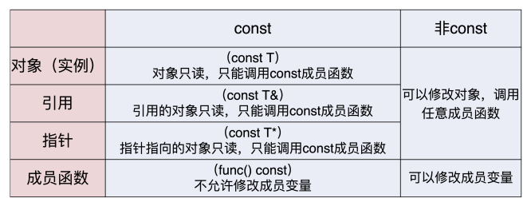

### mutable  

mutable 却只能修饰类里面的成员变量，表示变量即使是在 const 对象里，也是可以修改的。换句话说，就是标记为 mutable 的成员不会改变对象的状态，也就是不影响对象的常量性，所以允许 const 成员函数改写 mutable 成员变量。  

对于有特殊作用的成员变量，你可以给它加上 mutable 修饰，解除 const 的限制，让任何成员函数都可以操作它。  

```
struct Test final
{
public:
	void save_data() const
	{
		//@ do something wirth mutex
	}
private:
	mutable std::mutex mutex;
};
```

不过要当心，mutable 也不要乱用，太多的 mutable 就丧失了 const 的好处  

## Lambda 表达式

Lambda 表达式的基本语法如下：

```
[捕获列表](参数列表) mutable(可选) 异常属性 -> 返回类型 {
	// 函数体
}
```

默认情况下，参数列表为空时，可以省略参数列表。

### 捕获列表

lambda 表达式内部函数体在默认情况下是不能够使用函数体外部的变量的，这时候捕获列表可以起到传递外部数据的作用。根据传递的行为，捕获列表也分为以下几种：

### 值捕获

与参数传值类似，值捕获的前提是变量可以拷贝，不同之处则在于，被捕获的变量在 lambda 表达式被创建时拷贝，
而非调用时才拷贝：

```
void lambda_value_capture() {
	int value = 1;
	auto copy_value = [value]
	{
		return value;
	};

	value = 100;
	auto stored_value = copy_value();
	std::cout << "stored_value: " << stored_value << std::endl; //@ stored_value 是 1
}
```

### 引用捕获

与引用传参类似，引用捕获保存的是引用，值会发生变化。

```
void lambda_reference_capture() {
	int value = 1;
	auto copy_value = [&value] {
		return value;
	};

	value = 100;
	auto stored_value = copy_value();
	std::cout << "stored_value = " << stored_value << std::endl; //@ stored_value 是 100
}
```

### 隐式捕获

可以在捕获列表中写一个 & 或 = 向编译器声明采用引用捕获或者值捕获。捕获列表的最常用的四种形式可以是：

- \[\] 空捕获列表
- \[name1, name2, ...\] 捕获一系列变量
- \[&\] 引用捕获, 让编译器自行推导捕获列表，修改变量后外部变量同步修改
- \[=\] 值捕获, 让编译器执行推导捕获列表，按值捕获时，默认情况下 lambda 体中不允许修改变量的值

使用 mutable 修饰，修改变量后外部变量不会同步修改。如果使用 mutable 修饰，即使没有参数，也需要写明参数列表：

```
int a = 1;
auto f = [=]() {return ++a; };  //@ 错误，不允许修改
auto f = [=]() mutable {return ++a; };  //@ 可以修改 a，但是 lambda 表达式外部的 a 的值不变
auto f = [&]() mutable {return ++a; };  //@ 可以修改 a，但是 lambda 表达式外部的 a 的值同步改变
```

### 表达式捕获

C++14 允许捕获的成员用任意的表达式进行初始化，这就允许了右值的捕获，被声明的捕获变量类型会根据表达式进行判断，判断方式与使用 `auto` 本质上是相同的：

```
int main() {
	auto important = std::make_unique<int>(1);
	auto add = [v1 = 1, v2 = std::move(important)](int x, int y) -> int {
		return x + y + v1 + (*v2);
	};
	std::cout << add(3, 4) << std::endl;
	return 0;
}
```

### 返回值

返回值采用后置的语法实现。

允许省略返回值类型定义，编译器会根据语句自动推导：

- 采用自动推导时，如果有多处返回，类型需要保持一致
- 不能推导初始化列表

```
//@ 错误，lambda 无法推导返回类型
auto f = [](int x) 
{
    if (x & x)
   	 	return 0.0;
    else
    	return 1;
};

//@ 错误，无法根据初始化列表自动推导
auto f = []()
{
	return { 1,2 };
};
```

### 泛型 lambda 

从 C++14 开始，lambda  函数的形式参数可以使用 auto 关键字来产生意义上的泛型：

```
auto add = [](auto x, auto y) {
    return x+y;
};

add(1, 2);
add(1.1, 2.2);
```

### lambda 表达式的类型

lambda 表达式在 C++ 11 中称为闭包类型，可以将其理解为一个带 operator() 的类，即仿函数。因而可以使用 std::function 来存储 lambda 表达式，也可以使用 std::bind  来操作 lambda 表达式。

lambda  表达式的 operator() 是 const 的，这也是为什么按值捕获无法修改变量的本质原因，使用 mutable 则取消了 operator() 的 const ，因而可以修改变量。

```
std::function<int(int)> f1 = [](int a) {return a; };
std::function<int(void)> f2 = std::bind([](int a) { return a; },123);
```

没有捕获任何变量的 lambda 表达式，可以转换成一个普通的函数指针：

```
using func_t = int(*)(int);
func_t f = [](int a) { return a; };
f(12);
```

### lambda 表达式的优点

lambda 表达式来源于函数式编程的概念，其具有以下优点：

- 声明式编程风格：就地匿名定义目标函数或者函数对象，不需要额外写一个命名函数或者函数对象，不需要额外写函数或者函数对象，避免了代码膨胀和功能分散
- 更灵活：在需要的时间地点实现函数闭包

声明式编程：

```
std::vector<int> vec{1,2,3,4,5,6,7,8,9};
int even_count{ 0 };
std::for_each(vec.begin(), vec.end(), [&even_count](int x) {if (!(x & 1)) ++even_count; }); //@ 不需要提前定义仿函数
```

在需要的时间地点实现函数闭包：

```
std::vector<int> vec{1,2,3,4,5,6,7,8,9};
std::count_if(vec.begin(), vec.end(), [](int val) {return val > 5 && val <= 10; });  //@ 大于 5 小于等于10
```

## 函数对象包装器

### 可调用对象

- 函数指针
- 具有 `operator()` 成员函数的类对象(仿函数)
- 可以转换成函数指针的类对象
- 类的成员(函数)指针

```
void func(void)
{
	std::cout << "func" << std::endl;
}

struct Foo
{
	void operator()(void)
	{
		std::cout << "functor" << std::endl;
	}
};

struct Bar
{
	using fr_t = void(*)(void);

	static void func(void)  //@ 必须是静态函数，没有隐式的 this 参数
	{
		std::cout << "Bar::func" << std::endl;
	}

	operator fr_t(void)
	{
		return func;
	}
};

struct A
{
	int i_;
	void mem_func(void)
	{
		std::cout << "mem_func" << std::endl;
	}
};

int main()
{
	//@ 函数指针,也可以直接写成 void(*func_ptr)(void) = func;
	void(*func_ptr)(void) = &func; 
	func_ptr();

	//@ 仿函数
	Foo foo;
	foo(); 

	//@ 可转换为函数指针的类对象
	Bar bar;
	bar();  

	void (A::*mem_func_ptr)(void) = &A::mem_func;  //@ 类成员函数指针，这里必须使用 & 
	int A::*mem_obj_ptr = &A::i_;	 //@ 类成员指针
	A a;
	(a.*mem_func_ptr)();
	a.*mem_obj_ptr = 123;

	return 0;
}
```

### std::function

std::function 是可调用对象的包装器，是一个类模板，可以容纳除了类成员(函数)指针以外所有的可调用对象。

std::function 是一种通用、多态的函数封装，它的实例可以对任何可以调用的目标实体进行存储、复制和调用操作，它也是对 C++ 中现有的可调用实体的一种类型安全的包裹，换句话说，就是函数的容器。当我们有了函数的容器之后便能够更加方便的将函数、函数指针作为对象进行处理。

```
void func(void)
{
	std::cout << __FUNCTION__ << std::endl;
}

class Foo
{
public:
	static int foo_func(int a)
	{
		std::cout << __FUNCTION__ << "("<<a<<")"<<std::endl;
		return a;
	}
};

class Bar
{
public:
	int operator()(int a)
	{
		std::cout << __FUNCTION__ << "(" << a << ")" << std::endl;
		return a;
	}
};

int main()
{
	std::function<void(void)> fr1 = func;  //@ 绑定一个普通函数
	fr1();
	
	std::function<int(int)> fr2 = Foo::foo_func; //@ 绑定类的静态成员函数
	fr2(2);

	Bar bar;
	std::function<int(int)> fr3 = bar; //@ 绑定一个仿函数
	fr3(1);

	return 0;
}
```

### std::bind 和 std::placeholder

不论是普通函数、函数对象、还是成员函数，成员变量都可以绑定。

std::bind 作用：

- 将可调用对象与其参数绑定成一个仿函数
- 改变函数调用时需要传参的个数和顺序
- 先将可调用的对象保存起来，在需要的时候再调用，是一种延迟计算的思想

改变参数的个数和调用顺序：

```
void func(int a, char c, float f)
{
	std::cout << a << " " << c << " " << f << std::endl;
}

int main()
{
	//@ 使用占位符
	auto f1 = std::bind(func, std::placeholders::_1, std::placeholders::_2, std::placeholders::_3);
	f1(1, 'c', 3.14);

	//@ 改变传参顺序
	auto f2 = std::bind(func, std::placeholders::_2, std::placeholders::_3, std::placeholders::_1);
	f2(3.14,1,'c');

	//@ 使用固定参数改变参数个数
	auto f3 = std::bind(func, std::placeholders::_1, std::placeholders::_2, 3.14);
	f3(1,'c');
	f3(1, 'c', 9.999); //@ 第三个参数将会被忽略掉

	return 0;
}
```

绑定类的成员(函数)：

```
class Test
{
public:
	int mem_func(int a) 
	{
		std::cout << a << std::endl;
		return a + 1;
	}

	void mem_func2(int a, char c, float f)
	{
		std::cout << a << " " << c << " " << f << std::endl;
	}

	static int static_mem_func(int a)
	{
		std::cout << a << std::endl;
		return a + 100;
	}

public:
	int mem_variable = 1024;
};


int main()
{
	Test t;
	
	//@ 绑定成员函数
	auto f1 = std::bind(&Test::mem_func,t,std::placeholders::_1);
	f1(2);

	//@ 绑定多参数成员函数，改变传参顺序
	auto f2 = std::bind(&Test::mem_func2, t, std::placeholders::_3, std::placeholders::_2, std::placeholders::_1);
	f2(2.13, 'a',100);

	//@ 绑定静态成员函数
	auto f3 = std::bind(&Test::static_mem_func,std::placeholders::_1);
	f3(100);

	//@ 绑定成员变量
	auto f4 = std::bind(&Test::mem_variable,std::placeholders::_1);
	int var = f4(t);
	std::cout << var << std::endl;

	return 0;
}
```

绑定仿函数：

```
struct Test
{
	void operator()(int n)
	{
		std::cout << n << std::endl;
	}
};

int main()
{
	auto f1 = std::bind(Test(),std::placeholders::_1);
	f1(1000);

	Test t;
	auto f2 = std::bind(t, 10);
	f2();

	return 0;
}
```

std::function 不能容纳类的成员(函数)但是 std::bind 可以绑定类的成员(函数)，std::bind 之后的对象可以使用 std::function 表示，从而实现可调用对象的统一表示方法。std::bind1st 和 std::bind2nd 是旧标准库中用于将二元算子转换成一元算子的方法：

```
	std::vector<int> vec{ 1,2,3,4,5,6,7,8,9,10 };

	//@ 旧标准
	int count1 = std::count_if(vec.begin(), vec.end(), std::bind1st(std::less<int>(), 5)); //@ 第一个参数固定为5，查找大于 5 的元素个数
	int count2 = std::count_if(vec.begin(), vec.end(), std::bind2nd(std::less<int>(), 5)); //@ 第二个参数固定为5，查找小于 5 的元素个数

	//@ 新标准
	int count3 = std::count_if(vec.begin(), vec.end(), std::bind(std::less<int>(), 5, std::placeholders::_1)); 
	int count4 = std::count_if(vec.begin(), vec.end(), std::bind(std::less<int>(), std::placeholders::_1, 5)); 
```

复合多个函数(闭包)：

```
std::vector<int> vec{ 1,2,3,4,5,6,7,8,9,10 };

using std::placeholders::_1;

auto f = std::bind(std::logical_and<bool>(),
    std::bind(std::greater<int>(),_1,5),
    std::bind(std::less_equal<int>(), _1, 10)
    );

int count = std::count_if(vec.begin(),vec.end(),f);
```

## 右值引用

### 左值、右值的纯右值、将亡值、右值

- 左值是表达式结束后依然存在的持久对象，右值是表达式结束就不会继续存在的临时对象
- 如果能对表达式取地址就是左值，否则就是右值
- 具名变量或对象都是左值，而右值是不具名的

C++11 中为了引入强大的右值引用，将右值的概念进行了进一步的划分，分为：纯右值、将亡值。C++ 11 中所有的值必属于：左值，将亡值，纯右值 三者之一，将亡值和纯右值都属于右值。

C++ 11 中右值由两个概念构成：

- 一个是将亡值
  - 将要被移动的对象
  - T&& 类型函数返回值
  - std::move 返回值
  - 转换为 T&& 的类型的转换函数的返回值

- 一个是纯右值

  - 非引用返回的临时变量
  - 运算表达式产生的临时变量
  - 原始字面量
  - lambda 表达式

### 右值引用和左值引用

右值引用是对一个右值进行引用的类型，因为右值不具名，只能通过引用的方式找到它。

需要注意：

- 无论左值引用还是右值引用都必须立即进行初始化
- 常量左值引用是一个 "万能" 引用，可以接受左值，右值，常量左值，常量右值。普通的左值引用不能接受右值

```
void f1(std::string& str)
{}

void f2(const std::string& str)
{}

f1("hello,world");  //@ 错误，普通左值引用不能绑定右值
f2("hello,world");  //@ 正确，const 左值引用是万能引用类型

std::string lv1 = "string,"; //@ lv1 是一个左值
std::string&& r1 = lv1; //@ 非法, 右值引用不能引用左值
```

## 移动语义

传统的 C++ 没有区分移动和拷贝的概念，造成了大量的数据拷贝，浪费时间和空间。右值引用的出现解决了这两个概念的混淆问题。

```
int main() {

	std::string str = "Hello world.";
	std::vector<std::string> v;

	//@ 将使用 push_back(const T&), 即产生拷贝行为
	v.push_back(str);

	//@ 将使用 push_back(const T&&), 不会出现拷贝行为
	//@ 而整个字符串会被移动到 vector 中，所以有时候 std::move 会用来减少拷贝出现的开销
	//@ 这步操作后, str 中的值会变为空
	v.push_back(std::move(str));

	return 0;
}
```

C++11 提供了 std::move 这个方法将左值参数无条件的转换为右值，有了它我们就能够方便的获得一个右值临时对象。

std::move 只是转移了资源的控制权，本质上是将左值强制转换为右值，以使用移动语义，避免含有资源的对象发生了无谓的拷贝。

- move 对于拥有内存，文件句柄等资源对象的成员有效
- 如果是一些基本类型，比如 int 和 char[10] 数组等，如果使用 move 还是会发生拷贝，因为它们没有对应的移动构造函数

### 如何实现移动  

设计的对象支持移动的话，通常需要下面几步：  

- 应该有分开的拷贝构造和移动构造函数（除非只打算支持移动，不支持拷贝——如：unique_ptr）
- 对象应该有 swap 成员函数，支持和另外一个对象快速交换成员  
- 对象的名空间下，应当有一个全局的 swap 函数，调用成员函数 swap 来实现交换。支持这种用法会方便在其他对象里包含你的对象，并快速实现它们的 swap 函数
- 实现通用的 operator=  
- 上面各个函数如果不抛异常的话，应当标为 noexcept。这对移动构造函数尤为重要  

不要返回本地变量的引用：  

在函数里返回一个本地对象的引用。由于在函数结束时本地对象即被销毁，返回一个指向本地对象的引用属于未定义行为。理论上来说，程序出任何
奇怪的行为都是正常的。  

在 C++11 之前，返回一个本地对象意味着这个对象会被拷贝，除非编译器发现可以做返回值优化（named return value optimization，或 NRVO），能把对象直接构造到调用者的栈上。从 C++11 开始，返回值优化仍可以发生，但在没有返回值优化的情况下，编译器将试图把本地对象移动出去，而不是拷贝出去。这一行为不需要用 std::move 进行干预——使用std::move 对于移动行为没有帮助，反而会影响返回值优化。    

## 完美转发

引用折叠：

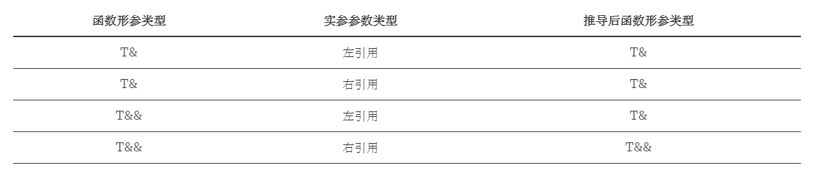

无论模板参数是什么类型的引用，当且仅当实参类型为右引用时，模板参数才能被推导为右引用类型。

完美转发实现了参数在传递过程中保持其值属性的功能，即若是左值，则传递之后仍然是左值，若是右值，则传递之后仍然是右值。

完美转发利用 std::forward 实现：

- std::forward 不仅可以保持左值或者右值不变，同时还可以保持 CV 和引用等属性不变
- std::forward 只有在它的参数绑定到一个右值上的时候，它才转换参数到右值

```
template <typename T>
void printT(T& t)
{
	std::cout << "lvalue" << std::endl;
}

template <typename T>
void printT(T&& t)
{
	std::cout << "rvalue" << std::endl;
}

template<typename T>
void test_forward(T&& t)
{
	printT(std::forward<T>(t));
}

int main()
{
	int x = 1;

	test_forward(1); //@ rvalue
	test_forward(x); //@ lvalue
	test_forward(std::forward<int>(x)); //@ rvalue
	test_forward(std::forward<int&>(x)); //@ lvalue
	test_forward(std::forward<int&&>(x)); //@ rvalue
	test_forward(std::move(x)); //@ rvalue

	return 0;
}
```

右值引用、完美转发再结合可变模板参数可以写一个万能的函数包装器：

```
template<class Function, class...Args>
inline auto function_wrapper(Function&& func, Args&&...args)->decltype(func(std::forward<Args>(args)...))
{
	return func(std::forward<Args>(args)...);
}
```

引用：

```
template<class Function, class...Args>
inline auto function_wrapper(Function&& func, Args&&...args)->decltype(func(std::forward<Args>(args)...))
{
	return func(std::forward<Args>(args)...);
}

void test0()
{
	std::cout << "void" << std::endl;
}

int test1()
{
	return 1;
}

int test2(int x)
{
	return x;
}

std::string test3(const std::string s1, const std::string s2)
{
	return s1 + s2;
}


int main()
{
	function_wrapper(test0);  //@ 没有返回值
	auto res1 = function_wrapper(test1);  //@ 返回1
	auto res2 = function_wrapper(test2, 2);		//@ 返回2
	auto res3 = function_wrapper(test3, "aa", "bb");   //@ 返回aabb


	return 0;
}
```

std::forward 和 std::move 一样，没有做任何事情，std::move 单纯的将左值转化为右值，std::forward 也只是单纯的将参数做了一个类型的转换，从现象上来看，std::forward<T>(v) 和 static_cast<T&&>(v) 是完全一样的。

```
template<typename _Tp>
constexpr _Tp&& forward(typename std::remove_reference<_Tp>::type& __t) noexcept
{ return static_cast<_Tp&&>(__t); }

template<typename _Tp>
constexpr _Tp&& forward(typename std::remove_reference<_Tp>::type&& __t) noexcept
{
    static_assert(!std::is_lvalue_reference<_Tp>::value, "template argument"
        " substituting _Tp is an lvalue reference type");
    return static_cast<_Tp&&>(__t);
}
```

## exception

### 异常的使用

异常就是针对错误码的缺陷而设计的，它有三个特点：

- 异常的处理流程是完全独立的，throw 抛出异常后就可以不用管了，错误处理代码都集中在专门的 catch 块里。这样就彻底分离了业务逻辑与错误逻辑，看起来更清楚
- 异常是绝对不能被忽略的，必须被处理。如果你有意或者无意不写 catch 捕获异常，那么它会一直向上传播出去，直至找到一个能够处理的 catch 块。如果实在没有，那就会导致程序立即停止运行，明白地提示你发生了错误，而不会“坚持带病工作”
- 异常可以用在错误码无法使用的场合，这也算是 C++ 的“私人原因”。因为它比 C 语言多了构造 / 析构函数、操作符重载等新特性，有的函数根本就没有返回值，或者返回值无法表示错误，而全局的 errno 实在是“太不优雅”了，与 C++ 的理念不符，所以也必须使用异常来报告错误  

异常的用法和使用方式：

用 try 把可能发生异常的代码“包”起来，然后编写 catch 块捕获异常并处理。  

```
try
{
	//@ do something
}
catch (...)
{
	//@ handle exception
}
```

C++ 里对异常的定义非常宽松，任何类型都可以用 throw 抛出，也就是说，你可以直接把错误码（int）、或者错误消息（char*、string）抛出，catch 也能接
住，然后处理。  

但是最好使用 C++ 已经定义的异常类型体：

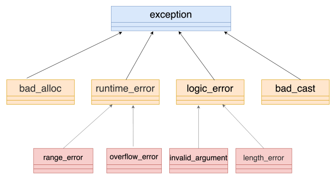

自定义异常类型：

```
class Exception : public std::runtime_error
{
public:
	Exception(const char* msg) : std::runtime_error(msg)
	{
	}

	Exception() = default;
	~Exception() = default;
};
```

在抛出异常的时候，  最好不要直接用 throw 关键字，而是要封装成一个函数，这和不要直接用 new、delete 关键字是类似的道理——通过引入一个“中间层”来获得更多的可读性、安全性和灵活性。  

```
[[noretrurn]] void raise(const char* msg)
{
	throw Exception(msg);
}
```

使用 catch 捕获异常的时候也要注意，C++ 允许编写多个 catch 块，捕获不同的异常，再分别处理。但是，异常只能按照 catch 块在代码里的顺序依次匹配，而不会去找最佳匹配。 所以，最好只用一个 catch 块，绕过这个“坑”。  

```
try {
	raise("error occured");
}
catch (const std::exception& e)  //@ 使用基类，使用引用
{
	std::cout << e.what() << std::endl;
}
```

function-try：

所谓 function-try，就是把整个函数体视为一个大 try 块，而 catch 块放在后面，与函数体同级并列，这样做的好处很明显，不仅能够捕获函数执行过程中所有可能产生的异常，而且少了一级缩进层次，处理逻辑更清晰，建议多用。   

```
void func(int i)
try {
	raise("error occured");
}
catch (const std::exception& e)  //@ 使用基类，使用引用
{
	std::cout << e.what() << std::endl;
}

int main()
{
	func(102);
	return 0;
}
```

应当使用异常的判断准则：  

- 不允许被忽略的错误
- 极少数情况下才会发生的错误
- 严重影响正常流程，很难恢复到正常状态的错误
- 无法本地处理，必须“穿透”调用栈，传递到上层才能被处理的错误

### 保证不抛出异常  

noexcept 专门用来修饰函数，告诉编译器：这个函数不会抛出异常。编译器看到noexcept，就得到了一个“保证”，就可以对函数做优化，不去加那些栈展开的额外代码，消除异常处理的成本。  

```
RetType function(params) noexcept; //@ most optimizable
RetType function(params) throw(); //@ C++98,less optimizable
RetType function(params); //@ less optimizable
```

对某些函数来说，`noexcept` 性质十分重要，内存释放函数和所有的析构函数都隐式 `noexcept`，这样就不必加 `noexcept `声明。析构函数唯一未隐式 `noexcept`  的情况是，类中有数据成员的类型显式将析构函数声明 `noexcept(false)`。但这样的析构函数很少见，标准库中一个也没有。


不过你要注意，noexcept 只是做出了一个“不可靠的承诺”，不是“强保证”，编译器无法彻底检查它的行为，标记为 noexcept 的函数也有可能抛出异常：  

```
void func_maybe_noexcept() noexcept
{
	throw "fatal";
}
```

## 内联名字空间

C++11 当中引入了内联名字空间的特性，内联名字控件可以让不同名字空间之间相互访问，但是这样会破坏名字空间的分割性：

```
namespace NameA {
	inline namespace NameB 
	{                           
		struct Example {};
	}

	inline namespace NameC 
	{                          
		template<typename T> class Class {};
		Example exC;   
	}
}

namespace NameA {
	template<> class Class<Example> {};                // 使用内联名字空间还能在不打开名字空间的情况下，进行模板特化（否则会编译失败）
}
```

## C++ 中的类型转换

### 旧风格的强制类型转换

- C 风格的类型转换：

```
(T) expression
```

- 函数风格的类型转换：

```
T(expression)
```

以上两种形式之间没有本质上的不同，它纯粹就是一个把括号放在哪的问题。

### C++ 中的四种新的强制类型转换

C++ 中提供四种新式类型转换：

```
const_cast<T>(expression)
dynamic_cast<T>(expression)
reinterpret_cast<T>(expression)
static_cast<T>(expression)
```

- const_cast 一般用于强制消除对象的常量性。它是唯一能做到这一点的 C++ 风格的强制转型。
- dynamic_cast 主要用于执行“安全的向下转型”，也就是说，要确定一个对象是否是一个继承体系中的一个特定类型。它是唯一不能用旧风格语法执行的强制转型。也是唯一可能有重大运行时代价的强制转型。
- reinterpret_cast 是特意用于底层的强制转型，导致实现依赖（就是说不可移植）的结果，例如，将一个指针转型为一个整数。这样的强制转型在底层代码以外应该极为罕见。
- static_cast 可以被用于强制隐型转换：
  - non-const 对象转型为 const 对象
  - int 转型为 double
  - void* 指针转型为有类型指针
  - 基类指针转型为派生类指针
  - 它不能将一个 const 对象转型为 non-const 对象（只有 const_cast 能做到）

为了兼容，旧式的转型仍然合法，但是更提倡用新式的形式：

- 新式转型很容易被辨识出来，可以很快找到代码中有哪些转型。
- 新式转型语义更加明确（编译器会做更详细的检查）不容易误用。

```
class Widget{
public:
    explicit Widget(int size);
    ……
};
void doSomeWord(const Widget& w);
doSomeWork(Widget(15));		//@ C 风格类型转换
doSomeWork(static_cast<Widget>(15));	//@ C++风格类型转换
```

转型在表面看起来是把一种类型视为另一种类型，但是编译器做的远远比这个多。编译器在编译器期间会真的编译出运行期间的代码。例如下面代码：

```
int x,y;
double d = static_cast<double>(x)/y;
```

将 x 转型为 double，和不转型对比，代码肯定不同。因为 double 和 int 的底层表示都不相同。下面这个例子更加明显：

```
class Base{……};
class Derived:public Base{……};
Derived d; 
Base* b=&d;	//@ 将 Derived* 转为 Base*
```

同一对象的子类指针和父类指针有时并不是同一地址（取决于编译器和平台），而运行时代码需要计算这一偏移量。 一个对象会有不同的地址是 C++ 中独有的现象，所以不要对 C++ 对象的内存分布做任何假设，更不要基于该假设做类型转换。 这样可以避免一些未定义行为。

C++ 类型转换有趣的一点在于，很多时候看起来正确事实上却是错误的。比如 SpecialWindow 继承自 Window， 它的 onResize 需要调用父类的 onResize。一个实现方式是这样的：

```
class Window
{
	int size;
public:
	virtual void onResize() { size = 1; }
	int getSize()const { return size; }
};

class SpecialWindow : public Window {
public:
	virtual void onResize() {
		static_cast<Window>(*this).onResize();
		cout << getSize() << endl;
	}
};

int main()
{
	SpecialWindow sw;
	sw.onResize();

	return 0;
}
```

这样写的结果是当前对象父类部分被拷贝（调用了 Window 的拷贝构造函数），并在这个副本上调用 onResize。 当前对象的 Window::onResize 并未被调用，而 SpetialWindow::onResize 的后续代码被执行了， 如果后续代码修改了属性值，那么当前对象将处于无效的状态。正确的方法也很显然：

```
class SpecialWindow : public Window {
public:
	virtual void onResize() {
		Window::onResize();		//@ 调用 Window::onResize 作用于 *this 身上
		cout << getSize() << endl;
	}
};
```

### dynamic_cast 的性能问题

在一般的实现中 dynamic_cast 会逐级地比较类名。比如4级的继承结构，`dynamic_cast<Base>` 将会调用4次strcmp 才能确定最终的那个子类型。 所以在性能关键的部分尽量避免 dynamic_cast。

之所以需要 dynamic_cast ，通常是因为你想在一个你认为 derived class 对象身上执行 derived class 操作函数，但是你手上只用一个指向 base 的指针或引用，你只能靠它们来处理对象，有两个一般性做法可以避免这个问题：

- 使用容器并在其中存储直接指向 derived class 对象的指针(通常是智能指针)

```
class Window { //@ ... };
class SpecialWindow :public Window {
public:
	void blink();
	//@ ...
};

typedef std::vector<std::tr1::shared_ptr<Window>> VPW;
VPW winPtrs;

for (VPW::iterator iter = winPtrs.begind(); iter != winPtrs.end(); ++iter)
{
	if (SpecialWindow* psw = dynamic_cast<SpecialWindow*>(iter->get()))
		psw->blink();
}
```

不应该像上面这样做，而应该换成子类容器：

```
for (VPSW::iterator iter = winPtrs.begind(); iter != winPtrs.end(); ++iter)
{
	(*iter)->blink();
}
```

但这样你就不能在容器里放其他子类的对象了，你可以定义多个类型安全的容器来分别存放这些子类的对象。

- 通过虚函数提供统一的父类接口。比如：

```
class Window { 	
public:
	virtual void blink() {} //@ 缺省实现
	//@ ... 
};

class SpecialWindow :public Window {
public:
	virtual void blink();
	//@ ...
};

typedef std::vector<std::tr1::shared_ptr<Window>> VPW;
VPW winPtrs;

for (VPSW::iterator iter = winPtrs.begind(); iter != winPtrs.end(); ++iter)
{
	(*iter)->blink();
}
```

这两个方法并不能解决所有问题，但如果可以解决你的问题，你就应该采用它们来避免类型转换。 这取决于你的使用场景，但可以确定的是，连续的 dynamic_cast 一定要避免，比如这样：

```
class Window{...};
//@ ...
typedef std::vector<std::tr1::shared_ptr<Window>> VPW;
VPW winPtrs;
//@ ...
for(VPW::iterator iter = winPtrs.begind(); iter != winPtrs.end(); ++iter)
{
	if (SpecialWindow1 *p = dynamic_cast<SpecialWindow1*>(it->get()) { ... }
	else if (SpecialWindow2 *p = dynamic_cast<SpecialWindow2*>(it->get()) { ... }
	else if (SpecialWindow3 *p = dynamic_cast<SpecialWindow3*>(it->get()) { ... }
	//@ ...
}
```

这样的代码又大又慢，例如如果window继承体系有变动，那么就必须检查看看是否需要修改。如果加入新的 Derived class，那么又要添加新的代码，加入新的判断分支。这样的代码应该由基于 virtual 函数来取代。 

## inline

内联函数的好处太多了：

- 它没有宏的那些缺点，而且不需要付出函数调用的代价。 
- 同时也方便了编译器基于上下文的优化。

但 inline 函数也并非免费的午餐：

- 在有限内存的机器上，过分热衷于 inline 化会使得程序对于可用空间来说过于庞大。即使使用了虚拟内存，inline 引起的代码膨胀也会导致附加的分页调度，减少指令缓存命中率，以及随之而来的性能损失。

inline 只是对编译器的一个请求而非命令。该请求可以隐式地进行也可以显式地声明。

当你的函数较复杂（比如有循环、递归）或者是虚函数时，编译器很可能会拒绝把它  inline。因为虚函数调用只有运行时才能决定调用哪个，而 inline 是在编译器便要嵌入函数体。 有些编译器在 dianotics 级别编译时，会对拒绝 inline 给出 warning 。

隐式的办法便是把函数定义放在类的定义中：

```
class Person{
    ...
    int age() const{ return _age;}  //@ 这会生成一个 inline 函数！
};
```

例子中是成员函数，如果是友元函数也是一样的。除非友元函数定义在类的外面。

显式的声明则是使用 inline 限定符：

```
template<typename T>
inline const T& max(const T& a, const T& b){ return a<b ? b: a;}
```

可能你也注意到了 inline 函数和模板一般都定义在头文件中。这是因为 inline 操作是在编译时进行的，而模板的实例化也是编译时进行的。 所以编译器时便需要知道它们的定义。

在绝大多数C++环境中，inline 都发生在编译期。有些环境下也可以在链接时进行 inline，尤其在.NET中可以运行时进行 inline。

但模板实例化和 inline 是两个过程，如果你的函数需要做成 inline 的就把它声明为 inline（也可以隐式地），否则仍然把它声明为正常的函数。

通过函数指针调用 inline 函数，这时 inline 函数一般不会被 inline。

```cpp
inline void f() {}
void(*pf)() = f;

f();        //@ 这个调用将会被inline，它是个普通的函数调用
pf();       //@ 这个是通过指针调用的，不会被inline
```

构造析构函数看起来很适合 inline，但事实并非如此。我们知道C++会在对象创建和销毁时保证做很多事情，比如调用 new 时会导致构造函数被调用， 退出作用域时析构函数被调用，构造函数调用前成员对象的构造函数被调用，构造失败后成员对象被析构等等。

这些事情不是平白无故发生的，编译器会生成一些代码并在编译时插入你的程序。比如编译后一个类的构造过程可能是这样的：

```
Derived::Derived(){
    Base::Base();
    try{ data1.std::string::string(); }
    catch(...){
        Base::Base();
        throw;
    }
    try{ data2.std::string::string(); }
    catch(...){
        data1.std::string::~string();
        Base::~Base();
        throw;
    }
    ...
}
```

Derived 的析构函数、Base 的构造和析构函数也是一样的，事实上构造和析构函数会被大量地调用。 如果全部inline 的话，这些调用都会被扩展为函数体，势必会造成目标代码膨胀。

如果你是库的设计者，那么你的接口函数的 inline 特性的变化将会导致客户代码的重新编译。 因为如果你的接口是 inline 的，那么客户需要将函数体展开编译到客户的目标代码中。

# 字符串

string 是模板类特化形式的别名：

```
using string = std::basic_string<char>;
```

## 字面量

C++11 为方便使用字符串，新增了一个字面量的后缀“s”，明确地表示它是 string 字符串类型，而不是 C 字符串，这就可以利用 auto 来自动类型推导：

```
auto str = "std string";  //@ str -> const char*

using namespace std::literals::string_literals; //@ 需要打开命名空间
auto str2 = "std string"s;  //@ str2 -> std::string
```

C++11 还为字面量增加了一个“原始字符串”的新表示形式，比原来的引号多了一个大写字母 R 和一对圆括号，就像下面这样：  

```
auto str1 = R"(\r\n\t\)"; //@ 原样输出 \r\n\t
auto str2 = R"(\\\\\\\$)"; //@ 原样输出 \\\\\\\$
```

如果原始字符串中有引号或者圆括号，需要在圆括号的两边加上最多 16 个字符的特别“界定符”（delimiter），这样就能够保证不与字符串内容发生冲突：  

```
auto str = R"==("('xx')")=="; //@ 原样输出 "('xx')"
```

### 自定义字面量  

C++11 引入了自定义字面量，可以使用 operator"" 后缀 来将用户提供的字面量转换成实际的类型。C++14 则在标准库中加入了不少标准字面量。下面这个程序展示了它们的用法：    

```
std::this_thread::sleep_for(500ms);
```

要在自己的类里支持字面量也相当容易，唯一的限制是非标准的字面量后缀必须以下划线 _ 打头：

```
struct Length
{
	double value;

	enum unit
	{
		metre,
		kilometre,
		millimetre,
		centmetre,
		inch,
		foot,
		yard,
		mile,
	};

	static constexpr double factors[] =	{
		1.0,1000.0,1e-3,1e-2,0.0254,0.3084,0.9144,1609.344	};
	
	explicit Length(double v, unit u = metre)
	{
		value = v* factors[u];
	}
};

Length operator +(Length& lhs, Length& rhs)
{
	return Length(lhs.value + rhs.value);
}

Length operator"" _m(long double v)
{
	return Length(v, Length::metre);
}

Length operator"" _cm(long double v)
{
	return Length(v, Length::centmetre);
}


int main()
{
	auto v = 1.0_m + 10.0_cm;
	std::cout << v.value << std::endl;
}
```

### 二进制字面量  

从 C++14 开始，二进制也有了直接的字面量：  

```
unsigned mask = 0b111000000;
```

但是 I/O streams 里只有 dec、hex、oct 三个操纵器（manipulator），而没有 bin，因而输出一个二进制数不能像十进制、十六进制、八进制那么直接。一个间接
方式是使用 bitset，但调用者需要手工指定二进制位数：  

```
std::cout << std::bitset<9>(mask) << std::endl;
```

### 数字分隔符  

C++14 开始，允许在数字型字面量中任意添加 ' 来使其更可读。  

```
unsigned mask = 0b111'000'000;
long r_earth_equatorial = 6'378'137;
double pi = 3.14159'26535'89793;
const unsigned magic = 0x44'42'47'4E;
```

### 用户自定义字面量

```
struct Watt { unsigned int v; };

Watt operator "" _w(unsigned long long v)
{
	return{ (unsigned int)v };
}

int main()
{
	Watt w = 1024_w;
	
    return 0;
}
```

使用字面量时需要注意：

- 在字面量操作符函数的声明中，`operator ""` 与用户自定义后缀之间必须有空格
- 后缀建议以下划线开始

另外标准规定：

- 如果字面量为整型数，那么字面量操作符函数只可接受 `unsigned long long` 或者 `const char*` 为其参数，当 `unsigned long long` 无法容纳字面量的时候，编译器会自动将该字面量转换为以 `\0` 为结束符的字符串，并调用以 `const char*` 为参数的版本进行处理
- 如果字面量为整型数，那么字面量操作符函数只可接受 `long double` 或者 `const char*` 为其参数，当 `long double` 无法容纳字面量的时候，编译器会自动将该字面量转换为以 `\0` 为结束符的字符串，并调用以 `const char*` 为参数的版本进行处理
- 如果字面量为字符，则字面量操作符函数只可接受一个 `char` 参数

## 字符串转换函数  

- stoi()、stol()、stoll() 等把字符串转换成整数
- stof()、stod() 等把字符串转换成浮点数
- to_string() 把整数、浮点数转换成字符串  

## 字符串视图类  

string 的成本问题。它确实有点“重”，大字符串的拷贝、修改代价很高，所以我们通常都尽量用 const string&，但有的时候还是无法避免。

在 C++17 里，就有这么一个完美满足所有需求的东西，叫 string_view。顾名思义，它是一个字符串的视图，成本很低，内部只保存一个指针和长度，无论是拷贝，还是修改，都非常廉价。  

C++11 里实现一个简化版本：

```
class string_view final
{
public:
	using size_type = size_t;

	string_view() = default;
	~string_view() = default;

	string_view(const std::string& str) noexcept: ptr_(str.data()), len_(str.length())
	{
	}

	const char* data() const
	{
		return ptr_;
	}

	size_type size() const 
	{
		return len_;
	}

private:
	const char* ptr_ = nullptr;
	size_type len_ = 0;
};
```

## 正则表达式

一般使用正则表达式主要是实现下面三个需求：

- 检查一个串是否包含某种形式的子串
- 将匹配的子串替换
- 从某个串中取出符合条件的子串

C++ 正则表达式主要有两个类：

- regex：表示一个正则表达式，是 basic_regex 的特化形式
- smatch：表示正则表达式的匹配结果，是 match_results 的特化形式  

C++ 正则匹配有三个算法，注意它们都是“只读”的，不会变动原字符串：

- regex_match()：完全匹配一个字符串
- regex_search()：在字符串里查找一个正则匹配
- regex_replace()：正则查找再做替换  

在写正则的时候，记得最好要用“原始字符串” 。

### 特殊字符

特殊字符是正则表达式里有特殊含义的字符，也是正则表达式的核心匹配语法。

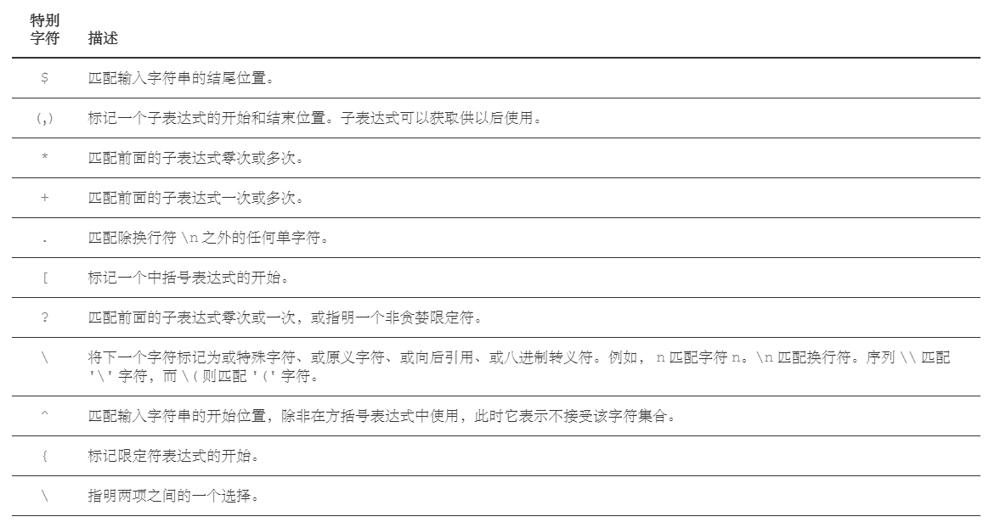

### 限定符

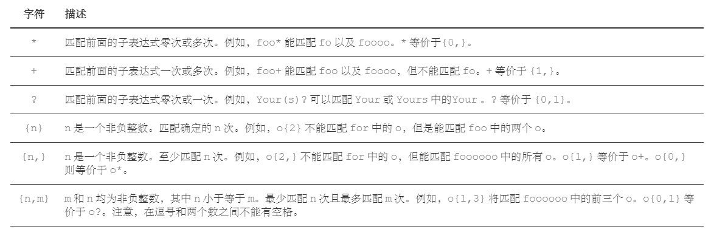

### std::regex

C++11 提供的正则表达式库操作 `std::string` 对象，模式 `std::regex` (本质是 `std::basic_regex`)进行初始化，通过 `std::regex_match` 进行匹配，从而产生 `std::smatch` （本质是 `std::match_results` 对象）。

```
	std::string fnames [] = { "foo.txt", "bar.txt", "test", "a0.txt", "AAA.txt" };
	std::regex txt_reg("[a-z]+\\.txt");
	for (const auto & fname : fnames)
	{
		std::cout << fname << ": " << std::regex_match(fname, txt_reg) << std::endl;
	}

	std::cout << "------------------------------------------------" << std::endl;

	std::regex base_regex{ "([a-z]+)\\.txt" };
	std::smatch base_match;
	for (const auto & fname : fnames)
	{
		if (std::regex_match(fname, base_match, base_regex))
		{
			//@ std::smatch 的第一个元素匹配整个字符串
			//@ std::smatch 的第二个元素匹配了第一个括号表达式
			if (base_match.size() == 2)
			{
				std::string base = base_match[1].str();
				std::cout << base_match[0].str() << std::endl;
				std::cout << base << std::endl;
			}
		}
	}
```

# 动态内存管理

## C++ 动态内存分配机制

### new/delete 与 operator new/operator delete

new operator/delete operator 就是 new 和 delete 操作符，而 operator new/operator delete 是函数。

new 操作符的执行过程：

- 调用operator new分配内存
- 调用构造函数生成类对象
- 返回相应指针

operator new：

- 只分配所要求的空间，不调用相关对象的构造函数。当无法满足所要求分配的空间时，则
  - 如果有 new_handler，则调用 new_handler
  - 否则如果没要求不抛出异常（以nothrow参数表达），则执行 bad_alloc 异常，否则返回 0
- 可以被重载
    - 重载时，返回类型必须声明为 void*
    - 重载时，第一个参数类型必须为表达要求分配空间的大小（字节），类型为 size_t
    - 重载时，可以带其它参数

要实现不同的内存分配行为，应该重载 operator new，而不是 new。如果类中没有重载 operator new，那么调用的就是全局的 ::operator new 来完成堆的分配。同理，operator new[]、operator delete、operator delete[] 也是可以重载的。

示例：

```
class T
{
public:
	T() { std::cout << "T::T()" << std::endl; }
	~T() { std::cout << "T::~T()" << std::endl; }

	void * operator new (size_t size, std::string str)
	{
		std::cout << "operator new size:" << size << " with string:" << str << std::endl;
		return ::operator new(size);
	}

	void operator delete(void* p)
	{
		std::cout << "operator delete" << std::endl;
		::operator delete(p);
	}

private:
	int num;
};

int main()
{
	T *t = new("A new t") T;
	delete t;

	return 0;
}
```

输出：

```
operator new size:4 with string:A new t
T::T()
T::~T()
operator delete
```

### placement new

placement new 是重载 operator new 的一个标准、全局的版本，它不能够被自定义的版本代替（不像普通版本的 operator new 和 operator delete 能够被替换）。

```
void *operator new( size_t, void * p ) throw() { return p; }
```

placement new 的执行忽略了 size_t 参数，只返还第二个参数。其结果是允许用户把一个对象放到一个特定的地方，达到调用构造函数的效果。和其他普通的 new 不同的是，它在括号里多了另外一个参数。比如：

```
int *p1 = new int(42);
int *p2 = (int*)malloc(sizeof(int));
new(p2)int(43);

std::cout << *p1 << std::endl;
std::cout << *p2 << std::endl;
```

Placement new 存在的理由：

- 如果你想在预分配的内存上创建对象，用缺省的 new 操作符是行不通的。要解决这个问题，你可以用 placement new 构造
- 使用 new 操作符分配内存需要在堆中查找足够大的剩余空间，显然这个操作速度是很慢的，而且有可能出现无法分配内存的异常（空间不够）。placement new 就可以解决这个问题

Placement new 使用步骤：

缓存提前分配，有三种方法：

- 在堆上分配：

```
class Task ;
char * buff = new [sizeof(Task)]; //@ 分配内存
```

- 在栈上进行分配：

```
class Task ;
char buf[N*sizeof(Task)]; //@ 分配内存
```

- 直接通过地址(必须是有意义的地址)来使用：

```
void* buf = reinterpret_cast<void*> (0xF00F);
```

对象的分配，在刚才已分配的缓存区调用 placement new 来构造一个对象：

```
Task *ptask = new (buf) Task
```

对象的析构，一旦你使用完这个对象，你必须调用它的析构函数来毁灭它。按照下面的方式调用析构函数：

```
ptask->~Task(); //@ 调用析构函数
```

释放，可以反复利用缓存并给它分配一个新的对象，如果你不打算再次使用这个缓存，你可以象这样释放它：

```
delete [] buf;
```

示例：

```
class T
{
public:
	T(int n):num(n) { std::cout << "T::T()" << std::endl; }
	~T() { std::cout << "T::~T()" << std::endl; }

	int get_num() const { return num; }
private:
	int num;
};

int main()
{
	char* buf = new char[sizeof(T)];
	T* p = new(buf) T(100);
	std::cout << p->get_num() << std::endl;
	p->~T();
	delete[] buf;

	return 0;
}
```

### new handler 的行为

new 申请内存失败时会抛出 `"bad alloc"` 异常，此前会调用一个由 std::set_new_handler() 指定的错误处理函数。

“new-handler” 函数通过 std::set_new_handler() 来设置，std::set_new_handler() 定义在 `<new>` 中：

```
namespace std{
    typedef void (*new_handler)();
    new_handler set_new_handler(new_handler p) throw(); //@ throw() 是一个异常声明，表示不抛任何异常
}
```

set_new_handler() 使用示例：

```
void outOfMem(){
    std::cout<<"Unable to alloc memory";
    std::abort();
}

int main(){
    std::set_new_handler(outOfMem);
    int *p = new int[100000000L];
}
```

std::set_new_handler 设置的是全局的 bad_alloc 的错误处理函数，C++ 并未提供类型相关的 bad_alloc 异常处理机制。 但我们可以重载类的 operator new，当创建对象时暂时设置全局的错误处理函数，结束后再恢复全局的错误处理函数。

```
class Widget{
public:
    static std::new_handler set_new_handler(std::new_handler p) throw();
    static void * operator new(std::size_t size) throw(std::bad_alloc);
private:
    static std::new_handler current;
};
 
//@ 静态成员需要定义在类的外面
std::new_handler Widget::current = 0;
std::new_handler Widget::set_new_handler(std::new_handler p) throw(){
    std::new_handler old = current;
    current = p;
    return old;
}
```

关于 abort, exit, terminate 的区别：abort 会设置程序非正常退出，exit 会设置程序正常退出，当存在未处理异常时 C++ 会调用 terminate， 它会回调由 std::set_terminate 设置的处理函数，默认会调用 abort。

 operator new 函数的工作：

- 调用 std::set_new_handler，把 Widget::current 设置为全局的错误处理函数
- 调用全局的 operator new 来分配真正的内存
- 如果分配内存失败，Widget::current 将会抛出异常
- 不管成功与否，都卸载 Widget::current，并安装调用 Widget::operator new 之前的全局错误处理函数

通过RAII类来保证原有的全局错误处理函数能够恢复，让异常继续传播：

```
class NewHandlerHolder{
public:
    explicit NewHandlerHolder(std::new_handler nh): handler(nh){}
    ~NewHandlerHolder(){ std::set_new_handler(handler); }
private:
    std::new_handler handler;
    NewHandlerHolder(const HandlerHolder&);     //@ 禁用拷贝构造函数
    const NewHandlerHolder& operator=(const NewHandlerHolder&); //@ 禁用赋值运算符
};
```

 Widget::operator new 实现：

```
void * Widget::operator new(std::size_t size) throw(std::bad_alloc){
    NewHandlerHolder h(std::set_new_handler(current));
    return ::operator new(size);    //@ 调用全局的new，抛出异常或者成功
}   //@ 函数调用结束，原有错误处理函数恢复
```

仔细观察上面的代码，很容易发现自定义 ”new-handler” 的逻辑其实和 Widget 是无关的。我们可以把这些逻辑抽取出来作为一个模板基类：

```
template<typename T>
class NewHandlerSupport{
public:
    static std::new_handler set_new_handler(std::new_handler p) throw();
    static void * operator new(std::size_t size) throw(std::bad_alloc);
private:
    static std::new_handler current;
};
 
template<typename T>
std::new_handler NewHandlerSupport<T>::current = 0;
 
template<typename T>
std::new_handler NewHandlerSupport<T>::set_new_handler(std::new_handler p) throw(){
    std::new_handler old = current;
    current = p;
    return old;
}
 
template<typename T>
void * NewHandlerSupport<T>::operator new(std::size_t size) throw(std::bad_alloc){
    NewHandlerHolder h(std::set_new_handler(current));
    return ::operator new(size);
}
```

有了这个模板基类后，给 Widget 添加 ”new-handler” 支持只需要 public 继承即可：

```
class Widget: public NewHandlerSupport<Widget>{ ... };
```

### 了解 new 和 delete 所谓合理替换时机

为什么需要自定义 operator new 或 operator delete ?

- 检测使用错误。new 得到的内存如果没有 delete 会导致内存泄露，而多次 delete 又会引发未定义行为。如果自定义 operator new 来保存动态内存的地址列表，在 delete 中判断内存是否完整，便可以识别使用错误，避免程序崩溃的同时还可以记录这些错误使用的日志
- 提高效率。全局的 new 和 delete 被设计为通用目的（general purpose）的使用方式，通过提供自定义的 new，我们可以手动维护更适合应用场景的存储策略
- 收集使用信息。在继续自定义 new 之前，你可能需要先自定义一个 new 来收集地址分配信息，比如动态内存块大小是怎样分布的？分配和回收是先进先出 FIFO 还是后进先出 LIFO
- 实现非常规的行为。比如考虑到安全，operator new 把新申请的内存全部初始化为0
- 其他原因，比如抵消平台相关的字节对齐，将相关的对象放在一起等等

自定义一个 operator new 很容易的，比如实现一个支持越界检查的 new：

```
static const int signature = 0xDEADBEEF;    //@ 边界符
typedef unsigned char Byte; 
 
void* operator new(std::size_t size) throw(std::bad_alloc) {
    //@ 多申请一些内存来存放占位符 
    size_t realSize = size + 2 * sizeof(int); 
 
    //@ 申请内存
    void *pMem = malloc(realSize);
    if (!pMem) throw bad_alloc(); 
 
    //@ 写入边界符
    *(reinterpret_cast<int*>(static_cast<Byte*>(pMem)+realSize-sizeof(int))) 
        = *(static_cast<int*>(pMem)) = signature;
 
    //@ 返回真正的内存区域
    return static_cast<Byte*>(pMem) + sizeof(int);
}
```

其实上述代码是有一些瑕疵的：

- operator new 应当不断地调用new handler，上述代码中没有遵循这个惯例
- 有些体系结构下，不同的类型被要求放在对应的内存位置。比如 double 的起始地址应当是 8 的整数倍，int的起始地址应当是 4 的整数倍。上述代码可能会引起运行时硬件错误
- 起始地址对齐。C++ 要求动态内存的起始地址对所有类型都是字节对齐的，new 和 malloc 都遵循这一点，然而我们返回的地址偏移了一个int

### 编写 new 和 delete 时需固守常规

new 和delete 必须遵循的惯例：

- operator new 需要无限循环地获取资源，如果没能获取则调用 ”new handler”，不存在 ”new handler” 时应该抛出异常
- operator new 应该处理 size == 0 的情况
- operator delete 应该兼容空指针
- operator new/delete 作为成员函数应该处理 size > sizeof(Base) 的情况（因为继承的存在）

先看看如何实现一个外部（非成员函数）的 operator new： 

- 给出返回值很容易。当内存足够时，返回申请到的内存地址；当内存不足时，返回空或者抛出 bad_alloc 异常
- 每次失败时调用 ”new handler”，并重复申请内存却不太容易。只有当 ”new handler” 为空时才应抛出异常
- 申请大小为零时也应返回合法的指针。允许申请大小为零的空间确实会给编程带来方便

```
void * operator new(std::size_t size) throw(std::bad_alloc){
    if(size == 0) size = 1;
    while(true){
        //@ 尝试申请
        void *p = malloc(size);
 
        //@ 申请成功
        if(p) return p;
 
        //@ 申请失败，获得new handler
        new_handler h = set_new_handler(0);
        set_new_handler(h);
 
        if(h) (*h)();
        else throw bad_alloc();
    }
}
```

相比于new，实现delete的规则要简单很多。唯一需要注意的是 C++ 保证了delete 一个 NULL 总是安全的，你尊重该惯例即可。同样地，先实现一个外部（非成员）的delete：

```
void operator delete(void *rawMem) throw(){
    if(rawMem == 0) return; 
    // 释放内存
}
```

重载 operator new 为成员函数通常是为了对某个特定的类进行动态内存管理的优化，而不是用来给它的子类用的。 因为在实现 Base::operator new() 时，是基于对象大小为 sizeof(Base) 来进行内存管理优化的。

```
class Base{
public:
    static void* operator new(std::size_t size) throw(std::bad_alloc);
};
class Derived: public Base{...};
 
Derived *p = new Derived;       // 调用了 Base::operator new ！
```

子类继承 Base::operator new() 之后，因为当前对象不再是假设的大小，该方法不再适合管理当前对象的内存了。 可以在 Base::operator new 中判断参数 size，当大小不为 sizeof(Base) 时调用全局的new：

```
void *Base::operator new(std::size_t size) throw(std::bad_alloc){
    if(size != sizeof(Base)) return ::operator new(size);
    ...
}
```

成员函数的 delete 也很简单，但要注意如果你的 new 转发了其他 size 的申请，那么 delete 也应该转发其他 size 的申请：

```
class Base{
public:
    static void * operator new(std::size_t size) throw(std::bad_alloc);
    static void operator delete(void *rawMem, std::size_t size) throw();
};
void Base::operator delete(void *rawMem, std::size_t size) throw(){
    if(rawMem == 0) return;     // 检查空指针
    if(size != sizeof(Base)){
        ::operator delete(rawMem);
    }
    // 释放内存
}
```

### 写了 placement new 就要写 placement delete

“placement new”  通常是专指指定了位置的 new(std::size_t size, void *mem)，用于 vector 申请 capacity 剩余的可用内存。 但广义的 ”placement new” 指的是拥有额外参数的 operator new。

类中的名称会隐藏外部的名称，子类的名称会隐藏父类的名称。 所以当你声明一个 ”placement new” 时：

```
class Base{
public:
    static void* operator new(std::size_t size, std::ostream& log) throw(std::bad_alloc);
};
Base *p = new Base;     //@ 错误
Base *p = new (std::cerr) Base;     //@ 正确
```

普通的 new 将会抛出异常，因为 ”placement new” 隐藏了外部的 ”normal new”。同样地，当你继承时：

```
class Derived: public Base{
public:
    static void* operator new(std::size_t size) throw(std::bad_alloc);
};
Derived *p = new (std::clog) Derived;       //@ 错误
Derived *p = new Derived;       //@ 正确
```

这是因为子类中的 ”normal new” 隐藏了父类中的 ”placement new”，虽然它们的函数签名不同。

为了避免全局的 ”new” 被隐藏，先来了解一下 C++ 提供的三种全局 ”new”：

```
void* operator new(std::size_t) throw(std::bad_alloc);     
void* operator new(std::size_t, void*) throw();             
void* operator new(std::size_t, const std::nothrow_t&) throw();     
```

为了避免隐藏这些全局 ”new”，你在创建自定义的 ”new” 时，也分别声明这些签名的 ”new” 并调用全局的版本。 为了方便，我们可以为这些全局版本的调用声明一个父类 StandardNewDeleteForms：

```
class StandardNewDeleteForms {
public:
  //@ normal new/delete
  static void* operator new(std::size_t size) throw(std::bad_alloc) { return ::operator new(size); }
  static void operator delete(void *pMemory) throw() { ::operator delete(pMemory); }
 
  //@ placement new/delete
  static void* operator new(std::size_t size, void *ptr) throw() { return ::operator new(size, ptr); }
  static void operator delete(void *pMemory, void *ptr) throw() { return ::operator delete(pMemory, ptr); }
 
  //@ nothrow new/delete
  static void* operator new(std::size_t size, const std::nothrow_t& nt) throw() { return ::operator new(size, nt); }
  static void operator delete(void *pMemory, const std::nothrow_t&) throw() { ::operator delete(pMemory); }
};
```

然后在用户类型 Widget 中 using StandardNewDeleteForms::new/delete 即可使得这些函数都可见：

```
class Widget: public StandardNewDeleteForms {           //@ inherit std forms
public:
   using StandardNewDeleteForms::operator new;         
   using StandardNewDeleteForms::operator delete;     
 	
   //@ 自定义 placement new
   static void* operator new(std::size_t size, std::ostream& log) throw(std::bad_alloc);    //@ 对应的 placement delete
   static void operator delete(void *pMemory, std::ostream& logStream) throw();           
};
```

## std::shared_ptr

std::shared_ptr 能够记录多少个 shared_ptr 共同指向一个对象，从而消除显示的调用 delete，当引用计数变为零的时候就会将对象自动删除。

### 初始化

- 构造函数
- `std::make_shared<T>`，优先使用，更加高效
- reset，原来的智能指针如果有值，引用计数会减 1
- 不能将原始指针直接赋值给智能指针

```
std::shared_ptr<int> p1(new int(1));
std::shared_ptr<int> p2;
p2.reset(new int(2));
std::shared_ptr<int> p3 = std::make_shared<int>(3);

std::shared_ptr<int> p4 = new int(4); //@  错误
```

 shared_ptr 对象在内部指向两个内存位置：

- 指向对象的指针
- 用于控制引用计数数据的指针

```
std::shared_ptr<int> ptr2(new int());
```

此方法在堆上创建了两块内存：

- 存储 int
- 控制块上用于引用计数的内存，管理附加此内存的 shared_ptr 对象的计数，最初计数将为1

```
std::shared_ptr<int> ptr = std::make_shared<int>();
```

一次性为 int 对象和用于引用计数的数据都分配了内存，而 new 操作符只是为 int 分配了内存。加上 O2 优化选项的时候，make_shared会比 new 快上将近 1 倍。

### 获取原始指针和引用计数

std::shared_ptr 可以通过 get() 方法来获取原始指针，通过 use_count() 来查看一个对象的引用计数。

```
std::shared_ptr<int> sp = std::make_shared<int>(0);
int* pOri = sp.get();
```

### 指定删除器

智能指针初始化时可以指定删除器，当引用计数为0时会自动调用删除器。

```
void delete_func(int* p)
{
	delete p;
}

struct DeleteFunctor
{
	void operator()(int * p)
	{
		std::cout << "delete..." << std::endl;
		delete p;
	}
};

int main()
{
	//@ 使用函数指针
	std::shared_ptr<int> sp1(new int(1), delete_func);

	//@ 使用 lambda 表达式
	std::shared_ptr<int> sp2(new int(1), [](int *p) {delete p; });

	//@ 使用仿函数
	std::shared_ptr<int> sp3(new int(1), DeleteFunctor());

	std::shared_ptr<int> sp3 = std::make_shared<int, DeleteIntPtr>(0); //@ 错误，没有这种形式

	return 0;
}
```

管理动态数组：

```
//@ 自定义删除器
std::shared_ptr<int> sp(new int[10]{1,2,3,4,5,6,7,8,9,0}, [](int*p) {delete[] p; });
std::cout << *sp.get() << std::endl;  //@ OK
std::cout << *(sp.get() + 3) << std::endl; //@ OK

std::cout << sp[0] << std::endl;  //@ 无法使用下标引用
```

std::default_delete 内部通过调用 delete 实现功能，所以也可以写成：

```
std::shared_ptr<int> sp(new int[10]{ 1,2,3,4,5,6,7,8,9,0 },std::default_delete<int[]>());
```

封装 make_shared_array 函数：

```
template <typename T>
std::shared_ptr<T> make_shared_array(size_t  size)
{
	return std::shared_ptr<T>(new T[size], std::default_delete<T[]>());
}

std::shared_ptr<int> p = make_shared_array<int>(10);
std::shared_ptr<char> p = make_shared_array<char>(100);
```

### 注意事项

禁止使用一个原始指针初始化多个 std::shared_ptr

```
int * ptr = new int;
std::shared_ptr<int> sp1(ptr);
std::shared_ptr<int> sp2(ptr); //@ 会导致 double free
```

禁止在函数实参中创建 std::shared_ptr

```
func(std::shared_ptr<int>(new int),g());
```

因为 C++ 函数的参数计算顺序在不同的编译器有不同的调用约定，一般时从右向左，也可能从左到右。可能的步骤：

- 先调用 new int
- 再调用 g() 
- 再创建  std::shared_ptr

如果 g() 函数调用时发生异常，则  std::shared_ptr 还没有创建，new int 的内存就会泄漏。正确的写法：

```
std::shared_ptr<int> sp(new int)
f(sp,g());
```

通过 shared_from_this() 返回 this 指针

不要将 this 指针作为 std::shared_ptr 返回，因为 this 本质上是一个裸指针，因此可能导致重复析构，其本质就是使用同一个裸指针初始化多个 std::shared_ptr。

```
struct A
{
	std::shared_ptr<A> self()
	{
		return std::shared_ptr<A>(this); //@ 不要这样做
	}
};

int main(void)
{
	//@ 使用同一个指针 this 构造了两个智能指针，而它们之间没有任何联系
	//@ 离开作用域之后 sp1,sp2 都将析构导致重复析构的问题
	std::shared_ptr<A> sp1(new A);
	std::shared_ptr<A> sp2 = sp1->self();

	return 0;
}
```

正确返回 this 的 std::shared_ptr  的方法是：让目标类通过派生 `std::enable_shared_from_this<T> ` 类，然后使用基类的成员函数 shared_from_this 来返回 this 的  std::shared_ptr。

```
struct A : std::enable_shared_from_this<A>
{
	std::shared_ptr<A> self()
	{
		return shared_from_this();
	}
};

int main(void)
{
	std::shared_ptr<A> sp1(new A);
	std::shared_ptr<A> sp2 = sp1->self();
	return 0;
}
```

循环引用

智能指针的循环引用将导致内存泄漏。

```
struct A;
struct B;

struct A {
    std::shared_ptr<B> pointer;
    ~A() {
        std::cout << "A 被销毁" << std::end;
    }
};
struct B {
    std::shared_ptr<A> pointer;
    ~B() {
        std::cout << "B 被销毁" << std::end;
    }
};
int main() {
    auto a = std::make_shared<A>();
    auto b = std::make_shared<B>();
    a->pointer = b;
    b->pointer = a;
}
```

循环引用导致 aP，bP 的引用计数是 2，在离开作用域之后， aP，bP 的引用计数都减少为1，并不会减少为0，导致两个指针都不会被析构，产生了内存泄漏。


解决办法是将 A 和 B 中任何一个成员变量改成 std::weak_ptr。

### shared_ptr 的实现

```
//@ 引用计数类
class SharedCount
{
private:
	std::atomic_long count_;

public:
	SharedCount() noexcept : count_(1)
	{
	}

	void add_count() noexcept
	{
		count_.fetch_add(1,std::memory_order_relaxed);
	}

	long reduce_count() noexcept
	{
		--count_;
		return count_;
	}

	long get_count() const noexcept
	{
		return count_;
	}
};

//@ 智能指针类
template <typename T>
class SharedPtr
{
private:
	T* ptr_;
	SharedCount* shared_count_;

public:
	//@ 声明友元，访问其他实体类型的引用变量
	template <typename U>
	friend class SharedPtr;

	//@ 构造函数
	explicit SharedPtr(T* ptr = nullptr) : ptr_(ptr)
	{
		if (ptr)
		{
			shared_count_ = new SharedCount();
		}
	}

	//@ 析构函数
	~SharedPtr()
	{
		if (ptr_ && shared_count_->reduce_count() == 0)
		{
			delete ptr_;
			delete shared_count_;
		}
	}

	//@ 拷贝构造函数
	SharedPtr(const SharedPtr& other) noexcept
	{
		ptr_ = other.ptr_;
		if (ptr_)
		{
			//@ 如果指针存在，other的引用计数器+1
			other.shared_count_->add_count();
			shared_count_ = other.shared_count_;
		}
	}

	template <typename U>
	SharedPtr(const SharedPtr<U>& other) noexcept
	{
		ptr_ = other.ptr_;
		if (ptr_)
		{
			//@ 如果指针存在，other的引用计数器+1
			other.shared_count_->add_count();
			shared_count_ = other.shared_count_;
		}
	}

	//@ 移动构造函数
	template <typename U>
	SharedPtr(SharedPtr<U>&& other) noexcept
	{
		ptr_ = other.ptr_;
		if (ptr_)
		{
			shared_count_ = other.shared_count_;
			other.ptr_ = nullptr;
		}
	}

	template <typename U>
	SharedPtr(const SharedPtr<U>& other, T* ptr) noexcept
	{
		ptr_ = ptr;
		if (ptr_)
		{
			other.shared_count_->add_count();
			shared_count_ = other.shared_count_;
		}
	}

	//@ swap函数
	void swap(SharedPtr& rhs) noexcept
	{
		using std::swap;
		swap(ptr_, rhs.ptr_);
		swap(shared_count_, rhs.shared_count_);
	}

	//@ 重载赋值运算符(通过交换实现，形参本来就是传值，不影响原来传入的rhs)
	SharedPtr& operator = (SharedPtr rhs) noexcept
	{
		rhs.swap(*this);
		return *this;
	}

	//@ 返回智能指针ptr_成员变量
	T* get() const noexcept
	{
		return ptr_;
	}

	//@ 返回引用计数
	long use_count() const noexcept
	{
		if (ptr_)
		{
			return shared_count_->get_count();
		}
		else
		{
			return 0;
		}
	}

	//@ * 解引用
	T& operator*() const noexcept
	{
		return *ptr_;
	}
	//@ -> 箭头(返回指针)
	T* operator->() const noexcept
	{
		return ptr_;
	}
	//@ bool()
	operator bool() const noexcept
	{
		return ptr_;
	}
};

//@ swap全局函数
template <typename T>
void swap(SharedPtr<T>& lhs, SharedPtr<T>& rhs) noexcept
{
	lhs.swap(rhs);
}

//@ C++强制类型转换
//@ static_cast
template <typename T, typename U>
SharedPtr<T> static_pointer_cast(const SharedPtr<U>& other) noexcept
{
	T* ptr = static_cast<T*> (other.get());
	return SharedPtr<T>(other, ptr);
}
//@ reinterpret_cast
template <typename T, typename U>
SharedPtr<T> reinterpret_pointer_cast(const SharedPtr<U>& other) noexcept
{
	T* ptr = reinterpret_cast<T*> (other.get());
	return SharedPtr<T>(other, ptr);
}
//@ const_cast
template <typename T, typename U>
SharedPtr<T> const_pointer_cast(const SharedPtr<U>& other) noexcept
{
	T* ptr = const_cast<T*> (other.get());
	return SharedPtr<T>(other, ptr);
}
//@ dynamic_cast
template <typename T, typename U>
SharedPtr<T> dynamic_pointer_cast(const SharedPtr<U>& other) noexcept
{
	T* ptr = dynamic_cast<T*> (other.get());
	return SharedPtr<T>(other, ptr);
}

//@ 工厂函数
template <typename T, typename...Args>
SharedPtr<T> make_sharedptr(Args...args)
{
	return SharedPtr<T>(new T(std::forward<Args>(args)...));
}


//@ 测试
struct Base
{
	Base(int i) :a(i) {}

	virtual double get_val() = 0;

	double get_a()
	{
		return a;
	}

public:
	int a;
};

struct Derived final : Base
{
	Derived(int i, double d) : Base(i), b(d)
	{
	}

	virtual double get_val() override
	{
		return b * a;
	}

	double get_b()
	{
		return b;
	}

public:
	double b;
};

int main()
{
	SharedPtr<Base> pb = make_sharedptr<Derived>(10, 3.12);
	std::cout << pb.use_count() << std::endl;
	SharedPtr<Base> pb2 = pb;
	std::cout << pb.use_count() << std::endl;

	std::cout << pb->get_a() << std::endl;
	std::cout << static_pointer_cast<Derived>(pb)->get_b() << std::endl;
	std::cout << dynamic_pointer_cast<Derived>(pb)->get_val() << std::endl;


	SharedPtr<Base> pb3 = std::move(pb);
	std::cout << pb.use_count() << std::endl;
	std::cout << pb2.use_count() << std::endl;
	std::cout << pb3.use_count() << std::endl;

	return 0;
}
```

## std::unique_ptr

std::unique_ptr 是一种独占的智能指针，它禁止其他智能指针与其共享同一个对象，从而保证代码的安全。

```
std::unique_ptr<int> pointer = std::make_unique<int>(10); //@ make_unique 从 C++14 引入
std::unique_ptr<int> pointer2 = pointer; //@ 非法
```

unique_ptr 没有定义算术运算：

```
std::unique_ptr<int> ptr(new int (42));
ptr ++; //@ 不允许
ptr += 2; //@ 不允许
```

未初始化的 unique_ptr 表示空指针，这样就相当于直接操作了空指针，运行时就会产生致命的错误（比如 core dump）：

```
std::unique_ptr<int> ptr;
*ptr = 42;
```

### make_unique 

make_unique 并不复杂，C++11 没有提供 std::make_unique，可以自行实现：

```
//@ 支持普通指针
template <typename T, typename...Args>
inline typename std::enable_if<!std::is_array<T>::value, std::unique_ptr<T>>::type
make_unique(Args&&...args)
{
	return std::unique_ptr<T>(new T(std::forward<Args>(args)...));
}

//@ 支持动态数组
template <typename T>
inline typename std::enable_if<std::is_array<T>::value && std::extent<T>::value == 0, std::unique_ptr<T>>::type
make_unique(size_t size)
{
	typedef typename std::remove_extent<T>::type U;
	return std::unique_ptr<T>(new U[size]());
}

//@ 过滤掉定长数组
template <typename T, typename...Args>
typename std::enable_if<std::extent<T>::value != 0, void>::type make_unique(Args&&...) = delete;


std::unique_ptr<int> p = make_unique<int>(10); //@ OK
std::unique_ptr<int[]> pArray1 = make_unique<int[]>(10); //@ OK
std::unique_ptr<int[]> pArray2 = make_unique<int[10]>; //@ 错误，不能创建定长数组的 std::unique_ptr
```

既然是独占，换句话说就是不可复制。但是，可以利用 std::move  将其转移给其他的 unique_ptr。

### std::unique_ptr 与  std::shared_ptr

- std::unique_ptr  具有独占性
- std::unique_ptr  可以直接指向一个数组

```
std::unique_ptr<int[]> up(new int[3]{1,2,3}); //OK;
std::cout << up[0] << std::endl;  //@ OK
std::cout << up[1] << std::endl;  //@ OK
std::cout << up[2] << std::endl;  //@ OK

std::shared_ptr<int[]> sp(new int[10]); //@ 错误，不合法
```

- std::unique_ptr  指定删除器时需要确定删除器的类型

```
std::shared_ptr<int> ptr(new int(1), [](int *p) { delete p; }); //@ OK
std::unique_ptr<int> ptr2(new int(1), [](int *p) { delete p; }); //@ 错误

//@ lambda 没有捕捉变量时是正确的，因为没有捕获变量的 lambda 可以转换成函数指针，如果捕捉了变量则不可以
std::unique_ptr<int, void(*)(int*)> ptr3(new int(1), [](int *p) { delete p; });

//@ 如果希望 std::unique_ptr 的删除器支持 lambda 则应该写成：
std::unique_ptr<int, std::function<void(int*)>> ptr4(new int(1), [&](int *p) { delete p; });

//@ 使用仿函数作为删除器
struct MyDeleter
{
    void operator()(int*p)
    {
        std::cout << "delete" << std::endl;
        delete p;
    }
};
std::unique_ptr<int, MyDeleter> ptr5(new int(1));
```

## std::weak_ptr

- 弱引用指针 std::weak_ptr 用来监视 std::shared_ptr ，不会使引用计数增加，也不管理  std::shared_ptr 内部的指针，主要是监视 std::shared_ptr 的生命周期
- std::weak_ptr 没有重载 * 和 ->，因为它不共享指针，不能操作资源
- std::weak_ptr 可以用来解决 std::shared_ptr 的循环引用问题

### use_count 

获取当前观测 std::shared_ptr 的引用计数：

 ```
 std::shared_ptr<int> sp(new int(10));
 std::weak_ptr<int> wp(sp);
 std::cout << wp.use_count() << std::endl;  //@ 1
 std::shared_ptr<int> sp2 = sp;
 std::cout << wp.use_count() << std::endl;  //@ 2
 ```

### expired

判断所观测的 std::shared_ptr 是否释放：

```
std::shared_ptr<int> sp(new int(10));
std::weak_ptr<int> wp(sp);
if (wp.expired())
	std::cout << "std::weak_ptr invalid in:" << __LINE__ << std::endl;

sp.reset();
if (wp.expired())
	std::cout << "std::weak_ptr invalid in:" << __LINE__ << std::endl; //@ expired
```

### lock 

获取监视的 std::shared_ptr：

- 返回 std::shared_ptr
- std::shared_ptr 的引用计数加 1

```
std::weak_ptr<int> g_wptr;

void func()
{
	if (g_wptr.expired())
	{
		std::cout << "g_wptr is expired" << std::endl;
	}
	else
	{
		std::cout << "use count before lock:" << g_wptr.use_count() << std::endl;
		auto spt = g_wptr.lock();  //@ 返回一个 std::shared_ptr,引用计数加1
		std::cout << "dereference:" << *spt << std::endl;
		std::cout << "use count after lock:" << g_wptr.use_count() << std::endl;
	}
}

int main()
{
	{
		auto sp = std::make_shared<int>(42);
		g_wptr = sp;
		func();
	}

	func();

	return 0;
}
```

### std::enable_from_this 原理

本质上：

- std::enable_shared_from_this 内部有一个  std::weak_ptr，这个 std::weak_ptr 用来观测 this 指针的 std::shared_ptr
- 调用 shared_from_this  实际上内部调用了 std::weak_ptr 的 lock 方法返回一个 std::shared_ptr

### 解决循环引用

std::shared_ptr 的循环引用导致的内存泄露问题可以通过 std::weak_ptr 解决：

```
struct A;
struct B;

struct A {
    std::shared_ptr<B> pointer;
    ~A() {
        std::cout << "A 被销毁" << std::end;
    }
};
struct B {
    std::weak_ptr<A> pointer;
    ~B() {
        std::cout << "B 被销毁" << std::end;
    }
};
int main() {
    auto a = std::make_shared<A>();
    auto b = std::make_shared<B>();
    a->pointer = b;
    b->pointer = a;
}
```


# 面向对象

## 基本函数

现代 C++ 中一共有 6 个基本函数：

- 默认构造函数，拷贝构造函数，移动构造函数
- 赋值函数，移动赋值函数
- 析构函数

默认行为：

- 如果基类中声明虚析构函数，则默认生成一个虚析构函数，否则生成的函数是非虚函数
- 拷贝构造函数和拷贝赋值运算符，默认执行的是浅拷贝

但是需要注意：

- 若用户定义了任何构造函数，编译器将不再生成默认构造函数
- 没有初始化的非静态 const 数据成员和引用类型数据成员会导致默认提供的默认构造函数被删除
- 非静态的 const 数据成员和引用类型数据成员会导致默认提供的拷贝构造函数、拷贝赋值函数、移动构造函数和移动赋值函数被删除  
- 用户如果自己声明了一个移动构造函数或移动赋值函数，则默认提供的拷贝构造函数和拷贝赋值函数被删除  
- 用户如果没有自己声明拷贝构造函数、拷贝赋值函数、移动赋值函数和析构函数，编译器会隐式声明一个移动构造函数  
- 用户如果没有自己声明拷贝构造函数、拷贝赋值函数、移动构造函数和析构函数，编译器会隐式声明一个移动赋值函数  

"default" 可以强制编译器提供某个函数的默认实现，"delete" 可以强制编译器删除某个函数的实现：

```
struct Test final
{
	Test() = default;
	Test(const Test& t) = delete;
};
```

## 隐式类型转换

"explicit"  关键字可以防止类隐式类型转换：

```
struct Test
{
	explicit Test(int i)  //@ 显式单参构造
	{
	}
	
	explicit operator bool() //@ 显式转换为 bool 类型
	{}
};
```

## 类内初始化

在 C++11 里，你可以在类里声明变量的同时给它赋值，实现初始化，这样不但简单清晰，也消除了隐患。  

```
struct Test final
{
public:
	Test(int a) : i(a) //@ 可以单独初始化某个数据成员
	{
	}

	Test() = default;  //@ 需要默认构造函数
	~Test() = default; //@ 需要默认析构函数

private:
	int i = 10;
	std::string s{"hello"};
	std::vector<int> v{ 1,2,3 };
};
```

## 类型别名

C++11 扩展了关键字 using 的用法，增加了 typedef 的能力，可以定义类型别名。  

```
struct Test final
{
public:
	using VecI = std::vector<int>;
};
```

## 委托构造

C++11 引入了委托构造的概念，这使得构造函数可以在同一个类中一个构造函数调用另一个构造函数，从而达到简化代码的目的：

```
struct Test final
{
public:
	Test(int a) : i(a)
	{
	}

	Test() : Test(0)
	{
	}

	Test(const std::string& s) : i(std::stoi(s))
	{
	}
private:
	int i;
};
```

##　继承构造

在传统 C++ 中，构造函数如果需要继承是需要将参数传递的，这将导致效率低下。C++11 利用关键字 using 引入了继承构造函数的概念：

```
class Base 
{
public:
	int value1;
	int value2;
	Base() {
		value1 = 1;
	}

	Base(int value) : Base()  //@ 委托 Base() 构造函数
	{
		value2 = value;
	}
};

class Derived final : public Base
{
public:
	using Base::Base; //@ 继承构造
};

int main() {
	Derived d(3);
	std::cout << d.value1 << std::endl;
	std::cout << d.value2 << std::endl;
}
```

## 显式虚函数重载

在传统 C++中，经常容易发生意外重载虚函数的事情。例如：

```cpp
struct Base
{
	virtual void foo(int);
};

struct Derived : Base
{
	void foo(int);
};
```

`SubClass::foo` 可能并不是程序员尝试重载虚函数，只是恰好加入了一个具有相同名字的函数。另一个可能的情形是，当基类的虚函数被删除后，子类拥有旧的函数就不再重载该虚拟函数并摇身一变成为了一个普通的类方法，这将造成灾难性的后果。

C++11 引入了 `override` 和 `final` 这两个关键字来防止上述情形的发生。

```
struct Base
{
	virtual void foo(int);
};

struct Derived : Base
{
	virtual void foo(int) override;
	virtual void foo(float) override; //@ 非法，父类没有此虚函数
};
```

```
struct A
{
	virtual void foo(int) final;
};

struct B final : A
{
}; //@ OK

struct C : B
{
}; //@ 非法，class B 已经是 final

struct D  : A
{
	virtual void foo(int); //@ 非法
}; //@ OK
```

基类的析构函数是虚函数：

在实现多态时，当用基类操作派生类，在析构时防止只析构基类而不析构派生类的状况发生。

## 强类型枚举

C++11 引入了枚举类，并使用 enum class 的语法进行声明：

```
enum class new_enum : unsigned int {
    value1,
    value2,
    value3 = 100,
    value4 = 100
};
```

这样定义的枚举实现了类型安全，首先他不能够被隐式的转换为整数，同时也不能够将其与整数数字进行比较，更不可能对不同的枚举类型的枚举值进行比较。但相同枚举值之间如果指定的值相同，那么可以进行比较：

```
if (new_enum::value3 == new_enum::value4) {
    // 会输出
    std::cout << "new_enum::value3 == new_enum::value4" << std::endl;
}
```

枚举类型后面使用了冒号及类型关键字来指定枚举中枚举值的类型，这使得我们能够为枚举赋值（未指定时将默认使用 int）。

枚举值输出：

```
template <typename T>
std::ostream& operator << (typename std::enable_if<std::is_enum<T>::value, std::ostream>::type& stream, const T& e)
{
	return stream << static_cast<typename std::underlying_type<T>::type>(e);
}
```

## 不要在构造或析构期间调用虚函数

构造或析构函数中调用virtual函数不会呈现出多态。

- 基类的构造函数先于子类的构造函数。在基类构造函数期间，子类的对象还没有构建，如果子类的虚函数用到了 local 变量，这时如果真的调用了子类的虚函数，会使用为初始化的变量，会有不明确的行为。所以 C++ 不让你走这条路
- 在基类构造期间，对象类型是基类，不是子类。虚函数会被编译器解析到基类。如果使用了运行期类型信息（例如，dynamic_cast 和 typeid），编译器也会把它视为基类类型

```
//@ 基类
class Transaction {
public:
	Transaction();
	virtual void logTransaction() const { std::cout << "Transaction logTransaction" << std::endl; };
};

Transaction::Transaction()
{
	logTransaction(); //@ 构造函数中调用虚函数
}

//@ 买家子类 
class BuyTransaction : public Transaction {
public:
	virtual void logTransaction() const { std::cout << "BuyTransaction logTransaction" << std::endl; }
};

//@ 卖家子类 
class SellTransaction : public Transaction {
public:
	virtual void logTransaction() const { std::cout << "SellTransaction logTransaction" << std::endl; };
};

int main()
{
	BuyTransaction b;
	return 0;
}
```

相同的道理同样适用于析构函数。析构过程和构造过程相反。先析构派生类部分，再析构基类部分。析构到基类时，派生类中的变量就是未初始化的，对象类型是基类类型。

## 赋值运算符要返回自身的引用

赋值运算符需要支持连锁赋值，与其类似的 operator+=、operator-= 等改变左侧操作符的运算，都应该返回引用。这是一个协议，应该去遵守。

```
class Widget{
public:
	Widget()
	{
		std::cout << "Default Ctor" << std::endl;
	}

	Widget(const Widget& rhs)
	{
		std::cout << "Copy Ctor" << std::endl;
	}

	Widget& operator=(const Widget& rhs)
	{
		std::cout << "operator=" << std::endl;
		return *this;
	}
};
```

## 赋值运算符的自赋值问题

防止这个错误的传统方法是在 operator= 的开始处通过一致性检测来阻止自赋值：

```
Widget& Widget::operator=(const Widget& rhs)
{
	if (this == &rhs)  //@ 证同测试
		return *this;

	delete pb;
	pb = new Bitmap(*rhs.pb);

	return *this;
}
```

这个版本能够解决自赋值安全，但是不能解决异常安全，例如：如果 "new Bitmap" 表达式引发一个异常（可能因为供分配的内存不足或者因为 Bitmap 的拷贝构造函数抛出一个异常），Widget 将以持有一个指向被删除的 Bitmap 的指针而告终。这样的指针是你不能安全地删除它们，你甚至不能安全地读取它们。

下面方法可以实现异常安全：

```
Widget& Widget::operator=(const Widget& rhs)
{
  Bitmap *pOrig = pb;              
  pb = new Bitmap(*rhs.pb);        
  delete pOrig;                   

  return *this;
}
```

copy and swap 技术：

```
class Widget {
  ...
  void swap(Widget& rhs);      
  ...                         
};

Widget& Widget::operator=(const Widget& rhs)
{
  Widget temp(rhs);            
  swap(temp);                  
  return *this;
}
```

如果赋值操作符参数是值传递，那么就不需要新建临时变量，直接使用函数参数即可：

```
Widget& Widget::operator=(const Widget rhs)
{      
  swap(rhs);                  
  return *this;
}
```

## public继承塑模出 is a 关系

C++ 面向对象程序设计中，最重要的规则便是：public 继承应当是"is-a"的关系。当 Derived public 继承自 Base时， 相当于你告诉编译器和所有看到你代码的人：Base 是 Derived 的抽象，Derived 就是一个 Base，任何时候Derived 都可以代替 Base使用。

比如一个 Student 继承自 Person，那么 Person 有什么属性 Student  也应该有，接受 Person  类型参数的函数也应当接受一个 Student：

```
void eat(const Person& p);
void study(const Person& p);
 
Person p; Student s;
eat(p); eat(s);
study(p); study(s);
```

上述例子也好理解，也很符合直觉。但有时情况却会不同，比如 Penguin 继承自 Bird，但企鹅不会飞：

```
class Bird{
public:
    vitural void fly();
};
class Penguin: public Bird{
    // fly??
};
```

这时你可能会困惑  Penguin 到底是否应该有 fly() 方法。但其实这个问题来源于自然语言的二义性： 严格地考虑，鸟会飞并不是所有鸟都会飞。我们对会飞的鸟单独建模便是：

```
class Bird{...};
class FlyingBird: public Bird{
public:
    virtual void fly();
};
class Penguin: public Bird{...};
```

这样当你调用 penguin.fly()  时便会编译错。当然另一种办法是  Penguin  继承自拥有 fly()  方法的 Bird， 但 Penguin::fly() 中抛出异常。这两种方式在概念是有区别的：前者是说企鹅不能飞；后者是说企鹅可以飞，但飞了会出错。

哪种实现方式好呢？接口应当设计得不容易被误用，最好将错误从运行时提前到编译时。所以前者更好！

生活的经验给了我们关于对象继承的直觉，然而并不一定正确。比如我们来实现一个正方形继承自矩形：

```
class Rect{...};
void makeBigger(Rect& r){
    int oldHeight = r.height();
    r.setWidth(r.width()+10);
    assert(r.height() == oldHeight);
}
class Square: public Rect{...};
 
Square s;
assert(s.width() == s.height());
makeBigger(s);
assert(s.width() == s.height());
```

根据正方形的定义，宽高相等是任何时候都需要成立的。然而 makeBigger 却破坏了正方形的属性， 所以正方形并不是一个矩形（因为矩形需要有这样一个性质：增加宽度时高度不会变）。即 Square 继承自 Rect 是错误的做法。 C++ 类的继承比现实世界中的继承关系更加严格：任何适用于父类的性质都要适用于子类！

## 审慎地使用 private 继承

```
class Person { 
	//... 
};
class Student : private Person {
	//...
};

void eat(const Person& p) {}


int main()
{
	Person p;
	Student s;
	eat(p); 	//@ 正确, p is a Person
	eat(s);     //@ 错误， a Student isn't a Person

	return 0;
}
```

这是 private 继承和 public 继承的不同之处：

- 编译器不会把子类对象转换为父类对象
- 父类成员（即使是public、protected）都变成了private

private 继承意味只有实现部分被继承，接口部分应略去。D 以 private 形式继承 B，意思是 D 对象是根据 B 对象实现而得。

Widget 类需要执行周期性任务，于是希望继承 Timer 的实现。 因为 Widget 不是一个 Timer，所以选择了 private 继承：

```
class Timer {
public:
   explicit Timer(int tickFrequency);
   virtual void onTick() const;          
};
class Widget: private Timer {
private:
  virtual void onTick() const;       
};
```

在 Widget 中重写虚函数 onTick，使得 Widget 可以周期性地执行某个任务。为什么 Widget 要把 onTick 声明为 private 呢？ 因为 onTick 只是 Widget 的内部实现而非公共接口，我们不希望客户调用它。

这个设计也可以通过复合实现：

```
class Widget {
private:
    class WidgetTimer: public Timer {
    public:
        virtual void onTick() const;
    };
    WidgetTimer timer;
};
```

内部类 WidgetTimer public 继承自 Timer，然后在 Widget 中保存一个 Widget Timer 对象。 这是 public 继承+对象组合的方式，比 private 继承略为复杂。但对象组合仍然拥有它的好处：

- Widget 可能会有派生类，但是我们可能会想阻止在派生类中重新定义 onTick。如果是使用 private 继承，上面的想法就不能实现，因为 derived classes 可以重新定义virtual函数。如果采用复用方案，Widget 的derived classes 将无法采用 WidgetTimer，自然也就无法继承或重新定义它的 virtual 函数了
- 采用复合方案，还可以降低编译依存性。如果 Widget 继承 Timer，当 Widget 编译时 Timer 的定义必须可见，所以 Widget 所在的定义文件必须包含 Timer 的定义文件。复合方案可以将 WidgetTimer 移出 Widget，而只含有一个指针即可

## virtual 函数以外的其他选择

### 替代虚函数实现的方案概述

假如现在正在写一个游戏，游戏中人物的血量随着战斗而减少，用一个函数 healthValue 返回这个血量值。因为不同人物血量值计算方法不同，所以应该讲 healthValue 声明为 virtual：

```
class GameCharacter{
public:
    virtual int healthValue() const;	//@ 派生类可以重新定义
    //@ ……
};
```

这样的实现使得我们不会考虑其他的方法，但是其实有很多的替代方案：

- 藉由 Non-virtual Interface 手法实现 Template Method 模式，用非虚函数来调用更加封装的虚函数。
- 藉由 Function Pointers 实现 Strategy 模式。
- 藉由 std::function 完成 Strategy 模式。
- 古典的 Strategy 模式。

### NVI 实现模板方法模式

先看一个主张：virtual 函数应该几乎总是 private。这个主张建议，较好的设计是保留 healthValue 为 public non-virtual 成员函数，让它调用一个 private virtual 函数来做实际工作：

```
class GameCharacter{
public:
    //@ 子类不应重新定义该方法
    int healthValue() const{
        //@ 事前工作
        int ret = doHealthValue();
        //@ 事后工作
        return ret;
    }
private:
    //@ 子类可以重新定义该方法
    virtual int doHealthValue() const{
        //@ 默认实现
    }
}
```

这个设计是让客户通过 public non-virtual 成员函数间接调用 private virtual 函数，成为 non-virtual interface（NVI）手法。它是所谓 Template Method 设计模式。这个 non-virtual 函数叫做 virtual 函数的外覆器（wrapper）。

NVI Idiom的好处在于：

- 在调用 doHealthValue 前可以做一些设置上下文的工作，调用后可以清除上下文。 比如在调用前给互斥量（mutex）加锁、验证前置条件、类的不变式。
- 调用后给互斥量解锁、验证后置条件、类的不变式等。

doHealthValue 在子类中是不可调用的，然而子类却重写了它。 但 C++ 允许这样做是有充分理由的：

- 父类拥有何时调用该接口的权利；
- 子类拥有如何实现该接口的权利。

有时为了继承实现方式，子类虚函数会调用父类虚函数，这时 doHealthValue 就需要是 protected 了。 有时（比如析构函数）虚函数还必须是 public，那么就不能使用 NVI 了。

### 函数指针实现策略模式

上述的 NVI 随是实现了模板方法，但事实上还是在用虚函数。我们甚至可以让 healthValue() 完全独立于角色的类，只在构造函数时把该函数作为参数传入。

```
class GameCharacter;
 
int defaultHealthCalc(const GameCharacter& gc); //@ healthValue 缺省算法
 
class GameCharacter{
public:
    typedef int (*HealthCalcFunc)(const GameCharacter&);
    explicit GameCharacter(HealthCalcFunc hcf = defaultHealthCalc): healthFunc(hcf){}
    int healthValue() const{
        return healthFunc(*this);
    }
private:
    HealthCalcFunc healthFunc;	//@ 函数指针
}
```

这便实现了策略模式。可以在运行时指定每个对象的生命值计算策略，比虚函数的实现方式有更大的灵活性：

- 同一人物类型之不同实体可以有不同的健康计算函数，只需要在构造时传入不同策略即可。也就是说同一人物类型不同的对象可以有不同的健康计算，例如射击游戏中，一些购买防弹衣的玩家使用的对象，血量可以减少更慢。
- 某已知人物健康计算函数可以在运行期间变更，只需要提供一个 setHealthCalculator 成员方法即可。即健康计算函数不再是GameCharacter继承体系内的成员函数。

我们使用外部函数实现了策略模式，但因为 defaultHealthCalc 是外部函数，所以无法访问类的私有成员。 如果它通过 public 成员便可以实现的话就没有任何问题了，如果需要内部细节，只能弱化 GameCharacter 的封装。或者提供更多 public 成员，或者将 defaultHealthCalc 设为 friend。 弱化的封装和更灵活的策略是一个需要权衡的设计问题，取决于实际问题中动态策略的需求有多大。

### function 实现策略模式

使用 function 代替函数指针！function 是一个对象， 他可以保存任何一种类型兼容的可调用的实体（callable entity）例如函数对象、成员函数指针等。 看代码：

```
class GameCharacter;
int defaultHealthCalc(const GameCharacter& gc);
 
class GameCharacter{
public:
    typedef std::function<int (const GameCharacter&)> HealthCalcFunc;
    explicit GameCaracter(HealthCalcFunc hcf = defaultHealthCalc): healthCalcFunc(hcf){}
    int healthValue() const{
        return healthFunc(*this);
    }
private:
    HealthCalcFunc healthFunc;
};
```

注意 std::function 的模板参数是 int (const GameCharacter&)，参数是 GameCharacter 的引用返回值是 int， 但 healthCalcFunc 可以接受任何与该签名兼容的可调用实体。即只要参数可以隐式转换为 GameCharacter 返回值可以隐式转换为 int 就可以。 用 function 代替函数指针后客户代码可以更加灵活：

```
// 类型兼容的函数
short calcHealth(const GameCharacter&);
// 函数对象
struct HealthCalculator{
    int operator()(const GameCharacter&) const{...}
};
// 成员函数
class GameLevel{
public:
    float health(const GameCharacter&) const;
};
```

无论是类型兼容的函数、函数对象还是成员函数，现在都可以用来初始化一个 GameCharacter 对象：

```
GameCharacter evil, good, bad;
// 函数
evil(calcHealth);                       
// 函数对象
good(HealthCalculator());
// 成员函数
GameLevel currentLevel;
bad(std::bind(&GameLevel::health, currentLevel, _1));
```

GameLevel::health 接受一个参数 const GameCharacter&， 但事实上在运行时它是需要两个参数的，const GameCharacter& 以及 this。只是编译器把后者隐藏掉了。 那么std::bind 的语义就清楚了：首先它指定了要调用的方法是 GameLevel::health，第一个参数是 currentLevel，this 是_1，即 &currentLevel。

### 经典的策略模式

在 UML 表示中，生命值计算函数 HealthCalcFunc 应当定义为一个类，拥有自己的类层级。 它的成员方法 calc 应当为虚函数，并在子类可以有不同的实现。

```
class HealthCalcFunc{
public:
    virtual int calc(const CameCharacter& gc) const;
};
HealthCalcFunc defaultHealthCalc;
class GameCharacter{
public:
    explicit GameCharacter(HealthCalcFunc *phcf = &defaultHealthCalc): pHealthCalc(phcf)     {}
    int healthValue() const{
        return pHealthCalc->calc(*this);
    }
private:
    HealthCalcFunc *pHealthCalc;
};
```

## 不要重新定义继承而来的缺省参数值

virtual 函数是动态绑定（dynamically bound），缺省参数值却是静态绑定（statically bound）：

```
class Shape{
public:
    virtual void draw(int top = 1){
        cout<<top<<endl;
    }
};
class Rect: public Shape{
public:
    virtual void draw(int top = 2){
        cout<<top<<endl;
    }
};
 
Rect* rp = new Rect;
Shape* sp = rp;
 
sp->draw(); //@ sp 的静态类型是Shape* ，动态类型是 Rect*，使用 Shape class 的默认缺省参数
rp->draw();  //@ rp 的静态类型和动态类型都是 Rect*，使用 Rect class 的默认缺省参数
```

可以通过 NVI 范式来做这件事情：

```
class Shape{
public:
    void draw(Color c = Red) const{
        doDraw(color);
    }
private:
    virtual void doDraw(Color c) const = 0;
};
class Rect: public Shape{
    ...
private:
    virtual void doDraw(Color c) const;     //@ 虚函数没有默认参数啦！
};
```

## 明智而审慎地使用多重继承

- 多继承比单继承复杂，引入了歧义的问题，以及虚继承的必要性；
- 虚继承在大小、速度、初始化/赋值的复杂性上有不小的代价，当虚基类中没有数据时还是比较合适的
- 多继承有时也是有用的。典型的场景便是：public 继承自一些接口类，private 继承自那些实现相关的类

多继承遇到的首要问题便是父类名称冲突时调用的歧义。如：

```
class A{
public:
    void func();
};
class B{
private:
    bool func() const;
};
class C: public A, public B{ ... };
 
C c;
c.func(); //@ 歧义
```

虽然 B::func 是私有的，但仍然会编译错。这是由 C++ 的重载函数调用的解析规则决定的， 首先找到参数最匹配的函数，然后再检查可见性。上述例子中并未找到最匹配的函数，所以抛出了编译错误。 为了解决歧义，你必须这样调用：

```
c.A::func();
```

当多继承的父类拥有更高的继承层级时，可能产生更复杂的问题比如多继承菱形（deadly MI diamond）。

```
class File{};
class InputFile: public File{};
class OutputFile: public File{};
class IOFile: public InputFile, public OutputFile{};
```

这样的层级在 C++ 标准库中也存在，例如 basic_ios, basic_istream, basic_ostream, basic_iostream。

IOFile 的两个父类都继承自 File，那么 File 的属性（比如filename）应该在 IOFile 中保存一份还是两份呢？ 这是取决于应用场景的，就 File::filename 来讲显然我们希望它只保存一份，但在其他情形下可能需要保存两份数据。 C++ 还是一贯的采取了自己的风格：都支持！默认是保存两份数据的方式。如果你希望只存储一份，可以用 virtual 继承：

```
class File{};
class InputFile: virtual public File{};
class OutputFile: virtual public File{};
class IOFile: public InputFile, public OutputFile{};
```

可能多数情况下我们都是希望 virtual 的方式来继承。但总是用 virtual 也是不合适的，它有代价：

- 虚继承类的对象会更大一些
- 虚继承类的成员访问会更慢一些
- 虚继承类的初始化更反直觉一些。继承层级的最底层（most derived class）负责虚基类的初始化，而且负责整个继承链上所有虚基类的初始化

基于这些复杂性，Scott Meyers 对于多继承的建议是：

- 如果能不使用多继承，就不用
- 如果一定要多继承，尽量不在里面放数据，也就避免了虚基类初始化的问题

这样的一个不包含数据的虚基类和 Java 或者 C# 提供的 Interface 有很多共同之处，这样的类在 C++ 中称为接口类， 一个 Person 的接口类是这样的：

```
class IPerson {
public:
    virtual ~IPerson();
    virtual std::string name() const = 0;
    virtual std::string birthDate() const = 0;
};
```

由于客户无法创建抽象类的对象，所以必须以指针或引用的方式使用 IPerson。 需要创建实例时客户会调用一些工厂方法，比如：

```
shared_ptr<IPerson> makePerson(DatabaseID personIdentifier);
```

在 Java 中一个典型的类会拥有这样的继承关系：

```
public class A extends B implements IC, ID{}
```

继承 B 通常意味着实现继承，继承 IC 和 ID 通常意味着接口继承。在 C++ 中没有接口的概念，但我们有接口类！ 于是这时就可以多继承：

```
class CPerson: public IPerson, private PersonInfo{};
```

PersonInfo 是私有继承，因为 Person 是借助 PersonInfo 实现的。 对象组合是比 private 继承更好的实现继承方式。 但如果我们希望在 CPerson 中重写 PersonInfo 的虚函数，那么就只能使用上述的 private 继承了（这时就是一个合理的多继承场景）。
现在来设想一个需要重写虚函数的场景： 比如 PersonInfo 里面有一个 print 函数来输出 name, address，phone。但它们之间的分隔符被设计为可被子类定制的：

```
class PersonInfo{
public:
    void print(){
        char d = delimiter();
        cout<<name<<d<<address<<d<<phone;
    }
    virtual char delimiter() const{ return ','; }
 };
```

CPerson 通过 private 继承复用 PersonInfo 的实现后便可以重写 delimiter 函数了：

```
class CPerson: public IPerson, private PersonInfo{
public:
    virtual char delimiter() const{ return ':'; }
    ...
};
```

# 对象模型

## 对象内存布局

### 类成员

在C++中，成员分为数据成员和成员函数：

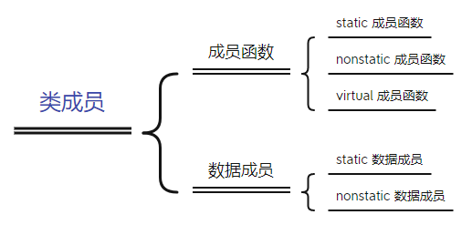

```
class Base
{
public:
	Base(int i) :baseI(i) {};
	int getI() { return baseI; }
	static void countI() {};
	virtual ~Base() {}
	virtual void print(void) { std::cout << "Base::print()"<<std::endl; }

private:
	int baseI;
	static int baseS;
};
```

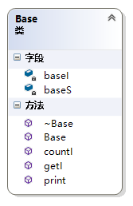

### 简单对象模型

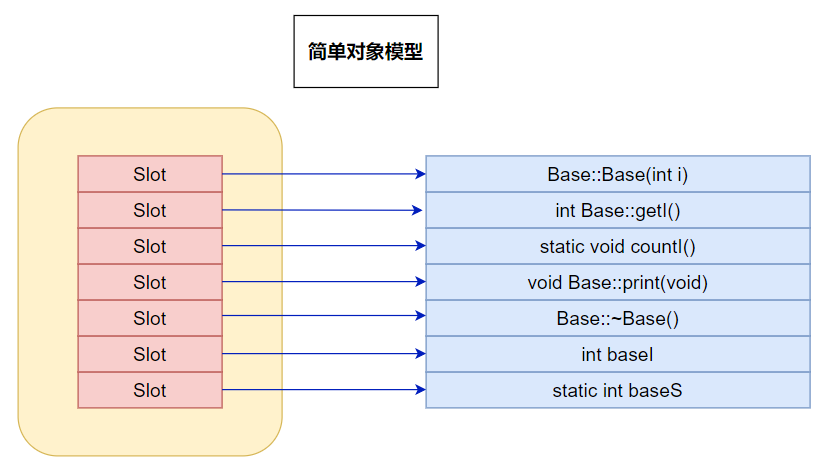

原理：

对象并没有直接保存成员而是保存了成员的指针，所有的成员占用相同的空间（跟成员类型无关），对象只是维护了一个包含成员指针的一个表，表中放的是成员的地址，无论成员变量还是函数，都是这样处理。排列的顺序与声明的顺序一致。

优缺点：

- 节省内存空间，每一个槽大小固定，无论成员内存是多大，都只有一个指针大小
- 执行效率低下，继承越多，效率急速下降

### 表格驱动对象模型

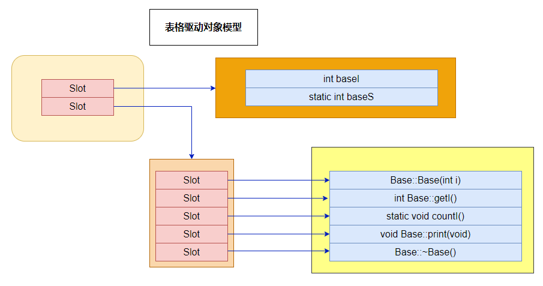

原理：

将成员分成函数和数据用两个表格保存，然后对象只保存了两个指向表格的指针。这个模型可以保证所有的对象具有相同的大小，相比于简单对象模型还与成员的个数相关。其中数据成员表中包含实际数据；函数成员表中包含的实际函数的地址（与数据成员相比，多一次寻址）。

优缺点：

- 降低了对象的slot，也就是意味着提高了访问成员的效率，直接存取变量提高了效率和内存紧凑方便寻址
- 成员变量一级寻址和成员函数二级寻址执行效率仍然很低，继承越多，效率下降越明显

## 无继承

在此模型下，nonstatic 数据成员被置于每一个类对象中，而static数据成员被置于类对象之外。static与nonstatic函数也都放在类对象之外，而对于virtual 函数，则通过虚函数表+虚指针来支持，具体如下：

- 每个类生成一个表格，称为虚表（virtual table，简称 vtbl）。虚表中存放着一堆指针，这些指针指向该类每一个虚函数。虚表中的函数地址将按声明时的顺序排列，不过当子类有多个重载函数时例外
- 每个类对象都拥有一个虚表指针(vptr)，由编译器为其生成。虚表指针的设定与重置皆由类的复制控制（也即是构造函数、析构函数、赋值操作符）来完成。vptr 的位置为编译器决定，传统上它被放在所有显示声明的成员之后，不过现在许多编译器把 vptr 放在一个类对象的最前端

另外，虚函数表的前面设置了一个指向 type_info 的指针，用以支持 RTTI（Run Time Type Identification，运行时类型识别）。RTTI 是为多态而生成的信息，包括对象继承关系，对象本身的描述等，只有具有虚函数的对象才会生成。

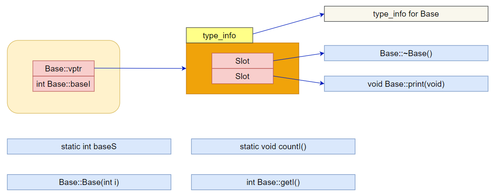

优缺点：

- 这个模型的优点在于它的空间和存取时间的效率
- 如果应用程序本身未改变，但当所使用的类的 non static 数据成员添加删除或修改时，需要重新编译

```
void test_base()
{
	Base b(1);

	std::cout << "对象的内存起始地址：" << &b << std::endl;
	std::cout << "sizeof(b):" << sizeof(b) << std::endl;

	std::cout << "type_info 信息:" << std::endl;
	RTTICompleteObjectLocator str = *((RTTICompleteObjectLocator*)*((int*)*(int*)&b - 1));	
	std::string classname(str.pTypeDescriptor->name);
	classname = classname.substr(4, classname.find("@@") - 4);
	std::cout << "根据type_info信息输出类名:" << classname << std::endl;

	std::cout << "虚函数表地址:" << (int *)(&b) << std::endl;
	//@ 验证虚表
	std::cout << "虚函数表第一个函数的地址：" << (int *)*((int*)(&b)) << std::endl;
	std::cout << "虚函数表中，第二个虚函数即 print（）的地址：" << ((int*)*(int*)(&b) + 1) << std::endl;

	//@ 通过地址调用虚函数print()
	typedef void(*Fun)(void);
	Fun IsPrint = (Fun)* ((int*)*(int*)(&b) + 1);
	std::cout << std::endl;
	std::cout << "调用了虚函数:";
	IsPrint(); //@ 若地址正确，则调用了Base类的虚函数print()
	std::cout << std::endl;

	//@ 输入static函数的地址
	b.countI(); //@ 先调用函数以产生一个实例
	std::cout << "static函数countI()的地址：" << b.countI << std::endl;

	//@ 验证nonstatic数据成员
	std::cout << "推测nonstatic数据成员baseI的地址：" << (int *)(&b) + 1 << std::endl;
	std::cout << "根据推测出的地址，输出该地址的值：" << *((int *)(&b) + 1) << std::endl;
	std::cout << "Base::getI():" << b.getI() << std::endl;
}
```

结论：

- 通过 `(int *)(&p)` 取得虚函数表的地址
- type_info 信息存在于虚表的前一个位置
- 虚函数表的第一个函数是析构函数，虚函数表的第二个函数是虚函数 print()
- 虚表指针的下一个位置为 nonstatic 数据成员 baseI
- static成员函数的地址段位与虚表指针、baseI 的地址段位不同

## 普通继承

### 单继承

```
class Derive : public Base
{
public:
	Derive(int d) :Base(1000), DeriveI(d) {};
	//@ overwrite父类虚函数
	virtual void print(void) { std::cout << "Drive::Drive_print()" << std::endl; }
	//@ Derive声明的新的虚函数
	virtual void Drive_print() { std::cout << "Drive::Drive_print()" << std::endl; }
	virtual ~Derive() { std::cout << "Derive::~Derive()" << std::endl; }
private:
	int DeriveI;
};
```

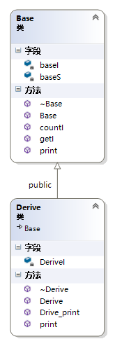

对象模型：

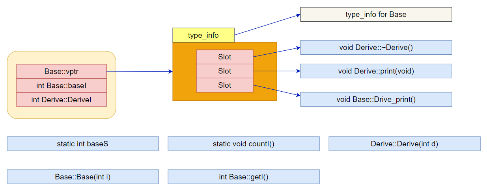

```
void test_simple_inherit()
{
	Derive d(6);

	std::cout << "对象的内存起始地址：" << &d << std::endl;
	std::cout << "sizeof(d):" << sizeof(d) << std::endl;

	std::cout << "type_info 信息:" << std::endl;
	RTTICompleteObjectLocator str = *((RTTICompleteObjectLocator*)*((int*)*(int*)&d - 1));
	std::string classname(str.pTypeDescriptor->name);
	classname = classname.substr(4, classname.find("@@") - 4);
	std::cout << "根据type_info信息输出类名:" << classname << std::endl;

	std::cout << "Base::vptr";
	std::cout << "\t地址：" << (int *)(&d) << std::endl;

	typedef void(*Fun)(void);

	std::cout << "  [1]";
	Fun fun1 = (Fun)*((int *)*((int *)(&d)) + 1);
	fun1();
	std::cout << "\t地址:\t" << *((int *)*((int *)(&d))) << std::endl;

	std::cout << "  [2]";
	Fun fun2 = (Fun)*((int *)*((int *)(&d)) + 2);
	fun2();
	std::cout << "\t地址:\t" << *((int *)*((int *)(&d)) + 2) << std::endl;

	std::cout << "Base::baseI=" << *(int*)((int *)(&d) + 1);
	std::cout << "\t地址：" << (int *)(&d) + 1;
	std::cout << std::endl;

	std::cout << "Derive::DeriveI=" << *(int*)((int *)(&d) + 2);
	std::cout << "\t地址：" << (int *)(&d) + 2;
	std::cout << std::endl;

	return;
}
```

结论：

- 单继承中（一般继承），子类会扩展父类的虚函数表
- 如果子类重写了父类的虚函数，将使用子类的虚函数替换虚函数表中的父类虚函数

### 多继承

```
class Base
{
public:
	Base(int i) :baseI(i) {};
	virtual ~Base() {}

	int getI() { return baseI; }
	static void countI() {};
	virtual void print(void) { std::cout << "Base::print()" << std::endl; }

private:
	int baseI;
	static int baseS;
};

class Base_2
{
public:
	Base_2(int i) :base2I(i) {};
	virtual ~Base_2() {}

	int getI() { return base2I; }
	static void countI() {};
	virtual void print(void) { std::cout << "Base_2::print()" << std::endl; }


private:
	int base2I;
	static int base2S;
};

class Drive_multyBase :public Base, public Base_2
{
public:
	Drive_multyBase(int d) :Base(1000), Base_2(2000), Drive_multyBaseI(d) {};

	virtual void print(void) { std::cout << "Drive_multyBase::print" << std::endl; }
	virtual void Drive_print() { std::cout << "Drive_multyBase::Drive_print" << std::endl; }

private:
	int Drive_multyBaseI;
};
```

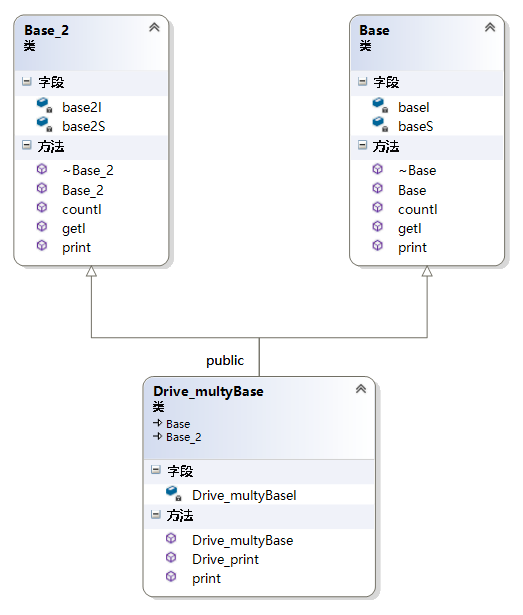

对象模型：

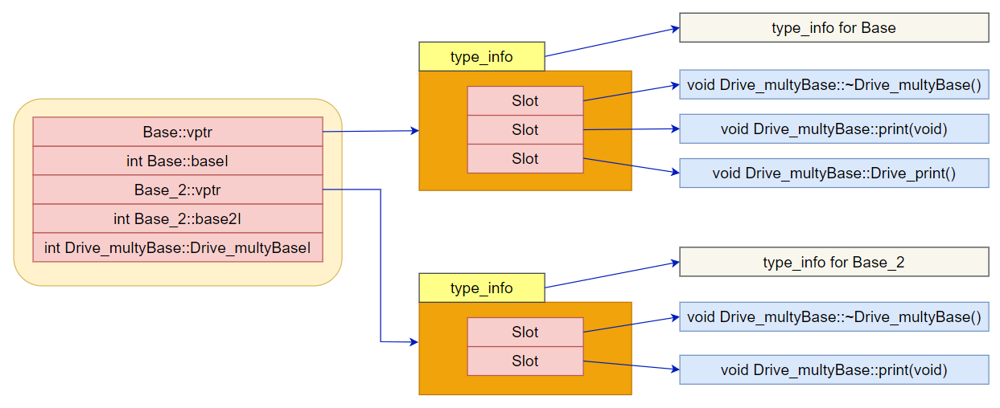

```
void test_multi_inherit()
{
	Drive_multyBase d(3000);

	std::cout << "对象的内存起始地址：" << &d << std::endl;
	std::cout << "sizeof(d):" << sizeof(d) << std::endl;

	std::cout << "type_info 信息:" << std::endl;
	RTTICompleteObjectLocator str = *((RTTICompleteObjectLocator*)*((int*)*(int*)&d - 1));
	std::string classname(str.pTypeDescriptor->name);
	classname = classname.substr(4, classname.find("@@") - 4);
	std::cout << "根据type_info信息输出类名:" << classname << std::endl;

	std::cout << "Base::vptr";
	std::cout << "\t地址：" << (int *)(&d) << std::endl;

	typedef void(*Fun)(void);

	std::cout << "  [1]";
	Fun fun1 = (Fun)*((int *)*((int *)(&d)) + 1);
	fun1();
	std::cout << "\t地址:\t" << *((int *)*((int *)(&d)) + 1) << std::endl;

	std::cout << "  [2]";
	Fun fun2 = (Fun)*((int *)*((int *)(&d)) + 2);
	fun2();
	std::cout << "\t地址:\t" << *((int *)*((int *)(&d)) + 2) << std::endl;
	std::cout << "[结束]地址:\t" << *((int *)*((int *)(&d)) + 3) << std::endl;

	std::cout << "Base::baseI=" << *(int*)((int *)(&d) + 1);
	std::cout << "\t地址：" << (int *)(&d) + 1;
	std::cout << std::endl;

	std::cout << "type_info 信息:" << std::endl;
	RTTICompleteObjectLocator str2 = *((RTTICompleteObjectLocator*)*((int*)(((int*)*((int *)(&d) + 2)) - 1)));
	std::string classname2(str2.pTypeDescriptor->name);
	classname2 = classname2.substr(4, classname2.find("@@") - 4);
	std::cout << "根据type_info信息输出类名:" << classname2 << std::endl;
			

	std::cout << "Base_2::vptr";
	std::cout << "\t地址：" << (int *)(&d) + 2 << std::endl;

	std::cout << "  [1]";
	Fun fun3 = (Fun)*((int*)(((int*)*((int *)(&d) + 2)) + 1));
	fun3();
	std::cout << "\t地址:\t" << *(int*)(((int*)*((int *)(&d) + 2)) + 1) << std::endl;
	std::cout << "[结束]地址:\t" << *(int*)(((int*)*((int *)(&d) + 2)) + 2) << std::endl;

	std::cout << "Base_2::base2I=" << *(int*)((int *)(&d) + 3);
	std::cout << "\t地址：" << (int *)(&d) + 3;
	std::cout << std::endl;

	std::cout << "Drive_multyBase::Drive_multyBaseI=" << *(int*)((int *)(&d) + 4);
	std::cout << "\t地址：" << (int *)(&d) + 4;
	std::cout << std::endl;

	return;
}
```

结论：

- 子类的虚函数被放在声明的第一个基类的虚函数表中
- overwrite时，所有基类的print()函数都被子类的 print() 函数覆盖
- 内存布局中，父类按照其声明顺序排列

### 菱形继承

菱形继承也称为钻石型继承或重复继承，它指的是基类被某个派生类简单重复继承了多次。这样，派生类对象中拥有多份基类实例。

```
class B
{
public:
	int ib;

public:
	B(int i = 1) :ib(i) {}
	virtual void f() { std::cout << "B::f()" << std::endl; }
	virtual void Bf() { std::cout << "B::Bf()" << std::endl; }
};

class B1 : public B
{
public:
	int ib1;

public:
	B1(int i = 100) :ib1(i) {}
	virtual void f() { std::cout << "B1::f()" << std::endl; }
	virtual void f1() { std::cout << "B1::f1()" << std::endl; }
	virtual void Bf1() { std::cout << "B1::Bf1()" << std::endl; }
};

class B2 : public B
{
public:
	int ib2;

public:
	B2(int i = 1000) :ib2(i) {}
	virtual void f() { std::cout << "B2::f()" << std::endl; }
	virtual void f2() { std::cout << "B2::f2()" << std::endl; }
	virtual void Bf2() { std::cout << "B2::Bf2()" << std::endl; }
};


class D : public B1, public B2
{
public:
	int id;

public:
	D(int i = 10000) :id(i) {}
	virtual void f() { std::cout << "D::f()" << std::endl; }
	virtual void f1() { std::cout << "D::f1()" << std::endl; }
	virtual void f2() { std::cout << "D::f2()" << std::endl; }
	virtual void Df() { std::cout << "D::Df()" << std::endl; }
};
```

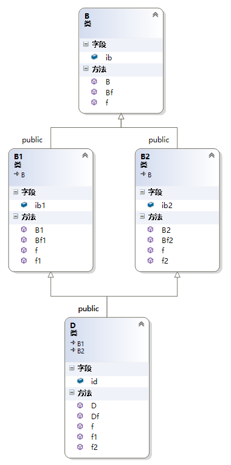

对象模型：

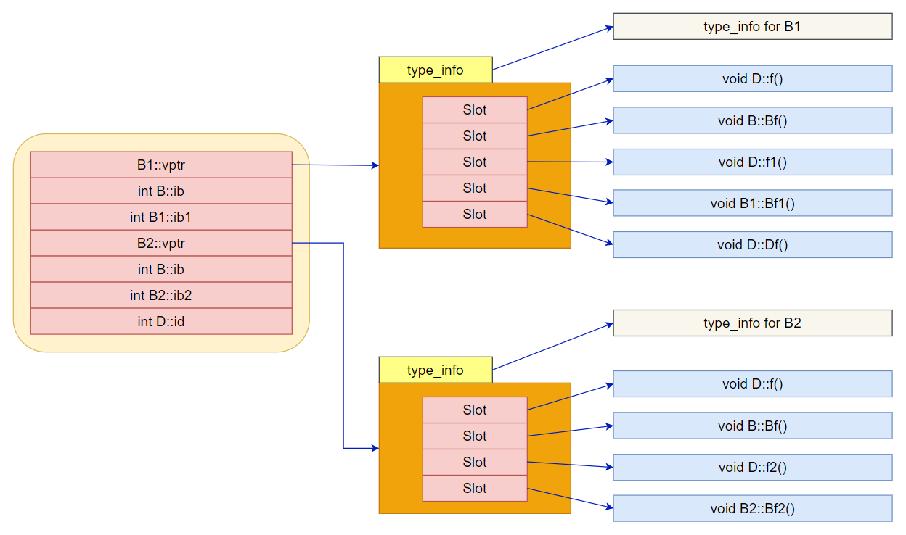

```
void test_diamods_inherit()
{
	D d(3000);

	std::cout << "对象的内存起始地址：" << &d << std::endl;
	std::cout << "sizeof(d):" << sizeof(d) << std::endl;

	std::cout << "type_info 信息:" << std::endl;
	RTTICompleteObjectLocator str = *((RTTICompleteObjectLocator*)*((int*)*(int*)&d - 1));
	std::string classname(str.pTypeDescriptor->name);
	classname = classname.substr(4, classname.find("@@") - 4);
	std::cout << "根据type_info信息输出类名:" << classname << std::endl;

	typedef void(*Fun)(void);

	std::cout << "Base::vptr";
	std::cout << "\t地址：" << (int *)(&d) << std::endl;

	std::cout << "  [0]";
	Fun fun0 = (Fun)*((int *)*((int *)(&d)) + 0);
	fun0();
	std::cout << "\t地址:\t" << *((int *)*((int *)(&d)) + 0) << std::endl;

	std::cout << "  [1]";
	Fun fun1 = (Fun)*((int *)*((int *)(&d)) + 1);
	fun1();
	std::cout << "\t地址:\t" << *((int *)*((int *)(&d)) + 1) << std::endl;

	std::cout << "  [2]";
	Fun fun2 = (Fun)*((int *)*((int *)(&d)) + 2);
	fun2();
	std::cout << "\t地址:\t" << *((int *)*((int *)(&d)) + 2) << std::endl;

	std::cout << "  [3]";
	Fun fun3 = (Fun)*((int *)*((int *)(&d)) + 3);
	fun3();
	std::cout << "\t地址:\t" << *((int *)*((int *)(&d)) + 3) << std::endl;

	std::cout << "  [4]";
	Fun fun4 = (Fun)*((int *)*((int *)(&d)) + 4);
	fun4();
	std::cout << "\t地址:\t" << *((int *)*((int *)(&d)) + 4) << std::endl;

	std::cout << "[结束]地址:\t" << *((int *)*((int *)(&d)) + 5) << std::endl;

	std::cout << "B::ib=" << *(int*)((int *)(&d) + 1);
	std::cout << "\t地址：" << (int *)(&d) + 1;
	std::cout << std::endl;

	std::cout << "B1::ib1=" << *(int*)((int *)(&d) + 2);
	std::cout << "\t地址：" << (int *)(&d) + 2;
	std::cout << std::endl;

	std::cout << "B2::vptr";
	std::cout << "\t地址：" << (int *)(&d) + 3<< std::endl;

	std::cout << "  [0]";
	Fun fun5 = (Fun)*((int *)*((int *)(&d) + 3) + 0);
	fun5();
	std::cout << "\t地址:\t" << *((int *)*((int *)(&d) + 3) + 0) << std::endl;

	std::cout << "  [1]";
	Fun fun6 = (Fun)*((int *)*((int *)(&d) + 3) + 1);
	fun6();
	std::cout << "\t地址:\t" << *((int *)*((int *)(&d) + 3) + 1) << std::endl;

	std::cout << "  [2]";
	Fun fun7 = (Fun)*((int *)*((int *)(&d) + 3) + 2);
	fun7();
	std::cout << "\t地址:\t" << *((int *)*((int *)(&d) + 3) + 2) << std::endl;

	std::cout << "  [3]";
	Fun fun8 = (Fun)*((int *)*((int *)(&d) + 3) + 3);
	fun8();
	std::cout << "\t地址:\t" << *((int *)*((int *)(&d) + 3) + 3) << std::endl;

	std::cout << "[结束]地址:\t" << *((int *)*((int *)(&d) + 3) + 4) << std::endl;

	std::cout << "B::ib=" << *(int*)((int *)(&d) + 4);
	std::cout << "\t地址：" << (int *)(&d) + 4;
	std::cout << std::endl;
	
	std::cout << "B2::ib2=" << *(int*)((int *)(&d) + 5);
	std::cout << "\t地址：" << (int *)(&d) + 5;
	std::cout << std::endl;

	std::cout << "D::id=" << *(int*)((int *)(&d) + 6);
	std::cout << "\t地址：" << (int *)(&d) + 6;
	std::cout << std::endl;
	
	return;
}
```

由于 D 类间接继承了 B 类两次，导致 D 类对象中含有两个B类的数据成员 ib，一个属于来源 B1 类，一个来源 B2 类。这样不仅增大了空间，更重要的是引起了程序歧义：

```
D d;
 
d.ib =1 ;               //二义性错误,调用的是B1的ib还是B2的ib？
 
d.B1::ib = 1;           //正确 
d.B2::ib = 1;           //正确
```

## 虚继承

虚继承解决了菱形继承中派生类拥有多个间接父类实例的情况。虚继承的派生类的内存布局与普通继承很多不同，主要体现在：

- 虚继承的子类，如果本身定义了新的虚函数，则编译器为其生成一个虚函数表指针（vptr）以及一张虚函数表。该 vptr 位于对象内存最前面。而非虚继承：直接扩展父类虚函数表
- 虚继承的子类也单独保留了父类的 vptr 与虚函数表。这部分内容接与子类内容以一个四字节的 0x00 来分界
- 虚继承的子类对象中，含有四字节的虚表指针偏移值

在 C++ 对象模型中，虚继承而来的子类会生成一个隐藏的虚基类指针（vbptr），在 Microsoft Visual C++ 中，虚基类表指针总是在虚函数表指针之后，因而，对某个类实例来说，如果它有虚基类指针，那么虚基类指针可能在实例的 0 字节偏移处（该类没有 vptr 时，vbptr 就处于类实例内存布局的最前面），也可能在类实例的 4 字节偏移处。

一个类的虚基类指针指向的虚基类表，与虚函数表一样，虚基类表也由多个条目组成，条目中存放的是偏移值。第一个条目存放虚基类表指针（vbptr）所在地址到该类内存首地址的偏移值，由第一段的分析我们知道，这个偏移值为 0（类没有 vptr）或者 -4（类有虚函数，此时有 vptr）。虚基类表的第二、第三...个条目依次为该类的最左虚继承父类、次左虚继承父类...的内存地址相对于虚基类表指针的偏移值。

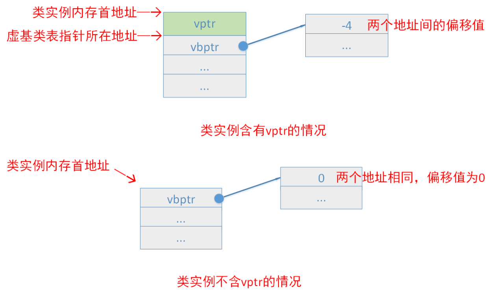

### 简单虚继承

```
class B
{
public:
	int ib;

public:
	B(int i = 1) :ib(i) {}
	virtual void f() { std::cout << "B::f()" << std::endl; }
	virtual void Bf() { std::cout << "B::Bf()" << std::endl; }
};

class B1 : public virtual B
{
public:
	int ib1;

public:
	B1(int i = 100) :ib1(i) {}
	virtual void f() { std::cout << "B1::f()" << std::endl; }
	virtual void f1() { std::cout << "B1::f1()" << std::endl; }
	virtual void Bf1() { std::cout << "B1::Bf1()" << std::endl; }
};
```

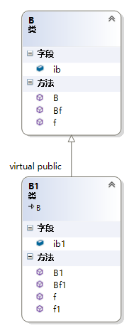

对象模型：

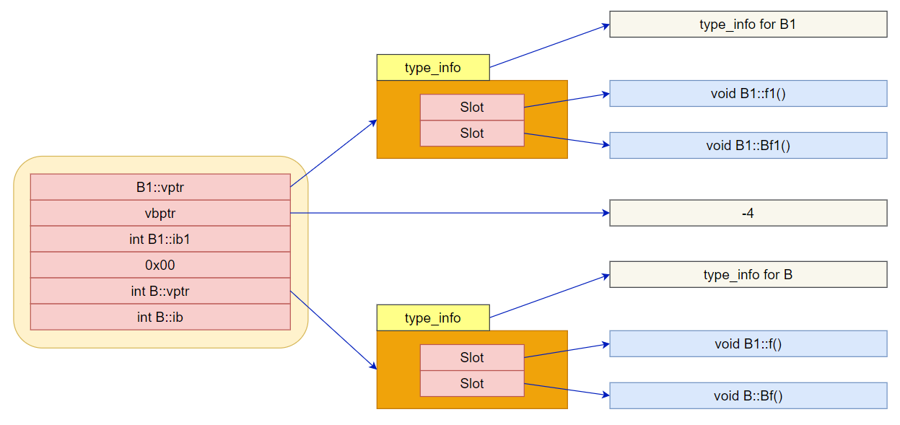

```
void test_simple_virtual_inherit()
{
	B1 b;
	std::cout << "对象的内存起始地址：" << &b << std::endl;
	std::cout << "sizeof(b):" << sizeof(b) << std::endl;

	typedef void(*Fun)(void);

	std::cout << "B1::vptr";
	std::cout << "\t地址：" << (int *)(&b) << std::endl;

	for (int i = 0; i < 2; ++i)
	{
		std::cout << "  [" << i << "]";
		Fun func = (Fun)*((int *)*(int *)(&b) + i);
		func();
		std::cout << "\t地址：\t" << *((int *)*(int *)(&b) + i) << std::endl;
	}
	std::cout << "[结束]地址:\t" << *((int *)*(int *)(&b) + 2) << std::endl;
		
	std::cout << "vbptr::offset=" << *(int*)*((int*)(&b) + 1);
	std::cout << "\tvbptr 地址：" << (int*)*((int*)(&b) + 1);
	std::cout << std::endl;

	std::cout << "B1::ib1=" << *(int*)((int *)(&b) + 2);
	std::cout << "\t地址：" << (int *)(&b) + 2;
	std::cout << std::endl;

	std::cout << "0x00值:" << *(int*)((int *)(&b) + 3);
	std::cout << "\t\t地址:" << (int *)(&b) + 3;
	std::cout << std::endl;

	std::cout << "B::vptr";
	std::cout << "\t地址：" << (int *)(&b) + 4 << std::endl;
	for (int i = 0; i < 2; ++i)
	{
		std::cout << "  [" << i << "]";
		Fun func = (Fun)*((int *)*((int *)(&b) + 4) + i);
		func();
		std::cout << "\t地址:\t" << *((int *)*((int *)(&b) + 4) + i) << std::endl;
	}

	std::cout << "B::ib=" << *(int*)((int *)(&b) + 5);
	std::cout << "\t地址: " << (int *)(&b) + 5;
	std::cout << std::endl;

	return;
}
```

### 菱形虚继承

```
class B
{
public:
	int ib;

public:
	B(int i = 1) :ib(i) {}
	virtual void f() { std::cout << "B::f()" << std::endl; }
	virtual void Bf() { std::cout << "B::Bf()" << std::endl; }
};

class B1 : public virtual B
{
public:
	int ib1;

public:
	B1(int i = 100) :ib1(i) {}
	virtual void f() { std::cout << "B1::f()" << std::endl; }
	virtual void f1() { std::cout << "B1::f1()" << std::endl; }
	virtual void Bf1() { std::cout << "B1::Bf1()" << std::endl; }
};

class B2 : public virtual B
{
public:
	int ib2;

public:
	B2(int i = 1000) :ib2(i) {}
	virtual void f() { std::cout << "B2::f()" << std::endl; }
	virtual void f2() { std::cout << "B2::f2()" << std::endl; }
	virtual void Bf2() { std::cout << "B2::Bf2()" << std::endl; }
};


class D : public B1, public B2
{
public:
	int id;

public:
	D(int i = 10000) :id(i) {}
	virtual void f() { std::cout << "D::f()" << std::endl; }
	virtual void f1() { std::cout << "D::f1()" << std::endl; }
	virtual void f2() { std::cout << "D::f2()" << std::endl; }
	virtual void Df() { std::cout << "D::Df()" << std::endl; }
};
```

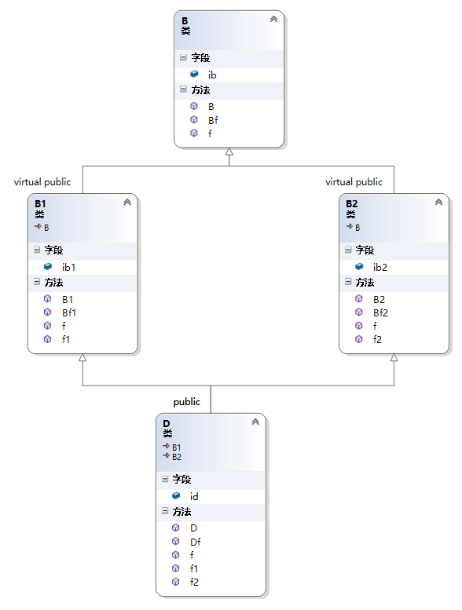

对象模型：

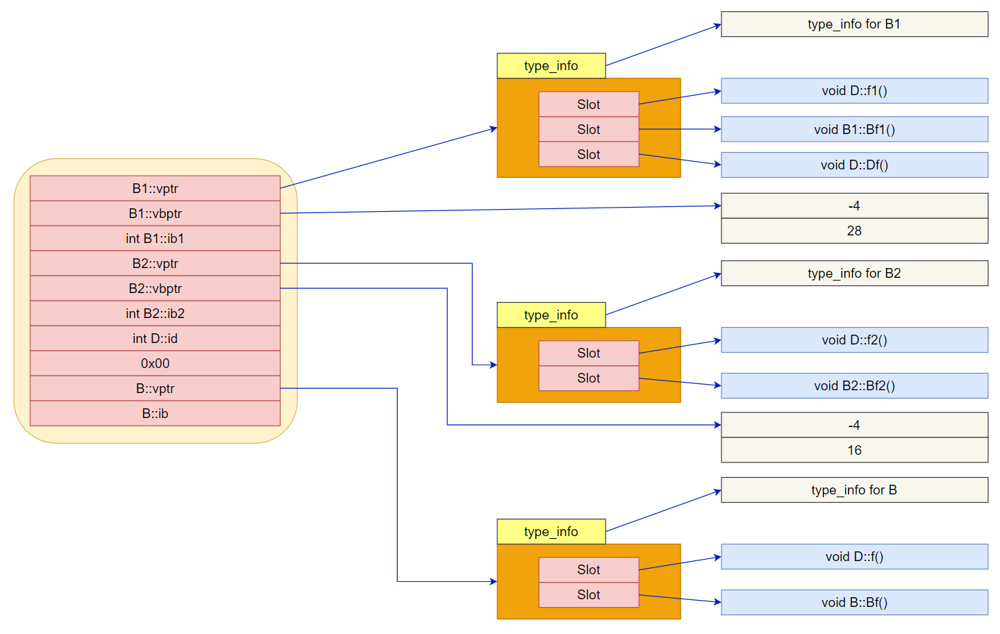

```
void test_diamonds_virtual_inherit()
{
	D d;
	std::cout << "对象的内存起始地址：" << &d << std::endl;
	std::cout << "sizeof(d):" << sizeof(d) << std::endl;

	typedef void(*Fun)(void);

	std::cout << "B1::vptr";
	std::cout << "\t地址：" << (int *)(&d) << std::endl;
	for (int i = 0; i < 3; ++i)
	{
		std::cout << "  [" << i << "]";
		Fun func = (Fun)*((int *)*(int *)(&d) + i);
		func();
		std::cout << "\t地址：\t" << *((int *)*(int *)(&d) + i) << std::endl;
	}

	std::cout << "B1::vbptr ";
	std::cout << "\t地址：" << (int *)(&d) + 1 << std::endl;  
	for (int i = 0; i < 2; i++)
	{
		std::cout << "  [" << i << "]";
		std::cout << *(int *)((int *)*((int *)(&d) + 1) + i);
		std::cout << std::endl;
	}

	std::cout << "B1::ib1=" << *(int*)((int *)(&d) + 2);
	std::cout << "\t地址：" << (int *)(&d) + 2;
	std::cout << std::endl;
	
	std::cout << "B2::vptr";
	std::cout << "\t地址：" << (int *)(&d) + 3 << std::endl;

	for (int i = 0; i<2; ++i)
	{
		std::cout << "  [" << i << "]";
		Fun fun1 = (Fun)*((int *)*((int *)(&d) + 3) + i);
		fun1();
		std::cout << "\t地址:\t" << *((int *)*((int *)(&d) + 3) + i) << std::endl;
	}

	std::cout << "B2::vbptr ";
	std::cout << "\t地址：" << (int *)(&d) + 4 << std::endl;  
	for (int i = 0; i < 2; i++)
	{
		std::cout << "  [" << i << "]";
		std::cout << *(int *)((int *)*((int *)(&d) + 4) + i);
		std::cout << std::endl;
	}

	std::cout << "B2::ib2=" << *(int*)((int *)(&d) + 5);
	std::cout << "\t地址: " << (int *)(&d) + 5;
	std::cout << std::endl;

	std::cout << "D::id=" << *(int*)((int *)(&d) + 6);
	std::cout << "\t地址: " << (int *)(&d) + 6;
	std::cout << std::endl;

	std::cout << "值=" << *(int*)((int *)(&d) + 7);
	std::cout << "\t\t地址：" << (int *)(&d) + 7;
	std::cout << std::endl;

	std::cout << "B::vptr";
	std::cout << "\t地址：" << (int *)(&d) + 8 << std::endl;

	for (int i = 0; i<2; ++i)
	{
		std::cout << "  [" << i << "]";
		Fun fun1 = (Fun)*((int *)*((int *)(&d) + 8) + i);
		fun1();
		std::cout << "\t地址:\t" << *((int *)*((int *)(&d) + 8) + i) << std::endl;
	}

	std::cout << "B::id=" << *(int*)((int *)(&d) + 9);
	std::cout << "\t地址: " << (int *)(&d) + 9;
	std::cout << std::endl;
	return;
}
```

## type_info 头文件

```
typedef unsigned long DWORD;

struct TypeDescriptor
{
	DWORD ptrToVTable;
	DWORD spare;
	char name[8];
};
struct PMD
{
	int mdisp;  //@ member displacement
	int pdisp;  //@ vbtable displacement
	int vdisp;  //@ displacement inside vbtable
};
struct RTTIBaseClassDescriptor
{
	struct TypeDescriptor* pTypeDescriptor; //@ type descriptor of the class
	DWORD numContainedBases; //@ number of nested classes following in the Base Class Array
	struct PMD where;        //@ pointer-to-member displacement info
	DWORD attributes;        //@ flags, usually 0
};

struct RTTIClassHierarchyDescriptor
{
	DWORD signature;      //@ always zero?
	DWORD attributes;     //@ bit 0 set = multiple inheritance, bit 1 set = virtual inheritance
	DWORD numBaseClasses; //@ number of classes in pBaseClassArray
	struct RTTIBaseClassArray* pBaseClassArray;
};

struct RTTICompleteObjectLocator
{
	DWORD signature; //@ always zero ?
	DWORD offset;    //@ offset of this vtable in the complete class
	DWORD cdOffset;  //@ constructor displacement offset
	struct TypeDescriptor* pTypeDescriptor; //@ TypeDescriptor of the complete class
	struct RTTIClassHierarchyDescriptor* pClassDescriptor; //@ describes inheritance hierarchy
};
```

## 类的大小

```
class B {};
class B1 :public virtual  B {};
class B2 :public virtual  B {};
class D : public B1, public B2 {};

int main()
{
	B b;
	B1 b1;
	B2 b2;
	D d;
	std::cout << "sizeof(b)=" << sizeof(b) << std::endl;  //@ 1 Bytes
	std::cout << "sizeof(b1)=" << sizeof(b1) << std::endl;  //@ 4 Bytes
	std::cout << "sizeof(b2)=" << sizeof(b2) << std::endl;  //@ 4 Bytes
	std::cout << "sizeof(d)=" << sizeof(d) << std::endl;  //@ 8 Bytes
	
	return 0;
}
```

- 编译器为空类安插 1 字节的 char，以使该类对象在内存得以配置一个地址
- b1 虚继承于 b，编译器为其安插一个4字节的虚基类表指针（32为机器），此时 b1 已不为空，编译器不再为其安插 1 字节的 char，b2 同理
- d 含有来自 b1 与 b2 两个父类的两个虚基类表指针，大小为 8 字节

## 多态的实现

### 静态绑定与动态绑定

将源代码中的函数调用解析为执行特定的函数代码块被称为函数名绑定（binding，又称联编）。译器可以在编译过程中完成这种绑定，这称为静态绑定（static binding），又称为早绑定（early binding）。

然而虚函数是这项工作变得更加困难。使用哪一个函数不是能在编译阶段时确定的，因为编译器不知道用户将选择哪种类型。所以，编译器必须能够在程序运行时选择正确的虚函数的代码，这被称为动态绑定（dynamic binding），又称为晚绑定（late binding）。

使用虚函数是有代价的，在内存和执行速度方面是有一定成本的，包括：

- 每个对象都将增大，增大量为存储虚函数表指针的大小
- 对于每个类，编译器都创建一个虚函数地址表
- 对于每个函数调用，都需要执行一项额外的操作，即到虚函数表中查找地址

### 多态的实现

多态（Polymorphisn）在C++中是通过虚函数实现的。如果类中有虚函数，编译器就会自动生成一个虚函数表，对象中包含一个指向虚函数表的指针。能够实现多态的关键在于：虚函数是允许被派生类重写的，在虚函数表中，派生类函数对覆盖基类函数。除此之外，还必须通过指针或引用调用方法才行，将派生类对象赋给基类对象。

### 析构函数设为虚函数

析构函数应当都是虚函数，除非明确该类不做基类（不被其他类继承）。基类的析构函数声明为虚函数，这样做是为了确保释放派生对象时，按照正确的顺序调用析构函数。如果析构函数不定义为虚函数，那么派生类就不会重写基类的析构函数，在有多态行为的时候，派生类的析构函数不会被调用到（有内存泄漏的风险！）。

```
class Base
{
public:
	Base() { std::cout << "Base::Base" << std::endl; }
	~Base() { std::cout << "Base::~Base" << std::endl; }
};

class Derived : public Base
{
public:
	Derived() { std::cout << "Derived::Derived" << std::endl; }
	~Derived() { std::cout << "Derived::~Base" << std::endl; }
};

int main()
{
	Base* p = new Derived();
	delete p;  //@ 不会调用派生类的析构函数

	return 0;
}
```

## 深拷贝和浅拷贝

浅拷贝：位拷贝，拷贝构造函数，赋值重载。多个对象共用同一块资源，同一块资源释放多次，崩溃或者内存泄漏。

深拷贝：每个对象共同拥有自己的资源，必须显式提供拷贝构造函数和赋值运算符。

简而言之：深拷贝和浅拷贝可以简单理解为：如果一个类拥有资源，当这个类的对象发生复制过程的时候，资源重新分配，这个过程就是深拷贝，反之，没有重新分配资源，就是浅拷贝。

# STL

## 顺序容器

顺序容器就是数据结构里的线性表，一共有 5 种：array、vector、deque、list、forward_list，按照存储结构，这 5 种容器又可以再细分成两组：

- 连续存储的数组：array、vector 和 deque  
- 指针结构的链表：list 和 forward_list  

### std::vector

由于 std::vector 是自动扩容的，当存入大量的数据后，并且对容器进行了删除操作，容器并不会自动归还被删除元素相应的内存，这时候就需要手动运行 shrink_to_fit() 释放这部分内存。

当 vector 的容量到达上限的时候，它会再分配一块两倍大小的新内存，然后把旧元素拷贝或者移动过去。这个操作的成本是非常大的，所以在使用 vector 的时候 最好能够“预估”容量，使用 reserve 提前分配足够的空间，减少动态扩容的拷贝代价。

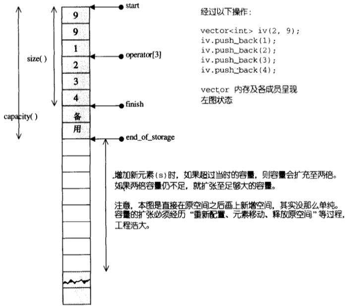

### std::array

std::array 对象的大小是固定的，如果容器大小是固定的，那么可以优先考虑使用 std::array 容器。使用 std::array 很简单，只需指定其类型和大小即可：

```
std::array<int, 4> arr = { 1, 2, 3, 4 };
```

### std::deque 

deque 也是一种可以动态增长的数组，它和 vector 的区别是，它可以在两端高效地插入删除元素，这也是它的名字 double-end queue 的来历，而 vector 则只能 在末端追加元素。  

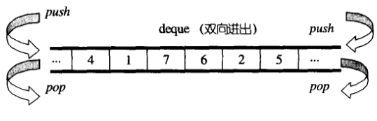

deque 的迭代器十分复杂，因而要尽量避免使用 deque，尽量使用 vector，例如给 deque 排序时，可以先将元素复制到 vector 中，排序完成后再复制回 deque。

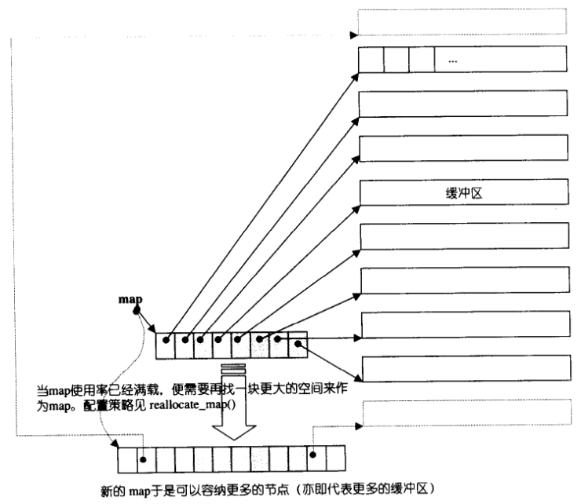

deuqe 中控器、缓冲区、迭代器之间的关系：

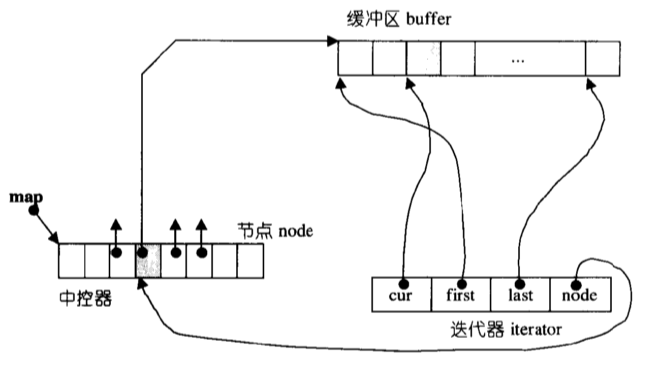

### std::list

list 是双向链表，可以向前或者向后遍历。

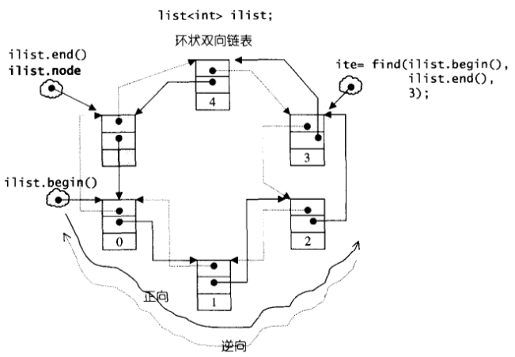

### std::forward_list

和 std::list 的双向链表的实现不同，std::forward_list 使用单向链表进行实现，提供了 O(1)  复杂度的元素插入，不支持快速随机访问（这也是链表的特点），也是标准库容器中唯一一个不提供 size() 方法的容器。当不需要双向迭代时，具有比 std::list 更高的空间利用率。

### 小结

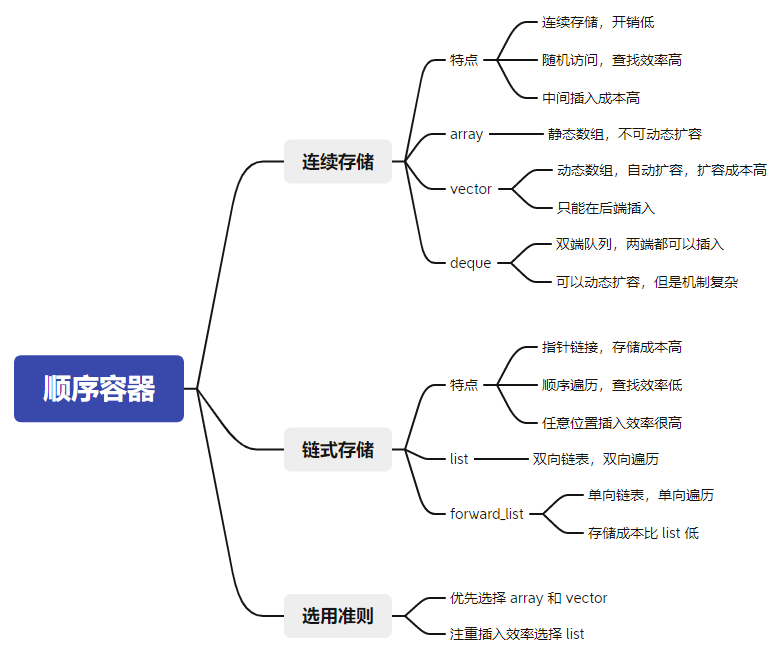

- array 和 vector 直接对应 C 的内置数组，内存布局与 C 完全兼容，所以是开销最低、速度最快的容器
- vector 和 deque 里的元素因为是连续存储的，所以在中间的插入删除效率就很低，而 list  和 forward_list 是链表结构，插入删除操作只需要调整指针，所以在任意位置的操作都很 高效
- 链表的缺点是查找效率低，只能沿着指针顺序访问，这方面不如 vector 随机访问的效率高
- 链表结构比起数组结构还有一个缺点，就是存储成本略高，因为必须要为每个元素附加一个 或者两个的指针，指向链表的前后节点
- 如果没有什么特殊需求，首选的容器就是 array 和 vector，它们的速度最快、开销最低，数组的形式也令它们最容易使用，搭配算法也可以实现快速的排序和查找。 剩下的 deque、list 和 forward_list 则适合对插入删除性能比较敏感的场合，如果还很在意空间开销，那就只能选择非链表的 deque 了

## 关联容器

### 有序容器

顺序容器的特点是，元素的次序是由它插入的次序而决定的，访问元素也就按照最初插入的顺序。而有序容器则不同，它的元素在插入容器后就被按照某种规则自动排序，所以是“有序”的。

C++ 的有序容器使用的是树结构，通常是红黑树——有着最好查找性能的二叉树。标准库里一共有四种有序容器：set/multiset 和 map/multimap。set 是集合，map 是关联数组。有 multi 前缀的容器表示可以容纳重复的 key，内部结构与无前缀的相同。

在定义容器的时候必须要指定 key 的比较函数。只不过这个函数通常是默认的 less，表示小于关系，不用特意写出来：

```
template < class T,                        // set::key_type/value_type
           class Compare = less<T>,        // set::key_compare/value_compare
           class Alloc = allocator<T>      // set::allocator_type
           > class set;

template < class Key,                                     // map::key_type
           class T,                                       // map::mapped_type
           class Compare = less<Key>,                     // map::key_compare
           class Alloc = allocator<pair<const Key,T> >    // map::allocator_type
           > class map;
```

但很多自定义类型没有默认的比较函数，要作为容器的 key 就有点麻烦。解决这个问题有两种办法：一个是重载 “<”，另一个是自定义模板参数。

```
class Edge final
{
public:
	Edge(int u, int v) : u_(u), v_(v)
	{
	}

	bool operator < (const Edge& edge) const noexcept
	{
		return this->u_ < edge.u_;
	}

private:
	int u_;
	int v_;
};

//@ 或者使用全局定义
bool operator < (const Edge& lhs, const Edge& rhs)
{
	return lhs.u_ < rhs.u_;
}

std::set<Edge> edge_set;
edge_set.emplace(1, 2);
edge_set.emplace(3, 4);
```

另一种方式是编写专门的函数对象或者 lambda 表达式，然后在容器的模板参数里指定。 这种方式更灵活，而且可以实现任意的排序准则：

```
struct EdgeComp
{
	bool operator()(const Edge& lhs, const Edge& rhs)
	{
		return lhs.u_ < rhs.v_;
	}
};

std::set<Edge, EdgeComp> edge_set;
edge_set.emplace(1, 2);
edge_set.emplace(3, 4);
```

因为有序容器在插入的时候会自动排序，所以就有隐含的插入排序成本，当数据量很大的时候，内部的位置查找、树旋转成本可能会比较高。

如果你需要实时插入排序，那么选择 set/map 是没问题的。如果是非实时，那么最 好还是用 vector，全部数据插入完成后再一次性排序，效果肯定会更好。

### 无序容器

无序容器也有四种，分别是 unordered_set/unordered_multiset、unordered_map/unordered_multimap。

无序容器同样也是集合和关联数组，用法上与有序容器几乎是一样的，区别在于内部数据结构：它不是红黑树，而是散列表（也叫哈希表，hash table）。因为它采用散列表存储数据，元素的位置取决于计算的散列值，没有规律可言，所以就 是“无序”的。

无序容器虽然不要求顺序，但是对 key 的要求反而比有序容器更“苛刻”一些：

```
template < class Key,                                    // unordered_map::key_type
           class T,                                      // unordered_map::mapped_type
           class Hash = hash<Key>,                       // unordered_map::hasher
           class Pred = equal_to<Key>,                   // unordered_map::key_equal
           class Alloc = allocator< pair<const Key,T> >  // unordered_map::allocator_type
           > class unordered_map;
```

它要求 key 具备两个条件，要把自定义类型作为 key 放入无序容器，必须要具备这两个条件：

- 一是可以计算 hash 值，只有计算 hash 值才能放入散列表
- 二是能够执行相等比较操作，hash 值可能会冲突，所以当 hash 值相同时，就要比较真正的 key 值

“==”函数比较简单，可以通过重载操作符来实现，或者定义函数对象或者 lambda 表达式。

散列函数就略麻烦一点，可以用函数对象或者 lambda 表达式实现，内部最好调用标准 的 std::hash 函数对象，而不要自己直接计算，否则很容易造成 hash 冲突。

```
auto edge_hash = [](const Edge& rhs)
{
	return std::hash<int>()(rhs.u_);
};

std::unordered_set<Edge, decltype(edge_hash)> s(10, edge_hash);
s.emplace(1, 2);
s.emplace(4, 5);
```

如果只想要单纯的集合、字典，没有排序需求，就应该用无序容器，没有比较排序的成本，它的速度就会非常快。

### 小结

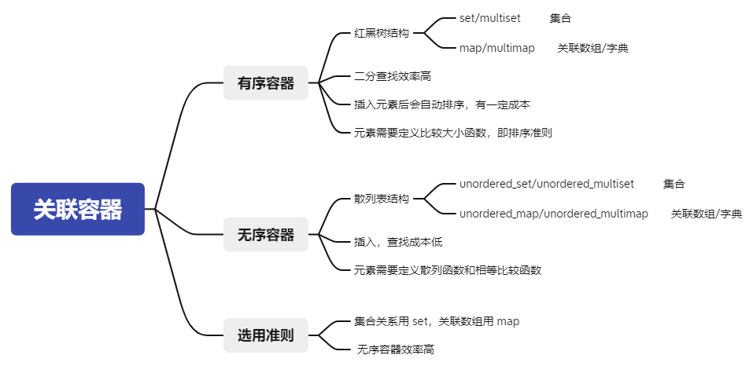

## 容器适配器

容器适配器特别点在于它们都不是完整的实现，而是依赖于某个现有的容器。

### std::queue

queue  是先进先出（FIFO）的数据结构。queue 缺省用 deque 来实现。它的实际内存布局当然是随底层的容器而定的。

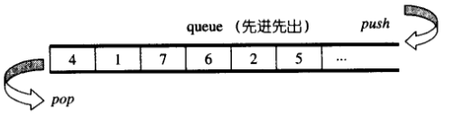

### std::stack

stack 是后进先出（LIFO）的数据结构。  stack 缺省也是用 deque 来实现 。 

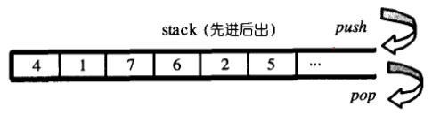

### priority_queue  

priority_queue  在使用缺省的 less 作为其 Compare 模板参数时，最大的数值会出现在容器的“顶部”。如果需要最小的数值出现在容器顶部，则可以传递 greater 作为其 Compare 模板参数。  

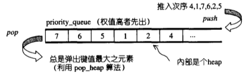

## std::tuple

std::tuple 元组是一个固定大小的不同类型值的集合。可以当作结构体用，又不需要创建结构体，但是对于多段结构体，为了可读性，建议不使用。

### 基本操作

- std::make_tuple: 构造元组
- std::get: 获得元组某个位置的值
- std::tie: 元组拆包，使用 std::ignore 忽略不想解包的元素
- std::forward_as_tuple: 创建右值引用元组

```
auto get_student(int id)
{
	if (id == 0)
		return std::make_tuple(6.7,'A',"Mike");
	if (id == 1)
		return std::make_tuple(9.0, 'B', "Tom");
	if (id == 2)
		return std::make_tuple(0.1, 'C', "Jim");
}

void print_pack(std::tuple<std::string&&, int&&> pack) 
{
	std::cout << std::get<0>(pack) << ", " << std::get<1>(pack) << '\n';
}

int main() {
	
	auto student = get_student(2);
	std::cout << std::get<0>(student) << ","
		<< std::get<1>(student) << ","
		<< std::get<2>(student) << "\n";


	double gpa;
	char grade;
	std::string name;

	std::tie(gpa, grade, std::ignore) = get_student(1);
	std::cout << gpa << "," << grade << ",";
		
	std::string str("John");
	print_pack(std::forward_as_tuple(str + " Smith", 25));
		
	return 0;
}
```

C++14 增加了使用类型来获取元组中的对象：

```
std::tuple<std::string, double, double, int> t("123", 4.5, 6.7, 8);
std::cout << std::get<std::string>(t) << std::endl;
//std::cout << std::get<double>(t) << std::endl; //@ 非法, 引发编译期错误
std::cout << std::get<3>(t) << std::endl;
```

### 运行期索引

std::get<> 依赖一个编译期的常量，所以下面的方式是不合法的：

```
int index = 1;
std::get<index>(t);
```

C++ 17 引入 std::variant<> ，可以让一个 variant<> 从而容纳提供的几种类型的变量:

```
template <size_t n, typename... T>
constexpr std::variant<T...> _tuple_index(const std::tuple<T...>& tpl, size_t i) {
    if constexpr (n >= sizeof...(T))
        throw std::out_of_range("越界.");
    if (i == n)
        return std::variant<T...>{ std::in_place_index<n>, std::get<n>(tpl) };
    return _tuple_index<(n < sizeof...(T)-1 ? n+1 : 0)>(tpl, i);
}

template <typename... T>
constexpr std::variant<T...> tuple_index(const std::tuple<T...>& tpl, size_t i) {
    return _tuple_index<0>(tpl, i);
}

template <typename T0, typename ... Ts>
std::ostream & operator<< (std::ostream & s, std::variant<T0, Ts...> const & v) { 
    std::visit([&](auto && x){ s << x;}, v); 
    return s;
}
```

这样就能：

```
int i = 1;
std::cout << tuple_index(t, i) << std::endl;
```

### 元组合并与遍历

合并两个元组可以通过 std::tuple_cat 来实现：

```
std::tuple<std::string, double, int> t1{"hello",3.45,10};
std::tuple<char, std::string> t2{'c'," world"};

auto t = std::tuple_cat(t1,t2);
```

获取元组的长度:

```
std::cout << std::tuple_size<decltype(t)>::value << std::endl;
```

## emplace_back 

emplace_back 能就地通过函数构造对象，不需要拷贝或者移动内存，相比于 push_back  能更好地避免内存的拷贝与移动，使容器插入元素的性能得到进一步提升。在大多数情况下应该优先使用 emplace_back 来代替 push_back。标准库中类似的方法有：emplace，emplace_hint，emplace_front，emplace_after，emplace_back。

emplace_back  通过构造函数的参数就可以构造对象，因此，要求对象有相应的构造函数，如果没有会编译报错。

```
struct Complicated
{
	int year_;
	double country_;
	std::string name_;

	Complicated(int a, double b, std::string s) : year_(a), country_(b), name_(s)
	{
		std::cout << "is constructed" << std::endl;
	}

	Complicated(const Complicated& other) : year_(other.year_), country_(other.country_), name_(other.name_)
	{
		std::cout << "is copied" << std::endl;
	}

	Complicated(Complicated&& other) : year_(other.year_), country_(other.country_), name_(other.name_)
	{
		std::cout << "is moved" << std::endl;
	}
};

int main()
{
	std::map<int, Complicated> m;
	int i = 4;
	double d = 5.0;
	std::string s = "C++";

	std::cout << "---insert---" << std::endl;
	m.insert(std::make_pair(1, Complicated(i, d, s)));

	std::cout << "---emplace---" << std::endl;
	m.emplace(2, Complicated(i, d, s));

	std::vector<Complicated> v;
	std::cout << "---emplace_back---" << std::endl;
	v.emplace_back(i, d, s);

	std::cout << "---push_back---" << std::endl;
	v.push_back(Complicated(i, d, s));

	return 0;
}
```

## 算法

### 迭代器

C++ 里的迭代器也有很多种，比如输入迭代器、输出迭代器、双向迭代器、随机访问迭代器。


容器一般都会提供 begin()、end() 成员函数，调用它们就可以得到表示两个端点的迭代 器，具体类型最好用 auto 自动推导，不要过分关心。也可以使用更加通用的全局函数 begin()、end()，虽然效果是一样的，但写起来比较方便，看起来也更清楚（另外还有 cbegin()、cend() 函数，返回的是常量迭代器）：

```
std::vector<int> vec{1,2,3,4,5,6};

auto it1 = std::begin(vec);
auto it2 = std::cbegin(vec);
```

迭代器和指针类似，也可以前进和后退，但你不能假设它一定支持 “++”，“--” 操作符， 最好也要用函数来操作，常用的有这么几个：

- distance()，计算两个迭代器之间的距离
- advance()，前进或者后退 N 步
- next()/prev()，计算迭代器前后的某个位置

一般而言，iterator 可写入，  const_iterator 类型不可写入。

迭代器适配器：

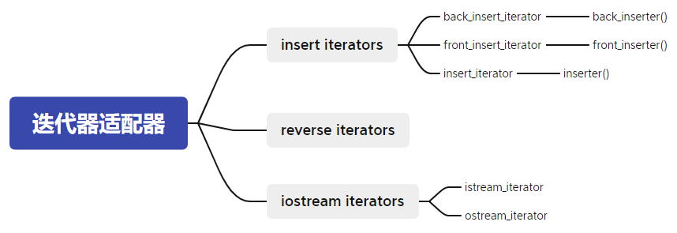

 ```
std::vector<int> v1{1,2,3};
std::vector<int> v2;

std::copy(v1.begin(), v1.end(), std::back_inserter(v2));	
std::copy(v2.begin(), v2.end(), std::ostream_iterator<int>(std::cout,","));
 ```

### 常用算法

#### 手写循环的替代品

```
std::vector<int> vec{1,2,3,4,5,6};

std::for_each(vec.begin(), vec.end(), [](const int& val) {std::cout << val << std::endl; });
```

#### 排序算法

C++ 准备了多种不同的排序算法：

- 快速排序算法，应该用 sort，通常用它准没错
- 要求排序后仍然保持元素的相对顺序，应该用 stable_sort，它是稳定的
- 选出前几名（TopN），应该用 partial_sort
- 选出前几名，但不要求再排出名次（BestN），应该用 nth_element
- 中位数（Median）、百分位数（Percentile），应该用 nth_element
- 按照某种规则把元素划分成两组，应该用 partition
- 第一名和最后一名，应该用 min_element，max_element，minmax_element

```
std::vector<int> vec{ -1,9,3,0,1,2,5,4,7,8,3,6,3 };

//@ 排序前3名
std::partial_sort(vec.begin(),std::next(vec.begin(),3),vec.end());
//@ 中位数
auto mid_it = std::next(vec.begin(),vec.size()/2);
std::nth_element(vec.begin(), mid_it, vec.end());
auto mid = *mid_it;
//@ 找出大于 6 的所有数字
auto pos = std::partition(vec.begin(), vec.end(), [](const int& x) {
return x > 6;
});
std::vector<int> bigeer_than_6(vec.begin(),pos);
//@ 最大值和最小值
auto value = std::minmax_element(vec.begin(),vec.end());
auto min_val = *value.first;
auto max_val = *value.second;
```

在使用这些排序算法时，还要注意一点，它们对迭代器要求比较高，通常都是随机访问迭代 器（minmax_element 除外），所以最好在顺序容器 array/vector 上调用。

如果是 list 容器，应该调用成员函数 sort()，它对链表结构做了特别的优化。有序容器 set/map 本身就已经排好序了，直接对迭代器做运算就可以得到结果。而对无序容器，则 不要调用排序算法，原因你应该不难想到（散列表结构的特殊性质，导致迭代器不满足要 求、元素无法交换位置）。

#### 查找算法

算法 binary_search，顾名思义，就是在已经排好序的区间里执行二分查找。但糟糕的是， 它只返回一个 bool 值，告知元素是否存在，而更多的时候，我们是想定位到那个元素，所 以 binary_search 几乎没什么用。

```
std::vector<int> vec{ -1,9,3,0,1,2,5,4,7,8,3,6,3 };
std::sort(vec.begin(),vec.end());
bool found = std::binary_search(vec.begin(),vec.end(),9);
```

想要在已序容器上执行二分查找，要用到一个名字比较怪的算法：lower_bound，它返回 第一个“大于或等于”值的位置，lower_bound 的返回值是一个迭代器，所以就要做一点判断工作，才能知道是否真的找到 了。判断的条件有两个，一个是迭代器是否有效，另一个是迭代器的值是不是要找的值。

注意 lower_bound 的查找条件是“大于等于”，而不是“等于”，所以它的真正含义 是“大于等于值的第一个位置”。相应的也就有“大于等于值的最后一个位置”，算法叫 upper_bound，返回的是第一个“大于”值的元素。

它俩的返回值构成一个区间，这个区间往前就是所有比被查找值小的元素，往后就是所有比 被查找值大的元素，可以写成一个简单的不等式：

```
begin < x <= lower_bound < upper_bound < end
```

对于有序容器 set/map，就不需要调用这三个算法了，它们有等价的成员函数 find/lower_bound/upper_bound，效果是一样的。

```
std::multiset<int> s{3,5,1,2,3,3,6,6,7,8};
auto pos = s.find(8);

auto lower_pos = s.lower_bound(6);
auto upper_pos = s.upper_bound(6);

std::for_each(lower_pos, upper_pos, [](const int x) {std::cout << x << std::endl; });
```

除了 binary_search、lower_bound 和 upper_bound，标准库里还有一些查找算法可以 用于未排序的容器，虽然肯定没有排序后的二分查找速度快，但也正因为不需要排序，所以 适应范围更广。这些算法以 find 和 search 命名，其中用于查找区间的 find_first_of/find_end。

```
std::vector<int> vec{ -1,9,3,0,1,2,5,4,7,8,3,6,3 };
auto pos = std::find_if(vec.begin(), vec.end(), [](const int& x) {return x % 2 == 0; });

std::array<int, 2> arr{ 7, 8 };
pos = std::find_first_of(vec.begin(), vec.end(), arr.begin(), arr.end());
```

## 仿函数

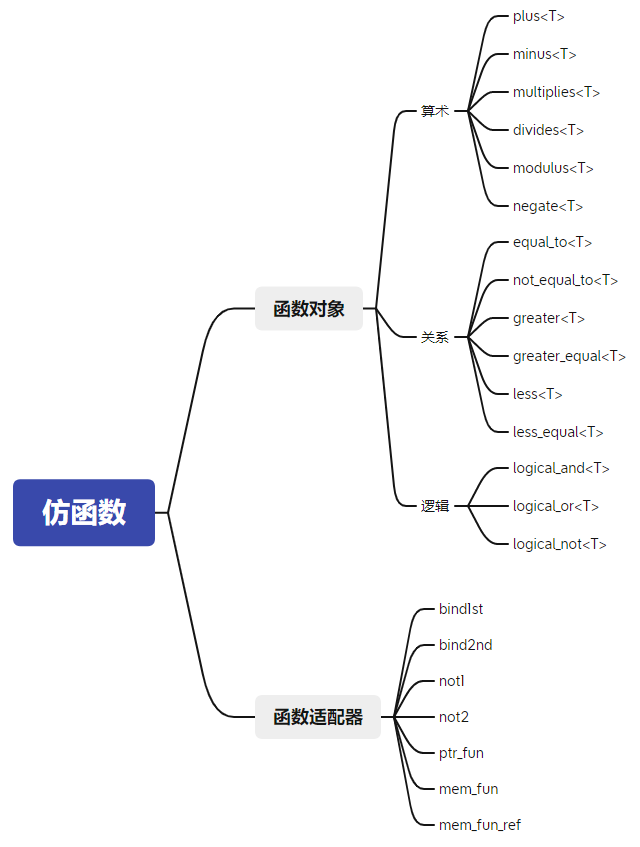

### 标准的函数配接器

如果可配接对象的 operator() 接受一个参数则使用 not1；如果可配接对象的 operator() 接受两个参数则使用 not2。

 bind1st 表示绑定第一个参数，bind2nd 表示绑定第二个参数。

### 普通函数和类的成员函数配接

- mem_fun：将成员函数转换为函数对象(指针版本)
- mem_fun_ref：将成员函数转换为函数对象(引用版本)
- ptr_fun：将函数指针转换为函数对象

```
class Widget
{
public:
	void test() {}
};

void test(Widget& w) {}

void test_fun()
{
	std::vector<Widget> vec;

	std::for_each(vec.begin(),vec.end(),test);
	std::for_each(vec.begin(), vec.end(), std::ptr_fun(test));
	std::for_each(vec.begin(), vec.end(), std::mem_fun_ref(&Widget::test));

	std::vector<Widget*> vec2;
	std::for_each(vec2.begin(), vec2.end(), std::mem_fun(&Widget::test));
}
```

C++11 中已不再推荐使用 ptr_fun、mem_fun、mem_fun_ref、bind1st、bind2nd  等相关函数。

## STL 使用注意事项

### 谨慎使用 `vector<bool>`

`vector<bool>` 并不是一个真正的容器，也并不存储真正的 bool 类型，为了节省空间，它存储的是 bool 的紧凑表示，通常是一个 bit。由于指向单个 bit 的指针或引用都是不被允许的，`vector<bool>` 采用代理对象模拟指针指向单个 bit。 

```
std::vector<bool> v;

bool* p = &v[0]; //@ 错误
std::vector<bool>::reference * pr = &v[0]; //@ OK
```

可以考虑两种方式替代 `vector<bool>`：

- `deque<bool>` 但是要注意 `deque` 的内存布局与数组并不一致
- `bitse`，`bitset` 不是 STL 容器所以不支持迭代器，其大小在编译器就已经确定，bool 也是紧凑的存储在内存中

### 调用 empty() 而不是检查 size() 是否为空

empty() 对于所有标准容器都是常数时间，而对 list 操作，size() 耗费线性时间。

### 包含裸指针的容器使用 remove 这一类算法时要特别小心

```
class Widget
{
public:
	bool is_certificated() const { return true; }
};


int main()
{
	std::vector<Widget*> vec;
	for (int i = 0; i < 3; i++)
		vec.push_back(new Widget);

	vec.erase(std::remove_if(vec.begin(), vec.end(), std::mem_fun(&Widget::is_certificated)),vec.end()); //@ 导致内存泄露

	return 0;
}
```

这种情况下应该在容器中存放智能指针。

### 逐个字符的输入考虑使用 istreambuf_iterator

常用的 istream_iterator 内部使用的 `operator >>` 实际上执行了格式化的输入，每一次的 `operator >>` 操作都有很多的附加操作：

- 一个内部 sentry 对象的构造和析构(设置和清理行为的对象)
- 检查可能影响行为的流标志
- 检查可能发生的读取错误
- 出现错误时检查流的异常屏蔽标志以决定是否抛出异常

对于 istreambuf_iterator，它直接从流的缓冲区中读取下一个字符，不存在任何的格式化，所以效率相对 istream_iterator 要高得多。对于非格式化的输出，也可以考虑使用 ostreambuf_iterator 代替 ostream_iterator（损失了格式化输出的灵活性） 。

```
//@ 把一个文本文件的内容拷贝到一个string对象中
std::ifstream inputFile("interestingData.txt");
inputFile.unsetf(std::ios::skipws); //@ 禁止忽略inputFile中的空格
std::string fileData((std::istream_iterator<char>(inputFile)), std::istream_iterator<char>()); 
//@ 速度慢

std::string fileData2((std::istreambuf_iterator<char>(inputFile)), std::istreambuf_iterator<char>()); //@ 速度快
```

### 使用函数对象而不是函数作为 STL 算法的参数

在 C/C++ 中并不能真正地将一个函数作为参数传递给另一个函数。如果我们试图将一个函数作为参数进行传递，则编译器会隐式地将它转换成一个指向该函数的指针，并将该指针传递过去。函数指针参数抑制了内联机制。以函数对象作为 STL 算法的参数，这种做法提供了包括效率在内的多种优势。从代码被编译器接受的程度而言，它们更加稳定可靠。

### vector 和 string 与旧的API

将 vector 传递给接受数组指针的函数，要注意 vector 为空的情况。迭代器并不等价于指针，所以不要将迭代器传递给参数为指针的函数：

```
void foo(const int* ptr, size_t size);

vector<int> v;
...
foo(v.empty() ? NULL : &v[0], v.size());
```

将 string 传递给接受字符串指针的函数。该方法还适用于 s 为空或包含 `\0`  的情况：

```
void foo(const char* ptr);

string s;
...
foo(s.c_str());
```

C++ 标准要求 vector 中的元素存储在连续的内存中，就像数组一样：

```
void doSomething(const int* pInts, size_t numInts) {}

std::vector<int> v{ 1, 2 };

//@  doSomething(v.begin(), v.size()); //@  错误的用法

doSomething(&v[0], v.size());
doSomething(v.data(), v.size()); //@  C++11	
doSomething(&*v.begin(), v.size()); //@  可以，但不易于理解
```

### 切勿直接修改 set 或 multiset 的键

set、multiset、map、multimap 都会按照一定的顺序存储其中的元素，但如果修改了其中用于排序的键值，则将会破坏容器的有序性。

对于 map 和 multimap 而言，其存储元素的类型为 `pair<const key, value>`，修改 map 中的 key 值将不能通过编译(除非使用 const_cast)。
对于 set 和 multiset，其存储的键值并不是 const 的，在修改其中元素的时候，要小心不要修改到键值。

```
std::map<int, std::string> m{ { 0, "xxx" } };
//@ m.begin()->first = 10; //@ build error, map的键不能修改

std::multimap<int, std::string> mm{ { 1, "yyy" } };
//@ mm.begin()->first = 10; //@ build error, multimap的键同样不能修改

std::set<int> s{ 1, 2, 3 };
//@ *(s.begin()) = 10; //@ build error, set的键不能修改
const_cast<int&>(*s.begin()) = 10; // 强制类型转换
```

### 确保目标区间足够大

无论何时，如果所使用的算法需要指定一个目标区间，那么必须确保目标区间足够大，或者确保它会随着算法的运行而增大。

```
int transmogrify(int x) { return (x + 1); }

int test()
{
	std::vector<int> values{ 1, 2, 3 };
	std::vector<int> results;
	results.reserve(results.size() + values.size()); //@ 可避免内存的重新分配
	//@std::transform(values.cbegin(), values.cend(), results.end(), transmogrify); //@ 错误，segmentation fault
	std::transform(values.cbegin(), values.cend(), std::back_inserter(results), transmogrify); //@ 正确
	//@ 在内部，std::back_inserter返回的迭代器将使得push_back被调用，所以back_inserter可适用于所有提供了push_back方法的容器

	std::list<int> results2;
	std::transform(values.cbegin(), values.cend(), std::front_inserter(results2), transmogrify);
	//@ std::front_inserter在内部利用了push_front，所以front_inserter仅适用于那些提供了push_front成员函数的容器

	return 0;
}
```

### 容器的成员函数优先于同名的算法

有些 STL 容器提供了一些与算法同名的成员函数。比如：

- 关联容器提供了：count、find、lower_bound、upper_bound 和 equal_range

- list 则提供了：remove、remove_if、unique、sort、merge 和 reverse

大多数情况下，应该使用这些成员函数，而不是相应的 STL 算法。这里有两个理由：

- 成员函数往往速度快
- 成员函数通常与容器(特别是关联容器)结合得更加紧密，这是算法所不能比的。原因在于，算法和成员函数虽然有同样的名称，但是它们所做的事情往往不完全相同

如果真的要从一个容器中删除对象的话，在调用了 remove、remove_if 或者 unique 算法之后，必须紧接着再调用 erase；而 list 的 remove、remove_if 和 unique 成员函数则实实在在地删除了元素，所以无需再调用 erase 了。

在 sort 算法与 list 的 sort 函数之间有一个很重要的区别是，前者根本不能被应用到 list 容器上，这是因为，list 的迭代器是双向迭代器，而 sort 算法要求随机访问迭代器。

在 merge 算法和 list 的 merge 函数之间也存在行为上的隔阂：merge 算法是不允许修改其源区间的，而 list::merge 则总是在修改它所操作的链表。

### 慎重删除元素

要在循环内做某些(除了删除对象之外的)操作：

- 如果容器是一个标准序列容器，则写一个循环来遍历容器中的元素，记住每次调用 erase 时，要用它的返回值更新迭代器
- 如果容器是一个标准关联容器，则写一个循环来遍历容器中的元素，记住当把迭代器传给 erase 时，要对迭代器做后缀递增

```
bool condition(int );
void dosth();

//@ 对于标准序列容器，循环遍历容器内容，利用erase的返回值更新迭代器
for(containerIt = container.begin(); containerIt != container.end())
{
	if(condition(*containerIt))
	{
		doSth();
		//@ 当标准容器中的一个元素被删除掉时，所有指向该元素以及该元素之后的迭代器都被设为无效，所以要利用erase的返回值
		containerIt = container.erase(containerIt++);
	}
	else
	{
		containerIt++;
	}
}
 
//@ 对于标准关联容器，循环遍历容器内容，并在erase之前后缀递增迭代器
for(assocIt = associatedContainer.begin(); assocIt != associatedContainer.end())
{
	if(condition(*assoIt))
	{
		dosth();
		associatedContainer.erase(assoIt++); 
	}
	else
	{
		assocIt++;
	}
}
```

### map 添加元素

从效率方面的考虑，当向 map 中添加元素时，应该使用 insert，当需要修改一个元素的值的时候，需要使用 operator[]。如果使用 operator[] 添加元素：

```
class Widget {
public:
	Widget() { std::cout << "Widget::Widget" << std::endl; }
	~Widget() { }
	Widget(const Widget& w) { std::cout << "Widget::Widget(const Widget& w)" << std::endl; }
	Widget& operator = (const Widget& w) { std::cout << "Widget::Widget& operator = (const Widget& w)" << std::endl; return *this; }
};


int main()
{
	std::map<int, Widget> m;
	Widget w1;

	//@ 如果m[0]没有对应的值，则会通过默认的构造函数生成一个widget对象
	//@ 然后再用operator=将w的值赋给这个widget对象。
	m[0] = w1;
	//@ Widget构造函数被调用两次 

	std::cout << "-------------------------------------------------------------------------------"<<std::endl;

	Widget w2;
	m.insert(std::map<int, Widget>::value_type(0, w2));  //@ 没有调用构造函数


	return 0;
}
```

### 自定义类型做 map 的 key

````
struct Man1 {
	std::string name;
	int age;
	bool operator<(const Man1& m)const {
		if (age < m.age) {
			return true;
		}
		return false;
	}
};

struct Man2 {
	std::string name;
	int age;
};

struct compare
{
	bool operator()(const Man1& l, const Man1& r)
	{
		return l.age < r.age;
	}
};

int main(int argc, char *argv[]) {
	std::map<Man1, std::string> manMap1;
	std::map<Man2, std::string, compare> manMap2;

	return 0;
}
````

### 自定义类型做 unordered_map 的 key

```
class Person {
public:
	string name;
	int age;

	Person(string n, int a) {
		name = n;
		age = a;
	}
	bool operator==(const Person & p) const
	{
		return name == p.name && age == p.age;
	}
};

class PersonHash
{
	size_t operator()(const Person & p)
	{
		return hash<string>()(p.name) ^ hash<int>()(p.age);
	}
};


int main(int argc, char* argv[])
{
	unordered_map <Person, int, PersonHash> ids;
}
```

# 模板

## 了解模板元编程

```
template <int N>
struct Fib
{
	static_assert(N >= 0,"N >= 0");
	static const int value = Fib<N - 1>::value + Fib<N - 2>::value;
};

template <>
struct Fib<1>
{
	static const int value = 1;
};

template <>
struct Fib<0>
{
	static const int value = 1;
};


int main()
{
	std::cout << Fib<2>::value << std::endl; 
	std::cout << Fib<40>::value << std::endl;
	return 0;
}
```

## 编译期类型推导  

C++ 标准库在 `<type_traits>` 头文件里定义了很多工具类模板，用来提取某个类型在某方面的特点。这些特点既是类型，又是常值。 为了方便地在值和类型之间转换，标准库定义了一些经常需要用到的工具类。为了方便使用，针对布尔值有两个额外的类型定义：    

```
typedef std::integral_constant<bool, true> true_type;
typedef std::integral_constant<bool, false> false_type;
```

这两个标准类型 true_type 和 false_type 经常可以在函数重载中见到：

```
template <typename T>
class SomeContainer
{
public:
	static void destroy(T *ptr)
	{
		_destroy(ptr, std::is_trivially_destructible<T>());
	}

private:
	static void _destroy(T* ptr,std::true_type)
	{}

	static void _destroy(T* ptr, std::false_type)
	{
		ptr->~T();
	}
};
```

除了得到布尔值和相对应的类型的 trait 模板，我们还有另外一些模板，可以用来做一些类型的转换。以一个常见的模板 remove_const 为例：

```
template <typename T>
struct remove_const {
	typedef T type;
};

template <typename T>
struct remove_const <const T>{
	typedef T type;
};
```

如果我们对 const string& 应用 remove_const，就会得到 string&，即，remove_const<const string&>::type 等价于 string&。  

如果对 const char* 应用 remove_const 的话，结果还是 const char*。原因是，const char* 是指向 const char 的指针，而不是指向char 的 const 指针。如果我们对 char * const 应用 remove_const 的话，还是可以得到 char* 的。  

如果你觉得写 is_trivially_destructible<T>::value 和 remove_const<T>::type 非常啰嗦的话，在当前的 C++ 标准里，前者有增加 _v 的编译时常量，后者有增加 _t 的类型别名：    

```
template <class T>
inline constexpr bool is_trivially_destructible_v = std::is_trivially_destructible<T>::value;

template <class T>
using remove_const_t = typename remove_const<T>::type;
```

## 外部模板

模板只有在使用时才会被编译器实例化。换句话说，只要在每个编译单元（文件）中编译的代码中遇到了被完整定义的模板，都会实例化。这就产生了重复实例化而导致的编译时间的增加。并且，我们没有办法通知编译器不要触发模板的实例化。

为此，C++11 引入了外部模板，扩充了原来的强制编译器在特定位置实例化模板的语法，使我们能够显式的通知编译器何时进行模板的实例化：

```
template class std::vector<bool>;          //@ 强行实例化

extern template class std::vector<double>; //@ 不在该当前编译文件中实例化模板
```

## 类型别名模板

模板是用来产生类型的。在传统 C++ 中，typedef  可以为类型定义一个新的名称，但是却没有办法为模板定义一个新的名称。因为，模板不是类型。例如：

```
template <typename T>
typedef std::map<std::string, T> map_t;  //@ 错误
```

但是 C++ 11 中，使用 using 声明可以实现这个目的：

```
template <typename T>
using map_t = std::map<std::string, T> ;
```

typedef 对函数指针等别名的定义语法却不相同，这通常给直接阅读造成了一定程度的困难。使用 using 声明的形式则容易理解：

```
typedef int (*process)(void *);

using NewProcess = int(*)(void *);
```

## 默认模板参数

在 C++11 中提供了一种便利，可以指定模板的默认参数：

```
template<typename T = int, typename U = int>
auto add(T x, U y) -> decltype(x+y) {
    return x+y;
}
```

## 函数模板的默认参数

C++ 11 之前允许类模板有默认参数，但是不允许函数模板有默认参数：

```
template <typename T,typename U = int,U N = 0>
struct Foo {};


template <typename T = int>  //@ C++ 11 之前不允许
void func()
{}
```

但是 C++ 11 中解除了上述对于函数模板默认参数的限制，在 C++ 11 中可以直接调用：

```
func();   //@ 如同一个普通函数
```

函数模板的默认参数不需要在数列表中从右向左书写，而是可以出现在任意位置：

```
template <typename X,typename T = int, typename U>
T func(X val1,U val2)
{
	return static_cast<int>(val1 + val2);
}
```

## 变长参数模板

声明可变参数模板时需要在 class 或 typename 关键字前面加上 ...：

- 声明一个参数包，这个参数包中可以包含 0 个到任意个模板参数
- 在模板定义的右边，可以将参数包展开成一个一个独立的参数

```
template<typename... Ts> 
class Magic;
```

模板类 Magic 的对象，能够接受不受限制个数的 typename 作为模板的形式参数，例如：

```
class Magic<int, std::vector<int>, std::map<std::string, std::vector<int>>> darkMagic;

class Magic<> nothing;
```

如果不希望产生的模板参数个数为0，可以手动的定义至少一个模板参数：

```
template<typename Require, typename... Args> 
class Magic;
```

可以使用 `sizeof...` 来计算参数的个数：

```
template<typename... Ts>
void magic(Ts... args) {
    std::cout << sizeof...(args) << std::endl;
}
```

对参数进行解包的方法：

递归模板函数：递归是非常容易想到的一种手段，也是最经典的处理方法。这种方法不断递归地向函数传递模板参数，进而达到递归遍历所有模板参数的目的。

```
template<typename T>
void print(T value) 
{
	std::cout << value << std::endl;
}

template<typename T, typename... Args>
void print(T value, Args... args)
{
	std::cout << value << std::endl;
	print(args...);
}

int main() 
{
	print(1, 2, "123", 1.1);
	return 0;
}
```

递归模板函数是一种标准的做法，但缺点显而易见的在于必须定义一个终止递归的函数。

初始化列表展开：

```
template<typename T, typename... Args>
auto print(T value, Args... args)
{
	std::cout << value << std::endl;
	std::initializer_list<T>{([&args] 
	{
		std::cout << args << std::endl;
	}(), value)...};
}
```

变参模板展开：C++17 中增加了变参模板展开的支持。

```
template<typename T, typename... Args>
void print(T t, Args... args) 
{
	std::cout << t << std::endl;
	if constexpr (sizeof...(args) > 0) 
		print(t...);
}
```

## 非类型模板参数推导

还有一种常见模板参数形式可以让不同字面量成为模板参数，即非类型模板参数：

```
template <typename T, int BufSize>
class buffer_t {
public:
    T& alloc();
    void free(T& item);
private:
    T data[BufSize];
}

buffer_t<int, 100> buf; // 100 作为模板参数
```

## 模板编程

SFINAE  即替换失败非错（substituion failure is not an error）。

### 函数模板的重载决议  

当一个函数名称和某个函数模板名称匹配时，重载决议过程大致如下：    

- 根据名称找出所有适用的函数和函数模板
- 对于适用的函数模板，要根据实际情况对模板形参进行替换；替换过程中如果发生错误，这个模板会被丢弃
- 在上面两步生成的可行函数集合中，编译器会寻找一个最佳匹配，产生对该函数的调用
- 如果没有找到最佳匹配，或者找到多个匹配程度相当的函数，则编译器需要报错  

```
struct Test final
{
	typedef int foo;
};

template <typename T>
void f(typename  T::foo)
{
	std::cout << "f(typename  T::foo)" << std::endl;
}


template <typename T>
void f(T)
{
	std::cout << "f(T)" << std::endl;
}

int main()
{
	f<Test>(10); //@ f(Test::foo)
	f<int>(10); //@ f(10),f(int::foo) 不合法
	return 0;
}
```

在这儿，体现的是 SFINAE 设计的最初用法：如果模板实例化中发生了失败，没有理由编译就此出错终止，因为还是可能有其他可用的函数重载的。  

SFINAE 可以用于其他用途。比如，根据某个实例化的成功或失败来在编译期检测类的特性。  

```
template <typename T>
struct HasReserve
{
	//@ 定义 good，bad类，只需要关注它们大小不一样
	struct good { char dummy; };
	struct bad { char dummy[2]; };

	//@ 定义 SFINAE 模板，但是模板的第二个参数是第一个参数的成员函数指针，输入参数 size_t,返回 void
	template <class U,void (U::*)(size_t)>
	struct SFINAE {};

	template <class U>
	static good	reserve(SFINAE<U, &U::reserve>*);

	template<class U>
	static bad reserve(...);

	//@ 定义常整型布尔值 value，结果是 true 还是 false，取决于 nullptr 能
	//@不能和 SFINAE* 匹配成功，而这又取决于模板参数 T 有没有返回类型是 void、接受一
	//@ 个参数并且类型为 size_t 的成员函数 reserve
	static const bool value = sizeof(reserve<T>(nullptr)) == sizeof(good);
};
```

### SFINAE 模板技巧  

C++11 开始，标准库里有了一个叫 enable_if 的模板，可以用它来选择性地启用某个函数的重载。 例如：

```
template <typename C, typename T>
enable_if_t<HasReserve<C>::value, void>	append(C& container, T* ptr, size_t size)
{
	container.reserve(
		container.size() + size);
	for (size_t i = 0; i < size;
		++i) {
		container.push_back(ptr[i]);
	}
}

template <typename C, typename T>
enable_if_t<!HasReserve<C>::value, void> append(C& container, T* ptr, size_t size)
{
	for (size_t i = 0; i < size;
		++i) {
		container.push_back(ptr[i]);
	}
}
```

对于某个 type trait，添加 _t 的后缀等价于其 type 成员类型。因而，我们可以用 enable_if_t 来取到结果的类型。  

enable_if_t<HasReserve<C>::value, void> 的意思可以理解成：如果类型 C 有reserve 成员的话，那我们启用下面的成员函数，它的返回类型为 void。

decltype 返回值：

如果只需要在某个操作有效的情况下启用某个函数，而不需要考虑相反的情况的话，有另外一个技巧可以用。对于上面的 append 的情况，如果我们想限制只有具有 reserve 成员函数的类可以使用这个重载  

```
template <typename C, typename T>
auto append(C& container, T* ptr,size_t size)-> decltype(declval<C&>().reserve(1U),void())
{
	container.reserve(
		container.size() + size);
	for (size_t i = 0; i < size;
		++i) {
		container.push_back(ptr[i]);
	}
}
```

declval  模板用来声明一个某个类型的参数，但这个参数只是用来参加模板的匹配，不允许实际使用。使用这个模板，我们可以在某类型没有默认构造函数的情况下，假想出一个该类的对象来进行类型推导。declval<C&>().reserve(1U) 用来测试 C& 类型的对象是不是可以拿 1U 作为参数来调用 reserve 成员函数。此外，我们需要记得，C++ 里的逗号表达式的意思是按顺序逐个估值，并返回最后一项。所以，上面这个函数的返回值类型是 void。  

标签分发：

```
template <typename C, typename T>
void _append(C& container, T* ptr, size_t size, true_type)
{
	container.reserve(container.size() + size);
	for (size_t i = 0; i < size; ++i)
	{
		container.push_back(ptr[i]);
	}
}

template <typename C, typename T>
void _append(C& container, T* ptr, size_t size, false_type)
{
	for (size_t i = 0; i < size;
		++i) {
		container.push_back(ptr[i]);
	}
}

template <typename C, typename T>
void append(C& container, T* ptr, size_t size)
{
	_append(container, ptr, size, integral_constant<bool, has_reserve<C>::value>{});
}
```

这个代码跟使用 enable_if 是等价的。当然，在这个例子，标签分发并没有使用 enable_if 显得方便。 

## type_traits

type_traits 提供了编译器计算，查询，判断，转换和选择的帮助类。在一定程序上可以消除冗长的 switch-case 或者 if-else 的语句。type_traits  的类型判断在编译期间就可以检查出是否是正确的类型，以便编写更安全的代码。

### std::integral_constant

在 C++ 11中定义编译期常量，只需要从 std::integral_constant 派生：

```
template <typename T>
struct GetLeftSize : std::integral_constant<int, 1>
{
};

int main()
{
	auto res = GetLeftSize<int>::value;  //@ res = 1
	return 0;
}
```

编译期 true 和 false 类型 true_type 和 false_type：

```
typedef std::integral_constant<bool, true> true_type; 
typedef std::integral_constant<bool, false> false_type;
```

### 类型判断的 type_traits

这些 type_traits 从 std::integral_constant 派生，用来检查模板类型是否为某种类型，通过这些 traits 可以获取编译期检查的 bool 值结果：

```
template <typename T>
struct is_void;

template <typename T>
struct is_array;

template <typename T>
struct is_reference;

template <typename T>
struct is_member_pointer;

...
```

使用：

```
std::cout << "int: " << std::is_const<int>::value << std::endl; //@ false
std::cout << "const int: " << std::is_const<const int>::value << std::endl; //@ true
std::cout << "const int&: " << std::is_pointer<const int*>::value << std::endl; //@ true
std::cout << "const int*: " << std::is_reference<const int&>::value << std::endl; //@ true
```

### 判断两个类型之间关系的 type_traits

```
template <typename T, typename U>
struct is_same;

template <typename Base, typename Derived>
struct is_base_of; 

template <typename From, typename To>
struct is_convertible; 
```

使用：

```
std::cout << std::is_same<int, int>::value << std::endl;  //@ true
std::cout << std::is_same<int, unsigned int>::value << std::endl;  //@ false
std::cout << std::is_same<int, int&>::value << std::endl;  //@ false

std::cout << std::is_base_of<Base, Derived>::value << std::endl; //@ true
std::cout << std::is_base_of<Derived, Base>::value << std::endl; //@ false

std::cout << std::is_convertible<Base*, Derived*>::value << std::endl; //@ false
std::cout << std::is_convertible<Derived*, Base*>::value << std::endl; //@ true
```

### 类型转换的 type_traits

```
template<typename T>
struct remove_const; 

template<typename T>
struct add_pointer;

 template<typename T>
 struct decay; 
 
 template<typename T>
 struct common_type;
 
 template<typename T>
 struct remove_extent; 
 
 ...
```

使用：

```
std::cout << std::is_same<const int, std::add_const<int>::type>::value << std::endl; //@ true
std::cout << std::is_same<int, std::remove_const<const int>::type>::value << std::endl; //@ true
std::cout << std::is_same<int&, std::add_lvalue_reference<int>::type > ::value << std::endl; //@ true
std::cout << std::is_same<int&&, std::add_rvalue_reference<int>::type > ::value << std::endl; //@ true
std::cout << std::is_same<int, std::remove_reference<int&>::type > ::value << std::endl; //@ true
std::cout << std::is_same<int, std::remove_reference<int&&>::type > ::value << std::endl; //@ true
std::cout << std::is_same<int*, std::add_pointer<int>::type > ::value << std::endl; //@ true

std::cout << std::is_same<int[2], std::remove_extent<int[][2]>::type > ::value << std::endl; //@ true
std::cout << std::is_same<int, std::remove_all_extents<int[][2][3]>::type > ::value << std::endl; //@ true

typedef std::common_type<unsigned char, short, int>::type NumericType; 
std::cout << std::is_same<int, NumericType>::value << std::endl; //@ true
```

移除引用和 cv 属性：

```
template<typename T>
typename std::remove_cv<typename std::remove_reference<T>::type>::type*
Create()
{
	typedef std::remove_cv<typename std::remove_reference<T>::type>::type U;
	return new U();
}
```

可以使用 decay 来简化：

```
template<typename T>
typename std::decay<T>::type* Create()
{
	typedef std::decay<T>::type U;
	return new U();
}
```

std::decay 除了用于普通类型外，std::decay 还可以用于数组和函数，具体的转换规则：

- 先移除 T 类型的引用，得到 U 类型，U 定义为 `remove_reference<T>::type`
- 如果 `is_array<U>::value`  为 true，修改类型 type 为 `remove_extent<U>::type*`
- 否则，如果 `is_function<U>::value` 为 true，修改类型 type 将为 `add_pointer<U>::type`
- 否则，修改类型 type 为 `remove_cv<U>::type`

利用这一点可以将函数变成函数指针类型，从而将函数指针变量保存起来，以便在后面延迟执行：

```
template<typename F>
struct SimpFunction
{
	using FnType = typename std::decay<F>::type;
	SimpFunction(F& f) : m_fn(f)
	{
	}

	void Run()
	{
		m_fn();
	}

	FnType m_fn;
};
```

### 根据条件选择的 type_traits

std::condition 在编译期根据一个判断式选择两个类型中的一个，和条件表达式的语义类似，类似于一个三元表达式：

```
template<bool B,typename T,typename F>
struct conditional;
```

如果 B 为 true，则 conditional::type 为T，否则为 F。

```
typedef std::conditional<true, int, float>::type A;  //@ int
typedef std::conditional<false, int, float>::type B; //@ float
typedef std::conditional < (sizeof(long long) > sizeof(long double)), long long, long double > ::type max_size_t;
std::cout << typeid(max_size_t).name() << std::endl;
```

### 获取可调用对象返回类型的 type_traits

通常做法：

```
template <typename F,typename Arg>
auto Func(F f, Arg arg)->decltype(f(arg))
{
	return f(arg);
}
```

但是有些时候不能通过 decltype 来获取类型，比如：

```
class A
{
	A() = delete;
public:
	int operator()(int i)
	{
		return i;
	}
};

int main()
{
	decltype(A()(0)) i = 5; //@ 错误，A 没有默认构造函数
	return 0;
}
```

对于这种没有默认构造函数的类型，如果希望能推导其成员函数的返回类型，则需要借助 std::declval ：

```
decltype(std::declval<A>()(std::declval<int>())) j = 6;
```

std::declval 能获取任何类型的临时值，而不管它是不是有默认构造函数。

虽然结合返回类型后置，decltype 和 declval 能够解决推断函数返回类型的问题，但不够简洁，C++ 11 提供了另外一个 traits ——  std::result_of，用来在编译期获取一个可调用对象的返回类型。 std::result_of 原型：

```
//@ 第一个模板参数为调用对象的类型
//@ 第二个模板参数为参数的类型
template <typename F,typename ... ArgTypes>
class std::result_of<F(ArgTypes...)>; 
```

使用：

```
int fn(int) { return int(); }
typedef int(&fn_ref)(int);
typedef int(*fn_ptr)(int);
struct fn_class { int operator()(int i) { return i; } };

int main()
{
	typedef std::result_of<decltype(fn)& (int)>::type A;
	typedef std::result_of<fn_ref(int)>::type B;
	typedef std::result_of<fn_ptr(int)>::type C;
	typedef std::result_of<fn_class(int)>::type D;

	std::cout << std::is_same<int, A>::value << std::endl;  //@ true
	std::cout << std::is_same<int, B>::value << std::endl;  //@ true
	std::cout << std::is_same<int, C>::value << std::endl;  //@ true
	std::cout << std::is_same<int, D>::value << std::endl;  //@ true

	return 0;
}
```

`std::result_of<F(ArgTypes...)>;`  要求 F 必须是一个可调用对象，不能是一个函数类型，因此下面的方式是错误的：

```
typedef std::result_of<decltype(fn)(int)>::type A;
```

### 根据条件禁用或启用某种或某些 type_traits

编译器在匹配重载函数时会匹配所有的重载函数，找到一个最精确匹配的函数，在匹配过程中可能会有一些失败的尝试，当匹配失败时再重试匹配其它的重载函数，这个规则就是 SFINAE(substitution-failure-is-not-an-error)，替换失败并非错误。

 std::enable_if 利用 SFINAE 实现根据条件选择重载函数，其原型为：

```
template<bool B,class T = void>
struct enable_if;
```

使用：

```
template <class T>
typename std::enable_if<std::is_arithmetic<T>::value, T>::type foo(T t)
{
	return t;
}

int main()
{
	auto r1 = foo(1);
	auto r2 = foo(1.2);
	auto r3 = foo("test");

	return 0;
}
```

上面对模板参数 T 做了限定，即只能是 arithmetic 类型，如果为非 arithmetic  类型，则编译不过。

std::enable_if 还可以用于模板定义、类模板的特化、入参限定。

限定入参：

```
//@ 限定入参为 int 类型
template <typename T>
T foo1(T t, typename std::enable_if<std::is_integral<T>::value, int>::type = 0)
{
	return t;
}
foo1(1, 2);  //@ 编译通过
foo1(1, 2.1);  //@ 编译不通过
```

限定模板参数：

```\
//@ 对模板参数 T 做了限定，T 只能是 int 类型
template <typename T,class = typename std::enable_if<std::is_integral<T>::value>::type>
T foo2(T t)
{
	return t;
}
foo2(1); //@ 编译通过
foo2(2.2);  //@ 编译不通过
```

类模板特化：

```
template <typename T, class Enable = void>
class A;

//@ 模板特化，对模板参数做了限定，模板参数类型只能是浮点型
template <typename T>
class A<T, typename std::enable_if<std::is_floating_point<T>::value>::type> {};

A<double> a1; //@ 编译通过
A<int> a2;  //@ 编译不通过
```

可以通过判断式和非判断式来将入参分为两大类，从而满足所有的入参类型：

```
//@ 对于 arithmetic 类型返回 0
template<typename T>
typename std::enable_if<std::is_arithmetic<T>::value, int>::type foo(T t)
{
	std::cout << t << std::endl;
	return 0;
}

//@ 对于非 arithmetic 类型返回 1
template<typename T>
typename std::enable_if<!std::is_arithmetic<T>::value, int>::type foo(T& t)
{
	std::cout << typeid(T).name() << std::endl;
	return 1;
}

//@ 如果第二个模板参数是默认模板参数 void 类型，函数没有返回值时，后面的模板参数可以省略
template <typename T>
typename std::enable_if<std::is_arithmetic<T>::value>::type foo(T t)
{
	std::cout << typeid(T).name() << std::endl;
}
```

std::enable_if  可以实现强大的重载机制，可以利用这个特性来消除圈复杂度较高的 switch-case/if-else 语句：

```
template <typename T>
typename std::enable_if<std::is_arithmetic<T>::value, std::string>::type ToString(T t)
{
	return std::to_string(t);
}

template <typename T>
typename std::enable_if<!std::is_arithmetic<T>::value, std::string>::type ToString(T& t)
{
	return t;
}
```

## 可变参数模板

声明可变参数模板时需要在 class 或 typename 关键字前面加上 ...：

- 声明一个参数包，这个参数包中可以包含 0 个到任意个模板参数
- 在模板定义的右边，可以将参数包展开成一个一个独立的参数

### 可变参数模板函数

```
template <typename ...T>
void func(T ...args)
{
	std::cout << sizeof...(args) << std::endl; //@ 不要写成 sizeof(...(args))
}

int main()
{
	func();  //@ 0
	func(1);  //@ 1
	func(2, "hello", 3.14);  //@ 3

	return 0;
}
```

参数包展开的两种方法：

- 递归模板函数来将参数包展开
- 通过逗号表达式和初始化列表方式展开

### 递归模板函数来将参数包展开

递归函数方式展开参数包：

````
//@ 递归终止函数
void print()
{
	std::cout << "----- ending -----" << std::endl;
}

//@ 参数包展开过程中递归调用自己，直到参数为空时调用非模板的递归终止函数
template <typename T,typename ...Args>
void print(T head, Args ... rest)
{
	std::cout << "parameter:" << head << std::endl;
	print(rest...);
}
int main()
{
	print(1,2,3,4,5,6); 
	print(2, "hello", 3.14);

	return 0;
}
````

还可以采用 type_traits 来实现：

```
template <std::size_t I = 0, typename Tuple>
typename  std::enable_if<I == std::tuple_size<Tuple>::value>::type  printTP(Tuple t)
{
	std::cout << "----- ending -----" << std::endl;
}

template <std::size_t I = 0, typename Tuple>
typename  std::enable_if<I < std::tuple_size<Tuple>::value>::type  printTP(Tuple t)
{
	//@ 通过递增索引值，获取当前值
	std::cout << std::get<I>(t) << std::endl;
	printTP<I + 1>(t);
}

template <typename ...Args>
void print(Args... args)
{
	//@ 转换成 std::tuple
	printTP(std::make_tuple(args...));
}
```

### 通过逗号表达式和初始化列表方式展开

逗号表达式和初始化列表方式展开参数包：

采用逗号表达式和初始化列表则需要定义终止函数：

```
void printArg(T t)
{
	std::cout << t << std::endl;
}

template <class ...Args>
void expand(Args... args)
{
	//@ printArg(args),0) 先执行 printArg(args) 再返回 0
	//@ 依次展开 printArg(args1),0)，printArg(args2),0)，printArg(args3),0)...
	//@ 最终创建元素都为0 的 arr[sizeof(args)]
	int arr[] = { (printArg(args),0)... };

	std::cout << "-------------------------------------" << std::endl;
	std::cout << sizeof(arr)/sizeof(int) << std::endl;
}
```

使用初始化列表代替数组：

```
template <class ...Args>
void expand(Args... args)
{
	std::initializer_list<int>{ (printArg(args),0)... };
}
```

使用 lambda 表达式进一步改进：

```
template <class ...Args>
void expand(Args... args)
{
	std::initializer_list<int>{([&] {std::cout << args << std::endl; }(),0)...};
}
```

## 可变参数模板类

 可变参数模板类的参数包展开需要通过：

- 模板特化
- 继承方式

### 模板特化

模板递归和特化方式展开参数包：

```
//@ 前向声明，声明 Size 是一个可变参模板类
template <typename ...Args>
struct Size;

//@ 定义一个部分展开的可变参模板类，如何递归展开参数包
//@ 这里也限定了 Size 类必须至少有一个参数，因为可变参模板类可以有 0 个方式，0 个参数没有意义时可以通过这样的声明来限制
template <typename First, typename...Rest>
struct Size<First, Rest...>
{
	enum { value = Size<First>::value + Size<Rest...>::value };
};

//@ 特化的终止类
template <typename Last>
struct Size<Last>
{
	enum { value = sizeof(Last) };
};

int main()
{
	auto sz = Size<int, double, short>::value; 
	return 0;
}
```

可以去掉前向声明：

```
template <typename First, typename...Rest>
struct Size
{
	enum { value = Size<First>::value + Size<Rest...>::value };
};

//@ 特化的终止类
template <typename Last>
struct Size<Last>
{
	enum { value = sizeof(Last) };
};
```

可以使用 std::integral_constant 来消除 value 的定义：

```
//@ 前向声明
template <typename ...Args>
struct Size;

//@ 基本定义
template <typename First,typename ...Rest>
struct Size<First, Rest...> : std::integral_constant<int, Size<First>::value + Size<Rest...>::value>
{
};

//@ 递归终止
template <typename Last>
struct Size<Last> : std::integral_constant<int, sizeof(Last)>
{
};

int main()
{
	auto sz = Size<int, double, short>::value;
	return 0;
}
```

### 继承方式

继承方式展开参数包：

```
//@ 整型序列的定义
template<int...>
struct IndexSeq {};

//@ 继承方式，开始展开参数包
//@ MakeIndexes 继承于自身的一个特化的模板类，这个特化的模板类同时也在展开参数包
//@ 参数包的展开过程是通过继承发起的，直到遇到特化的终止条件展开过程才结束
//@ MakeIndexes<3,IndexSeq<>> : MakeIndexes<2,IndexSeq<2>>{}
//@ MakeIndexes<2,IndexSeq<2>> : MakeIndexes<1,IndexSeq<1,2>>{}
//@ MakeIndexes<1,IndexSeq<1,2>> : MakeIndexes<0,IndexSeq<0,1,2>>{typedef }
template<int N, int... Indexes>
struct MakeIndexes : MakeIndexes<N - 1, N - 1, Indexes...> {};

//@ 模板特化，终止展开参数包的条件
template<int... Indexes>
struct MakeIndexes<0, Indexes...>
{
	typedef IndexSeq<Indexes...> type;
};

int main()
{
	using T = MakeIndexes<3>::type;
	std::cout << typeid(T).name() << std::endl; //@ struct IndexSeq<0,1,2>

	return 0;
}
```

## typename 

typename 可以用于声明一个类型。为什么类型还需要声明呢？因为编译器并不是总会知道哪个名称是个类型。下面的代码会编译错：

```
template<typename C>
void print2nd(const C& container)
{
    if(container.size() >= 2){
        C::const_iterator it(container.begin());
        ++it;
        int value = *it;
        cout<<value;
    }
}
```

发生编译错误是因为编译器不知道 C::const_iterator 是个类型。

```
template<typename C>
void print2nd(const C& container)
{
    C::const_iterator* x;
    ……
}
```

表面上看是声明了一个局部变量 x，其类型为 `C::const_iterator*`，我们做出这样的推断是因为我们知道 C::const_iterator 是个类型。但是如果 C 内有个静态成员变量恰好命名为 const_iterator,或者 x 如果是全局变量，此时表示 `C::const_iterator` 乘以 x。
C::const_iterator 的解析有着逻辑上的矛盾： 直到确定了 C 是什么东西，编译器才会知道 C::const_iterator 是不是一个类型； 然而当模板被解析时，C 还是不确定的。这时我们声明它为一个类型才能通过编译：

```
typename C::const_iterator it(container.begin());
```

事实上类型 C::const_iterator 依赖于模板参数 C， 模板中依赖于模板参数的名称称为从属名称， 当一个从属名称嵌套在一个类里面时，称为嵌套从属名称。 其实 C::const_iterator 还是一个嵌套从属类型名称。

嵌套从属名称是需要用 typename 声明的，其他的名称是不可以用 typename 声明的。比如下面是一个合法的声明：

```
template<typename C>
void f(const C& container, typename C::iterator iter);
```

然而有一个例外情况： 在派生子类的基类列表中，以及构造函数的基类初始化列表中，不允许 typename 声明：

```
template<typename T>
class Derived: public Base<T>::Nested{  //@ 继承基类列表中不允许声明 typename
public:
    explicit Derived(int x): Base<T>::Nested(x){    //@ 基类初始化列表不允许声明 typename
        typename Base<T>::Nested tmp;   //@ 这里是要声明的
    }
};
```

C++ 提供了一系列的 traits 模板，用来提供类型信息。比如：

```
template<typename IterT>
void workWithIterator(IterT it){
    typename std::iterator_traits<IterT>::value_type tmp(*it);
}
```

其实上述模板方法也可以不同 traits 来实现，比如：

```
template<typename container>
void workWithIterator(typename container::iterator it){
    typename container::value_type tmp(*it);
}
```

但 traits 提供了更加一致的使用方式以及容器实现的灵活性，模板代码也简洁了不少。 尽管如此，程序员还是懒惰的。我们倾向于用 typedef 来给这些嵌套从属名称起一些别名：

```
template<typename IterT>
void workWithIterator(IterT it){
    typedef typename std::iterator_traits<Iter>::value_type value_type;
    value_type tmp(*it);
}
```

## 使用成员函数模板来接受所有兼容的类型

比如我们有一个类的层级：

```
class Top{};
class Middle: public Top{};
class Bottom: public Middle{};
```

假设我们实现了`SmartPtr`，我们则需要让下面代码经过编译：

```
SmartPtr<Top> p1 = SmartPtr<Bottom>(new Bottom);
SmartPtr<const Top> p2 = p1;
```

同一模板的不同实例之间是没有继承关系的，在编译器看来 `SmartPtr<Top>` 和 `SmartPtr<Bottom>` 是完全不同的两个类。 所以上述代码直接编译是有问题的。

这时便可以引入成员函数模板了：

```
template<typename T>
class SmartPtr{
public:
    template<typename U>
    SmartPtr(const SmartPtr<U>& other);
};
```

接受同一模板的其他实例的构造函数被称为通用构造函数。事实上，通用构造函数提供了更多的功能。他可以把一个  `SmartPtr<Top>` 隐式转换为 `SmartPtr<Bottom>`，把一个 `SmartPtr<int>` 转换为 `SmartPtr<double>`。 但普通指针是不允许这些隐式转换的。因此我们需要把它们禁用掉。注意一下通用构造函数的实现方式便可以解决这个问题：

```
template<typename T>
class SmartPtr{
public:
    template<typename U>
    SmartPtr(const SmartPtr<U>& other): ptr(other.get()){};
    T* get() const{ return ptr; }
private:
    T *ptr;
};
```

在 `ptr(other.get())` 时编译器会进行类型的兼容性检查，只有当 U 可以隐式转换为 T 时，`SmartPtr<U>` 才可以隐式转换为 `SmartPtr<T>`。 这样就避免了不兼容指针的隐式转换。

除了隐式类型转换，成员函数模板还有别的用途，例如赋值运算符。下面是 shared_ptr 的部分源码：

```
template<class T> 
class shared_ptr{
public:
    template<class Y>
        explicit shared_ptr(Y *p);
    template<class Y>
        shared_ptr<shared_ptr<Y> const& r>;
    template<class Y>
        shared_ptr& operator=(shared_ptr<Y> const& r);
};
```

## 需要类型转换时应当在类模板中定义非成员函数

如果所有参数都需要隐式类型转换，该函数应当声明为非成员函数。在类模板中，需要所有参数隐式转换的函数应当声明为友元并定义在类模板中。

```
template<typename T>
class Rational {
public:
  Rational(const T& numerator = 0, const T& denominator = 1);
  const T numerator() const;           
  const T denominator() const;        
};
 
template<typename T>
const Rational<T> operator*(const Rational<T>& lhs, const Rational<T>& rhs){}
```

看起来很完美但它是有问题的。比如我们有如下的调用：

```
Rational<int> oneHalf(1, 2);            //@ 正确
Rational<int> result = oneHalf * 2;     //@ 错误
```

 模板参数的推导包括两部分：

- 根据 onHalf，它的类型是 `Rational<int>`，很容易知道接受 oneHalf 的 `operator*<T>` 中模板参数 T 应该是 int
- 根据 2 的模板参数推导却不那么顺利，编译器不知道如何将实例化  `operator*<T>`  才能使得它接受一个 int 类型的 2

在编译器中模板推导和函数调用是两个过程： 隐式类型转换发生在函数调用时，而在函数调用之前编译器需要实例化一个函数。而在模板实例化的过程中，编译器无从推导 T 的类型。

为了让编译器知道 `T` 是什么，我们可以在类模板中通过 friend 声明来引用一个外部函数：

```
template<typename T>
class Rational {
public:
    friend const Rational operator*(const Rational& lhs, const Rational& rhs)
    {
        return Rational(lhs.numerator() * rhs.numerator(), lhs.denominator() * rhs.denominator());
    }
};
 
template<typename T>
const Rational<T> operator*(const Rational<T>& lhs, const Rational<T>& rhs){}
```

在 `Rational<T>` 中声明的 friend 没有添加模板参数T，这是一个简便写法，它完全等价于：

```
friend const Rational<T> operator*(const Rational<T>& lhs, const Rational<T>& rhs);
```

- 为了对所有参数支持隐式类型转换，`operator*` 需要声明为非成员函数
- 为了让编译器推导出模板参数，`operator*` 需要在类中声明
- 在类中声明非成员函数的唯一办法便是声明为 friend
- 声明的函数的同时我们有义务给出函数定义，所以在函数定义也应当放在 friend 声明中

# 多线程

## 并发编程基础

在 C++ 语言里，线程就是一个能够独立运行的函数。任何程序一开始就有一个主线程，它从 main() 开始运行。主线程可以调用接口函数，创建 出子线程。子线程会立即脱离主线程的控制流程，单独运行，但共享主线程的数据。程序创建出多个子线程，执行多个不同的函数，也就成了多线程。

std::thread 用于创建一个执行的线程实例，所以它是一切并发编程的基础。

```
struct ThreadFunctor
{
	void operator()()
	{
		std::cout << "ThreadFunctor() called" << std::endl;
	}
};

void thread_func()
{
	std::cout << "thread_func called" << std::endl;
}


int main()
{
	//@ 使用仿函数对象作为线程函数
	ThreadFunctor tf;
	std::thread t1(tf); //@ OK
	//@ std::thread t(ThreadFunctor()); //@ most vexing parse，ThreadFunctor()被视为函数声明
	//@ 解决 most vexing parse的方法:
	std::thread t2((ThreadFunctor())); //@ OK
	std::thread t3{ ThreadFunctor() }; //@ OK
	
	//@ 使用 lambda
	std::thread t4([] {std::cout << "lambda called" << std::endl; });

	//@ 使用 std::bind 绑定的函数
	std::thread t5(std::bind(thread_func));

	t1.join();
	t2.join();
	t3.join();
	t4.join();
	t5.join();

	return 0;
}
```

线程只能移动，并且一个线程不能重复被关联：

```
std::thread t1(f);
std::thread t2 = std::move(t1); //@ t1所有权给t2，t2关联执行f的线程

t1 = std::thread(f); //@ t1重新关联一个执行g的线程

std::thread t3;
t3 = std::move(t2); //@ t3关联t2的线程，t2无关联
t1 = std::move(t3); //@ t1已有关联g的线程，调用std::terminate终止程序
```

C++ 标准库里有专门的线程类 thread，使用它就可以简单地创建线程，在名字空间 std::this_thread 里，还有 yield()、get_id()、sleep_for()、sleep_until() 、hardware_concurrency() 等几个方便的管理函数。

### 线程传参

被调用函数有默认参数依然需要指定参数，并且将会忽略默认参数：

```
void thread_func(int i = 100, float f = 9.90)
{
	std::cout << "thread_func called: " << i << " " << f << std::endl;
}

int main()
{
	//std::thread t1(thread_func); //@ 错误，未指定参数
	std::thread t2(thread_func,2,0.98);  //@ 将会忽略默认参数

	t2.join();

	return 0;
}
```

按引用传参需要显示指定：

```
void func(int& n) 
{ 
	++n; 
}

int main()
{
	int i = 1;
	//@ 显式指定按引用传参
	std::thread t2(func, std::ref(i));
	t2.join();
	std::cout << i << "\n"; //@ 2
}
```

类成员函数作为线程函数的传参：

```
class Test
{
public:
	void f(int i) { std::cout << i << std::endl; }
};

int main()
{
	Test test;

	//@ 第一个参数为成员函数地址，第二个参数为实例地址，之后为函数参数
	std::thread t(&Test::f, &test, 42);
	t.join();
}
```

如果参数是 move only 类型，需要移动传参：

```
void f(std::unique_ptr<int> p)
{
	std::cout << *p << std::endl;
}

int main()
{
	std::unique_ptr<int> p(new int(42));
	//std::thread t(f, p); //@ 错误
	std::thread t(f, std::move(p)); //@ 错误

	t.join();
}
```

### join 和 detach

启动线程后在线程销毁前要对其调用 join 或 detach，否则 std::thread 的析构函数会调用 std::terminate 终止程序。

detach：

detach 是让目标线程成为守护线程（daemon threads）。

- 一旦 detach，目标线程将独立执行，即便其对应的 thread 对象销毁也不影响线程的执行
- 一旦 detach，主调线程无法再取得该子线程的控制权。子线程将被 C++ 运行时库接管，当该线程执行结束的时候，由 C++ 运行时库负责回收该线程的资源

join：

- join 之后，当前线程会一直阻塞，直到目标线程执行完成

- join 之后，当子线程执行结束，主调线程将回收子调线程资源后，主调线程继续运行

joinable：

每个 std::thread 对象都处于可合并（joinable）或不可合并（unjoinable）的状态。joinable 可以用来判断这个线程当前是否可以被 join。

一个可合并的 std::thread 对应于一个底层异步运行的线程，若底层线程处于阻塞、等待调度或已运行结束的状态，则此 std::thread 可合并，否则不可合并。

不可合并的情况：

- 默认构造的 std::thread：此时没有要运行的函数，因此没有对应的底层运行线程
- 已移动的 std::thread：移动操作导致底层线程被转用于另一个 std::thread  对象
- 已经 detach 和 join 过的 std::thread

std::thread RAII 类：

```
class ScopeThread
{
public:
	enum class Action { Join, Detach };

	ScopeThread(std::thread & t, Action act = Action::Join) : t_(std::move(t)), action_(act)
	{
		if (!t.joinable())
		{
			throw std::logic_error("init thread can not join");
		}
	}

	~ScopeThread()
	{
		if (action_ == Action::Join)
			t_.join();
		else
			t_.detach();
	}

	ScopeThread(ScopeThread&&) = default;
	ScopeThread& operator = (ScopeThread&&) = default;

	std::thread& get() { return t_; }
private:
	Action action_;
	std::thread t_;
};
```

### 仅调用一次

双重检查锁模式的缺陷：

```
void f()
{
    if (!p) 
    {
        std::scoped_lock l(m);
        if (!p)
        {
            p.reset(new A);
        }
    }
    p->doSomething();
}
```

第一次的检查没上锁，可能与其他线程中被保护的 reset 操作产生竞争。如果当前线程看见其他线程写入了指针，但没看到新创建的对象实例，调用 doSomething 就会出错：

```
p.reset(new A);
```

正常的执行步骤：

1. 为 A 对象分配一片内存

2. 在分配的内存上调用 A 的构造函数，构造一个A对象

3. 返回该内存的指针，让 p 指向该内存

但是，编译器并不是一定按照上面的顺序执行，有可能是3->2。

为了处理 race condition，C++ 标准库提供了 std::once_flag 和 std::call_once：

```
std::shared_ptr<A> p;
std::once_flag flag;

void init()
{
    p.reset(new A);
}

void f()
{
    std::call_once(flag, init);
    p->doSomething();
}
```

### static 变量

static 变量的初始化存在潜在的 race condition：变量声明为 static 时，声明后就完成了初始化，一个线程完成了初始化，其他线程仍会抢着定义这个变量。

为此，C++11规定 static 变量的初始化只完全发生在一个线程中，直到初始化完成前其他线程都不会做处理，从而避免了 race condition。只有一个全局实例时可以不使用 std::call_once 而直接用 static 变量：

````
class A {
public:
    static A& getInstance();
    A(const A&) = delete;
    A& operator(const A&) = delete;
private:
    A() = default;
    ~A() = default;
};

A& A::getInstance()
{
    static A instance; //@ 线程安全的初始化
    return instance;
}
````

### 线程局部存储

读写全局（或者局部静态）变量是另一个比较常见的数据竞争场景，因为共享数据，多线程操作时就有可能导致状态不一致。

有的时候，全局变量并不一定是必须共享的，可能仅仅是 为了方便线程传入传出数据，或者是本地 cache，而不是为了共享所有权。换句话说，这应该是线程独占所有权，不应该在多线程之间共同拥有，术语叫“线程局部存 储”。这个功能在 C++ 里由关键字 thread_local 实现，它是一个和 static、extern 同级的变量存储说明，有 thread_local 标记的变量在每个线程里都会有一个独立的副本，是“线程独 占”的，所以就不会有竞争读写的问题。

```
int main()
{
	thread_local int n = 0; //@ 线程局部存储变量

	auto f = [&](int x)
	{
		n += x; //@ 使用线程局部变量，互不影响
		std::cout << n << std::endl;
	};

	std::thread t1(f,10);
	std::thread t2(f,20);

	t1.join();
	t2.join();

	return 0;
}
```

## 互斥量

使用 mutex 在访问共享数据前加锁，访问结束后解锁。C++ 11 中提供了如下 4 种语义的互斥量：

- std::mutex：独占的互斥量，不能递归使用
- std::timed_mutex：带超时的独占的互斥量，不能递归使用
- std::recursive_mutex：递归互斥量，不带超时功能
- std::recursive_timed_mutex：带超时的递归互斥量

### std::mutex

std::mutex 是 C++11 中最基本的互斥量：

- std::mutex不允许拷贝构造，也不允许移动拷贝，最初产生的 mutex 对象是处于 unlocked 状态的
- std::mutex::lock  调用线程将锁住该互斥量。线程调用该函数会发生下面 3 种情况：
  - 如果该互斥量当前没有被锁住，则调用线程将该互斥量锁住，直到调用 unlock 之前，该线程一直拥有该锁
  - 如果当前互斥量被其他线程锁住，则当前的调用线程被阻塞住
  - 如果当前互斥量被当前调用线程锁住，则会产生死锁(deadlock)

- std::mutex::unlock()， 解锁，释放对互斥量的所有权
- try_lock()，尝试锁住互斥量，如果互斥量被其他线程占有，则当前线程也不会被阻塞。线程调用该函数也会出现下面 3 种情况：
  - 如果当前互斥量没有被其他线程占有，则该线程锁住互斥量，直到该线程调用 unlock 释放互斥量
  - 如果当前互斥量被其他线程锁住，则当前调用线程返回 false，而并不会被阻塞掉
  - 如果当前互斥量被当前调用线程锁住，则会产生死锁(deadlock)

### std::recursive_mutex

和 std::mutex 不同的是，std::recursive_mutex 允许同一个线程对互斥量多次上锁（即递归上锁），来获得对互斥量对象的多层所有权，std::recursive_mutex 释放互斥量时需要调用与该锁层次深度相同次数的 unlock()，可理解为 lock() 次数和 unlock() 次数相同。

### std::time_mutex

std::time_mutex 比 std::mutex 多了两个成员函数，try_lock_for()，try_lock_until()：

- try_lock_for 函数接受一个时间范围，表示在这一段时间范围之内线程如果没有获得锁则被阻塞住（与 std::mutex 的 try_lock() 不同，try_lock 如果被调用时没有获得锁则直接返回 false），如果在此期间其他线程释放了锁，则该线程可以获得对互斥量的锁，如果超时（即在指定时间内还是没有获得锁），则返回 false
- try_lock_until 函数则接受一个时间点作为参数，在指定时间点未到来之前线程如果没有获得锁则被阻塞住，如果在此期间其他线程释放了锁，则该线程可以获得对互斥量的锁，如果超时（即在指定时间内还是没有获得锁），则返回 false

### std::recursive_timed_mutex

std::recursive_timed_mutex 结合了 std::recursive_mutex 和 std::time_mutex 的功能。

## 锁操作

### 上锁策略

std::defer_lock 、 std::try_to_lock 和 std::adopt_lock 分别是空结构体标签类型 std::defer_lock_t 、 std::try_to_lock_t 和 std::adopt_lock_t 的实例。

它们用于为 std::lock_guard 、 std::unique_lock 及 std::shared_lock 指定锁定策略：

- defer_lock_t：不获得互斥量的所有权
- try_to_lock_t：尝试以非阻塞方式获得互斥量的所有权
- adopt_lock_t：假设调用方线程已拥有互斥量的所有权

### std::lock

std::lock 可以一次性锁住多个 mutex，并且没有死锁风险。std::lock 可能抛异常，此时就不会上锁，因此 std::lock 保证要么都锁住，要么都不锁。

### std::lock_guard 

 std::lock_guard 是 std::mutex RAII 实现，方便线程对互斥量上锁。

### std::unique_lock

std::unique_lock 更加灵活：

- 可以指定参数 std::defer_lock  表示 mutex 应保持解锁状态，以使 mutex 能被 std::unique_lock::lock 获取
- 可以把 std::unique_lock 传给 std::lock
- std::unique_lock 比 std::lock_guard 占用的空间多，会稍慢一点，如果不需要更灵活的锁，依然可以使用 std::lock_guard

### 死锁

死锁的四个必要条件：

- 互斥
- 占有且等待
- 不可抢占
- 循环等待

避免死锁通常建议让两个 mutex 以相同顺序上锁，总是先锁 A 再锁 B，但这并不适用所有情况。

避免死锁的建议：

- 建议1：一个线程已经获取一个锁时就不要获取第二个。如果每个线程只有一个锁，锁上就不会产生死锁（但除了互斥锁，其他方面也可能造成死锁，比如即使无锁，线程间相互等待(互相 join)也可能造成死锁）
- 建议2：持有锁时避免调用用户提供的代码。用户提供的代码可能做任何事，包括获取锁，如果持有锁时调用用户代码获取锁，就会违反第一个建议，并造成死锁。但有时调用用户代码是无法避免
- 建议3：按固定顺序获取锁。如果必须获取多个锁且不能用 std::lock 同时获取，最好在每个线程上用固定顺序获取
- 建议4：如果一个锁被低层持有，就不允许再上锁

## 条件变量

C++ 11 提供两种条件变量：

- condition_variable，配合 `std::unique_lock<std::mutex`> 进行 wait 操作
- condition_variable_any，和任意带有 lock，unlock 语义的 mutex 搭配使用，比较灵活，但是效率相对较差

条件变量的使用过程如下：

- 拥有条件变量的线程获取互斥量
- 循环检查某个条件，如果条件不满足，则阻塞直到条件满足；如果条件满足，则向下执行
- 某个线程满足条件执行完之后，再调用 notify_one 或 notify_all 唤醒一个或者所有等待的线程

### wait

std::condition_variable 提供了两种 wait() 函数：

```
void wait (unique_lock<mutex>& lck);

template <class Predicate>
void wait (unique_lock<mutex>& lck, Predicate pred);
```

- wait() 中加入了 Predicate 用于判断相应的条件是否真正的达成，这是为了避免虚假唤醒导致的错误
- wait() 传入的参数只能是 std::unique_lock 而不可以是 std::lock_guard：lock_guard 没有 lock 和 unlock 接口，而 unique_lock 提供了相应的接口

当前线程调用 wait() 后将被阻塞(此时当前线程应该获得了锁)，在线程被阻塞时，该函数会自动调用 lck.unlock() 释放锁，使得其他被阻塞在锁竞争上的线程得以继续执行。另外，一旦当前线程获得通知(notified，通常是另外某个线程调用 notify_* 唤醒了当前线程)，wait() 函数也是自动调用 lck.lock()，使得 lck 的状态和 wait 函数被调用时相同。

### wait_for

与 std::condition_variable::wait() 类似，不过 wait_for 可以指定一个时间段，在当前线程收到通知或者指定的时间 rel_time 超时之前，该线程都会处于阻塞状态。而一旦超时或者收到了其他线程的通知，wait_for 返回，剩下的处理步骤和 wait() 类似。

### wait_until 

与 std::condition_variable::wait_for 类似，但是 wait_until 可以指定一个时间点，在当前线程收到通知或者指定的时间点 abs_time 超时之前，该线程都会处于阻塞状态。而一旦超时或者收到了其他线程的通知，wait_until 返回，剩下的处理步骤和 wait_for() 类似。

### std::cv_status

- cv_status::no_timeout：wait_for 或者 wait_until 没有超时，即在规定的时间段内线程收到了通知
- cv_status::timeout：wait_for 或者 wait_until 超时

### notify_one

唤醒某个等待(wait)线程。如果当前没有等待线程，则该函数什么也不做，如果同时存在多个等待线程，则唤醒某个线程是不确定的(unspecified)。

###　notify_all

唤醒所有的等待(wait)线程。如果当前没有等待线程，则该函数什么也不做。

### std::condition_variable_any

与 std::condition_variable 类似，只不过 std::condition_variable_any 的 wait 函数可以接受任何 lockable 参数，而 std::condition_variable 只能接受 `std::unique_lock<std::mutex>`  类型的参数，除此以外，和 std::condition_variable 几乎完全一样。

### std::notify_all_at_thread_exit

函数原型为：

```
void notify_all_at_thread_exit (condition_variable& cond, unique_lock<mutex> lck);
```

当调用该函数的线程退出时，所有在 cond 条件变量上等待的线程都会收到通知：

```
std::mutex mtx;
std::condition_variable cv;
bool ready = false;

void print_id(int id) 
{
	std::unique_lock<std::mutex> lck(mtx);
	while (!ready) 
		cv.wait(lck);
	std::cout << "thread " << id << '\n';
}

void go() 
{
	std::unique_lock<std::mutex> lck(mtx);
	std::notify_all_at_thread_exit(cv, std::move(lck));
	ready = true;
}

int main()
{
	std::thread threads[10];

	for (int i = 0; i<10; ++i)
		threads[i] = std::thread(print_id, i);

	std::cout << "10 threads ready to race...\n";

	std::thread(go).detach(); 

	for (auto& th : threads) 
		th.join();

	return 0;
}
```

## 异步操作

`<future> ` 头文件中包含了以下几个类和函数：

- Providers 类：std::promise, std::package_task
- Providers 函数：std::async()
- Futures 类：std::future, std::shared_future
- 其他类型：std::future_error, std::future_errc, std::future_status, std::launch

### std::future 类

std::future 用来访问异步操作的结果，因为一个异步操作的结果不会马上获取，只能在未来的某个地方获取到，这个异步操作的结果是一个未来的值，因此称为 std::future。

std::future 通常由某个 Provider 创建，可以把 Provider 想象成一个异步任务的提供者，Provider 在某个线程中设置共享状态的值，与该共享状态相关联的 std::future 对象调用 get（通常在另外一个线程中） 获取该值。

future::share 允许 move，但是不允许拷贝。

- future::get 会一直阻塞，直到获取到结果或异步任务抛出异常
- future::wait 一直等待直到数据就绪。数据就绪时，通过 get 函数，无等待即可获得数据
- future::wait_for 和 future::wait_until 主要是用来进行超时等待的。future::wait_for 等待指定时长，future::wait_until 则等待到指定的时间点。返回值有 3 种状态：
  - future_status::ready，数据已就绪，可以通过 get 获取了
  - future_status::timeout，超时，在规定的时间内共享状态的标志没有变成 ready
  - future_status::deferred，这个和 std::async 相关，表明无需 wait，异步函数将在 get 时执行
- future::valid 判断当前实例是否有效。future 主要是用来获取异步任务结果的，作为消费方出现，单独构建出来的实例没意义，因此为 false。当与其它生产方(Provider)通过共享状态关联后，才会变得有效，future 才会发挥实际的作用。C++11 中有下面几种 Provider，从这些 Provider 可获得有效的 future 实例：
  - std::async
  - promise::get_future
  - packaged_task::get_future
- future::share()，返回一个 std::shared_future 对象，调用该函数之后，该 std::future 对象本身已经不和任何共享状态相关联，因此该 std::future 的状态不再是 valid 的了

```
int work()
{
	std::this_thread::sleep_for(std::chrono::seconds(1));
	return 42;
}

int main()
{
	auto fut = std::async(std::launch::async,work);
	std::cout << "ans is:" << fut.get() << std::endl;

	return 0;
}
```

future 调用 future::get 后就无法再次 future::get，也就是说只能获取一次数据，此外还会导致所在线程与其他线程数据不同步。std::shared_future 就可以解决此问题。

std::shared_future 可以拷贝、多个 std::shared_future 可以共享某个共享状态的最终结果(即共享状态的某个值或者异常)。

shared_future 可以通过某个 std::future 对象隐式转换，或者通过 std::future::share() 显示转换，无论哪种转换，被转换的那个 std::future 对象都会变为 not-valid。

### std::async 函数

std::async() 返回一个 std::future 对象，通过该对象可以获取异步任务的值或异常（如果异步任务抛出了异常）。

std::async 函数可以指定启动策略

- launch::async：函数必须异步执行，即运行在不同的线程上
- launch::deferred：当其它线程调用 future::get 时，将调用非异步形式
- launch::async | launch::deferred ：默认启动策略是对两者进行或运算的结果

```

//@ 函数
int func(int a)
{
	return a * 10;
}

//@ 成员函数
struct Class
{
	int x{ 0 };
	int func(int)
	{
		x += 1;
		return x;
	}
};


//@ 函数对象
struct Functor {
	int operator()(int i)
	{
		return i * 1000;
	}
};


int main()
{
	auto ft = std::async(func, 42);
	std::cout << ft.get() << std::endl;

	Class c;
	auto ft1 = std::async(&Class::func, &c, 42);
	std::cout << ft1.get() << std::endl;
	auto ft2 = std::async(&Class::func, c, 42);
	std::cout << ft2.get() << std::endl;

	Functor fun;
	auto ft3 = std::async(Functor(), 42);
	std::cout << ft3.get() << std::endl;
	auto ft4 = std::async(std::ref(fun), 42);
	std::cout << ft4.get() << std::endl;

	return 0;
}
```

### std::promise 类

`std::promise<T>` 是一个模板类，在 promise 对象构造时可以和一个共享状态（通常是std::future）相关联，并可以在相关联的共享状态(std::future)上保存一个类型为 T 的值。

- promise::get_future，返回一个与 promise 共享状态相关联的 future ，返回的 future 对象可以访问由 promise 对象设置在共享状态上的值或者某个异常对象，如果不设置值或者异常，promise 对象在析构时会自动地设置一个 future_error 异常
- promise::set_value，设置共享状态的值，此后 promise 的共享状态标志变为 ready
- promise::set_exception，为 promise 设置异常，此后 promise 的共享状态变标志变为 ready
- promise::set_value_at_thread_exit，设置共享状态的值，但是不将共享状态的标志设置为 ready，当线程退出时该 promise 对象会自动设置为 ready

```
void work(std::promise<int> pro)
{
	std::this_thread::sleep_for(std::chrono::seconds(1));
	pro.set_value(42);
}

int main()
{
	std::promise<int> prom;
	auto fut = prom.get_future();

	std::thread t(work, std::move(prom));

	while (1)
	{
		auto && status = fut.wait_for(std::chrono::milliseconds(300));
		if (status == std::future_status::timeout)
			std::cout << "wait timeout ..." << std::endl;
		else if (status == std::future_status::ready)
			break;
	}

	std::cout << "ans is:" << fut.get() << std::endl;

	t.join();

	return 0;
}
```

promise 支持定制线程退出时的行为： 

- promise::set_value_at_thread_exit
  设置共享状态的值，但是不将共享状态的标志设置为 ready，当线程退出时该 promise 对象会自动设置为 ready。如果某个 future  对象与该 promise 对象的共享状态相关联，并且该 future 正在调用 future::get，则调用 future::get 的线程会被阻塞，当线程退出时，调用 future::get 的线程解除阻塞，同时返回 promise::set_value_at_thread_exit 所设置的值。注意，该函数已经设置了 promise 共享状态的值
- promise::set_exception_at_thread_exit
  线程退出时，future 则抛出该函数指定的异常

### std::packaged_task 类

`std::packaged_task<T>` 对一个函数或可调用对象绑定一个期望，当 packaged_task 的对象被调用时，它就会调用相关函数或者可调用对象，将期望状态设置为就绪，返回值也会被存储为相关数据。

std::packaged_task 对象内部包含了两个最基本元素：

- 被包装的任务(stored task)，任务(task)是一个可调用的对象，如函数指针、成员函数指针或者函数对象
- 共享状态(shared state)，用于保存任务的返回值，可以通过 std::future 对象来达到异步访问共享状态的效果

可以通过 std::packged_task::get_future 来获取与共享状态相关联的 std::future 对象。在调用该函数之后，两个对象共享相同的共享状态：

- std::packaged_task 对象是异步 Provider，它在某一时刻通过调用被包装的任务来设置共享状态的值
- std::future 对象是一个异步返回对象，通过它可以获得共享状态的值，当然在必要的时候需要等待共享状态标志变为 ready

相关操作:

- packaged_task::valid：packaged_task 除了可以通过可调用对象构造外，还支持缺省构造。但此时构造的对象不能直接使用，需通过右值赋值操作设置了可调用对象或函数后才可使用。判断一个 packaged_task 是否可使用，可通过其成员函数 packaged_task::valid 来判断
- packaged_task::operator() ：返回值是 void，即无返回值。因为 packaged_task 的设计主要是用来进行异步调用，因此 packaged_task::operator() 的计算结果是通过 future::get 来获取的。该函数会忠实地将计算结果反馈给 future，即使抛出异常
- packaged_task::make_ready_at_thread_exit：接收的参数与 packaged_task::operator() 一样，行为也一样。只有一点差别，那就是不会将计算结果立刻反馈给 future，而是在其执行时所在的线程结束后，future::get 才会取得结果
- std::packaged_task::reset：与 promise 不一样，promise 仅可以执行一次 promise::set_value 或 promise::set_exception 函数，但 packaged_task 可以执行多次，其奥秘就是 packaged_task::reset 函数。packaged_task::reset  重新构造了 promise，packaged_task::reset  操作并不会影响之前调用的 packaged_task::make_ready_at_thread_exit 结果，也即之前的定制的行为在线程退出时仍会发生

```
//@ count down taking a second for each value:
int countdown(int from, int to) 
{
	for (int i = from; i != to; --i) 
	{
		std::cout << i << '\n';
		std::this_thread::sleep_for(std::chrono::seconds(1));
	}
	std::cout << "Finished!\n";
	return from - to;
}

int main()
{
	std::packaged_task<int(int, int)> task(countdown); //@ 设置 packaged_task
	std::future<int> ret = task.get_future(); //@ 获得与 packaged_task 共享状态相关联的 future 对象

	std::thread(std::move(task), 10, 0).detach();   //@ 创建一个新线程完成计数任务

	int value = ret.get();                    //@ 等待任务完成并获取结果

	std::cout << "The countdown lasted for " << value << " seconds.\n";

	return 0;
}
```

## 原子操作与内存模型

### 标准原子类型

所谓原子（atomic），在多线程领域里的意思就是不可分的。操作要么完成，要么未完成，不能被任何外部操作打断，总是有一个确定的、完整的状态。所以也就不会存在竞争读写的问题，不需要使用互斥量来同步，成本也就更低。

C++ 11 提供的基本原子类型：

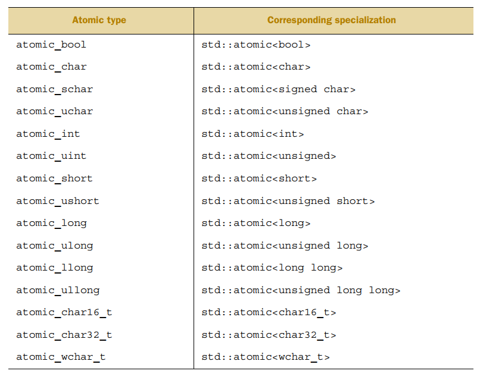

原子类型不允许由另一个原子类型拷贝赋值，因为拷贝赋值调用了两个对象，破坏了操作的原子性。但可以用对应的内置类型赋值：

```
T operator=(T desired) noexcept;
T operator=(T desired) volatile noexcept;
atomic& operator=(const atomic&) = delete;
atomic& operator=(const atomic&) volatile = delete;
```

std::atomic 为支持赋值提供了成员函数：

```
std::atomic<T>::store //@ 替换当前值
std::atomic<T>::load //@ 返回当前值
std::atomic<T>::exchange //@ 替换值，并返回被替换前的值

//@ 与期望值比较，不等则将期望值设为原值并返回false
//@ 相等则将原子值设为目标值并返回true
//@ 在缺少CAS（compare-and-exchange）指令的机器上，weak版本在相等时可能替换失败并返回false
//@ 因此weak版本通常要求循环，而strong版本返回false就能确保不相等
std::atomic<T>::compare_exchange_weak
std::atomic<T>::compare_exchange_strong

std::atomic<T>::fetch_add //@ 原子加法，返回相加前的值
std::atomic<T>::fetch_sub
std::atomic<T>::fetch_and
std::atomic<T>::fetch_or
std::atomic<T>::fetch_xor
std::atomic<T>::operator++ //@ 前自增等价于fetch_add(1)+1
std::atomic<T>::operator++(int) //@ 后自增等价于fetch_add(1)
std::atomic<T>::operator-- //@ fetch_sub(1)-1
std::atomic<T>::operator--(int) //@ fetch_sub(1)
std::atomic<T>::operator+= //@ fetch_add(x)+x
std::atomic<T>::operator-= //@ fetch_sub(x)-x
std::atomic<T>::operator&= //@ fetch_and(x)&x
std::atomic<T>::operator|= //@ fetch_or(x)|x
std::atomic<T>::operator^= //@ fetch_xor(x)^x
```

这些成员函数有一个用来指定内存序的参数 std::memory_order：

```
typedef enum memory_order {
    memory_order_relaxed,
    memory_order_consume,
    memory_order_acquire,
    memory_order_release,
    memory_order_acq_rel,
    memory_order_seq_cst
} memory_order;
```

store 的顺序参数只能是：

- memory_order_relaxed
- memory_order_release
- memory_order_seq_cst (默认)

load 的顺序参数只能是：

- memory_order_relaxed
- memory_order_consume
- memory_order_acquire
- memory_order_seq_cst (默认)

### std::atomic_flag

std::atomic_flag 是一个原子的布尔类型，也是唯一保证 lock-free 的原子类型。它只能在  set 和 clear 两个状态之间切换。

如果在初始化时没有明确使用 ATOMIC_FLAG_INIT初始化，那么新创建的 std::atomic_flag 对象的状态是未指定的（unspecified）（既没有被 set 也没有被 clear）

ATOMIC_FLAG_INIT：如果某个 std::atomic_flag 对象使用该宏初始化，那么可以保证该 std::atomic_flag 对象在创建时处于 clear 状态。

只支持两种操作：

- test-and-set
  - test_and_set 函数检查 std::atomic_flag 标志，如果 std::atomic_flag 之前没有被设置过，则设置 std::atomic_flag 的标志，并返回先前该 std::atomic_flag 对象是否被设置过，如果之前 std::atomic_flag 对象已被设置，则返回 true，否则返回 false
  - test-and-set 操作是原子的，可以指定 Memory Order
- clear
  - 清除 std::atomic_flag 对象的标志位，即设置 atomic_flag 的值为 false
  - test-and-set 操作是原子的，可以指定 Memory Order

用 std::atomic_flag 实现自旋锁：

```
class  SpinMutex
{
public:
	void lock()
	{
		while(flag.test_and_set(std::memory_order_acquire))
			;
	}

	void unlock()
	{
		flag.clear(std::memory_order_release);
	}

private:
	std::atomic_flag flag = ATOMIC_FLAG_INIT;
};
```

std::atomic_flag 功能过于局限，甚至无法像布尔类型一样使用，相比之下，`std::atomic<bool>` 更易用。但是 `std::atomic<bool>` 不保证 lock-free，可以用 is_lock_free 检验在当前平台上是否 lock-free。

### 指针原子类型

指针原子类型 `std::atomic<T*>` 也支持 is_lock_free、load、store、exchange、compare_exchange_weak 和 compare_exchange_strong，与 `std::atomic<bool>` 语义相同。此外指针原子类型还支持运算操作：fetch_add、fetch_sub、++、--、+=、-= 。

### 整型原子类型

整型原子类型（如 `std::atomic<int>`）在上述操作之外，还支持 fetch_or、fetch_and、fetch_xor、=、&=、^=。

### 自定义原子类型

如果原子类型是自定义类型，该自定义类型必须可平凡复制（trivially copyable），也就意味着该类型不能有虚函数或虚基类。这可以用 is_trivially_copyable 检验。

### 小结

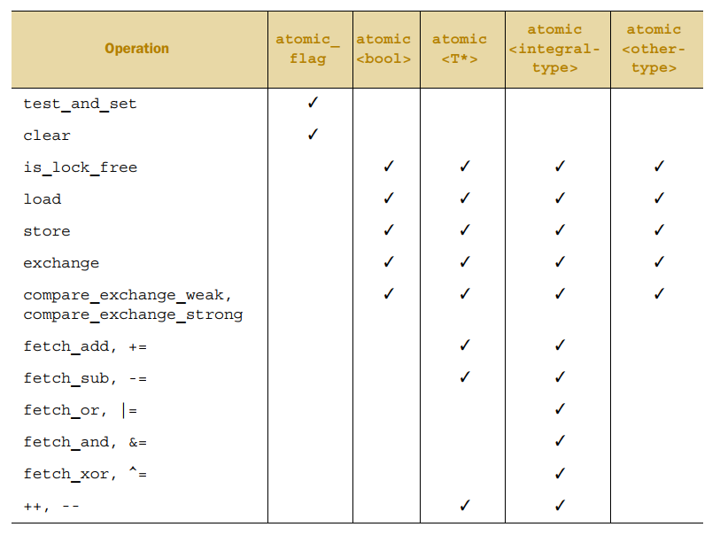

### C  风格 API

除了每个类型各自的成员函数，原子操作库还提供了通用的 C 风格 API，只不过函数名多了一个 atomic_ 前缀，参数变为指针类型：

```
std::atomic<int> i(42);
int j = std::atomic_load(&i); //@ 等价于i.load()
```

除 std::atomic_is_lock_free 外，每个自由函数有一个 `_explicit` 后缀版本，`_explicit` 函数额外接受一个 std::memory_order 参数：

```
std::atomic<int> i(42);
//@ i.load(std::memory_order_acquire) 
std::atomic_load_explicit(&i, std::memory_order_acquire); 
```

自由函数不仅可用于原子类型，还为 std::shared_ptr 提供了特化版本：

```
std::shared_ptr<int> p(new int(42));
std::shared_ptr<int> x = std::atomic_load(&p);
std::shared_ptr<int> q;
std::atomic_store(&q, p);
```

这个特化将在 C++20 中弃用，C++20 直接允许 std::atomic 的模板参数为 std::shared_ptr：

```
std::atomic<std::shared_ptr<int>> x; //@ C++20
```

## 内存模型

事实上，开发者编写的代码和最终运行的程序往往会存在较大的差异，之所以会产生差异，原因主要来自下面三个方面：

- 编译器优化
- CPU out-of-order 执行
- CPU Cache 不一致性

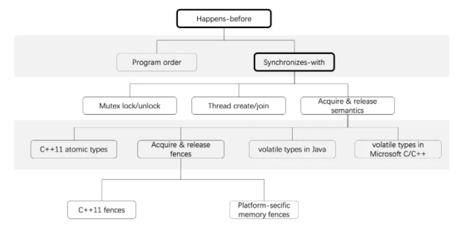

### 关系术语

sequenced-before：

sequenced-before是一种单线程上的关系，这是一个非对称，可传递的成对关系。

对于两个操作 A 和 B，如果 A sequenced-before B，则 A 的执行应当在B的前面，并且 A 执行后的结果 B 也能看到，它引入了一个局部有序性。

 ```
int i = 7; 	//@ 1
i++;        //@ 2
 ```

这里的 1 sequenced-before 2。

但是同一个语句中的多个子表达式上没有这个关系的。特别极端的，对于下面这个语句：

```
i = i++ + i;
```

由于等号右边的两个子表达式无法确定先后关系，因此这个语句的行为是未定义的。这意味着，你永远不应该写这样的代码。

happens-before：

happens-before 关系是 sequenced-before 关系的扩展，因为它还包含了不同线程之间的关系。

如果 A happens-before B，则 A 的内存状态将在 B 操作执行之前就可见，这就为线程间的数据访问提供了保证。

同样的，这是一个非对称，可传递的关系。如果 A happens-before B，B happens-before C。则可推导出 A happens-before C。

synchronizes-with：

synchronizes-with 描述的是一种状态传播关系。如果 A synchronizes-with B，则就是保证操作 A 的状态在操作 B 执行之前是可见的。

原子操作的 acquire-release 具有 synchronized-with 关系。除此之外，对于锁和互斥体的释放和获取可以达成 synchronized-with 关系，还有线程执行完成和 join 操作也能达成 synchronized-with 关系。

借助 synchronizes-with 可以达成 happens-before 关系。

### memory order

C++ 中的内存模型：

```
typedef enum memory_order {
    memory_order_relaxed, //@ 无同步或顺序限制，只保证当前操作原子性
    memory_order_consume, //@ 标记读操作，依赖于该值的读写不能重排到此操作前
    memory_order_acquire, //@ 标记读操作，之后的读写不能重排到此操作前
    memory_order_release, //@ 标记写操作，之前的读写不能重排到此操作后
    memory_order_acq_rel, //@ 仅标记读改写操作，读操作相当于acquire，写操作相当于release
    memory_order_seq_cst //@ sequential consistency：顺序一致性不允许重排，所有原子操作的默认选项
} memory_order;
```

当多个线程中包含了多个原子操作，这些原子操作因为其`memory_order`的选择不一样，将导致运行时不同的内存模型强度。

- 宽松模型
- 释放/消费模型
- 释放/获取模型
- 顺序一致模型


内存序：

- memory_order_relaxed：松散内存序，只用来保证对原子对象的操作是原子的
- memory_order_consume：目前不鼓励使用  
- memory_order_acquire：获得操作，在读取某原子对象时，当前线程的任何后面的读写操作都不允许重排到这个操作的前面去，并且其他线程在对同一个原子对象释放之前的所有内存写入都在当前线程可见  
- memory_order_release：释放操作，在写入某原子对象时，当前线程的任何前面的读写操作都不允许重排到这个操作的后面去，并且当前线程的所有内存写入都在对同一个原子对象进行获取的其他线程可见  
- memory_order_acq_rel：获得释放操作，一个读‐修改‐写操作同时具有获得语义和释放语义，即它前后的任何读写操作都不允许重排，并且其他线程在对同一个原子对象释放之前的所有内存写入都在当前线程可见，当前线程的所有内存写入都在对同一个原子对象进行获取的其他线程可见  
- memory_order_seq_cst：顺序一致性语义，对于读操作相当于获取，对于写操作相当于释放，对于读‐修改‐写操作相当于获得释放，是所有原子操作的默认内存序  

宽松模型：

通过 std::memory_order_relaxed 指定。在此模型下，单个线程内的原子操作都是顺序执行的，不允许指令重排，但不同线程间原子操作的顺序是任意的。

```
	std::atomic<int> counter = { 0 };
	std::vector<std::thread> vt;
	for (int i = 0; i < 100; ++i) {
		vt.emplace_back([&counter]() {
			counter.fetch_add(1, std::memory_order_relaxed);
		});
	}

	for (auto& t : vt) {
		t.join();
	}
	std::cout << "current counter:" << counter << std::endl;
```

释放/消费模型：

在此模型中开始限制进程间的操作顺序，如果某个线程需要修改某个值，但另一个线程会对该值的某次操作产生依赖，即后者依赖前者。

```
	std::atomic<int*> ptr;
	int v;

	std::thread producer([&]() {
		int *p = new int(42);
		v = 1024;
		ptr.store(p,std::memory_order_release);
	});

	std::thread consumer([&]() {
		int* p;
		while (!(p = ptr.load(std::memory_order_consume)));

		std::cout << "p:" << *p << std::endl;
		std::cout << "v:" << v << std::endl;
	});

	producer.join();
	consumer.join();
```

释放/获取模型：

在此模型下可以进一步加紧对不同线程间原子操作的顺序的限制，在释放 std::memory_order_release 和获取 std::memory_order_acquire 之间规定时序，即发生在释放操作之前的所有写操作，对其他线程的任何获取操作都是可见的，亦即发生顺序（happens-before）。

可以看到，std::memory_order_release 确保了它之后的写行为不会发生在释放操作之前，是一个向后的屏障，而 std::memory_order_acquire 确保了它之后的写行为，不会发生在该获取操作之后，是一个向前的屏障，对于选项 std::memory_order_acq_rel 而言，则结合了这两者的特点，唯一确定了一个内存屏障，使得当前线程对内存的读写不会被重排到此操作的前后。

```
	std::vector<int> v;
	std::atomic<int> flag = { 0 };

	std::thread release([&]() {
		v.push_back(42);
		flag.store(1, std::memory_order_release);
	});

	std::thread acqrel([&]() {
		int expected = 1; //@ must before compare_exchange_strong
		while (!flag.compare_exchange_strong(expected, 2, std::memory_order_acq_rel)) {
			expected = 1; //@ must after compare_exchange_strong
		}
		//@ flag has changed to 2
	});

	std::thread acquire([&]() {
		while (flag.load(std::memory_order_acquire) < 2)
			;

		std::cout << v.at(0) << std::endl; //@ must be 42
	});

	release.join();
	acqrel.join();
	acquire.join();
```

compare_exchange_strong 便是比较交换原语（Compare-and-swap primitive），它有一个更弱的版本，即 compare_exchange_weak，它允许即便交换成功，也仍然返回 false 失败。其原因是因为在某些平台上虚假故障导致的，具体而言，当 CPU 进行上下文切换时，另一线程加载同一地址产生的不一致。除此之外，compare_exchange_strong 的性能可能稍差于 compare_exchange_weak。

顺序一致模型：

在此模型下，原子操作满足顺序一致性，进而可能对性能产生损耗。可显式的通过 std::memory_order_seq_cst 进行指定。

```
	std::atomic<int> counter = { 0 };
	std::vector<std::thread> vt;
	for (int i = 0; i < 100; ++i) {
		vt.emplace_back([&counter]() {
			counter.fetch_add(1, std::memory_order_seq_cst);
		});
	}

	for (auto& t : vt) {
		t.join();
	}
	std::cout << "current counter:" << counter << std::endl;
```

## 多线程编程实战

### 生产者消费者

单生产者单消费者

```
#include <iostream>
#include <thread>
#include <mutex>
#include <condition_variable>

static const int kItemRepositorySize = 10;
static const int kItemsToProduce = 1000;

struct ItemRepository
{
	int item_buffer[kItemRepositorySize];
	size_t consume_position = 0;
	size_t produce_position = 0;
	size_t item_count = 0;
	std::mutex mtx;
	std::condition_variable not_full;
	std::condition_variable not_empty;
};

ItemRepository g_item_repo;


void produce_task()
{
	for (int i = 0; i < kItemsToProduce; i++)
	{
		{
			std::unique_lock<std::mutex> lock(g_item_repo.mtx);
			g_item_repo.not_full.wait(lock,
				[] {return (g_item_repo.produce_position + 1) % kItemRepositorySize != g_item_repo.consume_position; }
			);
			g_item_repo.item_buffer[g_item_repo.produce_position] = i;
			g_item_repo.produce_position++;
			if (g_item_repo.produce_position == kItemRepositorySize)
				g_item_repo.produce_position = 0;

			std::cout << "produce the: " << i << " item" << std::endl;
			g_item_repo.not_empty.notify_one();
		}

	}
}

void consume_task()
{
	static int cnt = 0;
	while (true)
	{
		{
			std::unique_lock<std::mutex> lock(g_item_repo.mtx);
			g_item_repo.not_empty.wait(lock, []() {return g_item_repo.produce_position != g_item_repo.consume_position; }
			);
			int data = g_item_repo.item_buffer[g_item_repo.consume_position];
			g_item_repo.consume_position++;
			if (g_item_repo.consume_position == kItemRepositorySize)
				g_item_repo.consume_position = 0;

			++cnt;
			std::cout << "consume the: " << data << " item" << std::endl;
			g_item_repo.not_full.notify_one();

			if (cnt == kItemsToProduce)
				break;
		}
	}
}

int main()
{
	std::thread consume_thr(consume_task);
	std::thread produce_thr(produce_task);

	consume_thr.join();
	produce_thr.join();

	return 0;
}
```

单生产者多消费者

```
#include <iostream>
#include <thread>
#include <mutex>
#include <condition_variable>

static const int kItemRepositorySize = 5;
static const int kItemsToProduce = 1000;

struct ItemRepository
{
	int item_buffer[kItemRepositorySize];
	size_t consume_position = 0;
	size_t produce_position = 0;
	size_t item_count = 0;
	std::mutex mtx;
	std::mutex item_count_mtx;
	std::condition_variable not_full;
	std::condition_variable not_empty;
};

ItemRepository g_item_repo;


void produce_task()
{
	for (int i = 0; i < kItemsToProduce; i++)
	{
		{
			std::unique_lock<std::mutex> lock(g_item_repo.mtx);
			g_item_repo.not_full.wait(lock,
				[] {return (g_item_repo.produce_position + 1) % kItemRepositorySize != g_item_repo.consume_position; }
			);
			g_item_repo.item_buffer[g_item_repo.produce_position] = i;
			g_item_repo.produce_position++;
			if (g_item_repo.produce_position == kItemRepositorySize)
				g_item_repo.produce_position = 0;

			std::cout << "produce the: " << i << " item" << std::endl;
			g_item_repo.not_empty.notify_one();
		}

	}
}

void consume_task()
{
	while (true)
	{
		{
			std::lock_guard<std::mutex> count_lock(g_item_repo.item_count_mtx);
			if (g_item_repo.item_count < kItemsToProduce)
			{
				std::unique_lock<std::mutex> lock(g_item_repo.mtx);
				g_item_repo.not_empty.wait(lock, []() {return g_item_repo.produce_position != g_item_repo.consume_position; }
				);

				int data = g_item_repo.item_buffer[g_item_repo.consume_position];
				g_item_repo.consume_position++;
				if (g_item_repo.consume_position == kItemRepositorySize)
					g_item_repo.consume_position = 0;

				++g_item_repo.item_count;
				std::cout << std::this_thread::get_id()<<" consume the: " << data << " item" << std::endl;
				g_item_repo.not_full.notify_one();
			}
			else
				break;
		}
	}
}

int main()
{
	std::thread produce_thr(produce_task);
	std::thread consume_thr1(consume_task);
	std::thread consume_thr2(consume_task);
	std::thread consume_thr3(consume_task);
	std::thread consume_thr4(consume_task);
	std::thread consume_thr5(consume_task);

	produce_thr.join();
	consume_thr1.join();
	consume_thr2.join();
	consume_thr3.join();
	consume_thr4.join();
	consume_thr5.join();

	return 0;
}
```

多生产者单消费者

```
#include <iostream>
#include <thread>
#include <mutex>
#include <condition_variable>

static const int kItemRepositorySize = 10;
static const int kItemsToProduce = 1000;

struct ItemRepository
{
	int item_buffer[kItemRepositorySize];
	size_t consume_position = 0;
	size_t produce_position = 0;
	size_t item_count = 0;
	std::mutex mtx;
	std::mutex item_count_mtx;
	std::condition_variable not_full;
	std::condition_variable not_empty;
};

ItemRepository g_item_repo;


void produce_task()
{
	while (true)
	{

		{
			std::lock_guard<std::mutex> count_lock(g_item_repo.item_count_mtx);
			if (g_item_repo.item_count < kItemsToProduce)
			{
				std::unique_lock<std::mutex> lock(g_item_repo.mtx);
				g_item_repo.not_full.wait(lock,
					[] {return (g_item_repo.produce_position + 1) % kItemRepositorySize != g_item_repo.consume_position; }
				);

				g_item_repo.item_count += 1;
				int data = g_item_repo.item_count;
				g_item_repo.item_buffer[g_item_repo.produce_position] = data;
				g_item_repo.produce_position++;
				if (g_item_repo.produce_position == kItemRepositorySize)
					g_item_repo.produce_position = 0;

				std::cout << std::this_thread::get_id() << " produce the: " << data << " item" << std::endl;
				g_item_repo.not_empty.notify_one();
			}
			else
				break;

		}
	}
}

void consume_task()
{
	int consume_count = 0;
	while (true)
	{
		{
			if (consume_count < kItemsToProduce)
			{
				std::unique_lock<std::mutex> lock(g_item_repo.mtx);
				g_item_repo.not_empty.wait(lock, []() {return g_item_repo.produce_position != g_item_repo.consume_position; }
				);

				int data = g_item_repo.item_buffer[g_item_repo.consume_position];
				g_item_repo.consume_position++;
				if (g_item_repo.consume_position == kItemRepositorySize)
					g_item_repo.consume_position = 0;

				++consume_count;
				std::cout << "consume the: " << data << " item" << std::endl;
				g_item_repo.not_full.notify_one();
			}
			else
				break;
		}
	}
}

int main()
{
	std::thread produce_thr1(produce_task);
	std::thread produce_thr2(produce_task);
	std::thread produce_thr3(produce_task);
	std::thread produce_thr4(produce_task);
	std::thread produce_thr5(produce_task);
	std::thread consume_thr(consume_task);

	produce_thr1.join();
	produce_thr2.join();
	produce_thr3.join();
	produce_thr4.join();
	produce_thr5.join();
	consume_thr.join();

	return 0;
}
```

多生产者多消费者

```
#include <iostream>
#include <thread>
#include <mutex>
#include <condition_variable>

static const int kItemRepositorySize = 10;
static const int kItemsToProduce = 1000;

struct ItemRepository
{
	int item_buffer[kItemRepositorySize];
	size_t consume_position = 0;
	size_t produce_position = 0;
	size_t produce_item_count = 0;
	size_t consume_item_count = 0;
	std::mutex mtx;
	std::mutex produce_item_count_mtx;
	std::mutex consume_item_count_mtx;
	std::condition_variable not_full;
	std::condition_variable not_empty;
};

ItemRepository g_item_repo;


void produce_task()
{
	while (true)
	{
		{
			std::lock_guard<std::mutex> count_lock(g_item_repo.produce_item_count_mtx);
			if (g_item_repo.produce_item_count < kItemsToProduce)
			{
				std::unique_lock<std::mutex> lock(g_item_repo.mtx);
				g_item_repo.not_full.wait(lock,
					[] {return (g_item_repo.produce_position + 1) % kItemRepositorySize != g_item_repo.consume_position; }
				);

				g_item_repo.produce_item_count += 1;
				int data = g_item_repo.produce_item_count;
				g_item_repo.item_buffer[g_item_repo.produce_position] = data;
				g_item_repo.produce_position++;
				if (g_item_repo.produce_position == kItemRepositorySize)
					g_item_repo.produce_position = 0;

				std::cout << std::this_thread::get_id() << " produce the: " << data << " item" << std::endl;
				g_item_repo.not_empty.notify_one();
			}
			else
				break;
		}

	}
}

void consume_task()
{
	while (true)
	{
		{
			std::lock_guard<std::mutex> count_lock(g_item_repo.consume_item_count_mtx);
			if (g_item_repo.consume_item_count < kItemsToProduce)
			{
				std::unique_lock<std::mutex> lock(g_item_repo.mtx);
				g_item_repo.not_empty.wait(lock, []() {return g_item_repo.produce_position != g_item_repo.consume_position; }
				);

				int data = g_item_repo.item_buffer[g_item_repo.consume_position];
				g_item_repo.consume_position++;
				if (g_item_repo.consume_position == kItemRepositorySize)
					g_item_repo.consume_position = 0;

				++g_item_repo.consume_item_count;
				std::cout << std::this_thread::get_id() << " consume the: " << data << " item" << std::endl;
				g_item_repo.not_full.notify_one();
			}
			else
				break;
		}
	}
}

int main()
{
	std::thread produce_thr1(produce_task);
	std::thread produce_thr2(produce_task);
	std::thread consume_thr1(consume_task);
	std::thread consume_th2(consume_task);
	
	produce_thr1.join();
	produce_thr2.join();
	consume_thr1.join();
	consume_th2.join();

	return 0;
}
```

### 半同步半异步线程池

同步队列

```
#include <iostream>
#include <memory>
#include <mutex>
#include <condition_variable>
#include <list>


template <typename T>
class SyncQueue
{
public:
	SyncQueue(size_t n) noexcept : capacity_(n) {}

	void push(T&& t)
	{
		add(t);
	}

	void push(const T& t)
	{
		add(t);
	}
	
	void pop(std::list<T> & list)
	{
		std::unique_lock<std::mutex> lock(mtx_);
		cv_not_empty_.wait(lock, [this] {return need_stop_ || not_empty(); });
		if (need_stop_)
			return;
		list = std::move(queue_);
		cv_not_full_.notify_one();
	}

	void pop(T & t)
	{
		std::unique_lock<std::mutex> lock(mtx_);
		cv_not_empty_.wait(lock, [this] {return need_stop_ || not_empty(); });
		if (need_stop_)
			return;
		t = std::move(queue_.front());
		queue_.pop_front();
		cv_not_full_.notify_one();
	}

	void stop()
	{
		{
			std::lock_guard<std::mutex> lock(mtx_);
			need_stop_ = true;
		}

		cv_not_empty_.notify_all();
		cv_not_full_.notify_all();
	}

	bool empty() const noexcept
	{
		std::lock_guard<std::mutex> lock(mtx_);
		return queue_.empty();
	}

	bool full() const noexcept
	{
		std::lock_guard<std::mutex> lock(mtx_);
		return queue_.size() >= capacity_;
	}

	size_t size() const noexcept
	{
		std::lock_guard<std::mutex> lock(mtx_);
		return queue_.size();
	}

private:
	bool not_full()
	{
		bool full = queue_.size() >= capacity_;
		//if (full)
		//	std::cout << "queue is full" << std::endl;
		return !full;
	}

	bool not_empty()
	{
		bool empty = queue_.empty();
		//if (empty)
		//	std::cout << "queue is empty" << std::endl;
		return !empty;
	}

	template <typename F>
	void add(F&& f)
	{
		std::unique_lock<std::mutex> lock(mtx_);
		cv_not_full_.wait(lock, [this] {return need_stop_ || not_full(); });
		if (need_stop_)
			return;

		queue_.push_back(std::forward<F>(f));
		cv_not_empty_.notify_one();
	}

private:
	size_t capacity_ = 0;
	bool need_stop_ = false;
	std::list<T> queue_;
	std::condition_variable cv_not_full_;
	std::condition_variable cv_not_empty_;
	std::mutex mtx_;
};
```

线程池

````
#include <list>
#include <thread>
#include <functional>
#include <memory>
#include <atomic>
#include <algorithm>

const int kMaxTaskNum = 20;

class ThreadPool
{
public:
	using Task = std::function<void()>;

	ThreadPool(int nums = std::thread::hardware_concurrency()) noexcept: queue_(kMaxTaskNum)
	{
		start(nums);
	}

	~ThreadPool()
	{
		stop();
	}

	void stop()
	{
		std::call_once(flag_, [this] {stop_threads(); });
	}

	void add_task(Task&& task)
	{
		queue_.push(std::forward<Task>(task));
	}

	void add_task(const Task& task)
	{
		queue_.push(task);
	}

private:
	void start(int nums)
	{
		running_.store(true);
		for (int i = 0; i < nums; i++)
		{
			threads_.emplace_back(std::make_shared<std::thread>(&ThreadPool::run_in_thread,this));
		}
	}

	void run_in_thread()
	{
		while (running_)
		{
			std::list<Task> tasks;
			queue_.pop(tasks);
			{
				for (const auto& task : tasks)
				{
					if (!running_)
						return;
					task();
				}
			}
		}
	}

	void stop_threads()
	{
		queue_.stop();
		running_ = false;

		std::for_each(threads_.begin(), threads_.end(),std::mem_fn(&std::thread::join));
		threads_.clear();
	}

private:
	SyncQueue<Task> queue_;
	std::atomic_bool running_;
	std::once_flag flag_;
	std::list<std::shared_ptr<std::thread>> threads_;
};


int main()
{
	ThreadPool pool;

	std::thread thr1([&pool] {
		for (int i = 0; i < 10; i++)
		{
			auto thr_id = std::this_thread::get_id();
			pool.add_task([&thr_id] {
				std::cout << "thread 1 id:" << thr_id << std::endl;
			});
		}
	});

	std::thread thr2([&pool] {
		for (int i = 0; i < 10; i++)
		{
			auto thr_id = std::this_thread::get_id();
			pool.add_task([&thr_id] {
				std::cout << "thread 2 id:" << thr_id << std::endl;
			});
		}
	});

	std::this_thread::sleep_for(std::chrono::milliseconds(200));
	getchar();

	pool.stop();
	thr1.join();
	thr2.join();

	return 0;
}
````

# 设计模式

## 设计原则

- 单一职责原则 SRP：一个类只负责一个功能领域中的相应职责
- 开闭原则 OCP：软件实体对扩展开放，对修改关闭
- 里氏替换原则 LSP：所有引用基类对象的地方能够透明地使用其子类对象
- 依赖倒置原则 DIP：抽象不依赖于细节，细节应该依赖于抽象
- 接口隔离原则 ISP：使用多个专门的接口而不使用单一的总接口
- 合成复用原则 CRP：尽量使用对象组合，而不是继承达到复用的目的
- 迪米特法则 LOD：一个软件实体应当尽可能少地与其它软件实体发生相互作用

## 单例

```
class LazySingleton
{
public:
	static LazySingleton& get_instance()
	{
		static std::once_flag s_flag;
		std::call_once(s_flag, [&]() {
			instance = new LazySingleton(); }
			);
		return *instance; 
	}

private:
	LazySingleton();
	static LazySingleton* instance;
};
```

```
class LazySingleton
{
public:
	static LazySingleton& get_instance()
	{
		static LazySingleton instance;
		return instance;
	}

private:
	LazySingleton();

};
```

## 工厂

- 简单工厂模式的工厂类一般是使用静态方法，通过接收的参数的不同来返回不同的对象实例
- 工厂方法是针对每一种产品提供一个工厂类。通过不同的工厂实例来创建不同的产品实例
- 抽象工厂是应对产品族概念的

```

#include <memory>
#include <string>
#include <iostream>

namespace SimpleFactory
{
	enum class CarType
	{
		Benz,
		BMW,
	};

	class Car
	{
	public:
		virtual std::string name() = 0;
		virtual ~Car() = default;
	};

	class BenzCar : public Car
	{
		public:
		virtual std::string name() override
		{
			return "BenzCar";
		}
	};

	class BMWCar : public Car
	{
	public:
		virtual std::string name() override
		{
			return "BMWCar";
		}
	};


	static std::shared_ptr<Car> create_car(CarType type)
	{
		std::shared_ptr<Car> p_car;
		if (type == CarType::Benz)
		{
			p_car.reset(new BenzCar);
		}
		else if (type == CarType::BMW)
		{
			p_car.reset(new BMWCar);
		}
		return p_car;
	}

	void client()
	{
		auto car = create_car(CarType::BMW);
		std::cout << car->name() << std::endl;
	}
}


namespace FactoryMethod
{
	class Car
	{
	public:
		virtual std::string name() = 0;
	};

	class BenzCar : public Car
	{
	public:
		virtual std::string name() override
		{
			return "BenzCar";
		}
	};

	class BMWCar : public Car
	{
	public:
		virtual std::string name() override
		{
			return "BMWCar";
		}
	};

	class CarFactory
	{
	public :
		virtual std::shared_ptr<Car> create() = 0;
	};

	class BenzFactory : public CarFactory
	{
	public:
		virtual std::shared_ptr<Car> create()
		{
			return std::make_shared<BenzCar>();
		}
	};

	class BMWFactory : public CarFactory
	{
	public:
		virtual std::shared_ptr<Car> create()
		{
			return std::make_shared<BMWCar>();
		}
	};

	void client()
	{
		BenzFactory benz_factory;
		auto benz_car = benz_factory.create();
		std::cout << benz_car->name() << std::endl;

		BMWFactory bmw_factory;
		auto bmw_car = bmw_factory.create();
		std::cout << bmw_car->name() << std::endl;
	}
}


namespace AbstractFactory
{
	class Car
	{
	public:
		virtual std::string name() = 0;
		virtual ~Car() = default;
	};

	class Bike
	{
	public:
		virtual std::string name() = 0;
		virtual ~Bike() = default;
	};

	class BenzCar : public Car
	{
	public:
		virtual std::string name() override
		{
			return "Benz Car";
		}
	};

	class BenzBike : public Bike
	{
	public:
		virtual std::string name() override
		{
			return "Benz Bike";
		}
	};

	class BmwCar : public Car
	{
	public:
		virtual std::string name() override
		{
			return "Bmw Car";
		}
	};

	class BmwBike : public Bike
	{
	public:
		virtual std::string name() override
		{
			return "Bmw Bike";
		}
	};
	
	enum class FactoryType
	{
		Benz_Factory,
		BMW_Factory
	};

	class AFactory
	{
	public:

		virtual std::unique_ptr<Car>  create_car() = 0;
		virtual std::unique_ptr<Bike> create_bike() = 0;
		static std::unique_ptr<AFactory> create_factory(FactoryType type);
	};

	class BenzFactory : public AFactory
	{
	public:
		virtual std::unique_ptr<Car>  create_car() override
		{
			return std::make_unique<BenzCar>();
		}

		virtual std::unique_ptr<Bike> create_bike() override
		{
			return std::make_unique<BenzBike>();
		}
	};

	class BmwFactory : public AFactory
	{
	public:
		virtual std::unique_ptr<Car>  create_car() override
		{
			return std::make_unique<BmwCar>();
		}
		virtual std::unique_ptr<Bike> create_bike() override
		{
			return std::make_unique<BmwBike>();
		}
	};

	std::unique_ptr<AFactory> AFactory::create_factory(FactoryType type)
	{
		std::unique_ptr<AFactory> p_factory{ nullptr };
		if (type == FactoryType::Benz_Factory)
		{
			p_factory.reset(new BenzFactory());
		}
		else if (type == FactoryType::BMW_Factory)
		{
			p_factory.reset(new BmwFactory());
		}
		return p_factory;
	}

	void client()
	{
		auto factory = AFactory::create_factory(FactoryType::Benz_Factory);
		auto car = factory->create_car();
		auto bike = factory->create_bike();

		std::cout << car->name() << std::endl;
		std::cout << bike->name() << std::endl;
	}
}


int main()
{
	SimpleFactory::client();
	FactoryMethod::client();
	AbstractFactory::client();

    return 0;
}
```

## 观察者

指多个对象间存在一对多的依赖关系，当一个对象的状态发生改变时，所有依赖于它的对象都得到通知并被自动更新。这种模式有时又称作发布-订阅模式

观察者模式是一种对象行为型模式，其主要优点如下：

- 降低了目标与观察者之间的耦合关系，两者之间是抽象耦合关系。符合依赖倒置原则
- 目标与观察者之间建立了一套触发机制

它的主要缺点如下：

- 目标与观察者之间的依赖关系并没有完全解除，而且有可能出现循环引用
- 当观察者对象很多时，通知的发布会花费很多时间，影响程序的效率

```
class IObserver
{
public:
	virtual void update(float price) = 0;
};

class Observer : public IObserver
{
public:
	Observer(const std::string& name) : name_(name) {}

	void update(float price) override {
		std::cout << name_ << "- price: " << price << std::endl;
	}

private:
	std::string name_;
};

class ISubject
{
public:
	virtual void attach(std::shared_ptr<IObserver>& observer) = 0;
	virtual void detach(std::shared_ptr<IObserver>& observer) = 0;
	virtual void notify() = 0;
};

class Subject : public ISubject
{
public:
	Subject() : price_(10.0) {}

	void set_price(float price)
	{
		price_ = price;
	}

	void attach(std::shared_ptr<IObserver> & observer) override
	{
		observers_.push_back(observer);
	}

	void detach(std::shared_ptr<IObserver>& observer) override
	{
		observers_.remove(observer);
	}

	void notify()
	{
		for (const auto & observer : observers_)
		{
			observer->update(price_);
		}
	}

private:
	double price_;
	std::list<std::shared_ptr<IObserver>> observers_;
};

void client()
{
	std::shared_ptr<Subject> p_subject(new Subject());
	std::shared_ptr<IObserver> p_observer1(new Observer("Jike"));
	std::shared_ptr<IObserver> p_observer2(new Observer("Mike"));

	p_subject->attach(p_observer1);
	p_subject->attach(p_observer2);

	p_subject->set_price(12.8);
	p_subject->notify();

	p_subject->detach(p_observer1);
	p_subject->set_price(19.0);
	p_subject->notify();
}
```


