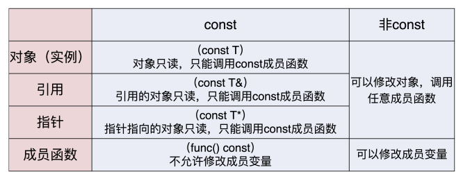
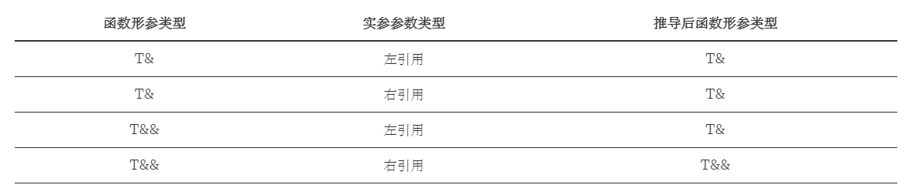
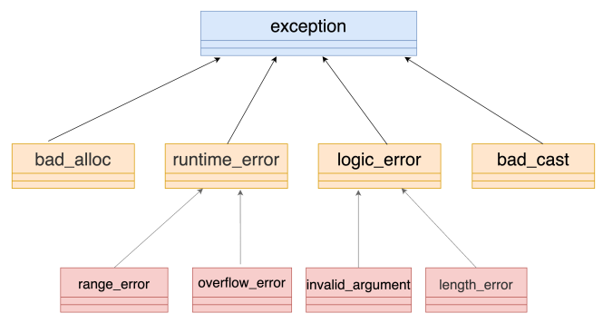

# 常量

## nullptr

传统 C++ 会把 NULL、0 视为同一种东西，这取决于编译器如何定义 NULL，有些编译器会将 NULL 定义为 `((void*)0)`，有些则会直接将其定义为 0。

C++ 不允许直接将 `void *` 隐式转换到其他类型。但如果编译器尝试把 NULL 定义为 `((void*)0)`，那么在下面这句代码中：

```
char *ch = NULL; //@ 不合法
```

而将 NULL 定义成 0 将导致 C++ 中重载特性发生混乱：

```
void foo(char*);
void foo(int);

//@ 实际调用 foo 函数
foo(NULL); //@ 将调用 foo(int)
```

为了解决这个问题，C++11 引入了 nullptr 关键字，专门用来区分空指针、0。而 nullptr 的类型为 nullptr_t，能够隐式的转换为任何指针或成员指针的类型，也能和他们进行相等或者不等的比较。

```
if (std::is_same<decltype(NULL), decltype(0)>::value)
	std::cout << "NULL == 0" << std::endl;
if (std::is_same<decltype(NULL), decltype((void*)0)>::value)
	std::cout << "NULL == (void*)0" << std::endl;
if (std::is_same<decltype(NULL), std::nullptr_t>::value)
	std::cout << "NULL == nullptr" << std::endl;
```

## constexpr

### constexpr 变量  

常量表达式指值不会改变并且在编译过程就能得到计算结果的表达式，一个对象是否为常量表达式由它的数据类型和初始值共同决定：

字面值是常量表达式，由常量表达式初始化的 const 对象也是常量表达式：

```
const int max_files = 20;           //@ max_files 是常量表达式
const int limit = max_files + 1;    //@ limit 是常量表达式
int staff_size = 27;        //@ staff_size 不是常量表达式
const int sz = get_size();  //@ sz 不是常量表达式
```

C++11 允许将变量声明为 constexpr 类型以便由编译器来验证变量的值是否是一个常量表达式。

声明为 constexpr 的变量一定是一个常量：

- constexpr 变量必须立即初始化  
- 初始化只能使用字面量或常量表达式，后者不允许调用任何非 constexpr 函数  

```
constexpr int mf = 20;          //@ 20 是常量表达式
constexpr int limit = mf + 1;   //@ mf + 1 是常量表达式
constexpr int sz = size();      //@ 仅当 size 函数是常量函数时才合法
```

一般来说，如果你认定变量是一个常量表达式，那就把它声明成 constexpr 类型。

const 和 constexpr 限定的值都是常量。但 constexpr 对象的值必须在编译期间确定，而 const 对象的值可以延迟到运行期间确定。

与 const 不同，在 constexpr  声明中如果定义了一个指针，限定符 constexpr 仅对指针本身有效，与指针所指的对象无关：

```
constexpr int *p1 = nullptr;	//@ p1 是指向 int 的 const 指针
const int * p2 = nullptr;		//@ p2 是指向 const int 的普通指针	
constexpr const int * p3 = nullptr;   //@ p3 是指向 const int 的 const 指针	
```

### constexpr 函数

constexpr 函数是指能用于常量表达式的函数，要检验一个 constexpr 函数能不能产生一个真正的编译期常量，可以把结果赋给一个constexpr 变量。成功的话，我们就确认了。

C++ 11 中对 constexpr 函数的约定：

- 函数体中必须有且只有一条 return 语句，并且函数必须有返回值
- 在使用前必须已经定义
- 体内可以包含其它语句，但是这些语句在运行时不执行任何操作就行。例如，可以有空语句、类型别名以及 using 声明

```
constexpr int new_sz() { return 42; }
constexpr int foo = new_sz();
```

从 C++14 开始，constexpr 函数可以在内部使用局部变量、循环和分支等简单语句：

```
constexpr int fibonacci(const int n) {
    if(n == 1) return 1;
    if(n == 2) return 1;
    return fibonacci(n-1) + fibonacci(n-2);
}

//@ C++ 11 中只能写作：
constexpr int fibonacci(const int n) {
    return n == 1 || n == 2 ? 1 : fibonacci(n-1) + fibonacci(n-2);
}
```

### 字面值常量类

constexpr函数的参数和返回值必须是字面值类型，除了算术类型、引用和指针外，某些类也是字面值类型：

- 数据成员都是字面值类型的聚合类是字面值常量类
- 如果一个类不是聚合类，但它符合下述要求，则它也是一个字面值常量类：
  - 数据成员都必须是字面值类型
  - 类必须至少含有一个 constexpr 构造函数
  - 如果一个数据成员含有类内初始值，则内置类型成员的初始值必须是一条常量表达式；或者如果成员属于某种类类型，则初始值必须使用成员自己的constexpr 构造函数
  - 类必须使用析构函数的默认定义，该成员负责销毁类的对象

```
struct Date final
{
	constexpr Date(int y, int m, int d) noexcept : year_(y), month_(m), day_(d) {}

	constexpr int get_year() const noexcept { return year_; }
	constexpr int get_month() const noexcept { return month_; }
	constexpr int get_day() const noexcept { return day_; }

private:
	int year_;
	int month_;
	int day_;
};

//@ 应用
Date PRCFound = { 1949,10,1 };
```

# 变量及其初始化

## 初始化列表

### 统一初始化方法

列表初始化统一了初始化方法，它可以用于任何类型对象的初始化：

```
int arr[]{ 1,2,3 };  //@ 初始化数组

//@ 初始化 STL
std::map<std::string, int> mm = { {"1",1},{ "2",2} ,{ "3",3 } ,{ "4",4 } };
std::set<int> ss{1,2,3,4,5,6};
std::vector<int> vec{1,2,3,4,5};

struct A
{
    int x;
    struct B
    {
        int y;
        int z;
    }b;
};
A a{ 1,{ 2,3 } }; //@ 初始化 POD 类型

int* array = new int[3]{ 1,2,3 }; //@ 初始化动态分配的内存

class Foo
{
public:
	Foo(int,double) {}
};

Foo func()
{
	return{ 1,12.34 }; //@ 初始化返回类型
}
```

### 初始化列表的赋值方式

- 对于聚合类型的初始化将以拷贝的形式，用初始化列表中的值来初始化
- 对于其它类型，需要使用构造函数来初始化

聚合类型：

- 普通数组， int[10]，char[6]
- 类型是一个类(struct，class，union)并且：
  - 所有成员都是 public 的
  - 没有定义任何构造函数
  - 没有类内初始化
  - 无虚函数
  - 无基类

```
struct ST
{
	int x;
	double y;
protected:
	int z;
};
ST s{ 1,2.012,3 }; //@ 错误，类中有受保护的(私有的)非静态数据成员

struct ST
{
	int x;
	double y;
private:
	static int z;
};
ST s1{ 1,2.012}; //@ 正确
ST s2{ 1,2.012，3}; //@ 错误，静态成员不能通过初始化列表初始化，需要遵守静态成员的初始化方式

struct ST
{
	int x;
	double y;	
	virtual void func() {};
};
ST s{ 1,2.012}; //@ 错误，类中含有虚函数


struct Base {};
struct Derived : public Base
{
	int x;
	double y;	
};
Derived d{ 1,2.012}; //@ 错误，类有基类


struct ST
{
	int x;
	double y{ 0.0 }; //@ C++ 11 非静态数据成员允许声明时初始化，可以使用 {} 或者 =
};
ST s{1,2.3}; //@ 错误，类中包含了直接初始化的非静态数据成员
```

对于上述非聚合类型的类，要想使用初始化列表的唯一方法就是定义一个构造函数：

```
struct Base { virtual void func() {}; };
struct Derived : public Base
{
	Derived(int xx, double yy, int zz) : x(xx), y(yy), z(zz) {}
	int x;
	double y;

	virtual void func() {};

private:
	int z;
};
Derived d{ 1,2.012,3 };  //@ 正确
```

### 防止类型收窄

类型收窄是导致数据内容发生变化或者精度丢失的转换，初始化列表不支持这种转换：

- 浮点数转换成一个整型数，int i{2.1};
- 高精度浮点数转换成低精度浮点数，如从 long double 转换成 double 或者 float
- 整型数转换成浮点数，并且超过了浮点数的表示范围：float  x { (unsigned long long) -1};
- 整型数转换成长度较短的整型数，并且超过了较短整型数的表示范围，char x {65535}；

## 结构化绑定

C++17 给出的结构化绑定，可以让我们写出这样的代码：

```
std::tuple<int, double, std::string> f() {
    return std::make_tuple(1, 2.3, "456");
}

int main() {
    auto [x, y, z] = f();
    std::cout << x << ", " << y << ", " << z << std::endl;
    return 0;
}
```

# 类型推导

## auto

auto 声明的变量必须马上初始化，以让编译器推断出它的实际类型，并在编译时将 auto 占位符替换为真正的类型。

auto 使用注意事项：

- auto 总是推导出“值类型”，绝不会是“引用”
- 不显示指定为指针或者引用类型时，推导结果将丢弃 CV 属性
- auto 可以附加上 const、volatile、*、& 这样的类型修饰符，得到新的类型  

auto 的“自动推导”能力只能用在“初始化”的场合：

```
//@ 推导只能用在初始化形式中
auto x = 0UL; //@ x -> unsigned long
auto y = &x;  //@ y -> unsigned long
auto z{ &x }; //@ z -> unsigned long*
auto err; //@ 错误，没有用于推导的表达式

//@ 不显示指定，将丢弃引用
int a = 6;
int& r = a;
auto a1 = r;  //@ a1 -> int
auto& a2 = r; //@ a2 -> int&

//@ 不指定引用或者指针类型，将丢弃 cv 属性
const int i = 5;
const int& r = i;
auto a1 = r;  	//@ a1 -> int
auto& a2 = r;	//@ a2 -> const int&
auto b1 = &i; 	//@ b1 -> int* 
auto* b2 = &i;	//@ b2 -> const int*
auto&& c1 = i;  //@ c1 -> const int& 
auto&& c2 = 1;  //@ c2 -> int&&
```

auto 使用限制：

- 不能用于推导函数参数
- 不能用于推导类的非静态成员变量
- 不能用于推导数组
- 不能用于模板参数推导

```
void func(auto a = 1)  {} //@ 错误，auto 不能用于函数参数

class AutoTest
{
    auto i = 0; //@ 错误，auto不能用于非静态成员变量
    auto const static si = 0;  //@ si -> static const int，类成员变量中静态类型无法就地初始化，所以必须要用 const 修饰
};

int arr[10] = { 0 };
auto a1 = arr;  //@ a1 -> int*
auto a2[10] = arr; //@ 错误，auto 不能用于推导数组


template <typename T>
struct Test{};

Test<int> t;
Test<auto> a = t; //@ 错误，auto 不能用于模板参数推导
```

在 C++14 里，auto 还新增了一个应用场合，就是能够推导函数返回值：

```
auto get_vec()
{
	return std::vector<int>{1,2,3,4};
}
```

auto 使用场景：

- 遍历 STL 容器
- 类型未定变量声明

## decltype

decltype 用在编译时推导出表达式的类型，并且不会真正计算表达式的值，decltype 能够保持变量的引用和 CV 特性，这一点与 auto不同。

```
decltype(exp)
```

推导规则：

- 如果 exp 是标识符，类访问表达式，decltype(exp) 与 exp 的类型一致，并且保留引用和 CV 属性，这一点与 auto 不同
- 如果 exp 是函数调用，decltype(exp) 和返回值得类型一致
- 其他情况，如果 exp 是一个左值引用， decltype(exp) 是 exp 的左值引用，否则与 exp 类型一致
- 可以附加上 const、volatile、*、& 这样的类型修饰符，得到新的类型  

```
//@ 保留 cv 特性
int i = 0;
const volatile int& cvr = i;
decltype(cvr) a = i;  //@ a -> const volatile int &

//@ 推导函数返回值
const int func_int_r(void);		//@ 返回纯右值
const int& func_int_l(void);	//@ 返回左值
const int&& func_int_x(void);	//@ 返回 x 值(右值引用本身是一个 xvalue)

int main()
{	
	int x = 0;
	decltype(func_int_r()) a;		//@ a -> int,去掉了 CV 特性
	decltype(func_int_l()) b = x;	//@ b -> const int&
	decltype(func_int_x()) c = 0;	//@ c -> const int&&
    return 0;
}

//@ 其它情况
const int x = 1;
int y = 2;
const int* p = &x;

decltype(x) a = 0;			//@ a->const int
decltype((x)) b = 0;		//@ b->const int&
decltype(x + y) c = 1;		//@ c->int
decltype(y += x) d = y;		//@ d->int&
decltype(y = 3) e = y;		//@ e->int&
decltype(*p) f = 0;			//@ f->const int&
```

这里需要注意的是：

- `(表达式)` 的类型为左值引用
- `m+n` 的类型是右值
- `m+=n` 的类型是左值引用

decltype 应用：

完全可以把 decltype 看成是一个真正的类型名，用在变量声明、函数参数 / 返回值、模板参数等任何类型能出现的地方，只不过这个类型是在编译阶段通过表达式“计算”得到的。  

```
//@ 模板中的类型推导
template<typename T, typename U>
void func(T t, U u)
{
	decltype(t*u) tu = t * u;	//@ t*u 是 int 类型，类型提升了
	std::cout << tu << std::endl;
}

int main()
{
	short a = 1;
	char c = 3;
	func(a, c);

	return 0;
}

```

## 尾返回类型推导

返回值类型后置：返回值类型后置一般用于返回值依赖于参数类型而导致难以确定返回值的具体类型。

```
template<typename T, typename U>
auto func(T t, U u)->decltype(t + u)
{
	return t + u;
}
```

从 C++14 开始是可以直接让普通函数具备返回值推导，因此下面的写法变得合法：

```
template<typename T, typename U>
auto add3(T x, U y){
    return x + y;
}
```

## decltype(auto)

decltype(auto) 主要用于对转发函数或封装的返回类型进行推导，它使我们无需显式的指定 decltype 的参数表达式。

```
int x = 0;

decltype(auto) x1 = (x); //@ x1->int&,因为 (expr) 是引用类型
decltype(auto) x2 = &x; //@ x2->int*
decltype(auto) x3 = x1; //@ x1->int&

auto a = (x);  //@ a -> int，auto 推导只是值推导
decltype((x)) a = x;  //@ a -> int&，decltype 推导是完整类型推导
```

# 范围 for

```
std::vector<int> vec{ 1,2,3 };

for (auto v : vec)  //@ 对 v 的修改不会同步到 vec  
    //@ do something

for(auto &v : vec) //@ 对 v 的修改会同步到 vec 
	//@ do something

for(const auto& v : vec) //@ 对 v 不执行拷贝，并且不支持对 v 修改
	//@ do something
```

使用注意事项：

- `:` 后面的表达式只执行一次
- 防止在范围 for 中迭代器失效

```
std::vector<int> get_vec()
{
	std::cout << "get_vec()" << std::endl;
	return { 1,2,3 };
}
for (auto const v : get_vec()) //@ get_vec 函数只会执行一次，不会在每次遍历时反复执行
	std::cout << v << " ";

//@ 改变容器将会导致迭代器失效
std::vector<int> vec{ 1,2,3 };
for (auto const v : vec)
{
	std::cout << v << " ";
	vec.push_back(0);  //@ 迭代器失效
}
```

范围 for 的原理：

- 如容器是一个普通的数组对象，那么 begin 将是数组的首地址，end 将是数组首地址加上容器长度
- 如果容器是一个类对象，那么范围 for 将试图通过查找类的 begin() 和 end() 函数来定位 begin 和 end
- 否则范围 for 将使用全局的 begin() 和 end() 函数来定位 begin 和 end

自定义类型如果想使用范围 for ，需要分别实现 begin() 和 end() 函数。

# const/volatile/mutable

## const  和 volatile

最简单的用法就是，定义程序用到的数字、字符串常量，代替宏定义。它和宏定义还是有本质区别的：const 定义的常量在预处理阶段并不存在，而是直到运行阶段才会出现。所以，准确地说，它实际上是运行时的“变量”，只不过不允许修改，是“只读”的，叫“只读变量”更合适。既然它是“变量”，那么，使用指针获取地址，再“强制”写入也是可以的：      

```
//@ 需要加入 volatile 修饰，运行时才能看到效果
const volatile int kMaxLen = 1024;
auto ptr = (int*)(&kMaxLen);

*ptr = 2048;
std::cout << kMaxLen << std::endl; //@ 输出 2048
```

编译器会对“真正的常数”进行优化，例如在用到常数的时候直接替换，const 常量虽然不是“真正的常数”，但在大多数情况下，它都可以被认为是常数，在运行期间不会改变。所以，对于没有 volatile 修饰的 const 常量来说，虽然你用指针改了常量的值，但这个值在运行阶段根本没有用到，因为它在编译阶段就被优化掉了。    

volatile  含义是“不稳定的”“易变的”，在 C++ 里，表示变量的值可能会以“难以察觉”的方式被修改（比如操作系统信号、外界其他的代码），所以要禁止编译器做任何形式的优化，每次使用的时候都必须“老老实实”地去取值。 kMaxLen 虽然是个“只读变量”，但加上了 volatile 修饰，就表示它不稳定，可能会悄悄地改变。编译器在生成二进制机器码的时候，不会再去做那些可能有副作用的优化，而是用最“保守”的方式去使用 kMaxLen。也就是说，编译器不会再把 kMaxLen 替换为 1024，而是去内存里取值。

volatile 会禁止编译器做优化，所以除非必要，应当少用 volatile，最好不要用。

## 基本的 const 用法  

常量引用：

```
int x = 0;

const int& cr = x;
```

const& 被称为万能引用，它可以引用任何类型，即不管是值、指针、左引用还是右引用，它都能“照单全收”。而且，它还会给变量附加上 const 特性，这样“变量”就成了“常量”，只能读、禁止写。  在设计函数的时候，尽可能地使用它作为入口参数，一来保证效率，二来保证安全。    

const 与指针：

常量指针：表示指针指向的内容是常量，不能通过指针修改其值

```
int x = 0;
int y = 1;

const int* cp = &x;
*cp = y;	//@ 不允许使用指针修改变量的值
cp = &y;	//@ OK
```

指针常量：指针本身是常量，不能指向别的对象，但是它指向的变量的值可以修改

```
int x = 0;
int y = 1;

int* const cp = &x;
*cp = y; //@ OK
cp = &y; //@ 不允许，指针本身是常量类型
```

指向常量的指针常量：

```
int x = 0;
int y = 1;

const int* const cp = &x;
*cp = y; //@ 不允许
cp = &y  //@ 不允许
```

顶层 const 与底层 const

- 顶层 const：指 const 定义的变量本身是一个常量
- 底层 const：指 const 定义的变量所指向的对象是一个常量

```
const int i = 0; 　　 　　//@ 顶层 const，变量i就是常量
const int  * a =  &i;    //@ 底层 const, a 所指向的对象 *a 是常量
int * const b = &i;　　　 //@ 顶层 const, 变量 b 本身就是一个常量
```

- 执行对象拷贝时有限制，常量的底层 const 不能赋值给非常量的底层 const
- const_cast 只能改变运算对象的底层const

```
int num = 3;
const int * p = &num;
int * p2 = p; //@ 不允许

int *p3 = const_cast<int*>(p);  //@ OK
```

const 与迭代器：

const iterator：表示 iterator 本身是常量，不能将这个 iterator 指向另外一件不同的东西，但是它所指向的东西本身可以变化。

contst_iterator：表示  iterator 指向的内容不能发生变化，但是其本身可以变化。

```
std::vector<int> vec;

const std::vector<int>::iterator iter = vec.begin();
*iter = 10;	//@ 正确，迭代器指向的内容可以变化
iter++;		//@ 错误，迭代器本身是常量不可以变化

std::vector<int>::const_iterator cIter =  vec.begin();
*cIter = 10;	//@ 错误，迭代器指向的内容是常量不可以变化
++cIter;		//@ 正确，迭代器本身可以变化
```


## 与类相关的 const 用法  

const 成员函数，const 成员变量：

```
struct Test final
{
public:
	int get_value() const
	{
		return value;
	}
	
private:
	const long kMaxSize = 256L;
	int value;
};
```

const 成员函数的作用：函数的执行过程是 const 的，不会修改对象的状态（即成员变量），也就是说，成员函数是一个“只读操作”。  

因为“常量引用”“常量指针”关联的对象是只读、不可修改的，那么也就意味着，对它的任何操作也应该是只读、不可修改的，否则就无法保证它的安全性。所以，编译器会检查const 对象相关的代码，如果成员函数不是 const，就不允许调用。  



## mutable  

mutable 却只能修饰类里面的成员变量，表示变量即使是在 const 对象里，也是可以修改的。换句话说，就是标记为 mutable 的成员不会改变对象的状态，也就是不影响对象的常量性，所以允许 const 成员函数改写 mutable 成员变量。  

对于有特殊作用的成员变量，你可以给它加上 mutable 修饰，解除 const 的限制，让任何成员函数都可以操作它。  

```
struct Test final
{
public:
	void save_data() const
	{
		//@ do something wirth mutex
	}
private:
	mutable std::mutex mutex;
};
```

不过要当心，mutable 也不要乱用，太多的 mutable 就丧失了 const 的好处  

#  Lambda 表达式

Lambda 表达式的基本语法如下：

```
[捕获列表](参数列表) mutable(可选) 异常属性 -> 返回类型 {
	// 函数体
}
```

默认情况下，参数列表为空时，可以省略参数列表。

## 捕获列表

lambda 表达式内部函数体在默认情况下是不能够使用函数体外部的变量的，这时候捕获列表可以起到传递外部数据的作用。根据传递的行为，捕获列表也分为以下几种：

### 值捕获

与参数传值类似，值捕获的前提是变量可以拷贝，不同之处则在于，被捕获的变量在 lambda 表达式被创建时拷贝，
而非调用时才拷贝：

```
void lambda_value_capture() {
	int value = 1;
	auto copy_value = [value]
	{
		return value;
	};

	value = 100;
	auto stored_value = copy_value();
	std::cout << "stored_value: " << stored_value << std::endl; //@ stored_value 是 1
}
```

### 引用捕获

与引用传参类似，引用捕获保存的是引用，值会发生变化。

```
void lambda_reference_capture() {
	int value = 1;
	auto copy_value = [&value] {
		return value;
	};

	value = 100;
	auto stored_value = copy_value();
	std::cout << "stored_value = " << stored_value << std::endl; //@ stored_value 是 100
}
```

### 隐式捕获

可以在捕获列表中写一个 & 或 = 向编译器声明采用引用捕获或者值捕获。捕获列表的最常用的四种形式可以是：

- \[\] 空捕获列表
- \[name1, name2, ...\] 捕获一系列变量
- \[&\] 引用捕获, 让编译器自行推导捕获列表，修改变量后外部变量同步修改
- \[=\] 值捕获, 让编译器执行推导捕获列表，按值捕获时，默认情况下 lambda 体中不允许修改变量的值

使用 mutable 修饰，修改变量后外部变量不会同步修改。如果使用 mutable 修饰，即使没有参数，也需要写明参数列表：

```
int a = 1;
auto f = [=]() {return ++a; };  //@ 错误，不允许修改
auto f = [=]() mutable {return ++a; };  //@ 可以修改 a，但是 lambda 表达式外部的 a 的值不变
auto f = [&]() mutable {return ++a; };  //@ 可以修改 a，但是 lambda 表达式外部的 a 的值同步改变
```

### 表达式捕获

C++14 允许捕获的成员用任意的表达式进行初始化，这就允许了右值的捕获，被声明的捕获变量类型会根据表达式进行判断，判断方式与使用 `auto` 本质上是相同的：

```
int main() {
	auto important = std::make_unique<int>(1);
	auto add = [v1 = 1, v2 = std::move(important)](int x, int y) -> int {
		return x + y + v1 + (*v2);
	};
	std::cout << add(3, 4) << std::endl;
	return 0;
}
```

## 返回值

返回值采用后置的语法实现。

允许省略返回值类型定义，编译器会根据语句自动推导：

- 采用自动推导时，如果有多处返回，类型需要保持一致
- 不能推导初始化列表

```
//@ 错误，lambda 无法推导返回类型
auto f = [](int x) 
{
    if (x & x)
   	 	return 0.0;
    else
    	return 1;
};

//@ 错误，无法根据初始化列表自动推导
auto f = []()
{
	return { 1,2 };
};
```

## 泛型 lambda 

从 C++14 开始，lambda  函数的形式参数可以使用 auto 关键字来产生意义上的泛型：

```
auto add = [](auto x, auto y) {
    return x+y;
};

add(1, 2);
add(1.1, 2.2);
```

## lambda 表达式的类型

lambda 表达式在 C++ 11 中称为闭包类型，可以将其理解为一个带 operator() 的类，即仿函数。因而可以使用 std::function 来存储 lambda 表达式，也可以使用 std::bind  来操作 lambda 表达式。

lambda  表达式的 operator() 是 const 的，这也是为什么按值捕获无法修改变量的本质原因，使用 mutable 则取消了 operator() 的 const ，因而可以修改变量。

```
std::function<int(int)> f1 = [](int a) {return a; };
std::function<int(void)> f2 = std::bind([](int a) { return a; },123);
```

没有捕获任何变量的 lambda 表达式，可以转换成一个普通的函数指针：

```
using func_t = int(*)(int);
func_t f = [](int a) { return a; };
f(12);
```

## lambda 表达式的优点

lambda 表达式来源于函数式编程的概念，其具有以下优点：

- 声明式编程风格：就地匿名定义目标函数或者函数对象，不需要额外写一个命名函数或者函数对象，不需要额外写函数或者函数对象，避免了代码膨胀和功能分散
- 更灵活：在需要的时间地点实现函数闭包

声明式编程：

```
std::vector<int> vec{1,2,3,4,5,6,7,8,9};
int even_count{ 0 };
std::for_each(vec.begin(), vec.end(), [&even_count](int x) {if (!(x & 1)) ++even_count; }); //@ 不需要提前定义仿函数
```

在需要的时间地点实现函数闭包：

```
std::vector<int> vec{1,2,3,4,5,6,7,8,9};
std::count_if(vec.begin(), vec.end(), [](int val) {return val > 5 && val <= 10; });  //@ 大于 5 小于等于10
```

# 函数对象包装器

## 可调用对象

- 函数指针
- 具有 `operator()` 成员函数的类对象(仿函数)
- 可以转换成函数指针的类对象
- 类的成员(函数)指针

```
void func(void)
{
	std::cout << "func" << std::endl;
}

struct Foo
{
	void operator()(void)
	{
		std::cout << "functor" << std::endl;
	}
};

struct Bar
{
	using fr_t = void(*)(void);

	static void func(void)  //@ 必须是静态函数，没有隐式的 this 参数
	{
		std::cout << "Bar::func" << std::endl;
	}

	operator fr_t(void)
	{
		return func;
	}
};

struct A
{
	int i_;
	void mem_func(void)
	{
		std::cout << "mem_func" << std::endl;
	}
};

int main()
{
	//@ 函数指针,也可以直接写成 void(*func_ptr)(void) = func;
	void(*func_ptr)(void) = &func; 
	func_ptr();

	//@ 仿函数
	Foo foo;
	foo(); 

	//@ 可转换为函数指针的类对象
	Bar bar;
	bar();  

	void (A::*mem_func_ptr)(void) = &A::mem_func;  //@ 类成员函数指针，这里必须使用 & 
	int A::*mem_obj_ptr = &A::i_;	 //@ 类成员指针
	A a;
	(a.*mem_func_ptr)();
	a.*mem_obj_ptr = 123;

	return 0;
}
```

## std::function

std::function 是可调用对象的包装器，是一个类模板，可以容纳除了类成员(函数)指针以外所有的可调用对象。

std::function 是一种通用、多态的函数封装，它的实例可以对任何可以调用的目标实体进行存储、复制和调用操作，它也是对 C++ 中现有的可调用实体的一种类型安全的包裹，换句话说，就是函数的容器。当我们有了函数的容器之后便能够更加方便的将函数、函数指针作为对象进行处理。

```
void func(void)
{
	std::cout << __FUNCTION__ << std::endl;
}

class Foo
{
public:
	static int foo_func(int a)
	{
		std::cout << __FUNCTION__ << "("<<a<<")"<<std::endl;
		return a;
	}
};

class Bar
{
public:
	int operator()(int a)
	{
		std::cout << __FUNCTION__ << "(" << a << ")" << std::endl;
		return a;
	}
};

int main()
{
	std::function<void(void)> fr1 = func;  //@ 绑定一个普通函数
	fr1();
	
	std::function<int(int)> fr2 = Foo::foo_func; //@ 绑定类的静态成员函数
	fr2(2);

	Bar bar;
	std::function<int(int)> fr3 = bar; //@ 绑定一个仿函数
	fr3(1);

	return 0;
}
```

## std::bind 和 std::placeholder

不论是普通函数、函数对象、还是成员函数，成员变量都可以绑定。

std::bind 作用：

- 将可调用对象与其参数绑定成一个仿函数
- 改变函数调用时需要传参的个数和顺序
- 先将可调用的对象保存起来，在需要的时候再调用，是一种延迟计算的思想

改变参数的个数和调用顺序：

```
void func(int a, char c, float f)
{
	std::cout << a << " " << c << " " << f << std::endl;
}

int main()
{
	//@ 使用占位符
	auto f1 = std::bind(func, std::placeholders::_1, std::placeholders::_2, std::placeholders::_3);
	f1(1, 'c', 3.14);

	//@ 改变传参顺序
	auto f2 = std::bind(func, std::placeholders::_2, std::placeholders::_3, std::placeholders::_1);
	f2(3.14,1,'c');

	//@ 使用固定参数改变参数个数
	auto f3 = std::bind(func, std::placeholders::_1, std::placeholders::_2, 3.14);
	f3(1,'c');
	f3(1, 'c', 9.999); //@ 第三个参数将会被忽略掉

	return 0;
}
```

绑定类的成员(函数)：

```
class Test
{
public:
	int mem_func(int a) 
	{
		std::cout << a << std::endl;
		return a + 1;
	}

	void mem_func2(int a, char c, float f)
	{
		std::cout << a << " " << c << " " << f << std::endl;
	}

	static int static_mem_func(int a)
	{
		std::cout << a << std::endl;
		return a + 100;
	}

public:
	int mem_variable = 1024;
};


int main()
{
	Test t;
	
	//@ 绑定成员函数
	auto f1 = std::bind(&Test::mem_func,t,std::placeholders::_1);
	f1(2);

	//@ 绑定多参数成员函数，改变传参顺序
	auto f2 = std::bind(&Test::mem_func2, t, std::placeholders::_3, std::placeholders::_2, std::placeholders::_1);
	f2(2.13, 'a',100);

	//@ 绑定静态成员函数
	auto f3 = std::bind(&Test::static_mem_func,std::placeholders::_1);
	f3(100);

	//@ 绑定成员变量
	auto f4 = std::bind(&Test::mem_variable,std::placeholders::_1);
	int var = f4(t);
	std::cout << var << std::endl;

	return 0;
}
```

绑定仿函数：

```
struct Test
{
	void operator()(int n)
	{
		std::cout << n << std::endl;
	}
};

int main()
{
	auto f1 = std::bind(Test(),std::placeholders::_1);
	f1(1000);

	Test t;
	auto f2 = std::bind(t, 10);
	f2();

	return 0;
}
```

std::function 不能容纳类的成员(函数)但是 std::bind 可以绑定类的成员(函数)，std::bind 之后的对象可以使用 std::function 表示，从而实现可调用对象的统一表示方法。std::bind1st 和 std::bind2nd 是旧标准库中用于将二元算子转换成一元算子的方法：

```
	std::vector<int> vec{ 1,2,3,4,5,6,7,8,9,10 };

	//@ 旧标准
	int count1 = std::count_if(vec.begin(), vec.end(), std::bind1st(std::less<int>(), 5)); //@ 第一个参数固定为5，查找大于 5 的元素个数
	int count2 = std::count_if(vec.begin(), vec.end(), std::bind2nd(std::less<int>(), 5)); //@ 第二个参数固定为5，查找小于 5 的元素个数

	//@ 新标准
	int count3 = std::count_if(vec.begin(), vec.end(), std::bind(std::less<int>(), 5, std::placeholders::_1)); 
	int count4 = std::count_if(vec.begin(), vec.end(), std::bind(std::less<int>(), std::placeholders::_1, 5)); 
```

复合多个函数(闭包)：

```
std::vector<int> vec{ 1,2,3,4,5,6,7,8,9,10 };

using std::placeholders::_1;

auto f = std::bind(std::logical_and<bool>(),
    std::bind(std::greater<int>(),_1,5),
    std::bind(std::less_equal<int>(), _1, 10)
    );

int count = std::count_if(vec.begin(),vec.end(),f);
```

# 右值引用

## 左值、右值的纯右值、将亡值、右值

- 左值是表达式结束后依然存在的持久对象，右值是表达式结束就不会继续存在的临时对象
- 如果能对表达式取地址就是左值，否则就是右值
- 具名变量或对象都是左值，而右值是不具名的

C++11 中为了引入强大的右值引用，将右值的概念进行了进一步的划分，分为：纯右值、将亡值。C++ 11 中所有的值必属于：左值，将亡值，纯右值 三者之一，将亡值和纯右值都属于右值。

C++ 11 中右值由两个概念构成：

- 一个是将亡值
  - 将要被移动的对象
  - T&& 类型函数返回值
  - std::move 返回值
  - 转换为 T&& 的类型的转换函数的返回值

- 一个是纯右值

  - 非引用返回的临时变量
  - 运算表达式产生的临时变量
  - 原始字面量
  - lambda 表达式

## 右值引用和左值引用

右值引用是对一个右值进行引用的类型，因为右值不具名，只能通过引用的方式找到它。

需要注意：

- 无论左值引用还是右值引用都必须立即进行初始化
- 常量左值引用是一个 "万能" 引用，可以接受左值，右值，常量左值，常量右值。普通的左值引用不能接受右值

```
void f1(std::string& str)
{}

void f2(const std::string& str)
{}

f1("hello,world");  //@ 错误，普通左值引用不能绑定右值
f2("hello,world");  //@ 正确，const 左值引用是万能引用类型

std::string lv1 = "string,"; //@ lv1 是一个左值
std::string&& r1 = lv1; //@ 非法, 右值引用不能引用左值
```

## 移动语义

传统的 C++ 没有区分移动和拷贝的概念，造成了大量的数据拷贝，浪费时间和空间。右值引用的出现解决了这两个概念的混淆问题。

```
int main() {

	std::string str = "Hello world.";
	std::vector<std::string> v;

	//@ 将使用 push_back(const T&), 即产生拷贝行为
	v.push_back(str);

	//@ 将使用 push_back(const T&&), 不会出现拷贝行为
	//@ 而整个字符串会被移动到 vector 中，所以有时候 std::move 会用来减少拷贝出现的开销
	//@ 这步操作后, str 中的值会变为空
	v.push_back(std::move(str));

	return 0;
}
```

C++11 提供了 std::move 这个方法将左值参数无条件的转换为右值，有了它我们就能够方便的获得一个右值临时对象。

std::move 只是转移了资源的控制权，本质上是将左值强制转换为右值，以使用移动语义，避免含有资源的对象发生了无谓的拷贝。

- move 对于拥有内存，文件句柄等资源对象的成员有效
- 如果是一些基本类型，比如 int 和 char[10] 数组等，如果使用 move 还是会发生拷贝，因为它们没有对应的移动构造函数

## 如何实现移动  

设计的对象支持移动的话，通常需要下面几步：  

- 应该有分开的拷贝构造和移动构造函数（除非只打算支持移动，不支持拷贝——如：unique_ptr）
- 对象应该有 swap 成员函数，支持和另外一个对象快速交换成员  
- 对象的名空间下，应当有一个全局的 swap 函数，调用成员函数 swap 来实现交换。支持这种用法会方便在其他对象里包含你的对象，并快速实现它们的 swap 函数
- 实现通用的 operator=  
- 上面各个函数如果不抛异常的话，应当标为 noexcept。这对移动构造函数尤为重要  

## 不要返回本地变量的引用  

在函数里返回一个本地对象的引用。由于在函数结束时本地对象即被销毁，返回一个指向本地对象的引用属于未定义行为。理论上来说，程序出任何
奇怪的行为都是正常的。  

在 C++11 之前，返回一个本地对象意味着这个对象会被拷贝，除非编译器发现可以做返回值优化（named return value optimization，或 NRVO），能把对象直接构造到调用者的栈上。从 C++11 开始，返回值优化仍可以发生，但在没有返回值优化的情况下，编译器将试图把本地对象移动出去，而不是拷贝出去。这一行为不需要用 std::move 进行干预——使用std::move 对于移动行为没有帮助，反而会影响返回值优化。    

## 完美转发

引用折叠：



无论模板参数是什么类型的引用，当且仅当实参类型为右引用时，模板参数才能被推导为右引用类型。

完美转发实现了参数在传递过程中保持其值属性的功能，即若是左值，则传递之后仍然是左值，若是右值，则传递之后仍然是右值。

完美转发利用 std::forward 实现：

- std::forward 不仅可以保持左值或者右值不变，同时还可以保持 CV 和引用等属性不变
- std::forward 只有在它的参数绑定到一个右值上的时候，它才转换参数到右值

```
template <typename T>
void printT(T& t)
{
	std::cout << "lvalue" << std::endl;
}

template <typename T>
void printT(T&& t)
{
	std::cout << "rvalue" << std::endl;
}

template<typename T>
void test_forward(T&& t)
{
	printT(std::forward<T>(t));
}

int main()
{
	int x = 1;

	test_forward(1); //@ rvalue
	test_forward(x); //@ lvalue
	test_forward(std::forward<int>(x)); //@ rvalue
	test_forward(std::forward<int&>(x)); //@ lvalue
	test_forward(std::forward<int&&>(x)); //@ rvalue
	test_forward(std::move(x)); //@ rvalue

	return 0;
}
```

右值引用、完美转发再结合可变模板参数可以写一个万能的函数包装器：

```
template<class Function, class...Args>
inline auto function_wrapper(Function&& func, Args&&...args)->decltype(func(std::forward<Args>(args)...))
{
	return func(std::forward<Args>(args)...);
}
```

引用：

```
template<class Function, class...Args>
inline auto function_wrapper(Function&& func, Args&&...args)->decltype(func(std::forward<Args>(args)...))
{
	return func(std::forward<Args>(args)...);
}

void test0()
{
	std::cout << "void" << std::endl;
}

int test1()
{
	return 1;
}

int test2(int x)
{
	return x;
}

std::string test3(const std::string s1, const std::string s2)
{
	return s1 + s2;
}


int main()
{
	function_wrapper(test0);  //@ 没有返回值
	auto res1 = function_wrapper(test1);  //@ 返回1
	auto res2 = function_wrapper(test2, 2);		//@ 返回2
	auto res3 = function_wrapper(test3, "aa", "bb");   //@ 返回aabb


	return 0;
}
```

std::forward 和 std::move 一样，没有做任何事情，std::move 单纯的将左值转化为右值，std::forward 也只是单纯的将参数做了一个类型的转换，从现象上来看，std::forward<T>(v) 和 static_cast<T&&>(v) 是完全一样的。

```
template<typename _Tp>
constexpr _Tp&& forward(typename std::remove_reference<_Tp>::type& __t) noexcept
{ return static_cast<_Tp&&>(__t); }

template<typename _Tp>
constexpr _Tp&& forward(typename std::remove_reference<_Tp>::type&& __t) noexcept
{
    static_assert(!std::is_lvalue_reference<_Tp>::value, "template argument"
        " substituting _Tp is an lvalue reference type");
    return static_cast<_Tp&&>(__t);
}
```

# exception

## 异常的使用

异常就是针对错误码的缺陷而设计的，它有三个特点：

- 异常的处理流程是完全独立的，throw 抛出异常后就可以不用管了，错误处理代码都集中在专门的 catch 块里。这样就彻底分离了业务逻辑与错误逻辑，看起来更清楚
- 异常是绝对不能被忽略的，必须被处理。如果你有意或者无意不写 catch 捕获异常，那么它会一直向上传播出去，直至找到一个能够处理的 catch 块。如果实在没有，那就会导致程序立即停止运行，明白地提示你发生了错误，而不会“坚持带病工作”
- 异常可以用在错误码无法使用的场合，这也算是 C++ 的“私人原因”。因为它比 C 语言多了构造 / 析构函数、操作符重载等新特性，有的函数根本就没有返回值，或者返回值无法表示错误，而全局的 errno 实在是“太不优雅”了，与 C++ 的理念不符，所以也必须使用异常来报告错误  

异常的用法和使用方式：

用 try 把可能发生异常的代码“包”起来，然后编写 catch 块捕获异常并处理。  

```
try
{
	//@ do something
}
catch (...)
{
	//@ handle exception
}
```

C++ 里对异常的定义非常宽松，任何类型都可以用 throw 抛出，也就是说，你可以直接把错误码（int）、或者错误消息（char*、string）抛出，catch 也能接
住，然后处理。  

但是最好使用 C++ 已经定义的异常类型体：



自定义异常类型：

```
class Exception : public std::runtime_error
{
public:
	Exception(const char* msg) : std::runtime_error(msg)
	{
	}

	Exception() = default;
	~Exception() = default;
};
```

在抛出异常的时候，  最好不要直接用 throw 关键字，而是要封装成一个函数，这和不要直接用 new、delete 关键字是类似的道理——通过引入一个“中间层”来获得更多的可读性、安全性和灵活性。  

```
[[noretrurn]] void raise(const char* msg)
{
	throw Exception(msg);
}
```

使用 catch 捕获异常的时候也要注意，C++ 允许编写多个 catch 块，捕获不同的异常，再分别处理。但是，异常只能按照 catch 块在代码里的顺序依次匹配，而不会去找最佳匹配。 所以，最好只用一个 catch 块，绕过这个“坑”。  

```
try {
	raise("error occured");
}
catch (const std::exception& e)  //@ 使用基类，使用引用
{
	std::cout << e.what() << std::endl;
}
```

function-try：

所谓 function-try，就是把整个函数体视为一个大 try 块，而 catch 块放在后面，与函数体同级并列，这样做的好处很明显，不仅能够捕获函数执行过程中所有可能产生的异常，而且少了一级缩进层次，处理逻辑更清晰，建议多用。   

```
void func(int i)
try {
	raise("error occured");
}
catch (const std::exception& e)  //@ 使用基类，使用引用
{
	std::cout << e.what() << std::endl;
}

int main()
{
	func(102);
	return 0;
}
```

应当使用异常的判断准则：  

- 不允许被忽略的错误
- 极少数情况下才会发生的错误
- 严重影响正常流程，很难恢复到正常状态的错误
- 无法本地处理，必须“穿透”调用栈，传递到上层才能被处理的错误

## 保证不抛出异常  

noexcept 专门用来修饰函数，告诉编译器：这个函数不会抛出异常。编译器看到noexcept，就得到了一个“保证”，就可以对函数做优化，不去加那些栈展开的额外代码，消除异常处理的成本。  

```
RetType function(params) noexcept; //@ most optimizable
RetType function(params) throw(); //@ C++98,less optimizable
RetType function(params); //@ less optimizable
```

对某些函数来说，`noexcept` 性质十分重要，内存释放函数和所有的析构函数都隐式 `noexcept`，这样就不必加 `noexcept `声明。析构函数唯一未隐式 `noexcept`  的情况是，类中有数据成员的类型显式将析构函数声明 `noexcept(false)`。但这样的析构函数很少见，标准库中一个也没有。


不过你要注意，noexcept 只是做出了一个“不可靠的承诺”，不是“强保证”，编译器无法彻底检查它的行为，标记为 noexcept 的函数也有可能抛出异常：  

```
void func_maybe_noexcept() noexcept
{
	throw "fatal";
}
```

# 内联名字空间

C++11 当中引入了内联名字空间的特性，内联名字控件可以让不同名字空间之间相互访问，但是这样会破坏名字空间的分割性：

```
namespace NameA {
	inline namespace NameB 
	{                           
		struct Example {};
	}

	inline namespace NameC 
	{                          
		template<typename T> class Class {};
		Example exC;   
	}
}

namespace NameA {
	template<> class Class<Example> {};                // 使用内联名字空间还能在不打开名字空间的情况下，进行模板特化（否则会编译失败）
}
```

# C++ 中的类型转换

## 旧风格的强制类型转换

- C 风格的类型转换：

```
(T) expression
```

- 函数风格的类型转换：

```
T(expression)
```

以上两种形式之间没有本质上的不同，它纯粹就是一个把括号放在哪的问题。

## C++ 中的四种新的强制类型转换

C++ 中提供四种新式类型转换：

```
const_cast<T>(expression)
dynamic_cast<T>(expression)
reinterpret_cast<T>(expression)
static_cast<T>(expression)
```

- const_cast 一般用于强制消除对象的常量性。它是唯一能做到这一点的 C++ 风格的强制转型。
- dynamic_cast 主要用于执行“安全的向下转型”，也就是说，要确定一个对象是否是一个继承体系中的一个特定类型。它是唯一不能用旧风格语法执行的强制转型。也是唯一可能有重大运行时代价的强制转型。
- reinterpret_cast 是特意用于底层的强制转型，导致实现依赖（就是说不可移植）的结果，例如，将一个指针转型为一个整数。这样的强制转型在底层代码以外应该极为罕见。
- static_cast 可以被用于强制隐型转换：
  - non-const 对象转型为 const 对象
  - int 转型为 double
  - void* 指针转型为有类型指针
  - 基类指针转型为派生类指针
  - 它不能将一个 const 对象转型为 non-const 对象（只有 const_cast 能做到）

为了兼容，旧式的转型仍然合法，但是更提倡用新式的形式：

- 新式转型很容易被辨识出来，可以很快找到代码中有哪些转型。
- 新式转型语义更加明确（编译器会做更详细的检查）不容易误用。

```
class Widget{
public:
    explicit Widget(int size);
    ……
};
void doSomeWord(const Widget& w);
doSomeWork(Widget(15));		//@ C 风格类型转换
doSomeWork(static_cast<Widget>(15));	//@ C++风格类型转换
```

转型在表面看起来是把一种类型视为另一种类型，但是编译器做的远远比这个多。编译器在编译器期间会真的编译出运行期间的代码。例如下面代码：

```
int x,y;
double d = static_cast<double>(x)/y;
```

将 x 转型为 double，和不转型对比，代码肯定不同。因为 double 和 int 的底层表示都不相同。下面这个例子更加明显：

```
class Base{……};
class Derived:public Base{……};
Derived d; 
Base* b=&d;	//@ 将 Derived* 转为 Base*
```

同一对象的子类指针和父类指针有时并不是同一地址（取决于编译器和平台），而运行时代码需要计算这一偏移量。 一个对象会有不同的地址是 C++ 中独有的现象，所以不要对 C++ 对象的内存分布做任何假设，更不要基于该假设做类型转换。 这样可以避免一些未定义行为。

C++ 类型转换有趣的一点在于，很多时候看起来正确事实上却是错误的。比如 SpecialWindow 继承自 Window， 它的 onResize 需要调用父类的 onResize。一个实现方式是这样的：

```
class Window
{
	int size;
public:
	virtual void onResize() { size = 1; }
	int getSize()const { return size; }
};

class SpecialWindow : public Window {
public:
	virtual void onResize() {
		static_cast<Window>(*this).onResize();
		cout << getSize() << endl;
	}
};

int main()
{
	SpecialWindow sw;
	sw.onResize();

	return 0;
}
```

这样写的结果是当前对象父类部分被拷贝（调用了 Window 的拷贝构造函数），并在这个副本上调用 onResize。 当前对象的 Window::onResize 并未被调用，而 SpetialWindow::onResize 的后续代码被执行了， 如果后续代码修改了属性值，那么当前对象将处于无效的状态。正确的方法也很显然：

```
class SpecialWindow : public Window {
public:
	virtual void onResize() {
		Window::onResize();		//@ 调用 Window::onResize 作用于 *this 身上
		cout << getSize() << endl;
	}
};
```

### dynamic_cast 的性能问题

在一般的实现中 dynamic_cast 会逐级地比较类名。比如4级的继承结构，`dynamic_cast<Base>` 将会调用4次strcmp 才能确定最终的那个子类型。 所以在性能关键的部分尽量避免 dynamic_cast。

之所以需要 dynamic_cast ，通常是因为你想在一个你认为 derived class 对象身上执行 derived class 操作函数，但是你手上只用一个指向 base 的指针或引用，你只能靠它们来处理对象，有两个一般性做法可以避免这个问题：

- 使用容器并在其中存储直接指向 derived class 对象的指针(通常是智能指针)

```
class Window { //@ ... };
class SpecialWindow :public Window {
public:
	void blink();
	//@ ...
};

typedef std::vector<std::tr1::shared_ptr<Window>> VPW;
VPW winPtrs;

for (VPW::iterator iter = winPtrs.begind(); iter != winPtrs.end(); ++iter)
{
	if (SpecialWindow* psw = dynamic_cast<SpecialWindow*>(iter->get()))
		psw->blink();
}
```

不应该像上面这样做，而应该换成子类容器：

```
for (VPSW::iterator iter = winPtrs.begind(); iter != winPtrs.end(); ++iter)
{
	(*iter)->blink();
}
```

但这样你就不能在容器里放其他子类的对象了，你可以定义多个类型安全的容器来分别存放这些子类的对象。

- 通过虚函数提供统一的父类接口。比如：

```
class Window { 	
public:
	virtual void blink() {} //@ 缺省实现
	//@ ... 
};

class SpecialWindow :public Window {
public:
	virtual void blink();
	//@ ...
};

typedef std::vector<std::tr1::shared_ptr<Window>> VPW;
VPW winPtrs;

for (VPSW::iterator iter = winPtrs.begind(); iter != winPtrs.end(); ++iter)
{
	(*iter)->blink();
}
```

这两个方法并不能解决所有问题，但如果可以解决你的问题，你就应该采用它们来避免类型转换。 这取决于你的使用场景，但可以确定的是，连续的 dynamic_cast 一定要避免，比如这样：

```
class Window{...};
//@ ...
typedef std::vector<std::tr1::shared_ptr<Window>> VPW;
VPW winPtrs;
//@ ...
for(VPW::iterator iter = winPtrs.begind(); iter != winPtrs.end(); ++iter)
{
	if (SpecialWindow1 *p = dynamic_cast<SpecialWindow1*>(it->get()) { ... }
	else if (SpecialWindow2 *p = dynamic_cast<SpecialWindow2*>(it->get()) { ... }
	else if (SpecialWindow3 *p = dynamic_cast<SpecialWindow3*>(it->get()) { ... }
	//@ ...
}
```

这样的代码又大又慢，例如如果window继承体系有变动，那么就必须检查看看是否需要修改。如果加入新的 Derived class，那么又要添加新的代码，加入新的判断分支。这样的代码应该由基于 virtual 函数来取代。 

# inline

内联函数的好处太多了：

- 它没有宏的那些缺点，而且不需要付出函数调用的代价。 
- 同时也方便了编译器基于上下文的优化。

但 inline 函数也并非免费的午餐：

- 在有限内存的机器上，过分热衷于 inline 化会使得程序对于可用空间来说过于庞大。即使使用了虚拟内存，inline 引起的代码膨胀也会导致附加的分页调度，减少指令缓存命中率，以及随之而来的性能损失。

inline 只是对编译器的一个请求而非命令。该请求可以隐式地进行也可以显式地声明。

当你的函数较复杂（比如有循环、递归）或者是虚函数时，编译器很可能会拒绝把它  inline。因为虚函数调用只有运行时才能决定调用哪个，而 inline 是在编译器便要嵌入函数体。 有些编译器在 dianotics 级别编译时，会对拒绝 inline 给出 warning 。

隐式的办法便是把函数定义放在类的定义中：

```
class Person{
    ...
    int age() const{ return _age;}  //@ 这会生成一个 inline 函数！
};
```

例子中是成员函数，如果是友元函数也是一样的。除非友元函数定义在类的外面。

显式的声明则是使用 inline 限定符：

```
template<typename T>
inline const T& max(const T& a, const T& b){ return a<b ? b: a;}
```

可能你也注意到了 inline 函数和模板一般都定义在头文件中。这是因为 inline 操作是在编译时进行的，而模板的实例化也是编译时进行的。 所以编译器时便需要知道它们的定义。

在绝大多数C++环境中，inline 都发生在编译期。有些环境下也可以在链接时进行 inline，尤其在.NET中可以运行时进行 inline。

但模板实例化和 inline 是两个过程，如果你的函数需要做成 inline 的就把它声明为 inline（也可以隐式地），否则仍然把它声明为正常的函数。

通过函数指针调用 inline 函数，这时 inline 函数一般不会被 inline。

```cpp
inline void f() {}
void(*pf)() = f;

f();        //@ 这个调用将会被inline，它是个普通的函数调用
pf();       //@ 这个是通过指针调用的，不会被inline
```

构造析构函数看起来很适合 inline，但事实并非如此。我们知道C++会在对象创建和销毁时保证做很多事情，比如调用 new 时会导致构造函数被调用， 退出作用域时析构函数被调用，构造函数调用前成员对象的构造函数被调用，构造失败后成员对象被析构等等。

这些事情不是平白无故发生的，编译器会生成一些代码并在编译时插入你的程序。比如编译后一个类的构造过程可能是这样的：

```
Derived::Derived(){
    Base::Base();
    try{ data1.std::string::string(); }
    catch(...){
        Base::Base();
        throw;
    }
    try{ data2.std::string::string(); }
    catch(...){
        data1.std::string::~string();
        Base::~Base();
        throw;
    }
    ...
}
```

Derived 的析构函数、Base 的构造和析构函数也是一样的，事实上构造和析构函数会被大量地调用。 如果全部inline 的话，这些调用都会被扩展为函数体，势必会造成目标代码膨胀。

如果你是库的设计者，那么你的接口函数的 inline 特性的变化将会导致客户代码的重新编译。 因为如果你的接口是 inline 的，那么客户需要将函数体展开编译到客户的目标代码中。


