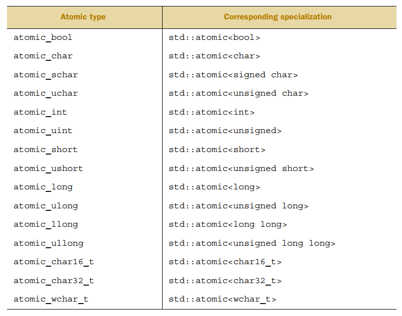

# 并发编程基础

在 C++ 语言里，线程就是一个能够独立运行的函数。任何程序一开始就有一个主线程，它从 main() 开始运行。主线程可以调用接口函数，创建 出子线程。子线程会立即脱离主线程的控制流程，单独运行，但共享主线程的数据。程序创建出多个子线程，执行多个不同的函数，也就成了多线程。

std::thread 用于创建一个执行的线程实例，所以它是一切并发编程的基础。

```
struct ThreadFunctor
{
	void operator()()
	{
		std::cout << "ThreadFunctor() called" << std::endl;
	}
};

void thread_func()
{
	std::cout << "thread_func called" << std::endl;
}


int main()
{
	//@ 使用仿函数对象作为线程函数
	ThreadFunctor tf;
	std::thread t1(tf); //@ OK
	//@ std::thread t(ThreadFunctor()); //@ most vexing parse，ThreadFunctor()被视为函数声明
	//@ 解决 most vexing parse的方法:
	std::thread t2((ThreadFunctor())); //@ OK
	std::thread t3{ ThreadFunctor() }; //@ OK
	
	//@ 使用 lambda
	std::thread t4([] {std::cout << "lambda called" << std::endl; });

	//@ 使用 std::bind 绑定的函数
	std::thread t5(std::bind(thread_func));

	t1.join();
	t2.join();
	t3.join();
	t4.join();
	t5.join();

	return 0;
}
```

线程只能移动，并且一个线程不能重复被关联：

```
std::thread t1(f);
std::thread t2 = std::move(t1); //@ t1所有权给t2，t2关联执行f的线程

t1 = std::thread(f); //@ t1重新关联一个执行g的线程

std::thread t3;
t3 = std::move(t2); //@ t3关联t2的线程，t2无关联
t1 = std::move(t3); //@ t1已有关联g的线程，调用std::terminate终止程序
```

C++ 标准库里有专门的线程类 thread，使用它就可以简单地创建线程，在名字空间 std::this_thread 里，还有 yield()、get_id()、sleep_for()、sleep_until() 、hardware_concurrency() 等几个方便的管理函数。

## 线程传参

被调用函数有默认参数依然需要指定参数，并且将会忽略默认参数：

```
void thread_func(int i = 100, float f = 9.90)
{
	std::cout << "thread_func called: " << i << " " << f << std::endl;
}

int main()
{
	//std::thread t1(thread_func); //@ 错误，未指定参数
	std::thread t2(thread_func,2,0.98);  //@ 将会忽略默认参数

	t2.join();

	return 0;
}
```

按引用传参需要显示指定：

```
void func(int& n) 
{ 
	++n; 
}

int main()
{
	int i = 1;
	//@ 显式指定按引用传参
	std::thread t2(func, std::ref(i));
	t2.join();
	std::cout << i << "\n"; //@ 2
}
```

类成员函数作为线程函数的传参：

```
class Test
{
public:
	void f(int i) { std::cout << i << std::endl; }
};

int main()
{
	Test test;

	//@ 第一个参数为成员函数地址，第二个参数为实例地址，之后为函数参数
	std::thread t(&Test::f, &test, 42);
	t.join();
}
```

如果参数是 move only 类型，需要移动传参：

```
void f(std::unique_ptr<int> p)
{
	std::cout << *p << std::endl;
}

int main()
{
	std::unique_ptr<int> p(new int(42));
	//std::thread t(f, p); //@ 错误
	std::thread t(f, std::move(p)); //@ 错误

	t.join();
}
```

## join 和 detach

启动线程后在线程销毁前要对其调用 join 或 detach，否则 std::thread 的析构函数会调用 std::terminate 终止程序。

detach：

detach 是让目标线程成为守护线程（daemon threads）。

- 一旦 detach，目标线程将独立执行，即便其对应的 thread 对象销毁也不影响线程的执行
- 一旦 detach，主调线程无法再取得该子线程的控制权。子线程将被 C++ 运行时库接管，当该线程执行结束的时候，由 C++ 运行时库负责回收该线程的资源

join：

- join 之后，当前线程会一直阻塞，直到目标线程执行完成

- join 之后，当子线程执行结束，主调线程将回收子调线程资源后，主调线程继续运行

joinable：

每个 std::thread 对象都处于可合并（joinable）或不可合并（unjoinable）的状态。joinable 可以用来判断这个线程当前是否可以被 join。

一个可合并的 std::thread 对应于一个底层异步运行的线程，若底层线程处于阻塞、等待调度或已运行结束的状态，则此 std::thread 可合并，否则不可合并。

不可合并的情况：

- 默认构造的 std::thread：此时没有要运行的函数，因此没有对应的底层运行线程
- 已移动的 std::thread：移动操作导致底层线程被转用于另一个 std::thread  对象
- 已经 detach 和 join 过的 std::thread

std::thread RAII 类：

```
class ScopeThread
{
public:
	enum class Action { Join, Detach };

	ScopeThread(std::thread & t, Action act = Action::Join) : t_(std::move(t)), action_(act)
	{
		if (!t.joinable())
		{
			throw std::logic_error("init thread can not join");
		}
	}

	~ScopeThread()
	{
		if (action_ == Action::Join)
			t_.join();
		else
			t_.detach();
	}

	ScopeThread(ScopeThread&&) = default;
	ScopeThread& operator = (ScopeThread&&) = default;

	std::thread& get() { return t_; }
private:
	Action action_;
	std::thread t_;
};
```


## 仅调用一次

双重检查锁模式的缺陷：

```
void f()
{
    if (!p) 
    {
        std::scoped_lock l(m);
        if (!p)
        {
            p.reset(new A);
        }
    }
    p->doSomething();
}
```

第一次的检查没上锁，可能与其他线程中被保护的 reset 操作产生竞争。如果当前线程看见其他线程写入了指针，但没看到新创建的对象实例，调用 doSomething 就会出错：

```
p.reset(new A);
```

正常的执行步骤：

1. 为 A 对象分配一片内存

2. 在分配的内存上调用 A 的构造函数，构造一个A对象

3. 返回该内存的指针，让 p 指向该内存

但是，编译器并不是一定按照上面的顺序执行，有可能是3->2。

为了处理 race condition，C++ 标准库提供了 std::once_flag 和 std::call_once：

```
std::shared_ptr<A> p;
std::once_flag flag;

void init()
{
    p.reset(new A);
}

void f()
{
    std::call_once(flag, init);
    p->doSomething();
}
```

## static 变量

static 变量的初始化存在潜在的 race condition：变量声明为 static 时，声明后就完成了初始化，一个线程完成了初始化，其他线程仍会抢着定义这个变量。

为此，C++11规定 static 变量的初始化只完全发生在一个线程中，直到初始化完成前其他线程都不会做处理，从而避免了 race condition。只有一个全局实例时可以不使用 std::call_once 而直接用 static 变量：

````
class A {
public:
    static A& getInstance();
    A(const A&) = delete;
    A& operator(const A&) = delete;
private:
    A() = default;
    ~A() = default;
};

A& A::getInstance()
{
    static A instance; //@ 线程安全的初始化
    return instance;
}
````

## 线程局部存储

读写全局（或者局部静态）变量是另一个比较常见的数据竞争场景，因为共享数据，多线程操作时就有可能导致状态不一致。

有的时候，全局变量并不一定是必须共享的，可能仅仅是 为了方便线程传入传出数据，或者是本地 cache，而不是为了共享所有权。换句话说，这应该是线程独占所有权，不应该在多线程之间共同拥有，术语叫“线程局部存 储”。这个功能在 C++ 里由关键字 thread_local 实现，它是一个和 static、extern 同级的变量存储说明，有 thread_local 标记的变量在每个线程里都会有一个独立的副本，是“线程独 占”的，所以就不会有竞争读写的问题。

```
int main()
{
	thread_local int n = 0; //@ 线程局部存储变量

	auto f = [&](int x)
	{
		n += x; //@ 使用线程局部变量，互不影响
		std::cout << n << std::endl;
	};

	std::thread t1(f,10);
	std::thread t2(f,20);

	t1.join();
	t2.join();

	return 0;
}
```

# 互斥量

使用 mutex 在访问共享数据前加锁，访问结束后解锁。C++ 11 中提供了如下 4 种语义的互斥量：

- std::mutex：独占的互斥量，不能递归使用
- std::timed_mutex：带超时的独占的互斥量，不能递归使用
- std::recursive_mutex：递归互斥量，不带超时功能
- std::recursive_timed_mutex：带超时的递归互斥量

## std::mutex

std::mutex 是 C++11 中最基本的互斥量：

- std::mutex不允许拷贝构造，也不允许移动拷贝，最初产生的 mutex 对象是处于 unlocked 状态的
- std::mutex::lock  调用线程将锁住该互斥量。线程调用该函数会发生下面 3 种情况：
  - 如果该互斥量当前没有被锁住，则调用线程将该互斥量锁住，直到调用 unlock 之前，该线程一直拥有该锁
  - 如果当前互斥量被其他线程锁住，则当前的调用线程被阻塞住
  - 如果当前互斥量被当前调用线程锁住，则会产生死锁(deadlock)

- std::mutex::unlock()， 解锁，释放对互斥量的所有权
- try_lock()，尝试锁住互斥量，如果互斥量被其他线程占有，则当前线程也不会被阻塞。线程调用该函数也会出现下面 3 种情况：
  - 如果当前互斥量没有被其他线程占有，则该线程锁住互斥量，直到该线程调用 unlock 释放互斥量
  - 如果当前互斥量被其他线程锁住，则当前调用线程返回 false，而并不会被阻塞掉
  - 如果当前互斥量被当前调用线程锁住，则会产生死锁(deadlock)

## std::recursive_mutex

和 std::mutex 不同的是，std::recursive_mutex 允许同一个线程对互斥量多次上锁（即递归上锁），来获得对互斥量对象的多层所有权，std::recursive_mutex 释放互斥量时需要调用与该锁层次深度相同次数的 unlock()，可理解为 lock() 次数和 unlock() 次数相同。

## std::time_mutex

std::time_mutex 比 std::mutex 多了两个成员函数，try_lock_for()，try_lock_until()：

- try_lock_for 函数接受一个时间范围，表示在这一段时间范围之内线程如果没有获得锁则被阻塞住（与 std::mutex 的 try_lock() 不同，try_lock 如果被调用时没有获得锁则直接返回 false），如果在此期间其他线程释放了锁，则该线程可以获得对互斥量的锁，如果超时（即在指定时间内还是没有获得锁），则返回 false
- try_lock_until 函数则接受一个时间点作为参数，在指定时间点未到来之前线程如果没有获得锁则被阻塞住，如果在此期间其他线程释放了锁，则该线程可以获得对互斥量的锁，如果超时（即在指定时间内还是没有获得锁），则返回 false

## std::recursive_timed_mutex

std::recursive_timed_mutex 结合了 std::recursive_mutex 和 std::time_mutex 的功能。

# 锁操作

## 上锁策略

std::defer_lock 、 std::try_to_lock 和 std::adopt_lock 分别是空结构体标签类型 std::defer_lock_t 、 std::try_to_lock_t 和 std::adopt_lock_t 的实例。

它们用于为 std::lock_guard 、 std::unique_lock 及 std::shared_lock 指定锁定策略：

- defer_lock_t：不获得互斥量的所有权
- try_to_lock_t：尝试以非阻塞方式获得互斥量的所有权
- adopt_lock_t：假设调用方线程已拥有互斥量的所有权

## std::lock

std::lock 可以一次性锁住多个 mutex，并且没有死锁风险。std::lock 可能抛异常，此时就不会上锁，因此 std::lock 保证要么都锁住，要么都不锁。

##　std::lock_guard 

 std::lock_guard 是 std::mutex RAII 实现，方便线程对互斥量上锁。

## std::unique_lock

std::unique_lock 更加灵活：

- 可以指定参数 std::defer_lock  表示 mutex 应保持解锁状态，以使 mutex 能被 std::unique_lock::lock 获取
- 可以把 std::unique_lock 传给 std::lock
- std::unique_lock 比 std::lock_guard 占用的空间多，会稍慢一点，如果不需要更灵活的锁，依然可以使用 std::lock_guard

## 死锁

死锁的四个必要条件：

- 互斥
- 占有且等待
- 不可抢占
- 循环等待

避免死锁通常建议让两个 mutex 以相同顺序上锁，总是先锁 A 再锁 B，但这并不适用所有情况。

避免死锁的建议：

- 建议1：一个线程已经获取一个锁时就不要获取第二个。如果每个线程只有一个锁，锁上就不会产生死锁（但除了互斥锁，其他方面也可能造成死锁，比如即使无锁，线程间相互等待(互相 join)也可能造成死锁）
- 建议2：持有锁时避免调用用户提供的代码。用户提供的代码可能做任何事，包括获取锁，如果持有锁时调用用户代码获取锁，就会违反第一个建议，并造成死锁。但有时调用用户代码是无法避免
- 建议3：按固定顺序获取锁。如果必须获取多个锁且不能用 std::lock 同时获取，最好在每个线程上用固定顺序获取
- 建议4：如果一个锁被低层持有，就不允许再上锁

# 条件变量

C++ 11 提供两种条件变量：

- condition_variable，配合 `std::unique_lock<std::mutex`> 进行 wait 操作
- condition_variable_any，和任意带有 lock，unlock 语义的 mutex 搭配使用，比较灵活，但是效率相对较差

条件变量的使用过程如下：

- 拥有条件变量的线程获取互斥量
- 循环检查某个条件，如果条件不满足，则阻塞直到条件满足；如果条件满足，则向下执行
- 某个线程满足条件执行完之后，再调用 notify_one 或 notify_all 唤醒一个或者所有等待的线程

## wait

std::condition_variable 提供了两种 wait() 函数：

```
void wait (unique_lock<mutex>& lck);

template <class Predicate>
void wait (unique_lock<mutex>& lck, Predicate pred);
```

- wait() 中加入了 Predicate 用于判断相应的条件是否真正的达成，这是为了避免虚假唤醒导致的错误
- wait() 传入的参数只能是 std::unique_lock 而不可以是 std::lock_guard：lock_guard 没有 lock 和 unlock 接口，而 unique_lock 提供了相应的接口

当前线程调用 wait() 后将被阻塞(此时当前线程应该获得了锁)，在线程被阻塞时，该函数会自动调用 lck.unlock() 释放锁，使得其他被阻塞在锁竞争上的线程得以继续执行。另外，一旦当前线程获得通知(notified，通常是另外某个线程调用 notify_* 唤醒了当前线程)，wait() 函数也是自动调用 lck.lock()，使得 lck 的状态和 wait 函数被调用时相同。

## wait_for

与 std::condition_variable::wait() 类似，不过 wait_for 可以指定一个时间段，在当前线程收到通知或者指定的时间 rel_time 超时之前，该线程都会处于阻塞状态。而一旦超时或者收到了其他线程的通知，wait_for 返回，剩下的处理步骤和 wait() 类似。

## wait_until 

与 std::condition_variable::wait_for 类似，但是 wait_until 可以指定一个时间点，在当前线程收到通知或者指定的时间点 abs_time 超时之前，该线程都会处于阻塞状态。而一旦超时或者收到了其他线程的通知，wait_until 返回，剩下的处理步骤和 wait_for() 类似。

### std::cv_status

- cv_status::no_timeout：wait_for 或者 wait_until 没有超时，即在规定的时间段内线程收到了通知
- cv_status::timeout：wait_for 或者 wait_until 超时

## notify_one

唤醒某个等待(wait)线程。如果当前没有等待线程，则该函数什么也不做，如果同时存在多个等待线程，则唤醒某个线程是不确定的(unspecified)。

## notify_all

唤醒所有的等待(wait)线程。如果当前没有等待线程，则该函数什么也不做。

## std::condition_variable_any

与 std::condition_variable 类似，只不过 std::condition_variable_any 的 wait 函数可以接受任何 lockable 参数，而 std::condition_variable 只能接受 `std::unique_lock<std::mutex>`  类型的参数，除此以外，和 std::condition_variable 几乎完全一样。

## std::notify_all_at_thread_exit

函数原型为：

```
void notify_all_at_thread_exit (condition_variable& cond, unique_lock<mutex> lck);
```

当调用该函数的线程退出时，所有在 cond 条件变量上等待的线程都会收到通知：

```
std::mutex mtx;
std::condition_variable cv;
bool ready = false;

void print_id(int id) 
{
	std::unique_lock<std::mutex> lck(mtx);
	while (!ready) 
		cv.wait(lck);
	std::cout << "thread " << id << '\n';
}

void go() 
{
	std::unique_lock<std::mutex> lck(mtx);
	std::notify_all_at_thread_exit(cv, std::move(lck));
	ready = true;
}

int main()
{
	std::thread threads[10];

	for (int i = 0; i<10; ++i)
		threads[i] = std::thread(print_id, i);

	std::cout << "10 threads ready to race...\n";

	std::thread(go).detach(); 

	for (auto& th : threads) 
		th.join();

	return 0;
}
```

# 异步操作

`<future> ` 头文件中包含了以下几个类和函数：

- Providers 类：std::promise, std::package_task
- Providers 函数：std::async()
- Futures 类：std::future, std::shared_future
- 其他类型：std::future_error, std::future_errc, std::future_status, std::launch

## std::future 类

std::future 用来访问异步操作的结果，因为一个异步操作的结果不会马上获取，只能在未来的某个地方获取到，这个异步操作的结果是一个未来的值，因此称为 std::future。

std::future 通常由某个 Provider 创建，可以把 Provider 想象成一个异步任务的提供者，Provider 在某个线程中设置共享状态的值，与该共享状态相关联的 std::future 对象调用 get（通常在另外一个线程中） 获取该值。

future::share 允许 move，但是不允许拷贝。

- future::get 会一直阻塞，直到获取到结果或异步任务抛出异常
- future::wait 一直等待直到数据就绪。数据就绪时，通过 get 函数，无等待即可获得数据
- future::wait_for 和 future::wait_until 主要是用来进行超时等待的。future::wait_for 等待指定时长，future::wait_until 则等待到指定的时间点。返回值有 3 种状态：
  - future_status::ready，数据已就绪，可以通过 get 获取了
  - future_status::timeout，超时，在规定的时间内共享状态的标志没有变成 ready
  - future_status::deferred，这个和 std::async 相关，表明无需 wait，异步函数将在 get 时执行
- future::valid 判断当前实例是否有效。future 主要是用来获取异步任务结果的，作为消费方出现，单独构建出来的实例没意义，因此为 false。当与其它生产方(Provider)通过共享状态关联后，才会变得有效，future 才会发挥实际的作用。C++11 中有下面几种 Provider，从这些 Provider 可获得有效的 future 实例：
  - std::async
  - promise::get_future
  - packaged_task::get_future
- future::share()，返回一个 std::shared_future 对象，调用该函数之后，该 std::future 对象本身已经不和任何共享状态相关联，因此该 std::future 的状态不再是 valid 的了

```
int work()
{
	std::this_thread::sleep_for(std::chrono::seconds(1));
	return 42;
}

int main()
{
	auto fut = std::async(std::launch::async,work);
	std::cout << "ans is:" << fut.get() << std::endl;

	return 0;
}
```

future 调用 future::get 后就无法再次 future::get，也就是说只能获取一次数据，此外还会导致所在线程与其他线程数据不同步。std::shared_future 就可以解决此问题。

std::shared_future 可以拷贝、多个 std::shared_future 可以共享某个共享状态的最终结果(即共享状态的某个值或者异常)。

shared_future 可以通过某个 std::future 对象隐式转换，或者通过 std::future::share() 显示转换，无论哪种转换，被转换的那个 std::future 对象都会变为 not-valid。

## std::async 函数

std::async() 返回一个 std::future 对象，通过该对象可以获取异步任务的值或异常（如果异步任务抛出了异常）。

std::async 函数可以指定启动策略

- launch::async：函数必须异步执行，即运行在不同的线程上
- launch::deferred：当其它线程调用 future::get 时，将调用非异步形式
- launch::async | launch::deferred ：默认启动策略是对两者进行或运算的结果

```

//@ 函数
int func(int a)
{
	return a * 10;
}

//@ 成员函数
struct Class
{
	int x{ 0 };
	int func(int)
	{
		x += 1;
		return x;
	}
};


//@ 函数对象
struct Functor {
	int operator()(int i)
	{
		return i * 1000;
	}
};


int main()
{
	auto ft = std::async(func, 42);
	std::cout << ft.get() << std::endl;

	Class c;
	auto ft1 = std::async(&Class::func, &c, 42);
	std::cout << ft1.get() << std::endl;
	auto ft2 = std::async(&Class::func, c, 42);
	std::cout << ft2.get() << std::endl;

	Functor fun;
	auto ft3 = std::async(Functor(), 42);
	std::cout << ft3.get() << std::endl;
	auto ft4 = std::async(std::ref(fun), 42);
	std::cout << ft4.get() << std::endl;

	return 0;
}
```


## std::promise 类

`std::promise<T>` 是一个模板类，在 promise 对象构造时可以和一个共享状态（通常是std::future）相关联，并可以在相关联的共享状态(std::future)上保存一个类型为 T 的值。

- promise::get_future，返回一个与 promise 共享状态相关联的 future ，返回的 future 对象可以访问由 promise 对象设置在共享状态上的值或者某个异常对象，如果不设置值或者异常，promise 对象在析构时会自动地设置一个 future_error 异常
- promise::set_value，设置共享状态的值，此后 promise 的共享状态标志变为 ready
- promise::set_exception，为 promise 设置异常，此后 promise 的共享状态变标志变为 ready
- promise::set_value_at_thread_exit，设置共享状态的值，但是不将共享状态的标志设置为 ready，当线程退出时该 promise 对象会自动设置为 ready

```
void work(std::promise<int> pro)
{
	std::this_thread::sleep_for(std::chrono::seconds(1));
	pro.set_value(42);
}

int main()
{
	std::promise<int> prom;
	auto fut = prom.get_future();

	std::thread t(work, std::move(prom));

	while (1)
	{
		auto && status = fut.wait_for(std::chrono::milliseconds(300));
		if (status == std::future_status::timeout)
			std::cout << "wait timeout ..." << std::endl;
		else if (status == std::future_status::ready)
			break;
	}

	std::cout << "ans is:" << fut.get() << std::endl;

	t.join();

	return 0;
}
```

promise 支持定制线程退出时的行为： 

- promise::set_value_at_thread_exit
  设置共享状态的值，但是不将共享状态的标志设置为 ready，当线程退出时该 promise 对象会自动设置为 ready。如果某个 future  对象与该 promise 对象的共享状态相关联，并且该 future 正在调用 future::get，则调用 future::get 的线程会被阻塞，当线程退出时，调用 future::get 的线程解除阻塞，同时返回 promise::set_value_at_thread_exit 所设置的值。注意，该函数已经设置了 promise 共享状态的值
- promise::set_exception_at_thread_exit
  线程退出时，future 则抛出该函数指定的异常

## std::packaged_task 类

`std::packaged_task<T>` 对一个函数或可调用对象绑定一个期望，当 packaged_task 的对象被调用时，它就会调用相关函数或者可调用对象，将期望状态设置为就绪，返回值也会被存储为相关数据。

std::packaged_task 对象内部包含了两个最基本元素：

- 被包装的任务(stored task)，任务(task)是一个可调用的对象，如函数指针、成员函数指针或者函数对象
- 共享状态(shared state)，用于保存任务的返回值，可以通过 std::future 对象来达到异步访问共享状态的效果

可以通过 std::packged_task::get_future 来获取与共享状态相关联的 std::future 对象。在调用该函数之后，两个对象共享相同的共享状态：

- std::packaged_task 对象是异步 Provider，它在某一时刻通过调用被包装的任务来设置共享状态的值
- std::future 对象是一个异步返回对象，通过它可以获得共享状态的值，当然在必要的时候需要等待共享状态标志变为 ready

相关操作:

- packaged_task::valid：packaged_task 除了可以通过可调用对象构造外，还支持缺省构造。但此时构造的对象不能直接使用，需通过右值赋值操作设置了可调用对象或函数后才可使用。判断一个 packaged_task 是否可使用，可通过其成员函数 packaged_task::valid 来判断
- packaged_task::operator() ：返回值是 void，即无返回值。因为 packaged_task 的设计主要是用来进行异步调用，因此 packaged_task::operator() 的计算结果是通过 future::get 来获取的。该函数会忠实地将计算结果反馈给 future，即使抛出异常
- packaged_task::make_ready_at_thread_exit：接收的参数与 packaged_task::operator() 一样，行为也一样。只有一点差别，那就是不会将计算结果立刻反馈给 future，而是在其执行时所在的线程结束后，future::get 才会取得结果
- std::packaged_task::reset：与 promise 不一样，promise 仅可以执行一次 promise::set_value 或 promise::set_exception 函数，但 packaged_task 可以执行多次，其奥秘就是 packaged_task::reset 函数。packaged_task::reset  重新构造了 promise，packaged_task::reset  操作并不会影响之前调用的 packaged_task::make_ready_at_thread_exit 结果，也即之前的定制的行为在线程退出时仍会发生

```
//@ count down taking a second for each value:
int countdown(int from, int to) 
{
	for (int i = from; i != to; --i) 
	{
		std::cout << i << '\n';
		std::this_thread::sleep_for(std::chrono::seconds(1));
	}
	std::cout << "Finished!\n";
	return from - to;
}

int main()
{
	std::packaged_task<int(int, int)> task(countdown); //@ 设置 packaged_task
	std::future<int> ret = task.get_future(); //@ 获得与 packaged_task 共享状态相关联的 future 对象

	std::thread(std::move(task), 10, 0).detach();   //@ 创建一个新线程完成计数任务

	int value = ret.get();                    //@ 等待任务完成并获取结果

	std::cout << "The countdown lasted for " << value << " seconds.\n";

	return 0;
}
```

# 原子操作与内存模型

## 标准原子类型

所谓原子（atomic），在多线程领域里的意思就是不可分的。操作要么完成，要么未完成，不能被任何外部操作打断，总是有一个确定的、完整的状态。所以也就不会存在竞争读写的问题，不需要使用互斥量来同步，成本也就更低。

C++ 11 提供的基本原子类型：



原子类型不允许由另一个原子类型拷贝赋值，因为拷贝赋值调用了两个对象，破坏了操作的原子性。但可以用对应的内置类型赋值：

```
T operator=(T desired) noexcept;
T operator=(T desired) volatile noexcept;
atomic& operator=(const atomic&) = delete;
atomic& operator=(const atomic&) volatile = delete;
```

std::atomic 为支持赋值提供了成员函数：

```
std::atomic<T>::store //@ 替换当前值
std::atomic<T>::load //@ 返回当前值
std::atomic<T>::exchange //@ 替换值，并返回被替换前的值

//@ 与期望值比较，不等则将期望值设为原值并返回false
//@ 相等则将原子值设为目标值并返回true
//@ 在缺少CAS（compare-and-exchange）指令的机器上，weak版本在相等时可能替换失败并返回false
//@ 因此weak版本通常要求循环，而strong版本返回false就能确保不相等
std::atomic<T>::compare_exchange_weak
std::atomic<T>::compare_exchange_strong

std::atomic<T>::fetch_add //@ 原子加法，返回相加前的值
std::atomic<T>::fetch_sub
std::atomic<T>::fetch_and
std::atomic<T>::fetch_or
std::atomic<T>::fetch_xor
std::atomic<T>::operator++ //@ 前自增等价于fetch_add(1)+1
std::atomic<T>::operator++(int) //@ 后自增等价于fetch_add(1)
std::atomic<T>::operator-- //@ fetch_sub(1)-1
std::atomic<T>::operator--(int) //@ fetch_sub(1)
std::atomic<T>::operator+= //@ fetch_add(x)+x
std::atomic<T>::operator-= //@ fetch_sub(x)-x
std::atomic<T>::operator&= //@ fetch_and(x)&x
std::atomic<T>::operator|= //@ fetch_or(x)|x
std::atomic<T>::operator^= //@ fetch_xor(x)^x
```

这些成员函数有一个用来指定内存序的参数 std::memory_order：

```
typedef enum memory_order {
    memory_order_relaxed,
    memory_order_consume,
    memory_order_acquire,
    memory_order_release,
    memory_order_acq_rel,
    memory_order_seq_cst
} memory_order;
```

store 的顺序参数只能是：

- memory_order_relaxed
- memory_order_release
- memory_order_seq_cst (默认)

load 的顺序参数只能是：

- memory_order_relaxed
- memory_order_consume
- memory_order_acquire
- memory_order_seq_cst (默认)

### std::atomic_flag

std::atomic_flag 是一个原子的布尔类型，也是唯一保证 lock-free 的原子类型。它只能在  set 和 clear 两个状态之间切换。

如果在初始化时没有明确使用 ATOMIC_FLAG_INIT初始化，那么新创建的 std::atomic_flag 对象的状态是未指定的（unspecified）（既没有被 set 也没有被 clear）

ATOMIC_FLAG_INIT：如果某个 std::atomic_flag 对象使用该宏初始化，那么可以保证该 std::atomic_flag 对象在创建时处于 clear 状态。

只支持两种操作：

- test-and-set
  - test_and_set 函数检查 std::atomic_flag 标志，如果 std::atomic_flag 之前没有被设置过，则设置 std::atomic_flag 的标志，并返回先前该 std::atomic_flag 对象是否被设置过，如果之前 std::atomic_flag 对象已被设置，则返回 true，否则返回 false
  - test-and-set 操作是原子的，可以指定 Memory Order
- clear
  - 清除 std::atomic_flag 对象的标志位，即设置 atomic_flag 的值为 false
  - test-and-set 操作是原子的，可以指定 Memory Order

用 std::atomic_flag 实现自旋锁：

```
class  SpinMutex
{
public:
	void lock()
	{
		while(flag.test_and_set(std::memory_order_acquire))
			;
	}

	void unlock()
	{
		flag.clear(std::memory_order_release);
	}

private:
	std::atomic_flag flag = ATOMIC_FLAG_INIT;
};
```

std::atomic_flag 功能过于局限，甚至无法像布尔类型一样使用，相比之下，`std::atomic<bool>` 更易用。但是 `std::atomic<bool>` 不保证 lock-free，可以用 is_lock_free 检验在当前平台上是否 lock-free。

### 指针原子类型

指针原子类型 `std::atomic<T*>` 也支持 is_lock_free、load、store、exchange、compare_exchange_weak 和 compare_exchange_strong，与 `std::atomic<bool>` 语义相同。此外指针原子类型还支持运算操作：fetch_add、fetch_sub、++、--、+=、-= 。

### 整型原子类型

整型原子类型（如 `std::atomic<int>`）在上述操作之外，还支持 fetch_or、fetch_and、fetch_xor、=、&=、^=。

### 自定义原子类型

如果原子类型是自定义类型，该自定义类型必须可平凡复制（trivially copyable），也就意味着该类型不能有虚函数或虚基类。这可以用 is_trivially_copyable 检验。

### 小结


### C  风格 API

除了每个类型各自的成员函数，原子操作库还提供了通用的 C 风格 API，只不过函数名多了一个 atomic_ 前缀，参数变为指针类型：

```
std::atomic<int> i(42);
int j = std::atomic_load(&i); //@ 等价于i.load()
```

除 std::atomic_is_lock_free 外，每个自由函数有一个 `_explicit` 后缀版本，`_explicit` 函数额外接受一个 std::memory_order 参数：

```
std::atomic<int> i(42);
//@ i.load(std::memory_order_acquire) 
std::atomic_load_explicit(&i, std::memory_order_acquire); 
```

自由函数不仅可用于原子类型，还为 std::shared_ptr 提供了特化版本：

```
std::shared_ptr<int> p(new int(42));
std::shared_ptr<int> x = std::atomic_load(&p);
std::shared_ptr<int> q;
std::atomic_store(&q, p);
```

这个特化将在 C++20 中弃用，C++20 直接允许 std::atomic 的模板参数为 std::shared_ptr：

```
std::atomic<std::shared_ptr<int>> x; //@ C++20
```

## 内存模型

事实上，开发者编写的代码和最终运行的程序往往会存在较大的差异，之所以会产生差异，原因主要来自下面三个方面：

- 编译器优化
- CPU out-of-order 执行
- CPU Cache 不一致性


### 关系术语

sequenced-before：

sequenced-before是一种单线程上的关系，这是一个非对称，可传递的成对关系。

对于两个操作 A 和 B，如果 A sequenced-before B，则 A 的执行应当在B的前面，并且 A 执行后的结果 B 也能看到，它引入了一个局部有序性。

 ```
int i = 7; 	//@ 1
i++;        //@ 2
 ```

这里的 1 sequenced-before 2。

但是同一个语句中的多个子表达式上没有这个关系的。特别极端的，对于下面这个语句：

```
i = i++ + i;
```

由于等号右边的两个子表达式无法确定先后关系，因此这个语句的行为是未定义的。这意味着，你永远不应该写这样的代码。

happens-before：

happens-before 关系是 sequenced-before 关系的扩展，因为它还包含了不同线程之间的关系。

如果 A happens-before B，则 A 的内存状态将在 B 操作执行之前就可见，这就为线程间的数据访问提供了保证。

同样的，这是一个非对称，可传递的关系。如果 A happens-before B，B happens-before C。则可推导出 A happens-before C。

synchronizes-with：

synchronizes-with 描述的是一种状态传播关系。如果 A synchronizes-with B，则就是保证操作 A 的状态在操作 B 执行之前是可见的。

原子操作的 acquire-release 具有 synchronized-with 关系。除此之外，对于锁和互斥体的释放和获取可以达成 synchronized-with 关系，还有线程执行完成和 join 操作也能达成 synchronized-with 关系。

借助 synchronizes-with 可以达成 happens-before 关系。

### memory order

C++ 中的内存模型：

```
typedef enum memory_order {
    memory_order_relaxed, //@ 无同步或顺序限制，只保证当前操作原子性
    memory_order_consume, //@ 标记读操作，依赖于该值的读写不能重排到此操作前
    memory_order_acquire, //@ 标记读操作，之后的读写不能重排到此操作前
    memory_order_release, //@ 标记写操作，之前的读写不能重排到此操作后
    memory_order_acq_rel, //@ 仅标记读改写操作，读操作相当于acquire，写操作相当于release
    memory_order_seq_cst //@ sequential consistency：顺序一致性不允许重排，所有原子操作的默认选项
} memory_order;
```

当多个线程中包含了多个原子操作，这些原子操作因为其`memory_order`的选择不一样，将导致运行时不同的内存模型强度。

- 宽松模型
- 释放/消费模型
- 释放/获取模型
- 顺序一致模型


内存序：

- memory_order_relaxed：松散内存序，只用来保证对原子对象的操作是原子的
- memory_order_consume：目前不鼓励使用  
- memory_order_acquire：获得操作，在读取某原子对象时，当前线程的任何后面的读写操作都不允许重排到这个操作的前面去，并且其他线程在对同一个原子对象释放之前的所有内存写入都在当前线程可见  
- memory_order_release：释放操作，在写入某原子对象时，当前线程的任何前面的读写操作都不允许重排到这个操作的后面去，并且当前线程的所有内存写入都在对同一个原子对象进行获取的其他线程可见  
- memory_order_acq_rel：获得释放操作，一个读‐修改‐写操作同时具有获得语义和释放语义，即它前后的任何读写操作都不允许重排，并且其他线程在对同一个原子对象释放之前的所有内存写入都在当前线程可见，当前线程的所有内存写入都在对同一个原子对象进行获取的其他线程可见  
- memory_order_seq_cst：顺序一致性语义，对于读操作相当于获取，对于写操作相当于释放，对于读‐修改‐写操作相当于获得释放，是所有原子操作的默认内存序  

宽松模型：

通过 std::memory_order_relaxed 指定。在此模型下，单个线程内的原子操作都是顺序执行的，不允许指令重排，但不同线程间原子操作的顺序是任意的。

```
	std::atomic<int> counter = { 0 };
	std::vector<std::thread> vt;
	for (int i = 0; i < 100; ++i) {
		vt.emplace_back([&counter]() {
			counter.fetch_add(1, std::memory_order_relaxed);
		});
	}

	for (auto& t : vt) {
		t.join();
	}
	std::cout << "current counter:" << counter << std::endl;
```

释放/消费模型：

在此模型中开始限制进程间的操作顺序，如果某个线程需要修改某个值，但另一个线程会对该值的某次操作产生依赖，即后者依赖前者。

```
	std::atomic<int*> ptr;
	int v;

	std::thread producer([&]() {
		int *p = new int(42);
		v = 1024;
		ptr.store(p,std::memory_order_release);
	});

	std::thread consumer([&]() {
		int* p;
		while (!(p = ptr.load(std::memory_order_consume)));

		std::cout << "p:" << *p << std::endl;
		std::cout << "v:" << v << std::endl;
	});

	producer.join();
	consumer.join();
```

释放/获取模型：

在此模型下可以进一步加紧对不同线程间原子操作的顺序的限制，在释放 std::memory_order_release 和获取 std::memory_order_acquire 之间规定时序，即发生在释放操作之前的所有写操作，对其他线程的任何获取操作都是可见的，亦即发生顺序（happens-before）。

可以看到，std::memory_order_release 确保了它之后的写行为不会发生在释放操作之前，是一个向后的屏障，而 std::memory_order_acquire 确保了它之后的写行为，不会发生在该获取操作之后，是一个向前的屏障，对于选项 std::memory_order_acq_rel 而言，则结合了这两者的特点，唯一确定了一个内存屏障，使得当前线程对内存的读写不会被重排到此操作的前后。

```
	std::vector<int> v;
	std::atomic<int> flag = { 0 };

	std::thread release([&]() {
		v.push_back(42);
		flag.store(1, std::memory_order_release);
	});

	std::thread acqrel([&]() {
		int expected = 1; //@ must before compare_exchange_strong
		while (!flag.compare_exchange_strong(expected, 2, std::memory_order_acq_rel)) {
			expected = 1; //@ must after compare_exchange_strong
		}
		//@ flag has changed to 2
	});

	std::thread acquire([&]() {
		while (flag.load(std::memory_order_acquire) < 2)
			;

		std::cout << v.at(0) << std::endl; //@ must be 42
	});

	release.join();
	acqrel.join();
	acquire.join();
```

compare_exchange_strong 便是比较交换原语（Compare-and-swap primitive），它有一个更弱的版本，即 compare_exchange_weak，它允许即便交换成功，也仍然返回 false 失败。其原因是因为在某些平台上虚假故障导致的，具体而言，当 CPU 进行上下文切换时，另一线程加载同一地址产生的不一致。除此之外，compare_exchange_strong 的性能可能稍差于 compare_exchange_weak。

顺序一致模型：

在此模型下，原子操作满足顺序一致性，进而可能对性能产生损耗。可显式的通过 std::memory_order_seq_cst 进行指定。

```
	std::atomic<int> counter = { 0 };
	std::vector<std::thread> vt;
	for (int i = 0; i < 100; ++i) {
		vt.emplace_back([&counter]() {
			counter.fetch_add(1, std::memory_order_seq_cst);
		});
	}

	for (auto& t : vt) {
		t.join();
	}
	std::cout << "current counter:" << counter << std::endl;
```

# 多线程编程实战

##　生产者消费者

### 单生产者单消费者

```
#include <iostream>
#include <thread>
#include <mutex>
#include <condition_variable>

static const int kItemRepositorySize = 10;
static const int kItemsToProduce = 1000;

struct ItemRepository
{
	int item_buffer[kItemRepositorySize];
	size_t consume_position = 0;
	size_t produce_position = 0;
	size_t item_count = 0;
	std::mutex mtx;
	std::condition_variable not_full;
	std::condition_variable not_empty;
};

ItemRepository g_item_repo;


void produce_task()
{
	for (int i = 0; i < kItemsToProduce; i++)
	{
		{
			std::unique_lock<std::mutex> lock(g_item_repo.mtx);
			g_item_repo.not_full.wait(lock,
				[] {return (g_item_repo.produce_position + 1) % kItemRepositorySize != g_item_repo.consume_position; }
			);
			g_item_repo.item_buffer[g_item_repo.produce_position] = i;
			g_item_repo.produce_position++;
			if (g_item_repo.produce_position == kItemRepositorySize)
				g_item_repo.produce_position = 0;

			std::cout << "produce the: " << i << " item" << std::endl;
			g_item_repo.not_empty.notify_one();
		}

	}
}

void consume_task()
{
	static int cnt = 0;
	while (true)
	{
		{
			std::unique_lock<std::mutex> lock(g_item_repo.mtx);
			g_item_repo.not_empty.wait(lock, []() {return g_item_repo.produce_position != g_item_repo.consume_position; }
			);
			int data = g_item_repo.item_buffer[g_item_repo.consume_position];
			g_item_repo.consume_position++;
			if (g_item_repo.consume_position == kItemRepositorySize)
				g_item_repo.consume_position = 0;

			++cnt;
			std::cout << "consume the: " << data << " item" << std::endl;
			g_item_repo.not_full.notify_one();

			if (cnt == kItemsToProduce)
				break;
		}
	}
}

int main()
{
	std::thread consume_thr(consume_task);
	std::thread produce_thr(produce_task);

	consume_thr.join();
	produce_thr.join();

	return 0;
}
```

### 单生产者多消费者

```
#include <iostream>
#include <thread>
#include <mutex>
#include <condition_variable>

static const int kItemRepositorySize = 5;
static const int kItemsToProduce = 1000;

struct ItemRepository
{
	int item_buffer[kItemRepositorySize];
	size_t consume_position = 0;
	size_t produce_position = 0;
	size_t item_count = 0;
	std::mutex mtx;
	std::mutex item_count_mtx;
	std::condition_variable not_full;
	std::condition_variable not_empty;
};

ItemRepository g_item_repo;


void produce_task()
{
	for (int i = 0; i < kItemsToProduce; i++)
	{
		{
			std::unique_lock<std::mutex> lock(g_item_repo.mtx);
			g_item_repo.not_full.wait(lock,
				[] {return (g_item_repo.produce_position + 1) % kItemRepositorySize != g_item_repo.consume_position; }
			);
			g_item_repo.item_buffer[g_item_repo.produce_position] = i;
			g_item_repo.produce_position++;
			if (g_item_repo.produce_position == kItemRepositorySize)
				g_item_repo.produce_position = 0;

			std::cout << "produce the: " << i << " item" << std::endl;
			g_item_repo.not_empty.notify_one();
		}

	}
}

void consume_task()
{
	while (true)
	{
		{
			std::lock_guard<std::mutex> count_lock(g_item_repo.item_count_mtx);
			if (g_item_repo.item_count < kItemsToProduce)
			{
				std::unique_lock<std::mutex> lock(g_item_repo.mtx);
				g_item_repo.not_empty.wait(lock, []() {return g_item_repo.produce_position != g_item_repo.consume_position; }
				);

				int data = g_item_repo.item_buffer[g_item_repo.consume_position];
				g_item_repo.consume_position++;
				if (g_item_repo.consume_position == kItemRepositorySize)
					g_item_repo.consume_position = 0;

				++g_item_repo.item_count;
				std::cout << std::this_thread::get_id()<<" consume the: " << data << " item" << std::endl;
				g_item_repo.not_full.notify_one();
			}
			else
				break;
		}
	}
}

int main()
{
	std::thread produce_thr(produce_task);
	std::thread consume_thr1(consume_task);
	std::thread consume_thr2(consume_task);
	std::thread consume_thr3(consume_task);
	std::thread consume_thr4(consume_task);
	std::thread consume_thr5(consume_task);

	produce_thr.join();
	consume_thr1.join();
	consume_thr2.join();
	consume_thr3.join();
	consume_thr4.join();
	consume_thr5.join();

	return 0;
}
```

### 多生产者单消费者

```
#include <iostream>
#include <thread>
#include <mutex>
#include <condition_variable>

static const int kItemRepositorySize = 10;
static const int kItemsToProduce = 1000;

struct ItemRepository
{
	int item_buffer[kItemRepositorySize];
	size_t consume_position = 0;
	size_t produce_position = 0;
	size_t item_count = 0;
	std::mutex mtx;
	std::mutex item_count_mtx;
	std::condition_variable not_full;
	std::condition_variable not_empty;
};

ItemRepository g_item_repo;


void produce_task()
{
	while (true)
	{

		{
			std::lock_guard<std::mutex> count_lock(g_item_repo.item_count_mtx);
			if (g_item_repo.item_count < kItemsToProduce)
			{
				std::unique_lock<std::mutex> lock(g_item_repo.mtx);
				g_item_repo.not_full.wait(lock,
					[] {return (g_item_repo.produce_position + 1) % kItemRepositorySize != g_item_repo.consume_position; }
				);

				g_item_repo.item_count += 1;
				int data = g_item_repo.item_count;
				g_item_repo.item_buffer[g_item_repo.produce_position] = data;
				g_item_repo.produce_position++;
				if (g_item_repo.produce_position == kItemRepositorySize)
					g_item_repo.produce_position = 0;

				std::cout << std::this_thread::get_id() << " produce the: " << data << " item" << std::endl;
				g_item_repo.not_empty.notify_one();
			}
			else
				break;

		}
	}
}

void consume_task()
{
	int consume_count = 0;
	while (true)
	{
		{
			if (consume_count < kItemsToProduce)
			{
				std::unique_lock<std::mutex> lock(g_item_repo.mtx);
				g_item_repo.not_empty.wait(lock, []() {return g_item_repo.produce_position != g_item_repo.consume_position; }
				);

				int data = g_item_repo.item_buffer[g_item_repo.consume_position];
				g_item_repo.consume_position++;
				if (g_item_repo.consume_position == kItemRepositorySize)
					g_item_repo.consume_position = 0;

				++consume_count;
				std::cout << "consume the: " << data << " item" << std::endl;
				g_item_repo.not_full.notify_one();
			}
			else
				break;
		}
	}
}

int main()
{
	std::thread produce_thr1(produce_task);
	std::thread produce_thr2(produce_task);
	std::thread produce_thr3(produce_task);
	std::thread produce_thr4(produce_task);
	std::thread produce_thr5(produce_task);
	std::thread consume_thr(consume_task);

	produce_thr1.join();
	produce_thr2.join();
	produce_thr3.join();
	produce_thr4.join();
	produce_thr5.join();
	consume_thr.join();

	return 0;
}
```

### 多生产者多消费者

```
#include <iostream>
#include <thread>
#include <mutex>
#include <condition_variable>

static const int kItemRepositorySize = 10;
static const int kItemsToProduce = 1000;

struct ItemRepository
{
	int item_buffer[kItemRepositorySize];
	size_t consume_position = 0;
	size_t produce_position = 0;
	size_t produce_item_count = 0;
	size_t consume_item_count = 0;
	std::mutex mtx;
	std::mutex produce_item_count_mtx;
	std::mutex consume_item_count_mtx;
	std::condition_variable not_full;
	std::condition_variable not_empty;
};

ItemRepository g_item_repo;


void produce_task()
{
	while (true)
	{
		{
			std::lock_guard<std::mutex> count_lock(g_item_repo.produce_item_count_mtx);
			if (g_item_repo.produce_item_count < kItemsToProduce)
			{
				std::unique_lock<std::mutex> lock(g_item_repo.mtx);
				g_item_repo.not_full.wait(lock,
					[] {return (g_item_repo.produce_position + 1) % kItemRepositorySize != g_item_repo.consume_position; }
				);

				g_item_repo.produce_item_count += 1;
				int data = g_item_repo.produce_item_count;
				g_item_repo.item_buffer[g_item_repo.produce_position] = data;
				g_item_repo.produce_position++;
				if (g_item_repo.produce_position == kItemRepositorySize)
					g_item_repo.produce_position = 0;

				std::cout << std::this_thread::get_id() << " produce the: " << data << " item" << std::endl;
				g_item_repo.not_empty.notify_one();
			}
			else
				break;
		}

	}
}

void consume_task()
{
	while (true)
	{
		{
			std::lock_guard<std::mutex> count_lock(g_item_repo.consume_item_count_mtx);
			if (g_item_repo.consume_item_count < kItemsToProduce)
			{
				std::unique_lock<std::mutex> lock(g_item_repo.mtx);
				g_item_repo.not_empty.wait(lock, []() {return g_item_repo.produce_position != g_item_repo.consume_position; }
				);

				int data = g_item_repo.item_buffer[g_item_repo.consume_position];
				g_item_repo.consume_position++;
				if (g_item_repo.consume_position == kItemRepositorySize)
					g_item_repo.consume_position = 0;

				++g_item_repo.consume_item_count;
				std::cout << std::this_thread::get_id() << " consume the: " << data << " item" << std::endl;
				g_item_repo.not_full.notify_one();
			}
			else
				break;
		}
	}
}

int main()
{
	std::thread produce_thr1(produce_task);
	std::thread produce_thr2(produce_task);
	std::thread consume_thr1(consume_task);
	std::thread consume_th2(consume_task);
	
	produce_thr1.join();
	produce_thr2.join();
	consume_thr1.join();
	consume_th2.join();

	return 0;
}
```

## 半同步半异步线程池

### 同步队列

```
#include <iostream>
#include <memory>
#include <mutex>
#include <condition_variable>
#include <list>


template <typename T>
class SyncQueue
{
public:
	SyncQueue(size_t n) noexcept : capacity_(n) {}

	void push(T&& t)
	{
		add(t);
	}

	void push(const T& t)
	{
		add(t);
	}
	
	void pop(std::list<T> & list)
	{
		std::unique_lock<std::mutex> lock(mtx_);
		cv_not_empty_.wait(lock, [this] {return need_stop_ || not_empty(); });
		if (need_stop_)
			return;
		list = std::move(queue_);
		cv_not_full_.notify_one();
	}

	void pop(T & t)
	{
		std::unique_lock<std::mutex> lock(mtx_);
		cv_not_empty_.wait(lock, [this] {return need_stop_ || not_empty(); });
		if (need_stop_)
			return;
		t = std::move(queue_.front());
		queue_.pop_front();
		cv_not_full_.notify_one();
	}

	void stop()
	{
		{
			std::lock_guard<std::mutex> lock(mtx_);
			need_stop_ = true;
		}

		cv_not_empty_.notify_all();
		cv_not_full_.notify_all();
	}

	bool empty() const noexcept
	{
		std::lock_guard<std::mutex> lock(mtx_);
		return queue_.empty();
	}

	bool full() const noexcept
	{
		std::lock_guard<std::mutex> lock(mtx_);
		return queue_.size() >= capacity_;
	}

	size_t size() const noexcept
	{
		std::lock_guard<std::mutex> lock(mtx_);
		return queue_.size();
	}

private:
	bool not_full()
	{
		bool full = queue_.size() >= capacity_;
		//if (full)
		//	std::cout << "queue is full" << std::endl;
		return !full;
	}

	bool not_empty()
	{
		bool empty = queue_.empty();
		//if (empty)
		//	std::cout << "queue is empty" << std::endl;
		return !empty;
	}

	template <typename F>
	void add(F&& f)
	{
		std::unique_lock<std::mutex> lock(mtx_);
		cv_not_full_.wait(lock, [this] {return need_stop_ || not_full(); });
		if (need_stop_)
			return;

		queue_.push_back(std::forward<F>(f));
		cv_not_empty_.notify_one();
	}

private:
	size_t capacity_ = 0;
	bool need_stop_ = false;
	std::list<T> queue_;
	std::condition_variable cv_not_full_;
	std::condition_variable cv_not_empty_;
	std::mutex mtx_;
};
```

### 线程池

````
#include <list>
#include <thread>
#include <functional>
#include <memory>
#include <atomic>
#include <algorithm>

const int kMaxTaskNum = 20;

class ThreadPool
{
public:
	using Task = std::function<void()>;

	ThreadPool(int nums = std::thread::hardware_concurrency()) noexcept: queue_(kMaxTaskNum)
	{
		start(nums);
	}

	~ThreadPool()
	{
		stop();
	}

	void stop()
	{
		std::call_once(flag_, [this] {stop_threads(); });
	}

	void add_task(Task&& task)
	{
		queue_.push(std::forward<Task>(task));
	}

	void add_task(const Task& task)
	{
		queue_.push(task);
	}

private:
	void start(int nums)
	{
		running_.store(true);
		for (int i = 0; i < nums; i++)
		{
			threads_.emplace_back(std::make_shared<std::thread>(&ThreadPool::run_in_thread,this));
		}
	}

	void run_in_thread()
	{
		while (running_)
		{
			std::list<Task> tasks;
			queue_.pop(tasks);
			{
				for (const auto& task : tasks)
				{
					if (!running_)
						return;
					task();
				}
			}
		}
	}

	void stop_threads()
	{
		queue_.stop();
		running_ = false;

		std::for_each(threads_.begin(), threads_.end(),std::mem_fn(&std::thread::join));
		threads_.clear();
	}

private:
	SyncQueue<Task> queue_;
	std::atomic_bool running_;
	std::once_flag flag_;
	std::list<std::shared_ptr<std::thread>> threads_;
};


int main()
{
	ThreadPool pool;

	std::thread thr1([&pool] {
		for (int i = 0; i < 10; i++)
		{
			auto thr_id = std::this_thread::get_id();
			pool.add_task([&thr_id] {
				std::cout << "thread 1 id:" << thr_id << std::endl;
			});
		}
	});

	std::thread thr2([&pool] {
		for (int i = 0; i < 10; i++)
		{
			auto thr_id = std::this_thread::get_id();
			pool.add_task([&thr_id] {
				std::cout << "thread 2 id:" << thr_id << std::endl;
			});
		}
	});

	std::this_thread::sleep_for(std::chrono::milliseconds(200));
	getchar();

	pool.stop();
	thr1.join();
	thr2.join();

	return 0;
}
````


