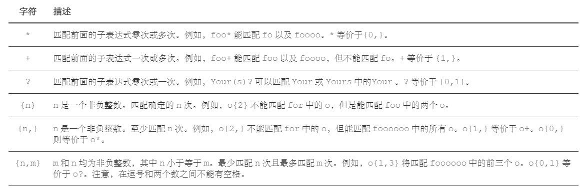

string 是模板类特化形式的别名：

```
using string = std::basic_string<char>;
```

# 字面量

C++11 为方便使用字符串，新增了一个字面量的后缀“s”，明确地表示它是 string 字符串类型，而不是 C 字符串，这就可以利用 auto 来自动类型推导：

```
auto str = "std string";  //@ str -> const char*

using namespace std::literals::string_literals; //@ 需要打开命名空间
auto str2 = "std string"s;  //@ str2 -> std::string
```

C++11 还为字面量增加了一个“原始字符串”的新表示形式，比原来的引号多了一个大写字母 R 和一对圆括号，就像下面这样：  

```
auto str1 = R"(\r\n\t\)"; //@ 原样输出 \r\n\t
auto str2 = R"(\\\\\\\$)"; //@ 原样输出 \\\\\\\$
```

如果原始字符串中有引号或者圆括号，需要在圆括号的两边加上最多 16 个字符的特别“界定符”（delimiter），这样就能够保证不与字符串内容发生冲突：  

```
auto str = R"==("('xx')")=="; //@ 原样输出 "('xx')"
```

## 自定义字面量  

C++11 引入了自定义字面量，可以使用 operator"" 后缀 来将用户提供的字面量转换成实际的类型。C++14 则在标准库中加入了不少标准字面量。下面这个程序展示了它们的用法：    

```
std::this_thread::sleep_for(500ms);
```

要在自己的类里支持字面量也相当容易，唯一的限制是非标准的字面量后缀必须以下划线 _ 打头：

```
struct Length
{
	double value;

	enum unit
	{
		metre,
		kilometre,
		millimetre,
		centmetre,
		inch,
		foot,
		yard,
		mile,
	};

	static constexpr double factors[] =	{
		1.0,1000.0,1e-3,1e-2,0.0254,0.3084,0.9144,1609.344	};
	
	explicit Length(double v, unit u = metre)
	{
		value = v* factors[u];
	}
};

Length operator +(Length& lhs, Length& rhs)
{
	return Length(lhs.value + rhs.value);
}

Length operator"" _m(long double v)
{
	return Length(v, Length::metre);
}

Length operator"" _cm(long double v)
{
	return Length(v, Length::centmetre);
}


int main()
{
	auto v = 1.0_m + 10.0_cm;
	std::cout << v.value << std::endl;
}
```

## 二进制字面量  

从 C++14 开始，二进制也有了直接的字面量：  

```
unsigned mask = 0b111000000;
```

但是 I/O streams 里只有 dec、hex、oct 三个操纵器（manipulator），而没有 bin，因而输出一个二进制数不能像十进制、十六进制、八进制那么直接。一个间接
方式是使用 bitset，但调用者需要手工指定二进制位数：  

```
std::cout << std::bitset<9>(mask) << std::endl;
```

## 数字分隔符  

C++14 开始，允许在数字型字面量中任意添加 ' 来使其更可读。  

```
unsigned mask = 0b111'000'000;
long r_earth_equatorial = 6'378'137;
double pi = 3.14159'26535'89793;
const unsigned magic = 0x44'42'47'4E;
```

## 用户自定义字面量

```
struct Watt { unsigned int v; };

Watt operator "" _w(unsigned long long v)
{
	return{ (unsigned int)v };
}

int main()
{
	Watt w = 1024_w;
	
    return 0;
}
```

使用字面量时需要注意：

- 在字面量操作符函数的声明中，`operator ""` 与用户自定义后缀之间必须有空格
- 后缀建议以下划线开始

另外标准规定：

- 如果字面量为整型数，那么字面量操作符函数只可接受 `unsigned long long` 或者 `const char*` 为其参数，当 `unsigned long long` 无法容纳字面量的时候，编译器会自动将该字面量转换为以 `\0` 为结束符的字符串，并调用以 `const char*` 为参数的版本进行处理
- 如果字面量为整型数，那么字面量操作符函数只可接受 `long double` 或者 `const char*` 为其参数，当 `long double` 无法容纳字面量的时候，编译器会自动将该字面量转换为以 `\0` 为结束符的字符串，并调用以 `const char*` 为参数的版本进行处理
- 如果字面量为字符，则字面量操作符函数只可接受一个 `char` 参数

# 字符串转换函数  

- stoi()、stol()、stoll() 等把字符串转换成整数
- stof()、stod() 等把字符串转换成浮点数
- to_string() 把整数、浮点数转换成字符串  

# 字符串视图类  

string 的成本问题。它确实有点“重”，大字符串的拷贝、修改代价很高，所以我们通常都尽量用 const string&，但有的时候还是无法避免。

在 C++17 里，就有这么一个完美满足所有需求的东西，叫 string_view。顾名思义，它是一个字符串的视图，成本很低，内部只保存一个指针和长度，无论是拷贝，还是修改，都非常廉价。  

C++11 里实现一个简化版本：

```
class string_view final
{
public:
	using size_type = size_t;

	string_view() = default;
	~string_view() = default;

	string_view(const std::string& str) noexcept: ptr_(str.data()), len_(str.length())
	{
	}

	const char* data() const
	{
		return ptr_;
	}

	size_type size() const 
	{
		return len_;
	}

private:
	const char* ptr_ = nullptr;
	size_type len_ = 0;
};
```

# 正则表达式

一般使用正则表达式主要是实现下面三个需求：

- 检查一个串是否包含某种形式的子串
- 将匹配的子串替换
- 从某个串中取出符合条件的子串

C++ 正则表达式主要有两个类：

- regex：表示一个正则表达式，是 basic_regex 的特化形式
- smatch：表示正则表达式的匹配结果，是 match_results 的特化形式  

C++ 正则匹配有三个算法，注意它们都是“只读”的，不会变动原字符串：

- regex_match()：完全匹配一个字符串
- regex_search()：在字符串里查找一个正则匹配
- regex_replace()：正则查找再做替换  

在写正则的时候，记得最好要用“原始字符串” 。

## 特殊字符

特殊字符是正则表达式里有特殊含义的字符，也是正则表达式的核心匹配语法。


## 限定符



## std::regex 及其相关

C++11 提供的正则表达式库操作 `std::string` 对象，模式 `std::regex` (本质是 `std::basic_regex`)进行初始化，通过 `std::regex_match` 进行匹配，从而产生 `std::smatch` （本质是 `std::match_results` 对象）。

```
	std::string fnames [] = { "foo.txt", "bar.txt", "test", "a0.txt", "AAA.txt" };
	std::regex txt_reg("[a-z]+\\.txt");
	for (const auto & fname : fnames)
	{
		std::cout << fname << ": " << std::regex_match(fname, txt_reg) << std::endl;
	}

	std::cout << "------------------------------------------------" << std::endl;

	std::regex base_regex{ "([a-z]+)\\.txt" };
	std::smatch base_match;
	for (const auto & fname : fnames)
	{
		if (std::regex_match(fname, base_match, base_regex))
		{
			//@ std::smatch 的第一个元素匹配整个字符串
			//@ std::smatch 的第二个元素匹配了第一个括号表达式
			if (base_match.size() == 2)
			{
				std::string base = base_match[1].str();
				std::cout << base_match[0].str() << std::endl;
				std::cout << base << std::endl;
			}
		}
	}
```


