# 对象内存布局

## 类成员

在C++中，成员分为数据成员和成员函数：

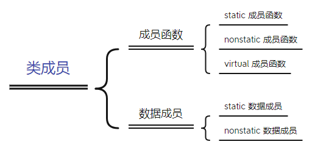

```
class Base
{
public:
	Base(int i) :baseI(i) {};
	int getI() { return baseI; }
	static void countI() {};
	virtual ~Base() {}
	virtual void print(void) { std::cout << "Base::print()"<<std::endl; }

private:
	int baseI;
	static int baseS;
};
```

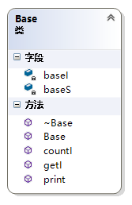

## 简单对象模型

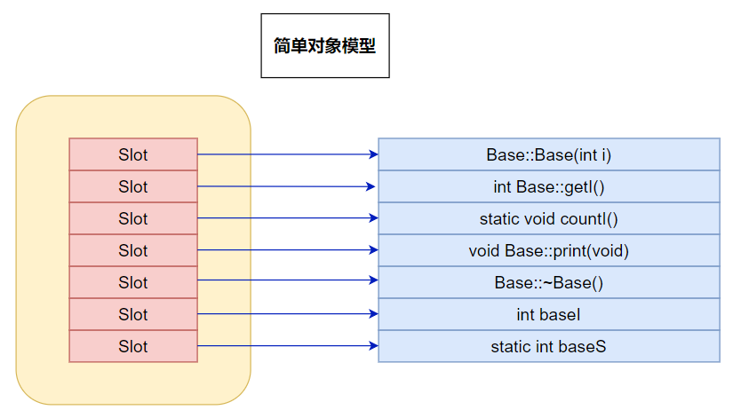

原理：

对象并没有直接保存成员而是保存了成员的指针，所有的成员占用相同的空间（跟成员类型无关），对象只是维护了一个包含成员指针的一个表，表中放的是成员的地址，无论成员变量还是函数，都是这样处理。排列的顺序与声明的顺序一致。

优缺点：

- 节省内存空间，每一个槽大小固定，无论成员内存是多大，都只有一个指针大小
- 执行效率低下，继承越多，效率急速下降

## 表格驱动对象模型

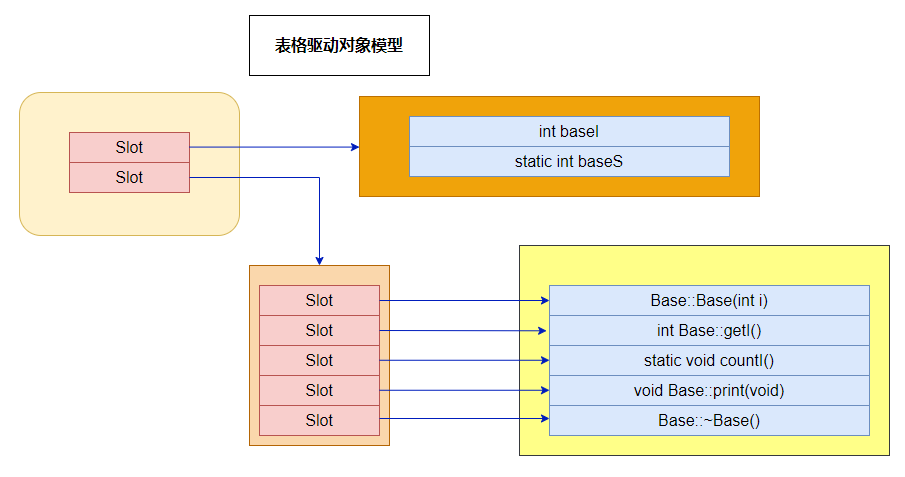

原理：

将成员分成函数和数据用两个表格保存，然后对象只保存了两个指向表格的指针。这个模型可以保证所有的对象具有相同的大小，相比于简单对象模型还与成员的个数相关。其中数据成员表中包含实际数据；函数成员表中包含的实际函数的地址（与数据成员相比，多一次寻址）。

优缺点：

- 降低了对象的slot，也就是意味着提高了访问成员的效率，直接存取变量提高了效率和内存紧凑方便寻址
- 成员变量一级寻址和成员函数二级寻址执行效率仍然很低，继承越多，效率下降越明显

# 无继承

在此模型下，nonstatic 数据成员被置于每一个类对象中，而static数据成员被置于类对象之外。static与nonstatic函数也都放在类对象之外，而对于virtual 函数，则通过虚函数表+虚指针来支持，具体如下：

- 每个类生成一个表格，称为虚表（virtual table，简称 vtbl）。虚表中存放着一堆指针，这些指针指向该类每一个虚函数。虚表中的函数地址将按声明时的顺序排列，不过当子类有多个重载函数时例外
- 每个类对象都拥有一个虚表指针(vptr)，由编译器为其生成。虚表指针的设定与重置皆由类的复制控制（也即是构造函数、析构函数、赋值操作符）来完成。vptr 的位置为编译器决定，传统上它被放在所有显示声明的成员之后，不过现在许多编译器把 vptr 放在一个类对象的最前端

另外，虚函数表的前面设置了一个指向 type_info 的指针，用以支持 RTTI（Run Time Type Identification，运行时类型识别）。RTTI 是为多态而生成的信息，包括对象继承关系，对象本身的描述等，只有具有虚函数的对象才会生成。

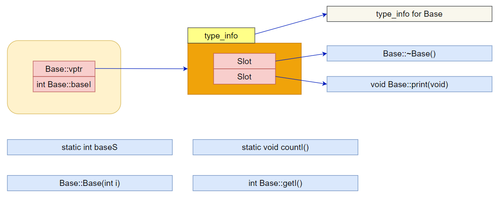

优缺点：

- 这个模型的优点在于它的空间和存取时间的效率
- 如果应用程序本身未改变，但当所使用的类的 non static 数据成员添加删除或修改时，需要重新编译

```
void test_base()
{
	Base b(1);

	std::cout << "对象的内存起始地址：" << &b << std::endl;
	std::cout << "sizeof(b):" << sizeof(b) << std::endl;

	std::cout << "type_info 信息:" << std::endl;
	RTTICompleteObjectLocator str = *((RTTICompleteObjectLocator*)*((int*)*(int*)&b - 1));	
	std::string classname(str.pTypeDescriptor->name);
	classname = classname.substr(4, classname.find("@@") - 4);
	std::cout << "根据type_info信息输出类名:" << classname << std::endl;

	std::cout << "虚函数表地址:" << (int *)(&b) << std::endl;
	//@ 验证虚表
	std::cout << "虚函数表第一个函数的地址：" << (int *)*((int*)(&b)) << std::endl;
	std::cout << "虚函数表中，第二个虚函数即 print（）的地址：" << ((int*)*(int*)(&b) + 1) << std::endl;

	//@ 通过地址调用虚函数print()
	typedef void(*Fun)(void);
	Fun IsPrint = (Fun)* ((int*)*(int*)(&b) + 1);
	std::cout << std::endl;
	std::cout << "调用了虚函数:";
	IsPrint(); //@ 若地址正确，则调用了Base类的虚函数print()
	std::cout << std::endl;

	//@ 输入static函数的地址
	b.countI(); //@ 先调用函数以产生一个实例
	std::cout << "static函数countI()的地址：" << b.countI << std::endl;

	//@ 验证nonstatic数据成员
	std::cout << "推测nonstatic数据成员baseI的地址：" << (int *)(&b) + 1 << std::endl;
	std::cout << "根据推测出的地址，输出该地址的值：" << *((int *)(&b) + 1) << std::endl;
	std::cout << "Base::getI():" << b.getI() << std::endl;
}
```

结论：

- 通过 `(int *)(&p)` 取得虚函数表的地址
- type_info 信息存在于虚表的前一个位置
- 虚函数表的第一个函数是析构函数，虚函数表的第二个函数是虚函数 print()
- 虚表指针的下一个位置为 nonstatic 数据成员 baseI
- static成员函数的地址段位与虚表指针、baseI 的地址段位不同

# 普通继承

## 单继承

```
class Derive : public Base
{
public:
	Derive(int d) :Base(1000), DeriveI(d) {};
	//@ overwrite父类虚函数
	virtual void print(void) { std::cout << "Drive::Drive_print()" << std::endl; }
	//@ Derive声明的新的虚函数
	virtual void Drive_print() { std::cout << "Drive::Drive_print()" << std::endl; }
	virtual ~Derive() { std::cout << "Derive::~Derive()" << std::endl; }
private:
	int DeriveI;
};
```


对象模型：

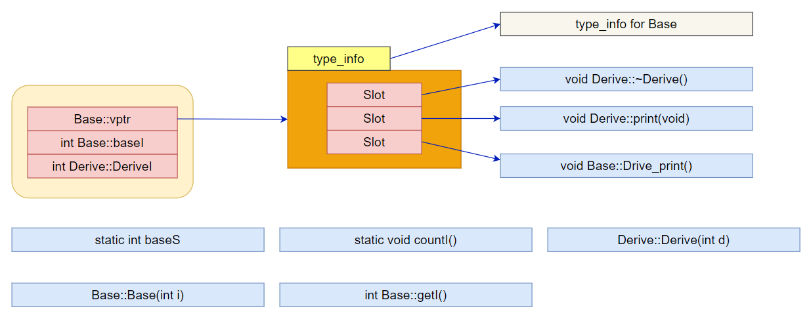

```
void test_simple_inherit()
{
	Derive d(6);

	std::cout << "对象的内存起始地址：" << &d << std::endl;
	std::cout << "sizeof(d):" << sizeof(d) << std::endl;

	std::cout << "type_info 信息:" << std::endl;
	RTTICompleteObjectLocator str = *((RTTICompleteObjectLocator*)*((int*)*(int*)&d - 1));
	std::string classname(str.pTypeDescriptor->name);
	classname = classname.substr(4, classname.find("@@") - 4);
	std::cout << "根据type_info信息输出类名:" << classname << std::endl;

	std::cout << "Base::vptr";
	std::cout << "\t地址：" << (int *)(&d) << std::endl;

	typedef void(*Fun)(void);

	std::cout << "  [1]";
	Fun fun1 = (Fun)*((int *)*((int *)(&d)) + 1);
	fun1();
	std::cout << "\t地址:\t" << *((int *)*((int *)(&d))) << std::endl;

	std::cout << "  [2]";
	Fun fun2 = (Fun)*((int *)*((int *)(&d)) + 2);
	fun2();
	std::cout << "\t地址:\t" << *((int *)*((int *)(&d)) + 2) << std::endl;

	std::cout << "Base::baseI=" << *(int*)((int *)(&d) + 1);
	std::cout << "\t地址：" << (int *)(&d) + 1;
	std::cout << std::endl;

	std::cout << "Derive::DeriveI=" << *(int*)((int *)(&d) + 2);
	std::cout << "\t地址：" << (int *)(&d) + 2;
	std::cout << std::endl;

	return;
}
```

结论：

- 单继承中（一般继承），子类会扩展父类的虚函数表
- 如果子类重写了父类的虚函数，将使用子类的虚函数替换虚函数表中的父类虚函数

## 多继承

```
class Base
{
public:
	Base(int i) :baseI(i) {};
	virtual ~Base() {}

	int getI() { return baseI; }
	static void countI() {};
	virtual void print(void) { std::cout << "Base::print()" << std::endl; }

private:
	int baseI;
	static int baseS;
};

class Base_2
{
public:
	Base_2(int i) :base2I(i) {};
	virtual ~Base_2() {}

	int getI() { return base2I; }
	static void countI() {};
	virtual void print(void) { std::cout << "Base_2::print()" << std::endl; }


private:
	int base2I;
	static int base2S;
};

class Drive_multyBase :public Base, public Base_2
{
public:
	Drive_multyBase(int d) :Base(1000), Base_2(2000), Drive_multyBaseI(d) {};

	virtual void print(void) { std::cout << "Drive_multyBase::print" << std::endl; }
	virtual void Drive_print() { std::cout << "Drive_multyBase::Drive_print" << std::endl; }

private:
	int Drive_multyBaseI;
};
```

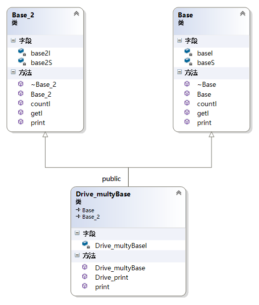

对象模型：

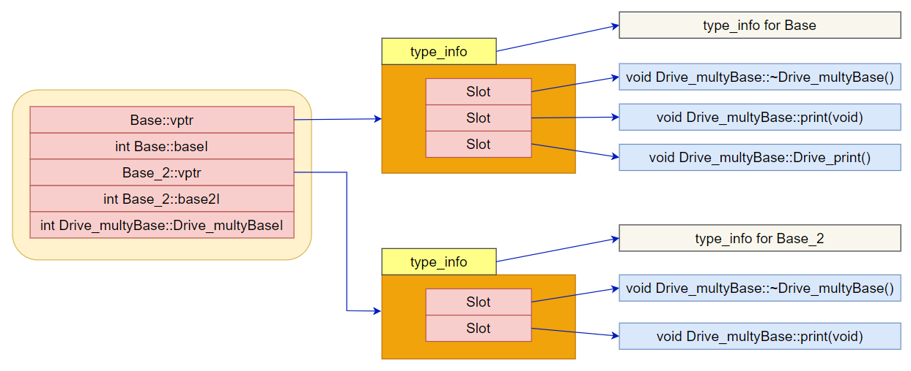

```
void test_multi_inherit()
{
	Drive_multyBase d(3000);

	std::cout << "对象的内存起始地址：" << &d << std::endl;
	std::cout << "sizeof(d):" << sizeof(d) << std::endl;

	std::cout << "type_info 信息:" << std::endl;
	RTTICompleteObjectLocator str = *((RTTICompleteObjectLocator*)*((int*)*(int*)&d - 1));
	std::string classname(str.pTypeDescriptor->name);
	classname = classname.substr(4, classname.find("@@") - 4);
	std::cout << "根据type_info信息输出类名:" << classname << std::endl;

	std::cout << "Base::vptr";
	std::cout << "\t地址：" << (int *)(&d) << std::endl;

	typedef void(*Fun)(void);

	std::cout << "  [1]";
	Fun fun1 = (Fun)*((int *)*((int *)(&d)) + 1);
	fun1();
	std::cout << "\t地址:\t" << *((int *)*((int *)(&d)) + 1) << std::endl;

	std::cout << "  [2]";
	Fun fun2 = (Fun)*((int *)*((int *)(&d)) + 2);
	fun2();
	std::cout << "\t地址:\t" << *((int *)*((int *)(&d)) + 2) << std::endl;
	std::cout << "[结束]地址:\t" << *((int *)*((int *)(&d)) + 3) << std::endl;

	std::cout << "Base::baseI=" << *(int*)((int *)(&d) + 1);
	std::cout << "\t地址：" << (int *)(&d) + 1;
	std::cout << std::endl;

	std::cout << "type_info 信息:" << std::endl;
	RTTICompleteObjectLocator str2 = *((RTTICompleteObjectLocator*)*((int*)(((int*)*((int *)(&d) + 2)) - 1)));
	std::string classname2(str2.pTypeDescriptor->name);
	classname2 = classname2.substr(4, classname2.find("@@") - 4);
	std::cout << "根据type_info信息输出类名:" << classname2 << std::endl;
			

	std::cout << "Base_2::vptr";
	std::cout << "\t地址：" << (int *)(&d) + 2 << std::endl;

	std::cout << "  [1]";
	Fun fun3 = (Fun)*((int*)(((int*)*((int *)(&d) + 2)) + 1));
	fun3();
	std::cout << "\t地址:\t" << *(int*)(((int*)*((int *)(&d) + 2)) + 1) << std::endl;
	std::cout << "[结束]地址:\t" << *(int*)(((int*)*((int *)(&d) + 2)) + 2) << std::endl;

	std::cout << "Base_2::base2I=" << *(int*)((int *)(&d) + 3);
	std::cout << "\t地址：" << (int *)(&d) + 3;
	std::cout << std::endl;

	std::cout << "Drive_multyBase::Drive_multyBaseI=" << *(int*)((int *)(&d) + 4);
	std::cout << "\t地址：" << (int *)(&d) + 4;
	std::cout << std::endl;

	return;
}
```

结论：

- 子类的虚函数被放在声明的第一个基类的虚函数表中
- overwrite时，所有基类的print()函数都被子类的 print() 函数覆盖
- 内存布局中，父类按照其声明顺序排列

## 菱形继承

菱形继承也称为钻石型继承或重复继承，它指的是基类被某个派生类简单重复继承了多次。这样，派生类对象中拥有多份基类实例。

```
class B
{
public:
	int ib;

public:
	B(int i = 1) :ib(i) {}
	virtual void f() { std::cout << "B::f()" << std::endl; }
	virtual void Bf() { std::cout << "B::Bf()" << std::endl; }
};

class B1 : public B
{
public:
	int ib1;

public:
	B1(int i = 100) :ib1(i) {}
	virtual void f() { std::cout << "B1::f()" << std::endl; }
	virtual void f1() { std::cout << "B1::f1()" << std::endl; }
	virtual void Bf1() { std::cout << "B1::Bf1()" << std::endl; }
};

class B2 : public B
{
public:
	int ib2;

public:
	B2(int i = 1000) :ib2(i) {}
	virtual void f() { std::cout << "B2::f()" << std::endl; }
	virtual void f2() { std::cout << "B2::f2()" << std::endl; }
	virtual void Bf2() { std::cout << "B2::Bf2()" << std::endl; }
};


class D : public B1, public B2
{
public:
	int id;

public:
	D(int i = 10000) :id(i) {}
	virtual void f() { std::cout << "D::f()" << std::endl; }
	virtual void f1() { std::cout << "D::f1()" << std::endl; }
	virtual void f2() { std::cout << "D::f2()" << std::endl; }
	virtual void Df() { std::cout << "D::Df()" << std::endl; }
};
```

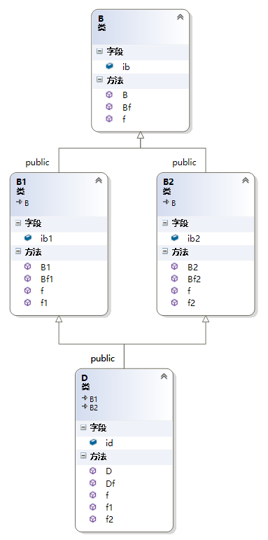

对象模型：

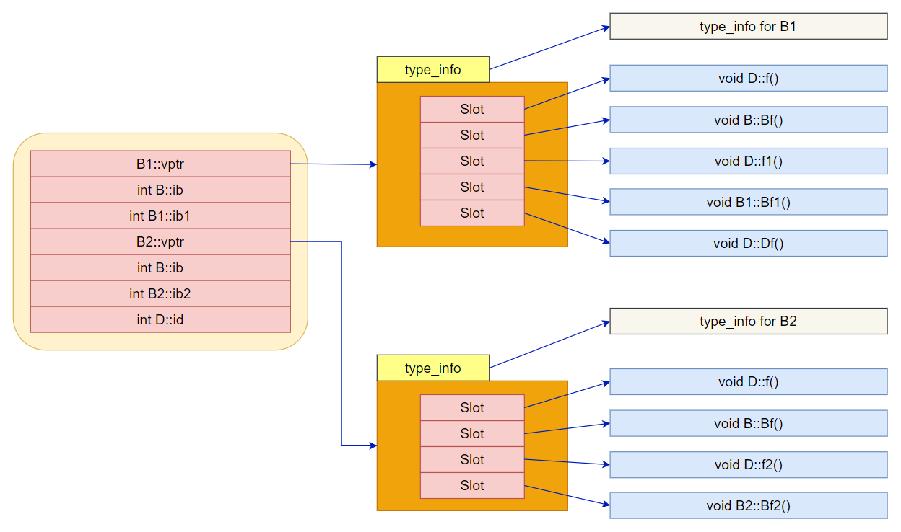

```
void test_diamods_inherit()
{
	D d(3000);

	std::cout << "对象的内存起始地址：" << &d << std::endl;
	std::cout << "sizeof(d):" << sizeof(d) << std::endl;

	std::cout << "type_info 信息:" << std::endl;
	RTTICompleteObjectLocator str = *((RTTICompleteObjectLocator*)*((int*)*(int*)&d - 1));
	std::string classname(str.pTypeDescriptor->name);
	classname = classname.substr(4, classname.find("@@") - 4);
	std::cout << "根据type_info信息输出类名:" << classname << std::endl;

	typedef void(*Fun)(void);

	std::cout << "Base::vptr";
	std::cout << "\t地址：" << (int *)(&d) << std::endl;

	std::cout << "  [0]";
	Fun fun0 = (Fun)*((int *)*((int *)(&d)) + 0);
	fun0();
	std::cout << "\t地址:\t" << *((int *)*((int *)(&d)) + 0) << std::endl;

	std::cout << "  [1]";
	Fun fun1 = (Fun)*((int *)*((int *)(&d)) + 1);
	fun1();
	std::cout << "\t地址:\t" << *((int *)*((int *)(&d)) + 1) << std::endl;

	std::cout << "  [2]";
	Fun fun2 = (Fun)*((int *)*((int *)(&d)) + 2);
	fun2();
	std::cout << "\t地址:\t" << *((int *)*((int *)(&d)) + 2) << std::endl;

	std::cout << "  [3]";
	Fun fun3 = (Fun)*((int *)*((int *)(&d)) + 3);
	fun3();
	std::cout << "\t地址:\t" << *((int *)*((int *)(&d)) + 3) << std::endl;

	std::cout << "  [4]";
	Fun fun4 = (Fun)*((int *)*((int *)(&d)) + 4);
	fun4();
	std::cout << "\t地址:\t" << *((int *)*((int *)(&d)) + 4) << std::endl;

	std::cout << "[结束]地址:\t" << *((int *)*((int *)(&d)) + 5) << std::endl;

	std::cout << "B::ib=" << *(int*)((int *)(&d) + 1);
	std::cout << "\t地址：" << (int *)(&d) + 1;
	std::cout << std::endl;

	std::cout << "B1::ib1=" << *(int*)((int *)(&d) + 2);
	std::cout << "\t地址：" << (int *)(&d) + 2;
	std::cout << std::endl;

	std::cout << "B2::vptr";
	std::cout << "\t地址：" << (int *)(&d) + 3<< std::endl;

	std::cout << "  [0]";
	Fun fun5 = (Fun)*((int *)*((int *)(&d) + 3) + 0);
	fun5();
	std::cout << "\t地址:\t" << *((int *)*((int *)(&d) + 3) + 0) << std::endl;

	std::cout << "  [1]";
	Fun fun6 = (Fun)*((int *)*((int *)(&d) + 3) + 1);
	fun6();
	std::cout << "\t地址:\t" << *((int *)*((int *)(&d) + 3) + 1) << std::endl;

	std::cout << "  [2]";
	Fun fun7 = (Fun)*((int *)*((int *)(&d) + 3) + 2);
	fun7();
	std::cout << "\t地址:\t" << *((int *)*((int *)(&d) + 3) + 2) << std::endl;

	std::cout << "  [3]";
	Fun fun8 = (Fun)*((int *)*((int *)(&d) + 3) + 3);
	fun8();
	std::cout << "\t地址:\t" << *((int *)*((int *)(&d) + 3) + 3) << std::endl;

	std::cout << "[结束]地址:\t" << *((int *)*((int *)(&d) + 3) + 4) << std::endl;

	std::cout << "B::ib=" << *(int*)((int *)(&d) + 4);
	std::cout << "\t地址：" << (int *)(&d) + 4;
	std::cout << std::endl;
	
	std::cout << "B2::ib2=" << *(int*)((int *)(&d) + 5);
	std::cout << "\t地址：" << (int *)(&d) + 5;
	std::cout << std::endl;

	std::cout << "D::id=" << *(int*)((int *)(&d) + 6);
	std::cout << "\t地址：" << (int *)(&d) + 6;
	std::cout << std::endl;
	
	return;
}
```

由于 D 类间接继承了 B 类两次，导致 D 类对象中含有两个B类的数据成员 ib，一个属于来源 B1 类，一个来源 B2 类。这样不仅增大了空间，更重要的是引起了程序歧义：

```
D d;
 
d.ib =1 ;               //二义性错误,调用的是B1的ib还是B2的ib？
 
d.B1::ib = 1;           //正确 
d.B2::ib = 1;           //正确
```

# 虚继承

虚继承解决了菱形继承中派生类拥有多个间接父类实例的情况。虚继承的派生类的内存布局与普通继承很多不同，主要体现在：

- 虚继承的子类，如果本身定义了新的虚函数，则编译器为其生成一个虚函数表指针（vptr）以及一张虚函数表。该 vptr 位于对象内存最前面。而非虚继承：直接扩展父类虚函数表
- 虚继承的子类也单独保留了父类的 vptr 与虚函数表。这部分内容接与子类内容以一个四字节的 0x00 来分界
- 虚继承的子类对象中，含有四字节的虚表指针偏移值

在 C++ 对象模型中，虚继承而来的子类会生成一个隐藏的虚基类指针（vbptr），在 Microsoft Visual C++ 中，虚基类表指针总是在虚函数表指针之后，因而，对某个类实例来说，如果它有虚基类指针，那么虚基类指针可能在实例的 0 字节偏移处（该类没有 vptr 时，vbptr 就处于类实例内存布局的最前面），也可能在类实例的 4 字节偏移处。

一个类的虚基类指针指向的虚基类表，与虚函数表一样，虚基类表也由多个条目组成，条目中存放的是偏移值。第一个条目存放虚基类表指针（vbptr）所在地址到该类内存首地址的偏移值，由第一段的分析我们知道，这个偏移值为 0（类没有 vptr）或者 -4（类有虚函数，此时有 vptr）。虚基类表的第二、第三...个条目依次为该类的最左虚继承父类、次左虚继承父类...的内存地址相对于虚基类表指针的偏移值。

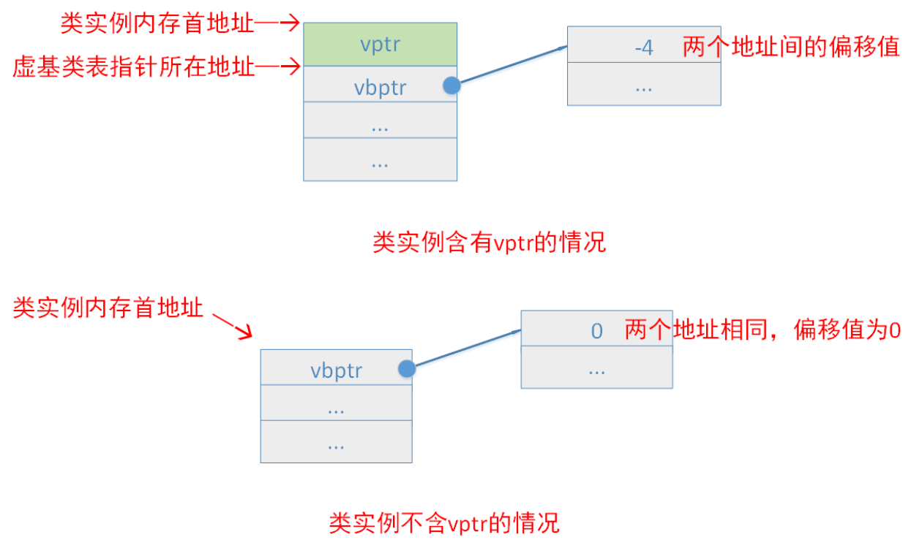

## 简单虚继承

```
class B
{
public:
	int ib;

public:
	B(int i = 1) :ib(i) {}
	virtual void f() { std::cout << "B::f()" << std::endl; }
	virtual void Bf() { std::cout << "B::Bf()" << std::endl; }
};

class B1 : public virtual B
{
public:
	int ib1;

public:
	B1(int i = 100) :ib1(i) {}
	virtual void f() { std::cout << "B1::f()" << std::endl; }
	virtual void f1() { std::cout << "B1::f1()" << std::endl; }
	virtual void Bf1() { std::cout << "B1::Bf1()" << std::endl; }
};
```

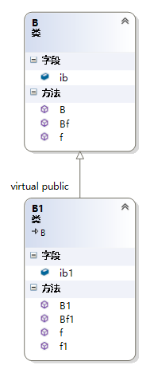

对象模型：

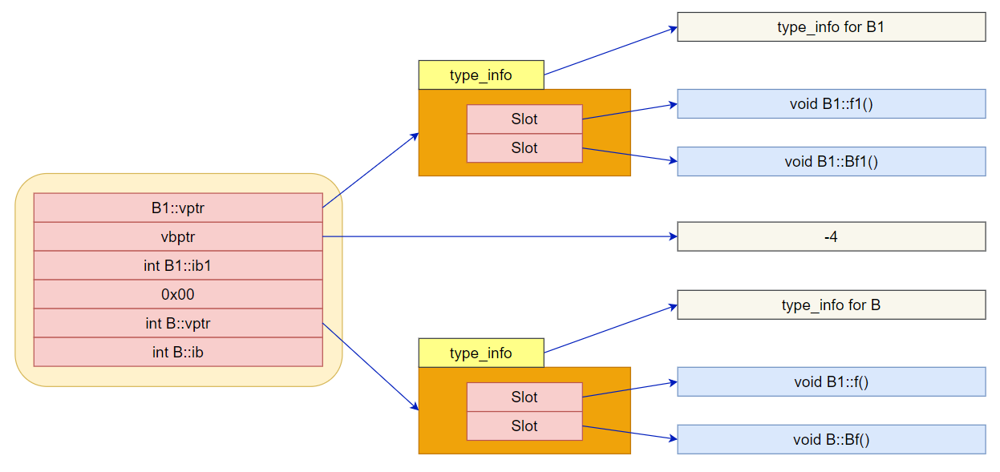

```
void test_simple_virtual_inherit()
{
	B1 b;
	std::cout << "对象的内存起始地址：" << &b << std::endl;
	std::cout << "sizeof(b):" << sizeof(b) << std::endl;

	typedef void(*Fun)(void);

	std::cout << "B1::vptr";
	std::cout << "\t地址：" << (int *)(&b) << std::endl;

	for (int i = 0; i < 2; ++i)
	{
		std::cout << "  [" << i << "]";
		Fun func = (Fun)*((int *)*(int *)(&b) + i);
		func();
		std::cout << "\t地址：\t" << *((int *)*(int *)(&b) + i) << std::endl;
	}
	std::cout << "[结束]地址:\t" << *((int *)*(int *)(&b) + 2) << std::endl;
		
	std::cout << "vbptr::offset=" << *(int*)*((int*)(&b) + 1);
	std::cout << "\tvbptr 地址：" << (int*)*((int*)(&b) + 1);
	std::cout << std::endl;

	std::cout << "B1::ib1=" << *(int*)((int *)(&b) + 2);
	std::cout << "\t地址：" << (int *)(&b) + 2;
	std::cout << std::endl;

	std::cout << "0x00值:" << *(int*)((int *)(&b) + 3);
	std::cout << "\t\t地址:" << (int *)(&b) + 3;
	std::cout << std::endl;

	std::cout << "B::vptr";
	std::cout << "\t地址：" << (int *)(&b) + 4 << std::endl;
	for (int i = 0; i < 2; ++i)
	{
		std::cout << "  [" << i << "]";
		Fun func = (Fun)*((int *)*((int *)(&b) + 4) + i);
		func();
		std::cout << "\t地址:\t" << *((int *)*((int *)(&b) + 4) + i) << std::endl;
	}

	std::cout << "B::ib=" << *(int*)((int *)(&b) + 5);
	std::cout << "\t地址: " << (int *)(&b) + 5;
	std::cout << std::endl;

	return;
}
```

## 菱形虚继承

```
class B
{
public:
	int ib;

public:
	B(int i = 1) :ib(i) {}
	virtual void f() { std::cout << "B::f()" << std::endl; }
	virtual void Bf() { std::cout << "B::Bf()" << std::endl; }
};

class B1 : public virtual B
{
public:
	int ib1;

public:
	B1(int i = 100) :ib1(i) {}
	virtual void f() { std::cout << "B1::f()" << std::endl; }
	virtual void f1() { std::cout << "B1::f1()" << std::endl; }
	virtual void Bf1() { std::cout << "B1::Bf1()" << std::endl; }
};

class B2 : public virtual B
{
public:
	int ib2;

public:
	B2(int i = 1000) :ib2(i) {}
	virtual void f() { std::cout << "B2::f()" << std::endl; }
	virtual void f2() { std::cout << "B2::f2()" << std::endl; }
	virtual void Bf2() { std::cout << "B2::Bf2()" << std::endl; }
};


class D : public B1, public B2
{
public:
	int id;

public:
	D(int i = 10000) :id(i) {}
	virtual void f() { std::cout << "D::f()" << std::endl; }
	virtual void f1() { std::cout << "D::f1()" << std::endl; }
	virtual void f2() { std::cout << "D::f2()" << std::endl; }
	virtual void Df() { std::cout << "D::Df()" << std::endl; }
};
```

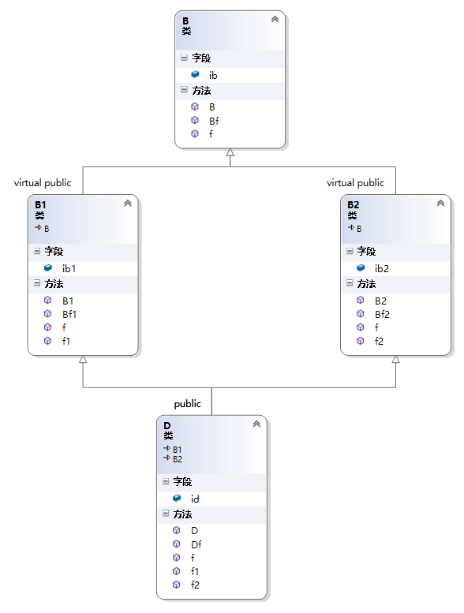

对象模型：

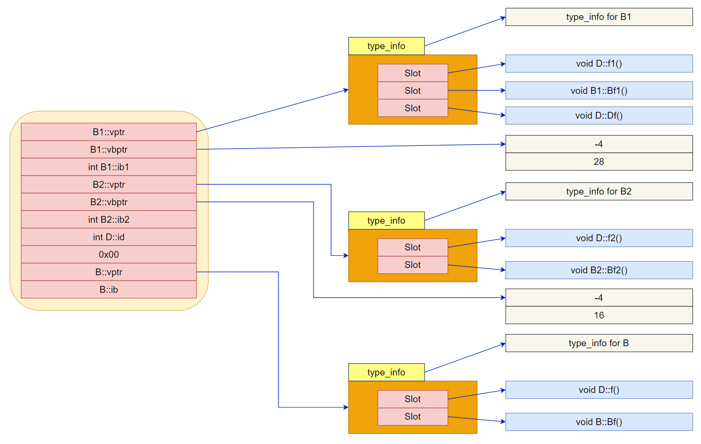

```
void test_diamonds_virtual_inherit()
{
	D d;
	std::cout << "对象的内存起始地址：" << &d << std::endl;
	std::cout << "sizeof(d):" << sizeof(d) << std::endl;

	typedef void(*Fun)(void);

	std::cout << "B1::vptr";
	std::cout << "\t地址：" << (int *)(&d) << std::endl;
	for (int i = 0; i < 3; ++i)
	{
		std::cout << "  [" << i << "]";
		Fun func = (Fun)*((int *)*(int *)(&d) + i);
		func();
		std::cout << "\t地址：\t" << *((int *)*(int *)(&d) + i) << std::endl;
	}

	std::cout << "B1::vbptr ";
	std::cout << "\t地址：" << (int *)(&d) + 1 << std::endl;  
	for (int i = 0; i < 2; i++)
	{
		std::cout << "  [" << i << "]";
		std::cout << *(int *)((int *)*((int *)(&d) + 1) + i);
		std::cout << std::endl;
	}

	std::cout << "B1::ib1=" << *(int*)((int *)(&d) + 2);
	std::cout << "\t地址：" << (int *)(&d) + 2;
	std::cout << std::endl;
	
	std::cout << "B2::vptr";
	std::cout << "\t地址：" << (int *)(&d) + 3 << std::endl;

	for (int i = 0; i<2; ++i)
	{
		std::cout << "  [" << i << "]";
		Fun fun1 = (Fun)*((int *)*((int *)(&d) + 3) + i);
		fun1();
		std::cout << "\t地址:\t" << *((int *)*((int *)(&d) + 3) + i) << std::endl;
	}

	std::cout << "B2::vbptr ";
	std::cout << "\t地址：" << (int *)(&d) + 4 << std::endl;  
	for (int i = 0; i < 2; i++)
	{
		std::cout << "  [" << i << "]";
		std::cout << *(int *)((int *)*((int *)(&d) + 4) + i);
		std::cout << std::endl;
	}

	std::cout << "B2::ib2=" << *(int*)((int *)(&d) + 5);
	std::cout << "\t地址: " << (int *)(&d) + 5;
	std::cout << std::endl;

	std::cout << "D::id=" << *(int*)((int *)(&d) + 6);
	std::cout << "\t地址: " << (int *)(&d) + 6;
	std::cout << std::endl;

	std::cout << "值=" << *(int*)((int *)(&d) + 7);
	std::cout << "\t\t地址：" << (int *)(&d) + 7;
	std::cout << std::endl;

	std::cout << "B::vptr";
	std::cout << "\t地址：" << (int *)(&d) + 8 << std::endl;

	for (int i = 0; i<2; ++i)
	{
		std::cout << "  [" << i << "]";
		Fun fun1 = (Fun)*((int *)*((int *)(&d) + 8) + i);
		fun1();
		std::cout << "\t地址:\t" << *((int *)*((int *)(&d) + 8) + i) << std::endl;
	}

	std::cout << "B::id=" << *(int*)((int *)(&d) + 9);
	std::cout << "\t地址: " << (int *)(&d) + 9;
	std::cout << std::endl;
	return;
}
```

# type_info 头文件

```
typedef unsigned long DWORD;

struct TypeDescriptor
{
	DWORD ptrToVTable;
	DWORD spare;
	char name[8];
};
struct PMD
{
	int mdisp;  //@ member displacement
	int pdisp;  //@ vbtable displacement
	int vdisp;  //@ displacement inside vbtable
};
struct RTTIBaseClassDescriptor
{
	struct TypeDescriptor* pTypeDescriptor; //@ type descriptor of the class
	DWORD numContainedBases; //@ number of nested classes following in the Base Class Array
	struct PMD where;        //@ pointer-to-member displacement info
	DWORD attributes;        //@ flags, usually 0
};

struct RTTIClassHierarchyDescriptor
{
	DWORD signature;      //@ always zero?
	DWORD attributes;     //@ bit 0 set = multiple inheritance, bit 1 set = virtual inheritance
	DWORD numBaseClasses; //@ number of classes in pBaseClassArray
	struct RTTIBaseClassArray* pBaseClassArray;
};

struct RTTICompleteObjectLocator
{
	DWORD signature; //@ always zero ?
	DWORD offset;    //@ offset of this vtable in the complete class
	DWORD cdOffset;  //@ constructor displacement offset
	struct TypeDescriptor* pTypeDescriptor; //@ TypeDescriptor of the complete class
	struct RTTIClassHierarchyDescriptor* pClassDescriptor; //@ describes inheritance hierarchy
};
```

# 类的大小

```
class B {};
class B1 :public virtual  B {};
class B2 :public virtual  B {};
class D : public B1, public B2 {};

int main()
{
	B b;
	B1 b1;
	B2 b2;
	D d;
	std::cout << "sizeof(b)=" << sizeof(b) << std::endl;  //@ 1 Bytes
	std::cout << "sizeof(b1)=" << sizeof(b1) << std::endl;  //@ 4 Bytes
	std::cout << "sizeof(b2)=" << sizeof(b2) << std::endl;  //@ 4 Bytes
	std::cout << "sizeof(d)=" << sizeof(d) << std::endl;  //@ 8 Bytes
	
	return 0;
}
```

- 编译器为空类安插 1 字节的 char，以使该类对象在内存得以配置一个地址
- b1 虚继承于 b，编译器为其安插一个4字节的虚基类表指针（32为机器），此时 b1 已不为空，编译器不再为其安插 1 字节的 char，b2 同理
- d 含有来自 b1 与 b2 两个父类的两个虚基类表指针，大小为 8 字节

# 多态的实现

## 静态绑定与动态绑定

将源代码中的函数调用解析为执行特定的函数代码块被称为函数名绑定（binding，又称联编）。译器可以在编译过程中完成这种绑定，这称为静态绑定（static binding），又称为早绑定（early binding）。

然而虚函数是这项工作变得更加困难。使用哪一个函数不是能在编译阶段时确定的，因为编译器不知道用户将选择哪种类型。所以，编译器必须能够在程序运行时选择正确的虚函数的代码，这被称为动态绑定（dynamic binding），又称为晚绑定（late binding）。

使用虚函数是有代价的，在内存和执行速度方面是有一定成本的，包括：

- 每个对象都将增大，增大量为存储虚函数表指针的大小
- 对于每个类，编译器都创建一个虚函数地址表
- 对于每个函数调用，都需要执行一项额外的操作，即到虚函数表中查找地址

## 多态的实现

多态（Polymorphisn）在C++中是通过虚函数实现的。如果类中有虚函数，编译器就会自动生成一个虚函数表，对象中包含一个指向虚函数表的指针。能够实现多态的关键在于：虚函数是允许被派生类重写的，在虚函数表中，派生类函数对覆盖基类函数。除此之外，还必须通过指针或引用调用方法才行，将派生类对象赋给基类对象。

## 析构函数设为虚函数

析构函数应当都是虚函数，除非明确该类不做基类（不被其他类继承）。基类的析构函数声明为虚函数，这样做是为了确保释放派生对象时，按照正确的顺序调用析构函数。如果析构函数不定义为虚函数，那么派生类就不会重写基类的析构函数，在有多态行为的时候，派生类的析构函数不会被调用到（有内存泄漏的风险！）。

```
class Base
{
public:
	Base() { std::cout << "Base::Base" << std::endl; }
	~Base() { std::cout << "Base::~Base" << std::endl; }
};

class Derived : public Base
{
public:
	Derived() { std::cout << "Derived::Derived" << std::endl; }
	~Derived() { std::cout << "Derived::~Base" << std::endl; }
};

int main()
{
	Base* p = new Derived();
	delete p;  //@ 不会调用派生类的析构函数

	return 0;
}
```


