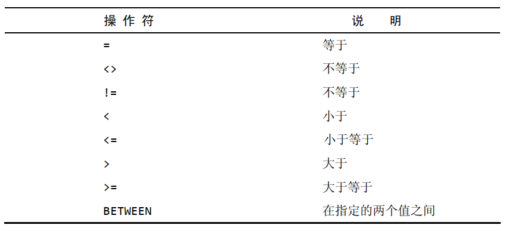
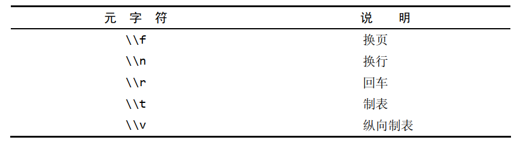
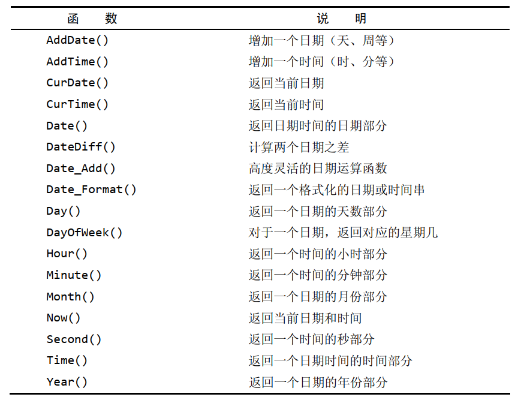
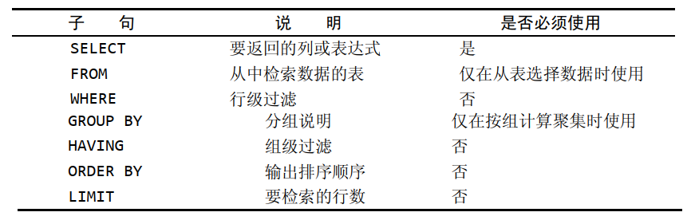
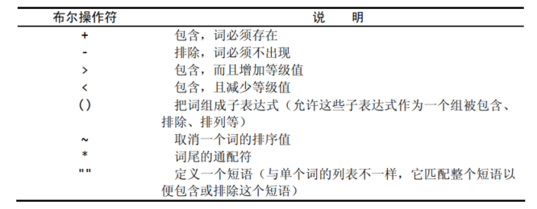
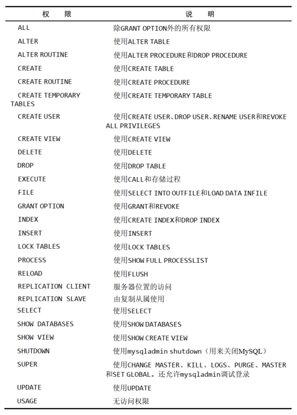
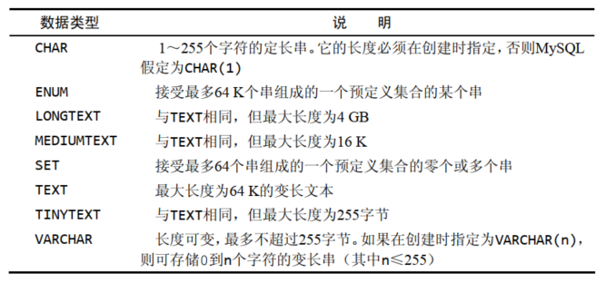
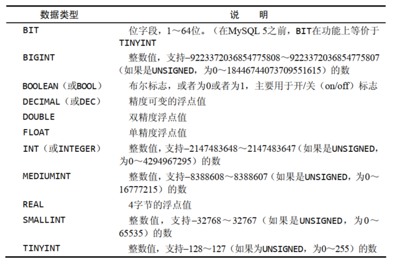
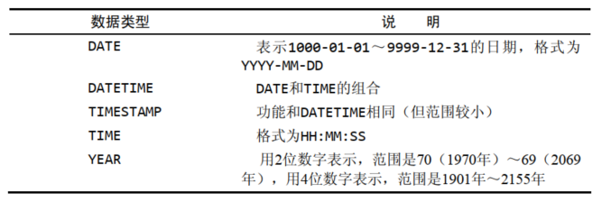
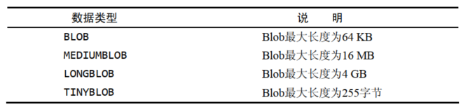

# 了解SQL  

- 数据库（database） 保存有组织的数据的容器（通常是一个文件或一组文件）
- 表（table） 某种特定类型数据的结构化清单  
- 模式（schema） 关于数据库和表的布局及特性的信息  
- 列（column） 表中的一个字段。所有表都是由一个或多个列组成的
- 数据类型（datatype） 所容许的数据的类型。每个表列都有相应的数据类型，它限制（或容许）该列中存储的数据   
- 行（row） 表中的一个记录  
- 主键（primary key）一列（或一组列），其值能够唯一区分表中每个行   
  - 任意两行都不具有相同的主键值  
  - 每个行都必须具有一个主键值（主键列不允许NULL值）  

SQL 是结构化查询语言（Structured Query Language）的缩写。 SQL是一种专门用来与数据库通信的语言。  

# 使用MySQL  

选择数据库：

```
USE <数据库名称>
```

查看可用数据库的一个列表：

```
SHOW DATABASE;
```

获得一个数据库内的表的列表：

```
SHOW TABLES;
```

显示表列：

```
SHOW COLUMNS FROM <表名称>;
DESCRIBE <表名称>;
```

显示服务器错误或警告消息：

```
SHOW ERRORS;
SHOW WARNINGS;
```

# 检索数据

检索单个列：

```
SELECT <列名称> FROM <表名称>;
```

检索多个列：

```
SELECT <列名称1>,<列名称2>,<列名称3>,... FROM <表名称>;
```

检索所有列：

```
SELECT * FROM <表名称>;
```

**一般，除非你确实需要表中的每个列，否则最好别使用*通配符。虽然使用通配符可能会使你自己省事，不用明确列出所需列，但检索不需要的列通常会降低检索和应用程序的性能。**  

检索不同的行：

```
SELECT DISTINCT <列名称> FROM <表名称>;
```

**不能部分使用DISTINCT DISTINCT关键字应用于所有列而不仅是前置它的列。如果给出SELECT DISTINCT column1,column2，除非指定的两个列都不同，否则所有行都将被检索出来。    **

限制结果：

```
SELECT <列名称> FROM <表名称> LIMIT <限制行数>;
```

返回不超过"限制数量"的行数。

```
SELECT <列名称> FROM <表名称> LIMIT <偏移行数>,<限制行数>;
SELECT <列名称> FROM <表名称> LIMIT <限制行数> OFFSET <偏移行数>;
```

**LIMIT中指定要检索的行数为检索的最大行数。如果没有足够的行， MySQL将只返回它能返回的那么多行。**

使用完全限定的表名：

```
SELECT <表名称>.<列名称> FROM <表名称>;
SELECT <表名称>.<列名称> FROM <库名称>.<表名称>;
```

# 排序检索数据

**关系数据库设计理论认为，如果不明确规定排序顺序，则不应该假定检索出的数据的顺序有意义。  **

```
SELECT <查询列名称> FROM <表名称> ORDER BY <排序列名称>;
```

按多个列排序：

```
SELECT <查询列名称> FROM <表名称> ORDER BY <排序列名称1>,<排序列名称2>;
```

**排序完全按所规定的顺序进行。**

指定排序方向：

降序排列使用 DESC，升序排列使用 ASC，默认是升序排列。

```
SELECT <查询列名称> FROM <表名称> ORDER BY <排序列名称> DESC;
```

多个列排序：

```
SELECT <查询列名称> FROM <表名称> ORDER BY <排序列名称1> <序列形式>,<排序列名称2> <序列形式>;
```

如果是升序上面的"序列形式"可以省略，但是如果是降序则必须指明。

# 过滤数据

```
SELECT <列名称> FROM <表名称> WHERE <条件>;
```

WHERE子句操作符：



**MySQL在执行匹配时默认不区分大小写。**

范围值检查：

```
SELECT <列名称> FROM <表名称> WHERE <条件列名称> BETWEEN <value_samll> AND <value_big>;
```

**在使用BETWEEN时，必须指定两个值即所需范围的低端值和高端值。这两个值必须用AND关键字分隔。 BETWEEN匹配范围中所有的值，包括指定的开始值和结束值。**  

检查具有NULL值的列：

````
SELECT <列名称> FROM <表名称> WHERE <条件列名称> IS NULL;
````

**NULL 无值（no value），它与字段包含0、空字符串或仅仅包含空格不同。**  

**操作符（operator） 用来联结或改变WHERE子句中的子句的关键字。也称为逻辑操作符（ logical operator） 。 ** 

AND操作符：

```
SELECT <列名称> FROM <表名称> WHERE <条件1> AND <条件2>;
```

OR操作符：

```
SELECT <列名称> FROM <表名称> WHERE <条件1> OR <条件2>;
```

IN操作符：

```
SELECT <列名称> FROM <表名称> WHERE <列名称> IN (value1,value2,...);
```

**IN操作符用来指定条件范围，范围中的每个条件都可以进行匹配。 IN取合法值的由逗号分隔的清单，全都括在圆括号中。**

- IN操作符一般比OR操作符清单执行更快  
- 在使用长的合法选项清单时， IN操作符的语法更清楚且更直观  
- 在使用IN时，计算的次序更容易管理（因为使用的操作符更少）  
- IN的最大优点是可以包含其他SELECT语句，使得能够更动态地建立WHERE子句  

NOT操作符：

```
SELECT <列名称> FROM <表名称> WHERE NOT <条件>;
```

**WHERE子句中的NOT操作符有且只有一个功能，那就是否定它之后所跟的任何条件。**  

# 用通配符进行过滤  

LIKE操作符：

- 通配符（wildcard） 用来匹配值的一部分的特殊字符
  - 不要过度使用通配符。如果其他操作符能达到相同的目的，应该使用其他操作符
  - 在确实需要使用通配符时，除非绝对有必要，否则不要把它们用在搜索模式的开始处。把通配符置于搜索模式的开始处，搜索起来是最慢的  
  - 仔细注意通配符的位置。如果放错地方，可能不会返回想要的数据  
- 搜索模式（search pattern）由字面值、通配符或两者组合构成的搜索条件

百分号（ %）通配符：

```
SELECT <列名称> FROM <表名称> WHERE LIKE <"prefix%suffix">;
```

**%表示任何字符出现任意次数。**

**根据MySQL的配置方式，搜索可以是区分大小写的。  **

下划线 （ _）通配符：

```
SELECT <列名称> FROM <表名称> WHERE LIKE <"prefix_suffix">;
```

**下划线总是匹配一个字符，不能多也不能少  。  **

MySQL中的匹配不区分大小写。为区分大小写，可使用BINARY关键字：

```
SELECT <列名称>  FROM <表名称> WHERE <表名称> LIKE BINARY <表达式>;
```


# 使用MySQL正则表达式  

基本字符匹配：

```
SELECT <列名称>  FROM <表名称> WHERE <表名称> REGEXP <'正则表达式'>;
```

进行OR匹配：

```
SELECT <列名称>  FROM <表名称> WHERE <表名称> REGEXP <'表达式1 | 表达式2 | 表达式3...''>;
```

匹配几个字符之一：

```
SELECT <列名称>  FROM <表名称> WHERE <表名称> REGEXP <'[字符集]'>;
```

匹配范围：

```
SELECT <列名称>  FROM <表名称> WHERE <表名称> REGEXP <'[a-z0-9]'>;
```

匹配特殊字符：

```
SELECT <列名称>  FROM <表名称> WHERE <表名称> REGEXP <'\\特殊字符'>;
```

空白元字符：



匹配字符类：


匹配多个实例：


定位符：


**"^"有两种用法。在集合中用它来否定该集合，否则，用来指串的开始处。**

**LIKE 和 REGEXP 的不同在于， LIKE匹配整个串而REGEXP匹配子串。**  

# 创建计算字段  

字段（field） 基本上与列（ column） 的意思相同，经常互换使用，不过数据库列一般称为列，而术语字段通常用在计算字段的连接上。  

拼接（concatenate） 将值联结到一起构成单个值。  

拼接字段：

```
SELECT CONCAT(<字段1>,<字段2>,<字段3>,...) FROM <表名称>;
```

使用别名：

```
SELECT CONCAT(<字段1>,<字段2>,<字段3>,...) AS <别名> FROM <表名称>;
```

执行算术计算：


# 使用数据处理函数  

大多数SQL实现支持以下类型的函数：

- 用于处理文本串的文本函数  
- 用于在数值数据上进行算术操作的数值函数  
- 用于处理日期和时间值并从这些值中提取特定成分的日期和时间函数  
- 返回DBMS正使用的特殊信息（如返回用户登录信息，检查版本细节）的系统函数  

文本处理函数：


日期和时间处理函数：



数值处理函数：


# 汇总函数

聚集函数（ aggregate function） 运行在行组上，计算和返回单个值的函数。

  

AVG()函数：

AVG()通过对表中行数计数并计算特定列值之和，求得该列的平均值。

```
SELECT AVG(<列名称>) AS <别名> FROM <表名称>;
```

**AVG()函数忽略列值为NULL的行。  **

COUNT()函数：

COUNT()函数进行计数。 可利用COUNT()确定表中行的数目或符合特定条件的行的数目：

-  使用COUNT(*)对表中行的数目进行计数， 不管表列中包含的是空值（ NULL）还是非空值
- 使用COUNT(column)对特定列中具有值的行进行计数，忽略NULL值    

```
SELECT COUNT(*) AS <别名> FROM <表名称>;
```

MAX()函数：

MAX()返回指定列中的最大值。 MAX()要求指定列名。

```
SELECT MAX(<列名称>) AS <别名> FROM <表名称>;
```

 **MAX()函数忽略列值为NULL的行。 **

MIN()函数：

MIN()的功能正好与MAX()功能相反，它返回指定列的最小值。与MAX()一样， MIN()要求指定列名。

```
SELECT MIN(<列名称>) AS <别名> FROM <表名称>;
```

 **MIN()函数忽略列值为NULL的行。 **

SUM()函数：

SUM()用来返回指定列值的和（总计）。  

```
SELECT SUM(<列名称>) AS <别名> FROM <表名称>;
```

 **MIN()函数忽略列值为NULL的行。 **

以上5个聚集函数都可以如下使用：  

- 对所有的行执行计算，指定ALL参数或不给参数（因为ALL是默认行为）
- 只包含不同的值，指定DISTINCT参数    

聚集不同值：

```
SELECT <聚集函数>(<DISTINCT 列名称>) AS <别名> FROM <表名称>;
```

**DISTINCT 不能用于COUNT(*)，因此不允许使用COUNT（ DISTINCT），否则会产生错误。**

组合聚集函数：

```
SELECT <聚集函数1>(<列名称1>) AS <别名1>, 
	   <聚集函数2>(<列名称2>) AS <别名2>, 
	   <聚集函数3>(<列名称3>) AS <别名3>，
	   ...
FROM <表名称>;
```

# 分组数据

创建分组：

```
SELECT <列名称>,COUNT(*) AS <别名> FROM <表名称> GROUP BY <列名称>;
```

GROUP BY 子句的一些规定：

- GROUP BY 子句可以包含任意数目的列。这使得能对分组进行嵌套，为数据分组提供更细致的控制
- 如果在 GROUP BY 子句中嵌套了分组，数据将在最后规定的分组上进行汇总
- GROUP BY 子句中列出的每个列都必须是检索列或有效的表达式（但不能是聚集函数）。如果在 SELECT 中使用表达式，则必须在 GROUP BY 子句中指定相同的表达式，不能使用别名
- 除聚集计算语句外， SELECT 语句中的每个列都必须在 GROUP BY 子句中给出
- 如果分组列中具有NULL值，则NULL将作为一个分组返回。如果列中有多行NULL值，它们将分为一组
- GROUP BY 子句必须出现在 WHERE 子句之后， ORDER BY 子句之前         

使用 WITH ROLLUP 关键字，可以得到每个分组以及每个分组汇总级别（针对每个分组）的值。

过滤分组：

HAVING 非常类似于 WHERE。事实上，目前为止所学过的所有类型的 WHERE 子句都可以用 HAVING 来替代。唯一的差别是 WHERE 过滤行，而 HAVING 过滤分组。  

分组和排序：


SELECT子句顺序：



# 使用子查询  

子查询（ subquery）即嵌套在其他查询中的查询。子查询总是从内向外处理。    

```
SELECT <列名称> FROM <表名称> WHERE <查询列名称> IN(SELECT <查询列名称> FROM <表名称> <条件>);
```

- 在WHERE子句中使用子查询，应该保证SELECT语句具有与WHERE子句中相同数目的列。通常，子查询将返回单个列并且与单个列匹配，但如果需要也可以使用多个列
- 虽然子查询一般与IN操作符结合使用，但也可以用于测试等于（=）、不等于（<>）等  

作为计算字段使用子查询：

使用子查询的另一方法是创建计算字段。  

```
SELECT <列名称>,<列名称>,(SELECT COUNT(*) FROM <表名称1> WHERE <表名称1>.<列名称> = <表名称2>.<列名称>) AS <别名> FROM <表名称2> ORDER BY <列名称>;
```

# 联结  

外键（foreign key） 外键为某个表中的一列，它包含另一个表的主键值，定义了两个表之间的关系。  

创建联结：

```
SELECT <表名称1>.<列名称1> ,<表名称2>.<列名称2>  FROM <表名称1>,<表名称2> <条件>;
```

笛卡儿积（cartesian product） 由没有联结条件的表关系返回的结果为笛卡儿积。检索出的行的数目将是第一个表中的行数乘以第二个表中的行数。  

内部联结：

等值联结（equijoin）基于两个表之间的相等测试。这种联结也称为内部联结。  

```
SELECT <表名称1>.<列名称1>,<表名称2>.<列名称2> FROM <表名称1> INNER JOIN <表名称2> ON <条件>;
```

**两个表之间的关系是FROM子句的组成部分，以INNERJOIN指定。在使用这种语法时，联结条件用特定的ON子句而不是WHERE子句给出。传递给ON的实际条件与传递给WHERE的相同。**  

**ANSI SQL规范首选INNER JOIN语法。此外，尽管使用WHERE子句定义联结的确比较简单，但是使用明确的联结语法能够确保不会忘记联结条件，有时候这样做也能影响性能。** 

# 联结多个表  

SQL对一条SELECT语句中可以联结的表的数目没有限制。创建联结的基本规则也相同。首先列出所有表，然后定义表之间的关系。  

```
SELECT <表名称1>.<列名称1>,<表名称2>.<列名称2>，<表名称3>.<列名称3> FROM <表名称1>,<表名称2>,<表名称3> WHERE <条件1> AND <条件2> AND...;
```

**MySQL在运行时关联指定的每个表以处理联结。这种处理可能是非常耗费资源的，因此应该仔细，不要联结不必要的表。联结的表越多，性能下降越厉害。**  

# 创建高级联结  

使用表别名：

```
SELECT <列名称1>,<列名称2>,<列名称3>... FROM <表名称1> AS <别名1>,<表名称2> AS <别名2>,<表名称3> AS <别名3> WHERE <条件>;
```

**表别名不仅能用于WHERE子句，它还可以用于SELECT的列表、 ORDER BY子句以及语句的其他部分。**

自联结：

```
SELECT <别名1>.<列名称1>,<别名2>.<列名称2> FROM <表名称> AS <别名1>,<表名称> AS <别名2> <条件>;
```

此查询中需要的两个表实际上是相同的表，但是引用具有二义性，为解决此问题，使用了表别名。  

使用子查询可以达到同样的目的：

```
SELECT <列名称1>,<列名称2>,<列名称3>... FROM <表名称> WHERE <列名称> = (SELECT <列名称> FROM <表名称> <条件>);
```

**自联结通常作为外部语句用来替代从相同表中检索数据时使用的子查询语句。虽然最终的结果是相同的，但有时候处理联结远比处理子查询快得多。应该试一
下两种方法，以确定哪一种的性能更好。**

自然联结：

无论何时对表进行联结，应该至少有一个列出现在不止一个表中（被联结的列）。  标准的联结（前一章中介绍的内部联结）返回所有数据，甚至相同的列多次出现。 自然联结排除多次出现，使每个列只返回一次。  

```
SELECT <别名1>.*,<别名2>.<列名称>,<别名3>.<列名称> FROM <表名称1> AS <别名1>,<表名称2> AS <别名2>,<表名称3> AS <别名3> WHERE <条件>;
```

外部联结：

联结包含了那些在相关表中没有关联行的行。这种类型的联结称为外部联结。  

```
SELECT <表名称1>.<列名称1>,<表名称2>.<列名称2> FROM <表名称1> LEFT/RIGHT OUTER JOIN <表名称2> ON <条件>;
```

**与内部联结关联两个表中的行不同的是，外部联结还包括没有关联行的行。在使用OUTER JOIN语法时，必须使用RIGHT或LEFT关键字指定包括其所有行的表（ RIGHT指出的是OUTER JOIN右边的表，而LEFT指出的是OUTER JOIN左边的表）。**   

使用带聚集函数的联结：

```
SELECT <表名称1>.<列名称1>,<表名称2>.<列名称2> ,COUNT(<表名称2>.<列名称3>) AS <表名称1> FROM <表名称2> LEFT OUTER JOIN <条件>;
```

# 组合查询  

MySQL也允许执行多个查询（多条SELECT语句），并将结果作为单个查询结果集返回。这些组合查询通常称为并（ union） 或复合查询（compound query）。  

有两种基本情况，其中需要使用组合查询：  

- 在单个查询中从不同的表返回类似结构的数据  
- 对单个表执行多个查询，按单个查询返回数据  

可用UNION操作符来组合数条SQL查询。利用UNION，可给出多条SELECT语句，将它们的结果组合成单个结果集。    

```
SELECT <列名称1>,<列名称2>,<列名称3> FROM <表名称> WHERE <条件1> UNION SELECT <列名称1>,<列名称2>,<列名称3> FROM <表名称> WHERE <条件2>;
```

- UNION必须由两条或两条以上的SELECT语句组成，语句之间用关键字UNION分隔  
- UNION中的每个查询必须包含相同的列、表达式或聚集函数（不过各个列不需要以相同的次序列出）    
- 列数据类型必须兼容：类型不必完全相同，但必须是DBMS可以隐含地转换的类型（例如，不同的数值类型或不同的日期类型）  

UNION从查询结果集中自动去除了重复的行。这是UNION的默认行为，但是如果需要，可以改变它。事实上，如果想返回所有匹配行，可使用UNION ALL而不是UNION。  

对组合查询结果排序：

在用UNION组合查询时，只能使用一条ORDER BY子句，它必须出现在最后一条SELECT语句之后。对于结果集，不存在用一种方式排序一部分，而又用另一种方式排序另一部分的情况，因此不允许使用多条ORDER BY子句。  

# 全文本搜索

搜索机制存在几个重要的限制：

- 性能——通配符和正则表达式匹配通常要求MySQL尝试匹配表中所有行（而且这些搜索极少使用表索引）。因此，由于被搜索行数不断增加，这些搜索可能非常耗时
- 明确控制——使用通配符和正则表达式匹配，很难（而且并不总是能）明确地控制匹配什么和不匹配什么
- 智能化的结果——虽然基于通配符和正则表达式的搜索提供了非常灵活的搜索，但它们都不能提供一种智能化的选择结果的方法   

为了进行全文本搜索，必须索引被搜索的列，而且要随着数据的改变不断地重新索引。在对表列进行适当设计后， MySQL会自动进行所有的索引和重新索引。  

```
CREATE TABLE productnotes
    (
		note_id int  NOT NULL AUTO_INCREMENT,
		prod_id char(10)  NOT NULL,
		note_date datetime NOT NULL,
		note_text text NULL ,
		PRIMARY KEY(note_id),
		FULLTEXT(note_text)
    )
    ENGINE=MyISAM;
```

为了进行全文本搜索，MySQL根据子句FULLTEXT(note_text)的指示对它进行索引。这里的FULLTEXT索引单个列，如果需要也可以指定多个列。  

在定义之后， MySQL自动维护该索引。在增加、更新或删除行时，索引随之自动更新。 

更新索引要花时间，虽然不是很多，但毕竟要花时间。如果正在导入数据到一个新表，此时不应该启用FULLTEXT索引。应该首先导入所有数据，然后再修改表， 定义FULLTEXT。  

进行全文本搜索：

在索引之后，使用两个函数Match()和Against()执行全文本搜索，其中Match()指定被搜索的列， Against()指定要使用的搜索表达式。  

```
SELECT note_text FROM productnotes WHERE MATCH(note_text) AGAINST('rabbit');
```

**传递给 Match() 的 值必须与FULLTEXT()定义中的相同。如果指定多个列，则必须列出它们（而且次序正确）。**  

**除非使用BINARY方式，否则全文本搜索不区分大小写。**  

上面的搜索等价于：

```
SELECT note_text FROM productnotes WHERE note_text LIKE '%rabbit%';
```

全文本搜索的一个重要部分就是对结果排序。具有较高等级的行先返回：

```
SELECT note_text, MATCH(note_text) AGAINST('rabbit') AS rank_rabbit FROM productnotes;
```

使用查询扩展：

查询扩展用来设法放宽所返回的全文本搜索结果的范围。  

```
SELECT note_text FROM productnotes WHERE MATCH(note_text) AGAINST('dog' WITH QUERY EXPANSION);
```

布尔文本搜索：

MySQL支持全文本搜索的另外一种形式，称为布尔方式（boolean mode）：

- 要匹配的词
- 要排斥的词（如果某行包含这个词，则不返回该行，即使它包含其他指定的词也是如此）
- 排列提示（指定某些词比其他词更重要，更重要的词等级更高）
- 表达式分组
- 另外一些内容 
- 即使没有定义FULLTEXT索引，也可以使用它。但这是一种非常缓慢的操作   

```
SELECT note_text FROM productnotes WHERE MATCH(note_text) AGAINST('rabbit' IN BOOLEAN MODE);
```

为了匹配包含rabbit但不包含任意以little开始的词的行， 可使用以下查询：  

```
SELECT note_text FROM productnotes WHERE MATCH(note_text) AGAINST('rabbit -little*' IN BOOLEAN MODE);
```

全文本布尔操作符：



 # 数据插入  

插入完整的行：

```
INSERT INTO <表名称> VALUES(<列值1>,<列值2>,<列值3>...);
```

- 如果某个列没有值，应该使用NULL值
- 各个列必须以它们在表定义中出现的次序填充  
- 虽然这种语法很简单，但并不安全，应该尽量避免使用  

```
INSERT INTO <表名称>(<列名称1>,<列名称2>,<列名称3>...) VALUES(<列值1>,<列值2>,<列值3>...);
```

- 在表名后的括号里明确地给出了列名。在插入行时， MySQL将用VALUES列表中的相应值填入列表中的对应项。 VALUES中的第一个值对应于第一个指定的列名。第二个值对应于第二个列名，如此等等
- 其优点是，即使表的结构改变，此INSERT语句仍然能正确工作

如果表的定义允许，则可以在INSERT操作中省略某些列。省略的列必须满足以下某个条件：

- 该列定义为允许NULL值（无值或空值）  
- 在表定义中给出默认值。这表示如果不给出值，将使用默认值  

如果数据检索是最重要的（通常是这样），则你可以通过在INSERT和INTO之间添加关键字LOW_PRIORITY，指示MySQL降低INSERT语句的优先级：

```
INSERT LOW_PRORITY INTO  
```

 插入多个行：

```
INSERT INTO <表名称>(<列名称1>,<列名称2>,<列名称3>...) VALUES(<列值1>,<列值2>,<列值3>...);INSERT INTO <表名称>(<列名称1>,<列名称2>,<列名称3>...) VALUES(<列值1>,<列值2>,<列值3>...);
```

单条INSERT语句有多组值，每组值用一对圆括号括起来，用逗号分隔  ：

```
INSERT INTO <表名称>(<列名称1>,<列名称2>,<列名称3>...) VALUES(<列值1>,<列值2>,<列值3>...),(<列值1>,<列值2>,<列值3>...)...。
```

插入检索出的数据：

INSERT还存在另一种形式，可以利用它将一条SELECT语句的结果插入表中。这就是所谓的INSERT SELECT，顾名思义，它是由一条INSERT语句和一条SELECT语句组成的。  

```
INSERT INTO <表名称1>(<列名称1>,<列名称2>,<列名称3>,<列名称4>...) SELECT <列名称1>,<列名称2>,<列名称3>,<列名称4>... FROM <表名称2>;
```

表1 和表2 结构要相同。

# 更新数据  

```
UPDATE <表名称> SET <列名称1> = <值> WHERE <条件>;
```

在更新多个列时，只需要使用单个SET命令，每个“列=值”对之间用逗号分隔（最后一列之后不用逗号）。  

```
UPDATE <表名称> SET <列名称1> = <值>,<列名称2> = <值2>... WHERE <条件>;
```

UPDATE语句中可以使用子查询，使得能用SELECT语句检索出的数据更新列数据。  

如果用UPDATE语句更新多行，并且在更新这些行中的一行或多行时出一个现错误，则整个UPDATE操作被取消（错误发生前更新的所有行被恢复到它们原来的值）。为即使是发生错误，也继续进行更新，可使用IGNORE关键字。

```
UPDATE IGNORE <表名称> ...
```

为了删除某个列的值，可设置它为NULL（假如表定义允许NULL值）。  

```
UPDATE <表名称> SET <列名称> = NULL WHERE <条件>;
```

# 删除数据  

删除一行：

```
DELETE FROM <表名称> WHERE <条件>;
```

删除表中的所有行：

```
DELETE FROM <表名称>;
```

如果想从表中删除所有行，不要使用DELETE。可使用TRUNCATE TABLE语句，它完成相同的工作，但速度更快。

```
TRUNCATE TABLE <表名称>;
```

更新和删除的指导原则：

- 如果执行UPDATE而不带WHERE子句，则表中每个行都将用新值更新。类似地，如果执行DELETE语句而不带WHERE子句，表的所有数据都将被删除，除非确实打算更新和删除每一行，否则绝对不要使用不带WHERE子句的UPDATE或DELETE语句  
- 保证每个表都有主键，尽可能像WHERE子句那样使用它
- 在对UPDATE或DELETE语句使用WHERE子句前，应该先用SELECT进行测试，保证它过滤的是正确的记录，以防编写的WHERE子句不正确
- 使用强制实施引用完整性的数据库，这样MySQL将不允许删除具有与其他表相关联的数据的行  
- MySQL没有撤销（ undo）按钮。应该非常小心地使用UPDATE和DELETE，否则你会发现自己更新或删除了错误的数据         

# 创建和操纵表  

为利用CREATE TABLE创建表，必须给出下列信息：  

- 新表的名字，在关键字CREATE TABLE之后给出  
- 表列的名字和定义，用逗号分隔  

创建表：

```
CREATE TABLE <表名称>
(
	<列名称1>         <数据类型>      NOT NULL                AUTO_INCREMENT,
	<列名称2>         <数据类型>      NOT NULL,
	<列名称3>         <数据类型>      NOT NULL,
	<列名称4>         <数据类型>      NULL,
	<列名称5>         <数据类型>      NULL,
	...
	PRIMARY KEY(<列名称X>)
)ENGINE=<殷勤名称>;
```

在创建新表时，指定的表名必须不存在，否则将出错。如果你仅想在一个表不存在时创建它，应该在表名后给出IF NOT EXISTS。    

使用NULL值：

- NULL值就是没有值或缺值。允许NULL值的列也允许在插入行时不给出该列的值。不允许NULL值的列不接受该列没有值的行，换句话说，在插入或更新行时，该列必须有值
- 每个表列或者是NULL列，或者是NOT NULL列，这种状态在创建时由表的定义规定。NULL为默认设置，如果不指定NOT NULL，则认为指定的是NULL

主键：

主键值必须唯一。即，表中的每个行必须具有唯一的主键值。如果主键使用单个列，则它的值必须唯一。如果使用多个列，则这些列的组合值必须唯一。  

单个列作为主键：

```
PRIMARY KEY(<列名称X>)
```

为创建由多个列组成的主键，应该以逗号分隔的列表给出各列名  ：

```
PRIMARY KEY(<列名称1>,<列名称2>)
```

主键可以在创建表时定义，或者在创建表之后定义。

主键中只能使用不允许NULL值的列。允许NULL值的列不能作为唯一标识。  

使用AUTO_INCREMENT：

AUTO_INCREMENT告诉MySQL，本列每当增加一行时自动增量。每次执行一个INSERT操作时， MySQL自动对该列增量（从而才有这个关键字
AUTO_INCREMENT），给该列赋予下一个可用的值。这样给每个行分配一个唯一的cust_id，从而可以用作主键值。  

每个表只允许一个AUTO_INCREMENT列，而且它必须被索引。

如果一个列被指定为AUTO_INCREMENT，可以在INSERT语句中指定一个值，只要它是唯一的（至今尚未使用过）即可，该值将被用来替代自动生成的值。    

指定默认值：

如果在插入行时没有给出值， MySQL允许指定此时使用的默认值。默认值用CREATE TABLE语句的列定义中的DEFAULT关键字指定。    

与大多数DBMS不一样， MySQL不允许使用函数作为默认值，它只支持常量。  

引擎类型：

如果省略ENGINE=语句，则使用默认引擎 ，多数SQL语句都会默认使用它。   

常用引擎：

- InnoDB是一个可靠的事务处理引擎，它不支持全文本搜索
- MEMORY在功能等同于MyISAM， 但由于数据存储在内存（不是磁盘）中，速度很快（特别适合于临时表）
- MyISAM是一个性能极高的引擎，它支持全文本搜索，但不支持事务处理    

更新表：

理想状态下，当表中存储数据以后，该表就不应该再被更新。在表的设计过程中需要花费大量时间来考虑，以便后期不对该表进行大的改动。  

添加列：

```
ALTER TABLE <表名称> ADD <列名称>;
```

删除列：

```
ALTER TABLE <表名称> DROP COLUMN <列名称>;
```

定义外键：

```
ALTER TABLE <表名称> ADD CONSTRAINT <列名称> FOREIGN KEY(id) REFERENCES <表名称> (<列名称>);
```

删除表：

删除表（删除整个表而不是其内容）：

```
DROP TABLE <表名称>;
```

重命名表：

使用RENAME TABLE语句可以重命名一个表：  

```
RENAME TABLE <表名称> TO <新表名称>;
```

# 使用视图

视图是虚拟的表。与包含数据的表不一样，视图只包含使用时动态检索数据的查询。  

视图的一些常见应用：

- 重用SQL语句  
- 简化复杂的SQL操作。在编写查询后，可以方便地重用它而不必知道它的基本查询细节
- 使用表的组成部分而不是整个表  
- 保护数据。可以给用户授予表的特定部分的访问权限而不是整个表的访问权限
- 更改数据格式和表示。视图可返回与底层表的表示和格式不同的数据  

在视图创建之后，可以用与表基本相同的方式利用它们。可以对视图执行SELECT操作，过滤和排序数据，将视图联结到其他视图或表，
至能添加和更新数据（添加和更新数据存在某些限制。  

重要的是知道视图仅仅是用来查看存储在别处的数据的一种设施。视图本身不包含数据，因此它们返回的数据是从其他表中检索出来的。
在添加或更改这些表中的数据时，视图将返回改变过的数据。  

因为视图不包含数据，所以每次使用视图时，都必须处理查询执行时所需的任一个检索。如果你用多个联结和过滤创建了复杂的视图或者嵌套了视图，可能会发现性能下降得很厉害。因此，在部署使用了大量视图的应用前，应该进行测试。  

视图的规则和限制：

- 与表一样，视图必须唯一命名
- 对于可以创建的视图数目没有限制
- 为了创建视图，必须具有足够的访问权限。这些限制通常由数据库管理人员授予
- 视图可以嵌套，即可以利用从其他视图中检索数据的查询来构造一个视图
- ORDER BY可以用在视图中，但如果从该视图检索数据SELECT中也含有ORDER BY，那么该视图中的ORDER BY将被覆盖 
- 视图不能索引，也不能有关联的触发器或默认值  
- 视图可以和表一起使用  

使用视图：

- 视图用CREATE VIEW语句来创建  
- 使用SHOW CREATE VIEW viewname；来查看创建视图的语句  
- 用DROP删除视图，其语法为DROP VIEW viewname  
- 更新视图时，可以先用DROP再用CREATE，也可以直接用CREATE OR REPLACE VIEW。如果要更新的视图不存在，则第2条更新语句会创建一个视图；如果要更新的视图存在，则第2条更新语句会替换原有视图  

利用视图简化复杂的联结：

```
CREATE VIEW <视图名称> AS SELECT <列名称1>,<列名称2>,<列名称3> FROM <表名称1>,<表名称2>,<表名称3> WHERE <条件>; 
```

更新视图：

通常，视图是可更新的（即，可以对它们使用INSERT、 UPDATE和DELETE）。更新一个视图将更新其基表。如果你对视图增加或删除行，实际上是对其基表增加或删除行。

但是，并非所有视图都是可更新的。基本上可以说，如果MySQL不能正确地确定被更新的基数据，则不允许更新，如果视图定义中有以下操作，则不能进行视图的更新：  

- 分组（使用GROUP BY和HAVING）  
- 联结  
- 子查询  
- 并  
- 聚集函数（ Min()、 Count()、 Sum()等）  
- DISTINCT  
- 导出（计算）列  

# 使用存储过程  

为什么要使用存储过程：

- 通过把处理封装在容易使用的单元中，简化复杂的操作  
- 由于不要求反复建立一系列处理步骤，这保证了数据的完整性，也防止错误发生
- 简化对变动的管理。如果表名、列名或业务逻辑（或别的内容）有变化，只需要更改存储过程的代码
- 提高性能。因为使用存储过程比使用单独的SQL语句要快
- 存在一些只能用在单个请求中的MySQL元素和特性，存储过程可以使用它们来编写功能更强更灵活的代码

使用存储过程的缺陷：

- 一般来说，存储过程的编写比基本SQL语句复杂
- 可能没有创建存储过程的安全访问权限  

执行存储过程：

MySQL称存储过程的执行为调用，因此MySQL执行存储过程的语句为CALL。CALL接受存储过程的名字以及需要传递给它的任意参数。

```
CALL <存储过程>(@<参数1>,@<参数2>,@<参数3>...);
```

存储过程可以显示结果，也可以不显示结果。

创建存储过程：

```
CREATE PROCEDURE <存储过程名称>(<参数1>，<参数2>，<参数3>...)
BEGIN
	<过程>
END;
```

如果使用的是mysql命令行，默认的MySQL语句分隔符为";"，mysql命令行实用程序也使用";"作为语句分隔符。如果命令行实用程序要解释存储过程自身内的";"字符，则它们最终不会成为存储过程的成分，这会使存储过程中的SQL出现句法错误。解决办法是临时更改命令行实用程序的语句分隔符，如下所示：  

```
DELIMITER //
CREATE PROCEDURE <存储过程名称>(<参数1>，<参数2>，<参数3>...)
BEGIN
	<过程>;
END //
DELIMITER;
```

使用存储过程：

```
CALL <存储过程名称>();
```

删除存储过程：

```
DROP PROCEDURE <存储过程名称>;
```

如果指定的过程不存在，则DROP PROCEDURE将产生一个错误。当过程存在想删除它时（如果过程不存在也不产生错误）可使用DROP PROCEDURE IF EXISTS。  

使用参数：

变量（variable） 内存中一个特定的位置，用来临时存储数据。  

```
CREATE PROCEDURE <存储过程>(<参数类型> <参数1> <数据类型1>,<参数类型> <参数2> <数据类型2>,<参数类型> <参数3> <数据类型3>...)
BEGIN
	<过程>;
END;
```

MySQL支持IN（传递给存储过程）、 OUT（从存储过程传出，如这里所用）和INOUT（对存储过程传入和传出）类型的参数。  

存储过程的参数允许的数据类型与表中使用的数据类型相同。  

调用时传参必须使用 "@" 开始：

```
CALL <存储过程名称>(@<参数1>,@<参数2>...);
```

检查存储过程：

为显示用来创建一个存储过程的CREATE语句，使用SHOW CREATE PROCEDURE语句：

```
SHOW CREATE PROCEDURE <存储过程名称>;
```

为了获得包括何时、由谁创建等详细信息的存储过程列表， 使用SHOW PROCEDURE STATUS。  

SHOW PROCEDURE STATUS列出所有存储过程。为限制其输出，可使用LIKE指定一个过滤模式，例如：

```
SHOW PROCEDURE STATUS LIKE <表达式>;
```

# 使用游标

有时，需要在检索出来的行中前进或后退一行或多行。这就是使用游标的原因。 游标（ cursor） 是一个存储在MySQL服务器上的数据库查询，
它不是一条SELECT语句，而是被该语句检索出来的结果集。在存储了游标之后，应用程序可以根据需要滚动或浏览其中的数据。  

不像多数DBMS， MySQL游标只能用于存储过程（和函数）。  

使用游标涉及几个明确的步骤：

- 在能够使用游标前，必须声明（定义）它。这个过程实际上没有检索数据，它只是定义要使用的SELECT语句
- 一旦声明后，必须打开游标以供使用。这个过程用前面定义的SELECT语句把数据实际检索出来 
- 对于填有数据的游标，根据需要取出（检索）各行  
- 在结束游标使用时，必须关闭游标   

在声明游标后，可根据需要频繁地打开和关闭游标。在游标打开后，可根据需要频繁地执行取操作。  

创建游标：

```
CREATE PROCEDURE <过程名称>()
BEGIN
	DECLARE <游标名称> CURSOR FOR <过程>;
END;
```

打开和关闭游标：

游标用OPEN CURSOR语句来打开：  

```
OPEN <游标名称>;
```

游标处理完成后，应当使用如下语句关闭游标：  

```
CLOSE <游标名称>;
```

CLOSE释放游标使用的所有内部内存和资源，因此在每个游标不再需要时都应该关闭。在一个游标关闭后，如果没有重新打开，则不能使用它。  

如果你不明确关闭游标， MySQL将会在到达END语句时自动关闭它。  

# 使用触发器  

触发器是MySQL响应以下任意语句而自动执行的一条MySQL语句（或位于BEGIN和END语句之间的一组语句）：  

- DELETE  
- INSERT
- UPDATE  

其他MySQL语句不支持触发器。  

创建触发器：
在创建触发器时，需要给出4条信息：

- 唯一的触发器名
- 触发器关联的表
- 触发器应该响应的活动（ DELETE、 INSERT或UPDATE）
- 触发器何时执行（处理之前或之后）

触发器用CREATE TRIGGER语句创建：

```
CREATE TRIGGER <触发器名称> AFTER <操作>;
```

只有表才支持触发器，视图不支持（临时表也不支持）。

触发器按每个表每个事件每次地定义，每个表每个事件每次只允许一个触发器。因此，每个表最多支持6个触发器（每条INSERT、 UPDATE和DELETE的之前和之后）。单一触发器不能与多个事件或多个表关联，所以，如果你需要一个对INSERT和UPDATE操作执行的触发器，则应该定义两个触发器。    

删除触发器：

为了删除一个触发器，可使用DROP TRIGGER语句：

```
DROP TRIGGER <触发器名称>;
```

触发器不能更新或覆盖。为了修改一个触发器，必须先删除它，然后再重新创建。  

INSERT触发器：

- 在INSERT触发器代码内，可引用一个名为NEW的虚拟表，访问被插入的行
- 在BEFORE INSERT触发器中， NEW中的值也可以被更新（允许更改被插入的值）
- 对于AUTO_INCREMENT列， NEW在INSERT执行之前包含0，在INSERT执行之后包含新的自动生成值     

DELETE触发器：

- 在DELETE触发器代码内，可以引用一个名为OLD的虚拟表，访问被删除的行
- OLD中的值全都是只读的，不能更新  

UPDATE触发器：

- 在UPDATE触发器代码中，你可以引用一个名为OLD的虚拟表访问前（ UPDATE语句前）的值，引用一个名为NEW的虚拟表访问新更新的值
- 在BEFORE UPDATE触发器中， NEW中的值可能也被更新（允许更改将要用于UPDATE语句中的值）   
- OLD中的值全都是只读的，不能更新  

# 管理事务处理  

事务处理需要知道的几个术语：  

- 事务（transaction）指一组SQL语句  
- 回退（rollback）指撤销指定SQL语句的过程  
- 提交（commit）指将未存储的SQL语句结果写入数据库表  
- 保留点（ savepoint）指事务处理中设置的临时占位符（ placeholder），你可以对它发布回退（与回退整个事务处理不同）  

MySQL使用下面的语句来标识事务的开始：  

```
START TRANSACTION
```

ROLLBACK只能在一个事务处理内使用（在执行一条START TRANSACTION命令之后）。  

一般的MySQL语句都是直接针对数据库表执行和编写的。这就是所谓的隐含提交（ implicit commit），即提交（写或保存）操作是自动
进行的。但是，在事务处理块中，提交不会隐含地进行。为进行明确的提交，使用COMMIT语句。

当COMMIT或ROLLBACK语句执行后，事务会自动关闭。

简单的ROLLBACK和COMMIT语句就可以写入或撤销整个事务处理。但是，只是对简单的事务处理才能这样做，更复杂的事务处理可能需要部分提交或回退。  

为了支持回退部分事务处理，必须能在事务处理块中合适的位置放置占位符。这样，如果需要回退，可以回退到某个占位符。这些占位符称为保留点。为了创建占位符，可如下使用SAVEPOINT语句：  

```
SAVEPOINT <占位符>;
```

每个保留点都取标识它的唯一名字，以便在回退时， MySQL知道要回退到何处。  

 ```
 ROLLBACK TO <占位符>;
 ```

保留点在事务处理完成（执行一条ROLLBACK或COMMIT）后自动释放。自MySQL 5以来，也可以用RELEASE SAVEPOINT明确地释放保留点。

更改默认的提交行为：

默认的MySQL行为是自动提交所有更改。换句话说，任何时候你执行一条MySQL语句，该语句实际上都是针对表执行的，而且所做的更改立即生效。为指示MySQL不自动提交更改，需要使用以下语句：  

```
SET AUTOCOMMIT=0;
```

AUTOCOMMIT 标志是针对每个连接而不是服务器的。

# 全球化和本地化  

数据库表用来存储和检索数据。不同的语言和字符集需要以不同的方式存储和检索。因此， MySQL需要适应不同的字符集，适应不同的排序和检索数据的方法。  

使用字符集和校对顺序：

```
SHOW CHARACTER SET;
```

查看所支持校对的完整列表，使用以下语句：  

```
SHOW COLLATION;
```

通常系统管理在安装时定义一个默认的字符集和校对。此外，也可以在创建数据库时，指定默认的字符集和校对。为了确定所用的字符集和校对，可以使用以下语句：  

```
SHOW VARIABLES LIKE 'character%';
SHOW VARIABLES LIKE 'collation%';
```

实际上，字符集很少是服务器范围（甚至数据库范围）的设置。不同的表，甚至不同的列都可能需要不同的字符集，而且两者都可以在创建表时指定。  

一般， MySQL如下确定使用什么样的字符集和校对：

- 如果指定CHARACTER SET和COLLATE两者，则使用这些值  
- 如果只指定CHARACTER SET，则使用此字符集及其默认的校对（如SHOW CHARACTER SET的结果中所示）  
- 如果既不指定CHARACTER SET，也不指定COLLATE，则使用数据库默认  

# 安全管理

MySQL服务器的安全基础是： 用户应该对他们需要的数据具有适当的访问权，既不能多也不能少。换句话说，用户不能对过多的数据具有过多的访问权。  

MySQL用户账号和信息存储在名为mysql的MySQL数据库中。一般不需要直接访问mysql数据库和表，但有时需要直接访问。需要直接访问它的时机之一是在需要获得所有用户账号列表时。为此，可使用以下代码：

```
USE mysql
SELECT user FROM user;
```

mysql数据库有一个名为user的表， 它包含所有用户账号。 user 表有一个名为user的列，它存储用户登录名。  

创建用户账号：

```
CREATE USER <用户名> IDENTIFIED BY '<密码>';
```

IDENTIFIED BY指定的口令为纯文本， MySQL 将在保存到user表之前对其进行加密。  

为重新命名一个用户账号，使用RENAME USER语句：

```
RENAME USER <旧用户名> TO <新用户名>;
```

删除用户账号：

```
DROP USER <用户名>;
```

查看用户账号的权限：

```
SHOW GRANTS FOR <用户名>;
```

在创建用户账号后，必须接着分配访问权限。新创建的用户账号没有访问权限。它们能登录MySQL，但不能看到数据，不能执行任何数据库操作。  

为设置权限，使用GRANT语句。 GRANT要求你至少给出以下信息：  

- 要授予的权限  
- 被授予访问权限的数据库或表  
- 用户名  

```
GRANT SELECT ON <数据库名>.* TO <用户名>;
```

此GRANT允许用户在指定的数据库上使用SELECT。 通过只授予SELECT访问权限，指定用户对数据库中的所有数据具有只读访问权限。  

撤销特定的权限：

```
REVOKE SELECT ON <数据库名>.* FROM <用户名>;
```

REVOKE语句取消刚赋予指定用户的SELECT访问权限。 被撤销的访问权限必须存在，否则会出错。  

GRANT和REVOKE可在几个层次上控制访问权限：  

- 整个服务器，使用GRANT ALL和REVOKE ALL  
- 整个数据库，使用ON <数据库名>.*  
- 特定的表，使用ON <数据库名>.<表名称>
- 特定的列  
- 特定的存储过程  

可以授予或撤销的权限：

  

在使用GRANT和REVOKE时，用户账号必须存在，但对所涉及的对象没有这个要求。这允许管理员在创建数据库和表之前设计和实现安全措施。这样做的副作用是，当某个数据库或表被删除时（用DROP语句），相关的访问权限仍然存在。而且，如果将来重新创建该数据库或表，这些权限仍然起作用。  

可通过列出各权限并用逗号分隔，将多条GRANT语句串在一起：

```
GRANT SELECT,INSERT ON <数据库名>.* TO <用户名>;
```

更改口令：

```
SET PASSWORD FOR <用户名> = PASSWORD(<'密码'>);
```

更新当前登录用户的口令：

```
SET PASSWORD = PASSWORD(<'密码'>);
```

# 数据库维护

进行数据库维护：

- 使用命令行实用程序mysqldump转储所有数据库内容到某个外部文件。在进行常规备份前这个实用程序应该正常运行，以便能正
  确地备份转储文件
- 可用命令行实用程序mysqlhotcopy从一个数据库复制所有数据
- 可以使用MySQL的BACKUP TABLE或SELECT INTO OUTFILE转储所有数据到某个外部文件。这两条语句都接受将要创建的系统文件名，此系统文件必须不存在，否则会出错。数据可以用RESTORE TABLE来复原
- 为了保证所有数据被写到磁盘（包括索引数据），可能需要在进行备份前使用FLUSH TABLES语句  

检查表键是否正确：

```
ANALYZE TABLE <表名称>;
```

- CHECK TABLE 支持一系列用于 MyISAM 表的方式
- CHANGED 检查自最后一次检查以来改动过的表
- EXTENDED 执行最彻底的检查
- FAST 只检查未正常关闭的表
- MEDIUM 检查所有被删除的链接并进行键检验
- QUICK 只进行快速扫描

诊断启动问题：

mysqld 常用命令行选项：  

- --help显示帮助——一个选项列表  
- --safe-mode装载减去某些最佳配置的服务器  
- --verbose显示全文本消息（为获得更详细的帮助消息与--help 联合使用）
- --version显示版本信息然后退出    

查看日志文件：

主要的日志文件有以下几种：

- 错误日志。它包含启动和关闭问题以及任意关键错误的细节。此日志通常名为hostname.err，位于data目录中。此日志名可用
  --log-error命令行选项更改
- 查询日志。它记录所有MySQL活动，在诊断问题时非常有用。此日志文件可能会很快地变得非常大，因此不应该长期使用它。此
  日志通常名为hostname.log，位于data目录中。此名字可以用--log命令行选项更改 
- 二进制日志。它记录更新过数据（或者可能更新过数据）的所有语句。此日志通常名为hostname-bin，位于data目录内。此名字
  可以用--log-bin命令行选项更改。注意， 这个日志文件是MySQL 5中添加的  
- 缓慢查询日志。顾名思义，此日志记录执行缓慢的任何查询。这个日志在确定数据库何处需要优化很有用。此日志通常名为
  hostname-slow.log ， 位于 data 目录中 。 此名字可以 用--log-slow-queries命令行选项更改  

在使用日志时，可用FLUSH LOGS语句来刷新和重新开始所有日志文件。  

# 改善性能  

- MySQL（与所有DBMS一样）具有特定的硬件建议  
- 一般来说，关键的生产DBMS应该运行在自己的专用服务器上
- MySQL是用一系列的默认设置预先配置的，从这些设置开始通常是很好的。但过一段时间后你可能需要调整内存分配、缓冲区大
  小等
- MySQL一个多用户多线程的DBMS，换言之，它经常同时执行多个任务。如果这些任务中的某一个执行缓慢，则所有请求都会执
  行缓慢。如果你遇到显著的性能不良，可使用SHOW PROCESSLIST 显示所有活动进程（以及它们的线程ID和执行时间）。你还可以用  KILL命令终结某个特定的进程（使用这个命令需要作为管理员登录）
- 总是有不止一种方法编写同一条SELECT语句。 应该试验联结、并、子查询等，找出最佳的方法
- 使用EXPLAIN语句让MySQL解释它将如何执行一条SELECT语句  
- 一般来说，存储过程执行得比一条一条地执行其中的各条MySQL语句快
- 应该总是使用正确的数据类型
- 决不要检索比需求还要多的数据。换言之，不要用SELECT *（除非你真正需要每个列） 
- 有的操作（包括INSERT）支持一个可选的DELAYED关键字，如果使用它，将把控制立即返回给调用程序，并且一旦有可能就实际
  执行该操作
- 在导入数据时，应该关闭自动提交。你可能还想删除索引（包括FULLTEXT索引），然后在导入完成后再重建它们
- 必须索引数据库表以改善数据检索的性能。确定索引什么不是一件微不足道的任务，需要分析使用的SELECT语句以找出重复的
  WHERE和ORDER BY子句。如果一个简单的WHERE子句返回结果所花的时间太长，则可以断定其中使用的列（或几个列）就是需要索引的对象
- 你的SELECT语句中有一系列复杂的OR条件吗？通过使用多条SELECT语句和连接它们的UNION语句，你能看到极大的性能改进
- 索引改善数据检索的性能，但损害数据插入、删除和更新的性能。如果你有一些表，它们收集数据且不经常被搜索，则在有必要之
  前不要索引它们
-  LIKE很慢。一般来说，最好是使用FULLTEXT而不是LIKE
- 数据库是不断变化的实体。一组优化良好的表一会儿后可能就面目全非了。由于表的使用和内容的更改，理想的优化和配置也会改变
- 最重要的规则就是，每条规则在某些条件下都会被打破    

# MySQL数据类型  

数据类型用于以下目的：

- 数据类型允许限制可存储在列中的数据  
- 数据类型允许在内部更有效地存储数据  
- 数据类型允许变换排序顺序  

串数据类型：

有两种基本的串类型，分别为定长串和变长串：

- 定长串接受长度固定的字符串，其长度是在创建表时指定的  
- 变长串存储可变长度的文本。有些变长数据类型具有最大的定长，而有些则是完全变长的    



不管使用何种形式的串数据类型，串值都必须括在引号内（通常单引号更好）。  

数值数据类型：



日期和时间数据类型：



二进制数据类型：

二进制数据类型可存储任何数据（甚至包括二进制信息），如图像、多媒体、字处理文档等。



