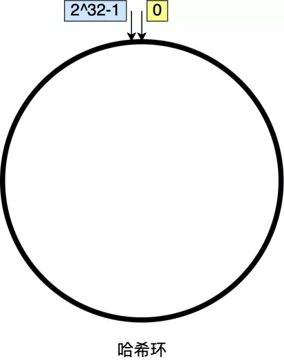
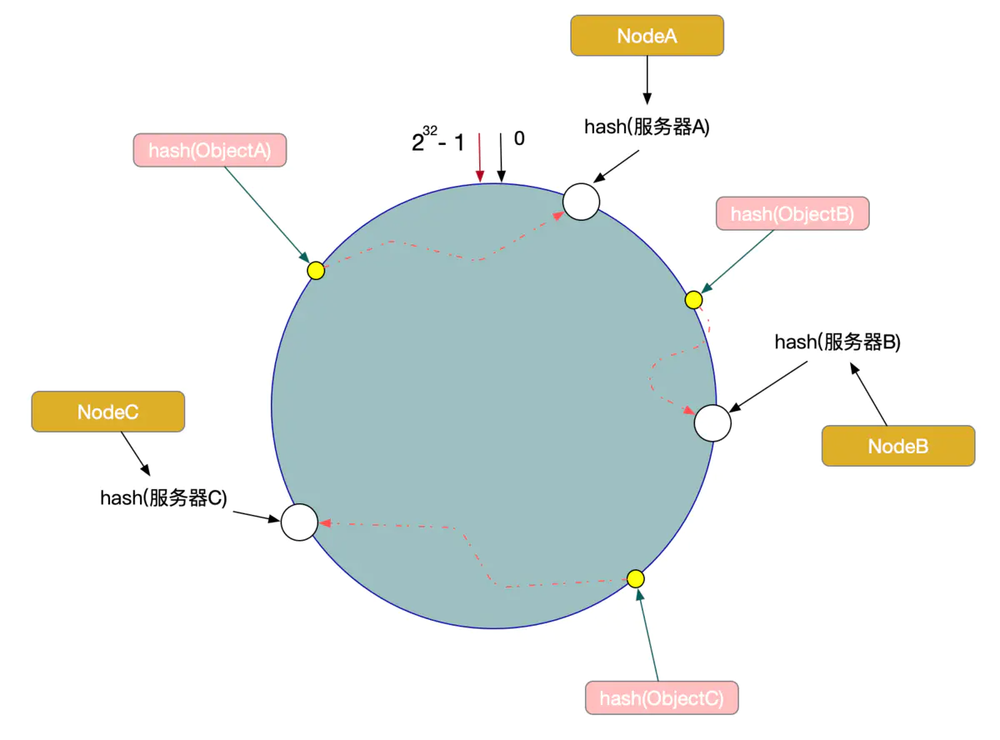
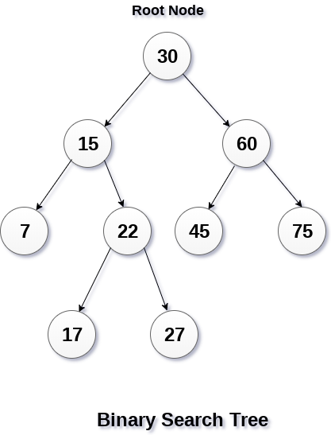
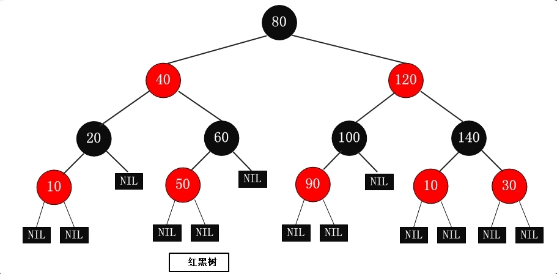

# 哈希

## 哈希指标

评估一个哈希算法的优劣，有如下指标，而一致性哈希全部满足：

- 均衡性(Balance)：将关键字的哈希地址均匀地分布在地址空间中，使地址空间得到充分利用，这是设计哈希的一个基本特性
- 单调性(Monotonicity): 单调性是指当地址空间增大时，通过哈希函数所得到的关键字的哈希地址也能映射的新的地址空间，而不是仅限于原先的地址空间。或等地址空间减少时，也是只能映射到有效的地址空间中。简单的哈希函数往往不能满足此性质
- 分散性(Spread): 哈希经常用在分布式环境中，终端用户通过哈希函数将自己的内容存到不同的缓冲区。此时，终端有可能看不到所有的缓冲，而是只能看到其中的一部分。当终端希望通过哈希过程将内容映射到缓冲上时，由于不同终端所见的缓冲范围有可能不同，从而导致哈希的结果不一致，最终的结果是相同的内容被不同的终端映射到不同的缓冲区中。这种情况显然是应该避免的，因为它导致相同内容被存储到不同缓冲中去，降低了系统存储的效率。分散性的定义就是上述情况发生的严重程度。好的哈希算法应能够尽量避免不一致的情况发生，也就是尽量降低分散性
- 负载(Load): 负载问题实际上是从另一个角度看待分散性问题。既然不同的终端可能将相同的内容映射到不同的缓冲区中，那么对于一个特定的缓冲区而言，也可能被不同的用户映射为不同的内容。与分散性一样，这种情况也是应当避免的，因此好的哈希算法应能够尽量降低缓冲的负荷

## 基本概念

### 装填因子

装填因子：a=n/m 其中n 为关键字个数，m为表长。

装填因子是表示 Hsah 表中元素的填满的程度。装填因子越大，填满的元素越多，好处是：空间利用率高了，但冲突的机会加大了。反之，加载因子越小，填满的元素越少，好处是：冲突的机会减小了，但空间浪费多了。

## 解决冲突的几种办法

### 开放定址法(再散列法)

当关键字 key 的哈希地址 p=H（key）出现冲突时，以 p 为基础，产生另一个哈希地址 p1，如果 p1 仍然冲突，再以 p 为基础，产生另一个哈希地址 p2，…，直到找出一个不冲突的哈希地址 pi ，将相应元素存入其中。这种方法有一个通用的再散列函数形式：

```
Hi=（H（key）+di）% m    (di=1，2，…，n)
```

其中H（key）为哈希函数，m 为表长，di 称为增量序列。增量序列的取值方式不同，相应的再散列方式也不同。主要有以下三种：

#### 线性探测再散列

```
di=1，2，3，…，m-1
```

这种方法的特点是：冲突发生时，顺序查看表中下一单元，直到找出一个空单元或查遍全表。

#### 二次探测再散列

```
di=12，-12，22，-22，…，k2，-k2 ( k<=m/2 )
```

这种方法的特点是：冲突发生时，在表的左右进行跳跃式探测，比较灵活。

#### 伪随机探测再散列

```
di=伪随机数序列
```

具体实现时，应建立一个伪随机数发生器，（如i=(i+p) % m），并给定一个随机数做起点。

#### 实例

例如，已知哈希表长度m=11，哈希函数为：H（key）= key % 11，则H（47）=3，H（26）=4，H（60）=5，假设下一个关键字为69，则H（69）=3，与47冲突。

如果用线性探测再散列处理冲突，下一个哈希地址为H1=（3 + 1）% 11 = 4，仍然冲突，再找下一个哈希地址为H2=（3 + 2）% 11 = 5，还是冲突，继续找下一个哈希地址为H3=（3 + 3）% 11 = 6，此时不再冲突，将69填入6号单元。

如果用二次探测再散列处理冲突，下一个哈希地址为H1=（3 + 12）% 11 = 4，仍然冲突，再找下一个哈希地址为H2=（3 - 12）% 11 = 2，此时不再冲突，将69填入2号单元。

如果用伪随机探测再散列处理冲突，且伪随机数序列为：2，5，9，……..，则下一个哈希地址为H1=（3 + 2）% 11 = 5，仍然冲突，再找下一个哈希地址为H2=（3 + 5）% 11 = 8，此时不再冲突，将69填入8号单元。

### 再哈希法

这种方法是同时构造多个不同的哈希函数：

```
Hi=RH1（key） (i=1，2，…，k)
```

当哈希地址Hi=RH1（key）发生冲突时，再计算Hi=RH2（key）……，直到冲突不再产生。这种方法不易产生聚集，但增加了计算时间。

### 链地址法

这种方法的基本思想是将所有哈希地址为i的元素构成一个称为同义词链的单链表，并将单链表的头指针存在哈希表的第i个单元中，因而查找、插入和删除主要在同义词链中进行。链地址法适用于经常进行插入和删除的情况。

#### 拉链法与开放地址法的对比

优点：

- 拉链法处理冲突简单，且无堆积现象，即非同义词决不会发生冲突，因此平均查找长度较短
- 由于拉链法中各链表上的结点空间是动态申请的，故它更适合于造表前无法确定表长的情况
- 开放定址法为减少冲突，要求装填因子α较小，故当结点规模较大时会浪费很多空间。而拉链法中可取α≥1，且结点较大时，拉链法中增加的指针域可忽略不计，因此节省空间
- 在用拉链法构造的散列表中，删除结点的操作易于实现。只要简单地删去链表上相应的结点即可。而对开放地址法构造的散列表，删除结点不能简单地将被删结 点的空间置为空，否则将截断在它之后填人散列表的同义词结点的查找路径。这是因为各种开放地址法中，空地址单元(即开放地址)都是查找失败的条件。因此在用开放地址法处理冲突的散列表上执行删除操作，只能在被删结点上做删除标记，而不能真正删除结点

缺点：

- 指针需要额外的空间，故当结点规模较小时，开放定址法较为节省空间，而若将节省的指针空间用来扩大散列表的规模，可使装填因子变小，这又减少了开放定址法中的冲突，从而提高平均查找速度

## 一致性哈希

分布式系统中对象与节点的映射关系，传统方案是使用对象的哈希值，对节点个数取模，再映射到相应编号的节点，这种方案在节点个数变动时，绝大多数对象的映射关系会失效而需要迁移；而一致性哈希算法中，当节点个数变动时，映射关系失效的对象非常少，迁移成本也非常小。对于 K 个关键字和 n 个槽位(分布式系统中的节点)的哈希表，增减槽位后，平均只需对 K/n 个关键字重新映射。

一致性哈希的基础数据结构是哈希环：



一致性哈希要进行两步哈希：

- 第一步：对存储节点进行哈希计算，也就是对存储节点做哈希映射，比如根据节点的 IP 地址进行哈希；
- 第二步：当对数据进行存储或访问时，对数据进行哈希映射；

所以，一致性哈希是指将存储节点和数据都映射到一个首尾相连的哈希环上。映射的结果值往顺时针的方向的找到第一个节点，就是存储该数据的节点。

例如，现在有ObjectA，ObjectB，ObjectC三个数据对象，经过哈希计算后，在环空间上的位置如下：



根据一致性算法，Object -> NodeA，ObjectB -> NodeB, ObjectC -> NodeC

一致性哈希是指将存储节点和数据都映射到一个首尾相连的哈希环上，如果增加或者移除一个节点，仅影响该节点在哈希环上顺时针相邻的后继节点，其它数据也不会受到影响。

但是一致性哈希算法不能够均匀的分布节点，会出现大量请求都集中在一个节点的情况，在这种情况下进行容灾与扩容时，容易出现雪崩的连锁反应。

为了解决一致性哈希算法不能够均匀的分布节点的问题，就需要引入虚拟节点，对一个真实节点做多个副本。不再将真实节点映射到哈希环上，而是将虚拟节点映射到哈希环上，并将虚拟节点映射到实际节点，所以这里有「两层」映射关系。

引入虚拟节点后，可以会提高节点的均衡度，还会提高系统的稳定性。所以，带虚拟节点的一致性哈希方法不仅适合硬件配置不同的节点的场景，而且适合节点规模会发生变化的场景。

# 那些树

## 二叉树

二叉树是每个节点最多有两个子节点的树。

二叉树的叶子节点有0个字节点，二叉树的根节点或者内部节点有一个或者两个字节点。

## 二叉搜索树（Binary Search Tree）

二叉搜索树， 又叫 二叉查找树。

它或者是一棵空树，或者是具有下列性质的二叉树：

- 若它的左子树不空，则左子树上所有结点的值均小于它的根结点的值；
- 若它的右子树不空，则右子树上所有结点的值均大于它的根结点的值；
- 它的左、右子树也分别为二叉搜索树。



## 平衡二叉树（AVL Tree）

平衡二叉树全称叫做平衡二叉搜索（排序）树，简称 AVL树。

AVL树本质上是一颗二叉查找树，AVL树的特性：

- 它是一棵空树或它的左右两个子树的高度差的绝对值不超过1，
- 左右两个子树 也都是一棵平衡二叉树。


## 红黑树（Red-Black Tree）

红黑树是一种含有红、黑结点，并能自平衡的二叉查找树，其性质如下：
- 每个结点或是红色的，或是黑色的
- 根节点是黑色的
- 每个叶结点（NIL）是黑色的
- 如果一个节点是红色的，则它的两个儿子都是黑色的
- 对于每个结点，从该结点到其叶子结点构成的所有路径上的黑结点个数相同



### AVL 和 RBT 对比

和红黑树相比，AVL树是严格的平衡二叉树，平衡条件必须满足（所有节点的左右子树高度差不超过1）。

通过对任何一条从根到叶子的路径上各个节点着色的方式的限制，红黑树确保没有一条路径会比其它路径长出两倍，因此，红黑树是一种弱平衡二叉树（由于是弱平衡，可以看到，在相同的节点情况下，AVL树的高度低于红黑树）。结果是这个树大致上是平衡的。因为操作比如插入、删除和查找某个值的最坏情况时间都要求与树的高度成比例，这个在高度上的理论上限允许红黑树在最坏情况下都是高效的，而不同于普通的二叉查找树。

红黑树的查询性能略微逊色于AVL树，因为他比avl树会稍微不平衡最多一层，也就是说红黑树的查询性能只比相同内容的avl树最多多一次比较，但是，红黑树在插入和删除上完爆avl树，avl树每次插入删除会进行大量的平衡度计算，而红黑树为了维持红黑性质所做的红黑变换和旋转的开销，相较于avl树为了维持平衡的开销要小得多。


