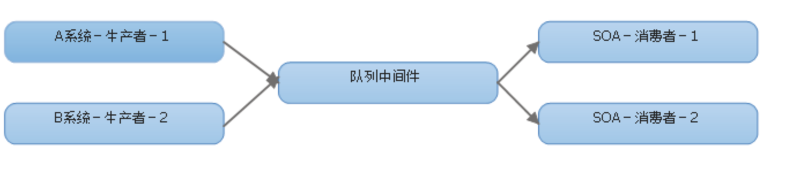
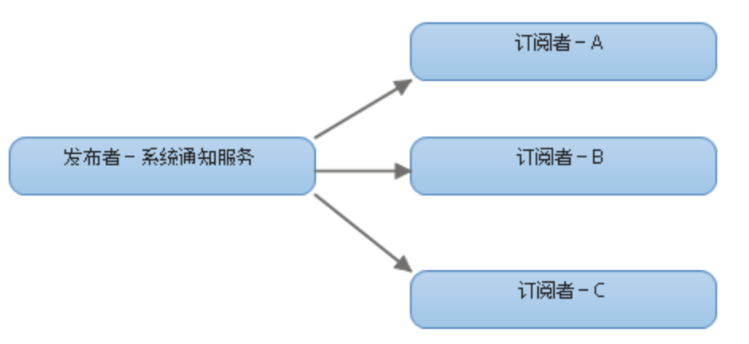
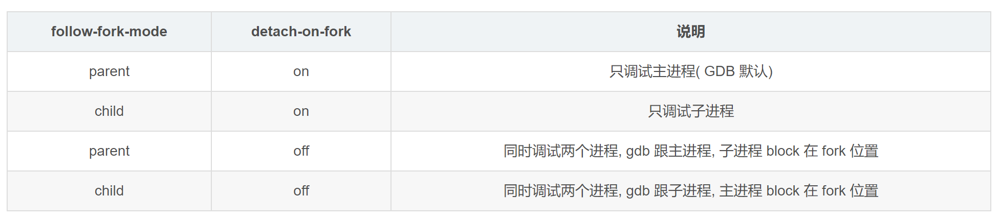

# 哈希

## 哈希指标

评估一个哈希算法的优劣，有如下指标，而一致性哈希全部满足：

- 均衡性(Balance)：将关键字的哈希地址均匀地分布在地址空间中，使地址空间得到充分利用，这是设计哈希的一个基本特性
- 单调性(Monotonicity): 单调性是指当地址空间增大时，通过哈希函数所得到的关键字的哈希地址也能映射的新的地址空间，而不是仅限于原先的地址空间。或等地址空间减少时，也是只能映射到有效的地址空间中。简单的哈希函数往往不能满足此性质
- 分散性(Spread): 哈希经常用在分布式环境中，终端用户通过哈希函数将自己的内容存到不同的缓冲区。此时，终端有可能看不到所有的缓冲，而是只能看到其中的一部分。当终端希望通过哈希过程将内容映射到缓冲上时，由于不同终端所见的缓冲范围有可能不同，从而导致哈希的结果不一致，最终的结果是相同的内容被不同的终端映射到不同的缓冲区中。这种情况显然是应该避免的，因为它导致相同内容被存储到不同缓冲中去，降低了系统存储的效率。分散性的定义就是上述情况发生的严重程度。好的哈希算法应能够尽量避免不一致的情况发生，也就是尽量降低分散性
- 负载(Load): 负载问题实际上是从另一个角度看待分散性问题。既然不同的终端可能将相同的内容映射到不同的缓冲区中，那么对于一个特定的缓冲区而言，也可能被不同的用户映射为不同的内容。与分散性一样，这种情况也是应当避免的，因此好的哈希算法应能够尽量降低缓冲的负荷

## 基本概念

### 装填因子

装填因子：a=n/m 其中n 为关键字个数，m为表长。

装填因子是表示 Hsah 表中元素的填满的程度。装填因子越大，填满的元素越多，好处是：空间利用率高了，但冲突的机会加大了。反之，加载因子越小，填满的元素越少，好处是：冲突的机会减小了，但空间浪费多了。

## 解决冲突的几种办法

### 开放定址法(再散列法)

当关键字 key 的哈希地址 p=H（key）出现冲突时，以 p 为基础，产生另一个哈希地址 p1，如果 p1 仍然冲突，再以 p 为基础，产生另一个哈希地址 p2，…，直到找出一个不冲突的哈希地址 pi ，将相应元素存入其中。这种方法有一个通用的再散列函数形式：

```
Hi=（H（key）+di）% m    (di=1，2，…，n)
```

其中H（key）为哈希函数，m 为表长，di 称为增量序列。增量序列的取值方式不同，相应的再散列方式也不同。主要有以下三种：

#### 线性探测再散列

```
di=1，2，3，…，m-1
```

这种方法的特点是：冲突发生时，顺序查看表中下一单元，直到找出一个空单元或查遍全表。

#### 二次探测再散列

```
di=12，-12，22，-22，…，k2，-k2 ( k<=m/2 )
```

这种方法的特点是：冲突发生时，在表的左右进行跳跃式探测，比较灵活。

#### 伪随机探测再散列

```
di=伪随机数序列
```

具体实现时，应建立一个伪随机数发生器，（如i=(i+p) % m），并给定一个随机数做起点。

#### 实例

例如，已知哈希表长度m=11，哈希函数为：H（key）= key % 11，则H（47）=3，H（26）=4，H（60）=5，假设下一个关键字为69，则H（69）=3，与47冲突。

如果用线性探测再散列处理冲突，下一个哈希地址为H1=（3 + 1）% 11 = 4，仍然冲突，再找下一个哈希地址为H2=（3 + 2）% 11 = 5，还是冲突，继续找下一个哈希地址为H3=（3 + 3）% 11 = 6，此时不再冲突，将69填入6号单元。

如果用二次探测再散列处理冲突，下一个哈希地址为H1=（3 + 12）% 11 = 4，仍然冲突，再找下一个哈希地址为H2=（3 - 12）% 11 = 2，此时不再冲突，将69填入2号单元。

如果用伪随机探测再散列处理冲突，且伪随机数序列为：2，5，9，……..，则下一个哈希地址为H1=（3 + 2）% 11 = 5，仍然冲突，再找下一个哈希地址为H2=（3 + 5）% 11 = 8，此时不再冲突，将69填入8号单元。

### 再哈希法

这种方法是同时构造多个不同的哈希函数：

```
Hi=RH1（key） (i=1，2，…，k)
```

当哈希地址Hi=RH1（key）发生冲突时，再计算Hi=RH2（key）……，直到冲突不再产生。这种方法不易产生聚集，但增加了计算时间。

### 链地址法

这种方法的基本思想是将所有哈希地址为i的元素构成一个称为同义词链的单链表，并将单链表的头指针存在哈希表的第i个单元中，因而查找、插入和删除主要在同义词链中进行。链地址法适用于经常进行插入和删除的情况。

#### 拉链法与开放地址法的对比

优点：

- 拉链法处理冲突简单，且无堆积现象，即非同义词决不会发生冲突，因此平均查找长度较短
- 由于拉链法中各链表上的结点空间是动态申请的，故它更适合于造表前无法确定表长的情况
- 开放定址法为减少冲突，要求装填因子α较小，故当结点规模较大时会浪费很多空间。而拉链法中可取α≥1，且结点较大时，拉链法中增加的指针域可忽略不计，因此节省空间
- 在用拉链法构造的散列表中，删除结点的操作易于实现。只要简单地删去链表上相应的结点即可。而对开放地址法构造的散列表，删除结点不能简单地将被删结 点的空间置为空，否则将截断在它之后填人散列表的同义词结点的查找路径。这是因为各种开放地址法中，空地址单元(即开放地址)都是查找失败的条件。因此在用开放地址法处理冲突的散列表上执行删除操作，只能在被删结点上做删除标记，而不能真正删除结点

缺点：

- 指针需要额外的空间，故当结点规模较小时，开放定址法较为节省空间，而若将节省的指针空间用来扩大散列表的规模，可使装填因子变小，这又减少了开放定址法中的冲突，从而提高平均查找速度

## 一致性哈希

分布式系统中对象与节点的映射关系，传统方案是使用对象的哈希值，对节点个数取模，再映射到相应编号的节点，这种方案在节点个数变动时，绝大多数对象的映射关系会失效而需要迁移；而一致性哈希算法中，当节点个数变动时，映射关系失效的对象非常少，迁移成本也非常小。对于 K 个关键字和 n 个槽位(分布式系统中的节点)的哈希表，增减槽位后，平均只需对 K/n 个关键字重新映射。

一致性哈希的基础数据结构是哈希环：


一致性哈希要进行两步哈希：

- 第一步：对存储节点进行哈希计算，也就是对存储节点做哈希映射，比如根据节点的 IP 地址进行哈希；
- 第二步：当对数据进行存储或访问时，对数据进行哈希映射；

所以，一致性哈希是指将存储节点和数据都映射到一个首尾相连的哈希环上。映射的结果值往顺时针的方向的找到第一个节点，就是存储该数据的节点。

例如，现在有ObjectA，ObjectB，ObjectC三个数据对象，经过哈希计算后，在环空间上的位置如下：


根据一致性算法，Object -> NodeA，ObjectB -> NodeB, ObjectC -> NodeC

一致性哈希是指将存储节点和数据都映射到一个首尾相连的哈希环上，如果增加或者移除一个节点，仅影响该节点在哈希环上顺时针相邻的后继节点，其它数据也不会受到影响。

但是一致性哈希算法不能够均匀的分布节点，会出现大量请求都集中在一个节点的情况，在这种情况下进行容灾与扩容时，容易出现雪崩的连锁反应。

为了解决一致性哈希算法不能够均匀的分布节点的问题，就需要引入虚拟节点，对一个真实节点做多个副本。不再将真实节点映射到哈希环上，而是将虚拟节点映射到哈希环上，并将虚拟节点映射到实际节点，所以这里有「两层」映射关系。

引入虚拟节点后，可以会提高节点的均衡度，还会提高系统的稳定性。所以，带虚拟节点的一致性哈希方法不仅适合硬件配置不同的节点的场景，而且适合节点规模会发生变化的场景。

# 那些树

## 二叉树

二叉树是每个节点最多有两个子节点的树。

二叉树的叶子节点有0个字节点，二叉树的根节点或者内部节点有一个或者两个字节点。

## 二叉搜索树（Binary Search Tree）

二叉搜索树， 又叫 二叉查找树。

它或者是一棵空树，或者是具有下列性质的二叉树：

- 若它的左子树不空，则左子树上所有结点的值均小于它的根结点的值；
- 若它的右子树不空，则右子树上所有结点的值均大于它的根结点的值；
- 它的左、右子树也分别为二叉搜索树。


## 平衡二叉树（AVL Tree）

平衡二叉树全称叫做平衡二叉搜索（排序）树，简称 AVL树。

AVL树本质上是一颗二叉查找树，AVL树的特性：

- 它是一棵空树或它的左右两个子树的高度差的绝对值不超过1，
- 左右两个子树 也都是一棵平衡二叉树。


## 红黑树（Red-Black Tree）

红黑树是一种含有红、黑结点，并能自平衡的二叉查找树，其性质如下：
- 每个结点或是红色的，或是黑色的
- 根节点是黑色的
- 每个叶结点（NIL）是黑色的
- 如果一个节点是红色的，则它的两个儿子都是黑色的
- 对于每个结点，从该结点到其叶子结点构成的所有路径上的黑结点个数相同


### AVL 和 RBT 对比

和红黑树相比，AVL树是严格的平衡二叉树，平衡条件必须满足（所有节点的左右子树高度差不超过1）。

通过对任何一条从根到叶子的路径上各个节点着色的方式的限制，红黑树确保没有一条路径会比其它路径长出两倍，因此，红黑树是一种弱平衡二叉树（由于是弱平衡，可以看到，在相同的节点情况下，AVL树的高度低于红黑树）。结果是这个树大致上是平衡的。因为操作比如插入、删除和查找某个值的最坏情况时间都要求与树的高度成比例，这个在高度上的理论上限允许红黑树在最坏情况下都是高效的，而不同于普通的二叉查找树。

红黑树的查询性能略微逊色于AVL树，因为他比avl树会稍微不平衡最多一层，也就是说红黑树的查询性能只比相同内容的avl树最多多一次比较，但是，红黑树在插入和删除上完爆avl树，avl树每次插入删除会进行大量的平衡度计算，而红黑树为了维持红黑性质所做的红黑变换和旋转的开销，相较于avl树为了维持平衡的开销要小得多。

# 死锁

## 产生死锁的四个必要条件

- 互斥条件：一个资源每次只能被一个进程使用
- 请求与保持条件：一个进程因请求资源而阻塞时，对已获得的资源保持不放
- 不剥夺条件：进程已获得的资源，在末使用完之前，不能强行剥夺
- 循环等待条件：若干进程之间形成一种头尾相接的循环等待资源关系

# STL

## STL 迭代器失效

### vector

- 当插入（push_back）一个元素后，end操作返回的迭代器肯定失效
- 当插入(push_back)一个元素后，capacity返回值与没有插入元素之前相比有改变，则需要重新加载整个容器，此时first和end操作返回的迭代器都会失效
- 当进行删除操作（erase，pop_back）后，指向删除点的迭代器全部失效；指向删除点后面的元素的迭代器也将全部失效

### deque

- 在deque容器首部或者尾部插入元素不会使得任何迭代器失效
- 在其首部或尾部删除元素则只会使指向被删除元素的迭代器失效
- 在deque容器的任何其他位置的插入和删除操作将使指向该容器元素的所有迭代器失效

### list

- 插入操作（insert）和接合操作（splice）不会造成原有的list迭代器失效
- 删除操作（erase）也只有指向被删除元素的那个迭代器失效，其他迭代器不受影响

### set/multiset

如果迭代器所指向的元素被删除，则该迭代器失效。其它任何增加、删除元素的操作都不会使迭代器失效。

### map/multimap

如果迭代器所指向的元素被删除，则该迭代器失效。其它任何增加、删除元素的操作都不会使迭代器失效。

### 删除操作

vector 的 erase 函数的返回值，是当前被删除元素的下一个元素的迭代器指针：

```
vector<int>::iterator iter;
	for (iter = vec.begin(); iter != vec.end(); ) {
		if (*iter == 1) {
			iter = vec.erase(iter);
			// vec.erase(iter++); //这种方式一样可以
		} else {
			++iter;
		}
	}
```

map 的删除操作：

```
std::map<std::string, std::string >::iterator it = mapTest.begin();
while(it != mapTest.end())
{
    if(TestVal(it->second))
    	mapTest.erase(it++);
    else
    	it++;
  }
```

- 先把it的值赋值给一个临时变量做为传递给 erase 的参数变量
- 因为参数处理优先于函数调用，所以接下来执行了 it++ 操作，也就是it现在已经指向了下一个地址
- 再调用 erase 函数，释放掉第一步中保存的要删除的it的值的临时变量所指的位置

## 容器适配器

- stack 适配器要求能够 push_back，pop_back，back 操作，所以 stack 可以建立在 vector、deque、list 上（array，forward_list不可以）
- queue 适配器要求容器具有 back，push_back，push_front 操作，因此可以在 list 和 deque 上构造（vector 没有 front 这个操作）
- priority_queue 要求容器具有push_back，pop_back 以及随机访问（用来排序）的操作。所以可以用 vector 和deque。但是不能建立在 list 上


# 观察者和生产者消费者之间的区别

观察者一般又称发布/订阅模式，它一般是有一个主题对象，然后有多个订阅者去关注它，当它的状态发生变化时，会自动通知这些订阅者；而消费者模式类似一个缓存队列的概念，它也称为生产者/消费者模式，生产者只负责生产数据不去做处理，而消费者只从消费中间件里拿到所要处理的数据，并进行相应的逻辑处理工作，生产者与消费者是相互不知道对方的存在的，或者说他们可以是不同平台的，不同语言的，即解耦的！



订阅者肯定是个消费者，但消费者不一定是订阅者，发布者一定是个生产者，但生产者不一定是个发布者。



# fork，vfork，clone

这三个调用的执行过程是执行fork(),vfork(),clone()时，通过一个系统调用表映射到sys_fork(),sys_vfork(),sys_clone(),再在这三个函数中去调用do_fork()去做具体的创建进程工作。

## fork

fork创建一个进程时，子进程只是完全复制父进程的资源，复制出来的子进程有自己的 task_struct 结构和 pid,但却复制父进程其它所有的资源。例如，要是父进程打开了五个文件，那么子进程也有五个打开的文件，而且这些文件的当前读写指针也停在相同的地方。

这样看来，fork 是一个开销十分大的系统调用，这些开销并不是所有的情况下都是必须的，比如某进程fork出一个子进程后，其子进程仅仅是为了调用 exec 执行另一个可执行文件，那么在 fork 过程中对于虚存空间的复制将是一个多余的过程。但由于现在 Linux 中是采取了 copy-on-write(COW写时复制)技术，为了降低开销，fork 最初并不会真的产生两个不同的拷贝，因为在那个时候，大量的数据其实完全是一样的。写时复制是在推迟真正的数据拷贝。若后来确实发生了写入，那意味着 parent 和 child 的数据不一致了，于是产生复制动作，每个进程拿到属于自己的那一份，这样就可以降低系统调用的开销。所以有了写时复制后呢，vfork其实现意义就不大了。

 fork子进程完全复制父进程的栈空间，也复制了页表，但没有复制物理页面，所以这时虚拟地址相同，物理地址也相同，但是会把父子共享的页面标记为“只读”，直到其中任何一个进程要对共享的页面“写操作”，这时内核会复制一个物理页面给这个进程使用，同时修改页表。而把原来的只读页面标记为“可写”，留给另外一个进程使用。这就是所谓的“写时复制”。

fork() 调用执行一次返回两个值，对于父进程，fork函数返回子程序的进程号，而对于子程序，fork() 函数则返回零，这就是一个函数返回两次的本质。

在 fork 之后，子进程和父进程都会继续执行fork调用之后的指令。子进程是父进程的副本。它将获得父进程的数据空间，堆和栈的副本，这些都是副本，父子进程并不共享这部分的内存。也就是说，子进程对父进程中的同名变量进行修改并不会影响其在父进程中的值。但是父子进程又共享一些东西，简单说来就是程序的代码段。正文段存放着由cpu执行的机器指令，通常是read-only的。

fork不对父子进程的执行次序进行任何限制，fork返回后，子进程和父进程都从调用fork函数的下一条语句开始行，但父子进程运行顺序是不定的，它取决于内核的调度算法。

```
#include <stdlib.h>
#include <stdio.h>
#include <sys/types.h>
#include <unistd.h>

int main(void)
{
	int count = 1;
	int child;
	 
	child = fork();
	if(child < 0)
	{
		perror("fork error");
		exit(EXIT_FAILURE);
	}
	else if(child == 0)
	{
		printf("this is son process(%d),this count is : (%d)，addr is : (%p) \n",(int)getpid(),++count,&count);
	}
	else{
		printf("this is father process(%d),this count is : (%d)，addr is : (%p) \n",(int)getpid(),count,&count);
	}
	return EXIT_SUCCESS;
}
```

输出：

```
this is father process(21340),this count is : (1)，addr is : (0x7ffdd73f32c0) 
this is son process(21341),this count is : (2)，addr is : (0x7ffdd73f32c0) 
```

子进程改变了count的值，而父进程中的count没有被改变。子进程与父进程count的地址（虚拟地址）是相同的（注意他们在内核中被映射的物理地址不同）

## vfork

vfork是一个过时的应用，vfork也是创建一个子进程，但是子进程共享父进程的空间。在vfork创建子进程之后，父进程阻塞，直到子进程执行了exec()或者exit()。vfork最初是因为fork没有实现COW机制，而很多情况下fork之后会紧接着exec，而exec的执行相当于之前fork复制的空间全部变成了无用功，所以设计了vfork。而现在fork使用了COW机制，唯一的代价仅仅是复制父进程页表的代价，所以vfork不应该出现在新的代码之中。      

vfork 也是在父进程中返回子进程的进程号，在子进程中返回0。

由vfork创建的子进程要先于父进程执行，子进程执行时，父进程处于挂起状态，子进程执行完，唤醒父进程。除非子进程exit或者execve才会唤起父进程。

```
#include <stdlib.h>
#include <stdio.h>
#include <sys/types.h>
#include <unistd.h>

int main(void)
{
	int count = 1;
	int child;
	 
	child = vfork();
	if(child < 0)
	{
		perror("fork error");
		exit(EXIT_FAILURE);
	}
	else if(child == 0)
	{
		printf("this is son process(%d),this count is : (%d)，addr is : (%p) \n",(int)getpid(),++count,&count);
        exit(EXIT_SUCCESS); //@ 必须写，否则 coredump
	}
	else{
		printf("this is father process(%d),this count is : (%d)，addr is : (%p) \n",(int)getpid(),count,&count);
		exit(EXIT_FAILURE);
	}
	return EXIT_SUCCESS;
}
```

输出：

```
this is son process(13232),this count is : (2)，addr is : (0x7fffa116b340) 
this is father process(13231),this count is : (2)，addr is : (0x7fffa116b340) 
```

## clone

clone是Linux为创建线程设计的（虽然也可以用clone创建进程）。所以可以说clone是fork的升级版本，不仅可以创建进程或者线程，还可以指定创建新的命名空间（namespace）、有选择的继承父进程的内存、甚至可以将创建出来的进程变成父进程的兄弟进程等等。

clone可以让你有选择性的继承父进程的资源，你可以选择像vfork一样和父进程共享一个虚存空间，从而使创造的是线程，你也可以不和父进程共享，你甚至可以选择创造出来的进程和父进程不再是父子关系，而是兄弟关系。

系统调用 fork() 和 vfork() 是无参数的，而 clone() 则带有参数。fork()是全部复制，vfork()是共享内存，而clone()是则可以将父进程资源有选择地复制给子进程，而没有复制的数据结构则通过指针的复制让子进程共享，具体要复制哪些资源给子进程，由参数列表中的clone_flags来决定。另外，clone()返回的是子进程的pid。

调用 clone 创建线程：

```
#include <stdlib.h>
#include <stdio.h>
#include <sys/types.h>
#include <unistd.h>
#include <malloc.h>
#include <sched.h>

#define FIBER_STACK 8192

int a ;
void * stack;


int do_sth(void *)
{
    printf("this is son(%d),the a is :(%d)\n",getpid(),++a);
    free(stack);
    exit(1);
}

int main(void)
{
    void * stack;
    a = 1;
    stack = malloc(FIBER_STACK);
    if(!stack)
    {
        printf("malloc for stack failed\n");
        exit(EXIT_FAILURE);
    }

    printf("create son thread......\n");
    clone(&do_sth,(char*)stack+FIBER_STACK,CLONE_VM | CLONE_VFORK,0);
    printf("this is father(%d),the a is : (%d)\n",getpid(),a);


	return EXIT_SUCCESS;
}
```

输出：

```
create son thread......
this is son(9669),the a is :(2)
this is father(9668),the a is : (2)
```

## 对比总结

- 执行顺序：
  - fork 子进程和父进程的执行顺序不确定
  - vfork 确保子进程执行时，父进程挂起，直到子进程执行 exec 或者 exit 父进程继续执行
  - clone  由标志CLONE_VFORK来决定子进程在执行时父进程是阻塞还是运行，若没有设置该标志，则父子进程同时运行，设置了该标志，则父进程挂起，直到子进程结束为止
- 复制内容
  - fork 子进程完全复制父进程的栈空间，也复制了页表，但没有复制物理页面，所以这时虚拟地址相同，物理地址也相同，直到一个进程要改写共享页面时，才会发生物理页面复制和页面修改，这种机制成为 copy on write
  - vfork 直接共享父进程的空间
  - clone 可以有选择性的复制父进程的内存
- 使用场景
  - fork 一般用于父子进程能够并行工作的场景
  - vfork 一般用于创建子进程后，子进程会马上调用 exec 执行新的程序
  - clone，可以用于创建线程，可以用于创建兄弟进程 
- 参数和返回值
  - fork 无参数，成功时返回两次，父进程中返回子进程的进程号，子进程中返回 0
  - vfork 无参数，成功时返回两次，父进程中返回子进程的进程号，子进程中返回 0
  - clone 可以传参，指定一些 flag，和入口函数，成功时返回一次，调用进程中返回的是创建进程的进程号

# gdb

## 多进程调试



查看和设置当前的调试模式：

```
show follow-fork-mode // Debugger response to a program call of fork or vfork is "parent".
show detach-on-fork  //Whether gdb will detach the child of a fork is on.

set follow-fork-mode parent|child 
set detach-on-fork   on|off
```

gdb 将每一个被调试程序的执行状态记录在一个名为 inferior 的结构中。一般情况下一个 inferior 对应一个进程，每个不同的 inferior 有不同的地址空间。inferior 有时候会在进程没有启动的时候就存在。

显示 gdb 调试的所有 inferior，gdb  会为它们分配 ID。其中带有 `*` 的进程是当前正在调试的进程：

```
info inferiors
```

切换到编号为 num 的进程进行调试：

```
inferior num
```

## 多线程调试


