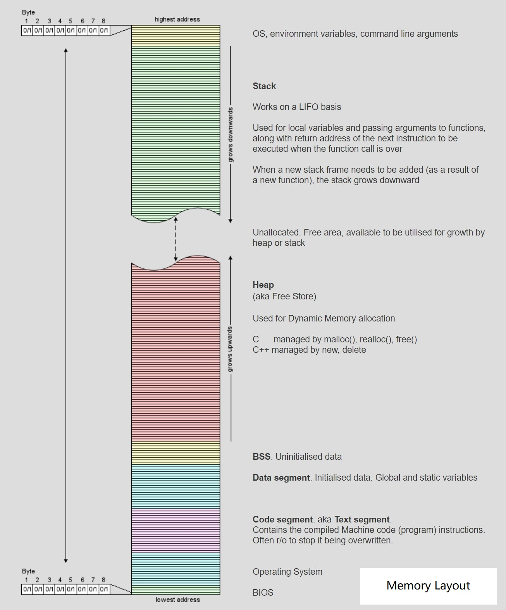

# 基础

## nullptr

传统 C++ 会把 NULL、0 视为同一种东西，这取决于编译器如何定义 NULL，有些编译器会将 NULL 定义为 `((void*)0)`，有些则会直接将其定义为 0。

C++ 不允许直接将 `void *` 隐式转换到其他类型。但如果编译器尝试把 NULL 定义为 `((void*)0)`，那么在下面这句代码中：

```
char *ch = NULL; //@ 不合法
```

而将 NULL 定义成 0 将导致 C++ 中重载特性发生混乱：

```
void foo(char*);
void foo(int);

//@ 实际调用 foo 函数
foo(NULL); //@ 将调用 foo(int)
```

nullptr 的类型是 std::nullptr_t。

## 列表初始化

- 统一了初始化方式
- 禁止类型收缩

## 类型推导

### auto

- 声明时必须初始化，编译器才能够根据初始化变量类型进行推导
- 结果为值类型推导，不显示指定引用类型，返回的是值类型
- 不显示的指定为指针或者引用类型将会丢掉 CV 特性

### decltype

- 在编译期间推导出表达式的类型，但是不会对表达式求值
- 能够保证与表达式的类型一致，即会保留引用和 CV 特性
- decltype((x)) 左值引用，decltype(m+n) 右值引用，decltype(m+=n) 左值引用

## const/volatile/mutable

### const

- 定义常量
- 传参时防止对参数修改
- 成员函数中，指定该函数不会修改类的成员
  - 常量对象必须调用常量成员函数，不能调用非常量成员函数；非常量对象都可以调用，优先调用非常量成员函数
  - 可以构成函数重载
  - const 修饰类的成员函数，实质上修饰的是成员函数影藏得 this 指针，表示该成员函数不能对类的成员变量做修改，所以 const 不可以修饰构造函数和析构函数和赋值运算符重载
- const 与指针
  - 常量指针：表示指针指向的内容是常量，const 在 * 前面
  - 指针常量：表示指针本身是常量，* 在 const 前面

### volatile

- 变量是易变的，不稳定的，禁止编译器的优化，编译器就不会去假设这个变量的值，优化器在用到这个变量时必须每次都小心地重新读取这个变量的值，而不是使用保存在寄存器里的备份
- 使用场合：
  - 并行设备的硬件寄存器，如状态寄存器
  - 一个中断服务程序中会访问到非自动变量
  - 多线程应用中几个任务共享的变量
- const 和 volatile 可以同时使用，一个例子是只读的状态寄存器。它是 volatile 因为它可能被意想不到地改变。它是const 因为程序不应该试图去修改它
- volatile 可以修饰指针，一个例子是当一个中服务子程序修该一个指向一个 buffer 的指针时

### mutable

- 只能修饰类的非静态成员变量
- 修饰的变量将永远处于可变的状态，即使在一个 const 函数中

## lambda 表达式

```
[捕获列表](参数列表) mutable(可选) 异常属性 -> 返回类型 {
	// 函数体
}
```

- 捕获列表中可以按值捕获或者按引用捕获，引用捕获在调用时进行捕获，而值捕获则是在定义之时进行捕获，
  - 捕获列表可以为空
  - 以值方式捕获所有的局部变量 `[=]`，以引用方式捕获局部变量 `[&]`
  - 捕获指向性的对象（指针、迭代器和引用）应该特别注意指向对象是否存在
- 参数列表如果为空可以省略
- 异常属性声明用于指定函数抛出的异常，如抛出整数类型的异常，可以使用 throw(int)
- 允许省略返回值类型定义，编译器会根据语句自动推导：
  - 采用自动推导时，如果有多处返回，类型需要保持一致
  - 不能推导初始化列表
- 按值捕获时，默认情况下 lambda 体中不允许修改变量的值，使用 mutable 修饰，修改变量后外部变量不会同步修改。如果使用 mutable 修饰，即使没有参数，也需要写明参数列表

lambda 表达式的使用场景：

- 线程入口函数
- 算法中的自定义函数，比如：count_if，sort，remove_if
- 作为一个大函数中多分支共同调用时的公共函数

## 函数对象包装器

C++ 中的可调用对象：

- 函数指针
- 具有 `operator()` 成员函数的类对象(仿函数)
- 可以转换成函数指针的类对象
- 类的成员(函数)指针

std::function 是可调用对象的包装器，是一个类模板，可以容纳除了类成员(函数)指针以外所有的可调用对象。

它也是对 C++ 中现有的可调用实体的一种类型安全的包裹，换句话说，就是函数的容器。当我们有了函数的容器之后便能够更加方便的将函数、函数指针作为对象进行处理。

## std::bind 和 std::placeholder

不论是普通函数、函数对象、还是成员函数，成员变量都可以 bind。作用：

- 将可调用对象与其参数绑定成一个仿函数
- 改变函数调用时需要传参的个数和顺序
- 先将可调用的对象保存起来，在需要的时候再调用，是一种延迟计算的思想

bind 类的非静态成员时，第一个参数需要是对象的实例。

## 右值引用

- 左值是表达式结束后依然存在的持久对象，右值是表达式结束就不会继续存在的临时对象
- 如果能对表达式取地址就是左值，否则就是右值
- 具名变量或对象都是左值，而右值是不具名的

C++ 11 中所有的值必属于：左值，将亡值，纯右值 三者之一，将亡值和纯右值都属于右值：

- 一个左值：
  - 变量、函数或数据成员
  - 返回左值引用的表达式，例如： `++x`、`x = 1`、`cout << ' '`、`(x)`
  - 字符串字面量是左值，而且是不可被更改的左值。字符串字面量并不具名，但是可以用 & 取地址所以也是左值，`std::cout<<&("hello")<<std::endl`
  - 一个表达式的类型是一个右值引用
- 一个是将亡值：
  - 将要被移动的对象
  - T&& 类型函数返回值
  - std::move 返回值
  - 转换为 T&& 的类型的转换函数的返回值
- 一个是纯右值
  - 非引用返回的临时变量
  - 运算表达式产生的临时变量，例如：`x+1`、`x++`
  - 字符串字面值之外的字面量
  - lambda 表达式

右值引用是对一个右值进行引用的类型，因为右值不具名，只能通过引用的方式找到它。如果一个 prvalue 被绑定到一个引用上，它的生命周期则会延长到跟这个引用变量一样长。

```
auto&& res = get_s();
```

## 万能引用与引用折叠

C++ 11中有万能引用（Universal Reference）的概念：使用`T&&`类型的形参既能绑定右值，又能绑定左值。但是，只有发生类型推导的时候，`T&&` 才表示万能引用；否则，表示右值引用。

一个模板函数，根据定义的形参和传入的实参的类型，可以有下面 4 种组合：

- 左值-左值 T& & # 函数定义的形参类型是左值引用，传入的实参是左值引用，结果是左值引用
- 左值-右值 T& && # 函数定义的形参类型是左值引用，传入的实参是右值引用，结果是左值引用
- 右值-左值 T&& & # 函数定义的形参类型是右值引用，传入的实参是左值引用，结果是左值引用
- 右值-右值 T&& && # 函数定义的形参类型是右值引用，传入的实参是右值引用，结果是右值引用

但是 C++ 中不允许对引用再进行引用，对于上述情况的处理有如下的规则：所有的折叠引用最终都代表一个引用，要么是左值引用，要么是右值引用。规则是：如果任一引用为左值引用，则结果为左值引用。否则（即两个都是右值引用），结果为右值引用。

## 移动语义

std::move并不能移动任何东西，它唯一的功能是将一个左值强制转化为右值引用，继而可以通过右值引用使用该值，以用于移动语义。从实现上讲，std::move基本等同于一个类型转换：`static_cast<T&&>(lvalue)`。

std::move 是将对象的状态或者所有权从一个对象转移到另一个对象，只是转移，没有内存的搬迁或者内存拷贝所以可以提高利用效率，改善性能。

在 C++11 之前，返回一个本地对象意味着这个对象会被拷贝，除非编译器发现可以做返回值优化（named return value optimization，或 NRVO），能把对象直接构造到调用者的栈上。从 C++11 开始，返回值优化仍可以发生，但在没有返回值优化的情况下，编译器将试图把本地对象移动出去，而不是拷贝出去。这一行为不需要用 std::move 进行干预——使用std::move 对于移动行为没有帮助，反而会影响返回值优化。    

```
template<typename T>
typename std::remove_reference<T>::type && move(T&& t)
{
	return static_cast<typename std::remove_reference<T>::type&&>(t);
}
```

## 完美转发

完美转发实现了参数在传递过程中保持其值属性的功能，即若是左值，则传递之后仍然是左值，若是右值，则传递之后仍然是右值。

完美转发利用 std::forward 实现：

- std::forward 不仅可以保持左值或者右值不变，同时还可以保持 CV 和引用等属性不变
- std::forward 只有在它的参数绑定到一个右值上的时候，它才转换参数到右值

## 异常

- 异常的处理流程是完全独立的，throw 抛出异常后就可以不用管了，错误处理代码都集中在专门的 catch 块里。这样就彻底分离了业务逻辑与错误逻辑，看起来更清楚
- 异常是绝对不能被忽略的，必须被处理。如果你有意或者无意不写 catch 捕获异常，那么它会一直向上传播出去，直至找到一个能够处理的 catch 块。如果实在没有，那就会导致程序立即停止运行

C++ 里对异常的定义非常宽松，任何类型都可以用 throw 抛出，也就是说，你可以直接把错误码（int）、或者错误消息`（char*、string）` 抛出，catch 也能接住，然后处理。 

异常的继承体系：   


应当使用异常的判断准则：  

- 不允许被忽略的错误
- 极少数情况下才会发生的错误
- 严重影响正常流程，很难恢复到正常状态的错误
- 无法本地处理，必须“穿透”调用栈，传递到上层才能被处理的错误

保证不抛出异常：

noexcept 专门用来修饰函数，告诉编译器：这个函数不会抛出异常。编译器看到noexcept，就得到了一个“保证”，就可以对函数做优化，不去加那些栈展开的额外代码，消除异常处理的成本。  

````
RetType function(params) noexcept; //@ most optimizable
RetType function(params) throw(); //@ C++98,less optimizable
RetType function(params); //@ less optimizable
````

noexcept 只是做出了一个“不可靠的承诺”，不是“强保证”，编译器无法彻底检查它的行为，标记为 noexcept 的函数也有可能抛出异常。

## C++ 中的类型转换

```
const_cast<T>(expression)
dynamic_cast<T>(expression)
reinterpret_cast<T>(expression) 
static_cast<T>(expression)
```

### static_cast

static_cast 是“静态转换”的意思，也就是在编译期间转换，转换失败的话会抛出一个编译错误。

static_cast 只能用于良性转换，这样的转换风险较低，一般不会发生什么意外，例如：

- 原有的自动类型转换，例如 short 转 int、int 转 double、非 const 转 const、向上转型等
- void 指针和具体类型指针之间的转换，例如 `void *`转`int *`、`char *`转`void *`等
- 有转换构造函数或者类型转换函数的类与其它类型之间的转换，例如 double 转 Complex（调用转换构造函数）、Complex 转 double（调用类型转换函数）
- 需要注意的是，static_cast 不能用于无关类型之间的转换，因为这些转换都是有风险的，例如：
  - 两个具体类型指针之间的转换，例如`int *`转`double *`、`Student *`转`int *`等。不同类型的数据存储格式不一样，长度也不一样，容易导致错误
  - int 和指针之间的转换。将一个具体的地址赋值给指针变量是非常危险的，因为该地址上的内存可能没有分配，也可能没有读写权限，恰好是可用内存反而是小概率事件

### const_cast

const_cast 比较好理解，它用来去掉表达式的 const 修饰或 volatile 修饰。换句话说，const_cast 就是用来将 const/volatile 类型转换为非 const/volatile 类型。

### reinterpret_cast

reinterpret_cast 这种转换仅仅是对二进制位的重新解释，不会借助已有的转换规则对数据进行调整，非常简单粗暴，所以风险很高。

reinterpret_cast 可以认为是 static_cast 的一种补充，一些 static_cast 不能完成的转换，就可以用 reinterpret_cast 来完成，例如：

- 两个具体类型指针之间的转换
- int 和指针之间的转换

### dynamic_cast

dynamic_cast 用于在类的继承层次之间进行类型转换，它既允许向上转型，也允许向下转型。向上转型是无条件的，不会进行任何检测，所以都能成功；向下转型的前提必须是安全的，要借助 RTTI 进行检测，所有只有一部分能成功。

dynamic_cast 是“动态转换”的意思，dynamic_cast 会在程序运行期间借助 RTTI 进行类型转换，这就要求基类必须包含虚函数；static_cast 在编译期间完成类型转换，能够更加及时地发现错误。

dynamic_cast 只能转换指针类型和引用类型，对于指针，如果转换失败将返回 NULL；对于引用，如果转换失败将抛出`std::bad_cast`异常。

每个类都会在内存中保存一份类型信息，编译器会将存在继承关系的类的类型信息使用指针“连接”起来，从而形成一个继承链。

向上转型：

向上转型时，只要待转换的两个类型之间存在继承关系，并且基类包含了虚函数（这些信息在编译期间就能确定），就一定能转换成功。因为向上转型始终是安全的，所以 dynamic_cast 不会进行任何运行期间的检查，此时 dynamic_cast 和 static_cast 就没有什么区别了。

向下转型：

向下转型是有风险的，dynamic_cast 会借助 RTTI 信息进行检测，确定安全的才能转换成功，否则就转换失败。

```
#include <iostream>
using namespace std;

class A{
public:
    virtual void func() const { cout<<"Class A"<<endl; }
private:
    int m_a;
};

class B: public A{
public:
    virtual void func() const { cout<<"Class B"<<endl; }
private:
    int m_b;
};

class C: public B{
public:
    virtual void func() const { cout<<"Class C"<<endl; }
private:
    int m_c;
};

class D: public C{
public:
    virtual void func() const { cout<<"Class D"<<endl; }
private:
    int m_d;
};

int main(){
    A *pa = new A();
    B *pb;
    C *pc;
   

    pb = dynamic_cast<B*>(pa);  //向下转型失败
    if(pb == NULL){
        cout<<"Downcasting failed: A* to B*"<<endl;
    }else{
        cout<<"Downcasting successfully: A* to B*"<<endl;
        pb -> func();
    }
    pc = dynamic_cast<C*>(pa);  //向下转型失败
    if(pc == NULL){
        cout<<"Downcasting failed: A* to C*"<<endl;
    }else{
        cout<<"Downcasting successfully: A* to C*"<<endl;
        pc -> func();
    }
   
    cout<<"-------------------------"<<endl;
   

    pa = new D();  //向上转型都是允许的
    pb = dynamic_cast<B*>(pa);  //向下转型成功
    if(pb == NULL){
        cout<<"Downcasting failed: A* to B*"<<endl;
    }else{
        cout<<"Downcasting successfully: A* to B*"<<endl;
        pb -> func();
    }
    pc = dynamic_cast<C*>(pa);  //向下转型成功
    if(pc == NULL){
        cout<<"Downcasting failed: A* to C*"<<endl;
    }else{
        cout<<"Downcasting successfully: A* to C*"<<endl;
        pc -> func();
    }
   
    return 0;
}
```


dynamic_cast 会在程序运行过程中遍历继承链，如果途中遇到了要转换的目标类型，那么就能够转换成功，如果直到继承链的顶点（最顶层的基类）还没有遇到要转换的目标类型，那么就转换失败。对于同一个指针（例如 pa），它指向的对象不同，会导致遍历继承链的起点不一样，途中能够匹配到的类型也不一样，所以相同的类型转换产生了不同的结果。

## 正则表达式

C++ 正则匹配有三个算法，注意它们都是“只读”的，不会变动原字符串：

- regex_match()：完全匹配一个字符串
- regex_search()：在字符串里查找一个正则匹配
- regex_replace()：正则查找再做替换  

特殊字符：


限定符：


# 内存管理

## 内存布局



其地址空间由低到高。其中：

- Code Segment (代码段或Text Segment)中存放着程序的机器码和只读数据，可执行指令就是从这里取得的。如果可能，系统会安排相同程序的多个运行实体共享这些实例代码。这个段在内存中一般被标记为只读，任何对该区的写操作都会导致段错误（Segmentation Fault）
- Data Segment 中存放已初始化的全局或静态变量
- BSS 中存放未初始化的全局或静态变量
- Heap(堆)，堆的大小并不固定，可动态扩张或缩减。其分配由 malloc()、new() 等这类实时内存分配函数来实现(brk函数也是从这里分配内存)
- Stack(栈)，用来存储函数调用时的临时信息，如函数调用所传递的参数、函数的返回地址、函数的局部变量等。 在程序运行时由编译器在需要的时候分配，在不需要的时候自动清除。栈内存的申请和释放遵循LIFO(先进后出)

堆和栈有哪些不同：

- 分配和管理方式不同
  - 堆是动态分配的，其空间的分配和释放都由程序员控制
  - 栈由编译器自动管理。栈有两种分配方式：静态分配和动态分配。静态分配由编译器完成，比如局部变量的分配。动态分配由_alloca()函数进行分配，但是栈的动态分配和堆是不同的，它的动态分配是由编译器进行释放，无须手工控制
- 产生碎片不同
  - 对堆来说，频繁的new/delete或者malloc/free可能会造成内存空间的不连续，造成大量的碎片，使程序效率降低
  - 对栈而言，则不存在碎片问题，因为栈是先进后出的队列，永远不可能有一个内存块从栈中间弹出
- 增长方向不同
  - 堆由低地址向高地址增长
  - 栈由高地址向低地址增长

## C++ 中的 new

C++ 中的new有三种形态：

### new operator

new operator 即我们经常使用的 `T *ptr = new T()`

new 操作符的执行过程：

- 调用operator new分配内存
- 调用构造函数生成类对象
- 返回相应指针

### operator new

- 只分配所要求的空间，不调用相关对象的构造函数。当无法满足所要求分配的空间时，则
  - 如果有 new_handler，则调用 new_handler
  - 否则如果没要求不抛出异常（以nothrow参数表达），则执行 bad_alloc 异常，否则返回 0
- 可以被重载
  - 重载时，返回类型必须声明为 void*
  - 重载时，第一个参数类型必须为表达要求分配空间的大小（字节），类型为 size_t
  - 重载时，可以带其它参数

### placement new

placement new 可以实现在一块指定的内存上(这块内存可以由任意方式分配)构造对象(调用对象的构造函数)

Placement new 使用步骤：

缓存提前分配，有三种方法：

- 在堆上分配：

```
class Task ;
char * buff = new [sizeof(Task)]; //@ 分配内存
```

- 在栈上进行分配：

```
class Task ;
char buf[N*sizeof(Task)]; //@ 分配内存
```

- 直接通过地址(必须是有意义的地址)来使用：

```
void* buf = reinterpret_cast<void*> (0xF00F);
```

对象的分配，在刚才已分配的缓存区调用 placement new 来构造一个对象：

```
Task *ptask = new (buf) Task
```

对象的析构，一旦你使用完这个对象，你必须调用它的析构函数来毁灭它。按照下面的方式调用析构函数：

```
ptask->~Task(); //@ 调用析构函数
```

释放，可以反复利用缓存并给它分配一个新的对象，如果你不打算再次使用这个缓存，你可以象这样释放它：

```
delete [] buf;
```

## std::shared_ptr

 shared_ptr 对象在内部指向两个内存位置：

- 指向对象的指针
- 用于控制引用计数数据的指针

```
std::shared_ptr<int> ptr2(new int());
```

此方法在堆上创建了两块内存：

- 存储 int
- 控制块上用于引用计数的内存，管理附加此内存的 shared_ptr 对象的计数，最初计数将为1

```
std::shared_ptr<int> ptr = std::make_shared<int>();
```

一次性为 int 对象和用于引用计数的数据都分配了内存，而 new 操作符只是为 int 分配了内存。加上 O2 优化选项的时候，make_shared会比 new 快上将近 1 倍。

指定删除器：智能指针初始化时可以指定删除器，当引用计数为 0 时会自动调用删除器。std::default_delete 内部通过调用 delete 实现功能

禁止使用一个原始指针初始化多个 std::shared_ptr：

```
int * ptr = new int;
std::shared_ptr<int> sp1(ptr);
std::shared_ptr<int> sp2(ptr); //@ 会导致 double free
```

禁止在函数实参中创建 std::shared_ptr：

```
func(std::shared_ptr<int>(new int),g());
```

因为 C++ 函数的参数计算顺序在不同的编译器有不同的调用约定，一般时从右向左，也可能从左到右。可能的步骤：

- 先调用 new int
- 再调用 g() 
- 再创建  std::shared_ptr

如果 g() 函数调用时发生异常，则  std::shared_ptr 还没有创建，new int 的内存就会泄漏。正确的写法：

```
std::shared_ptr<int> 
sp(new int)f(sp,g());
```

通过 shared_from_this() 返回 this 指针：

不要将 this 指针作为 std::shared_ptr 返回，因为 this 本质上是一个裸指针，因此可能导致重复析构，其本质就是使用同一个裸指针初始化多个 std::shared_ptr。

正确返回 this 的 std::shared_ptr  的方法是：让目标类通过派生 `std::enable_shared_from_this<T> ` 类，然后使用基类的成员函数 shared_from_this 来返回 this 的  std::shared_ptr：

```
struct A : std::enable_shared_from_this<A>
{
	std::shared_ptr<A> self()
	{
		return shared_from_this();
	}
};

int main(void)
{
	std::shared_ptr<A> sp1(new A);
	std::shared_ptr<A> sp2 = sp1->self();
	return 0;
}
```

循环引用：

智能指针的循环引用将导致内存泄漏，解决办法是将 A 和 B 中任何一个成员变量改成 std::weak_ptr。

```
//@ 引用计数类
class SharedCount
{
private:
	std::atomic_long count_;

public:
	SharedCount() noexcept : count_(1)
	{
	}

	void add_count() noexcept
	{
		count_.fetch_add(1,std::memory_order_relaxed);
	}

	long reduce_count() noexcept
	{
		--count_;
		return count_;
	}

	long get_count() const noexcept
	{
		return count_;
	}
};

//@ 智能指针类
template <typename T>
class SharedPtr
{
private:
	T* ptr_;
	SharedCount* shared_count_;

public:
	//@ 声明友元，访问其他实体类型的引用变量
	template <typename U>
	friend class SharedPtr;

	//@ 构造函数
	explicit SharedPtr(T* ptr = nullptr) : ptr_(ptr)
	{
		if (ptr)
		{
			shared_count_ = new SharedCount();
		}
	}

	//@ 析构函数
	~SharedPtr()
	{
		if (ptr_ && shared_count_->reduce_count() == 0)
		{
			delete ptr_;
			delete shared_count_;
		}
	}

	//@ 拷贝构造函数
	SharedPtr(const SharedPtr& other) noexcept
	{
		ptr_ = other.ptr_;
		if (ptr_)
		{
			//@ 如果指针存在，other的引用计数器+1
			other.shared_count_->add_count();
			shared_count_ = other.shared_count_;
		}
	}

	template <typename U>
	SharedPtr(const SharedPtr<U>& other) noexcept
	{
		ptr_ = other.ptr_;
		if (ptr_)
		{
			//@ 如果指针存在，other的引用计数器+1
			other.shared_count_->add_count();
			shared_count_ = other.shared_count_;
		}
	}

	//@ 移动构造函数
	template <typename U>
	SharedPtr(SharedPtr<U>&& other) noexcept
	{
		ptr_ = other.ptr_;
		if (ptr_)
		{
			shared_count_ = other.shared_count_;
			other.ptr_ = nullptr;
		}
	}

	template <typename U>
	SharedPtr(const SharedPtr<U>& other, T* ptr) noexcept
	{
		ptr_ = ptr;
		if (ptr_)
		{
			other.shared_count_->add_count();
			shared_count_ = other.shared_count_;
		}
	}

	//@ swap函数
	void swap(SharedPtr& rhs) noexcept
	{
		using std::swap;
		swap(ptr_, rhs.ptr_);
		swap(shared_count_, rhs.shared_count_);
	}

	//@ 重载赋值运算符(通过交换实现，形参本来就是传值，不影响原来传入的rhs)
	SharedPtr& operator = (SharedPtr rhs) noexcept
	{
		rhs.swap(*this);
		return *this;
	}

	//@ 返回智能指针ptr_成员变量
	T* get() const noexcept
	{
		return ptr_;
	}

	//@ 返回引用计数
	long use_count() const noexcept
	{
		if (ptr_)
		{
			return shared_count_->get_count();
		}
		else
		{
			return 0;
		}
	}

	//@ * 解引用
	T& operator*() const noexcept
	{
		return *ptr_;
	}
	//@ -> 箭头(返回指针)
	T* operator->() const noexcept
	{
		return ptr_;
	}
	//@ bool()
	operator bool() const noexcept
	{
		return ptr_;
	}
};

//@ swap全局函数
template <typename T>
void swap(SharedPtr<T>& lhs, SharedPtr<T>& rhs) noexcept
{
	lhs.swap(rhs);
}

//@ C++强制类型转换
//@ static_cast
template <typename T, typename U>
SharedPtr<T> static_pointer_cast(const SharedPtr<U>& other) noexcept
{
	T* ptr = static_cast<T*> (other.get());
	return SharedPtr<T>(other, ptr);
}
//@ reinterpret_cast
template <typename T, typename U>
SharedPtr<T> reinterpret_pointer_cast(const SharedPtr<U>& other) noexcept
{
	T* ptr = reinterpret_cast<T*> (other.get());
	return SharedPtr<T>(other, ptr);
}
//@ const_cast
template <typename T, typename U>
SharedPtr<T> const_pointer_cast(const SharedPtr<U>& other) noexcept
{
	T* ptr = const_cast<T*> (other.get());
	return SharedPtr<T>(other, ptr);
}
//@ dynamic_cast
template <typename T, typename U>
SharedPtr<T> dynamic_pointer_cast(const SharedPtr<U>& other) noexcept
{
	T* ptr = dynamic_cast<T*> (other.get());
	return SharedPtr<T>(other, ptr);
}

//@ 工厂函数
template <typename T, typename...Args>
SharedPtr<T> make_sharedptr(Args...args)
{
	return SharedPtr<T>(new T(std::forward<Args>(args)...));
}


//@ 测试
struct Base
{
	Base(int i) :a(i) {}

	virtual double get_val() = 0;

	double get_a()
	{
		return a;
	}

public:
	int a;
};

struct Derived final : Base
{
	Derived(int i, double d) : Base(i), b(d)
	{
	}

	virtual double get_val() override
	{
		return b * a;
	}

	double get_b()
	{
		return b;
	}

public:
	double b;
};

int main()
{
	SharedPtr<Base> pb = make_sharedptr<Derived>(10, 3.12);
	std::cout << pb.use_count() << std::endl;
	SharedPtr<Base> pb2 = pb;
	std::cout << pb.use_count() << std::endl;

	std::cout << pb->get_a() << std::endl;
	std::cout << static_pointer_cast<Derived>(pb)->get_b() << std::endl;
	std::cout << dynamic_pointer_cast<Derived>(pb)->get_val() << std::endl;


	SharedPtr<Base> pb3 = std::move(pb);
	std::cout << pb.use_count() << std::endl;
	std::cout << pb2.use_count() << std::endl;
	std::cout << pb3.use_count() << std::endl;

	return 0;
}
```

## std::unique_ptr

std::unique_ptr 是一种独占的智能指针，它禁止其他智能指针与其共享同一个对象，从而保证代码的安全。

既然是独占，换句话说就是不可复制。但是，可以利用 std::move  将其转移给其他的 unique_ptr。

make_unique 并不复杂，C++11 没有提供 std::make_unique，可以自行实现：

```
//@ 支持普通指针
template <typename T, typename...Args>
inline typename std::enable_if<!std::is_array<T>::value, std::unique_ptr<T>>::type
make_unique(Args&&...args)
{
	return std::unique_ptr<T>(new T(std::forward<Args>(args)...));
}

//@ 支持动态数组
template <typename T>
inline typename std::enable_if<std::is_array<T>::value && std::extent<T>::value == 0, std::unique_ptr<T>>::type
make_unique(size_t size)
{
	typedef typename std::remove_extent<T>::type U;
	return std::unique_ptr<T>(new U[size]());
}

//@ 过滤掉定长数组
template <typename T, typename...Args>
typename std::enable_if<std::extent<T>::value != 0, void>::type make_unique(Args&&...) = delete;


std::unique_ptr<int> p = make_unique<int>(10); //@ OK
std::unique_ptr<int[]> pArray1 = make_unique<int[]>(10); //@ OK
std::unique_ptr<int[]> pArray2 = make_unique<int[10]>; //@ 错误，不能创建定长数组的 std::unique_ptr
```

std::unique_ptr  指定删除器时需要确定删除器的类型：

```
std::shared_ptr<int> ptr(new int(1), [](int *p) { delete p; }); //@ OK
std::unique_ptr<int> ptr2(new int(1), [](int *p) { delete p; }); //@ 错误

//@ lambda 没有捕捉变量时是正确的，因为没有捕获变量的 lambda 可以转换成函数指针，如果捕捉了变量则不可以
std::unique_ptr<int, void(*)(int*)> ptr3(new int(1), [](int *p) { delete p; });

//@ 如果希望 std::unique_ptr 的删除器支持 lambda 则应该写成：
std::unique_ptr<int, std::function<void(int*)>> ptr4(new int(1), [&](int *p) { delete p; });

//@ 使用仿函数作为删除器
struct MyDeleter
{
    void operator()(int*p)
    {
        std::cout << "delete" << std::endl;
        delete p;
    }
};
std::unique_ptr<int, MyDeleter> ptr5(new int(1));
```

## std::weak_ptr

- 弱引用指针 std::weak_ptr 用来监视 std::shared_ptr ，不会使引用计数增加，也不管理  std::shared_ptr 内部的指针，主要是监视 std::shared_ptr 的生命周期
- std::weak_ptr 没有重载 * 和 ->，因为它不共享指针，不能操作资源
- std::weak_ptr 可以用来解决 std::shared_ptr 的循环引用问题
- use_count，获取当前观测 std::shared_ptr 的引用计数
- expired，判断所观测的 std::shared_ptr 是否释放
- lock，获取监视的 std::shared_ptr，返回 std::shared_ptr，std::shared_ptr 的引用计数加 1

std::enable_from_this 原理：

- std::enable_shared_from_this 内部有一个  std::weak_ptr，这个 std::weak_ptr 用来观测 this 指针的 std::shared_ptr
- 调用 shared_from_this  实际上内部调用了 std::weak_ptr 的 lock 方法返回一个 std::shared_ptr

# 面向对象

## 基本函数

现代 C++ 中一共有 6 个基本函数：

- 默认构造函数，拷贝构造函数，移动构造函数
- 赋值函数，移动赋值函数
- 析构函数

默认行为：

- 如果基类中声明虚析构函数，则默认生成一个虚析构函数，否则生成的函数是非虚函数
- 拷贝构造函数和拷贝赋值运算符，默认执行的是浅拷贝

深拷贝与浅拷贝

- 浅拷贝：位拷贝，拷贝构造函数，赋值重载。多个对象共用同一块资源，同一块资源释放多次，崩溃或者内存泄漏
- 深拷贝：每个对象共同拥有自己的资源，必须显式提供拷贝构造函数和赋值运算符。

简而言之：深拷贝和浅拷贝可以简单理解为：如果一个类拥有资源，当这个类的对象发生复制过程的时候，资源重新分配，这个过程就是深拷贝，反之，没有重新分配资源，就是浅拷贝。

## 不要在构造或析构期间调用虚函数

构造或析构函数中调用 virtual 函数不会呈现出多态

- 基类的构造函数先于子类的构造函数。在基类构造函数期间，子类的对象还没有构建，如果子类的虚函数用到了 local 变量，这时如果真的调用了子类的虚函数，会使用为初始化的变量，会有不明确的行为。所以 C++ 不让你走这条路
- 在基类构造期间，对象类型是基类，不是子类。虚函数会被编译器解析到基类。如果使用了运行期类型信息（例如，dynamic_cast 和 typeid），编译器也会把它视为基类类型

# 对象模型

## C++ 中的对象模型

### 无继承

- 非数据成员被置于每一个类对象中，而静态数据成员被置于类对象之外。静态与非静态函数也都放在类对象之外
- 对于虚函数，则通过虚函数表+虚指针来支持，具体如下：
  - 每个类生成一个表格，称为虚表（virtual table，简称 vtbl）。虚表中存放着一堆指针，这些指针指向该类每一个虚函数。虚表中的函数地址将按声明时的顺序排列，不过当子类有多个重载函数时例外
  - 每个类对象都拥有一个虚表指针(vptr)，由编译器为其生成。虚表指针的设定与重置皆由类的复制控制（也即是构造函数、析构函数、赋值操作符）来完成。vptr 的位置为编译器决定，传统上它被放在所有显示声明的成员之后，不过现在许多编译器把 vptr 放在一个类对象的最前端
- 虚函数表的前面设置了一个指向 type_info 的指针，用以支持 RTTI（Run Time Type Identification，运行时类型识别）。RTTI 是为多态而生成的信息，包括对象继承关系，对象本身的描述等，只有具有虚函数的对象才会生成

### 单继承

- 单继承中（一般继承），子类会扩展父类的虚函数表，如果子类重写了父类的虚函数，将使用子类的虚函数替换虚函数表中的父类虚函数

### 多继承

- overwrite时，所有基类的虚函数都被子类的虚函数覆盖
- 内存布局中，父类按照其声明顺序排列

### 菱形继承

菱形继承也称为钻石型继承或重复继承，它指的是基类被某个派生类简单重复继承了多次。这样，派生类对象中拥有多份基类实例。这将导致歧义。

### 虚继承

虚继承解决了菱形继承中派生类拥有多个间接父类实例的情况。虚继承的派生类的内存布局与普通继承很多不同，主要体现在：

- 虚继承的子类，如果本身定义了新的虚函数，则编译器为其生成一个虚函数表指针（vptr）以及一张虚函数表。该 vptr 位于对象内存最前面。而非虚继承：直接扩展父类虚函数表
- 虚继承的子类也单独保留了父类的 vptr 与虚函数表，生成一个隐藏的虚基类指针（vbptr），一个类的虚基类指针指向的虚基类表
  - 这部分内容接与子类内容以一个四字节的 0x00 来分界
  - 与虚函数表一样，虚基类表也由多个条目组成，条目中存放的是偏移值。第一个条目存放虚基类表指针（vbptr）所在地址到该类内存首地址的偏移值


## 类的大小

```
class B {};
class B1 :public virtual  B {};
class B2 :public virtual  B {};
class D : public B1, public B2 {};

int main()
{
	B b;
	B1 b1;
	B2 b2;
	D d;
	std::cout << "sizeof(b)=" << sizeof(b) << std::endl;  //@ 1 Bytes
	std::cout << "sizeof(b1)=" << sizeof(b1) << std::endl;  //@ 4 Bytes
	std::cout << "sizeof(b2)=" << sizeof(b2) << std::endl;  //@ 4 Bytes
	std::cout << "sizeof(d)=" << sizeof(d) << std::endl;  //@ 8 Bytes
	
	return 0;
}
```

- 编译器为空类安插 1 字节的 char，以使该类对象在内存得以配置一个地址
- B1 虚继承于 B，编译器为其安插一个4字节的虚基类表指针（32为机器），此时 b1 已不为空，编译器不再为其安插 1 字节的 char，b2 同理
- d 含有来自 b1 与 b2 两个父类的两个虚基类表指针，大小为 8 字节

## 多态的实现

### 静态绑定与动态绑定

将源代码中的函数调用解析为执行特定的函数代码块被称为函数名绑定，编译器可以在编译过程中完成这种绑定，这称为静态绑定（static binding），又称为早绑定（early binding）。虚函数是这项工作变得更加困难。使用哪一个函数不是能在编译阶段时确定的，因为编译器不知道用户将选择哪种类型。所以，编译器必须能够在程序运行时选择正确的虚函数的代码，这被称为动态绑定（dynamic binding），又称为晚绑定（late binding）。

使用虚函数是有代价的，在内存和执行速度方面是有一定成本的，包括：

- 每个对象都将增大，增大量为存储虚函数表指针的大小
- 对于每个类，编译器都创建一个虚函数地址表
- 对于每个函数调用，都需要执行一项额外的操作，即到虚函数表中查找地址

### 多态的实现

多态（Polymorphisn）在C++中是通过虚函数实现的。如果类中有虚函数，编译器就会自动生成一个虚函数表，对象中包含一个指向虚函数表的指针。能够实现多态的关键在于：

- 虚函数是允许被派生类重写的，在虚函数表中，派生类函数对覆盖基类函数
- 还必须通过指针或引用调用方法才行，将派生类对象赋给基类对象。

### 析构函数设为虚函数

析构函数应当都是虚函数，除非明确该类不做基类（不被其他类继承）。基类的析构函数声明为虚函数，这样做是为了确保释放派生对象时，按照正确的顺序调用析构函数。如果析构函数不定义为虚函数，那么派生类就不会重写基类的析构函数，在有多态行为的时候，派生类的析构函数不会被调用到（有内存泄漏的风险！）。

## RTTI

RTTI (Run Time Type Identification)即通过运行时类型识别，程序能够使用基类的指针或引用来检查着这些指针或引用所指的对象的实际派生类型。 为什么会出现RTTI这一机制，这和 C++ 语言本身有关系。 和很多其他语言一样，C++ 是一种静态类型语言。

RTTI 提供了两个非常有用的操作符：typeid 和 dynamic_cast：

- typeid 操作符，返回指针和引用所指的实际类型
- dynamic_cast操作符，将基类类型的指针或引用安全地转换为其派生类类型的指针或引用，或者反过来

对于带虚函数的类，在运行时执行 RTTI 操作符，返回动态类型信息；对于其他类型，在编译时执行 RTTI，返回静态类型信息。

