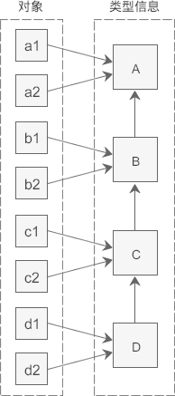

# 基础

## nullptr

传统 C++ 会把 NULL、0 视为同一种东西，这取决于编译器如何定义 NULL，有些编译器会将 NULL 定义为 `((void*)0)`，有些则会直接将其定义为 0。

C++ 不允许直接将 `void *` 隐式转换到其他类型。但如果编译器尝试把 NULL 定义为 `((void*)0)`，那么在下面这句代码中：

```
char *ch = NULL; //@ 不合法
```

而将 NULL 定义成 0 将导致 C++ 中重载特性发生混乱：

```
void foo(char*);
void foo(int);

//@ 实际调用 foo 函数
foo(NULL); //@ 将调用 foo(int)
```

nullptr 的类型是 std::nullptr_t。

## 列表初始化

- 统一了初始化方式
- 禁止类型收缩

## 类型推导

### auto

- 声明时必须初始化，编译器才能够根据初始化变量类型进行推导
- 结果为值类型推导，不显示指定引用类型，返回的是值类型
- 不显示的指定为指针或者引用类型将会丢掉 CV 特性

### decltype

- 在编译期间推导出表达式的类型，但是不会对表达式求值
- 能够保证与表达式的类型一致，即会保留引用和 CV 特性
- decltype((x)) 左值引用，decltype(m+n) 右值引用，decltype(m+=n) 左值引用

## const/volatile/mutable

### const

- 定义常量
- 传参时防止对参数修改
- 成员函数中，指定该函数不会修改类的成员
  - 常量对象必须调用常量成员函数，不能调用非常量成员函数；非常量对象都可以调用，优先调用非常量成员函数
  - 可以构成函数重载
  - const 修饰类的成员函数，实质上修饰的是成员函数影藏得 this 指针，表示该成员函数不能对类的成员变量做修改，所以 const 不可以修饰构造函数和析构函数和赋值运算符重载
- const 与指针
  - 常量指针：表示指针指向的内容是常量，const 在 * 前面
  - 指针常量：表示指针本身是常量，* 在 const 前面

### volatile

- 变量是易变的，不稳定的，禁止编译器的优化，编译器就不会去假设这个变量的值，优化器在用到这个变量时必须每次都小心地重新读取这个变量的值，而不是使用保存在寄存器里的备份
- 使用场合：
  - 并行设备的硬件寄存器，如状态寄存器
  - 一个中断服务程序中会访问到非自动变量
  - 多线程应用中几个任务共享的变量
- const 和 volatile 可以同时使用，一个例子是只读的状态寄存器。它是 volatile 因为它可能被意想不到地改变。它是const 因为程序不应该试图去修改它
- volatile 可以修饰指针，一个例子是当一个中服务子程序修该一个指向一个 buffer 的指针时

### mutable

- 只能修饰类的非静态成员变量
- 修饰的变量将永远处于可变的状态，即使在一个 const 函数中

## lambda 表达式

```
[捕获列表](参数列表) mutable(可选) 异常属性 -> 返回类型 {
	// 函数体
}
```

- 捕获列表中可以按值捕获或者按引用捕获，引用捕获在调用时进行捕获，而值捕获则是在定义之时进行捕获，
  - 捕获列表可以为空
  - 以值方式捕获所有的局部变量 `[=]`，以引用方式捕获局部变量 `[&]`
  - 捕获指向性的对象（指针、迭代器和引用）应该特别注意指向对象是否存在
- 参数列表如果为空可以省略
- 异常属性声明用于指定函数抛出的异常，如抛出整数类型的异常，可以使用 throw(int)
- 允许省略返回值类型定义，编译器会根据语句自动推导：
  - 采用自动推导时，如果有多处返回，类型需要保持一致
  - 不能推导初始化列表
- 按值捕获时，默认情况下 lambda 体中不允许修改变量的值，使用 mutable 修饰，修改变量后外部变量不会同步修改。如果使用 mutable 修饰，即使没有参数，也需要写明参数列表

lambda 表达式的使用场景：

- 线程入口函数
- 算法中的自定义函数，比如：count_if，sort，remove_if
- 作为一个大函数中多分支共同调用时的公共函数

## 函数对象包装器

C++ 中的可调用对象：

- 函数指针
- 具有 `operator()` 成员函数的类对象(仿函数)
- 可以转换成函数指针的类对象
- 类的成员(函数)指针

std::function 是可调用对象的包装器，是一个类模板，可以容纳除了类成员(函数)指针以外所有的可调用对象。

它也是对 C++ 中现有的可调用实体的一种类型安全的包裹，换句话说，就是函数的容器。当我们有了函数的容器之后便能够更加方便的将函数、函数指针作为对象进行处理。

## std::bind 和 std::placeholder

不论是普通函数、函数对象、还是成员函数，成员变量都可以 bind。作用：

- 将可调用对象与其参数绑定成一个仿函数
- 改变函数调用时需要传参的个数和顺序
- 先将可调用的对象保存起来，在需要的时候再调用，是一种延迟计算的思想

bind 类的非静态成员时，第一个参数需要是对象的实例。

## 右值引用

- 左值是表达式结束后依然存在的持久对象，右值是表达式结束就不会继续存在的临时对象
- 如果能对表达式取地址就是左值，否则就是右值
- 具名变量或对象都是左值，而右值是不具名的

C++ 11 中所有的值必属于：左值，将亡值，纯右值 三者之一，将亡值和纯右值都属于右值：

- 一个左值：
  - 变量、函数或数据成员
  - 返回左值引用的表达式，例如： `++x`、`x = 1`、`cout << ' '`、`(x)`
  - 字符串字面量是左值，而且是不可被更改的左值。字符串字面量并不具名，但是可以用 & 取地址所以也是左值，`std::cout<<&("hello")<<std::endl`
  - 一个表达式的类型是一个右值引用
- 一个是将亡值：
  - 将要被移动的对象
  - T&& 类型函数返回值
  - std::move 返回值
  - 转换为 T&& 的类型的转换函数的返回值
- 一个是纯右值
  - 非引用返回的临时变量
  - 运算表达式产生的临时变量，例如：`x+1`、`x++`
  - 字符串字面值之外的字面量
  - lambda 表达式

右值引用是对一个右值进行引用的类型，因为右值不具名，只能通过引用的方式找到它。如果一个 prvalue 被绑定到一个引用上，它的生命周期则会延长到跟这个引用变量一样长。

```
auto&& res = get_s();
```

## 万能引用与引用折叠

C++ 11中有万能引用（Universal Reference）的概念：使用`T&&`类型的形参既能绑定右值，又能绑定左值。但是，只有发生类型推导的时候，`T&&` 才表示万能引用；否则，表示右值引用。

一个模板函数，根据定义的形参和传入的实参的类型，可以有下面 4 种组合：

- 左值-左值 T& & # 函数定义的形参类型是左值引用，传入的实参是左值引用，结果是左值引用
- 左值-右值 T& && # 函数定义的形参类型是左值引用，传入的实参是右值引用，结果是左值引用
- 右值-左值 T&& & # 函数定义的形参类型是右值引用，传入的实参是左值引用，结果是左值引用
- 右值-右值 T&& && # 函数定义的形参类型是右值引用，传入的实参是右值引用，结果是右值引用

但是 C++ 中不允许对引用再进行引用，对于上述情况的处理有如下的规则：所有的折叠引用最终都代表一个引用，要么是左值引用，要么是右值引用。规则是：如果任一引用为左值引用，则结果为左值引用。否则（即两个都是右值引用），结果为右值引用。

## 移动语义

std::move并不能移动任何东西，它唯一的功能是将一个左值强制转化为右值引用，继而可以通过右值引用使用该值，以用于移动语义。从实现上讲，std::move基本等同于一个类型转换：`static_cast<T&&>(lvalue)`。

std::move 是将对象的状态或者所有权从一个对象转移到另一个对象，只是转移，没有内存的搬迁或者内存拷贝所以可以提高利用效率，改善性能。

在 C++11 之前，返回一个本地对象意味着这个对象会被拷贝，除非编译器发现可以做返回值优化（named return value optimization，或 NRVO），能把对象直接构造到调用者的栈上。从 C++11 开始，返回值优化仍可以发生，但在没有返回值优化的情况下，编译器将试图把本地对象移动出去，而不是拷贝出去。这一行为不需要用 std::move 进行干预——使用std::move 对于移动行为没有帮助，反而会影响返回值优化。    

```
template<typename T>
typename std::remove_reference<T>::type && move(T&& t)
{
	return static_cast<typename std::remove_reference<T>::type&&>(t);
}
```

## 完美转发

完美转发实现了参数在传递过程中保持其值属性的功能，即若是左值，则传递之后仍然是左值，若是右值，则传递之后仍然是右值。

完美转发利用 std::forward 实现：

- std::forward 不仅可以保持左值或者右值不变，同时还可以保持 CV 和引用等属性不变
- std::forward 只有在它的参数绑定到一个右值上的时候，它才转换参数到右值

## 异常

- 异常的处理流程是完全独立的，throw 抛出异常后就可以不用管了，错误处理代码都集中在专门的 catch 块里。这样就彻底分离了业务逻辑与错误逻辑，看起来更清楚
- 异常是绝对不能被忽略的，必须被处理。如果你有意或者无意不写 catch 捕获异常，那么它会一直向上传播出去，直至找到一个能够处理的 catch 块。如果实在没有，那就会导致程序立即停止运行

C++ 里对异常的定义非常宽松，任何类型都可以用 throw 抛出，也就是说，你可以直接把错误码（int）、或者错误消息`（char*、string）` 抛出，catch 也能接住，然后处理。 

异常的继承体系：   


应当使用异常的判断准则：  

- 不允许被忽略的错误
- 极少数情况下才会发生的错误
- 严重影响正常流程，很难恢复到正常状态的错误
- 无法本地处理，必须“穿透”调用栈，传递到上层才能被处理的错误

保证不抛出异常：

noexcept 专门用来修饰函数，告诉编译器：这个函数不会抛出异常。编译器看到noexcept，就得到了一个“保证”，就可以对函数做优化，不去加那些栈展开的额外代码，消除异常处理的成本。  

````
RetType function(params) noexcept; //@ most optimizable
RetType function(params) throw(); //@ C++98,less optimizable
RetType function(params); //@ less optimizable
````

noexcept 只是做出了一个“不可靠的承诺”，不是“强保证”，编译器无法彻底检查它的行为，标记为 noexcept 的函数也有可能抛出异常。

## C++ 中的类型转换

```
const_cast<T>(expression)
dynamic_cast<T>(expression)
reinterpret_cast<T>(expression) 
static_cast<T>(expression)
```

### static_cast

static_cast 是“静态转换”的意思，也就是在编译期间转换，转换失败的话会抛出一个编译错误。

static_cast 只能用于良性转换，这样的转换风险较低，一般不会发生什么意外，例如：

- 原有的自动类型转换，例如 short 转 int、int 转 double、非 const 转 const、向上转型等
- void 指针和具体类型指针之间的转换，例如 `void *`转`int *`、`char *`转`void *`等
- 有转换构造函数或者类型转换函数的类与其它类型之间的转换，例如 double 转 Complex（调用转换构造函数）、Complex 转 double（调用类型转换函数）
- 需要注意的是，static_cast 不能用于无关类型之间的转换，因为这些转换都是有风险的，例如：
  - 两个具体类型指针之间的转换，例如`int *`转`double *`、`Student *`转`int *`等。不同类型的数据存储格式不一样，长度也不一样，容易导致错误
  - int 和指针之间的转换。将一个具体的地址赋值给指针变量是非常危险的，因为该地址上的内存可能没有分配，也可能没有读写权限，恰好是可用内存反而是小概率事件

### const_cast

const_cast 比较好理解，它用来去掉表达式的 const 修饰或 volatile 修饰。换句话说，const_cast 就是用来将 const/volatile 类型转换为非 const/volatile 类型。

### reinterpret_cast

reinterpret_cast 这种转换仅仅是对二进制位的重新解释，不会借助已有的转换规则对数据进行调整，非常简单粗暴，所以风险很高。

reinterpret_cast 可以认为是 static_cast 的一种补充，一些 static_cast 不能完成的转换，就可以用 reinterpret_cast 来完成，例如：

- 两个具体类型指针之间的转换
- int 和指针之间的转换

### dynamic_cast

dynamic_cast 用于在类的继承层次之间进行类型转换，它既允许向上转型，也允许向下转型。向上转型是无条件的，不会进行任何检测，所以都能成功；向下转型的前提必须是安全的，要借助 RTTI 进行检测，所有只有一部分能成功。

dynamic_cast 是“动态转换”的意思，dynamic_cast 会在程序运行期间借助 RTTI 进行类型转换，这就要求基类必须包含虚函数；static_cast 在编译期间完成类型转换，能够更加及时地发现错误。

dynamic_cast 只能转换指针类型和引用类型，对于指针，如果转换失败将返回 NULL；对于引用，如果转换失败将抛出`std::bad_cast`异常。

每个类都会在内存中保存一份类型信息，编译器会将存在继承关系的类的类型信息使用指针“连接”起来，从而形成一个继承链。

向上转型：

向上转型时，只要待转换的两个类型之间存在继承关系，并且基类包含了虚函数（这些信息在编译期间就能确定），就一定能转换成功。因为向上转型始终是安全的，所以 dynamic_cast 不会进行任何运行期间的检查，此时 dynamic_cast 和 static_cast 就没有什么区别了。

向下转型：

向下转型是有风险的，dynamic_cast 会借助 RTTI 信息进行检测，确定安全的才能转换成功，否则就转换失败。

```
#include <iostream>
using namespace std;

class A{
public:
    virtual void func() const { cout<<"Class A"<<endl; }
private:
    int m_a;
};

class B: public A{
public:
    virtual void func() const { cout<<"Class B"<<endl; }
private:
    int m_b;
};

class C: public B{
public:
    virtual void func() const { cout<<"Class C"<<endl; }
private:
    int m_c;
};

class D: public C{
public:
    virtual void func() const { cout<<"Class D"<<endl; }
private:
    int m_d;
};

int main(){
    A *pa = new A();
    B *pb;
    C *pc;
   

    pb = dynamic_cast<B*>(pa);  //向下转型失败
    if(pb == NULL){
        cout<<"Downcasting failed: A* to B*"<<endl;
    }else{
        cout<<"Downcasting successfully: A* to B*"<<endl;
        pb -> func();
    }
    pc = dynamic_cast<C*>(pa);  //向下转型失败
    if(pc == NULL){
        cout<<"Downcasting failed: A* to C*"<<endl;
    }else{
        cout<<"Downcasting successfully: A* to C*"<<endl;
        pc -> func();
    }
   
    cout<<"-------------------------"<<endl;
   

    pa = new D();  //向上转型都是允许的
    pb = dynamic_cast<B*>(pa);  //向下转型成功
    if(pb == NULL){
        cout<<"Downcasting failed: A* to B*"<<endl;
    }else{
        cout<<"Downcasting successfully: A* to B*"<<endl;
        pb -> func();
    }
    pc = dynamic_cast<C*>(pa);  //向下转型成功
    if(pc == NULL){
        cout<<"Downcasting failed: A* to C*"<<endl;
    }else{
        cout<<"Downcasting successfully: A* to C*"<<endl;
        pc -> func();
    }
   
    return 0;
}
```



dynamic_cast 会在程序运行过程中遍历继承链，如果途中遇到了要转换的目标类型，那么就能够转换成功，如果直到继承链的顶点（最顶层的基类）还没有遇到要转换的目标类型，那么就转换失败。对于同一个指针（例如 pa），它指向的对象不同，会导致遍历继承链的起点不一样，途中能够匹配到的类型也不一样，所以相同的类型转换产生了不同的结果。

## 正则表达式

C++ 正则匹配有三个算法，注意它们都是“只读”的，不会变动原字符串：

- regex_match()：完全匹配一个字符串
- regex_search()：在字符串里查找一个正则匹配
- regex_replace()：正则查找再做替换  

特殊字符：


限定符：


# 内存管理

## 内存布局


其地址空间由低到高。其中：

- Code Segment(代码段或Text Segment)中存放着程序的机器码和只读数据，可执行指令就是从这里取得的。如果可能，系统会安排相同程序的多个运行实体共享这些实例代码。这个段在内存中一般被标记为只读，任何对该区的写操作都会导致段错误（Segmentation Fault）。
- Data Segment中存放已初始化的全局或静态变量。
- BSS中存放未初始化的全局或静态变量。
- Heap(堆)，堆的大小并不固定，可动态扩张或缩减。其分配由malloc()、new()等这类实时内存分配函数来实现(brk函数也是从这里分配内存)。
- Stack(栈)，用来存储函数调用时的临时信息，如函数调用所传递的参数、函数的返回地址、函数的局部变量等。 在程序运行时由编译器在需要的时候分配，在不需要的时候自动清除。栈内存的申请和释放遵循LIFO(先进后出)。

堆和栈有哪些不同：

- 分配和管理方式不同
  - 堆是动态分配的，其空间的分配和释放都由程序员控制
  - 栈由编译器自动管理。栈有两种分配方式：静态分配和动态分配。静态分配由编译器完成，比如局部变量的分配。动态分配由_alloca()函数进行分配，但是栈的动态分配和堆是不同的，它的动态分配是由编译器进行释放，无须手工控制。
- 产生碎片不同
  - 对堆来说，频繁的new/delete或者malloc/free可能会造成内存空间的不连续，造成大量的碎片，使程序效率降低
  - 对栈而言，则不存在碎片问题，因为栈是先进后出的队列，永远不可能有一个内存块从栈中间弹出。
- 增长方向不同
  - 堆由低地址向高地址增长。
  - 栈由高地址向低地址增长。

https://zhuanlan.zhihu.com/p/51855842

https://yqlab.me/archives/54.html