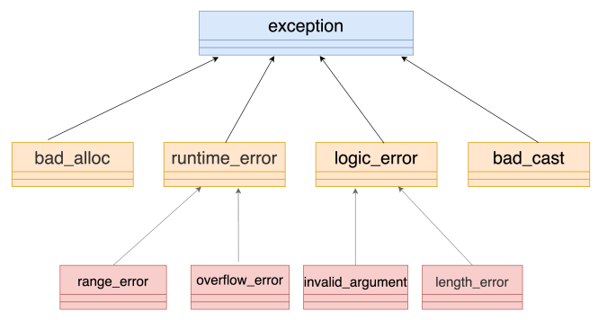

# 基础

## nullptr

传统 C++ 会把 NULL、0 视为同一种东西，这取决于编译器如何定义 NULL，有些编译器会将 NULL 定义为 `((void*)0)`，有些则会直接将其定义为 0。

C++ 不允许直接将 `void *` 隐式转换到其他类型。但如果编译器尝试把 NULL 定义为 `((void*)0)`，那么在下面这句代码中：

```
char *ch = NULL; //@ 不合法
```

而将 NULL 定义成 0 将导致 C++ 中重载特性发生混乱：

```
void foo(char*);
void foo(int);

//@ 实际调用 foo 函数
foo(NULL); //@ 将调用 foo(int)
```

nullptr 的类型是 std::nullptr_t。

## 列表初始化

- 统一了初始化方式
- 禁止类型收缩

## 类型推导

### auto

- 声明时必须初始化，编译器才能够根据初始化变量类型进行推导
- 结果为值类型推导，不显示指定引用类型，返回的是值类型
- 不显示的指定为指针或者引用类型将会丢掉 CV 特性

### decltype

- 在编译期间推导出表达式的类型，但是不会对表达式求值
- 能够保证与表达式的类型一致，即会保留引用和 CV 特性
- decltype((x)) 左值引用，decltype(m+n) 右值引用，decltype(m+=n) 左值引用

## const/volatile/mutable

### const

- 定义常量
- 传参时防止对参数修改
- 成员函数中，指定该函数不会修改类的成员
  - 常量对象必须调用常量成员函数，不能调用非常量成员函数；非常量对象都可以调用，优先调用非常量成员函数
  - 可以构成函数重载
  - const 修饰类的成员函数，实质上修饰的是成员函数影藏得 this 指针，表示该成员函数不能对类的成员变量做修改，所以 const 不可以修饰构造函数和析构函数和赋值运算符重载
- const 与指针
  - 常量指针：表示指针指向的内容是常量，const 在 * 前面
  - 指针常量：表示指针本身是常量，* 在 const 前面

### volatile

- 变量是易变的，不稳定的，禁止编译器的优化，编译器就不会去假设这个变量的值，优化器在用到这个变量时必须每次都小心地重新读取这个变量的值，而不是使用保存在寄存器里的备份
- 使用场合：
  - 并行设备的硬件寄存器，如状态寄存器
  - 一个中断服务程序中会访问到非自动变量
  - 多线程应用中几个任务共享的变量
- const 和 volatile 可以同时使用，一个例子是只读的状态寄存器。它是 volatile 因为它可能被意想不到地改变。它是const 因为程序不应该试图去修改它
- volatile 可以修饰指针，一个例子是当一个中服务子程序修该一个指向一个 buffer 的指针时

### mutable

- 只能修饰类的非静态成员变量
- 修饰的变量将永远处于可变的状态，即使在一个 const 函数中

## lambda 表达式

```
[捕获列表](参数列表) mutable(可选) 异常属性 -> 返回类型 {
	// 函数体
}
```

- 捕获列表中可以按值捕获或者按引用捕获，引用捕获在调用时进行捕获，而值捕获则是在定义之时进行捕获，
  - 捕获列表可以为空
  - 以值方式捕获所有的局部变量 `[=]`，以引用方式捕获局部变量 `[&]`
  - 捕获指向性的对象（指针、迭代器和引用）应该特别注意指向对象是否存在
- 参数列表如果为空可以省略
- 异常属性声明用于指定函数抛出的异常，如抛出整数类型的异常，可以使用 throw(int)
- 允许省略返回值类型定义，编译器会根据语句自动推导：
  - 采用自动推导时，如果有多处返回，类型需要保持一致
  - 不能推导初始化列表
- 按值捕获时，默认情况下 lambda 体中不允许修改变量的值，使用 mutable 修饰，修改变量后外部变量不会同步修改。如果使用 mutable 修饰，即使没有参数，也需要写明参数列表

lambda 表达式的使用场景：

- 线程入口函数
- 算法中的自定义函数，比如：count_if，sort，remove_if
- 作为一个大函数中多分支共同调用时的公共函数

## 函数对象包装器

C++ 中的可调用对象：

- 函数指针
- 具有 `operator()` 成员函数的类对象(仿函数)
- 可以转换成函数指针的类对象
- 类的成员(函数)指针

std::function 是可调用对象的包装器，是一个类模板，可以容纳除了类成员(函数)指针以外所有的可调用对象。

它也是对 C++ 中现有的可调用实体的一种类型安全的包裹，换句话说，就是函数的容器。当我们有了函数的容器之后便能够更加方便的将函数、函数指针作为对象进行处理。

## std::bind 和 std::placeholder

不论是普通函数、函数对象、还是成员函数，成员变量都可以 bind。作用：

- 将可调用对象与其参数绑定成一个仿函数
- 改变函数调用时需要传参的个数和顺序
- 先将可调用的对象保存起来，在需要的时候再调用，是一种延迟计算的思想

bind 类的非静态成员时，第一个参数需要是对象的实例。

## 右值引用

- 左值是表达式结束后依然存在的持久对象，右值是表达式结束就不会继续存在的临时对象
- 如果能对表达式取地址就是左值，否则就是右值
- 具名变量或对象都是左值，而右值是不具名的

C++ 11 中所有的值必属于：左值，将亡值，纯右值 三者之一，将亡值和纯右值都属于右值：

- 一个左值：
  - 变量、函数或数据成员
  - 返回左值引用的表达式，例如： `++x`、`x = 1`、`cout << ' '`、`(x)`
  - 字符串字面量是左值，而且是不可被更改的左值。字符串字面量并不具名，但是可以用 & 取地址所以也是左值，`std::cout<<&("hello")<<std::endl`
  - 一个表达式的类型是一个右值引用
- 一个是将亡值：
  - 将要被移动的对象
  - T&& 类型函数返回值
  - std::move 返回值
  - 转换为 T&& 的类型的转换函数的返回值
- 一个是纯右值
  - 非引用返回的临时变量
  - 运算表达式产生的临时变量，例如：`x+1`、`x++`
  - 字符串字面值之外的字面量
  - lambda 表达式

右值引用是对一个右值进行引用的类型，因为右值不具名，只能通过引用的方式找到它。如果一个 prvalue 被绑定到一个引用上，它的生命周期则会延长到跟这个引用变量一样长。

```
auto&& res = get_s();
```

## 万能引用与引用折叠

C++ 11中有万能引用（Universal Reference）的概念：使用`T&&`类型的形参既能绑定右值，又能绑定左值。但是，只有发生类型推导的时候，`T&&` 才表示万能引用；否则，表示右值引用。

一个模板函数，根据定义的形参和传入的实参的类型，可以有下面 4 种组合：

- 左值-左值 T& & # 函数定义的形参类型是左值引用，传入的实参是左值引用，结果是左值引用
- 左值-右值 T& && # 函数定义的形参类型是左值引用，传入的实参是右值引用，结果是左值引用
- 右值-左值 T&& & # 函数定义的形参类型是右值引用，传入的实参是左值引用，结果是左值引用
- 右值-右值 T&& && # 函数定义的形参类型是右值引用，传入的实参是右值引用，结果是右值引用

但是 C++ 中不允许对引用再进行引用，对于上述情况的处理有如下的规则：所有的折叠引用最终都代表一个引用，要么是左值引用，要么是右值引用。规则是：如果任一引用为左值引用，则结果为左值引用。否则（即两个都是右值引用），结果为右值引用。

## 移动语义

std::move并不能移动任何东西，它唯一的功能是将一个左值强制转化为右值引用，继而可以通过右值引用使用该值，以用于移动语义。从实现上讲，std::move基本等同于一个类型转换：`static_cast<T&&>(lvalue)`。

std::move 是将对象的状态或者所有权从一个对象转移到另一个对象，只是转移，没有内存的搬迁或者内存拷贝所以可以提高利用效率，改善性能。

在 C++11 之前，返回一个本地对象意味着这个对象会被拷贝，除非编译器发现可以做返回值优化（named return value optimization，或 NRVO），能把对象直接构造到调用者的栈上。从 C++11 开始，返回值优化仍可以发生，但在没有返回值优化的情况下，编译器将试图把本地对象移动出去，而不是拷贝出去。这一行为不需要用 std::move 进行干预——使用std::move 对于移动行为没有帮助，反而会影响返回值优化。    

```
template<typename T>
typename std::remove_reference<T>::type && move(T&& t)
{
	return static_cast<typename std::remove_reference<T>::type&&>(t);
}
```

## 完美转发

完美转发实现了参数在传递过程中保持其值属性的功能，即若是左值，则传递之后仍然是左值，若是右值，则传递之后仍然是右值。

完美转发利用 std::forward 实现：

- std::forward 不仅可以保持左值或者右值不变，同时还可以保持 CV 和引用等属性不变
- std::forward 只有在它的参数绑定到一个右值上的时候，它才转换参数到右值

## 异常

- 异常的处理流程是完全独立的，throw 抛出异常后就可以不用管了，错误处理代码都集中在专门的 catch 块里。这样就彻底分离了业务逻辑与错误逻辑，看起来更清楚
- 异常是绝对不能被忽略的，必须被处理。如果你有意或者无意不写 catch 捕获异常，那么它会一直向上传播出去，直至找到一个能够处理的 catch 块。如果实在没有，那就会导致程序立即停止运行

C++ 里对异常的定义非常宽松，任何类型都可以用 throw 抛出，也就是说，你可以直接把错误码（int）、或者错误消息`（char*、string）` 抛出，catch 也能接住，然后处理。 

异常的继承体系：   


应当使用异常的判断准则：  

- 不允许被忽略的错误
- 极少数情况下才会发生的错误
- 严重影响正常流程，很难恢复到正常状态的错误
- 无法本地处理，必须“穿透”调用栈，传递到上层才能被处理的错误

保证不抛出异常：

noexcept 专门用来修饰函数，告诉编译器：这个函数不会抛出异常。编译器看到noexcept，就得到了一个“保证”，就可以对函数做优化，不去加那些栈展开的额外代码，消除异常处理的成本。  

````
RetType function(params) noexcept; //@ most optimizable
RetType function(params) throw(); //@ C++98,less optimizable
RetType function(params); //@ less optimizable
````

noexcept 只是做出了一个“不可靠的承诺”，不是“强保证”，编译器无法彻底检查它的行为，标记为 noexcept 的函数也有可能抛出异常。

## C++ 中的类型转换

```
const_cast<T>(expression)
dynamic_cast<T>(expression)
reinterpret_cast<T>(expression) 
static_cast<T>(expression)
```

### static_cast

static_cast 是“静态转换”的意思，也就是在编译期间转换，转换失败的话会抛出一个编译错误。

static_cast 只能用于良性转换，这样的转换风险较低，一般不会发生什么意外，例如：

- 原有的自动类型转换，例如 short 转 int、int 转 double、非 const 转 const、向上转型等
- void 指针和具体类型指针之间的转换，例如 `void *`转`int *`、`char *`转`void *`等
- 有转换构造函数或者类型转换函数的类与其它类型之间的转换，例如 double 转 Complex（调用转换构造函数）、Complex 转 double（调用类型转换函数）
- 需要注意的是，static_cast 不能用于无关类型之间的转换，因为这些转换都是有风险的，例如：
  - 两个具体类型指针之间的转换，例如`int *`转`double *`、`Student *`转`int *`等。不同类型的数据存储格式不一样，长度也不一样，容易导致错误
  - int 和指针之间的转换。将一个具体的地址赋值给指针变量是非常危险的，因为该地址上的内存可能没有分配，也可能没有读写权限，恰好是可用内存反而是小概率事件

### const_cast

const_cast 比较好理解，它用来去掉表达式的 const 修饰或 volatile 修饰。换句话说，const_cast 就是用来将 const/volatile 类型转换为非 const/volatile 类型。

### reinterpret_cast

reinterpret_cast 这种转换仅仅是对二进制位的重新解释，不会借助已有的转换规则对数据进行调整，非常简单粗暴，所以风险很高。

reinterpret_cast 可以认为是 static_cast 的一种补充，一些 static_cast 不能完成的转换，就可以用 reinterpret_cast 来完成，例如：

- 两个具体类型指针之间的转换
- int 和指针之间的转换

### dynamic_cast

dynamic_cast 用于在类的继承层次之间进行类型转换，它既允许向上转型，也允许向下转型。向上转型是无条件的，不会进行任何检测，所以都能成功；向下转型的前提必须是安全的，要借助 RTTI 进行检测，所有只有一部分能成功。

dynamic_cast 是“动态转换”的意思，dynamic_cast 会在程序运行期间借助 RTTI 进行类型转换，这就要求基类必须包含虚函数；static_cast 在编译期间完成类型转换，能够更加及时地发现错误。

dynamic_cast 只能转换指针类型和引用类型，对于指针，如果转换失败将返回 NULL；对于引用，如果转换失败将抛出`std::bad_cast`异常。

每个类都会在内存中保存一份类型信息，编译器会将存在继承关系的类的类型信息使用指针“连接”起来，从而形成一个继承链。

向上转型：

向上转型时，只要待转换的两个类型之间存在继承关系，并且基类包含了虚函数（这些信息在编译期间就能确定），就一定能转换成功。因为向上转型始终是安全的，所以 dynamic_cast 不会进行任何运行期间的检查，此时 dynamic_cast 和 static_cast 就没有什么区别了。

向下转型：

向下转型是有风险的，dynamic_cast 会借助 RTTI 信息进行检测，确定安全的才能转换成功，否则就转换失败。

```
#include <iostream>
using namespace std;

class A{
public:
    virtual void func() const { cout<<"Class A"<<endl; }
private:
    int m_a;
};

class B: public A{
public:
    virtual void func() const { cout<<"Class B"<<endl; }
private:
    int m_b;
};

class C: public B{
public:
    virtual void func() const { cout<<"Class C"<<endl; }
private:
    int m_c;
};

class D: public C{
public:
    virtual void func() const { cout<<"Class D"<<endl; }
private:
    int m_d;
};

int main(){
    A *pa = new A();
    B *pb;
    C *pc;
   

    pb = dynamic_cast<B*>(pa);  //向下转型失败
    if(pb == NULL){
        cout<<"Downcasting failed: A* to B*"<<endl;
    }else{
        cout<<"Downcasting successfully: A* to B*"<<endl;
        pb -> func();
    }
    pc = dynamic_cast<C*>(pa);  //向下转型失败
    if(pc == NULL){
        cout<<"Downcasting failed: A* to C*"<<endl;
    }else{
        cout<<"Downcasting successfully: A* to C*"<<endl;
        pc -> func();
    }
   
    cout<<"-------------------------"<<endl;
   

    pa = new D();  //向上转型都是允许的
    pb = dynamic_cast<B*>(pa);  //向下转型成功
    if(pb == NULL){
        cout<<"Downcasting failed: A* to B*"<<endl;
    }else{
        cout<<"Downcasting successfully: A* to B*"<<endl;
        pb -> func();
    }
    pc = dynamic_cast<C*>(pa);  //向下转型成功
    if(pc == NULL){
        cout<<"Downcasting failed: A* to C*"<<endl;
    }else{
        cout<<"Downcasting successfully: A* to C*"<<endl;
        pc -> func();
    }
   
    return 0;
}
```


dynamic_cast 会在程序运行过程中遍历继承链，如果途中遇到了要转换的目标类型，那么就能够转换成功，如果直到继承链的顶点（最顶层的基类）还没有遇到要转换的目标类型，那么就转换失败。对于同一个指针（例如 pa），它指向的对象不同，会导致遍历继承链的起点不一样，途中能够匹配到的类型也不一样，所以相同的类型转换产生了不同的结果。

## 正则表达式

C++ 正则匹配有三个算法，注意它们都是“只读”的，不会变动原字符串：

- regex_match()：完全匹配一个字符串
- regex_search()：在字符串里查找一个正则匹配
- regex_replace()：正则查找再做替换  

特殊字符：


限定符：


# 内存管理

## 内存布局


其地址空间由低到高。其中：

- Code Segment (代码段或Text Segment)中存放着程序的机器码和只读数据，可执行指令就是从这里取得的。如果可能，系统会安排相同程序的多个运行实体共享这些实例代码。这个段在内存中一般被标记为只读，任何对该区的写操作都会导致段错误（Segmentation Fault）
- Data Segment 中存放已初始化的全局或静态变量
- BSS 中存放未初始化的全局或静态变量
- Heap(堆)，堆的大小并不固定，可动态扩张或缩减。其分配由 malloc()、new() 等这类实时内存分配函数来实现(brk函数也是从这里分配内存)
- Stack(栈)，用来存储函数调用时的临时信息，如函数调用所传递的参数、函数的返回地址、函数的局部变量等。 在程序运行时由编译器在需要的时候分配，在不需要的时候自动清除。栈内存的申请和释放遵循LIFO(先进后出)

堆和栈有哪些不同：

- 分配和管理方式不同
  - 堆是动态分配的，其空间的分配和释放都由程序员控制
  - 栈由编译器自动管理。栈有两种分配方式：静态分配和动态分配。静态分配由编译器完成，比如局部变量的分配。动态分配由_alloca()函数进行分配，但是栈的动态分配和堆是不同的，它的动态分配是由编译器进行释放，无须手工控制
- 产生碎片不同
  - 对堆来说，频繁的new/delete或者malloc/free可能会造成内存空间的不连续，造成大量的碎片，使程序效率降低
  - 对栈而言，则不存在碎片问题，因为栈是先进后出的队列，永远不可能有一个内存块从栈中间弹出
- 增长方向不同
  - 堆由低地址向高地址增长
  - 栈由高地址向低地址增长

## C++ 中的 new

C++ 中的new有三种形态：

### new operator

new operator 即我们经常使用的 `T *ptr = new T()`

new 操作符的执行过程：

- 调用operator new分配内存
- 调用构造函数生成类对象
- 返回相应指针

### operator new

- 只分配所要求的空间，不调用相关对象的构造函数。当无法满足所要求分配的空间时，则
  - 如果有 new_handler，则调用 new_handler
  - 否则如果没要求不抛出异常（以nothrow参数表达），则执行 bad_alloc 异常，否则返回 0
- 可以被重载
  - 重载时，返回类型必须声明为 void*
  - 重载时，第一个参数类型必须为表达要求分配空间的大小（字节），类型为 size_t
  - 重载时，可以带其它参数

### placement new

placement new 可以实现在一块指定的内存上(这块内存可以由任意方式分配)构造对象(调用对象的构造函数)

Placement new 使用步骤：

缓存提前分配，有三种方法：

- 在堆上分配：

```
class Task ;
char * buff = new [sizeof(Task)]; //@ 分配内存
```

- 在栈上进行分配：

```
class Task ;
char buf[N*sizeof(Task)]; //@ 分配内存
```

- 直接通过地址(必须是有意义的地址)来使用：

```
void* buf = reinterpret_cast<void*> (0xF00F);
```

对象的分配，在刚才已分配的缓存区调用 placement new 来构造一个对象：

```
Task *ptask = new (buf) Task
```

对象的析构，一旦你使用完这个对象，你必须调用它的析构函数来毁灭它。按照下面的方式调用析构函数：

```
ptask->~Task(); //@ 调用析构函数
```

释放，可以反复利用缓存并给它分配一个新的对象，如果你不打算再次使用这个缓存，你可以象这样释放它：

```
delete [] buf;
```

## std::shared_ptr

 shared_ptr 对象在内部指向两个内存位置：

- 指向对象的指针
- 用于控制引用计数数据的指针

```
std::shared_ptr<int> ptr2(new int());
```

此方法在堆上创建了两块内存：

- 存储 int
- 控制块上用于引用计数的内存，管理附加此内存的 shared_ptr 对象的计数，最初计数将为1

```
std::shared_ptr<int> ptr = std::make_shared<int>();
```

一次性为 int 对象和用于引用计数的数据都分配了内存，而 new 操作符只是为 int 分配了内存。加上 O2 优化选项的时候，make_shared会比 new 快上将近 1 倍。

指定删除器：智能指针初始化时可以指定删除器，当引用计数为 0 时会自动调用删除器。std::default_delete 内部通过调用 delete 实现功能

禁止使用一个原始指针初始化多个 std::shared_ptr：

```
int * ptr = new int;
std::shared_ptr<int> sp1(ptr);
std::shared_ptr<int> sp2(ptr); //@ 会导致 double free
```

禁止在函数实参中创建 std::shared_ptr：

```
func(std::shared_ptr<int>(new int),g());
```

因为 C++ 函数的参数计算顺序在不同的编译器有不同的调用约定，一般时从右向左，也可能从左到右。可能的步骤：

- 先调用 new int
- 再调用 g() 
- 再创建  std::shared_ptr

如果 g() 函数调用时发生异常，则  std::shared_ptr 还没有创建，new int 的内存就会泄漏。正确的写法：

```
std::shared_ptr<int> 
sp(new int)f(sp,g());
```

通过 shared_from_this() 返回 this 指针：

不要将 this 指针作为 std::shared_ptr 返回，因为 this 本质上是一个裸指针，因此可能导致重复析构，其本质就是使用同一个裸指针初始化多个 std::shared_ptr。

正确返回 this 的 std::shared_ptr  的方法是：让目标类通过派生 `std::enable_shared_from_this<T> ` 类，然后使用基类的成员函数 shared_from_this 来返回 this 的  std::shared_ptr：

```
struct A : std::enable_shared_from_this<A>
{
	std::shared_ptr<A> self()
	{
		return shared_from_this();
	}
};

int main(void)
{
	std::shared_ptr<A> sp1(new A);
	std::shared_ptr<A> sp2 = sp1->self();
	return 0;
}
```

循环引用：

智能指针的循环引用将导致内存泄漏，解决办法是将 A 和 B 中任何一个成员变量改成 std::weak_ptr。

```
//@ 引用计数类
class SharedCount
{
private:
	std::atomic_long count_;

public:
	SharedCount() noexcept : count_(1)
	{
	}

	void add_count() noexcept
	{
		count_.fetch_add(1,std::memory_order_relaxed);
	}

	long reduce_count() noexcept
	{
		--count_;
		return count_;
	}

	long get_count() const noexcept
	{
		return count_;
	}
};

//@ 智能指针类
template <typename T>
class SharedPtr
{
private:
	T* ptr_;
	SharedCount* shared_count_;

public:
	//@ 声明友元，访问其他实体类型的引用变量
	template <typename U>
	friend class SharedPtr;

	//@ 构造函数
	explicit SharedPtr(T* ptr = nullptr) : ptr_(ptr)
	{
		if (ptr)
		{
			shared_count_ = new SharedCount();
		}
	}

	//@ 析构函数
	~SharedPtr()
	{
		if (ptr_ && shared_count_->reduce_count() == 0)
		{
			delete ptr_;
			delete shared_count_;
		}
	}

	//@ 拷贝构造函数
	SharedPtr(const SharedPtr& other) noexcept
	{
		ptr_ = other.ptr_;
		if (ptr_)
		{
			//@ 如果指针存在，other的引用计数器+1
			other.shared_count_->add_count();
			shared_count_ = other.shared_count_;
		}
	}

	template <typename U>
	SharedPtr(const SharedPtr<U>& other) noexcept
	{
		ptr_ = other.ptr_;
		if (ptr_)
		{
			//@ 如果指针存在，other的引用计数器+1
			other.shared_count_->add_count();
			shared_count_ = other.shared_count_;
		}
	}

	//@ 移动构造函数
	template <typename U>
	SharedPtr(SharedPtr<U>&& other) noexcept
	{
		ptr_ = other.ptr_;
		if (ptr_)
		{
			shared_count_ = other.shared_count_;
			other.ptr_ = nullptr;
		}
	}

	template <typename U>
	SharedPtr(const SharedPtr<U>& other, T* ptr) noexcept
	{
		ptr_ = ptr;
		if (ptr_)
		{
			other.shared_count_->add_count();
			shared_count_ = other.shared_count_;
		}
	}

	//@ swap函数
	void swap(SharedPtr& rhs) noexcept
	{
		using std::swap;
		swap(ptr_, rhs.ptr_);
		swap(shared_count_, rhs.shared_count_);
	}

	//@ 重载赋值运算符(通过交换实现，形参本来就是传值，不影响原来传入的rhs)
	SharedPtr& operator = (SharedPtr rhs) noexcept
	{
		rhs.swap(*this);
		return *this;
	}

	//@ 返回智能指针ptr_成员变量
	T* get() const noexcept
	{
		return ptr_;
	}

	//@ 返回引用计数
	long use_count() const noexcept
	{
		if (ptr_)
		{
			return shared_count_->get_count();
		}
		else
		{
			return 0;
		}
	}

	//@ * 解引用
	T& operator*() const noexcept
	{
		return *ptr_;
	}
	//@ -> 箭头(返回指针)
	T* operator->() const noexcept
	{
		return ptr_;
	}
	//@ bool()
	operator bool() const noexcept
	{
		return ptr_;
	}
};

//@ swap全局函数
template <typename T>
void swap(SharedPtr<T>& lhs, SharedPtr<T>& rhs) noexcept
{
	lhs.swap(rhs);
}

//@ C++强制类型转换
//@ static_cast
template <typename T, typename U>
SharedPtr<T> static_pointer_cast(const SharedPtr<U>& other) noexcept
{
	T* ptr = static_cast<T*> (other.get());
	return SharedPtr<T>(other, ptr);
}
//@ reinterpret_cast
template <typename T, typename U>
SharedPtr<T> reinterpret_pointer_cast(const SharedPtr<U>& other) noexcept
{
	T* ptr = reinterpret_cast<T*> (other.get());
	return SharedPtr<T>(other, ptr);
}
//@ const_cast
template <typename T, typename U>
SharedPtr<T> const_pointer_cast(const SharedPtr<U>& other) noexcept
{
	T* ptr = const_cast<T*> (other.get());
	return SharedPtr<T>(other, ptr);
}
//@ dynamic_cast
template <typename T, typename U>
SharedPtr<T> dynamic_pointer_cast(const SharedPtr<U>& other) noexcept
{
	T* ptr = dynamic_cast<T*> (other.get());
	return SharedPtr<T>(other, ptr);
}

//@ 工厂函数
template <typename T, typename...Args>
SharedPtr<T> make_sharedptr(Args...args)
{
	return SharedPtr<T>(new T(std::forward<Args>(args)...));
}


//@ 测试
struct Base
{
	Base(int i) :a(i) {}

	virtual double get_val() = 0;

	double get_a()
	{
		return a;
	}

public:
	int a;
};

struct Derived final : Base
{
	Derived(int i, double d) : Base(i), b(d)
	{
	}

	virtual double get_val() override
	{
		return b * a;
	}

	double get_b()
	{
		return b;
	}

public:
	double b;
};

int main()
{
	SharedPtr<Base> pb = make_sharedptr<Derived>(10, 3.12);
	std::cout << pb.use_count() << std::endl;
	SharedPtr<Base> pb2 = pb;
	std::cout << pb.use_count() << std::endl;

	std::cout << pb->get_a() << std::endl;
	std::cout << static_pointer_cast<Derived>(pb)->get_b() << std::endl;
	std::cout << dynamic_pointer_cast<Derived>(pb)->get_val() << std::endl;


	SharedPtr<Base> pb3 = std::move(pb);
	std::cout << pb.use_count() << std::endl;
	std::cout << pb2.use_count() << std::endl;
	std::cout << pb3.use_count() << std::endl;

	return 0;
}
```

## std::unique_ptr

std::unique_ptr 是一种独占的智能指针，它禁止其他智能指针与其共享同一个对象，从而保证代码的安全。

既然是独占，换句话说就是不可复制。但是，可以利用 std::move  将其转移给其他的 unique_ptr。

make_unique 并不复杂，C++11 没有提供 std::make_unique，可以自行实现：

```
//@ 支持普通指针
template <typename T, typename...Args>
inline typename std::enable_if<!std::is_array<T>::value, std::unique_ptr<T>>::type
make_unique(Args&&...args)
{
	return std::unique_ptr<T>(new T(std::forward<Args>(args)...));
}

//@ 支持动态数组
template <typename T>
inline typename std::enable_if<std::is_array<T>::value && std::extent<T>::value == 0, std::unique_ptr<T>>::type
make_unique(size_t size)
{
	typedef typename std::remove_extent<T>::type U;
	return std::unique_ptr<T>(new U[size]());
}

//@ 过滤掉定长数组
template <typename T, typename...Args>
typename std::enable_if<std::extent<T>::value != 0, void>::type make_unique(Args&&...) = delete;


std::unique_ptr<int> p = make_unique<int>(10); //@ OK
std::unique_ptr<int[]> pArray1 = make_unique<int[]>(10); //@ OK
std::unique_ptr<int[]> pArray2 = make_unique<int[10]>; //@ 错误，不能创建定长数组的 std::unique_ptr
```

std::unique_ptr  指定删除器时需要确定删除器的类型：

```
std::shared_ptr<int> ptr(new int(1), [](int *p) { delete p; }); //@ OK
std::unique_ptr<int> ptr2(new int(1), [](int *p) { delete p; }); //@ 错误

//@ lambda 没有捕捉变量时是正确的，因为没有捕获变量的 lambda 可以转换成函数指针，如果捕捉了变量则不可以
std::unique_ptr<int, void(*)(int*)> ptr3(new int(1), [](int *p) { delete p; });

//@ 如果希望 std::unique_ptr 的删除器支持 lambda 则应该写成：
std::unique_ptr<int, std::function<void(int*)>> ptr4(new int(1), [&](int *p) { delete p; });

//@ 使用仿函数作为删除器
struct MyDeleter
{
    void operator()(int*p)
    {
        std::cout << "delete" << std::endl;
        delete p;
    }
};
std::unique_ptr<int, MyDeleter> ptr5(new int(1));
```

## std::weak_ptr

- 弱引用指针 std::weak_ptr 用来监视 std::shared_ptr ，不会使引用计数增加，也不管理  std::shared_ptr 内部的指针，主要是监视 std::shared_ptr 的生命周期
- std::weak_ptr 没有重载 * 和 ->，因为它不共享指针，不能操作资源
- std::weak_ptr 可以用来解决 std::shared_ptr 的循环引用问题
- use_count，获取当前观测 std::shared_ptr 的引用计数
- expired，判断所观测的 std::shared_ptr 是否释放
- lock，获取监视的 std::shared_ptr，返回 std::shared_ptr，std::shared_ptr 的引用计数加 1

std::enable_from_this 原理：

- std::enable_shared_from_this 内部有一个  std::weak_ptr，这个 std::weak_ptr 用来观测 this 指针的 std::shared_ptr
- 调用 shared_from_this  实际上内部调用了 std::weak_ptr 的 lock 方法返回一个 std::shared_ptr

# 面向对象

## 基本函数

现代 C++ 中一共有 6 个基本函数：

- 默认构造函数，拷贝构造函数，移动构造函数
- 赋值函数，移动赋值函数
- 析构函数

默认行为：

- 如果基类中声明虚析构函数，则默认生成一个虚析构函数，否则生成的函数是非虚函数
- 拷贝构造函数和拷贝赋值运算符，默认执行的是浅拷贝

深拷贝与浅拷贝

- 浅拷贝：位拷贝，拷贝构造函数，赋值重载。多个对象共用同一块资源，同一块资源释放多次，崩溃或者内存泄漏
- 深拷贝：每个对象共同拥有自己的资源，必须显式提供拷贝构造函数和赋值运算符。

简而言之：深拷贝和浅拷贝可以简单理解为：如果一个类拥有资源，当这个类的对象发生复制过程的时候，资源重新分配，这个过程就是深拷贝，反之，没有重新分配资源，就是浅拷贝。

## 不要在构造或析构期间调用虚函数

构造或析构函数中调用 virtual 函数不会呈现出多态

- 基类的构造函数先于子类的构造函数。在基类构造函数期间，子类的对象还没有构建，如果子类的虚函数用到了 local 变量，这时如果真的调用了子类的虚函数，会使用为初始化的变量，会有不明确的行为。所以 C++ 不让你走这条路
- 在基类构造期间，对象类型是基类，不是子类。虚函数会被编译器解析到基类。如果使用了运行期类型信息（例如，dynamic_cast 和 typeid），编译器也会把它视为基类类型

# 对象模型

## C++ 中的对象模型

### 无继承

- 非数据成员被置于每一个类对象中，而静态数据成员被置于类对象之外。静态与非静态函数也都放在类对象之外
- 对于虚函数，则通过虚函数表+虚指针来支持，具体如下：
  - 每个类生成一个表格，称为虚表（virtual table，简称 vtbl）。虚表中存放着一堆指针，这些指针指向该类每一个虚函数。虚表中的函数地址将按声明时的顺序排列，不过当子类有多个重载函数时例外
  - 每个类对象都拥有一个虚表指针(vptr)，由编译器为其生成。虚表指针的设定与重置皆由类的复制控制（也即是构造函数、析构函数、赋值操作符）来完成。vptr 的位置为编译器决定，传统上它被放在所有显示声明的成员之后，不过现在许多编译器把 vptr 放在一个类对象的最前端
- 虚函数表的前面设置了一个指向 type_info 的指针，用以支持 RTTI（Run Time Type Identification，运行时类型识别）。RTTI 是为多态而生成的信息，包括对象继承关系，对象本身的描述等，只有具有虚函数的对象才会生成

### 单继承

- 单继承中（一般继承），子类会扩展父类的虚函数表，如果子类重写了父类的虚函数，将使用子类的虚函数替换虚函数表中的父类虚函数

### 多继承

- overwrite时，所有基类的虚函数都被子类的虚函数覆盖
- 内存布局中，父类按照其声明顺序排列

### 菱形继承

菱形继承也称为钻石型继承或重复继承，它指的是基类被某个派生类简单重复继承了多次。这样，派生类对象中拥有多份基类实例。这将导致歧义。

### 虚继承

虚继承解决了菱形继承中派生类拥有多个间接父类实例的情况。虚继承的派生类的内存布局与普通继承很多不同，主要体现在：

- 虚继承的子类，如果本身定义了新的虚函数，则编译器为其生成一个虚函数表指针（vptr）以及一张虚函数表。该 vptr 位于对象内存最前面。而非虚继承：直接扩展父类虚函数表
- 虚继承的子类也单独保留了父类的 vptr 与虚函数表，生成一个隐藏的虚基类指针（vbptr），一个类的虚基类指针指向的虚基类表
  - 这部分内容接与子类内容以一个四字节的 0x00 来分界
  - 与虚函数表一样，虚基类表也由多个条目组成，条目中存放的是偏移值。第一个条目存放虚基类表指针（vbptr）所在地址到该类内存首地址的偏移值


## 类的大小

```
class B {};
class B1 :public virtual  B {};
class B2 :public virtual  B {};
class D : public B1, public B2 {};

int main()
{
	B b;
	B1 b1;
	B2 b2;
	D d;
	std::cout << "sizeof(b)=" << sizeof(b) << std::endl;  //@ 1 Bytes
	std::cout << "sizeof(b1)=" << sizeof(b1) << std::endl;  //@ 4 Bytes
	std::cout << "sizeof(b2)=" << sizeof(b2) << std::endl;  //@ 4 Bytes
	std::cout << "sizeof(d)=" << sizeof(d) << std::endl;  //@ 8 Bytes
	
	return 0;
}
```

- 编译器为空类安插 1 字节的 char，以使该类对象在内存得以配置一个地址
- B1 虚继承于 B，编译器为其安插一个4字节的虚基类表指针（32为机器），此时 b1 已不为空，编译器不再为其安插 1 字节的 char，b2 同理
- d 含有来自 b1 与 b2 两个父类的两个虚基类表指针，大小为 8 字节

## 多态的实现

### 静态绑定与动态绑定

将源代码中的函数调用解析为执行特定的函数代码块被称为函数名绑定，编译器可以在编译过程中完成这种绑定，这称为静态绑定（static binding），又称为早绑定（early binding）。虚函数是这项工作变得更加困难。使用哪一个函数不是能在编译阶段时确定的，因为编译器不知道用户将选择哪种类型。所以，编译器必须能够在程序运行时选择正确的虚函数的代码，这被称为动态绑定（dynamic binding），又称为晚绑定（late binding）。

使用虚函数是有代价的，在内存和执行速度方面是有一定成本的，包括：

- 每个对象都将增大，增大量为存储虚函数表指针的大小
- 对于每个类，编译器都创建一个虚函数地址表
- 对于每个函数调用，都需要执行一项额外的操作，即到虚函数表中查找地址

### 多态的实现

多态（Polymorphisn）在C++中是通过虚函数实现的。如果类中有虚函数，编译器就会自动生成一个虚函数表，对象中包含一个指向虚函数表的指针。能够实现多态的关键在于：

- 虚函数是允许被派生类重写的，在虚函数表中，派生类函数对覆盖基类函数
- 还必须通过指针或引用调用方法才行，将派生类对象赋给基类对象。

### 析构函数设为虚函数

析构函数应当都是虚函数，除非明确该类不做基类（不被其他类继承）。基类的析构函数声明为虚函数，这样做是为了确保释放派生对象时，按照正确的顺序调用析构函数。如果析构函数不定义为虚函数，那么派生类就不会重写基类的析构函数，在有多态行为的时候，派生类的析构函数不会被调用到（有内存泄漏的风险！）。

## RTTI

RTTI (Run Time Type Identification)即通过运行时类型识别，程序能够使用基类的指针或引用来检查着这些指针或引用所指的对象的实际派生类型。 为什么会出现RTTI这一机制，这和 C++ 语言本身有关系。 和很多其他语言一样，C++ 是一种静态类型语言。

RTTI 提供了两个非常有用的操作符：typeid 和 dynamic_cast：

- typeid 操作符，返回指针和引用所指的实际类型
- dynamic_cast操作符，将基类类型的指针或引用安全地转换为其派生类类型的指针或引用，或者反过来

对于带虚函数的类，在运行时执行 RTTI 操作符，返回动态类型信息；对于其他类型，在编译时执行 RTTI，返回静态类型信息。

# 多线程

## 线程基础

- 线程只能移动，并且一个线程不能重复被关联
- std::this_thread 里，还有 yield()、get_id()、sleep_for()、sleep_until() 、hardware_concurrency() 等几个方便的管理函数
- 按引用传参需要显示指定，std::ref()

## join 和 detach

启动线程后在线程销毁前要对其调用 join 或 detach，否则 std::thread 的析构函数会调用 std::terminate 终止程序。

### detach

detach 是让目标线程成为守护线程（daemon threads）。

- 一旦 detach，目标线程将独立执行，即便其对应的 thread 对象销毁也不影响线程的执行
- 一旦 detach，主调线程无法再取得该子线程的控制权。子线程将被 C++ 运行时库接管，当该线程执行结束的时候，由 C++ 运行时库负责回收该线程的资源

### join

- join 之后，当前线程会一直阻塞，直到目标线程执行完成
- join 之后，当子线程执行结束，主调线程将回收子调线程资源后，主调线程继续运行

### joinable

每个 std::thread 对象都处于可合并（joinable）或不可合并（unjoinable）的状态。joinable 可以用来判断这个线程当前是否可以被 join。

一个可合并的 std::thread 对应于一个底层异步运行的线程，若底层线程处于阻塞、等待调度或已运行结束的状态，则此 std::thread 可合并，否则不可合并。

不可合并的情况：

- 默认构造的 std::thread：此时没有要运行的函数，因此没有对应的底层运行线程
- 已移动的 std::thread：移动操作导致底层线程被转用于另一个 std::thread  对象
- 已经 detach 和 join 过的 std::thread

## 仅调用一次

C++ 标准库提供了 std::once_flag 和 std::call_once。

C++11规定 static 变量的初始化只完全发生在一个线程中，直到初始化完成前其他线程都不会做处理，从而避免了 race condition。只有一个全局实例时可以不使用 std::call_once 而直接用 static 变量。

## 线程局部存储

使用 thread_local 说明符声明的变量仅可在它在其上创建的线程上访问。 变量在创建线程时创建，并在销毁线程时销毁。 每个线程都有其自己的变量副本。

## 互斥量

使用 mutex 在访问共享数据前加锁，访问结束后解锁。C++ 11 中提供了如下 4 种语义的互斥量：

- std::mutex：独占的互斥量，不能递归使用
- std::timed_mutex：带超时的独占的互斥量，不能递归使用
- std::recursive_mutex：递归互斥量，不带超时功能
- std::recursive_timed_mutex：带超时的递归互斥量

### std::mutex

- std::mutex 不允许拷贝构造，也不允许移动拷贝，最初产生的 mutex 对象是处于 unlocked 状态的
- std::mutex::lock 调用线程将锁住该互斥量。线程调用该函数会发生下面 3 种情况：
  - 如果该互斥量当前没有被锁住，则调用线程将该互斥量锁住，直到调用 unlock 之前，该线程一直拥有该锁
  - 如果当前互斥量被其他线程锁住，则当前的调用线程被阻塞住
  - 如果当前互斥量被当前调用线程锁住，则会产生死锁(deadlock)
- std::mutex::unlock()， 解锁，释放对互斥量的所有权
- try_lock()，尝试锁住互斥量，如果互斥量被其他线程占有，则当前线程也不会被阻塞。线程调用该函数也会出现下面 3 种情况：
  - 如果当前互斥量没有被其他线程占有，则该线程锁住互斥量，直到该线程调用 unlock 释放互斥量
  - 如果当前互斥量被其他线程锁住，则当前调用线程返回 false，而并不会被阻塞掉
  - 如果当前互斥量被当前调用线程锁住，则会产生死锁(deadlock)

### std::recursive_mutex

和 std::mutex 不同的是，std::recursive_mutex 允许同一个线程对互斥量多次上锁（即递归上锁），来获得对互斥量对象的多层所有权，std::recursive_mutex 释放互斥量时需要调用与该锁层次深度相同次数的 unlock()，可理解为 lock() 次数和 unlock() 次数相同。

### std::time_mutex

std::time_mutex 比 std::mutex 多了两个成员函数，try_lock_for()，try_lock_until()：

- try_lock_for 函数接受一个时间范围，表示在这一段时间范围之内线程如果没有获得锁则被阻塞住（与 std::mutex 的 try_lock() 不同，try_lock 如果被调用时没有获得锁则直接返回 false），如果在此期间其他线程释放了锁，则该线程可以获得对互斥量的锁，如果超时（即在指定时间内还是没有获得锁），则返回 false
- try_lock_until 函数则接受一个时间点作为参数，在指定时间点未到来之前线程如果没有获得锁则被阻塞住，如果在此期间其他线程释放了锁，则该线程可以获得对互斥量的锁，如果超时（即在指定时间内还是没有获得锁），则返回 false

### std::recursive_timed_mutex

std::recursive_timed_mutex 结合了 std::recursive_mutex 和 std::time_mutex 的功能。

## 锁操作

### std::lock

std::lock 可以一次性锁住多个 mutex，并且没有死锁风险。std::lock 可能抛异常，此时就不会上锁，因此 std::lock 保证要么都锁住，要么都不锁。

### std::lock_guard

 std::lock_guard 是 std::mutex RAII 实现，方便线程对互斥量上锁。

### std::unique_lock

std::unique_lock 更加灵活：

- 可以指定参数 std::defer_lock  表示 mutex 应保持解锁状态，以使 mutex 能被 std::unique_lock::lock 获取
- 可以把 std::unique_lock 传给 std::lock
- std::unique_lock 比 std::lock_guard 占用的空间多，会稍慢一点，如果不需要更灵活的锁，依然可以使用 std::lock_guard

## 死锁

死锁的四个必要条件：

- 互斥
- 占有且等待
- 不可抢占
- 循环等待

避免死锁通常建议让两个锁以相同顺序上锁，总是先锁 A 再锁 B，但这并不适用所有情况。

避免死锁的建议：

- 建议1：一个线程已经获取一个锁时就不要获取第二个。如果每个线程只有一个锁，锁上就不会产生死锁（但除了互斥锁，其他方面也可能造成死锁，比如即使无锁，线程间相互等待(互相 join)也可能造成死锁）
- 建议2：持有锁时避免调用用户提供的代码。用户提供的代码可能做任何事，包括获取锁，如果持有锁时调用用户代码获取锁，就会违反第一个建议，并造成死锁。但有时调用用户代码是无法避免
- 建议3：按固定顺序获取锁。如果必须获取多个锁且不能用 std::lock 同时获取，最好在每个线程上用固定顺序获取
- 建议4：如果一个锁被低层持有，就不允许再上锁

## 条件变量

C++ 11 提供两种条件变量：

- condition_variable，配合 `std::unique_lock<std::mutex`> 进行 wait 操作
- condition_variable_any，和任意带有 lock，unlock 语义的 mutex 搭配使用，比较灵活，但是效率相对较差

条件变量的使用过程如下：

- 拥有条件变量的线程获取互斥量
- 循环检查某个条件，如果条件不满足，则阻塞直到条件满足；如果条件满足，则向下执行
- 某个线程满足条件执行完之后，再调用 notify_one 或 notify_all 唤醒一个或者所有等待的线程

### wait

std::condition_variable 提供了两种 wait() 函数：

```
void wait (unique_lock<mutex>& lck);

template <class Predicate>
void wait (unique_lock<mutex>& lck, Predicate pred);
```

- wait() 中加入了 Predicate 用于判断相应的条件是否真正的达成，这是为了避免虚假唤醒导致的错误
- wait() 传入的参数只能是 std::unique_lock 而不可以是 std::lock_guard：lock_guard 没有 lock 和 unlock 接口，而 unique_lock 提供了相应的接口

当前线程调用 wait() 后将被阻塞(此时当前线程应该获得了锁)，在线程被阻塞时，该函数会自动调用 lck.unlock() 释放锁，使得其他被阻塞在锁竞争上的线程得以继续执行。另外，一旦当前线程获得通知(notified，通常是另外某个线程调用 notify_* 唤醒了当前线程)，wait() 函数也是自动调用 lck.lock()，使得 lck 的状态和 wait 函数被调用时相同。

### wait_for

与 std::condition_variable::wait() 类似，不过 wait_for 可以指定一个时间段，在当前线程收到通知或者指定的时间 rel_time 超时之前，该线程都会处于阻塞状态。而一旦超时或者收到了其他线程的通知，wait_for 返回，剩下的处理步骤和 wait() 类似。

### wait_until

与 std::condition_variable::wait_for 类似，但是 wait_until 可以指定一个时间点，在当前线程收到通知或者指定的时间点 abs_time 超时之前，该线程都会处于阻塞状态。而一旦超时或者收到了其他线程的通知，wait_until 返回，剩下的处理步骤和 wait_for() 类似。

std::cv_status：

- cv_status::no_timeout：wait_for 或者 wait_until 没有超时，即在规定的时间段内线程收到了通知
- cv_status::timeout：wait_for 或者 wait_until 超时

### notify_one

唤醒某个等待(wait)线程。如果当前没有等待线程，则该函数什么也不做，如果同时存在多个等待线程，则唤醒某个线程是不确定的(unspecified)。

### notify_all

唤醒所有的等待(wait)线程。如果当前没有等待线程，则该函数什么也不做。

### std::condition_variable_any

与 std::condition_variable 类似，只不过 std::condition_variable_any 的 wait 函数可以接受任何 lockable 参数，而 std::condition_variable 只能接受 `std::unique_lock<std::mutex>`  类型的参数，除此以外，和 std::condition_variable 几乎完全一样。

### std::notify_all_at_thread_exit

当调用该函数的线程退出时，所有在 cond 条件变量上等待的线程都会收到通知。

## 异步操作

### std::future 类

std::future 用来访问异步操作的结果，因为一个异步操作的结果不会马上获取，只能在未来的某个地方获取到，这个异步操作的结果是一个未来的值，因此称为 std::future。

std::future 通常由某个 Provider 创建，可以把 Provider 想象成一个异步任务的提供者，Provider 在某个线程中设置共享状态的值，与该共享状态相关联的 std::future 对象调用 get（通常在另外一个线程中） 获取该值。

future::share 允许 move，但是不允许拷贝。

- future::get 会一直阻塞，直到获取到结果或异步任务抛出异常
- future::wait 一直等待直到数据就绪。数据就绪时，通过 get 函数，无等待即可获得数据
- future::wait_for 和 future::wait_until 主要是用来进行超时等待的。future::wait_for 等待指定时长，future::wait_until 则等待到指定的时间点。返回值有 3 种状态：
  - future_status::ready，数据已就绪，可以通过 get 获取了
  - future_status::timeout，超时，在规定的时间内共享状态的标志没有变成 ready
  - future_status::deferred，这个和 std::async 相关，表明无需 wait，异步函数将在 get 时执行
- future::valid 判断当前实例是否有效。future 主要是用来获取异步任务结果的，作为消费方出现，单独构建出来的实例没意义，因此为 false。当与其它生产方(Provider)通过共享状态关联后，才会变得有效，future 才会发挥实际的作用。C++11 中有下面几种 Provider，从这些 Provider 可获得有效的 future 实例：
  - std::async
  - promise::get_future
  - packaged_task::get_future
- future::share()，返回一个 std::shared_future 对象，调用该函数之后，该 std::future 对象本身已经不和任何共享状态相关联，因此该 std::future 的状态不再是 valid 的了。future 调用 future::get 后就无法再次 future::get，也就是说只能获取一次数据，此外还会导致所在线程与其他线程数据不同步。std::shared_future 就可以解决此问题。

### std::async 函数

std::async() 返回一个 std::future 对象，通过该对象可以获取异步任务的值或异常（如果异步任务抛出了异常）。

std::async 函数可以指定启动策略

- launch::async：函数必须异步执行，即运行在不同的线程上
- launch::deferred：当其它线程调用 future::get 时，将调用非异步形式
- launch::async | launch::deferred ：默认启动策略是对两者进行或运算的结果

```
//@ 函数
int func(int a)
{
	return a * 10;
}

//@ 成员函数
struct Class
{
	int x{ 0 };
	int func(int)
	{
		x += 1;
		return x;
	}
};


//@ 函数对象
struct Functor {
	int operator()(int i)
	{
		return i * 1000;
	}
};


int main()
{
	auto ft = std::async(func, 42);
	std::cout << ft.get() << std::endl;

	Class c;
	auto ft1 = std::async(&Class::func, &c, 42);
	std::cout << ft1.get() << std::endl;
	auto ft2 = std::async(&Class::func, c, 42);
	std::cout << ft2.get() << std::endl;

	Functor fun;
	auto ft3 = std::async(Functor(), 42);
	std::cout << ft3.get() << std::endl;
	auto ft4 = std::async(std::ref(fun), 42);
	std::cout << ft4.get() << std::endl;

	return 0;
}
```


### std::promise 类

`std::promise<T>` 是一个模板类，在 promise 对象构造时可以和一个共享状态（通常是std::future）相关联，并可以在相关联的共享状态(std::future)上保存一个类型为 T 的值。

- promise::get_future，返回一个与 promise 共享状态相关联的 future ，返回的 future 对象可以访问由 promise 对象设置在共享状态上的值或者某个异常对象，如果不设置值或者异常，promise 对象在析构时会自动地设置一个 future_error 异常
- promise::set_value，设置共享状态的值，此后 promise 的共享状态标志变为 ready
- promise::set_exception，为 promise 设置异常，此后 promise 的共享状态变标志变为 ready
- promise::set_value_at_thread_exit，设置共享状态的值，但是不将共享状态的标志设置为 ready，当线程退出时该 promise 对象会自动设置为 ready

```
void work(std::promise<int> pro)
{
	std::this_thread::sleep_for(std::chrono::seconds(1));
	pro.set_value(42);
}

int main()
{
	std::promise<int> prom;
	auto fut = prom.get_future();

	std::thread t(work, std::move(prom));

	while (1)
	{
		auto && status = fut.wait_for(std::chrono::milliseconds(300));
		if (status == std::future_status::timeout)
			std::cout << "wait timeout ..." << std::endl;
		else if (status == std::future_status::ready)
			break;
	}

	std::cout << "ans is:" << fut.get() << std::endl;

	t.join();

	return 0;
}
```

### std::packaged_task 类

`std::packaged_task<T>` 对一个函数或可调用对象绑定一个期望，当 packaged_task 的对象被调用时，它就会调用相关函数或者可调用对象，将期望状态设置为就绪，返回值也会被存储为相关数据。

std::packaged_task 对象内部包含了两个最基本元素：

- 被包装的任务(stored task)，任务(task)是一个可调用的对象，如函数指针、成员函数指针或者函数对象
- 共享状态(shared state)，用于保存任务的返回值，可以通过 std::future 对象来达到异步访问共享状态的效果

可以通过 std::packged_task::get_future 来获取与共享状态相关联的 std::future 对象。在调用该函数之后，两个对象共享相同的共享状态：

- std::packaged_task 对象是异步 Provider，它在某一时刻通过调用被包装的任务来设置共享状态的值
- std::future 对象是一个异步返回对象，通过它可以获得共享状态的值，当然在必要的时候需要等待共享状态标志变为 ready

```
//@ count down taking a second for each value:
int countdown(int from, int to) 
{
	for (int i = from; i != to; --i) 
	{
		std::cout << i << '\n';
		std::this_thread::sleep_for(std::chrono::seconds(1));
	}
	std::cout << "Finished!\n";
	return from - to;
}

int main()
{
	std::packaged_task<int(int, int)> task(countdown); //@ 设置 packaged_task
	std::future<int> ret = task.get_future(); //@ 获得与 packaged_task 共享状态相关联的 future 对象

	std::thread(std::move(task), 10, 0).detach();   //@ 创建一个新线程完成计数任务

	int value = ret.get();                    //@ 等待任务完成并获取结果

	std::cout << "The countdown lasted for " << value << " seconds.\n";

	return 0;
}
```

## 原子操作与内存模型

所谓原子（atomic），在多线程领域里的意思就是不可分的。操作要么完成，要么未完成，不能被任何外部操作打断，总是有一个确定的、完整的状态。所以也就不会存在竞争读写的问题，不需要使用互斥量来同步，成本也就更低。

C++ 11 提供了多种基本原子类型。原子类型不允许由另一个原子类型拷贝赋值，因为拷贝赋值调用了两个对象，破坏了操作的原子性。但可以用对应的内置类型赋值。

### std::atomic_flag

std::atomic_flag 是一个原子的布尔类型，也是唯一保证 lock-free 的原子类型。它只能在  set 和 clear 两个状态之间切换。如果某个 std::atomic_flag 对象使用该宏初始化，那么 ATOMIC_FLAG_INIT 可以保证该 std::atomic_flag 对象在创建时处于 clear 状态。

只支持两种操作：

- test-and-set，检查 std::atomic_flag 标志，如果 std::atomic_flag 之前没有被设置过，则设置 std::atomic_flag 的标志，并返回先前该 std::atomic_flag 对象是否被设置过，如果之前 std::atomic_flag 对象已被设置，则返回 true，否则返回 false
- clear，清除 std::atomic_flag 对象的标志位，即设置 atomic_flag 的值为 false

用 std::atomic_flag 实现自旋锁：

```
class  SpinMutex
{
public:
	void lock()
	{
		while(flag.test_and_set(std::memory_order_acquire))
			;
	}

	void unlock()
	{
		flag.clear(std::memory_order_release);
	}

private:
	std::atomic_flag flag = ATOMIC_FLAG_INIT;
};
```

## 原子操作的内存序

定义内存序的原因：cache 的存在，虽然前面更新了变量的值，但是可能存在某个 CPU 的缓存中，而其他 CPU 的缓存还是原来的值，这样就可能产生错误，定义内存顺序就可以强制性的约束一些值的更新。

```
typedef enum memory_order {
    memory_order_relaxed, //@ 无同步或顺序限制，只保证当前操作原子性
    memory_order_consume, //@ 标记读操作，依赖于该值的读写不能重排到此操作前
    memory_order_acquire, //@ 标记读操作，之后的读写不能重排到此操作前
    memory_order_release, //@ 标记写操作，之前的读写不能重排到此操作后
    memory_order_acq_rel, //@ 仅标记读改写操作，读操作相当于acquire，写操作相当于release
    memory_order_seq_cst //@ sequential consistency：顺序一致性不允许重排，所有原子操作的默认选项
} memory_order;
```

# 容器和算法

## 顺序容器

顺序容器就是数据结构里的线性表，一共有 5 种：array、vector、deque、list、forward_list，按照存储结构，这 5 种容器又可以再细分成两组：

- 连续存储的数组：array、vector 和 deque  
- 指针结构的链表：list 和 forward_list  

### std::vector

- 由于 std::vector 是自动扩容的，当存入大量的数据后，并且对容器进行了删除操作，容器并不会自动归还被删除元素相应的内存，这时候就需要手动运行 shrink_to_fit() 释放这部分内存
- 当 vector 的容量到达上限的时候，它会再分配一块两倍大小的新内存，然后把旧元素拷贝或者移动过去。这个操作的成本是非常大的，所以在使用 vector 的时候最好能够“预估”容量，使用 reserve 提前分配足够的空间，减少动态扩容的拷贝代价

### std::array

std::array 对象的大小是固定的，如果容器大小是固定的，那么可以优先考虑使用 std::array 容器。使用 std::array 很简单，只需指定其类型和大小即可：

```
std::array<int, 4> arr = { 1, 2, 3, 4 };
```

### std::deque

deque 也是一种可以动态增长的数组，它和 vector 的区别是，它可以在两端高效地插入删除元素，这也是它的名字 double-end queue 的来历，而 vector 则只能在末端追加元素。  

### std::list

list 是双向链表，可以向前或者向后遍历。

### std::forward_list

和 std::list 的双向链表的实现不同，std::forward_list 使用单向链表进行实现，提供了 O(1)  复杂度的元素插入，不支持快速随机访问（这也是链表的特点），也是标准库容器中唯一一个不提供 size() 方法的容器。当不需要双向迭代时，具有比 std::list 更高的空间利用率。

### vector 和 list 

vector 和数组类似，拥有一段连续的内存空间，并且起始地址不变：

- 因此，它能够高效地进行随机存取，时间复杂度是O(1)
- 但是，因为其内存空间是连续的，所以在进行插入和删除操作时，会造成内存块的拷贝，因此时间复杂度为O(n)
- 当数组内存空间不够时，会重新申请一块内动空间并进行内存拷贝

list 是由双向链表实现的，因此内存空间是不连续的：

- 其只能通过指针访问数据，所以 list 的随机存取效率很低，时间复杂度为O(n)
- 不过由于链表自身的特点，能够进行高效的插入和删除

## 关联容器

### 有序容器

顺序容器的特点是，元素的次序是由它插入的次序而决定的，访问元素也就按照最初插入的顺序。而有序容器则不同，它的元素在插入容器后就被按照某种规则自动排序，所以是“有序”的。

C++ 的有序容器使用的是树结构，通常是红黑树——有着最好查找性能的二叉树。标准库里一共有四种有序容器：set/multiset 和 map/multimap。set 是集合，map 是关联数组。有 multi 前缀的容器表示可以容纳重复的 key，内部结构与无前缀的相同。

在定义容器的时候必须要指定 key 的比较函数。只不过这个函数通常是默认的 less，表示小于关系，不用特意写出来：

```
template<class Key,class Compare = std::less<Key>>
class set;

template<class Key,class T,class Compare = std::less<Key>>
class map;
```

但很多自定义类型没有默认的比较函数，要作为容器的 key 就有点麻烦。解决这个问题有两种办法：

- 一个是重载 “<”
- 另一个是自定义模板参数

```
class Edge final
{
public:
	Edge(int u, int v) : u_(u), v_(v)
	{
	}

	bool operator < (const Edge& edge) const noexcept
	{
		return this->u_ < edge.u_;
	}

private:
	int u_;
	int v_;
};

//@ 或者使用全局定义
bool operator < (const Edge& lhs, const Edge& rhs)
{
	return lhs.u_ < rhs.u_;
}

std::set<Edge> edge_set;
edge_set.emplace(1, 2);
edge_set.emplace(3, 4);
```

另一种方式是编写专门的函数对象或者 lambda 表达式，然后在容器的模板参数里指定。 这种方式更灵活，而且可以实现任意的排序准则：

```
struct EdgeComp
{
	bool operator()(const Edge& lhs, const Edge& rhs)
	{
		return lhs.u_ < rhs.v_;
	}
};

std::set<Edge, EdgeComp> edge_set;
edge_set.emplace(1, 2);
edge_set.emplace(3, 4);
```

因为有序容器在插入的时候会自动排序，所以就有隐含的插入排序成本，当数据量很大的时候，内部的位置查找、树旋转成本可能会比较高。

如果你需要实时插入排序，那么选择 set/map 是没问题的。如果是非实时，那么最好还是用 vector，全部数据插入完成后再一次性排序，效果肯定会更好。

### 无序容器

无序容器也有四种，分别是 unordered_set/unordered_multiset、unordered_map/unordered_multimap。

无序容器同样也是集合和关联数组，用法上与有序容器几乎是一样的，区别在于内部数据结构：它不是红黑树，而是散列表（也叫哈希表，hash table）。因为它采用散列表存储数据，元素的位置取决于计算的散列值，没有规律可言，所以就 是“无序”的。

无序容器虽然不要求顺序，但是对 key 的要求反而比有序容器更“苛刻”一些：

```
/*
 - key 类型
 - 元素类型
 - 散列值的函数对象
 - 相等比较函数
*/
template<class Key,class T,class Hash = std::hash<Key>,class KeyEqual = std::equal_to<Key>>
class unordered_map;
```

它要求 key 具备两个条件，要把自定义类型作为 key 放入无序容器，必须要具备这两个条件：

- 一是可以计算 hash 值，只有计算 hash 值才能放入散列表
- 二是能够执行相等比较操作，hash 值可能会冲突，所以当 hash 值相同时，就要比较真正的 key 值

“==”函数比较简单，可以通过重载操作符来实现，或者定义函数对象或者 lambda 表达式。

散列函数就略麻烦一点，可以用函数对象或者 lambda 表达式实现，内部最好调用标准 的 std::hash 函数对象，而不要自己直接计算，否则很容易造成 hash 冲突。

```
auto edge_hash = [](const Edge& rhs)
{
	return std::hash<int>()(rhs.u_);
};

std::unordered_set<Edge, decltype(edge_hash)> s(10, edge_hash);
s.emplace(1, 2);
s.emplace(4, 5);
```

## 容器适配器

容器适配器特别点在于它们都不是完整的实现，而是依赖于某个现有的容器。

### std::queue

queue  是先进先出（FIFO）的数据结构。queue 缺省用 deque 来实现。它的实际内存布局当然是随底层的容器而定的。

### std::stack

stack 是后进先出（LIFO）的数据结构。  stack 缺省也是用 deque 来实现 。 

### priority_queue

priority_queue  在使用缺省的 less 作为其 Compare 模板参数时，最大的数值会出现在容器的“顶部”。如果需要最小的数值出现在容器顶部，则可以传递 greater 作为其 Compare 模板参数。  

## std::tuple

std::tuple 元组是一个固定大小的不同类型值的集合。可以当作结构体用，又不需要创建结构体，但是对于多段结构体，为了可读性，建议不使用。

基本操作：

- std::make_tuple: 构造元组
- std::get: 获得元组某个位置的值
- std::tie: 元组拆包，使用 std::ignore 忽略不想解包的元素
- std::forward_as_tuple: 创建右值引用元组
- 合并两个元组可以通过 std::tuple_cat 来实现
- 获取元组的长度: `std::tuple_size<decltype(t)>::value`

```
auto get_student(int id)
{
	if (id == 0)
		return std::make_tuple(6.7,'A',"Mike");
	if (id == 1)
		return std::make_tuple(9.0, 'B', "Tom");
	if (id == 2)
		return std::make_tuple(0.1, 'C', "Jim");
}

void print_pack(std::tuple<std::string&&, int&&> pack) 
{
	std::cout << std::get<0>(pack) << ", " << std::get<1>(pack) << '\n';
}

int main() {
	
	auto student = get_student(2);
	std::cout << std::get<0>(student) << ","
		<< std::get<1>(student) << ","
		<< std::get<2>(student) << "\n";


	double gpa;
	char grade;
	std::string name;

	std::tie(gpa, grade, std::ignore) = get_student(1);
	std::cout << gpa << "," << grade << ",";
		
	std::string str("John");
	print_pack(std::forward_as_tuple(str + " Smith", 25));
		
	return 0;
}
```

## emplace_back

emplace_back 能就地通过函数构造对象，不需要拷贝或者移动内存，相比于 push_back  能更好地避免内存的拷贝与移动，使容器插入元素的性能得到进一步提升。在大多数情况下应该优先使用 emplace_back 来代替 push_back。标准库中类似的方法有：emplace，emplace_hint，emplace_front，emplace_after，emplace_back。

emplace_back  通过构造函数的参数就可以构造对象，因此，要求对象有相应的构造函数，如果没有会编译报错。

## 算法

### 迭代器

C++ 里的迭代器也有很多种，比如输入迭代器、输出迭代器、双向迭代器、随机访问迭代器：


### type_traits

- type_traits 是 C++11 提供的模板元基础库
- type_traits 可实现在编译期计算、判断、转换、查询等等功能。
- type_traits 提供了编译期的 true 和 false

### 帕排序算法

C++ 准备了多种不同的排序算法：

- 快速排序算法，应该用 sort，通常用它准没错
- 要求排序后仍然保持元素的相对顺序，应该用 stable_sort，它是稳定的
- 选出前几名（TopN），应该用 partial_sort
- 选出前几名，但不要求再排出名次（BestN），应该用 nth_element
- 中位数（Median）、百分位数（Percentile），应该用 nth_element
- 按照某种规则把元素划分成两组，应该用 partition
- 第一名和最后一名，应该用 min_element，max_element，minmax_element

