# 网络基础

## 网络体系结构


## 数据封装与解封装

### 封装

应用程序数据在发送到物理网络之前，将沿着协议栈从上到下依次传递，每层协议都将在上层数据的基础上加上自己的头部(尾部)信息，以实现该层的功能，这个过程称为封装。

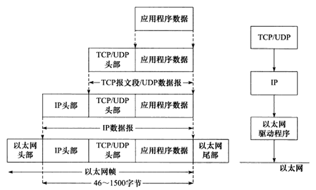

TCP 报文段封装过程：


以太网帧封装过程：


### 分用

当帧到达目的主机时，将沿着协议族自底向上依次传递，各层协议依次处理帧中本层负责的头部数据，以获取所需的信息，并将最终处理后的帧交给应用程序。这个过程称为分用。


- 以太网帧使用 16 位 的类型字段来标识上层协议
  - 0x0800：IP 数据报
  - 0x0806：ARP 请求或应答报文
  - 0x0835：RARP 请求或应答报文
- IP 数据报头部采用 16 位的协议字段来区分协议
  - 17：UDP 用户数据报 
  - 6：TCP 传输控制 
- TCP 报文段和 UDP 报文段则是通过头部的 16 位的端口号来区分上层应用程序
  - 20：ftp 数据连接
  - 21：ftp 控制连接
  - 22：ssh，scp
  - 53：DNS
  - 23：telnet
  - 80：http
  - 443：https

# IP 服务

⽹络层的主要作⽤是： 实现主机与主机之间的通信，也叫点对点通信。MAC （数据链路层）的作⽤则是实现直连的两个设备之间通信，⽽ IP（⽹络层） 则负责在没有直连的两个⽹络之间进⾏通信传输。  

IP协议功能：

- 寻址和路由；（根据对方的IP地址，寻找最佳路径传输信息）
- 传递服务：
  - 不可靠（IP协议只是尽自己最大努力去传输数据包），可靠性由上层协议提供（TCP协议）
  - 无状态：IP 通信双方不同步传输数据的状态信息，所有的 IP 数据报的发送，传输和接收都是相互独立，没有上下文关系的无法处理乱序和重复的 IP 数据报优点是简单、高效，内核中无需额外分配资源保存通信状态，也无须在每次传输时携带状态信息
  - 无连接（事先不建立会话），IP 通信双方不能长久的维持对方的任何信息，上层协议每次发送数据时，都必须明确指定对方的 IP 地址
  - 数据包的分片和重组

MAC 地址和 IP 地址：

信息传递时候，需要知道的其实是两个地址：终点地址、下一跳的地址。IP 地址本质上是终点地址，它在跳过路由器的时候不会改变，而 MAC 地址则是下一跳的地址，每跳过一次路由器都会改变，这就是为什么还要用 MAC 地址的原因之一，它起到了记录下一跳的信息的作用。

网络体系结构的分层模型：用 MAC 地址和 IP 地址两个地址，用于分别表示物理地址和逻辑地址是有好处的。这样分层可以使网络层与数据链路层的协议更灵活地替换。

对于同一个子网上的设备，IP 地址的前缀都是一样的，这样路由器通过 IP 地址的前缀就知道设备在在哪个子网上了，而只用 MAC 地址的话，路由器则需要记住每个 MAC 地址在哪个子网，这需要路由器有极大的存储空间，是无法实现的。

## IPv4

IP 地址（IPv4 地址）由 32 位正整数来表示， IP 地址在计算机是以⼆进制的⽅式处理的。为了⽅便记忆采⽤了点分⼗进制的标记⽅式。IP 地址最⼤值也就是：2^32 ≈ 42 亿。

### IPv4 分类

IP 地址分类成了 5 种类型：

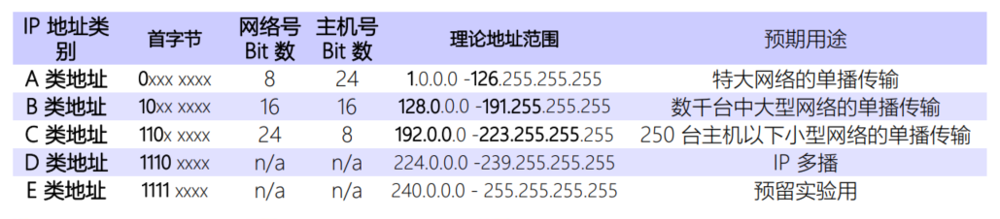

A、B、C 类主要分为两个部分，分别是⽹络号和主机号。

- 网络号：它标志主机所连接的网络地址表示属于互联网的哪一个网络
- 主机号：它标志主机地址表示其属于该网络中的哪一台主机

最⼤主机个数，就是要看主机号的位数，如 C 类地址的主机号占 8 位，那么 C 类地址的最⼤主机个数：2 ^ 8 - 2 = 254。

这是因为在 IP 地址中，有两个 IP 是特殊的，分别是主机号全为 1 和 全为 0 地址，在分配过程中，应该去掉这两种情况  ：

- 主机号全为 1 指定某个⽹络下的所有主机，⽤于⼴播  
- 主机号全为 0 指定某个⽹络  

在 A、 B、 C 分类地址，实际上又分公有 IP 地址和私有 IP 地址：


IP 分类的缺点：

- 同⼀⽹络下没有地址层次  
- 不能很好的与现实⽹络匹配，C 类地址能包含的最⼤主机数量实在太少了，只有 254 个，⽽ B 类地址能包含的最⼤主机数量⼜太多了， 6 万多台机器放在⼀个⽹络下⾯  

### ⽆分类地址 CIDR

这种⽅式不再有分类地址的概念， 32 ⽐特的 IP 地址被划分为两部分，前⾯是⽹络号，后⾯是主机号。  表示形式：`a.b.c.d/x `

`/x` 表示前 x 位属于⽹络号， x 的范围是 0 ~ 32 ，这就使得 IP 地址更加具有灵活性。⽐如 10.100.122.2/24，这种地址表示形式就是 CIDR， /24 表示前 24 位是⽹络号，剩余的 8 位是主机号。


掩码的意思就是掩盖掉主机号，剩余的就是⽹络号。  将⼦⽹掩码和 IP 地址按位计算 AND，就可得到⽹络号：


⼦⽹掩码还有⼀个作⽤，那就是划分⼦⽹。⼦⽹划分实际上是将主机地址分为两个部分：⼦⽹⽹络地址和⼦⽹主机地址。

- 未做⼦⽹划分的 ip 地址：⽹络地址＋主机地址  
- 做⼦⽹划分后的 ip 地址：⽹络地址＋（⼦⽹⽹络地址＋⼦⽹主机地址）  


假设对 C 类地址进⾏⼦⽹划分，⽹络地址 192.168.1.0，使⽤⼦⽹掩码 255.255.255.192 对其进⾏⼦⽹划分：

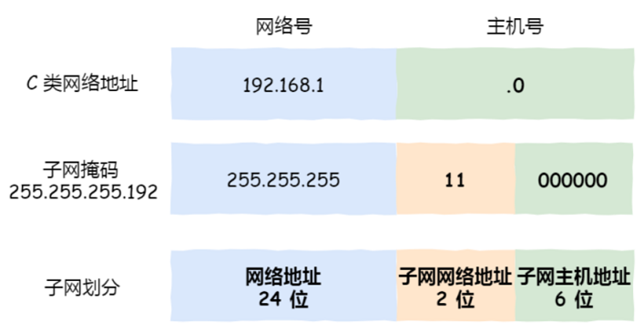

由于⼦⽹⽹络地址被划分成 2 位，那么⼦⽹地址就有 4 个，分别是 00、 01、 10、 11，具体划分如下：


### 环回地址

环回地址是在同⼀台计算机上的程序之间进⾏⽹络通信时所使⽤的⼀个默认地址。计算机使⽤⼀个特殊的 IP 地址 127.0.0.1 作为环回地址。与该地址具有相同意义的是⼀个叫做 localhost 的主机名。使⽤这个 IP 或主机名时，数据包不会流向⽹络。 

### IPv4 首部

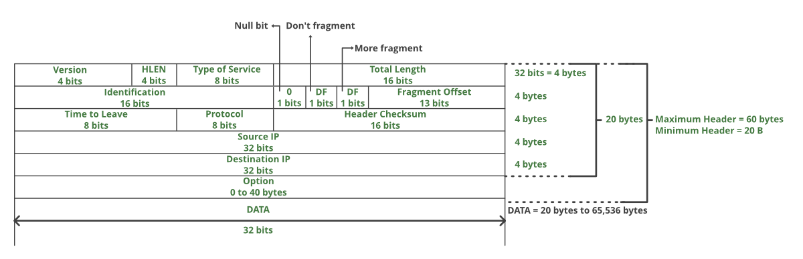 

- 版本：占 4 位。指 IP 协议是 IPv4 还是 IPv6，通信双方的版本必须一致
- 首部长度：占 4 位。以 4B 为单位，最大值为 60B。默认情况下首部长度看成 20B，此时不使用任何选项（即可选字段）
- 服务质量：如延时，吞吐量等
- 总长度：占16 位。指首部和数据之和的长度，以 1B 为单位，因此数据报最大长度为 2 ^ 16 − 1 = 65535B。以太网的最大传送单元（MTU）为 1500B，因此当一个IP数据包封装成帧时，数据包总长度一定不能超过数据链路层的 MTU 值
- 标识：占 16 位。它是一个计数器，每产生一个数据报就加 1，但它并不是“序号”（IP是无连接服务）。当一个数据报长度超过网络的 MTU 时，必须分片，此时每个数据报片都复制一次标识号以便能重装成原来的数据报。重装数据报是在目的端主机完成的
- 标志：占 3 位
  - 第一个比特未使用，目前必须是 0
  - 第二个比特表示是否进行分片，0 表示可以分片，1 表示不能分片
  - 第三个比特表示在分片时，是否表示最后一个包。1 表示不是最后一个包， 0表示分配中最后一个包
- 片偏移：占 13 位。指明了每个分片相对于原始报文开头的偏移量，以 8B 为单位，即每个分片的长度必须是 8B 的整数倍，最大可以表示 8 x 8192 = 65536 字节的偏移量
- 生存时间（TTL）：占 8 位。报文经过的每个路由器都将此字段减 1，当此字段等于 0 时，丢弃该报文，确保报文不会永远在网络中循环
- 协议：占 8 位。指出携带的数据应交给那个传输层协议：1： ICMP，2：IGMP，6：TCP，17：UDP
- 首部检验和：占 16 位。只检验数据报首部，不检验数据部分
- 源地址：占 32 位。表示发送方的IP地址
- 目的地址：占 32 位。表示接收方的IP地址
- 可选项：仅在试验或诊断时用，可以没有。如果有，需要配合填充占满 32 比特

## IP 分⽚与重组

每种数据链路的最⼤传输单元 MTU 都是不相同的，如 FDDI 数据链路 MTU 4352、以太⽹的 MTU 是 1500 字节等。当IP 数据报的长度超过帧的 MTU 时，将被分片传输：

- 分片可能出现在发送端，也可能出现在中转路由器上，传输过程中可以被多次分片
- 只有在最终的目标机器上，这些分片才会被内核中的 IP 模块重新组装

假设发送⽅发送⼀个 4000 字节的⼤数据报，若要传输在以太⽹链路，则需要把数据报分⽚成 3 个⼩数据报进⾏传输：


在分⽚传输中，⼀旦某个分⽚丢失，则会造成整个 IP 数据报作废，所以 TCP 引⼊了 MSS 也就是在 TCP 层进⾏分⽚不由 IP 层分⽚，对于 UDP 我们尽量不要发送⼀个⼤于 MTU 的数据报⽂。  

IP 头部给 IP 分片和重组提供的信息：

- 数据报标识：一个 IP 数据报的每个分片都具有自己的 IP 头部标识，他们具有相同的标识值
- 标志：除了最后一个分片之外，其他分片都将设置 MF 标志。
- 片偏移：每个分片的片偏移是不一样的

## IP 协议相关技术

### DNS

DNS，英文全称是 domain name system，域名解析系统，是 Internet 上作为域名和IP相互映射的一个分布式数据库。它的作用很明确，就是可以根据域名查出对应的 IP 地址。

DNS 中的域名都是⽤句点来分隔的，⽐如 www.server.com ，这⾥的句点代表了不同层次之间的界限。在域名中， 越靠右的位置表示其层级越⾼。根域是在最顶层，它的下⼀层就是 com 顶级域，再下⾯是 server.com。 所以域名的层级关系类似⼀个树状结构：   


根域的 DNS 服务器信息保存在互联⽹中所有的 DNS 服务器中。这样⼀来，任何 DNS 服务器就都可以找到并访问根域 DNS 服务器了。因此，客户端只要能够找到任意⼀台 DNS 服务器，就可以通过它找到根域 DNS 服务器，然后再⼀路顺藤摸⽠找到位于下层的某台⽬标 DNS 服务器。  

### ARP

ARP 协议协议，Address Resolution Protocol，地址解析协议，它是用于实现 IP 地址到 MAC 地址的映射。

- 首先，每台主机都会在自己的ARP缓冲区中建立一个 ARP 列表，以表示 IP 地址和 MAC 地址的对应关系
- 当源主机需要将一个数据包要发送到目的主机时，会首先检查自己的 ARP 列表，是否存在该 IP 地址对应的 MAC 地址；如果有就直接将数据包发送到这个 MAC 地址；如果没有，就向本地网段发起一个 ARP 请求的广播包，查询此目的主机对应的 MAC 地址。此 ARP 请求的数据包里，包括源主机的 IP 地址、硬件地址、以及目的主机的 IP 地址
- 网络中所有的主机收到这个 ARP 请求后，会检查数据包中的目的IP是否和自己的 IP 地址一致。如果不相同，就会忽略此数据包；如果相同，该主机首先将发送端的 MAC 地址和 IP 地址添加到自己的 ARP 列表中，如果 ARP 表中已经存在该IP的信息，则将其覆盖，然后给源主机发送一个  ARP 响应数据包，告诉对方自己是它需要查找的 MAC 地址
- 源主机收到这个 ARP 响应数据包后，将得到的目的主机的 IP 地址和 MAC 地址添加到自己的 ARP 列表中，并利用此信息开始数据的传输。如果源主机一直没有收到 ARP 响应数据包，表示 ARP 查询失败

操作系统通常会把第⼀次通过 ARP 获取的 MAC 地址缓存起来，以便下次直接从缓存中找到对应 IP 地址的 MAC 地址。不过， MAC 地址的缓存是有⼀定期限的，超过这个期限，缓存的内容将被清除。 

ARP 欺骗：

- ARP 欺骗就是非法的宣称自己是某个 IP 的 MAC 地址，使询问者错误的更新 ARP 缓存表，这样被欺骗主机发送的数据就会发送到发起攻击的主机，而不是理想的目的 IP 主机
- ARP攻击仅能在以太网（局域网如机房、内网、公司网络等）进行。无法对外网（互联网、非本区域内的局域网）攻击

### RARP

ARP 协议是已知 IP 地址求 MAC 地址，那 RARP 协议正好相反，它是已知 MAC 地址求 IP 地址。  

通常这需要架设⼀台 RARP 服务器，在这个服务器上注册设备的 MAC 地址及其 IP 地址。然后再将这个设备接⼊到⽹络，接着：  

- 该设备会发送⼀条我的 MAC 地址是 XXXX，请告诉我，我的 IP 地址应该是什么的请求信息  
- RARP 服务器接到这个消息后返回MAC地址为 XXXX 的设备， IP 地址为 XXXX 的信息给这个设备  
- 最后，设备就根据从 RARP 服务器所收到的应答信息设置⾃⼰的 IP 地址  

### DHCP

通过 DHCP 动态获取 IP 地址，⼤⼤省去了配 IP 信息繁琐的过程。  


DHCP 客户端进程监听的是 68 端⼝号， DHCP 服务端进程监听的是 67 端⼝号。  

- 客户端⾸先发起 DHCP 发现报⽂（DHCP DISCOVER） 的 IP 数据报，由于客户端没有 IP 地址，也不知道 DHCP 服务器的地址，所以使⽤的是 UDP ⼴播通信，其使⽤的⼴播⽬的地址是 255.255.255.255（端⼝67） 并且使⽤ 0.0.0.0（端⼝ 68） 作为源 IP 地址。 DHCP 客户端将该 IP 数据报传递给链路层，链路层然后将帧⼴播到所有的⽹络中设备 
- DHCP 服务器收到 DHCP 发现报⽂时，⽤ DHCP 提供报⽂（DHCP OFFER） 向客户端做出响应。该报⽂仍然使⽤ IP ⼴播地址 255.255.255.255，该报⽂信息携带服务器提供可租约的 IP 地址、⼦⽹掩码、默认⽹关、DNS 服务器以及 IP 地址租⽤期  
- 客户端收到⼀个或多个服务器的 DHCP 提供报⽂后，从中选择⼀个服务器，并向选中的服务器发送 DHCP 请求报⽂（DHCP REQUEST进⾏响应，回显配置的参数  
- 最后，服务端⽤ DHCP ACK 报⽂对 DHCP 请求报⽂进⾏响应，应答所要求的参数

⼀旦客户端收到 DHCP ACK 后，交互便完成了，并且客户端能够在租⽤期内使⽤ DHCP 服务器分配的 IP 地址。  如果租约的 DHCP IP 地址快期后，客户端会向服务器发送 DHCP 请求报⽂：  

- 服务器如果同意继续租⽤，则⽤ DHCP ACK 报⽂进⾏应答，客户端就会延⻓租期  
- 服务器如果不同意继续租⽤，则⽤ DHCP NACK 报⽂，客户端就要停⽌使⽤租约的 IP 地址  

DHCP 交互中，全程都是使⽤ UDP ⼴播通信。那如果 DHCP 服务器和客户端不是在同⼀个局域⽹内，路由器⼜不会转发⼴播包，那不是每个⽹络都要配⼀个 DHCP 服务器？为了解决这⼀问题，就出现了 DHCP 中继代理。有了 DHCP 中继代理以后，对不同⽹段的 IP 地址分配也可以由⼀个 DHCP 服务器统⼀进⾏管理。  

### NAT

⽹络地址转换 NAT 的⽅法缓解了 IPv4 地址耗尽的问题。简单的来说 NAT 就是同个公司、家庭、教室内的主机对外部通信时，把私有 IP 地址转换成公有 IP 地址。    

普通的 NAT 转换没什么意义：N 个私有 IP 地址，你就要 N 个公有 IP 地址。由于绝⼤多数的⽹络应⽤都是使⽤传输层协议 TCP 或 UDP 来传输数据的，因此，可以把 IP 地址 + 端⼝号⼀起进⾏转换。这样，就⽤⼀个全球 IP 地址就可以了，这种转换技术就叫⽹络地址与端⼝转换 NAPT。      

由于 NAT/NAPT 都依赖于⾃⼰的转换表，因此会有以下的问题：  

- 外部⽆法主动与 NAT 内部服务器建⽴连接，因为 NAPT 转换表没有转换记录
- 转换表的⽣成与转换操作都会产⽣性能开销  
- 通信过程中，如果 NAT 路由器重启了，所有的 TCP 连接都将被重置  

解决的⽅法主要有两种⽅法：

- 第⼀种就是改⽤ IPv6  
- 第⼆种 NAT 穿透技术，客户端主动从 NAT 设备获取公有 IP 地址，然后⾃⼰建⽴端⼝映射条⽬，然后⽤这个条⽬对外通信，就不需要 NAT 设备来进⾏转换了 

### ICMP

ICMP 全称是 Internet Control Message Protocol，也就是互联⽹控制报⽂协议。ICMP 主要的功能包括： 确认 IP 包是否成功送达⽬标地址、报告发送过程中 IP 包被废弃的原因和改善⽹络设置等。 

ICMP ⼤致可以分为两⼤类：

- ⼀类是⽤于诊断的查询消息，也就是查询报⽂类型
- 另⼀类是通知出错原因的错误消息，也就是差错报⽂类型
  

## ping

ping，Packet Internet Groper，是一种因特网包探索器，用于测试网络连接量的程序。Ping 是工作在 TCP/IP 网络体系结构中应用层的一个服务命令， 主要是向特定的目的主机发送 ICMP（Internet Control Message Protocol 因特网报文控制协议） 请求报文，测试目的站是否可达及了解其有关状态。

ping 是基于 ICMP：ICMP 回送消息⽤于进⾏通信的主机或路由器之间，判断所发送的数据包是否已经成功到达对端的⼀种消息， ping 命令就是利⽤这个消息实现的。

可以向对端主机发送回送请求的消息（ICMP Echo Request Message ，类型 8），也可以接收对端主机发回来的回送应答消息（ICMP Echo Reply Message ，类型 0）：


相⽐原⽣的 ICMP，这⾥多了两个字段：  

- 标识符：⽤以区分是哪个应⽤程序发 ICMP 包，⽐如⽤进程 PID 作为标识符  
- 序号：序列号从 0 开始，每发送⼀次新的回送请求就会加 1 ， 可以⽤来确认⽹络包是否有丢失
- 在选项数据中， ping 还会存放发送请求的时间值，来计算往返时间，说明路程的⻓短  

⽬标不可达消息（Destination Unreachable Message）类型为 3。IP 路由器⽆法将 IP 数据包发送给⽬标地址时，会给发送端主机返回⼀个⽬标不可达的 ICMP 消息，并在这个消息中显示不可达的具体原因，原因记录在 ICMP 包头的代码字段。常⻅的⽬标不可达类型的代码：

- ⽹络不可达代码为 0
- 主机不可达代码为 1
- 协议不可达代码为 2
- 端⼝不可达代码为 3
- 需要进⾏分⽚但设置了不分⽚位代码为 4  

原点抑制消息（ICMP Source Quench Message）类型为 4。在使⽤低速⼴域线路的情况下，连接 WAN 的路由器可能会遇到⽹络拥堵的问题。ICMP 原点抑制消息的⽬的就是为了缓和这种拥堵情况。  当路由器向低速线路发送数据时，其发送队列的缓存变为零⽽⽆法发送出去时，可以向 IP 包的源地址发送⼀个 ICMP 原点抑制消息。  

重定向消息（ICMP Redirect Message）类型为 5 。如果路由器发现发送端主机使⽤了不是最优的路径发送数据，那么它会返回⼀个 ICMP 重定向消息给这个主机。在这个消息中包含了最合适的路由信息和源数据。这主要发⽣在路由器持有更好的路由信息的情况下。路由器会通过这样的 ICMP 消息告知发送端，让它下次发给另外⼀个路由器。     

超时消息（ICMP Time Exceeded Message）类型为 11。IP 包中有⼀个字段叫做 TTL （ Time To Live ，⽣存周期），它的值随着每经过⼀次路由器就会减 1，直到减到 0 时该 IP 包会被丢弃。此时，路由器将会发送⼀个 ICMP 超时消息给发送端主机，并通知该包已被丢弃。设置 IP 包⽣存周期的主要⽬的，是为了在路由控制遇到问题发⽣循环状况时，避免 IP 包⽆休⽌地在⽹络上被转发。  

ping 的发送和接收过程：  

ping 命令执⾏的时候，源主机⾸先会构建⼀个 ICMP 回送请求消息数据包。ICMP 数据包内包含多个字段，最重要的是两个：  

- 第⼀个是类型，对于回送请求消息⽽⾔该字段为 8 ；  
- 另外⼀个是序号，主要⽤于区分连续 ping 的时候发出的多个数据包  

每发出⼀个请求数据包，序号会⾃动加 1 。为了能够计算往返时间 RTT ，它会在报⽂的数据部分插⼊发送时间。另一端主机会构建⼀个 ICMP 回送响应消息数据包，回送响应数据包的类型字段为 0 ， 序号为接收到的请求数据包中的序号，然后再发送出去。  在规定的时候间内，源主机如果没有接到 ICMP 的应答包，则说明⽬标主机不可达；如果接收到了 ICMP 回送响应消息，则说明⽬标主机可达。  此时，源主机会检查，⽤当前时刻减去该数据包最初从源主机上发出的时刻，就是 ICMP 数据包的时间延迟。


# TCP

## TCP 和 UDP

### UDP 报文首部

UDP 协议⾮常简单，头部只有 8 个字节（64 位）， UDP 的头部格式如下：   


- ⽬标和源端⼝：主要是告诉 UDP 协议应该把报⽂发给哪个进程
- 包⻓度：该字段保存了 UDP ⾸部的⻓度跟数据的⻓度之和
- 校验和：校验和是为了提供可靠的 UDP ⾸部和数据⽽设计  

### TCP 和 UDP 区别

- 连接  
  - TCP 是⾯向连接的传输层协议，传输数据前先要建⽴连接  
  - UDP 是不需要连接，即刻传输数据  
- 服务对象  
  - TCP 是⼀对⼀的两点服务，即⼀条连接只有两个端点  
  - UDP ⽀持⼀对⼀、⼀对多、多对多的交互通信  
- 可靠性
  - TCP 是可靠交付数据的，数据可以⽆差错、不丢失、不重复、按需到达  
  - UDP 是尽最⼤努⼒交付，不保证可靠交付数据  
- 拥塞控制、流量控制  
  - TCP 有拥塞控制和流量控制机制，保证数据传输的安全性  
  - UDP 则没有，即使⽹络⾮常拥堵了，也不会影响 UDP 的发送速  
- ⾸部开销  
  - TCP ⾸部⻓度较⻓，会有⼀定的开销，⾸部在没有使⽤选项字段时是 20 个字节，如果使⽤了选项字段则会变⻓的
  - UDP ⾸部只有 8 个字节，并且是固定不变的，开销较⼩  
- 传输⽅式  
  - TCP 是流式传输，没有边界，但保证顺序和可靠  
  - UDP 是⼀个包⼀个包的发送，是有边界的，但可能会丢包和乱序  
- 分⽚不同  
  - TCP 的数据⼤⼩如果⼤于 MSS ⼤⼩，则会在传输层进⾏分⽚，⽬标主机收到后，也同样在传输层组装 TCP 数据包，如果中途丢失了⼀个分⽚，只需要传输丢失的这个分⽚
  - UDP 的数据⼤⼩如果⼤于 MTU ⼤⼩，则会在 IP 层进⾏分⽚，⽬标主机收到后，在 IP 层组装完数据，接着再传给传输层，但是如果中途丢了⼀个分⽚，在实现可靠传输的 UDP 时则就需要重传所有的数据包，这样传输效率⾮常差，所以通常 UDP 的报⽂应该⼩于 MTU  
- 适用场景
  - 由于 TCP 是⾯向连接，能保证数据的可靠性交付，因此经常⽤于：  
    - FTP ⽂件传输  
    - HTTP/HTTPS
  - 由于 UDP ⾯向⽆连接，它可以随时发送数据，再加上UDP本身的处理既简单⼜⾼效，因此经常⽤于：  
    - 包总量较少的通信，如 DNS 、 SNMP 等  
    - 视频、⾳频等多媒体通信  
    - ⼴播通信  

### 基于 TCP，UDP 的应用层协议

基于 TCP 的应用层协议有：

- HTTP：HyperText Transfer Protocol（超文本传输协议），默认端口80
- FTP: File Transfer Protocol (文件传输协议)，默认端口(20用于传输数据，21用于传输控制信息)
- SMTP: Simple Mail Transfer Protocol (简单邮件传输协议) ,默认端口 25
- TELNET: Teletype over the Network (网络电传)，默认端口 23
- SSH：Secure Shell（安全外壳协议），默认端口 22

基于 UDP 的应用层协议：

- DNS : Domain Name Service (域名服务),默认端口 53
- TFTP: Trivial File Transfer Protocol (简单文件传输协议)，默认端口 69
- SNMP：Simple Network Management Protocol（简单网络管理协议），通过 UDP 端口 161 接收，只有 Trap 信息采用 UDP 端口162

## TCP 基本认识

### 为什么需要 TCP 协议

IP 层是不可靠的，它不保证⽹络包的交付、不保证⽹络包的按序交付、也不保证⽹络包中的数据的完整性。  

如果需要保障⽹络数据包的可靠性，那么就需要由上层（传输层）的 TCP 协议来负责。因为 TCP 是⼀个⼯作在传输层的可靠数据传输的服务，它能确保接收端接收的⽹络包是⽆损坏、⽆间隔、⾮冗余和按序的。 

### 什么是 TCP

TCP 是⾯向连接的、可靠的、基于字节流的传输层通信协议。

- ⾯向连接：⼀定是⼀对⼀才能连接，不能像 UDP 协议可以⼀个主机同时向多个主机发送消息，也就是⼀对多是⽆法做到的
- 可靠的：⽆论的⽹络链路中出现了怎样的链路变化， TCP 都可以保证⼀个报⽂⼀定能够到达接收端  
- 字节流：消息是没有边界的，所以⽆论消息有多⼤都可以进⾏传输。并且消息是有序的，前⼀个消息没有收到的时候，即使先收到了后⾯的字节，那么也不能扔给应⽤层去处理，同时对重复的报⽂会⾃动丢弃

### 如何唯⼀确定⼀个 TCP 连接

TCP 四元组可以唯⼀的确定⼀个连接，四元组包括如下：  

- 源地址  
- 源端⼝
- ⽬的地址
- ⽬的端⼝ 

### 监听⼀个端⼝的 TCP 的最⼤连接数

服务器通常固定在某个本地端⼝上监听，等待客户端的连接请求。因此，客户端 IP 和端⼝是可变的，其理论值计算公式如下：

```
最大 TCP 连接数量 =  客户端的 IP 数量 X 客户端的端口数量
```

对 IPv4，客户端的 IP 数最多为 2 的 32 次⽅，客户端的端⼝数最多为 2 的 16 次⽅，也就是服务端单机最⼤ TCP 连接数，约为 2 的 48 次⽅。  

当然，服务端最⼤并发 TCP 连接数远不能达到理论上限：

- ⾸先主要是⽂件描述符限制， Socket 都是⽂件，所以⾸先要通过 ulimit 配置⽂件描述符的数⽬  
- 另⼀个是内存限制，每个 TCP 连接都要占⽤⼀定内存，操作系统的内存是有限的 

### TCP 如何确保可靠性

- 建⽴连接（标志位）：通信前确认通信实体存在
- 序号机制（序号、确认号）：确保了数据是按序、完整到达
- 数据校验（校验和）： CRC 校验全部数据
- 超时重传（定时器）：保证因链路故障未能到达数据能够被多次重发
- 窗⼝机制（窗⼝）：提供流量控制，避免过量发送
- 拥塞控制：提供流量控制，避免过量发送

### TCP 报文首部

可选项和填充部分不是必须的，所以TCP报文首部最小长度为 20 个字节：


- 16 位端口号：源端口号，该报文段是来自哪里；目标端口号，要传给哪个上层协议或应用程序
- 32 位序号：一次TCP通信（从TCP连接建立到断开）过程中某一个传输方向上的字节流的每个字节的编号
- 32 位确认号：用作对另一方发送的 tcp 报文段的响应。其值是收到的TCP报文段的序号值加 1
- 4 位头部长度：表示tcp头部有多少个 32bit字（4字节）。因为4位最大能标识 15，所以 TCP 头部最长是 60 字节
- 6 位标志位：URG (紧急指针是否有效)，ACK（表示确认号是否有效），PSH（缓冲区尚未填满），RST（表示要求对方重新建立连接），SYN（建立连接消息标志接），FIN（表示告知对方本端要关闭连接了）
- 16 位窗口大小：是 TCP 流量控制的一个手段。这里说的窗口，指的是接收通告窗口。它告诉对方本端的TCP接收缓冲区还能容纳多少字节的数据，这样对方就可以控制发送数据的速度
- 16 位校验和：由发送端填充，接收端对 TCP 报文段执行 CRC 算法以检验 TCP 报文段在传输过程中是否损坏。注意，这个校验不仅包括 TCP 头部，也包括数据部分。这也是 TCP 可靠传输的一个重要保障
- 16 位紧急指针：一个正的偏移量。它和序号字段的值相加表示最后一个紧急数据的下一字节的序号。因此，确切地说，这个字段是紧急指针相对当前序号的偏移，不妨称之为紧急偏移。TCP 的紧急指针是发送端向接收端发送紧急数据的方法
- 可选项和填充部分：可选项和填充部分的长度为 4n 字节（n是整数），该部分是根据需要而增加的选项。如果不足 4n 字节，要加填充位，使得选项长度为 32 位（4字节）的整数倍

TCP Option 的样式：

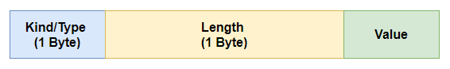

Length 指明Option的总长度（包括Kind和Length）。

常用的 Option：

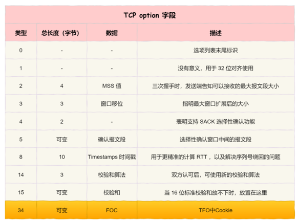

## TCP 建立连接

### 三次握手


- ⼀开始，客户端和服务端都处于 CLOSED 状态。先是服务端主动监听某个端⼝，处于 LISTEN 状态  
- 客户端会随机初始化序号（client_isn），将此序号置于 TCP ⾸部的序号字段中，同时把 SYN 标志位置为 1 ，表示 SYN 报⽂。接着把第⼀个 SYN 报⽂发送给服务端，表示向服务端发起连接，该报⽂不包含应⽤层数据，之后客户端处于 SYN-SENT 状态
- 服务端收到客户端的 SYN 报⽂后，⾸先服务端也随机初始化⾃⼰的序号（server_isn ），将此序号填⼊TCP ⾸部的序号字段中，其次把 TCP ⾸部的确认应答号字段填⼊ client_isn + 1 , 接着把 SYN 和 ACK 标志位置为 1 。最后把该报⽂发给客户端，该报⽂也不包含应⽤层数据，之后服务端处于 SYNRCVD 状态 
- 客户端收到服务端报⽂后，还要向服务端回应最后⼀个应答报⽂，⾸先该应答报⽂ TCP ⾸部 ACK 标志位置为 1 ，其次确认应答号字段填⼊ server_isn + 1 ，最后把报⽂发送给服务端，这次报⽂可以携带客户到服务器的数据，之后客户端处于 ESTABLISHED 状态
- 服务器收到客户端的应答报⽂后，也进⼊ ESTABLISHED 状态  

⼀旦完成三次握⼿，双⽅都处于 ESTABLISHED 状态，此时连接就已建⽴完成，客户端和服务端就可以相互发送数据了。第三次握⼿是可以携带数据的，前两次握⼿是不可以携带数据的。

### 为什么是三次握⼿

通过三次握⼿能防⽌历史连接的建⽴，能减少双⽅不必要的资源开销，能帮助双⽅同步初始化序列号。序列号能够保证数据包不重复、不丢弃和按序传输。  

- 两次握⼿：⽆法防⽌历史连接的建⽴，会造成双⽅资源的浪费，也⽆法可靠的同步双⽅序列号
- 四次握⼿：三次握⼿就已经理论上最少可靠连接建⽴，所以不需要使⽤更多的通信次数   

三次握手避免历史连接：


客户端连续发送多次 SYN 建⽴连接的报⽂，在⽹络拥堵情况下：  

- ⼀个旧 SYN 报⽂⽐最新的 SYN 报⽂早到达了服务端  
- 那么此时服务端就会回⼀个 SYN + ACK 报⽂给客户端  
- 客户端收到后可以根据⾃身的上下⽂，判断这是⼀个历史连接（序列号过期或超时），那么客户端就会发送 RST 报⽂给服务端，表示中⽌这⼀次连接  

如果是两次握⼿连接，就不能判断当前连接是否是历史连接，三次握⼿则可以在客户端（发送⽅）准备发送第三次报⽂时，客户端因有⾜够的上下⽂来判断当前连接是否是历史连接：  

- 如果是历史连接（序列号过期或超时），则第三次握⼿发送的报⽂是 RST 报⽂，以此中⽌历史连接  
- 如果不是历史连接，则第三次发送的报⽂是 ACK 报⽂，通信双⽅就会成功建⽴连接  

三次握手同步双⽅初始序列号：

TCP 协议的通信双⽅， 都必须维护⼀个序列号， 序列号是可靠传输的⼀个关键因素，它的作⽤：  

- 接收⽅可以去除重复的数据  
- 接收⽅可以根据数据包的序列号按序接收  
- 可以标识发送出去的数据包中， 哪些是已经被对⽅收到的  

序列号在 TCP 连接中占据着⾮常重要的作⽤，所以当客户端发送携带初始序列号的 SYN 报⽂的时候，需要服务端回⼀个 ACK 应答报⽂，表示客户端的 SYN 报⽂已被服务端成功接收，那当服务端发送初始序列号给客户端的时候，依然也要得到客户端的应答回应， 这样⼀来⼀回，才能确保双⽅的初始序列号能被可靠的
同步。  

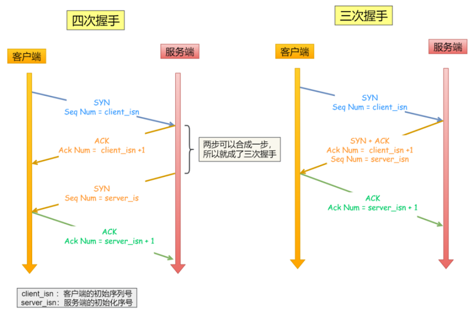

四次握⼿其实也能够可靠的同步双⽅的初始化序号，但由于第⼆步和第三步可以优化成⼀步，所以就成了三次握⼿。⽽两次握⼿只保证了⼀⽅的初始序列号能被对⽅成功接收，没办法保证双⽅的初始序列号都能被确认接收。 

三次握手避免资源浪费：

如果只有两次握⼿，当客户端的 SYN 请求连接在⽹络中阻塞，客户端没有接收到 ACK 报⽂，就会重新发送 SYN ，由于没有第三次握⼿，服务器不清楚客户端是否收到了⾃⼰发送的建⽴连接的 ACK 确认信号，所以每收到⼀个 SYN 就只能先主动建⽴⼀个连接。

如果客户端的 SYN 阻塞了，重复发送多次 SYN 报⽂，那么服务器在收到请求后就会建⽴多个冗余的⽆效连接，造成不必要的资源浪费。即两次握⼿会造成消息滞留情况下，服务器重复接受⽆⽤的连接请求 SYN 报⽂，⽽造成重复分配资源。


### 初始序列号 ISN

为什么客户端和服务端的初始序列号 ISN 是不相同的？ 

- 根据序号将不属于本连接的报⽂段丢弃：如果⼀个已经失效的连接被重⽤了，但是该旧连接的历史报⽂还残留在⽹络中，如果序列号相同，那么就⽆法分辨出该报⽂是不是历史报⽂，如果历史报⽂被新的连接接收了，则会产⽣数据错乱
- 为了安全性：防⽌⿊客伪造的相同序列号的 TCP 报⽂被对⽅接收

初始序列号 ISN 是如何随机产⽣的？ 

RFC1948 中提出了⼀个较好的初始化序列号 ISN 随机⽣成算法：ISN = M + F (localhost, localport, remotehost, remoteport)  

- M 是⼀个计时器，这个计时器每隔 4 毫秒加 1  
- F 是⼀个 Hash 算法，根据源 IP、⽬的 IP、源端⼝、⽬的端⼝⽣成⼀个随机数值。要保证 Hash 算法不能被外部轻易推算得出，⽤ MD5 算法是⼀个⽐较好的选择

### MSS

- MTU ：⼀个⽹络包的最⼤⻓度，以太⽹中⼀般为 1500 字节  
- MSS ：除去 IP 和 TCP 头部之后，⼀个⽹络包所能容纳的 TCP 数据的最⼤⻓度 

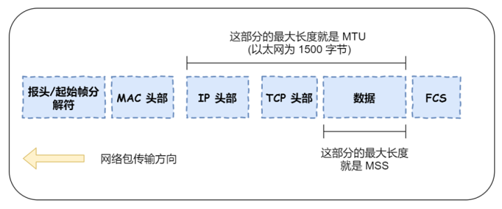

IP 层分片：当 IP 层有⼀个超过 MTU ⼤⼩的数据（TCP 头部 + TCP 数据）要发送，那么 IP 层就要进⾏分⽚，把数据分⽚成若⼲⽚，保证每⼀个分⽚都⼩于 MTU。把⼀份 IP 数据报进⾏分⽚以后，由⽬标主机的 IP 层来进⾏重新组装后，再交给上⼀层 TCP 传输层。那么当如果⼀个 IP 分⽚丢失，整个 IP 报⽂的所有分⽚都得重传

TCP 层分片：可以得知如果由 IP 层进⾏分⽚传输，是⾮常没有效率的。  为了达到最佳的传输效能 TCP 协议在建⽴连接的时候通常要协商双⽅的 MSS 值，当 TCP 层发现数据超过 MSS 时，则就先会进⾏分⽚，当然由它形成的 IP 包的⻓度也就不会⼤于 MTU ，⾃然也就不⽤ IP 分⽚了，经过 TCP 层分⽚后，如果⼀个 TCP 分⽚丢失后， 进⾏重发时也是以 MSS 为单位，⽽不⽤重传所有的分⽚，⼤⼤增加了重传的效率

### SYN 攻击

正常流程：

- 当服务端接收到客户端的 SYN 报⽂时，会将其加⼊到内核的 SYN 队列
- 接着发送 SYN + ACK 给客户端，等待客户端回应 ACK 报⽂
- 服务端接收到 ACK 报⽂后，从 SYN 队列 移除放⼊到 Accept 队列
- 应⽤通过调⽤ accpet() socket 接⼝，从 Accept 队列取出连接

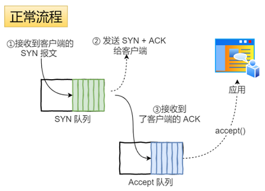

如果应⽤程序过慢时，就会导致 Accept 队列被占满：

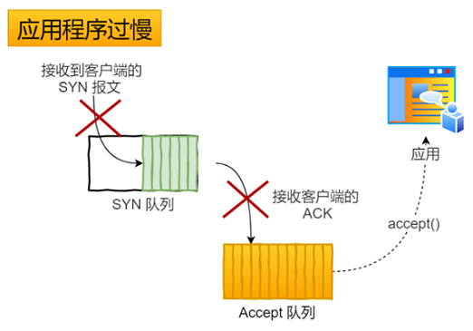

假设攻击者短时间伪造不同 IP 地址的 SYN 报⽂，服务端每接收到⼀个 SYN 报⽂，就进⼊ SYN_RCVD 状态，但服务端发送出去的 ACK + SYN 报⽂，⽆法得到未知 IP 主机的ACK 应答，久⽽久之就会占满服务端的 SYN 接收队列（未连接队列） ，使得服务器不能为正常⽤户服务：


避免 SYN 攻击⽅式⼀：

SYN_RCVD 状态连接的最⼤个数：  

```
net.ipv4.tcp_max_syn_backlog
```

超出处理能力时，对新的 SYN 直接回报 RST，丢弃连接：  

```
net.ipv4.tcp_abort_on_overflow
```

避免 SYN 攻击⽅式⼆：  

tcp_syncookies 的⽅式可以应对 SYN 攻击的⽅法：  

```
net.ipv4.tcp_syncookies = 1
```

当 SYN 队列满之后，后续服务器收到 SYN 包，不进⼊SYN 队列，计算出⼀个 cookie 值，再以 SYN + ACK 中的序列号返回客户端。服务端接收到客户端的应答报⽂时，服务器会检查这个 ACK 包的合法性。如果合法，直接放⼊到 Accept 队列，最后应⽤通过调⽤ accpet() 接⼝，从 Accept 队列取出的连接 ：  

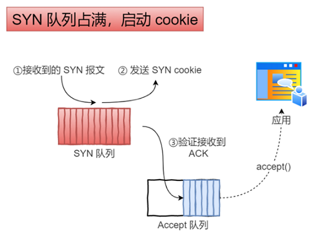

### 优化

#### 调整 SYN 报文的重传次数

客户端在等待服务端回复的 ACK 报⽂，正常情况下，服务器会在⼏毫秒内返回 SYN+ACK ，但如果客户端⻓时间没有收到 SYN+ACK 报⽂，则会重发 SYN 包， 重发的次数由 tcp_syn_retries 参数控制：

```
/proc/sys/net/ipv4/tcp_syn_retries
```

通常，第⼀次超时重传是在 1 秒后，第⼆次超时重传是在 2 秒，第三次超时重传是在 4 秒后，第四次超时重传是在 8 秒后，第五次是在超时重传 16 秒后。每次超时的时间是上⼀次的 2 倍。当第五次超时重传后，会继续等待 32 秒，如果服务端仍然没有回应 ACK，客户端就会终⽌三次握⼿。所以，总耗时是 1+2+4+8+16+32=63 秒。

根据⽹络的稳定性和⽬标服务器的繁忙程度修改 SYN 的重传次数，调整客户端的三次握⼿时间上限。⽐如内⽹中通讯时，就可以适当调低重试次数，尽快把错误暴露给应⽤程序。  

#### 调整 SYN 半连接队列的长度

需要同时增大：

```
/proc/sys/net/ipv4/tcp_max_syn_backlog   
/proc/sys/net/core/somaxconn
```

绕过半连接队列建立连接，syncookies：

```
/proc/sys/net/ipv4/tcp_syncookies
```

syncookies 参数主要有以下三个值：  

- 0 值，表示关闭该功能  
- 1 值，表示仅当 SYN 半连接队列放不下时，再启⽤它  
- 2 值，表示⽆条件开启功能  

#### 调整 SYN+ACK 的重传次数

与重传 SYN 类似，SYN+ACK 的重传会经历 1、 2、 4、 8、 16 秒，最后⼀次重传后会继续等待 32 秒，如果服务端仍然没有收到 ACK，才会关闭连接，故共需要等待 63 秒。  

````
/proc/sys/net/ipv4/tcp_synack_retries
````

全连接队列满时，直接回复 RST：

````
/proc/sys/net/ipv4/tcp_abort_on_overflow
````

tcp_abort_on_overflow 共有两个值分别是 0 和 1，其分别表示：  

- 0 ：如果 accept 队列满了，那么 server 扔掉 client 发过来的 ack  
- 1 ：如果 accept 队列满了， server 发送⼀个 RST 包给 client，表示废掉这个握⼿过程和这个连接  

tcp_abort_on_overflow 设为 0 可以提⾼连接建⽴的成功率，只有你⾮常肯定 TCP 全连接队列会⻓期溢出时，才能设置为 1 以尽快通知客户端。

#### 全连接队列的长度

全连接队列的⻓度取决于 somaxconn 和 backlog 之间的最⼩值，也就是 min(somaxconn, backlog)，其中：  

- somaxconn 是 Linux 内核的参数，默认值是 128，可以通过 net.core.somaxconn 来设置其值  
- backlog 是 listen(int sockfd, int backlog) 函数中的 backlog ⼤⼩  

#### TCP Fast Open

在 Linux 3.7 内核版本之后，提供了 TCP Fast Open 功能，这个功能可以减少 TCP 连接建⽴的时延：

```
/proc/sys/net/ipv4/tcp_fastopen
```

tcp_fastopn 各个值的意义:  

- 0：关闭  
- 1：作为客户端使⽤ Fast Open 功能  
- 2：作为服务端使⽤ Fast Open 功能  
- 3：⽆论作为客户端还是服务器，都可以使⽤ Fast Open 功能  

TCP Fast Open 功能需要客户端和服务端同时⽀持，才有效果。  


在客户端⾸次建⽴连接时的过程：

- 客户端发送 SYN 报⽂，该报⽂包含 Fast Open 选项，且该选项的 Cookie 为空，这表明客户端请求 Fast Open Cookie
- ⽀持 TCP Fast Open 的服务器⽣成 Cookie，并将其置于 SYN-ACK 数据包中的 Fast Open 选项以发回客户端
- 客户端收到 SYN-ACK 后，本地缓存 Fast Open 选项中的 Cookie

所以，第⼀次发起 HTTP GET 请求的时候，还是需要正常的三次握⼿流程。 之后，如果客户端再次向服务器建⽴连接时的过程：  

- 客户端发送 SYN 报⽂，该报⽂包含数据（对于⾮ TFO 的普通 TCP 握⼿过程， SYN 报⽂中不包含数据）以及此前记录的 Cookie
- ⽀持 TCP Fast Open 的服务器会对收到 Cookie 进⾏校验：如果 Cookie 有效，服务器将在 SYN-ACK 报⽂中对 SYN 和数据进⾏确认，服务器随后将数据递送⾄相应的应⽤程序；如果 Cookie ⽆效，服务器将丢弃 SYN 报⽂中包含的数据，且其随后发出的 SYN-ACK 报⽂将只确认 SYN 的对应序列号
- 如果服务器接受了 SYN 报⽂中的数据，服务器可在握⼿完成之前发送数据， 这就减少了握⼿带来的1 个 RTT 的时间消耗
- 客户端将发送 ACK 确认服务器发回的 SYN 以及数据，但如果客户端在初始的 SYN 报⽂中发送的数据没有被确认，则客户端将重新发送数据
- 此后的 TCP 连接的数据传输过程和⾮ TFO 的正常情况⼀致   

所以，之后发起 HTTP GET 请求的时候，可以绕过三次握⼿，这就减少了握⼿带来的 1 个 RTT 的时间消耗。  

开启了 TFO 功能， cookie 的值是存放到 TCP option 字段⾥的，客户端在请求并存储了 Fast Open Cookie 之后，可以不断重复 TCP Fast Open 直⾄服务器认为 Cookie ⽆效（通常为过期）。

## TCP 连接断开 

### 四次挥⼿

TCP 断开连接是通过四次挥⼿⽅式。双⽅都可以主动断开连接，断开连接后主机中的资源将被释放。

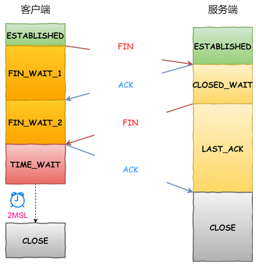

- 客户端打算关闭连接，此时会发送⼀个 TCP ⾸部 FIN 标志位被置为 1 的报⽂，也即 FIN 报⽂，之后客户端进⼊ FIN_WAIT_1 状态 
- 服务端收到该报⽂后，就向客户端发送 ACK 应答报⽂，接着服务端进⼊ CLOSED_WAIT 状态  
- 客户端收到服务端的 ACK 应答报⽂后，之后进⼊ FIN_WAIT_2 状态  
- 等待服务端处理完数据后，也向客户端发送 FIN 报⽂，之后服务端进⼊ LAST_ACK 状态
- 客户端收到服务端的 FIN 报⽂后，回⼀个 ACK 应答报⽂，之后进⼊ TIME_WAIT 状态
- 服务器收到了 ACK 应答报⽂后，就进⼊了 CLOSED 状态，⾄此服务端已经完成连接的关闭 
- 客户端在经过 2MSL ⼀段时间后，⾃动进⼊ CLOSED 状态，⾄此客户端也完成连接的关闭  

为什么挥⼿需要四次：

- 关闭连接时，客户端向服务端发送 FIN 时，仅仅表示客户端不再发送数据了但是还能接收数据
- 服务器收到客户端的 FIN 报⽂时，先回⼀个 ACK 应答报⽂，⽽服务端可能还有数据需要处理和发送，等服务端不再发送数据时，才发送 FIN 报⽂给客户端来表示同意现在关闭连接，所以服务端的 ACK 和 FIN ⼀般都会分开发送，从⽽⽐三次握⼿导致多了⼀次

双⽅同时关闭连接  ：

由于 TCP 是双全⼯的协议，所以是会出现两⽅同时关闭连接的现象，也就是同时发送了 FIN 报⽂。此时，上⾯介绍的优化策略仍然适⽤。两⽅发送 FIN 报⽂时，都认为⾃⼰是主动⽅，所以都进⼊了 FIN_WAIT1 状态， FIN 报⽂的重发次数仍由 tcp_orphan_retries 参数控制。  

接下来， 双⽅在等待 ACK 报⽂的过程中，都等来了 FIN 报⽂。这是⼀种新情况，所以连接会进⼊⼀种叫做 CLOSING 的新状态，它替代了 FIN_WAIT2 状态。接着，双⽅内核回复 ACK 确认对⽅发送通道的关闭后，进⼊TIME_WAIT 状态，等待 2MSL 的时间后，连接⾃动关闭。  

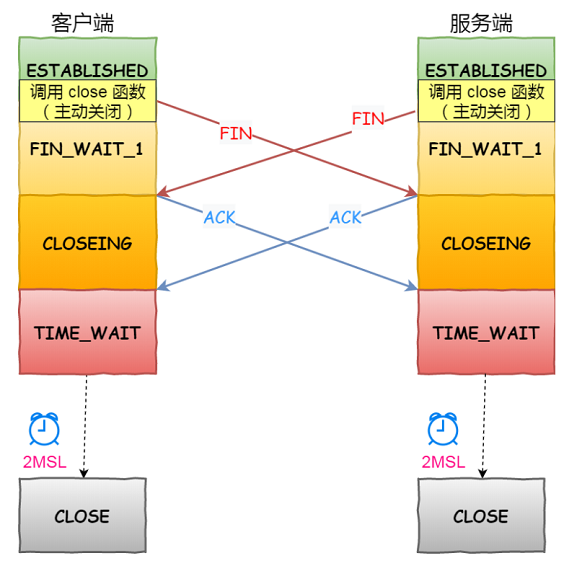

### Time-Wait

MSL 是 Maximum Segment Lifetime， 报⽂最⼤⽣存时间，它是任何报⽂在⽹络上存在的最⻓时间，超过这个时间报⽂将被丢弃。

因为 TCP 报⽂基于是 IP 协议的，⽽ IP 头中有⼀个 TTL 字段是 IP 数据报可以经过的最⼤路由数，每经过⼀个路由器处理此值就减 1，当此值为 0 则数据报将被丢弃，同时发送 ICMP 报⽂通知源主机。MSL 与 TTL 的区别： MSL 的单位是时间，⽽ TTL 是经过路由跳数。所以 MSL 应该要⼤于等于 TTL 消耗为 0 的时间，以确保报⽂已被⾃然消亡。  

TIME_WAIT 等待 2 倍的 MSL，⽐较合理的解释是： ⽹络中可能存在来⾃发送⽅的数据包，当这些发送⽅的数据包被接收⽅处理后⼜会向对⽅发送响应，所以⼀来⼀回需要等待 2 倍的时间。⽐如如果被动关闭⽅没有收到断开连接的最后的 ACK 报⽂，就会触发超时重发 Fin 报⽂，另⼀⽅接收到 FIN 后，会重发 ACK 给被动关闭⽅， ⼀来⼀去正好 2 个 MSL。  

2MSL 的时间是从客户端接收到 FIN 后发送 ACK 开始计时的。如果在 TIME-WAIT 时间内，因为客户端的 ACK 没有传输到服务端，客户端⼜接收到了服务端重发的 FIN 报⽂，那么 2MSL 时间将重新计时。  

在 Linux 系统⾥ 2MSL 默认是 60 秒，那么⼀个 MSL 也就是 30 秒。 Linux 系统停留在 TIME_WAIT 的时间为固定的 60 秒。其定义在 Linux 内核代码⾥的名称为 TCP_TIMEWAIT_LEN：  

```
#define TCP_TIMEWAIT_LEN (60*HZ) /* how long to wait to destroy TIME-WAIT state, about 60 seconds */
```

为什么需要 TIME_WAIT 状态：  

主动发起关闭连接的⼀⽅，才会有 TIME-WAIT 状态。  需要 TIME-WAIT 状态，主要是两个原因：  

- 防⽌具有相同四元组的旧数据包被收到
- 保证被动关闭连接的⼀⽅能被正确的关闭，即保证最后的 ACK 能让被动关闭⽅接收，从⽽帮助其正常关闭  

防⽌旧连接的数据包：  

假设 TIME-WAIT 没有等待时间或时间过短：

- 服务端在关闭连接之前发送的 SEQ = 301 报⽂，被⽹络延迟了  
- 这时有相同端⼝的 TCP 连接被复⽤后，被延迟的 SEQ = 301 抵达了客户端，那么客户端有可能正常接收这个过期的报⽂，这就会产⽣数据错乱等严重的问题


所以， TCP 就设计出了这么⼀个机制，经过 2MSL 这个时间， ⾜以让两个⽅向上的数据包都被丢弃，使得原来连接的数据包在⽹络中都⾃然消失，再出现的数据包⼀定都是新建⽴连接所产⽣的。  

保证连接正确关闭：  

TIME-WAIT 作⽤是等待⾜够的时间以确保最后的 ACK 能让被动关闭⽅接收，从⽽帮助其正常关闭。  

假设 TIME-WAIT 没有等待时间或时间过短：

- 客户端四次挥⼿的最后⼀个 ACK 报⽂如果在⽹络中被丢失了，此时如果客户端 TIME-WAIT 过短或没有，则就直接进⼊了 CLOSED 状态了，那么服务端则会⼀直处在 LASE_ACK 状态  
- 当客户端发起建⽴连接的 SYN 请求报⽂后，服务端会发送 RST 报⽂给客户端，连接建⽴的过程就会被终⽌  

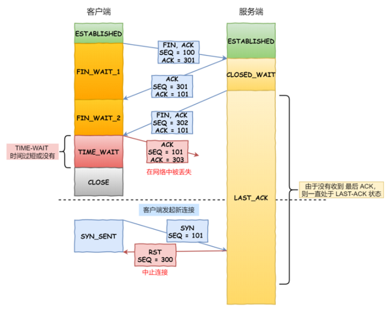

如果 TIME-WAIT 等待⾜够⻓的情况就会遇到两种情况：  

- 服务端正常收到四次挥⼿的最后⼀个 ACK 报⽂，则服务端正常关闭连接
- 服务端没有收到四次挥⼿的最后⼀个 ACK 报⽂时，则会重发 FIN 关闭连接报⽂并等待新的 ACK 报⽂ 

所以客户端在 TIME-WAIT 状态等待 2MSL 时间后，就可以保证双⽅的连接都可以正常的关闭。  

TIME_WAIT 过多有什么危害：  

- 第⼀是内存资源占⽤  
- 第⼆是对端⼝资源的占⽤，⼀个 TCP 连接⾄少消耗⼀个本地端⼝  

第⼆个危害是会造成严重的后果的，如果发起连接⼀⽅的 TIME_WAIT 状态过多，占满了所有端⼝资源，则会导致⽆法创建新连接：

- 客户端受端⼝资源限制：客户端 TIME_WAIT 过多，就会导致端⼝资源被占⽤，因为端⼝就 65536 个，被占满就会导致⽆法创建新的连接
- 服务端受系统资源限制：由于⼀个四元组表示 TCP 连接，理论上服务端可以建⽴很多连接，服务端确实只监听⼀个端⼝，但是会把连接扔给处理线程，所以理论上监听的端⼝可以继续监听。但是线程池处理不了那么多⼀直不断的连接了。当服务端出现⼤量 TIME_WAIT 时，系统资源被占满时，会导致处理不过来新的连接    

优化 TIME_WAIT：  

优化 TIME-WAIT 的⼏个⽅式：  

- 打开 net.ipv4.tcp_tw_reuse 和 net.ipv4.tcp_timestamps 选项  
- net.ipv4.tcp_max_tw_buckets  
- 程序中使⽤ SO_LINGER ，应⽤强制使⽤ RST 关闭  

net.ipv4.tcp_tw_reuse 和 tcp_timestamps：

如下的 Linux 内核参数开启后，则可以复⽤处于 TIME_WAIT 的 socket 为新的连接所⽤：

```
net.ipv4.tcp_tw_reuse = 1  
```

tcp_tw_reuse 功能只能⽤客户端（连接发起⽅），因为开启了该功能，在调⽤ connect() 函数时，内核会随机找⼀个 time_wait 状态超过 1 秒的连接给新的连接复⽤。使⽤这个选项，还有⼀个前提，需要打开对 TCP 时间戳的⽀持，即：

```
net.ipv4.tcp_timestamps=1  #（默认即为 1）
```

这个时间戳的字段是在 TCP 头部的选项⾥，⽤于记录 TCP 发送⽅的当前时间戳和从对端接收到的最新时间戳。由于引⼊了时间戳，前⾯提到的 2MSL 问题就不复存在了，因为重复的数据包会因为时间戳过期被⾃然丢弃。

net.ipv4.tcp_max_tw_buckets：

这个值默认为 18000，当系统中处于 TIME_WAIT 的连接⼀旦超过这个值时，系统就会将后⾯的 TIME_WAIT 连接状态重置。这个⽅法过于暴⼒，⽽且治标不治本，带来的问题远⽐解决的问题多，不推荐使⽤。  

程序中使⽤ SO_LINGER：

可以通过设置 socket 选项，来设置调⽤ close 关闭连接⾏为：

```
struct linger so_linger;
so_linger.l_onoff = 1;
so_linger.l_linger = 0;
setsockopt(s, SOL_SOCKET, SO_LINGER, &so_linger,sizeof(so_linger));
```

如果 l_onoff 为⾮ 0， 且 l_linger 值为 0，那么调⽤ close 后，会⽴该发送⼀个 RST 标志给对端，该 TCP 连接将跳过四次挥⼿，也就跳过了 TIME_WAIT 状态，直接关闭。 但这为跨越 TIME_WAIT 状态提供了⼀个可能，不过是⼀个⾮常危险的⾏为，不值得提倡。   

### CLOSE_WAIT

服务器端收到客户端发送的 FIN 后，TCP 协议栈就会自动发送 ACK，接着进入 CLOSE_WAIT 状态。但是如果服务器端不执行 socket 的 close() 操作，那么就没法进入LAST_ACK，导致大量连接处于 CLOSE_WAIT 状态。所以，如果服务器出现了大量 CLOSE_WAIT 状态，一般是程序 Bug，或者关闭 socket 不及时。

TIME_WAIT和CLOSE_WAIT的区别在哪?

- CLOSE_WAIT 是被动关闭形成的，当客户端发送 FIN 报文，服务端返回 ACK 报文后进入 CLOSE_WAIT，Linux 并没有限制 CLOSE_WAIT 状态的持续时间
- TIME_WAIT 是主动关闭形成的，当第四次挥手完成后，客户端进入 TIME_WAIT 状态

### 优化

FIN_WAIT1  状态优化：

主动⽅发送 FIN 报⽂后，连接就处于 FIN_WAIT1 状态，正常情况下，如果能及时收到被动⽅的 ACK，则会很快变为 FIN_WAIT2 状态。但是当迟迟收不到对⽅返回的 ACK 时，连接就会⼀直处于 FIN_WAIT1 状态。此时， 内核会定时重发 FIN 报⽂，其中重发次数由 tcp_orphan_retries 参数控制：

```
/proc/sys/net/ipv4/tcp_orphan_retries
```

默认值是 0，实际上当为 0 时，特指 8 次。当重传次数超过 tcp_orphan_retries 时，连接就会直接关闭掉。  

限制孤儿连接的数量：

如果遇到恶意攻击， FIN 报⽂根本⽆法发送出去，这由 TCP 两个特性导致的：  

- ⾸先，TCP 必须保证报⽂是有序发送的， FIN 报⽂也不例外，当发送缓冲区还有数据没有发送时， FIN 报⽂也不能提前发送
- 其次，TCP 有流量控制功能，当接收⽅接收窗⼝为 0 时，发送⽅就不能再发送数据。所以，当攻击者下载⼤⽂件时，就可以通过接收窗⼝设为 0 ，这就会使得 FIN 报⽂都⽆法发送出去，那么连接会⼀直处于 FIN_WAIT1 状态

解决这种问题的⽅法，是调整 tcp_max_orphans 参数，它定义了孤⼉连接的最⼤数量：  

```
/proc/sys/net/ipv4/tcp_max_orphans
```

当进程调⽤了 close 函数关闭连接，此时连接就会是孤⼉连接，因为它⽆法再发送和接收数据。 Linux 系统为了防⽌孤⼉连接过多，导致系统资源⻓时间被占⽤，就提供了 tcp_max_orphans 参数。如果孤⼉连接数量⼤于它，新增的孤⼉连接将不再⾛四次挥⼿，⽽是直接发送 RST 复位报⽂强制关闭。  

FIN_WAIT2 状态优化：

当主动⽅收到 ACK 报⽂后，会处于 FIN_WAIT2 状态，就表示主动⽅的发送通道已经关闭，接下来将等待对⽅发送FIN 报⽂，关闭对⽅的发送通道。

这时， 如果连接是⽤ shutdown 函数关闭的，连接可以⼀直处于 FIN_WAIT2 状态，因为它可能还可以发送或接收数据。但对于 close 函数关闭的孤⼉连接，由于⽆法再发送和接收数据，所以这个状态不可以持续太久，⽽ tcp_fin_timeout 控制了这个状态下连接的持续时⻓，默认值是 60 秒：  

```
/proc/sys/net/ipv4/tcp_fin_timeout
```

它意味着对于孤⼉连接（调⽤ close 关闭的连接），如果在 60 秒后还没有收到 FIN 报⽂，连接就会直接关闭。这个 60 秒不是随便决定的，它与 TIME_WAIT 状态持续的时间是相同的。  

TIME_WAIT 状态优化：

Linux 提供了 tcp_max_tw_buckets 参数，当 TIME_WAIT 的连接数量超过该参数时，新关闭的连接就不再经历 TIME_WAIT ⽽直接关闭：

```
/proc/sys/net/ipv4/tcp_max_tw_buckets
```

tcp_max_tw_buckets 也不是越⼤越好，毕竟内存和端⼝都是有限的。    

有⼀种⽅式可以在建⽴新连接时，复⽤处于 TIME_WAIT 状态的连接，那就是打开 tcp_tw_reuse 参数。但是需要注意，该参数是只⽤于客户端（建⽴连接的发起⽅），因为是在调⽤ connect() 时起作⽤的，⽽对于服务端（被动连接⽅）是没有⽤的：

```
/proc/sys/net/ipv4/tcp_tw_reuse
```

tcp_tw_reuse 从协议⻆度理解是安全可控的，可以复⽤处于 TIME_WAIT 的端⼝为新的连接所⽤。什么是协议⻆度理解的安全可控呢？主要有两点：    

- 只适⽤于连接发起⽅，也就是 C/S 模型中的客户端
- 对应的 TIME_WAIT 状态的连接创建时间超过 1 秒才可以被复⽤  

使⽤这个选项，还有⼀个前提，需要打开对 TCP 时间戳的⽀持（对⽅也要打开 ）：  

```
/proc/sys/net/ipv4/tcp_timestamps
```

由于引⼊了时间戳，它能带来了些好处：

- 前⾯提到的 2MSL 问题就不复存在了，因为重复的数据包会因为时间戳过期被⾃然丢弃
- 同时，它还可以防⽌序列号绕回，也是因为重复的数据包会由于时间戳过期被⾃然丢弃

另外，我们可以在程序中设置 socket 选项，来设置调⽤ close 关闭连接⾏为：

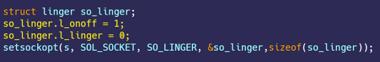

如果 l_onoff 为⾮ 0， 且 l_linger 值为 0， 那么调⽤ close 后，会⽴该发送⼀个 RST 标志给对端，该 TCP 连接将跳过四次挥⼿，也就跳过了 TIME_WAIT 状态，直接关闭。但这为跨越 TIME_WAIT 状态提供了⼀个可能，不过是⼀个⾮常危险的⾏为，不值得提倡。   

## TCP 保活机制  

定义⼀个时间段，在这个时间段内，如果没有任何连接相关的活动， TCP 保活机制会开始作⽤，每隔⼀个时间间隔，发送⼀个探测报⽂，该探测报⽂包含的数据⾮常少，如果连续⼏个探测报⽂都没有得到响应，则认为当前的TCP 连接已经死亡，系统内核将错误信息通知给上层应⽤程序。  

在 Linux 内核可以有对应的参数可以设置保活时间、保活探测的次数、保活探测的时间间隔，以下都为默认值：  

```
net.ipv4.tcp_keepalive_time=7200
net.ipv4.tcp_keepalive_intvl=75
net.ipv4.tcp_keepalive_probes=9
```

- tcp_keepalive_time=7200：表示保活时间是 7200 秒（2⼩时），也就 2 ⼩时内如果没有任何连接相关的活动，则会启动保活机制  
- tcp_keepalive_intvl=75：表示每次检测间隔 75 秒  
- tcp_keepalive_probes=9：表示检测 9 次⽆响应，认为对⽅是不可达的，从⽽中断本次的连接  

也就是说在 Linux 系统中，最少需要经过 2 ⼩时 11 分 15 秒才可以发现⼀个死亡连接：

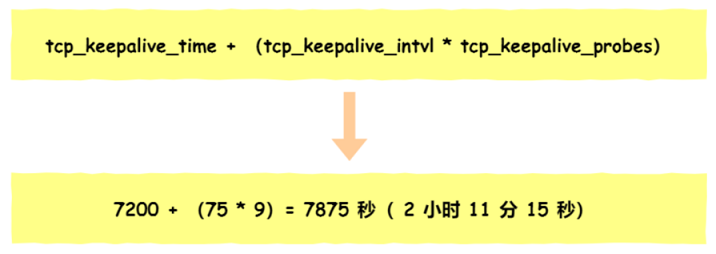

如果开启了 TCP 保活，需要考虑以下⼏种情况：  

- 第⼀种，对端程序是正常⼯作的。当 TCP 保活的探测报⽂发送给对端, 对端会正常响应，这样 TCP 保活时间会被重置，等待下⼀个 TCP 保活时间的到来  
- 第⼆种，对端程序崩溃并重启。当 TCP 保活的探测报⽂发送给对端后，对端是可以响应的，但由于没有该连接的有效信息，会产⽣⼀个 RST 报⽂，这样很快就会发现 TCP 连接已经被重置
- 第三种，对端程序崩溃，或对端由于其他原因导致报⽂不可达。当 TCP 保活的探测报⽂发送给对端后，⽯沉⼤海，没有响应，连续⼏次，达到保活探测次数后， TCP 会报告该 TCP 连接已经死亡  

## TCP 缓冲区和内存调整

在 Linux 中发送缓冲区和接收缓冲都是可以⽤参数调节的。设置完后，Linux 会根据你设置的缓冲区进⾏动态调节。  

调节发送缓冲区范围：  

```
echo "4096 16384 4194304" > /proc/sys/net/ipv4/tcp_wmem
```

上⾯三个数字单位都是字节，它们分别表示：

- 第⼀个数值是动态范围的最⼩值，4096 byte = 4K
- 第⼆个数值是初始默认值，87380 byte ≈ 86K
- 第三个数值是动态范围的最⼤值，4194304 byte = 4096K（4M）

发送缓冲区是⾃⾏调节的，当发送⽅发送的数据被确认后，并且没有新的数据要发送，就会把发送缓冲区的内存释放掉。

调节接收缓冲区范围：

```
echo "4096 16384 4194304" > /proc/sys/net/ipv4//tcp_rmem
```

上⾯三个数字单位都是字节，它们分别表示：

- 第⼀个数值是动态范围的最⼩值，表示即使在内存压⼒下也可以保证的最⼩接收缓冲区⼤⼩，4096 byte = 4K
- 第⼆个数值是初始默认值，87380 byte ≈ 86K
- 第三个数值是动态范围的最⼤值，6291456 byte = 6144K（6M）

接收缓冲区可以根据系统空闲内存的⼤⼩来调节接收窗⼝：  

- 如果系统的空闲内存很多，就可以⾃动把缓冲区增⼤⼀些，这样传给对⽅的接收窗⼝也会变⼤，因⽽提升发送⽅发送的传输数据数量
- 反之，如果系统的内存很紧张，就会减少缓冲区，这虽然会降低传输效率，可以保证更多的并发连接正常⼯作

发送缓冲区的调节功能是⾃动开启的，⽽接收缓冲区则需要配置 tcp_moderate_rcvbuf 为 1 来开启调节功能：  

```
echo 1 > /proc/sys/net/ipv4//tcp_moderate_rcvbuf
```

调节 TCP 内存范围：

```
echo "88560 118080 177120" > /proc/sys/net/ipv4//tcp_mem
```

 上⾯三个数字单位不是字节，⽽是⻚⾯⼤⼩， 1 ⻚表示 4KB，它们分别表示：

- 当 TCP 内存⼩于第 1 个值时，不需要进⾏⾃动调节
- 在第 1 和第 2 个值之间时，内核开始调节接收缓冲区的⼤⼩
- ⼤于第 3 个值时，内核不再为 TCP 分配新内存，此时新连接是⽆法建⽴的

根据当前 tcp_mem 最⼤内存⻚⾯数是177120，当内存为 (177120 * 4) / 1024K ≈ 692M 时，系统将⽆法为新的 TCP 连接分配内存，即 TCP 连接将被拒绝。  

需要注意的是，如果程序中的 socket 设置 SO_SNDBUF 和 SO_RCVBUF，则会关闭缓冲区的动态整功能，所以不建议在程序设置它俩，⽽是交给内核⾃动调整⽐较好。

## TCP 重传

在 TCP 中，当发送端的数据到达接收主机时，接收端主机会返回⼀个确认应答消息，表示已收到消息。TCP 针对数据包丢失的情况，会⽤重传机制解决：

- 超时重传
- 快速重传
- SACK
- D-SACK  

### 超时重传  

重传机制的其中⼀个⽅式，就是在发送数据时，设定⼀个定时器，当超过指定的时间后，没有收到对⽅的 ACK 确认应答报⽂，就会重发该数据，也就是我们常说的超时重传。TCP 会在以下两种情况发⽣超时重传：

- 数据包丢失
- 确认应答丢失  


RTT （Round-Trip Time 往返时延），就是数据从⽹络⼀端传送到另⼀端所需的时间，也就是包的往返时间：


超时重传时间是以 RTO （Retransmission Timeout 超时重传时间）表示，假设在重传的情况下，超时时间 RTO 较⻓或较短时：

- 当超时时间 RTO 较⼤时，重发就慢，丢了⽼半天才重发，没有效率，性能差  
- 当超时时间 RTO 较⼩时，会导致可能并没有丢就重发，于是重发的就快，会增加⽹络拥塞，导致更多的超时，更多的超时导致更多的重发  


超时重传时间 RTO 的值应该略⼤于报⽂往返 RTT 的值：


在发送端发包时记下 t0 ，然后接收端再把这个 ack 回来时再记⼀个 t1 ，于是 RTT = t1 – t0 。没那么简单， 这只是⼀个采样，不能代表普遍情况。实际上报⽂往返 RTT 的值是经常变化的，因为我们的⽹络也是时常变化的。也就因为报⽂往返 RTT 的值是经常波动变化的，所以超时重传时间 RTO 的值应该是⼀个动态变化的值。  

Linux 计算 RTO，估计往返时间，通常需要采样以下两个  ：

- 需要 TCP 通过采样 RTT 的时间，然后进⾏加权平均，算出⼀个平滑 RTT 的值，⽽且这个值还是要不断变化的，因为⽹络状况不断地变化
- 除了采样 RTT，还要采样 RTT 的波动范围，这样就避免如果 RTT 有⼀个⼤的波动的话，很难被发现的情况  

如果超时重发的数据，再次超时的时候，⼜需要重传的时候， TCP 的策略是超时间隔加倍。也就是每当遇到⼀次超时重传的时候，都会将下⼀次超时时间间隔设为先前值的两倍。两次超时，就说明⽹络环境差，不宜频繁反复发送。  

超时触发重传存在的问题是，超时周期可能相对较⻓。 于是就可以⽤快速重传机制来解决超时重发的时间等待。 

### 快速重传  

TCP 还有另外⼀种快速重传（Fast Retransmit）机制，它不以时间为驱动，⽽是以数据驱动重传，快速重传的⼯作⽅式是当收到三个相同的 ACK 报⽂时，会在定时器过期之前，重传丢失的报⽂段。

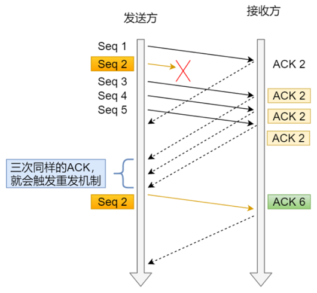

- 第⼀份 Seq1 先送到了，于是就 Ack 回 2  
- 结果 Seq2 因为某些原因没收到， Seq3 到达了，于是还是 Ack 回 2  
- 后⾯的 Seq4 和 Seq5 都到了，但还是 Ack 回 2，因为 Seq2 还是没有收到  
- 发送端收到了三个 Ack = 2 的确认，知道了 Seq2 还没有收到，就会在定时器过期之前，重传丢失的 Seq2  
- 最后，收到了 Seq2，此时因为 Seq3， Seq4， Seq5 都收到了，于是 Ack 回 6  

快速重传机制只解决了⼀个问题，就是超时时间的问题，但是它依然⾯临着另外⼀个问题。就是重传的时候，是重传之前的⼀个，还是重传所有的问题。⽐如对于上⾯的例⼦，是重传 Seq2 呢？还是重传 Seq2、 Seq3、 Seq4、 Seq5 呢？因为发送端并不清楚这连续的三个 Ack 2 是谁传回来的。根据 TCP 不同的实现，以上两种情况都是有可能的。可⻅，这是⼀把双刃剑。 为了解决不知道该重传哪些 TCP 报⽂，于是就有 SACK ⽅法。     

### SACK ⽅法  

SACK（Selective Acknowledgment 选择性确认）。 这种⽅式需要在 TCP 头部选项字段⾥加⼀个 SACK 的东⻄，它可以将缓存的地图发送给发送⽅，这样发送⽅就可以知道哪些数据收到了，哪些数据没收到，知道了这些信息，就可以只重传丢失的数据。  

如下图，发送⽅收到了三次同样的 ACK 确认报⽂，于是就会触发快速重发机制，通过 SACK 信息发现只有 200~299 这段数据丢失，则重发时，就只选择了这个 TCP 段进⾏重复。  


如果要⽀持 SACK ，必须双⽅都要⽀持。在 Linux 下，可以通过 net.ipv4.tcp_sack 参数打开这个功能（Linux 2.4 后默认打开）。

### D-SACK  

Duplicate SACK ⼜称 D-SACK ，其主要使⽤了 SACK 来告诉发送⽅有哪些数据被重复接收了。  

ACK 丢包：

- 接收⽅发给发送⽅的两个 ACK 确认应答都丢失了，所以发送⽅超时后，重传第⼀个数据包（3000 ~ 3499）  
- 于是接收⽅发现数据是重复收到的，于是回了⼀个 SACK = 3000~3500，告诉发送⽅ 3000~3500 的数据早已被接收了，因为 ACK 都到了 4000 了，已经意味着 4000 之前的所有数据都已收到，所以这个 SACK 就代表着 D-SACK  
- 这样发送⽅就知道了，数据没有丢，是接收⽅的 ACK 确认报⽂丢了  


⽹络延时：

- 数据包（1000~1499）被⽹络延迟了，导致发送⽅没有收到 Ack 1500 的确认报⽂  
- 后⾯报⽂到达的三个相同的 ACK 确认报⽂，就触发了快速重传机制，但是在重传后，被延迟的数据包（1000~1499）⼜到了接收⽅  
- 所以接收⽅回了⼀个 SACK=1000~1500，因为 ACK 已经到了 3000，所以这个 SACK 是 D-SACK，表示收到了重复的包 
- 这样发送⽅就知道快速重传触发的原因不是发出去的包丢了，也不是因为回应的 ACK 包丢了，⽽是因为⽹络延迟了  

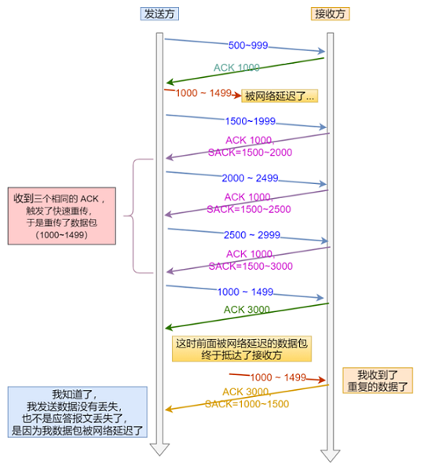

可⻅， D-SACK 有这么⼏个好处：

- 可以让发送⽅知道，是发出去的包丢了，还是接收⽅回应的 ACK 包丢了
- 可以知道是不是发送⽅的数据包被⽹络延迟了
- 可以知道⽹络中是不是把发送⽅的数据包给复制了

在 Linux 下可以通过 net.ipv4.tcp_dsack 参数开启/关闭这个功能（Linux 2.4 后默认打开）。  

## TCP 滑动窗⼝  

TCP 是每发送⼀个数据，都要进⾏⼀次确认应答。当上⼀个数据包收到了应答了， 再发送下⼀个。 但这种⽅式的缺点是效率⽐较低的。  数据包的往返时间越⻓，通信的效率就越低。为解决这个问题， TCP 引⼊了窗⼝这个概念。即使在往返时间较⻓的情况下，它也不会降低⽹络通信的效率。那么有了窗⼝，就可以指定窗⼝⼤⼩，窗⼝⼤⼩就是指⽆需等待确认应答，⽽可以继续发送数据的最⼤值。  

窗⼝的实现实际上是操作系统开辟的⼀个缓存空间，发送⽅主机在等到确认应答返回之前，必须在缓冲区中保留已发送的数据。如果按期收到确认应答，此时数据就可以从缓存区清除。

假设窗⼝⼤⼩为 3 个 TCP 段，那么发送⽅就可以连续发送 3 个 TCP 段，并且中途若有 ACK 丢失，可以通过下⼀个确认应答进⾏确认：

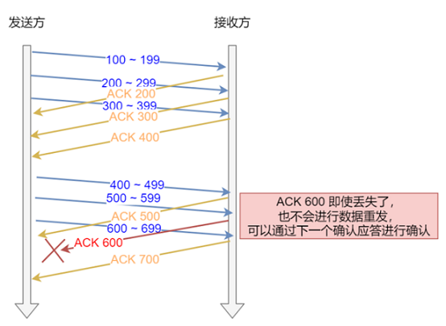

ACK 600 确认应答报⽂丢失，也没关系，因为可以通过下⼀个确认应答进⾏确认，只要发送⽅收到了 ACK 700 确认应答，就意味着 700 之前的所有数据接收⽅都收到了。这个模式就叫累计确认或者累计应答。

窗⼝⼤⼩：  

TCP 头⾥有⼀个字段叫 Window ，也就是窗⼝⼤⼩。这个字段是接收端告诉发送端⾃⼰还有多少缓冲区可以接收数据。于是发送端就可以根据这个接收端的处理能⼒来发送数据，⽽不会导致接收端处理不过来。    

窗⼝字段只有 2 个字节，因此它最多能表达 65535 字节⼤⼩的窗⼝，也就是 64KB ⼤⼩。这个窗⼝⼤⼩最⼤值，在当今⾼速⽹络下，很明显是不够⽤的。所以后续有了扩充窗⼝的⽅法： 在 TCP 选项字段定义了窗⼝扩⼤因⼦，⽤于扩⼤ TCP 通告窗⼝，其值⼤⼩是 2^14，这样就使 TCP 的窗⼝⼤⼩从 16 位扩⼤为 30 位（2^16 * 2^ 14 = 2^30），所以此时窗⼝的最⼤值可以达到 1GB。  

Linux 中打开这⼀功能，需要把 tcp_window_scaling 配置设为 1（默认打开）：

```
/proc/sys/net/ipv4//tcp_window_scaling
```

要使⽤窗⼝扩⼤选项，通讯双⽅必须在各⾃的 SYN 报⽂中发送这个选项：

- 主动建⽴连接的⼀⽅在 SYN 报⽂中发送这个选项
- ⽽被动建⽴连接的⼀⽅只有在收到带窗⼝扩⼤选项的 SYN 报⽂之后才能发送这个选项

这样看来，只要进程能及时地调⽤ read 函数读取数据，并且接收缓冲区配置得⾜够⼤，那么接收窗⼝就可以⽆限地放⼤，发送⽅也就⽆限地提升发送速度。这是不可能的，因为⽹络的传输能⼒是有限的，当发送⽅依据发送窗⼝，发送超过⽹络处理能⼒的报⽂时，路由器会直接丢弃这些报⽂。因此，缓冲区的内存并不是越⼤越好。    

### 发送⽅的滑动窗⼝  

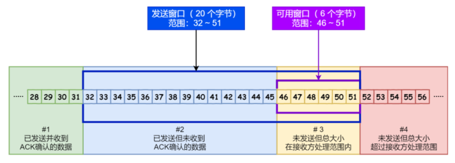

- \#1 是已发送并收到 ACK确认的数据： 1~31 字节
- \#2 是已发送但未收到 ACK确认的数据： 32~45 字节
- \#3 是未发送但总⼤⼩在接收⽅处理范围内（接收⽅还有空间）： 46~51字节
- \#4 是未发送但总⼤⼩超过接收⽅处理范围（接收⽅没有空间）： 52字节以后  

当发送⽅把数据全部都⼀下发送出去后，可⽤窗⼝的⼤⼩就为 0 ，表明可⽤窗⼝耗尽，在没收到 ACK 确认之前是⽆法继续发送数据了。  


当收到之前发送的数据 32~36 字节的 ACK 确认应答后，如果发送窗⼝的⼤⼩没有变化，则滑动窗⼝往右边移动 5 个字节，因为有 5 个字节的数据被应答确认，接下来 52~56 字节⼜变成了可⽤窗⼝，那么后续也就可以发送 52~56 这 5 个字节的数据了。 


TCP 滑动窗⼝⽅案使⽤三个指针来跟踪在四个传输类别中的每⼀个类别中的字节。其中两个指针是绝对指针（指特定的序列号），⼀个是相对指针（需要做偏移）。  

- SND.WND ：表示发送窗⼝的⼤⼩（⼤⼩是由接收⽅指定的）
- SND.UNA ：是⼀个绝对指针，它指向的是已发送但未收到确认的第⼀个字节的序列号，也就是 #2 的第⼀个字节
- SND.NXT ：也是⼀个绝对指针，它指向未发送但可发送范围的第⼀个字节的序列号，也就是 #3 的第⼀个字节
- 指向 #4 的第⼀个字节是个相对指针，它需要 SND.UNA 指针加上 SND.WND ⼤⼩的偏移量，就可以指向 \#4 的第⼀个字节了  


可⽤窗⼝⼤⼩的计算就可以是： 可⽤窗⼝大小 = SND.WND -（SND.NXT - SND.UNA）。

### 接收⽅的滑动窗⼝  


接收窗⼝相对简单⼀些，根据处理的情况划分成三个部分：  

- \#1 + #2 是已成功接收并确认的数据（等待应⽤进程读取）
- #3 是未收到数据但可以接收的数据
- #4 未收到数据并不可以接收的数据

其中三个接收部分，使⽤两个指针进⾏划分:

- RCV.WND ：表示接收窗⼝的⼤⼩，它会通告给发送⽅
- RCV.NXT ：是⼀个指针，它指向期望从发送⽅发送来的下⼀个数据字节的序列号，也就是 #3 的第⼀个字节
- 指向 #4 的第⼀个字节是个相对指针，它需要 RCV.NXT 指针加上 RCV.WND ⼤⼩的偏移量，就可以指向 \#4 的第⼀个字节了  

接收窗⼝和发送窗⼝的⼤⼩是相等的吗？  

并不是完全相等，接收窗⼝的⼤⼩是约等于发送窗⼝的⼤⼩的。因为滑动窗⼝并不是⼀成不变的。⽐如，当接收⽅的应⽤进程读取数据的速度⾮常快的话，这样的话接收窗⼝可以很快的就空缺出来。那么新的接收窗⼝⼤⼩，是通过 TCP 报⽂中的 Windows 字段来告诉发送⽅。那么这个传输过程是存在时延的，所以接收窗⼝和发送窗⼝是约等于的关系。  

## TCP 流量控制  

发送⽅不能⽆脑的发数据给接收⽅，要考虑接收⽅处理能⼒。如果⼀直⽆脑的发数据给对⽅，但对⽅处理不过来，那么就会导致触发重发机制，从⽽导致⽹络流量的⽆端的浪费。为了解决这种现象发⽣， TCP 提供⼀种机制可以让发送⽅根据接收⽅的实际接收能⼒控制发送的数据量，这就是所谓的流量控制。 


客户端是接收⽅，服务端是发送⽅，假设接收窗⼝和发送窗⼝相同，都为 200，假设两个设备在整个传输过程中都保持相同的窗⼝⼤⼩，不受外界影响。

- 客户端向服务端发送请求数据报⽂。这⾥要说明下，本次例⼦是把服务端作为发送⽅，所以没有画出服务端的接收窗⼝
- 服务端收到请求报⽂后，发送确认报⽂和 80 字节的数据，于是可⽤窗⼝ Usable 减少为 120 字节，同时SND.NXT 指针也向右偏移 80 字节后，指向 321， 这意味着下次发送数据的时候，序列号是 321
- 客户端收到 80 字节数据后，于是接收窗⼝往右移动 80 字节， RCV.NXT 也就指向 321， 这意味着客户端期望的下⼀个报⽂的序列号是 321，接着发送确认报⽂给服务端
- 服务端再次发送了 120 字节数据，于是可⽤窗⼝耗尽为 0，服务端⽆法再继续发送数据
- 客户端收到 120 字节的数据后，于是接收窗⼝往右移动 120 字节， RCV.NXT 也就指向 441，接着发送确认报⽂给服务端
- 服务端收到对 80 字节数据的确认报⽂后， SND.UNA 指针往右偏移后指向 321，于是可⽤窗⼝ Usable 增⼤到 80
- 服务端收到对 120 字节数据的确认报⽂后， SND.UNA 指针往右偏移后指向 441，于是可⽤窗⼝ Usable 增⼤到 200 
- 服务端可以继续发送了，于是发送了 160 字节的数据后， SND.NXT 指向 601，于是可⽤窗⼝ Usable 减少到 40
- 客户端收到 160 字节后，接收窗⼝往右移动了 160 字节， RCV.NXT 也就是指向了 601，接着发送确认报⽂给服务端
- 服务端收到对 160 字节数据的确认报⽂后，发送窗⼝往右移动了 160 字节，于是 SND.UNA 指针偏移了160 后指向 601，可⽤窗⼝ Usable 也就增⼤⾄了 200


