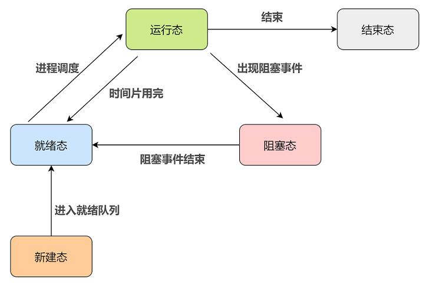

# 操作系统基础

## 用户态和内核态

用户态切换到内核态的 3 种方式：

- 系统调用：通过系统调用申请使用内核态服务程序完成工作，比如 fork()，本质通过中断来实现
- 异常：用户态下的程序，发生了某些不可知的异常，会切换到处理此异常的内核程序，也就转到了内核态，比如缺页异常
- 外围设备的中断：当外围设备完成用户请求的操作后，会发出相应的中断信号，程序转而去执行中断处理程序

## 内核空间和用户空间

内核空间总是驻留在内存中，它是为操作系统的内核保留的。按访问权限可以分为：

- 进程私有：每个进程都有单独的内核栈、页表、task 结构以及 mem_map 结构等
- 进程共享：包括物理存储器、内核数据和内核代码区域。

用户进程都有一个单独的用户空间，处于用户态的进程不能访问内核空间中的数据，需要通过系统调用，切换到内核态。用户空间包括：

- 运行时栈：由编译器自动释放，存放函数的参数值，局部变量和方法返回值等。每当一个函数被调用时，该函数的返回类型和一些调用的信息被存储到栈顶，调用结束后调用信息会被弹出弹出并释放掉内存。栈区是从高地址位向低地址位增长的
- 运行时堆：用于存放进程运行中被动态分配的内存段。由开发人员申请分配和释放。堆是从低地址位向高地址位增长，采用链式存储结构
- 代码段：存放 CPU 可以执行的机器指令。通常代码区是共享的，即其它执行程序可调用它
- 未初始化的数据段：存放未初始化的全局变量
- 已初始化的数据段：存放已初始化的全局变量，包括静态全局变量、静态局部变量以及常量。
- 内存映射区域：例如将动态库，共享内存等虚拟空间的内存映射到物理空间的内存

## 静态链接和动态链接

静态链接就是在编译期间，由编译器和连接器将静态库集成到应用程序内，并制作成目标文件以及可以独立运作的可执行文件。静态库一般是一些外部函数与变量的集合。

静态库很方便，但是如果我们只是想用库中的某一个函数，却仍然得把所有的内容都链接进去。一个更现代的方法是使用共享库，避免了在文件中静态库的大量重复。

动态链接可以在首次载入的时候执行，也可以在程序开始执行的时候完成。这个是由动态链接器完成，比方标准 `C` 库(`libc.so`) 通常就是动态链接的，这样所有的程序可以共享同一个库，而不用分别进行封装。

# 进程

进程是程序在某个数据集合上的一次运行活动，也是操作系统进行资源分配和保护的基本单位。

## 进程状态

- 运行态（running）：进程占有 CPU 正在运行
- 就绪态（ready）：进程具备运行条件，等待系统分配 CPU 以便运行
- 阻塞态 / 等待态（wait）：进程不具备运行条件，正在等待某个事件的完成
- 新建态（new）：进程正在被创建时的状态
- 终止态（exit）：进程正在从系统中消失时的状态



- 只有就绪态和运行态可以相互转换，其它的都是单向转换。就绪状态的进程通过调度算法从而获得 CPU 时间，转为运行状态；而运行状态的进程，在分配给它的 CPU 时间片用完之后就会转为就绪状态，等待下一次调度
- 阻塞状态是缺少需要的资源从而由运行状态转换而来，但是该资源不包括 CPU 时间，缺少 CPU 时间会从运行态转换为就绪态

### 进程创建过程

操作系统允许一个进程创建另一个进程，而且允许子进程继承父进程所拥有的资源，当子进程被终止时，其在父进程处继承的资源应当还给父进程。同时，终止父进程时同时也会终止其所有的子进程。

创建进程的过程，也就是创建原语包含的内容如下：

- 在进程列表中增加一项，从 PCB 池中申请一个空闲的 PCB（PCB 是有限的，若申请失败则创建失败），为新进程分配一个唯一的进程标识符
- 为新进程分配地址空间，由进程管理程序确定加载至进程地址空间中的程序
- 为新进程分配各种资源
- 初始化 PCB，如进程标识符、CPU 初始状态等
- 把新进程的状态设置为就绪态，并将其移入就绪队列，等待被调度运行

### 进程的终止

进程的终止也称为撤销，进程完成特定工作或出现严重错误后必须被终止。引起进程终止的事件有三种：

- 正常结束：进程自己请求终止（exit 系统调用）
- 异常结束：比如整数除 0，非法使用特权指令，然后被操作系统强行终止
- 外界干预：用户手动杀死进程

终止（撤销）进程的过程，也就是撤销原语包含的内容如下：

- 从 PCB 集合中找到终止进程的 PCB
- 若进程处于运行态，则立即剥夺其 CPU，终止该进程的执行，然后将 CPU 资源分配给其他进程；
- 如果其还有子进程，则应将其所有子进程终止
- 将该进程所拥有的全部资源都归还给父进程或操作系统
- 回收 PCB 并将其归还至 PCB 池

### 进程的阻塞和唤醒

进程阻塞是指进程让出 CPU 资源转而等待一个事件，如等待资源、等待 I/O 操作完成等。进程通常使用阻塞原语来阻塞自己，所以阻塞是进程的自主行为，是一个同步事件。当等待事件完成时会产生一个中断，激活操作系统，在系统的控制下将被阻塞的进程唤醒，也就是唤醒原语。进程的阻塞和唤醒显然是由进程切换来完成的。

进程的阻塞步骤，也就是阻塞原语的内容为：

- 找到将要被阻塞的进程对应的 PCB
- 保护进程运行现场，将 PCB 状态信息设置为阻塞态，暂时停止进程运行
- 将该 PCB 插入相应事件的阻塞队列（等待队列）

进程的唤醒步骤，也就是唤醒原语的内容为：

- 在该事件的阻塞队列中找到相应进程的 PCB
- 将该 PCB 从阻塞队列中移出，并将进程的状态设置为就绪态
- 把该 PCB 插入到就绪队列中，等待被调度程序调度

### 进程上下文切换

上下文切换主要干两件事情：

-  一是切换进程空间， 也即虚拟内存
-  二是切换寄存器和 CPU 上下文

因为进程是由内核进行管理和调度的，所以进程的上下文切换一定发生在内核态。

进程上下文的切换也是一个原语操作，称为切换原语，其内容如下：

- 首先，将进程 A 的运行环境信息存入 PCB，这个运行环境信息就是进程的上下文（Context）
- 然后，将 PCB 移入相应的进程队列
- 选择另一个进程 B 进行执行，并更新其 PCB 中的状态为运行态
- 当进程 A 被恢复运行的时候，根据它的 PCB 恢复进程 A 所需的运行环境

引起进程上下文切换的事件，也就是某个占用 CPU 资源运行的当前进程被赶出 CPU 的原因有如下：

- 当前进程的时间片到
- 有更高优先级的进程到达
- 当前进程主动阻塞
- 当前进程终止

## 进程调度算法

### 批处理系统

- 先来先服务 first-come first-serverd（FCFS）
- 短作业优先 shortest job first（SJF）
- 最短剩余时间优先 shortest remaining time next（SRTN）

### 交互式系统

- 时间片轮转
- 优先级调度
- 多级反馈队列

## 进程同步

- 临界区
- 同步与互斥
- 信号量
- 管程

## 进程通信

### 匿名管道

- 管道的数据是单向流动的
- 匿名管道只能用于父子进程之间的通信

通过 `pipe` 函数来创建匿名管道：

```
int pipe (int fd[2]);  //@ 若创建成功则返回 0，创建失败就返回 -1
```

管道的本质就是内核在内存中开辟了一个缓冲区，这个缓冲区与管道文件相关联，对管道文件的操作，被内核转换成对这块缓冲区的操作。

### 有名管道

匿名管道由于没有名字，只能用于父子进程间的通信。为了克服这个缺点，提出了有名管道，也称做 FIFO，因为数据是先进先出的传输方式。所谓有名管道也就是提供一个路径名与之关联，这样，即使与创建有名管道的进程不存在亲缘关系的进程，只要可以访问该路径，就能够通过这个有名管道进行相互通信。

```
#include <sys/stat.h>
int mkfifo(const char *path, mode_t mode);
int mkfifoat(int fd, const char *path, mode_t mode);
```

### 消息队列

管道这种进程通信方式虽然使用简单，但是效率比较低，不适合进程间频繁地交换数据，并且管道只能传输无格式的字节流。为此，消息传递机制（Linux 中称消息队列）应用而生。

消息队列的本质就是存放在内存中的消息的链表，而消息本质上是用户自定义的数据结构。如果进程从消息队列中读取了某个消息，这个消息就会被从消息队列中删除。对比一下管道机制：

- 消息队列允许一个或多个进程向它写入或读取消息
- 消息队列可以实现消息的随机查询，不一定非要以先进先出的次序读取消息，也可以按消息的类型读取。比有名管道的先进先出原则更有优势
- 对于消息队列来说，在某个进程往一个队列写入消息之前，并不需要另一个进程在该消息队列上等待消息的到达。而对于管道来说，除非读进程已存在，否则先有写进程进行写入操作是没有意义的
- 消息队列的生命周期随内核，如果没有释放消息队列或者没有关闭操作系统，消息队列就会一直存在。而匿名管道随进程的创建而建立，随进程的结束而销毁

```
key_t ftok(const char *pathname, int proj_id); //@ 生成消息队列的唯一标识
int msgget(key_t key, int msgflg); //@ 创建/获取一个消息队列
int msgsnd(int msqid, const void *msgp, size_t msgsz, int msgflg); //@ 发送消息
ssize_t msgrcv(int msqid, void *msgp, size_t msgsz, long msgtyp,int msgflg);  //@ 获取消息
```

需要注意的是，消息队列对于交换较少数量的数据很有用，因为无需避免冲突。但是，由于用户进程写入数据到内存中的消息队列时，会发生从用户态拷贝数据到内核态的过程；同样的，另一个用户进程读取内存中的消息数据时，会发生从内核态拷贝数据到用户态的过程。因此，如果数据量较大，使用消息队列就会造成频繁的系统调用，也就是需要消耗更多的时间以便内核介入。

### 共享内存

为了避免像消息队列那样频繁的拷贝消息、进行系统调用，共享内存机制出现了。共享内存就是允许不相干的进程将同一段物理内存连接到它们各自的地址空间中，使得这些进程可以访问同一个物理内存，这个物理内存就称为共享内存。如果某个进程向共享内存写入数据，所做的改动将立即影响到可以访问同一段共享内存的任何其他进程。

```
int shmget(key_t key, size_t size, int flag); //@ 创建共享内存
int shmctl(int shm_id, int cmd, struct shmid_ds *buf); //@ 操作共享内存
int shmdt(void *addr);  //@ 共享内存解除绑定
```

不同于消息队列频繁的系统调用，对于共享内存机制来说，仅在建立共享内存区域时需要系统调用，一旦建立共享内存，所有的访问都可作为常规内存访问，无需借助内核。这样，数据就不需要在进程之间来回拷贝，所以这是最快的一种进程通信方式。

### 信号量和 PV 操作

如果多个进程同时修改同一个共享内存，先来的那个进程写的内容就会被后来的覆盖。进程的同步与互斥其实是一种对进程通信的保护机制，并不是用来传输进程之间真正通信的内容的，但是由于它们会传输信号量，所以也被纳入进程通信的范畴，称为低级通信。

信号量其实就是一个变量 ，我们可以用一个信号量来表示系统中某种资源的数量，用户进程可以通过使用操作系统提供的一对原语来对信号量进行操作，从而很方便的实现进程互斥或同步。这一对原语就是 PV 操作：

- P 操作：将信号量值减 1，表示申请占用一个资源。如果结果小于 0，表示已经没有可用资源，则执行 P 操作的进程被阻塞。如果结果大于等于 0，表示现有的资源足够你使用，则执行 P 操作的进程继续执行
- V 操作：将信号量值加 1，表示释放一个资源，即使用完资源后归还资源。若加完后信号量的值小于等于 0，表示有某些进程正在等待该资源，由于我们已经释放出一个资源了，因此需要唤醒一个等待使用该资源（就绪态）的进程，使之运行下去

### 信号

信号和信号量是完全不同的两个概念。

信号是进程通信机制中唯一的异步通信机制，它可以在任何时候发送信号给某个进程。通过发送指定信号来通知进程某个异步事件的发送，以迫使进程执行信号处理程序。信号处理完毕后，被中断进程将恢复执行。用户、内核和进程都能生成和发送信号。

用户进程对信号的处理方式：

- 执行默认操作。 Linux 对每种信号都规定了默认操作
- 捕捉信号。为信号定义一个信号处理函数，当信号发生时，就执行相应的信号处理函数
- 忽略信号。当不希望处理某些信号的时候，就可以忽略该信号，不做任何处理。有两个信号是应用进程无法捕捉和忽略的，即 SIGKILL 和 SEGSTOP， 它们用于在任何时候中断或结束某一进程

```
typedef void (*sighandler_t)(int);
sighandler_t signal(int signum, sighandler_t handler);

int sigaction(int signum, const struct sigaction *act,struct sigaction *oldact);

//@ 信号的发送：
int kill(pid_t pid, int sig);
int sigqueue(pid_t pid, int sig, const union sigval value);
```

### Socket

上面介绍的 5 种方法都是用于同一台主机上的进程之间进行通信的，如果想要跨网络与不同主机上的进程进行通信，这就是 Socket 通信做的事情了。

### 工具

System V IPC体系有一个统一的命令行工具： ipcmk， ipcs 和 ipcrm用于创建、 查看和删除 IPC 对象  

## 僵尸进程和孤儿进程

### 僵尸进程

子进程退出后需要父进程的确认收到才能在进程表中删除，而如果在自己成退出后，父进程并没有对其消亡进行确认，该进程就保存进程表中，占用资源，称为僵尸进程。

可以使用 ps aux | grep Z 查看当前的僵尸进程。

使用 kill -s SIGCHLD pid 删除该父进程的所有僵尸进程

系统所能使用的进程号是有限的，如果产生大量僵尸进程，可能会因为没有可用的进程号而导致系统不能产生新的进程。如果要消灭系统中大量的僵尸进程，只需要将其父进程杀死，此时僵尸进程就会变成孤儿进程，从而被 init 进程所收养，这样init进程就会释放所有的僵尸进程所占用的资源，从而结束僵尸进程。

### 孤儿进程

当父进程死亡后，进程就变为了孤儿进程，由 init 进程代为收养。同时由 init 进程对其资源释放。

父进程如何知道子进程的存亡， 子进程如何知道父进程的存亡父进程可以使用 waitpid 查看子进程是否已经销毁，当其子进程销毁后，父进程会收到 SIGCHD 信号。

子进程只需查看其 ppid 是否是 1，也就是其父进程是否是 init，是否被 init 收养。

# 线程

线程是进程的一个实体，一个进程可以拥有多个线程，多个线程也可以并发执行。一个没有线程的进程也可以看做是单线程的，同样线程也经常被看做是一种轻量级的进程。并且进程可以不依赖于线程而单独存在，而线程则不然。

进程是并发程序在一个数据集合上的一次执行过程，进程是系统进行资源分配和调度的独立单位，线程是进程的实体，它是比进程更小的能够独立执行的基本单元，线程自己不拥有任何系统资源，但是它可以访问其隶属进程的全部资源。

与进程的控制表 PCB 相似，线程也有自己的控制表 TCB，但是 TCB 中所保存的线程状态比 PCB 表少得多。

## 线程的优缺点

线程的优点：

- 一个进程中可以同时存在多个线程，这些线程共享该进程的资源。进程间的通信必须请求操作系统服务（因为 CPU 要切换到内核态），开销很大。而同进程下的线程间通信，无需操作系统干预，开销更小。

  不过，需要注意的是：从属于不同进程的线程间通信，也必须请求操作系统服务。

- 线程间的并发比进程的开销更小，系统并发性提升。

  同样，需要注意的是：从属于不同进程的线程间切换，它是会导致进程切换的，所以开销也大。

线程的缺点：

- 当进程中的一个线程奔溃时，会导致其所属进程的所有线程奔溃。

## 线程的分类

- 内核级线程：这类线程依赖于内核，又称为内核支持的线程或轻量级进程。无论是在用户程序中的线程还是系统进程中的线程，它们的创建、撤销和切换都由内核实现。比如英特尔i5-8250U是4核8线程，这里的线程就是内核级线程
- 用户级线程：它仅存在于用户级中，这种线程是不依赖于操作系统核心的。应用进程利用线程库来完成其创建和管理，速度比较快，操作系统内核无法感知用户级线程的存在。

## 线程间通信和同步方式

- 互斥量
- 信号量
- 条件变量

## OS 中都有什么锁

### 互斥锁

mutex（mutual exclusive）即互斥量（互斥体）。也便是常说的互斥锁。mutex是最常见的多线程同步方式。多线程共享一个互斥量，然后线程之间去竞争。得到锁的线程可以进入临界区执行代码。

### 读写锁

读写锁是一种 读共享，写独占的锁。

读写锁的特性：

- 当读写锁被加了写锁时，其他线程对该锁加读锁或者写锁都会阻塞（不是失败）
- 当读写锁被加了读锁时，其他线程对该锁加写锁会阻塞，加读锁会成功

### 自旋锁

自旋就是在共享资源的状态不满足时， 自旋锁持续不停的检测状态，它和其他锁的区别就在于不会使线程休眠，也就是不会产生上下文切换，但是会浪费cpu。

# 内存管理

## 虚拟内存

为了充分利用和管理系统内存资源，Linux 采用虚拟内存管理技术，利用虚拟内存技术让每个进程都有互不干涉的虚拟地址空间。进程初始化分配和操作的都是基于这个虚拟地址，只有当进程需要实际访问内存资源的时候才会建立虚拟地址和物理地址的映射，调入物理内存页。


虚拟地址的好处：

- 避免用户直接访问物理内存地址，防止一些破坏性操作，保护操作系统
- 每个进程都被分配了虚拟内存，用户程序可使用比实际物理内存更大的地址空间

## 物理地址

虚拟地址在被送到内存之前先转换成适当的物理地址。将一个虚拟地址转换为物理地址的任务叫做地址翻译，由专门的硬件 MMU 负责。

## 分页

把内存空间划分为大小相等且固定的块，作为主存的基本单位。因为程序数据存储在不同的页面中，而页面又离散的分布在内存中，因此需要一个页表来记录映射关系，以实现从页号到物理块号的映射。

内存管理的原理：

- 虚拟内存空间的管理， 将虚拟内存分成大小相等的页
- 物理内存的管理， 将物理内存分成大小相等的页
- 内存映射， 将虚拟内存也和物理内存也映射起来， 并且在内存紧张的时候可以换出到硬盘中

在程序运行过程中，如果要访问的页面不在内存中，就发生缺页中断从而将该页调入内存中。此时如果内存已无空闲空间，系统必须从内存中调出一个页面到磁盘对换区中来腾出空间。从虚拟地址到物理地址的转换方式， 称为分页（Paging） 。对于物理内存，操作系统把它分成一块一块大小相同的页，这样更方便管理。例如有的内存页面
长时间不用了，可以暂时写到硬盘上，称为换出。一旦需要的时候，再加载进来，叫作换入。

### 页面置换算法

- 最佳：所选择的被换出的页面将是最长时间内不再被访问，通常可以保证获得最低的缺页率。是一种理论上的算法，因为无法知道一个页面多长时间不再被访问
- LRU, Least Recently Used。最近最久未使用：虽然无法知道将来要使用的页面情况，但是可以知道过去使用页面的情况。LRU 将最近最久未使用的页面换出
- 先进先出

## 分段

程序的地址空间划分成多个拥有独立地址空间的段，每个段上的地址空间划分成大小相同的页。这样既拥有分段系统的共享和保护，又拥有分页系统的虚拟内存功能。

分页和分段共同点：

- 都是为了提高内存利用率，较少内存碎片
- 页和段都是离散存储的，所以两者都是离散分配内存的方式。每个页和段中的内存是连续的
- 都需要访问两次内存：第一次访问内存中的段表或者页表得到物理地址，第二次根据物理地址访问内存中的数据

分页和分段区别：

- 分页主要用于实现虚拟内存，从而获得更大的地址空间；分段主要是为了使程序和数据可以被划分为逻辑上独立的地址空间并且有助于共享和保护
- 页大小是系统固定的，而段大小则通常不固定
- 分页是一维的，程序员只需用一个记忆符，即可表示一个地址;而分段是二维的，程序员在标识一个地址时，既要给出段名，又需给出段内地址
- 通常段比页大，因而段表比页表短，可以缩短查找时间，提高访问速度
- 页和段都有存储保护机制。但存取权限不同：段有读、写和执行三种权限；而页只有读和写两种权限

# 文件系统与 IO

## 硬链接与软链接

硬链接是指将该文件名直接指向一个另一个文件的 inode，当删除原文件后，由于该文件名了解该文件 inode，所以不会受到影响。每次创建硬链接会使 inode 中记录的引用计数 +1，当引用计数减少到0，则释放该 inode。硬链接是不能跨文件系统建立的。

创建软链接会真正的分配一个 inode 存储指向原文件的文件名，也就是读取该 inode，则直接跳转到原文件的目录下进行查找原文件从而进行操作。所以，软链接是可以跨文件系统建立的。类似 windows 的快捷方式，给文件创建一个快速的访问路径，它依赖于原文件。

删除源文件后硬链接还可以访问源文件数据，软链接失效。原因：硬链接与源文件共用同一个inode，删除源文件后只是减少了inode的一个链接数，硬链接文件还可以继续访问源文件数据。而软链接是通过源文件路径来访问数据，但是源文件已经删除，所以路径访问不到，无法获取源文件数据。

## 磁盘调度算法

- 先来先服务(FCFS)：按照磁盘请求的顺序进行调度。
- 最短寻道时间优先(SSTF)：优先调度与当前磁头所在磁道距离最近的磁道
- 电梯扫描算法(SCAN)：总是保持一个方向运行，直到该方向没有请求为止，然后改变运行方向。

# linux 的重要命令

- readelf 命令 查看 ELF 文件的详细信息
- objdump命令 查看目标文件或者可执行的目标文件，可以显示反汇编代码
- ar 命令 用于操作高度结构化的存档文件(.a)
- ldd 用于打印程序或者库文件所依赖的共享库列表，ldd 不是一个可执行程序，而只是一个 shell 脚本
- lsof 是一个列出当前系统打开文件的工具
- netstat 命令用于显示各种网络相关信息
- ss 命令可以用来获取 socket 统计信息，它可以显示和 netstat 类似的内容。但ss的优势在于它能够显示更多更详细的有关TCP和连接状态的信息，而且比 netstat 更快速更高效

