# a操作系统基础

## 用户态内核态

为了限制不同程序的访问能力，划分了用户态和内核态两个权限等级。

- 用户态只能访问受限的资源，如果需要特殊权限，可以通过系统调用获取相应的资源
- 内核态可以访问所有的 CPU 指令和所有的内存空间、I/O 空间和硬件设备

所有用户程序都运行在用户态，一些内核态的操作需要进行系统调用，CPU切换到内核态，执行相应的服务，再切换为用户态并返回系统调用的结果。

为什么要有内核态和用户态：

- 安全性：防止用户程序恶意或者不小心破坏系统/内存/硬件资源
- 封装性：用户程序不需要实现更加底层的代码
- 利于调度：便于操作系统统一调度

用户态切换到内核态的 3 种方式：

- 系统调用：通过系统调用申请使用内核态服务程序完成工作，比如 fork()，本质通过中断来实现
- 异常：用户态下的程序，发生了某些不可知的异常，会切换到处理此异常的内核程序，也就转到了内核态，比如缺页异常
- 外围设备的中断：当外围设备完成用户请求的操作后，会发出相应的中断信号，程序转而去执行中断处理程序

为什么用户态切换到内核态代价大？

当发生用户态到内核态的切换时，会发生如下过程（本质上是从“用户程序”切换到“内核程序”）

- 设置处理器至内核态
- 保存当前寄存器（栈指针、程序计数器、通用寄存器）
- 将栈指针设置指向内核栈地址
- 将程序计数器设置为一个事先约定的地址上，该地址上存放的是系统调用处理程序的起始地址

而之后从内核态返回用户态时，又会进行类似的工作。

## 内核空间和用户空间

内核空间总是驻留在内存中，它是为操作系统的内核保留的。按访问权限可以分为：

- 进程私有：每个进程都有单独的内核栈、页表、task 结构以及 mem_map 结构等
- 进程共享：包括物理存储器、内核数据和内核代码区域。

用户进程都有一个单独的用户空间，处于用户态的进程不能访问内核空间中的数据，需要通过系统调用，切换到内核态。用户空间包括：

- 运行时栈：由编译器自动释放，存放函数的参数值，局部变量和方法返回值等。每当一个函数被调用时，该函数的返回类型和一些调用的信息被存储到栈顶，调用结束后调用信息会被弹出弹出并释放掉内存。栈区是从高地址位向低地址位增长的
- 运行时堆：用于存放进程运行中被动态分配的内存段。由开发人员申请分配和释放。堆是从低地址位向高地址位增长，采用链式存储结构
- 代码段：存放 CPU 可以执行的机器指令。通常代码区是共享的，即其它执行程序可调用它
- 未初始化的数据段：存放未初始化的全局变量
- 已初始化的数据段：存放已初始化的全局变量，包括静态全局变量、静态局部变量以及常量。
- 内存映射区域：例如将动态库，共享内存等虚拟空间的内存映射到物理空间的内存

## 系统调用的过程

- 程序通过调用函数库中的外壳函数，发起系统调用
- 函数将通过堆栈传入外壳函数的参数置入指定的寄存器
- 将系统调用的编号复制到 EAX
- 外壳函数执行中断指令 0x80，处理器从用户态进入到内核态
- 内核调用 system_call
  - 在内核栈中保存寄存器的值
  - 审核系统调用编号的有效性
  - 以编号索引找到对应的系统调用服务，并执行
  - 从内核栈恢复寄存器的值，将系统调用返回值置于栈中
  - 返回用户态

## 静态链接和动态链接 

静态链接就是在编译期间，由编译器和连接器将静态库集成到应用程序内，并制作成目标文件以及可以独立运作的可执行文件。静态库一般是一些外部函数与变量的集合。

静态库很方便，但是如果我们只是想用库中的某一个函数，却仍然得把所有的内容都链接进去。一个更现代的方法是使用共享库，避免了在文件中静态库的大量重复。

动态链接可以在首次载入的时候执行，也可以在程序开始执行的时候完成。这个是由动态链接器完成，比方标准 `C` 库(`libc.so`) 通常就是动态链接的，这样所有的程序可以共享同一个库，而不用分别进行封装。

# 进程

## 程序

从文本文件编译成二进制格式：

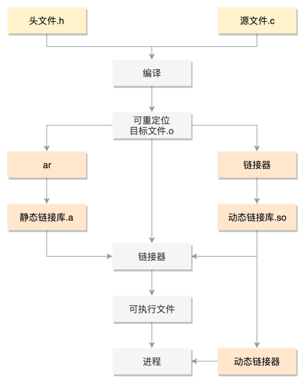

在 Linux 下面， 二进制的程序也要有严格的格式， 这个格式我们称为ELF（Executeable and Linkable Format， 可执行与可链接格式） 。这个格式可以根据编译的结果不同， 分为不同的格式：

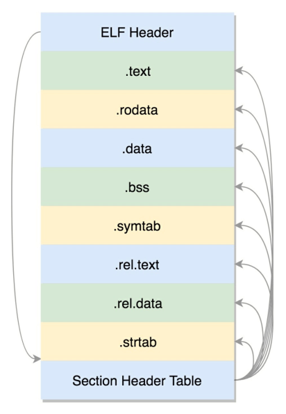

- .text： 放编译好的二进制可执行代码
- .data： 已经初始化好的全局变量
- .rodata： 只读数据， 例如字符串常量、 const 的变量
- .bss： 未初始化全局变量， 运行时会置 0
- .symtab： 符号表， 记录的则是函数和变量
- .strtab： 字符串表、 字符串常量和变量名  

这些节的元数据信息也需要有一个地方保存， 就是最后的节头部表（Section Header Table）。在这个表里面， 每一个 section 都有一项，在代码里面也有定义 struct elf32_shdr 和 struct elf64_shdr。 在 ELF 的头里面， 有描述这个文件的节头部表的位置， 有多少个表项等等信息。

可执行文件 ELF 格式：

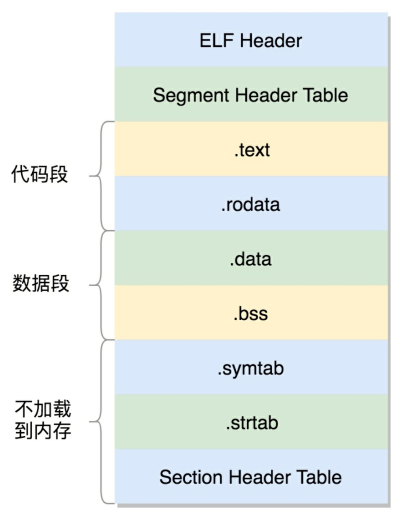

## 进程

进程是程序在某个数据集合上的一次运行活动，也是操作系统进行资源分配和保护的基本单位。

进程就是程序的一次执行过程，程序是静态的，它作为系统中的一种资源是永远存在的。而进程是动态的，它是动态的产生，变化和消亡的，拥有其自己的生命周期。

进程数据结构：

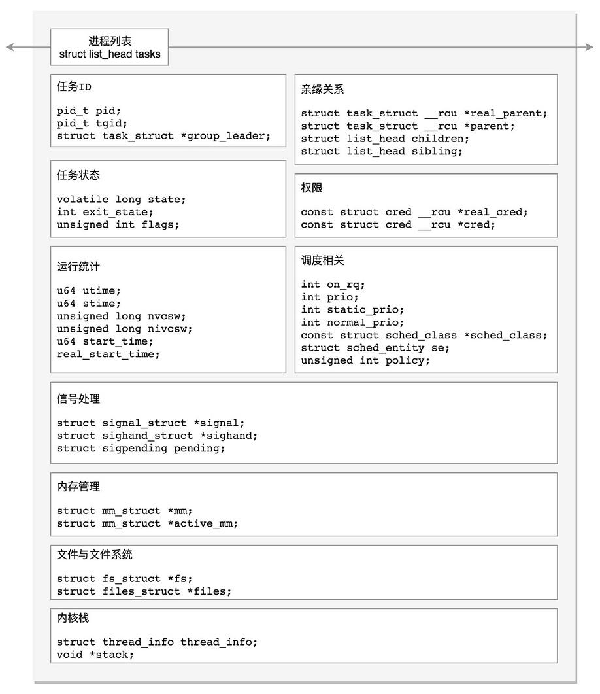


## 函数栈

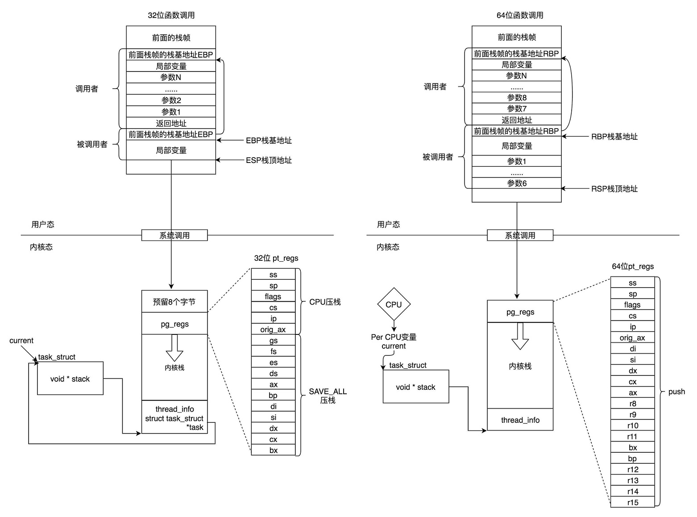

- ESP（Extended Stack Pointer） 是栈顶指针寄存器， 入栈操作 Push 和出栈操作 Pop 指令， 会自动调整 ESP 的值
- EBP（Extended Base Pointer），是栈基地址指针寄存器， 指向当前栈帧的最底部

## 进程的状态

三态模型：

- 运行态（running）：进程占有 CPU 正在运行
- 就绪态（ready）：进程具备运行条件，等待系统分配 CPU 以便运行
- 阻塞态 / 等待态（wait）：进程不具备运行条件，正在等待某个事件的完成


五态模型：

- 新建态（new）：进程正在被创建时的状态
- 终止态（exit）：进程正在从系统中消失时的状态


需要注意的是：

- 只有就绪态和运行态可以相互转换，其它的都是单向转换。就绪状态的进程通过调度算法从而获得 CPU 时间，转为运行状态；而运行状态的进程，在分配给它的 CPU 时间片用完之后就会转为就绪状态，等待下一次调度
- 阻塞状态是缺少需要的资源从而由运行状态转换而来，但是该资源不包括 CPU 时间，缺少 CPU 时间会从运行态转换为就绪态

## 进程控制

所谓进程控制就是对系统中的所有进程实施有效的管理，实现进程状态转换功能。包括创建进程、阻塞进程、唤醒进程、终止进程等。这些功能均由原语来实现。原语是一种特殊的程序，它的执行具有原子性。 也就是说，这段程序的运行必须一气呵成，不可中断。原语是操作系统内核里的一段程序：


### 进程的创建

操作系统初始启动时会创建承担系统资源分配和控制管理的一些系统进程，同时还会创建一个所有用户进程的祖先，其他用户进程是在应用程序运行时创建的。

操作系统允许一个进程创建另一个进程，而且允许子进程继承父进程所拥有的资源，当子进程被终止时，其在父进程处继承的资源应当还给父进程。同时，终止父进程时同时也会终止其所有的子进程。

创建进程的过程，也就是创建原语包含的内容如下：

- 在进程列表中增加一项，从 PCB 池中申请一个空闲的 PCB（PCB 是有限的，若申请失败则创建失败），为新进程分配一个唯一的进程标识符
- 为新进程分配地址空间，由进程管理程序确定加载至进程地址空间中的程序
- 为新进程分配各种资源
- 初始化 PCB，如进程标识符、CPU 初始状态等
- 把新进程的状态设置为就绪态，并将其移入就绪队列，等待被调度运行

### 进程的终止

进程的终止也称为撤销，进程完成特定工作或出现严重错误后必须被终止。引起进程终止的事件有三种：

- 正常结束：进程自己请求终止（exit 系统调用）
- 异常结束：比如整数除 0，非法使用特权指令，然后被操作系统强行终止
- 外界干预：用户手动杀死进程

终止（撤销）进程的过程，也就是撤销原语包含的内容如下：

- 从 PCB 集合中找到终止进程的 PCB
- 若进程处于运行态，则立即剥夺其 CPU，终止该进程的执行，然后将 CPU 资源分配给其他进程；
- 如果其还有子进程，则应将其所有子进程终止
- 将该进程所拥有的全部资源都归还给父进程或操作系统
- 回收 PCB 并将其归还至 PCB 池

### 进程的阻塞和唤醒

进程阻塞是指进程让出 CPU 资源转而等待一个事件，如等待资源、等待 I/O 操作完成等。进程通常使用阻塞原语来阻塞自己，所以阻塞是进程的自主行为，是一个同步事件。当等待事件完成时会产生一个中断，激活操作系统，在系统的控制下将被阻塞的进程唤醒，也就是唤醒原语。进程的阻塞和唤醒显然是由进程切换来完成的。

进程的阻塞步骤，也就是阻塞原语的内容为：

- 找到将要被阻塞的进程对应的 PCB
- 保护进程运行现场，将 PCB 状态信息设置为阻塞态，暂时停止进程运行
- 将该 PCB 插入相应事件的阻塞队列（等待队列）

进程的唤醒步骤，也就是唤醒原语的内容为：

- 在该事件的阻塞队列中找到相应进程的 PCB
- 将该 PCB 从阻塞队列中移出，并将进程的状态设置为就绪态
- 把该 PCB 插入到就绪队列中，等待被调度程序调度

阻塞原语和唤醒原语的作用正好相反，阻塞原语使得进程从运行态转为阻塞态，而唤醒原语使得进程从阻塞态转为就绪态。如果某个进程使用阻塞原语来阻塞自己，那么他就必须使用唤醒原语来唤醒自己，因何事阻塞，就由何事唤醒，否则被阻塞的进程将永远处于阻塞态。因此，阻塞原语和唤醒原语是成对出现的。

### 进程上下文切换

上下文切换主要干两件事情， 一是切换进程空间， 也即虚拟内存； 二是切换寄存器和 CPU 上下文。  

因为进程是由内核进行管理和调度的，所以进程的上下文切换一定发生在内核态。

进程上下文的切换也是一个原语操作，称为切换原语，其内容如下：

- 首先，将进程 A 的运行环境信息存入 PCB，这个运行环境信息就是进程的上下文（Context）

- 然后，将 PCB 移入相应的进程队列

- 选择另一个进程 B 进行执行，并更新其 PCB 中的状态为运行态

- 当进程 A 被恢复运行的时候，根据它的 PCB 恢复进程 A 所需的运行环境

引起进程上下文切换的事件，也就是某个占用 CPU 资源运行的当前进程被赶出 CPU 的原因有如下：

- 当前进程的时间片到
- 有更高优先级的进程到达
- 当前进程主动阻塞
- 当前进程终止

## 进程调度算法

### 批处理系统

批处理系统没有太多的用户操作，在该系统中，调度算法目标是保证吞吐量和周转时间（从提交到终止的时间）。

- 先来先服务 first-come first-serverd（FCFS）
  - 非抢占式的调度算法，按照请求的顺序进行调度
  - 有利于长作业，但不利于短作业，因为短作业必须一直等待前面的长作业执行完毕才能执行，而长作业又需要执行很长时间，造成了短作业等待时间过长

- 短作业优先 shortest job first（SJF）
  - 非抢占式的调度算法，按估计运行时间最短的顺序进行调度
  - 长作业有可能会饿死，处于一直等待短作业执行完毕的状态。因为如果一直有短作业到来，那么长作业永远得不到调度

- 最短剩余时间优先 shortest remaining time next（SRTN）
  - 最短作业优先的抢占式版本，按剩余运行时间的顺序进行调度。 当一个新的作业到达时，其整个运行时间与当前进程的剩余时间作比较。如果新的进程需要的时间更少，则挂起当前进程，运行新的进程。否则新的进程等待

### 交互式系统

交互式系统有大量的用户交互操作，在该系统中调度算法的目标是快速地进行响应。

- 时间片轮转
  - 将所有就绪进程按 FCFS 的原则排成一个队列，每次调度时，把 CPU 时间分配给队首进程，该进程可以执行一个时间片。当时间片用完时，由计时器发出时钟中断，调度程序便停止该进程的执行，并将它送往就绪队列的末尾，同时继续把 CPU 时间分配给队首的进程
  - 时间片轮转算法的效率和时间片的大小有很大关系：
    - 因为进程切换都要保存进程的信息并且载入新进程的信息，如果时间片太小，会导致进程切换得太频繁，在进程切换上就会花过多时间
    - 而如果时间片过长，那么实时性就不能得到保证
- 优先级调度
  - 为每个进程分配一个优先级，按优先级进行调度
  - 为了防止低优先级的进程永远等不到调度，可以随着时间的推移增加等待进程的优先级
- 多级反馈队列
  - 一个进程需要执行 100 个时间片，如果采用时间片轮转调度算法，那么需要交换 100 次。多级队列是为这种需要连续执行多个时间片的进程考虑，它设置了多个队列，每个队列时间片大小都不同，例如 1,2,4,8,..。进程在第一个队列没执行完，就会被移到下一个队列。这种方式下，之前的进程只需要交换 7 次。每个队列优先权也不同，最上面的优先权最高。因此只有上一个队列没有进程在排队，才能调度当前队列上的进程。可以将这种调度算法看成是时间片轮转调度算法和优先级调度算法的结合


### 实时系统

实时系统要求一个请求在一个确定时间内得到响应。

分为硬实时和软实时，前者必须满足绝对的截止时间，后者可以容忍一定的超时。

## 进程同步

### 临界区

对临界资源进行访问的那段代码称为临界区。为了互斥访问临界资源，每个进程在进入临界区之前，需要先进行检查。

```
// entry section
// critical section;
// exit section
```

### 同步与互斥

同步：多个进程因为合作产生的直接制约关系，使得进程有一定的先后执行关系。

互斥：多个进程在同一时刻只有一个进程能进入临界区。

### 信号量

信号量（Semaphore）是一个整型变量，可以对其执行 down 和 up 操作，也就是常见的 P 和 V 操作。

- down : 如果信号量大于 0 ，执行 -1 操作；如果信号量等于 0，进程睡眠，等待信号量大于 0；
- up ：对信号量执行 +1 操作，唤醒睡眠的进程让其完成 down 操作。

down 和 up 操作需要被设计成原语，不可分割，通常的做法是在执行这些操作的时候屏蔽中断。

如果信号量的取值只能为 0 或者 1，那么就成为了 互斥量（Mutex） ，0 表示临界区已经加锁，1 表示临界区解锁。

### 管程

使用信号量机制实现的生产者消费者问题需要客户端代码做很多控制，而管程把控制的代码独立出来，不仅不容易出错，也使得客户端代码调用更容易。

管程有一个重要特性：在一个时刻只能有一个进程使用管程。进程在无法继续执行的时候不能一直占用管程，否则其它进程永远不能使用管程。

管程引入了 条件变量 以及相关的操作：wait() 和 signal() 来实现同步操作。对条件变量执行 wait() 操作会导致调用进程阻塞，把管程让出来给另一个进程持有。signal() 操作用于唤醒被阻塞的进程。

## 进程通信

进程通信（InterProcess Communication，IPC）就是指进程之间的信息交换。

为了保证安全，每个进程的用户地址空间都是独立的，一般而言一个进程不能直接访问另一个进程的地址空间，不过内核空间是每个进程都共享的，所以进程之间想要进行信息交换就必须通过内核。


 Linux 内核提供的常见的进程通信机制：

- 管道（也称作共享文件）
- 消息队列（也称作消息传递）
- 共享内存（也称作共享存储）
- 信号量和 PV 操作
- 信号
- 套接字（Socket）

### 管道

#### 匿名管道

- 管道的数据是单向流动的
- 匿名管道只能用于父子进程之间的通信

通过 `pipe` 函数来创建匿名管道：

```
int pipe (int fd[2]);  //@ 若创建成功则返回 0，创建失败就返回 -1
```

pipe 返回了两个文件描述符， 这表示管道的两端， 一个是管道的读取端描述符 fd[0]， 另一个是管道的写入端描述符 fd[1]。

匿名管道实现进程间通信的步骤：

- 父进程创建两个匿名管道，管道 1（fd1[0]和 fd1[1]）和管道 2（fd2[0] 和 fd2[1]）；因为管道的数据是单向流动的，所以要想实现数据双向通信，就需要两个管道，每个方向一个
- 父进程 fork 出子进程，于是对于这两个匿名管道，子进程也分别有两个文件描述符指向匿名管道的读写两端
- 父进程关闭管道 1 的读端 fd1[0] 和 管道 2 的写端 fd2[1]，子进程关闭管道 1 的写端 fd1[1] 和 管道 2 的读端 fd2[0]，这样，管道 1 只能用于父进程写、子进程读；管道 2 只能用于父进程读、子进程写。管道是用环形队列实现的，数据从写端流入从读端流出，这就实现了父子进程之间的双向通信


管道的本质就是内核在内存中开辟了一个缓冲区，这个缓冲区与管道文件相关联，对管道文件的操作，被内核转换成对这块缓冲区的操作。

#### 有名管道

匿名管道由于没有名字，只能用于父子进程间的通信。为了克服这个缺点，提出了有名管道，也称做 FIFO，因为数据是先进先出的传输方式。所谓有名管道也就是提供一个路径名与之关联，这样，即使与创建有名管道的进程不存在亲缘关系的进程，只要可以访问该路径，就能够通过这个有名管道进行相互通信。


````
#include <sys/stat.h>
int mkfifo(const char *path, mode_t mode);
int mkfifoat(int fd, const char *path, mode_t mode);
````

### 消息队列

管道这种进程通信方式虽然使用简单，但是效率比较低，不适合进程间频繁地交换数据，并且管道只能传输无格式的字节流。为此，消息传递机制（Linux 中称消息队列）应用而生。比如，A 进程要给 B 进程发送消息，A 进程把数据放在对应的消息队列后就可以正常返回了，B 进程在需要的时候自行去消息队列中读取数据就可以了。同样的，B 进程要给 A 进程发送消息也是如此。


消息队列的本质就是存放在内存中的消息的链表，而消息本质上是用户自定义的数据结构。如果进程从消息队列中读取了某个消息，这个消息就会被从消息队列中删除。对比一下管道机制：

- 消息队列允许一个或多个进程向它写入或读取消息
- 消息队列可以实现消息的随机查询，不一定非要以先进先出的次序读取消息，也可以按消息的类型读取。比有名管道的先进先出原则更有优势
- 对于消息队列来说，在某个进程往一个队列写入消息之前，并不需要另一个进程在该消息队列上等待消息的到达。而对于管道来说，除非读进程已存在，否则先有写进程进行写入操作是没有意义的
- 消息队列的生命周期随内核，如果没有释放消息队列或者没有关闭操作系统，消息队列就会一直存在。而匿名管道随进程的创建而建立，随进程的结束而销毁

```
key_t ftok(const char *pathname, int proj_id); //@ 生成消息队列的唯一标识
int msgget(key_t key, int msgflg); //@ 创建/获取一个消息队列
int msgsnd(int msqid, const void *msgp, size_t msgsz, int msgflg); //@ 发送消息
ssize_t msgrcv(int msqid, void *msgp, size_t msgsz, long msgtyp,int msgflg);  //@ 获取消息
```


需要注意的是，消息队列对于交换较少数量的数据很有用，因为无需避免冲突。但是，由于用户进程写入数据到内存中的消息队列时，会发生从用户态拷贝数据到内核态的过程；同样的，另一个用户进程读取内存中的消息数据时，会发生从内核态拷贝数据到用户态的过程。因此，如果数据量较大，使用消息队列就会造成频繁的系统调用，也就是需要消耗更多的时间以便内核介入。

### 共享内存

为了避免像消息队列那样频繁的拷贝消息、进行系统调用，共享内存机制出现了。共享内存就是允许不相干的进程将同一段物理内存连接到它们各自的地址空间中，使得这些进程可以访问同一个物理内存，这个物理内存就称为共享内存。如果某个进程向共享内存写入数据，所做的改动将立即影响到可以访问同一段共享内存的任何其他进程。

每个进程都有属于自己的进程控制块（PCB）和逻辑地址空间（Addr Space），并且都有一个与之对应的页表，负责将进程的逻辑地址（虚拟地址）与物理地址进行映射，通过内存管理单元（MMU）进行管理。两个不同进程的逻辑地址通过页表映射到物理空间的同一区域，它们所共同指向的这块区域就是共享内存。


不同于消息队列频繁的系统调用，对于共享内存机制来说，仅在建立共享内存区域时需要系统调用，一旦建立共享内存，所有的访问都可作为常规内存访问，无需借助内核。这样，数据就不需要在进程之间来回拷贝，所以这是最快的一种进程通信方式。


```
int shmget(key_t key, size_t size, int flag); //@ 创建共享内存
int shmctl(int shm_id, int cmd, struct shmid_ds *buf); //@ 操作共享内存
int shmdt(void *addr);  //@ 共享内存解除绑定
```

### 信号量和 PV 操作

实际上，对具有多 CPU 系统的最新研究表明，在这类系统上，消息传递的性能其实是要优于共享内存的，因为消息队列无需避免冲突，而共享内存机制可能会发生冲突。也就是说如果多个进程同时修改同一个共享内存，先来的那个进程写的内容就会被后来的覆盖。

进程的同步与互斥其实是一种对进程通信的保护机制，并不是用来传输进程之间真正通信的内容的，但是由于它们会传输信号量，所以也被纳入进程通信的范畴，称为低级通信。

信号量其实就是一个变量 ，我们可以用一个信号量来表示系统中某种资源的数量，用户进程可以通过使用操作系统提供的一对原语来对信号量进行操作，从而很方便的实现进程互斥或同步。这一对原语就是 PV 操作：

- P 操作：将信号量值减 1，表示申请占用一个资源。如果结果小于 0，表示已经没有可用资源，则执行 P 操作的进程被阻塞。如果结果大于等于 0，表示现有的资源足够你使用，则执行 P 操作的进程继续执行
- V 操作：将信号量值加 1，表示释放一个资源，即使用完资源后归还资源。若加完后信号量的值小于等于 0，表示有某些进程正在等待该资源，由于我们已经释放出一个资源了，因此需要唤醒一个等待使用该资源（就绪态）的进程，使之运行下去

P 操作和 V 操作必须成对出现。缺少 P 操作就不能保证对共享内存的互斥访问，缺少 V 操作就会导致共享内存永远得不到释放、处于等待态的进程永远得不到唤醒。

```
int semget(key_t key, int num_sems, int sem_flags);  //@ 创建或打开信号量集
int semctl(int semid, int semnum, int cmd, union semun args); //@ 得到一个信号量集标识符或创建一个信号量集对象
int semop(int semid, struct sembuf semoparray[], size_t numops); //@ pv 操作
```


互斥访问共享内存：


实现进程同步：


### 信号

信号和信号量是完全不同的两个概念！

信号是进程通信机制中唯一的异步通信机制，它可以在任何时候发送信号给某个进程。通过发送指定信号来通知进程某个异步事件的发送，以迫使进程执行信号处理程序。信号处理完毕后，被中断进程将恢复执行。用户、内核和进程都能生成和发送信号。

信号事件的来源主要有硬件来源和软件来源。所谓硬件来源就是说我们可以通过键盘输入某些组合键给进程发送信号，比如常见的组合键 Ctrl+C 产生 SIGINT 信号，表示终止该进程；而软件来源就是通过 kill 系列的命令给进程发送信号，比如 kill -9 1111 ，表示给 PID 为 1111 的进程发送 SIGKILL 信号，让其立即结束。我们来查看一下 Linux 中有哪些信号：


用户进程对信号的处理方式：

- 执行默认操作。 Linux 对每种信号都规定了默认操作
- 捕捉信号。为信号定义一个信号处理函数，当信号发生时，就执行相应的信号处理函数
- 忽略信号。当不希望处理某些信号的时候，就可以忽略该信号，不做任何处理。有两个信号是应用进程无法捕捉和忽略的，即 SIGKILL 和 SEGSTOP， 它们用于在任何时候中断或结束某一进程

创建信号处理函数：

```
typedef void (*sighandler_t)(int);
sighandler_t signal(int signum, sighandler_t handler);

int sigaction(int signum, const struct sigaction *act,struct sigaction *oldact);
```

信号的发送：

```
int kill(pid_t pid, int sig);
int sigqueue(pid_t pid, int sig, const union sigval value);
```

​    

### Socket

上面介绍的 5 种方法都是用于同一台主机上的进程之间进行通信的，如果想要跨网络与不同主机上的进程进行通信，这就是 Socket 通信做的事情了。

TCP 编程过程：

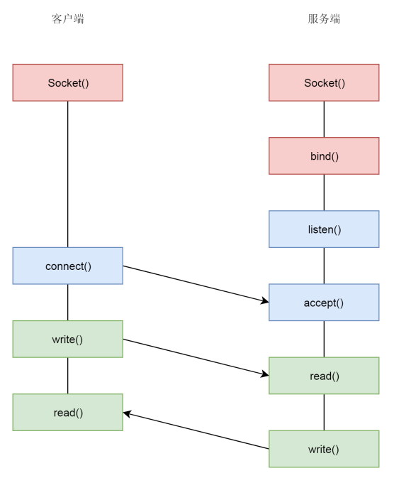

UDP 编程过程：

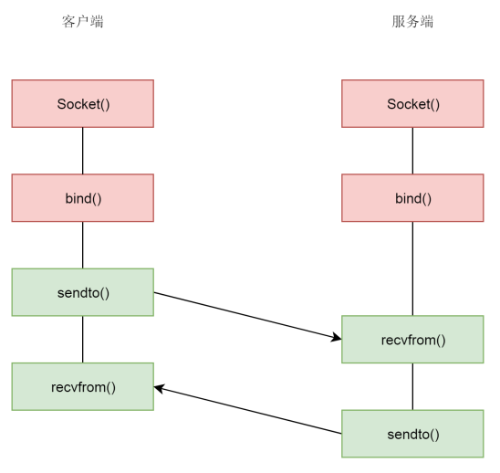

### 工具

System V IPC体系有一个统一的命令行工具： ipcmk， ipcs和ipcrm用于创建、 查看和删除 IPC 对象  


## 僵尸进程和孤儿进程

### 僵尸进程

子进程退出后需要父进程的确认收到才能在进程表中删除，而如果在自己成退出后，父进程并没有对其消亡进行确认，该进程就保存进程表中，占用资源。

可以使用 ps aux | grep Z 查看当前的僵尸进程。

使用 kill -s SIGCHLD pid 删除该父进程的所有僵尸进程

系统所能使用的进程号是有限的，如果产生大量僵尸进程，可能会因为没有可用的进程号而导致系统不能产生新的进程。如果要消灭系统中大量的僵尸进程，只需要将其父进程杀死，此时僵尸进程就会变成孤儿进程，从而被init进程所收养，这样init进程就会释放所有的僵尸进程所占用的资源，从而结束僵尸进程。

### 孤儿进程

当父进程死亡后，进程就变为了孤儿进程，由init进程代为收养。同时由init进程对其资源释放。

父进程如何知道子进程的存亡， 子进程如何知道父进程的存亡父进程可以使用 waitpid 查看子进程是否已经销毁，当其子进程销毁后，父进程会收到 SIGCHD 信号。

子进程只需查看其 ppid 是否是 1，也就是其父进程是否是 init，是否被 init 收养。

# 线程

## 线程

线程是进程的一个实体，一个进程可以拥有多个线程，多个线程也可以并发执行。一个没有线程的进程也可以看做是单线程的，同样线程也经常被看做是一种轻量级的进程。并且进程可以不依赖于线程而单独存在，而线程则不然。

进程是并发程序在一个数据集合上的一次执行过程，进程是系统进行资源分配和调度的独立单位，线程是进程的实体，它是比进程更小的能够独立执行的基本单元，线程自己不拥有任何系统资源，但是它可以访问其隶属进程的全部资源。

与进程的控制表 PCB 相似，线程也有自己的控制表 TCB，但是 TCB 中所保存的线程状态比 PCB 表少得多。

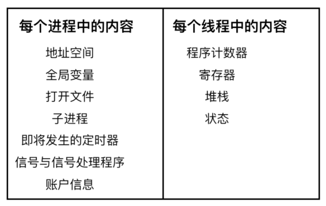

线程的特征和进程差不多，进程有的他基本都有，比如：

- 线程具有就绪、阻塞、运行三种基本状态，同样具有状态之间的转换关系；
- 线程间可以并发执行
- 在多 CPU 环境下，各个线程也可以分派到不同的 CPU 上并行执行

线程的优点：

- 一个进程中可以同时存在多个线程，这些线程共享该进程的资源。进程间的通信必须请求操作系统服务（因为 CPU 要切换到内核态），开销很大。而同进程下的线程间通信，无需操作系统干预，开销更小。

  不过，需要注意的是：从属于不同进程的线程间通信，也必须请求操作系统服务。

- 线程间的并发比进程的开销更小，系统并发性提升。

  同样，需要注意的是：从属于不同进程的线程间切换，它是会导致进程切换的，所以开销也大。

线程的缺点：

- 当进程中的一个线程奔溃时，会导致其所属进程的所有线程奔溃。

线程的分类：

- 内核级线程：这类线程依赖于内核，又称为内核支持的线程或轻量级进程。无论是在用户程序中的线程还是系统进程中的线程，它们的创建、撤销和切换都由内核实现。比如英特尔i5-8250U是4核8线程，这里的线程就是内核级线程
- 用户级线程：它仅存在于用户级中，这种线程是不依赖于操作系统核心的。应用进程利用线程库来完成其创建和管理，速度比较快，操作系统内核无法感知用户级线程的存在。

## 线程的创建和运行过程

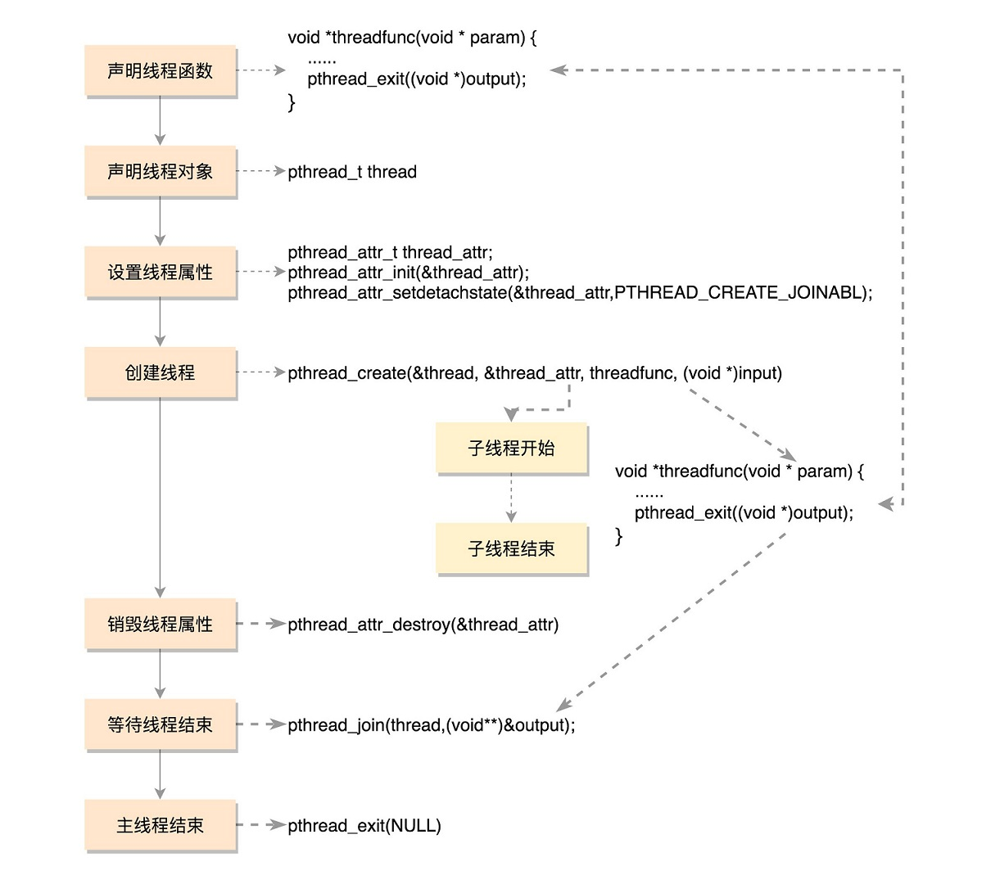

## 线程的数据  

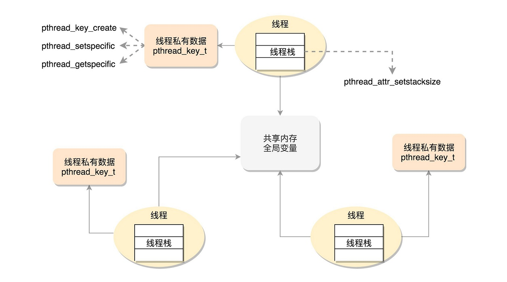

- 第一类是线程栈上的本地数据， 比如函数执行过程中的局部变量，栈的大小可以通过命令 ulimit -a 查看， 默认情况下线程栈大小为 8192（8MB）。可以使用命令 ulimit -s 修改

主线程在内存中有一个栈空间， 其他线程栈也拥有独立的栈空间。 为了避免线程之间的栈空间踩踏， 线程栈之间还会有小块区域， 用来隔离保护各自的栈空间。 一旦另一个线程踏入到这个隔离区， 就会引发段错误。  

- 第二类数据就是在整个进程里共享的全局数据。 例如，全局变量
- 第三类数据， 线程私有数据（Thread Specific Data） 

## 互斥

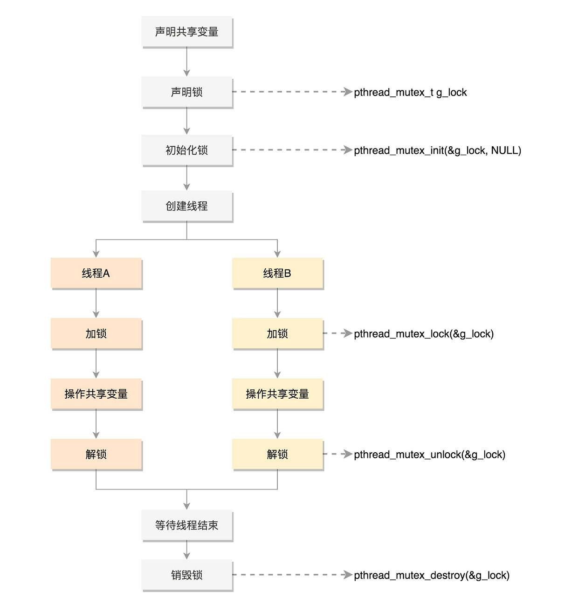

## 条件变量

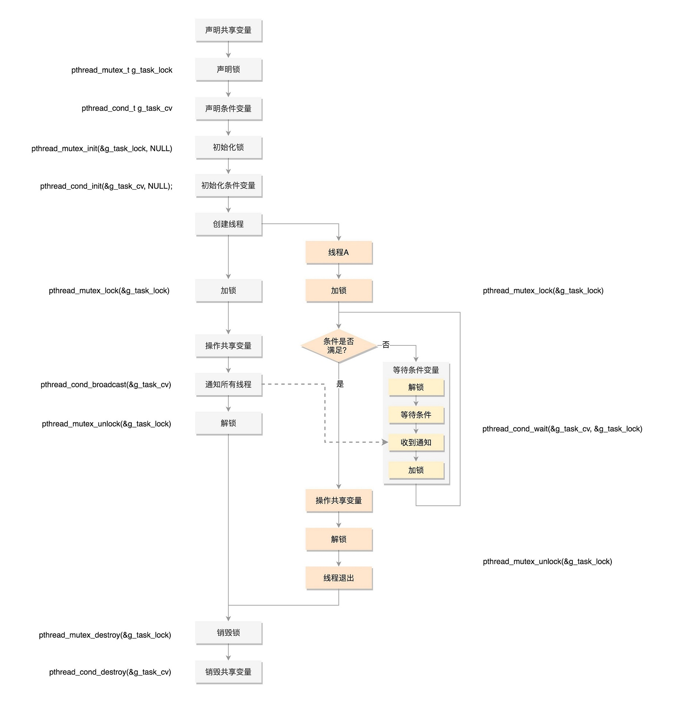

## OS 中都有什么锁

### 互斥锁

mutex（mutual exclusive）即互斥量（互斥体）。也便是常说的互斥锁。mutex是最常见的多线程同步方式。多线程共享一个互斥量，然后线程之间去竞争。得到锁的线程可以进入临界区执行代码。

### 读写锁

读写锁是一种 读共享，写独占的锁。

读写锁的特性：

- 当读写锁被加了写锁时，其他线程对该锁加读锁或者写锁都会阻塞（不是失败）
- 当读写锁被加了读锁时，其他线程对该锁加写锁会阻塞，加读锁会成功

### 自旋锁

自旋就是在共享资源的状态不满足时， 自旋锁持续不停的检测状态，它和其他锁的区别就在于不会使线程休眠，也就是不会产生上下文切换，但是会浪费cpu。

## 进程与线程的区别

- 拥有资源：进程是资源分配的基本单位，但是线程不拥有资源，线程可以访问隶属进程的资源
- 调度：线程是独立调度的基本单位，在同一进程中，线程的切换不会引起进程切换，从一个进程中的线程切换到另一个进程中的线程时，会引起进程切换
- 系统开销：由于创建或撤销进程时，系统都要为之分配或回收资源，如内存空间、I/O 设备等，所付出的开销远大于创建或撤销线程时的开销。类似地，在进行进程切换时，涉及当前执行进程 CPU 环境的保存及新调度进程 CPU 环境的设置，而线程切换时只需保存和设置少量寄存器内容，开销很小
- 通信方面：线程间可以通过直接读写同一进程中的数据进行通信，但是进程通信需要借助 IPC

创建过程区别:

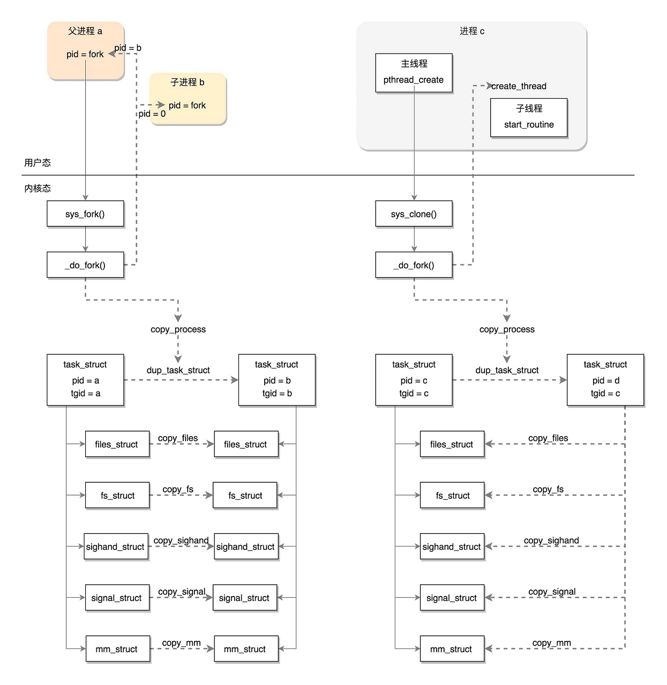

创建进程的话， 调用的系统调用是fork， 在copy_process函数里面， 会将五大结构 files_struct、fs_struct、 sighand_struct、signal_struct、 mm_struct 都复制一遍， 从此父进程和子进程各用各的数据结构。 而创建线程的话， 调用的是系统调用clone， 在copy_process函数里面， 五大结构仅仅是引用计数加一， 也即线程共享进程的数据结构。

## 协程

协程是用户态的一种轻量级线程，协程拥有自己的上下文和栈，协程调度时可以把上下文和栈保存在其他地方，协程能保留上一次调用时的状态，再次运行时能直接进入上次的状态。

协程的好处：

- 无需线程上下文切换的开销
- 无需原子操作锁定及同步的开销
- 方便切换控制流，简化编程模型

协程与线程的区别:

- 线程和进程都是同步机制，而协程是异步机制
- 线程是抢占式，而协程是非抢占式的。需要用户释放使用权切换到其他协程，因此同一时间其实只有一个协程拥有运行权，相当于单线程的能力
- 一个线程可以有多个协程，一个进程也可以有多个协程
- 协程不被操作系统内核管理，而完全是由程序控制。线程是被分割的 CPU 资源，协程是组织好的代码流程，线程是协程的资源。但协程不会直接使用线程，协程直接利用的是执行器关联任意线程或线程池
- 协程能保留上一次调用时的状态

## 死锁

什么是死锁：

在两个或者多个并发进程中，如果每个进程持有某种资源而又等待其它进程释放它或它们现在保持着的资源，在未改变这种状态之前都不能向前推进，称这一组进程产生了死锁。通俗的讲就是两个或多个进程无限期的阻塞、相互等待的一种状态。

死锁产生的四个必要条件（有一个条件不成立，则不会产生死锁）：

- 互斥条件：一个资源一次只能被一个进程使用
- 请求与保持条件：一个进程因请求资源而阻塞时，对已获得资源保持不放
- 不剥夺条件：进程获得的资源，在未完全使用完之前，不能强行剥夺
- 循环等待条件：若干进程之间形成一种头尾相接的环形等待资源关系

如何处理死锁问题：

- 忽略该问题。例如鸵鸟算法，该算法可以应用在极少发生死锁的的情况下。为什么叫鸵鸟算法呢，因为传说中鸵鸟看到危险就把头埋在地底下，可能鸵鸟觉得看不到危险也就没危险了吧。跟掩耳盗铃有点像
- 检测死锁并且恢复
- 仔细地对资源进行动态分配，以避免死锁
- 通过破除死锁四个必要条件之一，来防止死锁产生

# 内存管理

## 物理和虚拟内存

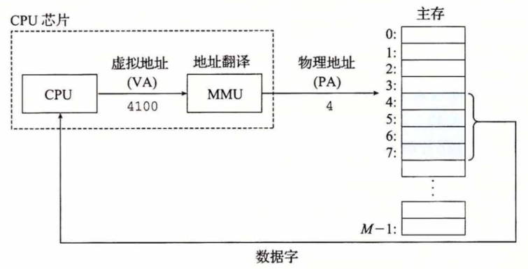

CPU 通过生成一个虚拟地址来访问主存，这个虚拟地址在被送到内存之前先转换成适当的物理地址。

将一个虚拟地址转换为物理地址的任务叫做地址翻译，由专门的硬件 MMU 负责。

## Linux 虚拟内存系统

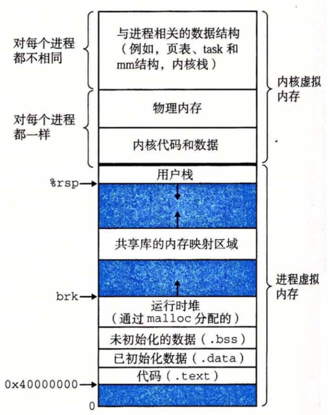

内核为系统中的每个进程维护一个单独的任务结构：task_struct，任务结构中的元素包含了或者指向内核运行该进程的所需要的所有信息。

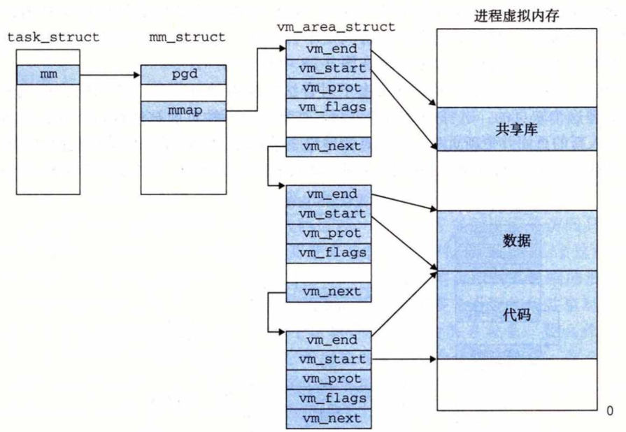

mm_struct 描述了虚拟内存的当前状态，其中 mmap 指向一个 vm_arem_structs 的链表，其中每个节点都描述了当前虚拟地址空间的一个区域。

Linux 缺页异常处理：

假如 MMU 在试图翻译某个虚拟地址时，发生了缺页，这个异常导致控制转移到内核的缺页处理程序：

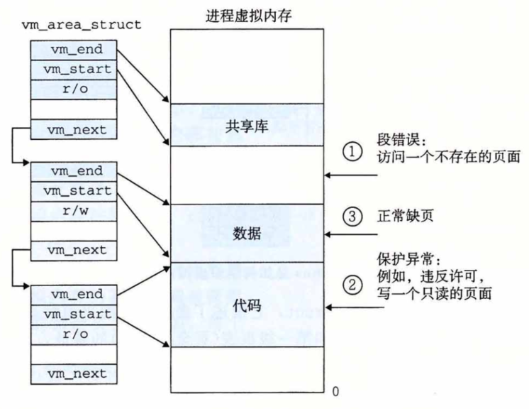

## 内存映射

Linux 通过将一个虚拟内存区域与一个磁盘上的对象关联起来，以初始化这个虚拟内存区域的内容，这个过程称为内存映射。

虚拟内存区域可以映射到两种类型的对象中的一种：

- Linux 文件系统中的普通文件。例如一个可执行目标文件，被分成页大小的片，每一片包含一个虚拟页面的初始内容，因为按需进行页面调度，所以这些虚拟页面没有实际交换进入物理内存，直到  CPU 第一次引用到页面。如果区域比文件区大，那么就用零来填充区域剩余的部分
- 匿名文件。匿名文件是由内核创建的包括的全是二进制零

无论在哪种情况下，一旦一个虚拟页面被初始化了，它就在一个内核维护的专门的交换文件之间换来换去。交换文件也叫交换空间或者交换区域。在任意时刻，交换空间都限制着当前运行着的进程能够分配的虚拟页面的总数。

## fork

fork 被当前进程调用时，内核为新进程创建各种数据结构，为了给这个新进程创建虚拟内存，它创建了当前进程的 mm_struct，区域结构和页表的原样副本，它将两个进程中的每个页面都标记为只读，并将两个进程中的每个区域结构都标记为私有的写时复制。

当 fork 在新进程返回时，新进程现在的虚拟内存刚好和调用 fork 时存在的虚拟内存相同。当两个进程中的任一个后来进行写操作时，写时复制就会创建新页面，也就为每个进程保持了私有地址空间。

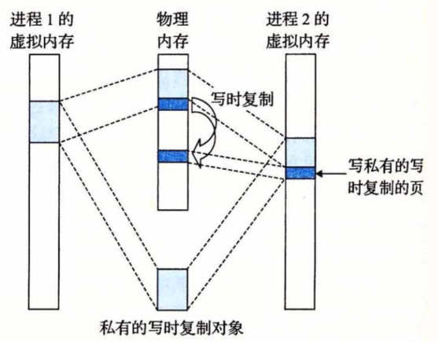

## execve

- 删除已存在的用户区域
- 映射私有区域
- 映射共享区域
- 设置程序计数器 PC

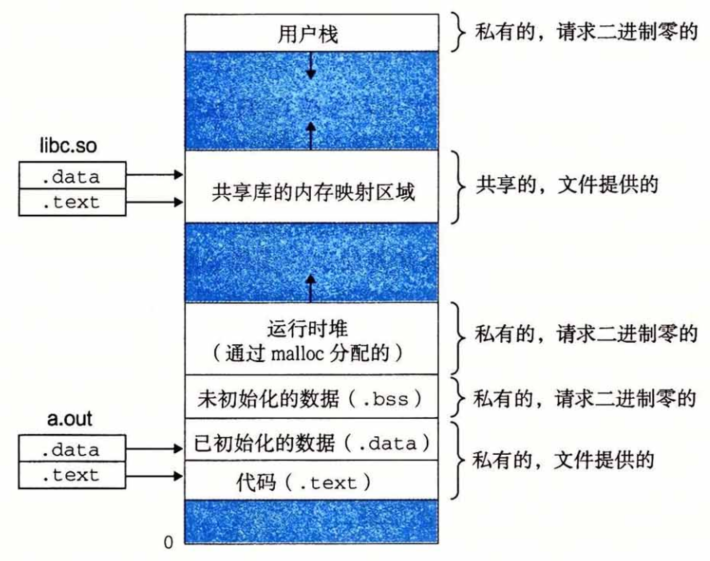

## mmap

mmap 函数要求内核创建一个新的虚拟内存区域。

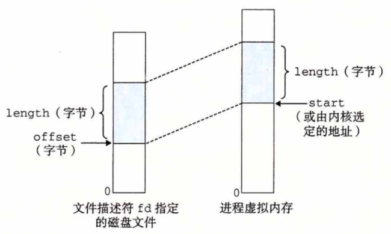

## 虚拟内存

虚拟内存的目的是为了让物理内存扩充成更大的逻辑内存，从而让程序获得更多的可用内存。

为了更好的管理内存，操作系统将内存抽象成地址空间。每个程序拥有自己的地址空间，这个地址空间被分割成多个块，每一块称为一页。这些页被映射到物理内存，但不需要映射到连续的物理内存，也不需要所有页都必须在物理内存中。当程序引用到不在物理内存中的页时，由硬件执行必要的映射，将缺失的部分装入物理内存并重新执行失败的指令。

从上面的描述中可以看出，虚拟内存允许程序不用将地址空间中的每一页都映射到物理内存，也就是说一个程序不需要全部调入内存就可以运行，这使得有限的内存运行大程序成为可能。例如有一台计算机可以产生 16 位地址，那么一个程序的地址空间范围是 0~64K。该计算机只有 32KB 的物理内存，虚拟内存技术允许该计算机运行一个 64K 大小的程序。

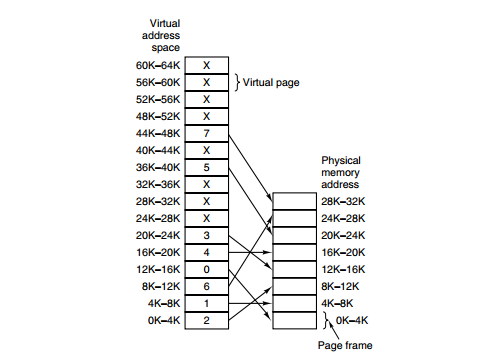

## 分页

把内存空间划分为大小相等且固定的块，作为主存的基本单位。因为程序数据存储在不同的页面中，而页面又离散的分布在内存中，因此需要一个页表来记录映射关系，以实现从页号到物理块号的映射。

访问分页系统中内存数据需要两次的内存访问 (一次是从内存中访问页表，从中找到指定的物理块号，加上页内偏移得到实际物理地址；第二次就是根据第一次得到的物理地址访问内存取出数据)。

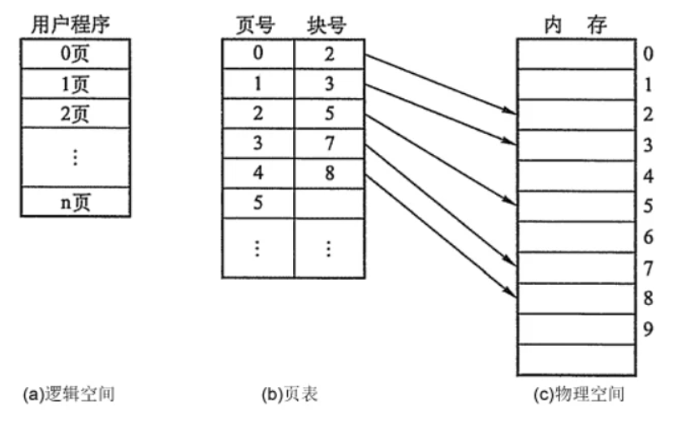

内存管理单元（MMU）管理着地址空间和物理内存的转换，其中的页表（Page table）存储着页（程序地址空间）和页框（物理内存空间）的映射表。

一个虚拟地址分成两个部分，一部分存储页面号，一部分存储偏移量。

下图的页表存放着 16 个页，这 16 个页需要用 4 个比特位来进行索引定位。例如对于虚拟地址（0010 000000000100），前 4 位是存储页面号 2，读取表项内容为（110 1），页表项最后一位表示是否存在于内存中，1 表示存在。后 12 位存储偏移量。这个页对应的页框的地址为 （110 000000000100）。

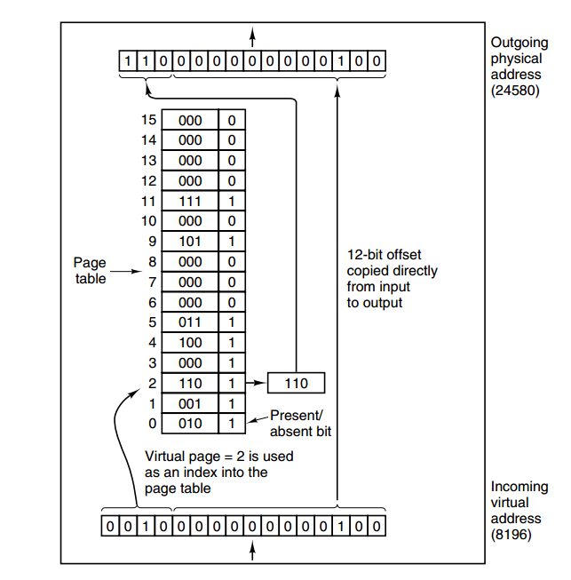

内存管理的原理：

-  虚拟内存空间的管理， 将虚拟内存分成大小相等的页
-  物理内存的管理， 将物理内存分成大小相等的页
- 内存映射， 将虚拟内存也和物理内存也映射起来， 并且在内存紧张的时候可以换出到硬盘中

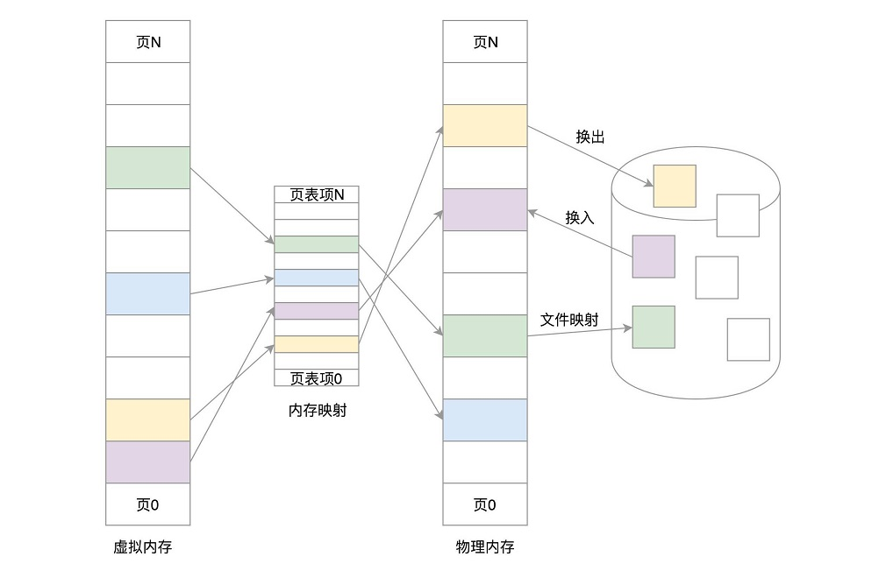

在程序运行过程中，如果要访问的页面不在内存中，就发生缺页中断从而将该页调入内存中。此时如果内存已无空闲空间，系统必须从内存中调出一个页面到磁盘对换区中来腾出空间。

从虚拟地址到物理地址的转换方式， 称为分页（Paging） 。对于物理内存，操作系统把它分成一块一块大小相同的页，这样更方便管理，例如有的内存页面
长时间不用了，可以暂时写到硬盘上，称为换出。一旦需要的时候，再加载进来，叫作换入。

这个换入和换出都是以页为单位的。 页面的大小一般为4KB。 为了能够定位和访问每个页， 需要有个页表， 保存每个页的起始地址， 再加上在页内的偏移量， 组成线性地址， 就能对于内存中的每个位置进行访问了。

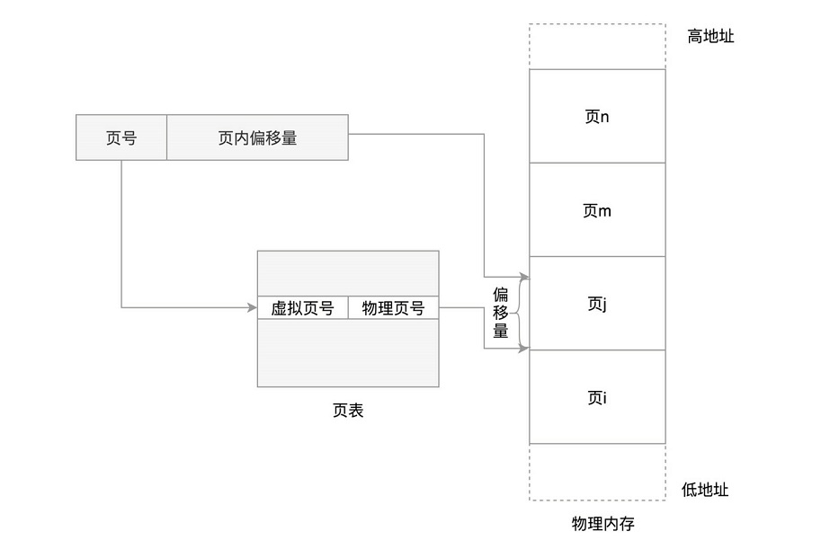

虚拟地址分为两部分， 页号和页内偏移。 页号作为页表的索引， 页表包含物理页每页所在物理内存的基地址。 这个基地址与页内偏移的组合就形成了物理内存地址。


页面置换算法和缓存淘汰策略类似，可以将内存看成磁盘的缓存。在缓存系统中，缓存的大小有限，当有新的缓存到达时，需要淘汰一部分已经存在的缓存，这样才有空间存放新的缓存数据。

页面置换算法的主要目标是使页面置换频率最低（也可以说缺页率最低）。

### 页面置换算法

### 最佳

OPT, Optimal replacement algorithm。所选择的被换出的页面将是最长时间内不再被访问，通常可以保证获得最低的缺页率。是一种理论上的算法，因为无法知道一个页面多长时间不再被访问。

#### 最近最久未使用

LRU, Least Recently Used。虽然无法知道将来要使用的页面情况，但是可以知道过去使用页面的情况。LRU 将最近最久未使用的页面换出。

为了实现 LRU，需要在内存中维护一个所有页面的链表。当一个页面被访问时，将这个页面移到链表表头。这样就能保证链表表尾的页面是最近最久未访问的。因为每次访问都需要更新链表，因此这种方式实现的 LRU 代价很高。

```
4，7，0，7，1，0，1，2，1，2，6
```

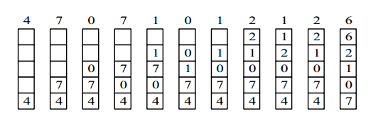

#### 最近未使用

NRU, Not Recently Used。

每个页面都有两个状态位：R 与 M，当页面被访问时设置页面的 R=1，当页面被修改时设置 M=1。其中 R 位会定时被清零。可以将页面分成以下四类：

```
R=0，M=0
R=0，M=1
R=1，M=0
R=1，M=1
```

当发生缺页中断时，NRU 算法随机地从类编号最小的非空类中挑选一个页面将它换出。NRU 优先换出已经被修改的脏页面（R=0，M=1），而不是被频繁使用的干净页面（R=1，M=0）。

##先进先出

FIFO, First In First Out。选择换出的页面是最先进入的页面。该算法会将那些经常被访问的页面换出，导致缺页率升高。

#### 第二次机会算法

FIFO 算法可能会把经常使用的页面置换出去，为了避免这一问题，对该算法做一个简单的修改：

当页面被访问 (读或写) 时设置该页面的 R 位为 1。需要替换的时候，检查最老页面的 R 位。如果 R 位是 0，那么这个页面既老又没有被使用，可以立刻置换掉；如果是 1，就将 R 位清 0，并把该页面放到链表的尾端，修改它的装入时间使它就像刚装入的一样，然后继续从链表的头部开始搜索。

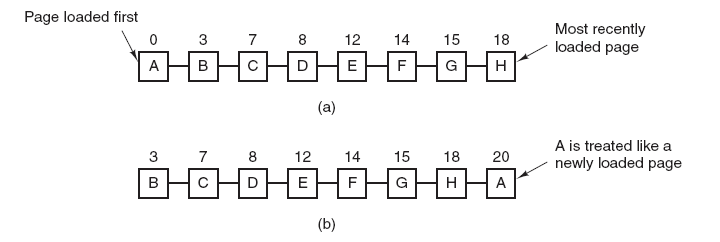

#### 时钟

Clock。第二次机会算法需要在链表中移动页面，降低了效率。时钟算法使用环形链表将页面连接起来，再使用一个指针指向最老的页面。

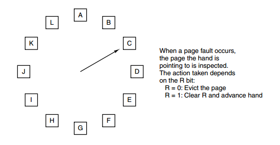

## 分段

分页是为了提高内存利用率，而分段是为了满足程序员在编写代码的时候的一些逻辑需求(比如数据共享，数据保护，动态链接等)。

分段内存管理当中，地址是二维的，一维是段号，二维是段内地址；其中每个段的长度是不一样的，而且每个段内部都是从0开始编址的。由于分段管理中，每个段内部是连续内存分配，但是段和段之间是离散分配的，因此也存在一个逻辑地址到物理地址的映射关系，相应的就是段表机制。

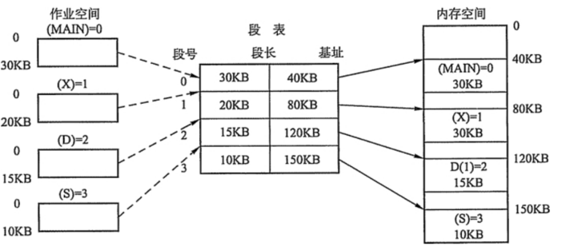

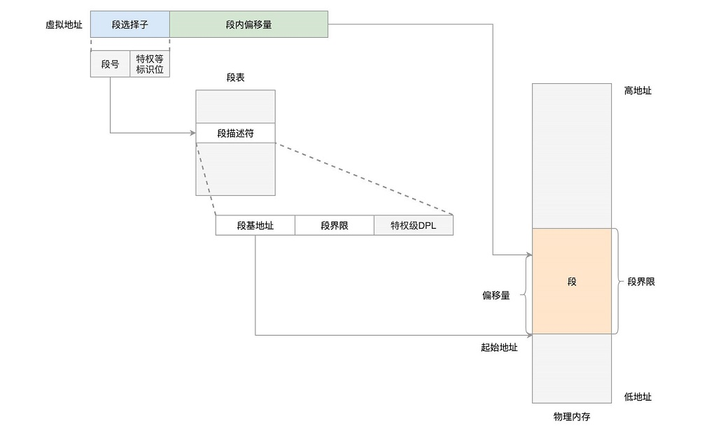

分段机制下的虚拟地址由两部分组成， 段选择子和段内偏移量。 段选择子就保存在段寄存器里面。 段选择子里面最重要的是段号， 用作段表的索引。 段表里面保存的是这个段的基地址、 段的界限和特权等级等。 虚拟地址中的段内偏移量应该位于0和段界限之间。 如果段内偏移量是合法的， 就将段基地址加上段内偏移量得到物理内存地址。

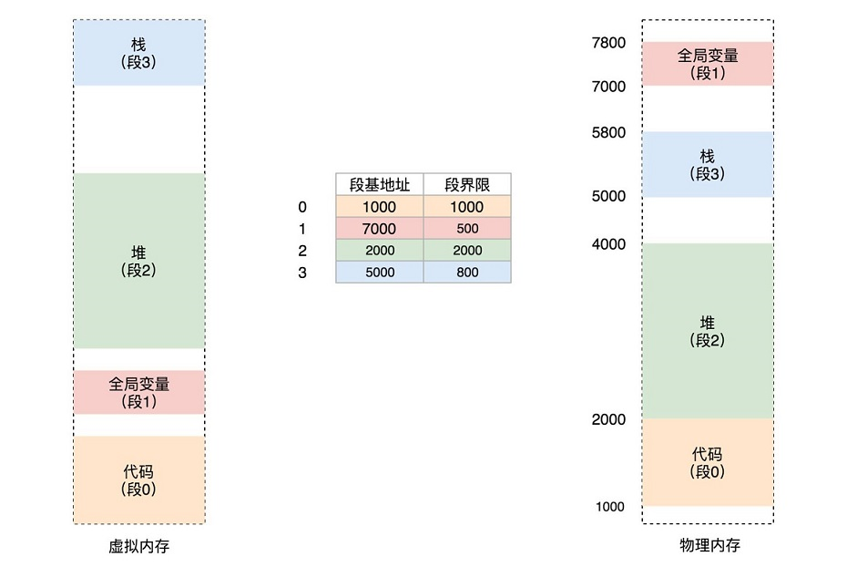


虚拟内存采用的是分页技术，也就是将地址空间划分成固定大小的页，每一页再与内存进行映射。

下图为一个编译器在编译过程中建立的多个表，有 4 个表是动态增长的，如果使用分页系统的一维地址空间，动态增长的特点会导致覆盖问题的出现。


分段的做法是把每个表分成段，一个段构成一个独立的地址空间。每个段的长度可以不同，并且可以动态增长。


### 分页与分段的比较

程序的地址空间划分成多个拥有独立地址空间的段，每个段上的地址空间划分成大小相同的页。这样既拥有分段系统的共享和保护，又拥有分页系统的虚拟内存功能。

共同点：

- 都是为了提高内存利用率，较少内存碎片
- 页和段都是离散存储的，所以两者都是离散分配内存的方式。每个页和段中的内存是连续的
- 都需要访问两次内存：第一次访问内存中的段表或者页表得到物理地址，第二次根据物理地址访问内存中的数据

区别：

- 分页主要用于实现虚拟内存，从而获得更大的地址空间；分段主要是为了使程序和数据可以被划分为逻辑上独立的地址空间并且有助于共享和保护

- 页大小是系统固定的，而段大小则通常不固定
- 分页是一维的，程序员只需用一个记忆符，即可表示一个地址;而分段是二维的，程序员在标识一个地址时，既要给出段名，又需给出段内地址
- 通常段比页大，因而段表比页表短，可以缩短查找时间，提高访问速度
- 页和段都有存储保护机制。但存取权限不同：段有读、写和执行三种权限；而页只有读和写两种权限

## 堆和栈的区别

- **申请方式**

  栈：由系统自动分配；

  堆：程序员自己申请

- **申请效率的比较**

  栈：速度较快。

  堆：一般速度比较慢，而且容易产生内存碎片。

- **堆和栈中的存储内容**

  栈：下一条指令的地址，函数的各个参数，函数中的局部变量。

  堆：堆中的具体内容由程序员安排。

# 文件系统与 IO

## 硬链接与软链接

硬链接是指将该文件名直接指向一个另一个文件的 inode，当删除原文件后，由于该文件名了解该文件 inode，所以不会受到影响。每次创建硬链接会使 inode 中记录的引用计数 +1，当引用计数减少到0，则释放该 inode。硬链接是不能跨文件系统建立的。

创建软链接会真正的分配一个 inode 存储指向原文件的文件名，也就是读取该 inode，则直接跳转到原文件的目录下进行查找原文件从而进行操作。所以，软链接是可以跨文件系统建立的。类似 windows 的快捷方式，给文件创建一个快速的访问路径，它依赖于原文件。

删除源文件后硬链接还可以访问源文件数据，软链接失效。原因：硬链接与源文件共用同一个inode，删除源文件后只是减少了inode的一个链接数，硬链接文件还可以继续访问源文件数据。而软链接是通过源文件路径来访问数据，但是源文件已经删除，所以路径访问不到，无法获取源文件数据。

## 磁盘调度算法

### 先来先服务(FCFS)

按照磁盘请求的顺序进行调度。

优点是公平和简单。缺点也很明显，因为未对寻道做任何优化，使平均寻道时间可能较长。

### 最短寻道时间优先(SSTF)

优先调度与当前磁头所在磁道距离最近的磁道。

虽然平均寻道时间比较低，但是不够公平。如果新到达的磁道请求总是比一个在等待的磁道请求近，那么在等待的磁道请求会一直等待下去，也就是出现饥饿现象。具体来说，两端的磁道请求更容易出现饥饿现象。

### 电梯扫描算法(SCAN)

电梯总是保持一个方向运行，直到该方向没有请求为止，然后改变运行方向。

电梯算法（扫描算法）和电梯的运行过程类似，总是按一个方向来进行磁盘调度，直到该方向上没有未完成的磁盘请求，然后改变方向。

## 常见IO模型

- 同步阻塞 IO（Blocking IO）：用户线程发起IO读/写操作之后，线程阻塞，直到可以开始处理数据
- 同步非阻塞I O（Non-blocking IO）：发起 IO 请求之后可以立即返回，如果没有就绪的数据，需要不断地发起 IO 请求直到数据就绪；不断重复请求消耗了大量的 CPU 资源
- IO 多路复用：是指单个进程/线程就可以同时处理多个IO请求
- 异步 IO（Asynchronous IO）：用户线程发出 IO 请求之后，继续执行，由内核进行数据的读取并放在用户指定的缓冲区内，在 IO 完成之后通知用户线程直接使用

## 中断

中断的处理过程：

- 保护现场：将当前执行程序的相关数据保存在寄存器中，然后入栈
- 开中断：以便执行中断时能响应较高级别的中断请求
- 中断处理
- 关中断：保证恢复现场时不被新中断打扰
- 恢复现场：从堆栈中按序取出程序数据，恢复中断前的执行状态

中断和轮询的区别：

- 轮询：CPU 对特定设备轮流询问。中断：通过特定事件提醒 CPU
- 轮询：效率低等待时间长，CPU 利用率不高。中断：容易遗漏问题，CPU 利用率不高