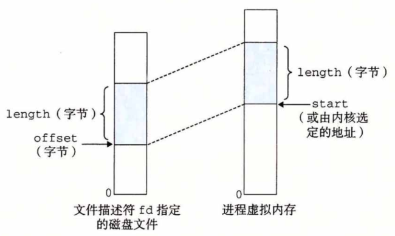

# 物理和虚拟内存


CPU 通过生成一个虚拟地址来访问主存，这个虚拟地址在被送到内存之前先转换成适当的物理地址。

将一个虚拟地址转换为物理地址的任务叫做地址翻译，由专门的硬件 MMU 负责。

# Linux 虚拟内存系统


内核为系统中的每个进程维护一个单独的任务结构：task_struct，任务结构中的元素包含了或者指向内核运行该进程的所需要的所有信息。


mm_struct 描述了虚拟内存的当前状态，其中 mmap 指向一个 vm_arem_structs 的链表，其中每个节点都描述了当前虚拟地址空间的一个区域。

Linux 缺页异常处理：

假如 MMU 在试图翻译某个虚拟地址时，发生了缺页，这个异常导致控制转移到内核的缺页处理程序：


#  内存映射

Linux 通过将一个虚拟内存区域与一个磁盘上的对象关联起来，以初始化这个虚拟内存区域的内容，这个过程称为内存映射。

虚拟内存区域可以映射到两种类型的对象中的一种：

- Linux 文件系统中的普通文件。例如一个可执行目标文件，被分成页大小的片，每一片包含一个虚拟页面的初始内容，因为按需进行页面调度，所以这些虚拟页面没有实际交换进入物理内存，直到  CPU 第一次引用到页面。如果区域比文件区大，那么就用零来填充区域剩余的部分
- 匿名文件。匿名文件是由内核创建的包括的全是二进制零

无论在哪种情况下，一旦一个虚拟页面被初始化了，它就在一个内核维护的专门的交换文件之间换来换去。交换文件也叫交换空间或者交换区域。在任意时刻，交换空间都限制着当前运行着的进程能够分配的虚拟页面的总数。

## fork

fork 被当前进程调用时，内核为新进程创建各种数据结构，为了给这个新进程创建虚拟内存，它创建了当前进程的 mm_struct，区域结构和页表的原样副本，它将两个进程中的每个页面都标记为只读，并将两个进程中的每个区域结构都标记为私有的写时复制。

当 fork 在新进程返回时，新进程现在的虚拟内存刚好和调用 fork 时存在的虚拟内存相同。当两个进程中的任一个后来进行写操作时，写时复制就会创建新页面，也就为每个进程保持了私有地址空间。


## execve

- 删除已存在的用户区域
- 映射私有区域
- 映射共享区域
- 设置程序计数器 PC


## mmap

mmap 函数要求内核创建一个新的虚拟内存区域。




虚拟内存的目的是为了让物理内存扩充成更大的逻辑内存，从而让程序获得更多的可用内存。

为了更好的管理内存，操作系统将内存抽象成地址空间。每个程序拥有自己的地址空间，这个地址空间被分割成多个块，每一块称为一页。这些页被映射到物理内存，但不需要映射到连续的物理内存，也不需要所有页都必须在物理内存中。当程序引用到不在物理内存中的页时，由硬件执行必要的映射，将缺失的部分装入物理内存并重新执行失败的指令。

从上面的描述中可以看出，虚拟内存允许程序不用将地址空间中的每一页都映射到物理内存，也就是说一个程序不需要全部调入内存就可以运行，这使得有限的内存运行大程序成为可能。例如有一台计算机可以产生 16 位地址，那么一个程序的地址空间范围是 0~64K。该计算机只有 32KB 的物理内存，虚拟内存技术允许该计算机运行一个 64K 大小的程序。


# 分页

把内存空间划分为大小相等且固定的块，作为主存的基本单位。因为程序数据存储在不同的页面中，而页面又离散的分布在内存中，因此需要一个页表来记录映射关系，以实现从页号到物理块号的映射。

访问分页系统中内存数据需要两次的内存访问 (一次是从内存中访问页表，从中找到指定的物理块号，加上页内偏移得到实际物理地址；第二次就是根据第一次得到的物理地址访问内存取出数据)。


内存管理单元（MMU）管理着地址空间和物理内存的转换，其中的页表（Page table）存储着页（程序地址空间）和页框（物理内存空间）的映射表。

一个虚拟地址分成两个部分，一部分存储页面号，一部分存储偏移量。

下图的页表存放着 16 个页，这 16 个页需要用 4 个比特位来进行索引定位。例如对于虚拟地址（0010 000000000100），前 4 位是存储页面号 2，读取表项内容为（110 1），页表项最后一位表示是否存在于内存中，1 表示存在。后 12 位存储偏移量。这个页对应的页框的地址为 （110 000000000100）。


# 页面置换算法

内存管理的原理：

-  虚拟内存空间的管理， 将虚拟内存分成大小相等的页
-  物理内存的管理， 将物理内存分成大小相等的页
- 内存映射， 将虚拟内存也和物理内存也映射起来， 并且在内存紧张的时候可以换出到硬盘中


在程序运行过程中，如果要访问的页面不在内存中，就发生缺页中断从而将该页调入内存中。此时如果内存已无空闲空间，系统必须从内存中调出一个页面到磁盘对换区中来腾出空间。

从虚拟地址到物理地址的转换方式， 称为分页（Paging） 。对于物理内存，操作系统把它分成一块一块大小相同的页，这样更方便管理，例如有的内存页面
长时间不用了，可以暂时写到硬盘上，称为换出。一旦需要的时候，再加载进来，叫作换入。

这个换入和换出都是以页为单位的。 页面的大小一般为4KB。 为了能够定位和访问每个页， 需要有个页表， 保存每个页的起始地址， 再加上在页内的偏移量， 组成线性地址， 就能对于内存中的每个位置进行访问了。


虚拟地址分为两部分， 页号和页内偏移。 页号作为页表的索引， 页表包含物理页每页所在物理内存的基地址。 这个基地址与页内偏移的组合就形成了物理内存地址。


页面置换算法和缓存淘汰策略类似，可以将内存看成磁盘的缓存。在缓存系统中，缓存的大小有限，当有新的缓存到达时，需要淘汰一部分已经存在的缓存，这样才有空间存放新的缓存数据。

页面置换算法的主要目标是使页面置换频率最低（也可以说缺页率最低）。

## 最佳

OPT, Optimal replacement algorithm。所选择的被换出的页面将是最长时间内不再被访问，通常可以保证获得最低的缺页率。是一种理论上的算法，因为无法知道一个页面多长时间不再被访问。

## 最近最久未使用

LRU, Least Recently Used。虽然无法知道将来要使用的页面情况，但是可以知道过去使用页面的情况。LRU 将最近最久未使用的页面换出。

为了实现 LRU，需要在内存中维护一个所有页面的链表。当一个页面被访问时，将这个页面移到链表表头。这样就能保证链表表尾的页面是最近最久未访问的。因为每次访问都需要更新链表，因此这种方式实现的 LRU 代价很高。

```
4，7，0，7，1，0，1，2，1，2，6
```


## 最近未使用

NRU, Not Recently Used。

每个页面都有两个状态位：R 与 M，当页面被访问时设置页面的 R=1，当页面被修改时设置 M=1。其中 R 位会定时被清零。可以将页面分成以下四类：

```
R=0，M=0
R=0，M=1
R=1，M=0
R=1，M=1
```

当发生缺页中断时，NRU 算法随机地从类编号最小的非空类中挑选一个页面将它换出。NRU 优先换出已经被修改的脏页面（R=0，M=1），而不是被频繁使用的干净页面（R=1，M=0）。

##先进先出

FIFO, First In First Out。选择换出的页面是最先进入的页面。该算法会将那些经常被访问的页面换出，导致缺页率升高。

## 第二次机会算法

FIFO 算法可能会把经常使用的页面置换出去，为了避免这一问题，对该算法做一个简单的修改：

当页面被访问 (读或写) 时设置该页面的 R 位为 1。需要替换的时候，检查最老页面的 R 位。如果 R 位是 0，那么这个页面既老又没有被使用，可以立刻置换掉；如果是 1，就将 R 位清 0，并把该页面放到链表的尾端，修改它的装入时间使它就像刚装入的一样，然后继续从链表的头部开始搜索。


## 时钟

Clock。第二次机会算法需要在链表中移动页面，降低了效率。时钟算法使用环形链表将页面连接起来，再使用一个指针指向最老的页面。


# 分段

分页是为了提高内存利用率，而分段是为了满足程序员在编写代码的时候的一些逻辑需求(比如数据共享，数据保护，动态链接等)。

分段内存管理当中，地址是二维的，一维是段号，二维是段内地址；其中每个段的长度是不一样的，而且每个段内部都是从0开始编址的。由于分段管理中，每个段内部是连续内存分配，但是段和段之间是离散分配的，因此也存在一个逻辑地址到物理地址的映射关系，相应的就是段表机制。


分段机制下的虚拟地址由两部分组成， 段选择子和段内偏移量。 段选择子就保存在段寄存器里面。 段选择子里面最重要的是段号， 用作段表的索引。 段表里面保存的是这个段的基地址、 段的界限和特权等级等。 虚拟地址中的段内偏移量应该位于0和段界限之间。 如果段内偏移量是合法的， 就将段基地址加上段内偏移量得到物理内存地址。


虚拟内存采用的是分页技术，也就是将地址空间划分成固定大小的页，每一页再与内存进行映射。

下图为一个编译器在编译过程中建立的多个表，有 4 个表是动态增长的，如果使用分页系统的一维地址空间，动态增长的特点会导致覆盖问题的出现。


分段的做法是把每个表分成段，一个段构成一个独立的地址空间。每个段的长度可以不同，并且可以动态增长。


## 分页与分段的比较

程序的地址空间划分成多个拥有独立地址空间的段，每个段上的地址空间划分成大小相同的页。这样既拥有分段系统的共享和保护，又拥有分页系统的虚拟内存功能。

共同点：

- 都是为了提高内存利用率，较少内存碎片
- 页和段都是离散存储的，所以两者都是离散分配内存的方式。每个页和段中的内存是连续的
- 都需要访问两次内存：第一次访问内存中的段表或者页表得到物理地址，第二次根据物理地址访问内存中的数据

区别：

- 分页主要用于实现虚拟内存，从而获得更大的地址空间；分段主要是为了使程序和数据可以被划分为逻辑上独立的地址空间并且有助于共享和保护

- 页大小是系统固定的，而段大小则通常不固定
- 分页是一维的，程序员只需用一个记忆符，即可表示一个地址;而分段是二维的，程序员在标识一个地址时，既要给出段名，又需给出段内地址
- 通常段比页大，因而段表比页表短，可以缩短查找时间，提高访问速度
- 页和段都有存储保护机制。但存取权限不同：段有读、写和执行三种权限；而页只有读和写两种权限

### 堆和栈的区别

- **申请方式**

  栈：由系统自动分配；

  堆：程序员自己申请

- **申请效率的比较**

  栈：速度较快。

  堆：一般速度比较慢，而且容易产生内存碎片。

- **堆和栈中的存储内容**

  栈：下一条指令的地址，函数的各个参数，函数中的局部变量。

  堆：堆中的具体内容由程序员安排。

