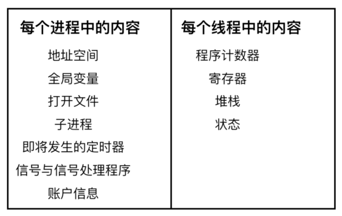

# 线程

线程是进程的一个实体，一个进程可以拥有多个线程，多个线程也可以并发执行。一个没有线程的进程也可以看做是单线程的，同样线程也经常被看做是一种轻量级的进程。并且进程可以不依赖于线程而单独存在，而线程则不然。

进程是并发程序在一个数据集合上的一次执行过程，进程是系统进行资源分配和调度的独立单位，线程是进程的实体，它是比进程更小的能够独立执行的基本单元，线程自己不拥有任何系统资源，但是它可以访问其隶属进程的全部资源。

与进程的控制表 PCB 相似，线程也有自己的控制表 TCB，但是 TCB 中所保存的线程状态比 PCB 表少得多。

线程的特征和进程差不多，进程有的他基本都有，比如：

- 线程具有就绪、阻塞、运行三种基本状态，同样具有状态之间的转换关系；
- 线程间可以并发执行
- 在多 CPU 环境下，各个线程也可以分派到不同的 CPU 上并行执行

线程的优点：

- 一个进程中可以同时存在多个线程，这些线程共享该进程的资源。进程间的通信必须请求操作系统服务（因为 CPU 要切换到内核态），开销很大。而同进程下的线程间通信，无需操作系统干预，开销更小。

  不过，需要注意的是：从属于不同进程的线程间通信，也必须请求操作系统服务。

- 线程间的并发比进程的开销更小，系统并发性提升。

  同样，需要注意的是：从属于不同进程的线程间切换，它是会导致进程切换的，所以开销也大。

线程的缺点：

- 当进程中的一个线程奔溃时，会导致其所属进程的所有线程奔溃。

线程的分类：

- 内核级线程：这类线程依赖于内核，又称为内核支持的线程或轻量级进程。无论是在用户程序中的线程还是系统进程中的线程，它们的创建、撤销和切换都由内核实现。比如英特尔i5-8250U是4核8线程，这里的线程就是内核级线程
- 用户级线程：它仅存在于用户级中，这种线程是不依赖于操作系统核心的。应用进程利用线程库来完成其创建和管理，速度比较快，操作系统内核无法感知用户级线程的存在。

# 线程的创建和运行过程

# 线程的数据  

- 第一类是线程栈上的本地数据， 比如函数执行过程中的局部变量，栈的大小可以通过命令 ulimit -a 查看， 默认情况下线程栈大小为 8192（8MB）。可以使用命令 ulimit -s 修改

主线程在内存中有一个栈空间， 其他线程栈也拥有独立的栈空间。 为了避免线程之间的栈空间踩踏， 线程栈之间还会有小块区域， 用来隔离保护各自的栈空间。 一旦另一个线程踏入到这个隔离区， 就会引发段错误。  

- 第二类数据就是在整个进程里共享的全局数据。 例如，全局变量
- 第三类数据， 线程私有数据（Thread Specific Data） 

# 互斥

# 条件变量

## 进程和线程

## 创建过程区别

创建进程的话， 调用的系统调用是fork， 在copy_process函数里面， 会将五大结构 files_struct、fs_struct、 sighand_struct、signal_struct、 mm_struct 都复制一遍， 从此父进程和子进程各用各的数据结构。 而创建线程的话， 调用的是系统调用clone， 在copy_process函数里面， 五大结构仅仅是引用计数加一， 也即线程共享进程的数据结构。

# OS 中都有什么锁

## 互斥锁

mutex（mutual exclusive）即互斥量（互斥体）。也便是常说的互斥锁。mutex是最常见的多线程同步方式。多线程共享一个互斥量，然后线程之间去竞争。得到锁的线程可以进入临界区执行代码。

## 读写锁

读写锁是一种 读共享，写独占的锁。

读写锁的特性：

- 当读写锁被加了写锁时，其他线程对该锁加读锁或者写锁都会阻塞（不是失败）
- 当读写锁被加了读锁时，其他线程对该锁加写锁会阻塞，加读锁会成功

##  自旋锁

自旋就是在共享资源的状态不满足时， 自旋锁持续不停的检测状态，它和其他锁的区别就在于不会使线程休眠，也就是不会产生上下文切换，但是会浪费cpu。

# 进程与线程的区别

- 拥有资源：进程是资源分配的基本单位，但是线程不拥有资源，线程可以访问隶属进程的资源
- 调度：线程是独立调度的基本单位，在同一进程中，线程的切换不会引起进程切换，从一个进程中的线程切换到另一个进程中的线程时，会引起进程切换
- 系统开销：由于创建或撤销进程时，系统都要为之分配或回收资源，如内存空间、I/O 设备等，所付出的开销远大于创建或撤销线程时的开销。类似地，在进行进程切换时，涉及当前执行进程 CPU 环境的保存及新调度进程 CPU 环境的设置，而线程切换时只需保存和设置少量寄存器内容，开销很小
- 通信方面：线程间可以通过直接读写同一进程中的数据进行通信，但是进程通信需要借助 IPC

# 协程

协程是用户态的一种轻量级线程，协程拥有自己的上下文和栈，协程调度时可以把上下文和栈保存在其他地方，协程能保留上一次调用时的状态，再次运行时能直接进入上次的状态。

协程的好处：

- 无需线程上下文切换的开销
- 无需原子操作锁定及同步的开销
- 方便切换控制流，简化编程模型

## 协程与线程的区别

- 线程和进程都是同步机制，而协程是异步机制
- 线程是抢占式，而协程是非抢占式的。需要用户释放使用权切换到其他协程，因此同一时间其实只有一个协程拥有运行权，相当于单线程的能力
- 一个线程可以有多个协程，一个进程也可以有多个协程
- 协程不被操作系统内核管理，而完全是由程序控制。线程是被分割的 CPU 资源，协程是组织好的代码流程，线程是协程的资源。但协程不会直接使用线程，协程直接利用的是执行器关联任意线程或线程池
- 协程能保留上一次调用时的状态

# 死锁

什么是死锁：

在两个或者多个并发进程中，如果每个进程持有某种资源而又等待其它进程释放它或它们现在保持着的资源，在未改变这种状态之前都不能向前推进，称这一组进程产生了死锁。通俗的讲就是两个或多个进程无限期的阻塞、相互等待的一种状态。

死锁产生的四个必要条件（有一个条件不成立，则不会产生死锁）：

- 互斥条件：一个资源一次只能被一个进程使用
- 请求与保持条件：一个进程因请求资源而阻塞时，对已获得资源保持不放
- 不剥夺条件：进程获得的资源，在未完全使用完之前，不能强行剥夺
- 循环等待条件：若干进程之间形成一种头尾相接的环形等待资源关系

如何处理死锁问题：

- 忽略该问题。例如鸵鸟算法，该算法可以应用在极少发生死锁的的情况下。为什么叫鸵鸟算法呢，因为传说中鸵鸟看到危险就把头埋在地底下，可能鸵鸟觉得看不到危险也就没危险了吧。跟掩耳盗铃有点像
- 检测死锁并且恢复
- 仔细地对资源进行动态分配，以避免死锁
- 通过破除死锁四个必要条件之一，来防止死锁产生
