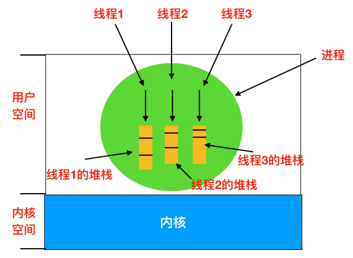

# 线程的创建和运行过程

# 线程的数据  

- 第一类是线程栈上的本地数据， 比如函数执行过程中的局部变量，栈的大小可以通过命令 ulimit -a 查看， 默认情况下线程栈大小为 8192（8MB）。可以使用命令 ulimit -s 修改

主线程在内存中有一个栈空间， 其他线程栈也拥有独立的栈空间。 为了避免线程之间的栈空间踩踏， 线程栈之间还会有小块区域， 用来隔离保护各自的栈空间。 一旦另一个线程踏入到这个隔离区， 就会引发段错误。  

- 第二类数据就是在整个进程里共享的全局数据。 例如，全局变量
- 第三类数据， 线程私有数据（Thread Specific Data） 

# 互斥

# 条件变量

## 进程和线程

## 创建过程区别

创建进程的话， 调用的系统调用是fork， 在copy_process函数里面， 会将五大结构 files_struct、fs_struct、 sighand_struct、signal_struct、 mm_struct 都复制一遍， 从此父进程和子进程各用各的数据结构。 而创建线程的话， 调用的是系统调用clone， 在copy_process函数里面， 五大结构仅仅是引用计数加一， 也即线程共享进程的数据结构。

# 线程

进程是资源分配的基本单位，线程是独立调度的基本单位。

## 进程与线程的区别

- 拥有资源：进程是资源分配的基本单位，但是线程不拥有资源，线程可以访问隶属进程的资源
- 调度：线程是独立调度的基本单位，在同一进程中，线程的切换不会引起进程切换，从一个进程中的线程切换到另一个进程中的线程时，会引起进程切换
- 系统开销：由于创建或撤销进程时，系统都要为之分配或回收资源，如内存空间、I/O 设备等，所付出的开销远大于创建或撤销线程时的开销。类似地，在进行进程切换时，涉及当前执行进程 CPU 环境的保存及新调度进程 CPU 环境的设置，而线程切换时只需保存和设置少量寄存器内容，开销很小
- 通信方面：线程间可以通过直接读写同一进程中的数据进行通信，但是进程通信需要借助 IPC

线程的特征和进程差不多，进程有的他基本都有，比如：

- 线程具有就绪、阻塞、运行三种基本状态，同样具有状态之间的转换关系；
- 线程间可以并发执行
- 在多 CPU 环境下，各个线程也可以分派到不同的 CPU 上并行执行

线程的优点：

- 一个进程中可以同时存在多个线程，这些线程共享该进程的资源。进程间的通信必须请求操作系统服务（因为 CPU 要切换到内核态），开销很大。而同进程下的线程间通信，无需操作系统干预，开销更小。

  不过，需要注意的是：从属于不同进程的线程间通信，也必须请求操作系统服务。

- 线程间的并发比进程的开销更小，系统并发性提升。

  同样，需要注意的是：从属于不同进程的线程间切换，它是会导致进程切换的，所以开销也大。

线程的缺点：

- 当进程中的一个线程奔溃时，会导致其所属进程的所有线程奔溃。

每个线程都有自己的堆栈：

