# 进程

进程是程序在某个数据集合上的一次运行活动，也是操作系统进行资源分配和保护的基本单位。

进程就是程序的一次执行过程，程序是静态的，它作为系统中的一种资源是永远存在的。而进程是动态的，它是动态的产生，变化和消亡的，拥有其自己的生命周期。

## 进程的组成

进程主要由三个部分组成：

- 进程控制块 PCB。每个进程有且仅有一个进程控制块（Process Control Block，PCB），或称进程描述符，它是进程存在的唯一标识，是操作系统用来记录和刻画进程状态及环境信息的数据结构，也是操作系统掌握进程的唯一资料结构和管理进程的主要依据。所以说 PCB 是提供给操作系统使用的。包含如下几个部分：
  - 进程描述信息：当进程被创建时，操作系统会为该进程分配一个唯一的、不重复的 “身份证号”— PID（ProcessID，进程 ID）
  - 进程控制和管理信息：记录进程的运行情况。比如 CPU 的使用时间、磁盘使用情况、网络流量使用情况等
  - 资源分配清单：记录给进程分配了哪些资源。比如分配了多少内存、正在使用哪些 I/O 设备、正在使用哪些文件等
  - CPU 相关信息：进程在让出 CPU 时，必须保存该进程在 CPU 中的各种信息，比如各种寄存器的值。用于实现进程切换，确保这个进程再次运行的时候恢复 CPU 现场，从断点处继续执行。这就是所谓的保存现场信息

- 数据段。即进程运行过程中各种数据（比如程序中定义的变量）
- 程序段。就是程序的代码（指令序列）

## 进程的状态

三态模型：

- 运行态（running）：进程占有 CPU 正在运行
- 就绪态（ready）：进程具备运行条件，等待系统分配 CPU 以便运行
- 阻塞态 / 等待态（wait）：进程不具备运行条件，正在等待某个事件的完成

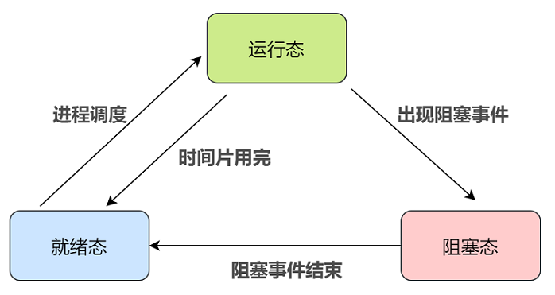


阻塞态是由于缺少需要的资源从而由运行态转换而来，但是该资源不包括 CPU 时间片，缺少 CPU 时间片会从运行态转换为就绪态。

五态模型：

- 新建态（new）：进程正在被创建时的状态
- 终止态（exit）：进程正在从系统中消失时的状态

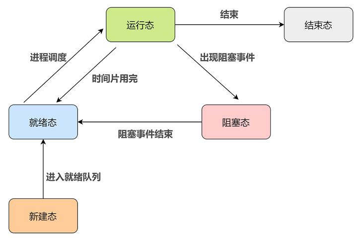

只有就绪态和运行态可以相互转换，其它的都是单向转换。

## 进程控制

所谓进程控制就是对系统中的所有进程实施有效的管理，实现进程状态转换功能。包括创建进程、阻塞进程、唤醒进程、终止进程等。这些功能均由原语来实现。原语是一种特殊的程序，它的执行具有原子性。 也就是说，这段程序的运行必须一气呵成，不可中断。原语是操作系统内核里的一段程序：

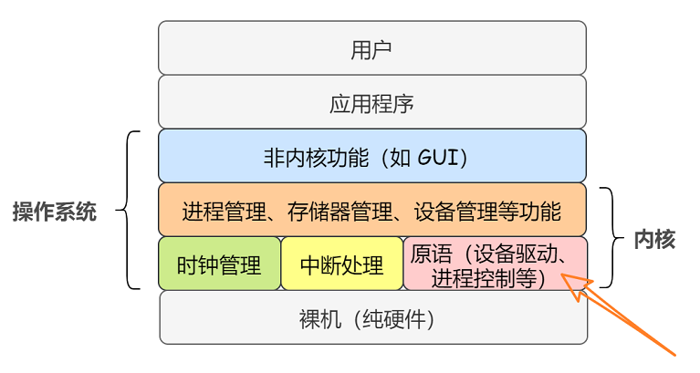

### 进程的创建

操作系统初始启动时会创建承担系统资源分配和控制管理的一些系统进程，同时还会创建一个所有用户进程的祖先，其他用户进程是在应用程序运行时创建的。

操作系统允许一个进程创建另一个进程，而且允许子进程继承父进程所拥有的资源，当子进程被终止时，其在父进程处继承的资源应当还给父进程。同时，终止父进程时同时也会终止其所有的子进程。

创建进程的过程，也就是创建原语包含的内容如下：

- 在进程列表中增加一项，从 PCB 池中申请一个空闲的 PCB（PCB 是有限的，若申请失败则创建失败），为新进程分配一个唯一的进程标识符
- 为新进程分配地址空间，由进程管理程序确定加载至进程地址空间中的程序
- 为新进程分配各种资源
- 初始化 PCB，如进程标识符、CPU 初始状态等
- 把新进程的状态设置为就绪态，并将其移入就绪队列，等待被调度运行

### 进程的终止
进程的终止也称为撤销，进程完成特定工作或出现严重错误后必须被终止。引起进程终止的事件有三种：

- 正常结束：进程自己请求终止（exit 系统调用）
- 异常结束：比如整数除 0，非法使用特权指令，然后被操作系统强行终止
- 外界干预：用户手动杀死进程

终止（撤销）进程的过程，也就是撤销原语包含的内容如下：

- 从 PCB 集合中找到终止进程的 PCB
- 若进程处于运行态，则立即剥夺其 CPU，终止该进程的执行，然后将 CPU 资源分配给其他进程；
- 如果其还有子进程，则应将其所有子进程终止
- 将该进程所拥有的全部资源都归还给父进程或操作系统
- 回收 PCB 并将其归还至 PCB 池

### 进程的阻塞和唤醒
进程阻塞是指进程让出 CPU 资源转而等待一个事件，如等待资源、等待 I/O 操作完成等。进程通常使用阻塞原语来阻塞自己，所以阻塞是进程的自主行为，是一个同步事件。当等待事件完成时会产生一个中断，激活操作系统，在系统的控制下将被阻塞的进程唤醒，也就是唤醒原语。进程的阻塞和唤醒显然是由进程切换来完成的。

进程的阻塞步骤，也就是阻塞原语的内容为：

- 找到将要被阻塞的进程对应的 PCB
- 保护进程运行现场，将 PCB 状态信息设置为阻塞态，暂时停止进程运行
- 将该 PCB 插入相应事件的阻塞队列（等待队列）

进程的唤醒步骤，也就是唤醒原语的内容为：

- 在该事件的阻塞队列中找到相应进程的 PCB
- 将该 PCB 从阻塞队列中移出，并将进程的状态设置为就绪态
- 把该 PCB 插入到就绪队列中，等待被调度程序调度

阻塞原语和唤醒原语的作用正好相反，阻塞原语使得进程从运行态转为阻塞态，而唤醒原语使得进程从阻塞态转为就绪态。如果某个进程使用阻塞原语来阻塞自己，那么他就必须使用唤醒原语来唤醒自己，因何事阻塞，就由何事唤醒，否则被阻塞的进程将永远处于阻塞态。因此，阻塞原语和唤醒原语是成对出现的。

## 进程上下文切换

所谓进程的上下文切换，就是说各个进程之间是共享 CPU 资源的，不可能一个进程永远占用着 CPU 资源，不同的时候进程之间需要切换，使得不同的进程被分配 CPU 资源，这个过程就是进程的上下文切换，一个进程切换到另一个进程运行。

因为进程是由内核进行管理和调度的，所以进程的上下文切换一定发生在内核态。

进程上下文的切换也是一个原语操作，称为切换原语，其内容如下：

- 首先，将进程 A 的运行环境信息存入 PCB，这个运行环境信息就是进程的上下文（Context）

- 然后，将 PCB 移入相应的进程队列

- 选择另一个进程 B 进行执行，并更新其 PCB 中的状态为运行态

- 当进程 A 被恢复运行的时候，根据它的 PCB 恢复进程 A 所需的运行环境

引起进程上下文切换的事件，也就是某个占用 CPU 资源运行的当前进程被赶出 CPU 的原因有如下：

- 当前进程的时间片到
- 有更高优先级的进程到达
- 当前进程主动阻塞
- 当前进程终止


# 进程通信

进程通信（InterProcess Communication，IPC）就是指进程之间的信息交换。

为了保证安全，每个进程的用户地址空间都是独立的，一般而言一个进程不能直接访问另一个进程的地址空间，不过内核空间是每个进程都共享的，所以进程之间想要进行信息交换就必须通过内核。

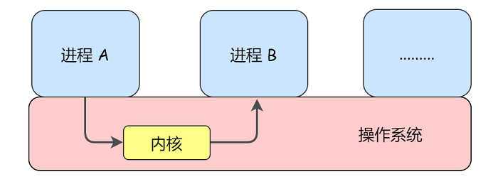

 Linux 内核提供的常见的进程通信机制：

- 管道（也称作共享文件）
- 消息队列（也称作消息传递）
- 共享内存（也称作共享存储）
- 信号量和 PV 操作
- 信号
- 套接字（Socket）

## 管道

### 匿名管道

- 管道的数据是单向流动的
- 匿名管道只能用于父子进程之间的通信

通过 `pipe` 函数来创建匿名管道：

```
int pipe (int fd[2]);  //@ 若创建成功则返回 0，创建失败就返回 -1
```

- `fd[0]` 指向管道的读端，`fd[1]` 指向管道的写端
- `fd[1]` 的输出是 `fd[0]` 的输入

匿名管道实现进程间通信的步骤：

- 父进程创建两个匿名管道，管道 1（fd1[0]和 fd1[1]）和管道 2（fd2[0] 和 fd2[1]）；因为管道的数据是单向流动的，所以要想实现数据双向通信，就需要两个管道，每个方向一个
- 父进程 fork 出子进程，于是对于这两个匿名管道，子进程也分别有两个文件描述符指向匿名管道的读写两端
- 父进程关闭管道 1 的读端 fd1[0] 和 管道 2 的写端 fd2[1]，子进程关闭管道 1 的写端 fd1[1] 和 管道 2 的读端 fd2[0]，这样，管道 1 只能用于父进程写、子进程读；管道 2 只能用于父进程读、子进程写。管道是用环形队列实现的，数据从写端流入从读端流出，这就实现了父子进程之间的双向通信

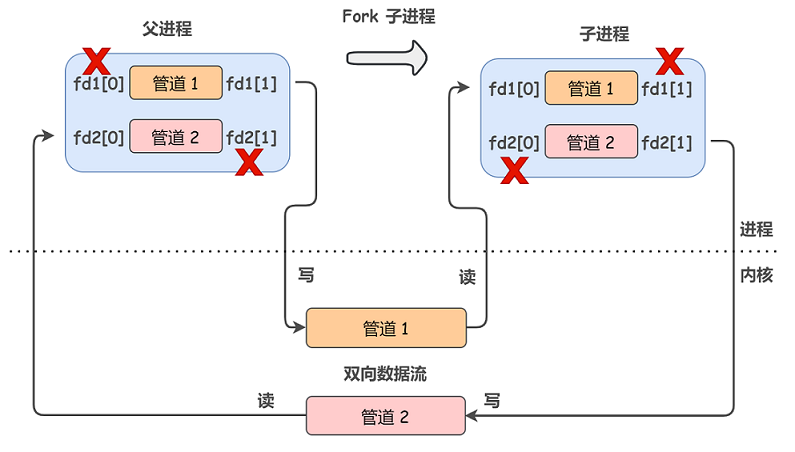

管道的本质就是内核在内存中开辟了一个缓冲区，这个缓冲区与管道文件相关联，对管道文件的操作，被内核转换成对这块缓冲区的操作。

### 有名管道

匿名管道由于没有名字，只能用于父子进程间的通信。为了克服这个缺点，提出了有名管道，也称做 FIFO，因为数据是先进先出的传输方式。

所谓有名管道也就是提供一个路径名与之关联，这样，即使与创建有名管道的进程不存在亲缘关系的进程，只要可以访问该路径，就能够通过这个有名管道进行相互通信。

`mkfifo` 来创建有名管道：

````
````

## 消息队列

管道这种进程通信方式虽然使用简单，但是效率比较低，不适合进程间频繁地交换数据，并且管道只能传输无格式的字节流。为此，消息传递机制（Linux 中称消息队列）应用而生。比如，A 进程要给 B 进程发送消息，A 进程把数据放在对应的消息队列后就可以正常返回了，B 进程在需要的时候自行去消息队列中读取数据就可以了。同样的，B 进程要给 A 进程发送消息也是如此。

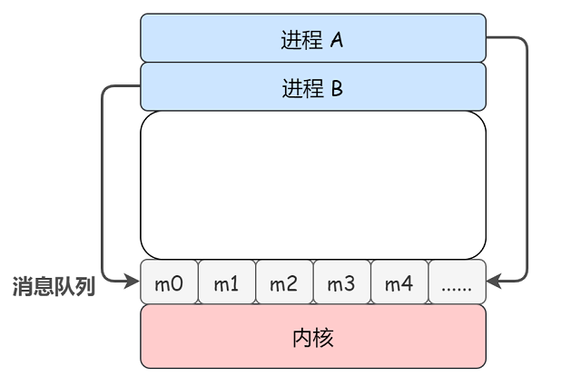

消息队列的本质就是存放在内存中的消息的链表，而消息本质上是用户自定义的数据结构。如果进程从消息队列中读取了某个消息，这个消息就会被从消息队列中删除。对比一下管道机制：

- 消息队列允许一个或多个进程向它写入或读取消息
- 消息队列可以实现消息的随机查询，不一定非要以先进先出的次序读取消息，也可以按消息的类型读取。比有名管道的先进先出原则更有优势
- 对于消息队列来说，在某个进程往一个队列写入消息之前，并不需要另一个进程在该消息队列上等待消息的到达。而对于管道来说，除非读进程已存在，否则先有写进程进行写入操作是没有意义的
- 消息队列的生命周期随内核，如果没有释放消息队列或者没有关闭操作系统，消息队列就会一直存在。而匿名管道随进程的创建而建立，随进程的结束而销毁

需要注意的是，消息队列对于交换较少数量的数据很有用，因为无需避免冲突。但是，由于用户进程写入数据到内存中的消息队列时，会发生从用户态拷贝数据到内核态的过程；同样的，另一个用户进程读取内存中的消息数据时，会发生从内核态拷贝数据到用户态的过程。因此，如果数据量较大，使用消息队列就会造成频繁的系统调用，也就是需要消耗更多的时间以便内核介入。

## 共享内存

为了避免像消息队列那样频繁的拷贝消息、进行系统调用，共享内存机制出现了。共享内存就是允许不相干的进程将同一段物理内存连接到它们各自的地址空间中，使得这些进程可以访问同一个物理内存，这个物理内存就称为共享内存。如果某个进程向共享内存写入数据，所做的改动将立即影响到可以访问同一段共享内存的任何其他进程。

每个进程都有属于自己的进程控制块（PCB）和逻辑地址空间（Addr Space），并且都有一个与之对应的页表，负责将进程的逻辑地址（虚拟地址）与物理地址进行映射，通过内存管理单元（MMU）进行管理。两个不同进程的逻辑地址通过页表映射到物理空间的同一区域，它们所共同指向的这块区域就是共享内存。

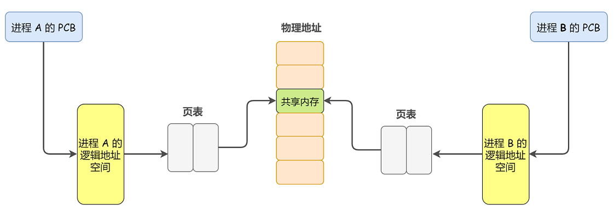

不同于消息队列频繁的系统调用，对于共享内存机制来说，仅在建立共享内存区域时需要系统调用，一旦建立共享内存，所有的访问都可作为常规内存访问，无需借助内核。这样，数据就不需要在进程之间来回拷贝，所以这是最快的一种进程通信方式。

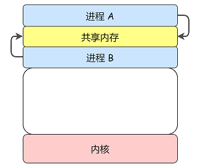


## 信号量和 PV 操作

实际上，对具有多 CPU 系统的最新研究表明，在这类系统上，消息传递的性能其实是要优于共享内存的，因为消息队列无需避免冲突，而共享内存机制可能会发生冲突。也就是说如果多个进程同时修改同一个共享内存，先来的那个进程写的内容就会被后来的覆盖。

进程的同步与互斥其实是一种对进程通信的保护机制，并不是用来传输进程之间真正通信的内容的，但是由于它们会传输信号量，所以也被纳入进程通信的范畴，称为低级通信。

信号量其实就是一个变量 ，我们可以用一个信号量来表示系统中某种资源的数量，用户进程可以通过使用操作系统提供的一对原语来对信号量进行操作，从而很方便的实现进程互斥或同步。这一对原语就是 PV 操作：

- P 操作：将信号量值减 1，表示申请占用一个资源。如果结果小于 0，表示已经没有可用资源，则执行 P 操作的进程被阻塞。如果结果大于等于 0，表示现有的资源足够你使用，则执行 P 操作的进程继续执行
- V 操作：将信号量值加 1，表示释放一个资源，即使用完资源后归还资源。若加完后信号量的值小于等于 0，表示有某些进程正在等待该资源，由于我们已经释放出一个资源了，因此需要唤醒一个等待使用该资源（就绪态）的进程，使之运行下去

P 操作和 V 操作必须成对出现。缺少 P 操作就不能保证对共享内存的互斥访问，缺少 V 操作就会导致共享内存永远得不到释放、处于等待态的进程永远得不到唤醒。

### 互斥访问共享内存

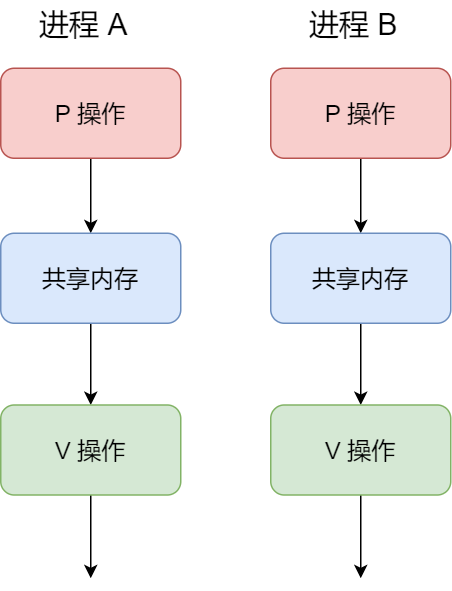

### 实现进程同步

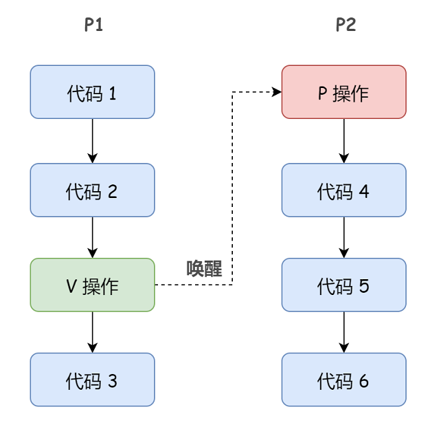

## 信号

信号和信号量是完全不同的两个概念！

信号是进程通信机制中唯一的异步通信机制，它可以在任何时候发送信号给某个进程。通过发送指定信号来通知进程某个异步事件的发送，以迫使进程执行信号处理程序。信号处理完毕后，被中断进程将恢复执行。用户、内核和进程都能生成和发送信号。


# 线程

进程是资源分配的基本单位，线程是独立调度的基本单位。


线程的特征和进程差不多，进程有的他基本都有，比如：

- 线程具有就绪、阻塞、运行三种基本状态，同样具有状态之间的转换关系；
- 线程间可以并发执行
- 在多 CPU 环境下，各个线程也可以分派到不同的 CPU 上并行执行

线程的优点：

- 一个进程中可以同时存在多个线程，这些线程共享该进程的资源。进程间的通信必须请求操作系统服务（因为 CPU 要切换到内核态），开销很大。而同进程下的线程间通信，无需操作系统干预，开销更小。

  不过，需要注意的是：从属于不同进程的线程间通信，也必须请求操作系统服务。

- 线程间的并发比进程的开销更小，系统并发性提升。

  同样，需要注意的是：从属于不同进程的线程间切换，它是会导致进程切换的，所以开销也大。

线程的缺点：

- 当进程中的一个线程奔溃时，会导致其所属进程的所有线程奔溃。


每个线程都有自己的堆栈：

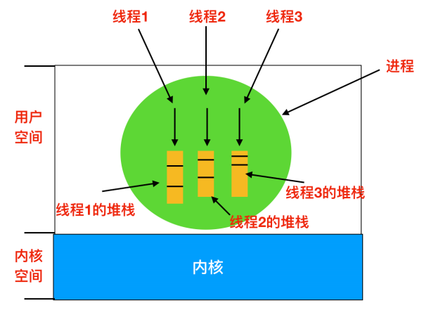