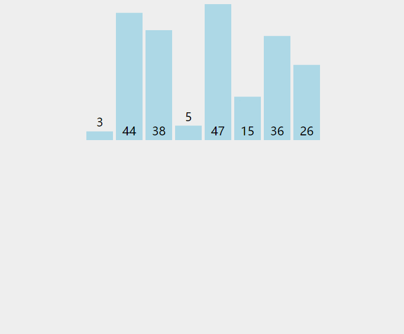

# 排序算法

## 快速排序


- 通过一趟排序将要排序的数据分割成独立的两部分：分割点左边都是比它小的数，右边都是比它大的数
- 然后再按此方法对这两部分数据分别进行快速排序，整个排序过程可以递归进行，以此达到整个数据变成有序序列

```
int partition(std::vector<int>& array, int left, int right)
{
	int value = array[left];
	while (left < right)
	{
		while (left < right && array[right] >= value)
			right--;
		if (left < right)
			array[left] = array[right];

		while(left < right && array[left] <= value)
			left++;
		if (left < right)
			array[right] = array[left];
	}
	array[left] = value;
	return left;
}

void quick_sort(std::vector<int>& array,int left,int right)
{
	if (left >= right)
		return;
	int pos = partition(array,left,right);
	quick_sort(array,left, pos-1);
	quick_sort(array, pos+1,right);
}
```

## 归并排序


归并排序是建立在归并操作上的一种有效的排序算法，该算法是采用分治法的一个非常典型的应用。

```
void merge(std::vector<int>& nums, size_t left, size_t mid, size_t right)
{
	size_t i = left, j = mid + 1, k = 0;
	std::vector<int> vec(right - left + 1);

	while (i <= mid && j <= right)
	{
		if (nums[i] <= nums[j])
			vec[k++] = nums[i++];
		else
			vec[k++] = nums[j++];
	}

	while (i <= mid)
		vec[k++] = nums[i++];
	while (j <= right)
		vec[k++] = nums[j++];
	for (i = left, k = 0; i <= right;)
		nums[i++] = vec[k++];
}

void merge_sort(std::vector<int>& nums, size_t left, size_t right)
{
	if (left >= right)
		return;

	size_t mid = left + ((right - left) >> 1);
	merge_sort(nums, left, mid);
	merge_sort(nums, mid + 1, right);
	merge(nums, left, mid, right);
}
```
## 冒泡排序


- 冒泡排序是一种交换排序
- 重复地走访待排序的序列，依次比较两个相邻的元素，如果顺序是错误的就进行交换
- 当遍历一轮时候，不发生交换，可以提前结束

```
void bubble_sort(std::vector<int>& array)
{
	int n = array.size();
	for (int i = 0; i < n; i++)
	{
		bool swapped = false;
		for (int j = 0; j < n - 1; j++)
		{
			if (array[j] > array[j+1])
			{
				std::swap(array[j],array[j+1]);
				swapped = true;
			}
		}
		if (!swapped)
			break;
	}
}
```

## 选择排序


重复地走访待排序的序列，选择出最大的或者最小的元素放到合适位置上。

```
void select_sort(std::vector<int>& nums)
{
	for (size_t i = nums.size() - 1; i > 0; --i)
	{
		int pos = i;
		for (size_t j = 0; j < i; ++j)
		{
			if (nums[j] > nums[pos])
				pos = j;
		}
		if (pos != i)
			std::swap(nums[i], nums[pos]);
	}
}
```

## 插入排序



```
void insert_sort(std::vector<int>& array)
{
  int n = array.size();
  for (int i = 1; i < n; i++)
  {
    int j = i - 1;
    int key = array[i];
    while (j >= 0 && array[j] > key) {
      array[j + 1] = array[j];
      j--;
    }
    array[j + 1] = key;
  }
}

```

## 希尔排序


希尔(Shell)排序又称为缩小增量排序，它是一种插入排序。

```
void shell_sort(std::vector<int>& array)
{
  int len = array.size();
  for (int step = len / 2; step >= 1; step /= 2)
  {
    for (int i = 0; i < step; i++)
    {
      for (int j = step + i; j < len; j += step)
      {
        int key = array[j];
        int index = j - step;
        while (index >= 0 && array[index] > key)
        {
          array[index + step] = array[index];
          index -= step;
        }
        array[index + step] = key;
      }
    }
  }
}
```

## 堆排序


```
void adjust(std::vector<int> &nums, size_t index, size_t size)
{
	//@ index 是根节点
	while (index * 2 + 1 < size) //@ 是否已经是叶子节点
	{
		size_t j = index * 2 + 1;
		if (j < size && j + 1 < size && nums[j + 1] > nums[j])   //@ j 是左孩子节点,j+1是右孩子节点     
			++j;
		if (nums[index] >= nums[j])
			break;
		std::swap(nums[index], nums[j]);
		index = j;
	}
}

void heapify(std::vector<int> &nums)
{
	size_t size = nums.size();
	//@ size/2 -1 是最后一个非叶子节点，它以下都是叶子节点，不用下沉了
	for (int i = size / 2 - 1; i >= 0; i--)
		adjust(nums, i, size);
}

void heap_sort(std::vector<int> &nums)
{
	size_t n = nums.size();
	heapify(nums);

	while (n > 1)
	{
		std::swap(nums[0], nums[--n]);
		adjust(nums, 0, n);
	}
}
```

## 基数排序


将所有待比较数值统一为同样的数位长度，数位较短的数前面补零。然后，从最低位开始，依次进行一次排序。这样从最低位排序一直到最高位排序完成以后, 数列就变成一个有序序列。

```
void count_sort(std::vector<int>& nums, int exp)
{
	std::vector<int> range(10, 0); //@ [0 9] 区间
	for (const auto num : nums)
		range[num / exp % 10]++;

	std::vector<int> tmp(nums.size());

	for (int i = 1; i < 10; i++)
		range[i] += range[i - 1];

	for (int i = nums.size() - 1; i >= 0; i--)
	{
		int index = --range[nums[i] / exp % 10];
		tmp[index] = nums[i];
	}
	nums = std::move(tmp);
}

//@ 排序数组中不能有负数
void radix_sort(std::vector<int>& nums)
{
	int Max = INT_MIN;
	for (const auto num : nums)
		Max = std::max(Max, num);
	for (int exp = 1; Max / exp; exp *= 10)
		count_sort(nums, exp);
}
```

## 排序算法总结


排序算法分类：

- 交换排序：两两比较待排序的关键字，并交换不满足次序要求的那对数，直到整个表都满足次序要求为止
- 插入排序：每一趟将一个待排序的数字，按照其大小插入到有序队列的合适位置里，直到全部插入完成
- 选择排序：每趟从待排序的记录中选出关键字最小的记录，顺序放在已排序的记录序列末尾，直到全部排序结束为止

直接插入排序和希尔排序的比较：

- 直接插入排序是稳定的；而希尔排序是不稳定的
- 直接插入排序更适合于原始记录基本有序的集合。希尔排序的比较次数和移动次数都要比直接插入排序少，当N越大时，效果越明显
- 直接插入排序也适用于链式存储结构；希尔排序不适用于链式结构

# [147. 对链表进行插入排序](https://leetcode-cn.com/problems/insertion-sort-list/)

```

class Solution {
public:
    ListNode* sortList(ListNode* head) {
		if(head == nullptr || head->next == nullptr)
			return head;
		ListNode* dummy = new ListNode(-1,head);
		ListNode* last_sorted = head,* curr = head->next;
		while(curr)
		{
			if(last_sorted->val <= curr->val)
				last_sorted = last_sorted->next;
			else{
				ListNode* prev = dummy;
				while(prev->next->val <= curr->val)
					prev = prev->next;
				last_sorted->next = curr->next;
				curr->next = prev->next;
				prev->next = curr;
			}
			curr = last_sorted->next;
		}
		return dummy->next;
    }
};
```

# [148. 排序链表](https://leetcode-cn.com/problems/sort-list/)

```
class Solution {
public:
    ListNode* sortList(ListNode* head) {
        if(head == nullptr || head->next == nullptr)
            return head;
        
        ListNode* slow = head,*fast = head->next;
        while(fast && fast->next)
        {
            slow = slow->next;
            fast = fast->next->next;
        }

        ListNode* mid = slow->next;
        slow->next = nullptr;
        return merge(sortList(head),sortList(mid));
    }

    ListNode* merge(ListNode* l1,ListNode* l2)
    {
        ListNode dummy(-1);
        ListNode* tail = &dummy;
        while(l1 && l2)
        {
            if(l1->val > l2->val)
                std::swap(l1,l2);
            tail->next = l1;
            l1 = l1->next;
            tail = tail->next;
        }
        if(l1)
            tail->next = l1;
        if(l2)
            tail->next = l2;
        return dummy.next;
    }
};
```

# [347. 前 K 个高频元素](https://leetcode-cn.com/problems/top-k-frequent-elements/)

```
class Solution {
public:
    vector<int> topKFrequent(vector<int>& nums, int k) {
        std::map<int,int> hash;
        for(auto num : nums)
            hash[num] ++;
        
        using DataPair = std::pair<int,int>;
        std::vector<DataPair> vec(hash.begin(),hash.end());
        std::sort(vec.begin(),vec.end(),[](const DataPair& p1,const DataPair& p2){return p1.second > p2.second;});
        
        std::vector<int> res;
        for(int i = 0;i < k;i++)
            res.emplace_back(vec[i].first);
        return res;
    }
};
```

# [75. 颜色分类](https://leetcode-cn.com/problems/sort-colors/)

```
class Solution {
public:
    void sortColors(vector<int>& nums) {
        int curr = 0,left = 0,right = nums.size() - 1;
        while(curr <= right)
        {
            if(nums[curr] == 0)
                std::swap(nums[curr++],nums[left++]);
            else if(nums[curr] == 2)
                std::swap(nums[curr],nums[right--]);
            else
                curr++;
        }
    }
};
```

# [179. 最大数](https://leetcode-cn.com/problems/largest-number/)

```
class Solution {
public:
    string largestNumber(vector<int>& nums) {
        if (std::all_of(nums.begin(), nums.end(), [](int x) { return x == 0; })) 
            return string("0");

        std::vector<std::string> strs(nums.size());
        std::transform(nums.begin(),nums.end(),strs.begin(),[](int num){return std::to_string(num);});
        std::sort(strs.begin(),strs.end(),[](const std::string& s1,const std::string& s2){return s1 + s2 > s2+ s1;});
        return std::accumulate(strs.begin(),strs.end(),std::string());
    }
};
```

# [324. 摆动排序 II](https://leetcode-cn.com/problems/wiggle-sort-ii/)

```
class Solution {
public:
    void wiggleSort(vector<int>& nums) {
        std::sort(nums.begin(),nums.end());
        size_t n = nums.size();
        size_t right = n,left = (n+1) >> 1;
        std::vector<int> tmp(nums);
        for(size_t i = 0;i < n;++i)
            nums[i] = (i & 1) ? tmp[--right] : tmp[--left];
    }
};
```

# [51. 数组中的逆序对](https://leetcode-cn.com/problems/shu-zu-zhong-de-ni-xu-dui-lcof/)

```
class Solution {
public:
    int reversePairs(vector<int>& nums) {
        std::vector<int> tmp(nums.size());
        return merge_sort(0, nums.size() - 1, nums, tmp);
    }
private:
    int merge_sort(int left, int right, std::vector<int>& nums, std::vector<int>& tmp) 
	{
        if (left >= right) 
			return 0;
        int m = (left + right) / 2;
        int res = merge_sort(left, m, nums, tmp) + merge_sort(m + 1, right, nums, tmp);
        int i = left, j = m + 1;
        for (int k = left; k <= right; k++)
            tmp[k] = nums[k];
        for (int k = left; k <= right; k++) 
        {
            if (i == m + 1)
                nums[k] = tmp[j++];
            else if (j == right + 1 || tmp[i] <= tmp[j])
                nums[k] = tmp[i++];
            else {
                nums[k] = tmp[j++];
                res += m - i + 1;
            }
        }
        return res;
    }
};
```

# [45. 把数组排成最小的数](https://leetcode-cn.com/problems/ba-shu-zu-pai-cheng-zui-xiao-de-shu-lcof/)

```
class Solution {
public:
    string minNumber(vector<int>& nums) {
		if(nums.empty())
			return "";
		std::vector<std::string> strs;
		std::transform(nums.begin(), nums.end(), std::back_inserter(strs), [](const int x) {return std::to_string(x); });
		std::sort(strs.begin(),strs.end(),[](const std::string& s1,const std::string& s2){return s1+s2 < s2+s1;});
		std::string res;
		for(const auto& s: strs)
			res += s;
		return res;
    }
};
```

# [ 61. 扑克牌中的顺子](https://leetcode-cn.com/problems/bu-ke-pai-zhong-de-shun-zi-lcof/)

```
class Solution {
public:
    bool isStraight(vector<int>& nums) {
        std::sort(nums.begin(),nums.end());
        int min_index = 0;
        while(nums[min_index] == 0)
            min_index++;
        for(int i = min_index;i < nums.size()-1;i++)
        {
            if(nums[i] == nums[i+1])
                return false;
        }
        return nums[4] - nums[min_index] <= 4;
    }
};
```

# [39. 数组中出现次数超过一半的数字](https://leetcode-cn.com/problems/shu-zu-zhong-chu-xian-ci-shu-chao-guo-yi-ban-de-shu-zi-lcof/)

```
class Solution {
public:
    int majorityElement(vector<int>& nums) {
        std::sort(nums.begin(),nums.end());
        return nums[nums.size()/2];
    }
};
```
