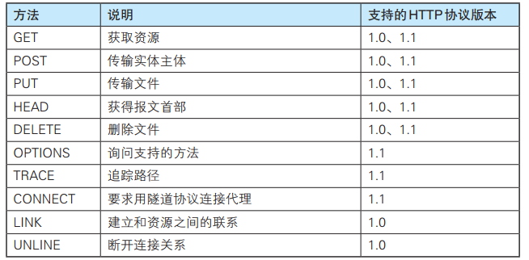
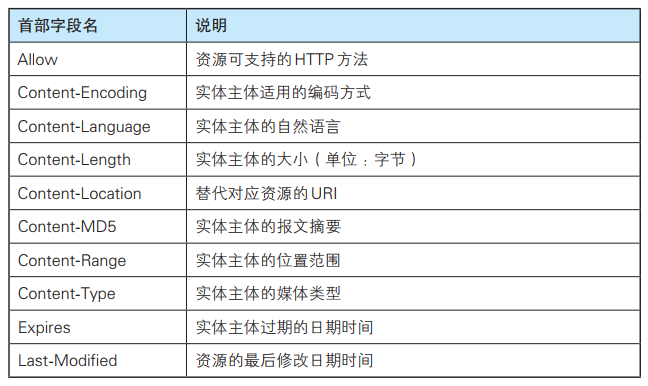

# URI 和 URL 的区别

- URI，全称是 Uniform Resource Identifier，统一资源标志符，主要作用是唯一标识一个资源

- URL，全称是 Uniform Resource Location，统一资源定位符，主要作用是提供资源的路径。

打个经典比喻吧，URI 像是身份证，可以唯一标识一个人，而 URL 更像一个住址，可以通过 URL 找到这个人

# HTTP 协议特点

基本特点：

- 用于客户端和服务器端之间的通信：应用 HTTP 协议时，必定是一端担任客户端角色，另一端担任服务器端角色
- 通过请求和响应的交换达成通信：HTTP 协议规定，请求从客户端发出，最后服务器端响应该请求并返回
- 请求 URI 定位资源：HTTP 协议使用 URI 定位互联网上的资源。正是因为 URI 的特定功能，在互联网上任意位置的资源都能访问到
- 告知服务器意图的 HTTP 方法：向请求 URI 指定的资源发送请求报文时，采用称为方法的命令。方法的作用在于， 可以指定请求的资源按期望产生某种行为

优点：

- 简单：HTTP 基本的报⽂格式就是 header + body ，头部信息也是 key-value 简单⽂本的形式， 易于理解，降低了学习和使⽤的⻔槛。  

- 灵活和易于扩展 ： 
  - HTTP协议⾥的各类请求⽅法、 URI/URL、状态码、头字段等每个组成要求都没有被固定死，都允许开发⼈员⾃定义和扩充
  - 同时 HTTP 由于是⼯作在应⽤层（OSI 第七层），则它下层可以随意变化。不仅可以使用 TCP、UNIX Domain Socket，还可以使用SSL/TLS，甚至是基于 UDP 的 QUIC
- 应⽤⼴泛和跨平台：HTTP 的应⽤范围⾮常的⼴泛，从台式机的浏览器到⼿机上的各种 APP，同时天然具有跨平台的优越性。    

缺点：

HTTP 协议⾥有优缺点⼀体的双刃剑，分别是⽆状态、明⽂传输，同时还有⼀⼤缺点不安全。  

- ⽆状态双刃剑  
  - ⽆状态的好处，因为服务器不会去记忆 HTTP 的状态，所以不需要额外的资源来记录状态信息，这能减轻服务器的负担，能够把更多的 CPU 和内存⽤来对外提供服务
  - ⽆状态的坏处，既然服务器没有记忆能⼒，它在完成有关联性的操作时会⾮常麻烦。对于⽆状态的问题，解法⽅案有很多种，其中⽐较简单的⽅式⽤ Cookie 技术。Cookie 通过在请求和响应报⽂中写⼊ Cookie 信息来控制客户端的状态

- 明⽂传输双刃剑  
  - 明⽂意味着在传输过程中的信息，是可⽅便阅读的
  - 但是这正是这样， HTTP 的所有信息都暴露在了光天化⽇下，相当于信息裸奔。在传输的漫⻓的过程中，信息的内容都毫⽆隐私可⾔，很容易就能被窃取

- 不安全：HTTP ⽐较严重的缺点就是不安全：  
  - 通信使⽤明⽂不加密，内容可能会被窃听  
  - 不验证通信⽅的身份，因此有可能遭遇伪装  
  - ⽆法证明报⽂的完整性，所以有可能已遭篡改  

# HTTP 常用状态码

- 101 Switching Protocols，该状态码表示客户端使用 Upgrade 头字段，要求在 HTTP 协议的基础上改成其他的协议继续通信。比如：WebSocket。而如果服务器也同意变更协议，就会发送状态码 101，但这之后的数据传输就不会再使用 HTTP 了
- 200 OK，是最常⻅的成功状态码，表示⼀切正常。如果是⾮ HEAD 请求，服务器返回的响应头都会有 body 数据
- 204 No Content，也是常⻅的成功状态码，与 200 OK 基本相同，但响应头没有 body 数据
- 206 Partial Content，是应⽤于 HTTP 分块下载或断点续传，表示响应返回的 body 数据并不是资源的全部⽽是其中的⼀部分，也是服务器处理成功的状态
- 301 Moved Permanently，表示永久重定向，说明请求的资源已经不存在了，需改⽤新的 URL 再次访问
- 302 Found，表示临时重定向，说明请求的资源还在，但暂时需要⽤另⼀个 URL 来访问
- 304 Not Modified，不具有跳转的含义，表示资源未修改，重定向已存在的缓冲⽂件，也称缓存重定向，⽤于缓存控制。如果客户端发送了一个带条件的 GET 请求且该请求已被允许，而文档的内容（自上次访问以来或者根据请求的条件）并没有改变，则服务器应当返回 304
- 400 Bad Request，表示客户端请求的报⽂有错误，但只是个笼统的错误
- 401 Unauthorized，表示发送的请求需要有通过 HTTP 认证（BASIC 认证、DIGEST 认证）。 另外若之前已进行过 1 次请求，则表示用户认证失败
- 403 Forbidden，表示服务器禁⽌访问资源，并不是客户端的请求出错
- 404 Not Found，表示请求的资源在服务器上不存在或未找到，所以⽆法提供给客户端
- 500 Internal Server Error，与 400 类型，是个笼统通⽤的错误码，服务器发⽣了什么错误，我们并不知道
- 501 Not Implemented，表示客户端请求的功能还不⽀持，类似“即将开业，敬请期待”的意思
- 502 Bad Gateway，通常是服务器作为⽹关或代理时返回的错误码，表示服务器⾃身⼯作正常，访问后端服务器发⽣了错误
- 503 Service Unavailable，表示服务器当前很忙，暂时⽆法响应服务器，类似“⽹络服务正忙，请稍后重试”的意思

# HTTP 常用方法

POST 和 GET 有哪些区别：

安全：

在 HTTP 协议里，所谓的“安全”是指请求方法不会“破坏”服务器上的资源，即不会对服务器上的资源造成实质的修改。

- 只有 GET 和 HEAD 方法是“安全”的，因为它们是“只读”操作，只要服务器不故意曲解请求方法的处理方式，无论 GET 和 HEAD 操作多少次，服务器上的数据都是“安全的”
- POST/PUT/DELETE 操作会修改服务器上的资源，增加或删除数据，所以是“不安全”的

幂等：

所谓的“幂等”实际上是一个数学用语，被借用到了HTTP协议里，意思是多次执行相同的操作，结果也都是相同的，即多次“幂”后结果“相等”。

- GET 和 HEAD 既是安全的也是幂等的
- DELETE 可以多次删除同一个资源，效果都是“资源不存在”，所以也是幂等的
- POST 是“新增或提交数据”，多次提交数据会创建多个资源，所以不是幂等的
- PUT 是“替换或更新数据”，多次更新一个资源，资源还是会第一次更新的状态，所以是幂等的

# HTTP 报文

**HTTP 首部：**

- 通用首部
- 请求首部
- 响应首部
- 实体首部

通用首部字段：

请求首部字段：

响应首部字段：

实体首部字段：

**HTTP 具体有哪些请求头是跟缓存相关的：**

缓存分为两种：强缓存和协商缓存，根据响应的header内容来决定。

- 强缓存相关字段有：expires，cache-control。如果 cache-control 与 expires 同时存在的话，cache-control 的优先级高于 expires
- 协商缓存相关字段有：Last-Modified/If-Modified-Since，Etag/If-None-Match

# HTTP/1.0，1.1，2.0 的区别

HTTP/1.0：

- 默认使用短连接，每次请求都需要建立一个TCP连接。它可以设置 `Connection: keep-alive` 这个字段，强制开启长连接。

HTTP/1.1：

- 引入了持久连接，即 TCP 连接默认不关闭，可以被多个请求复用
- 分块传输编码，即服务端每产生一块数据，就发送一块，用”流模式”取代”缓存模式”
- 管道机制，即在同一个 TCP 连接里面，客户端可以同时发送多个请求

HTTP/2.0

- 二进制协议，1.1版本的头信息是文本（ASCII编码），数据体可以是文本或者二进制；2.0 中，头信息和数据体都是二进制
- 完全多路复用，在一个连接里，客户端和浏览器都可以同时发送多个请求或回应，而且不用按照顺序一一对应
- 报头压缩，HTTP 协议不带有状态，每次请求都必须附上所有信息。Http/2.0 引入了头信息压缩机制，使用 gzip 或 compress 压缩后再发送
- 服务端推送，允许服务器未经请求，主动向客户端发送资源

# HTTP 长连接

HTTP 分为长连接和短连接，本质上说的是 TCP 的长短连接。TCP 连接是一个双向的通道，它是可以保持一段时间不关闭的，因此TCP连接才具有真正的长连接和短连接这一说法哈。

TCP 长连接可以复用一个 TCP 连接，来发起多次的 HTTP 请求，这样就可以减少资源消耗，比如一次请求 HTML，如果是短连接的话，可能还需要请求后续的 JS/CSS。

通过在头部（请求和响应头）设置 `Connection` 字段指定为`keep-alive`，HTTP/1.0 协议支持，但是是默认关闭的，从HTTP/1.1以后，连接默认都是长连接。

TCP 的 keep-alive 包含三个参数，支持在系统内核的 net.ipv4 里面设置：

- 当 TCP 连接之后，闲置了 tcp_keepalive_time，则会发生侦测包
- 如果没有收到对方的 ACK，那么会每隔  tcp_keepalive_intvl 再发一次
- 直到发送了 tcp_keepalive_probes，就会丢弃该连接

#  HTTP 与 HTTPS 的区别

HTTP会存在的问题：

- 请求信息是明文传输，容易被窃听截取
- 没有验证对方身份，存在被冒充的风险
- 数据的完整性未校验，容易被中间人篡改

# HTTPS 流程是怎样的

HTTPS = HTTP + SSL/TLS，也就是用 SSL/TLS 对数据进行加密和解密，Http 进行传输。

SSL，即Secure Sockets Layer（安全套接层协议），是网络通信提供安全及数据完整性的一种安全协议。

TLS，即 Transport Layer Security (安全传输层协议)，它是 SSL3.0 的后续版本。

1. 客户端发起Https请求，连接到服务器的443端口。
2. 服务器必须要有一套数字证书（证书内容有公钥、证书颁发机构、失效日期等）。
3. 服务器将自己的数字证书发送给客户端（公钥在证书里面，私钥由服务器持有）。
4. 客户端收到数字证书之后，会验证证书的合法性。如果证书验证通过，就会生成一个随机的对称密钥，用证书的公钥加密。
5. 客户端将公钥加密后的密钥发送到服务器。
6. 服务器接收到客户端发来的密文密钥之后，用自己之前保留的私钥对其进行非对称解密，解密之后就得到客户端的密钥，然后用客户端密钥对返回数据进行对称加密，酱紫传输的数据都是密文啦。
7. 服务器将加密后的密文返回到客户端。
8. 客户端收到后，用自己的密钥对其进行对称解密，得到服务器返回的数据。

# 数字签名和数字证书

数字证书是指在互联网通讯中标志通讯各方身份信息的一个数字认证，人们可以在网上用它来识别对方的身份。它的出现，是为了避免身份被篡改冒充的。比如 Https 的数字证书，就是为了避免公钥被中间人冒充篡改：

数字证书构成：

- 公钥和个人等信息，经过Hash摘要算法加密，形成消息摘要；将消息摘要拿到拥有公信力的认证中心（CA），用它的私钥对消息摘要加密，形成数字签名
- 公钥和个人信息、数字签名共同构成数字证书

# 对称加密与非对称加密

对称加密：指加密和解密使用同一密钥，优点是运算速度较快，缺点是如何安全将密钥传输给另一方。常见的对称加密算法有：DES、AES 等。

非对称加密：指的是加密和解密使用不同的密钥（即公钥和私钥）。公钥与私钥是成对存在的，如果用公钥对数据进行加密，只有对应的私钥才能解密。常见的非对称加密算法有 RSA。

# WebSocket 

WebSocket 是HTML5中的协议，支持持久连续。WebSocket是基于Http协议的，或者说借用了 Http 协议来完成一部分握手，在握手阶段与 Http 是相同的。两个基本是属性：upgrade，connection。

**WebSocket 与 Socket 的区别：**

- WebSocket是一个持久化的协议，它是伴随H5而出的协议，用来解决 http不支持持久化连接的问题
- Socket一个是网编编程的标准接口，而 WebSocket 则是应用层通信协议。

# HTTP 请求的过程

- 客户端进行 DNS 域名解析，得到对应的 IP 地址
- 根据这个 IP，找到对应的服务器建立连接（三次握手）
- 建立 TCP 连接后发起 HTTP 请求（一个完整的http请求报文）
- 服务器响应 HTTP 请求，客户端得到 html 代码
- 客户端解析 html 代码，用 html 代码中的资源(如js,css,图片等等)渲染页面
- 服务器关闭 TCP 连接（四次挥手）

# Session、Cookie、Token

- 首先，客户端会发送一个http请求到服务器端
- 服务器端接受客户端请求后，建立一个 session，并发送一个 http 响应到客户端，这个响应头，其中就包含 Set-Cookie 头部。该头部包含了 SessionId
- 在客户端发起的第二次请求，假如服务器给了 set-Cookie，浏览器会自动在请求头中添加 Cookie

Cookie：是由服务器发给客户端的特殊信息，以文本的形式存放在客户端，客户端再次请求的时候，会把 Cookie 回发给服务器，服务器接收到后，会解析 Cookie 生成与客户端相对应的内容。

Session：是服务器端的机制，在服务器上保存的信息，解析客户端请求并操作 SessionId，按需保存状态信息。

Cookie 和 Session 的区别：

现在大多都是Session + Cookie的使用方式：使用 Session 只需要在客户端保存一个 SessionId，实际上大量数据都是保存在服务端。如果全部用 Cookie，数据量大的时候客户端是没有那么多空间的。如果只用 Cookie 不用 Session，那么账户信息全部保存在客户端，一旦被劫持，全部信息都会泄露。并且客户端数据量变大，网络传输的数据量也会变大。

Cookie 只是实现 Session 的其中一种方案。虽然是最常用的，但并不是唯一的方法，禁用 Cookie 后还有其他方法存储，比如放在 url 中。

Token：

客户端是一种服务端无状态的认证方式, 非常适合于 REST API 的场景。Token 在客户端一般存放于 localStorage，Cookie，或 SessionStorage 中。在服务器一般存于数据库中。

Token 的认证流程：

- 用户登录，成功后服务器返回 Token 给客户端
- 客户端收到数据后保存在客户端
- 客户端再次访问服务器，将 Token  放入headers 中
- 服务器端采用 filter 过滤器校验。校验成功则返回请求数据，校验失败则返回错误码

