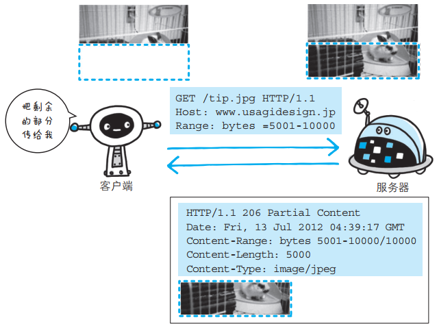
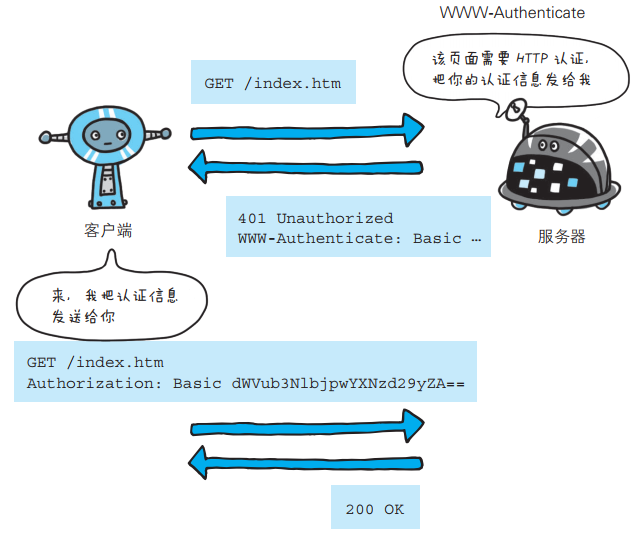
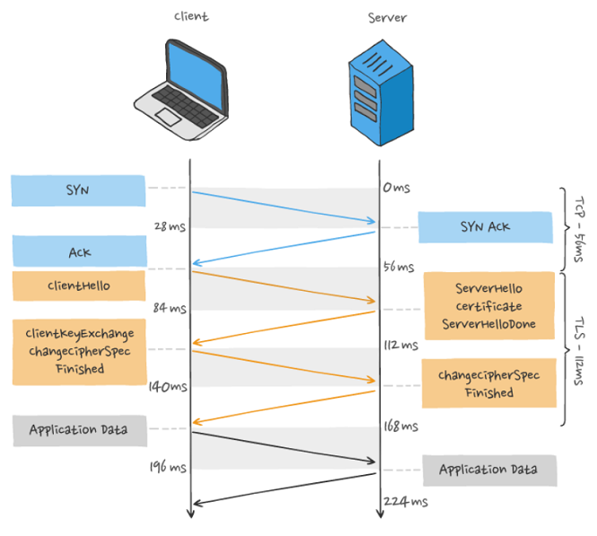
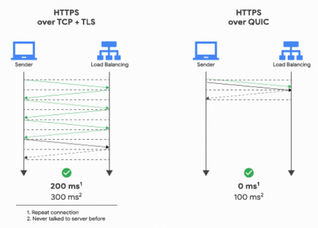
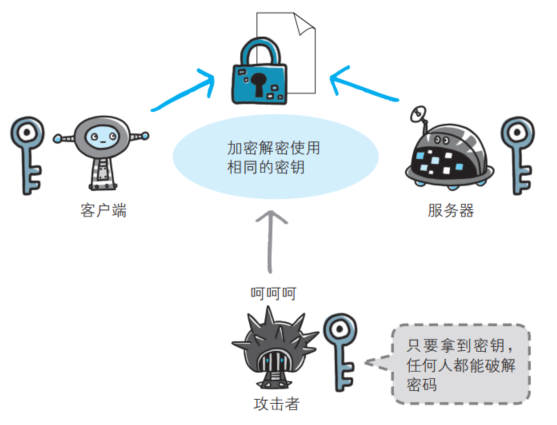

# HTTP 特点

基本特点：

- 用于客户端和服务器端之间的通信：应用 HTTP 协议时，必定是一端担任客户端角色，另一端担任服务器端角色
- 通过请求和响应的交换达成通信：HTTP 协议规定，请求从客户端发出，最后服务器端响应该请求并返回
- 请求 URI 定位资源：HTTP 协议使用 URI 定位互联网上的资源。正是因为 URI 的特定功能，在互联网上任意位置的资源都能访问到
- 告知服务器意图的 HTTP 方法：向请求 URI 指定的资源发送请求报文时，采用称为方法的命令。方法的作用在于， 可以指定请求的资源按期望产生某种行为

优点：

- 简单：HTTP 基本的报⽂格式就是 header + body ，头部信息也是 key-value 简单⽂本的形式， 易于理解，降低了学习和使⽤的⻔槛。  

- 灵活和易于扩展 ： 
  - HTTP协议⾥的各类请求⽅法、 URI/URL、状态码、头字段等每个组成要求都没有被固定死，都允许开发⼈员⾃定义和扩充
  - 同时 HTTP 由于是⼯作在应⽤层（OSI 第七层），则它下层可以随意变化。不仅可以使用 TCP、UNIX Domain Socket，还可以使用SSL/TLS，甚至是基于 UDP 的 QUIC
- 应⽤⼴泛和跨平台：HTTP 的应⽤范围⾮常的⼴泛，从台式机的浏览器到⼿机上的各种 APP，同时天然具有跨平台的优越性。    

缺点：

HTTP 协议⾥有优缺点⼀体的双刃剑，分别是⽆状态、明⽂传输，同时还有⼀⼤缺点不安全。  

- ⽆状态双刃剑  
  - ⽆状态的好处，因为服务器不会去记忆 HTTP 的状态，所以不需要额外的资源来记录状态信息，这能减轻服务器的负担，能够把更多的 CPU 和内存⽤来对外提供服务
  - ⽆状态的坏处，既然服务器没有记忆能⼒，它在完成有关联性的操作时会⾮常麻烦。对于⽆状态的问题，解法⽅案有很多种，其中⽐较简单的⽅式⽤ Cookie 技术。Cookie 通过在请求和响应报⽂中写⼊ Cookie 信息来控制客户端的状态

- 明⽂传输双刃剑  
  - 明⽂意味着在传输过程中的信息，是可⽅便阅读的
  - 但是这正是这样， HTTP 的所有信息都暴露在了光天化⽇下，相当于信息裸奔。在传输的漫⻓的过程中，信息的内容都毫⽆隐私可⾔，很容易就能被窃取

- 不安全：HTTP ⽐较严重的缺点就是不安全：  
  - 通信使⽤明⽂不加密，内容可能会被窃听  
  - 不验证通信⽅的身份，因此有可能遭遇伪装  
  - ⽆法证明报⽂的完整性，所以有可能已遭篡改  

# HTTP 常用状态码


- 101 Switching Protocols，该状态码表示客户端使用 Upgrade 头字段，要求在 HTTP 协议的基础上改成其他的协议继续通信。比如：WebSocket。而如果服务器也同意变更协议，就会发送状态码 101，但这之后的数据传输就不会再使用 HTTP 了
- 200 OK，是最常⻅的成功状态码，表示⼀切正常。如果是⾮ HEAD 请求，服务器返回的响应头都会有 body 数据
- 204 No Content，也是常⻅的成功状态码，与 200 OK 基本相同，但响应头没有 body 数据
- 206 Partial Content，是应⽤于 HTTP 分块下载或断点续传，表示响应返回的 body 数据并不是资源的全部⽽是其中的⼀部分，也是服务器处理成功的状态
- 301 Moved Permanently，表示永久重定向，说明请求的资源已经不存在了，需改⽤新的 URL 再次访问
- 302 Found，表示临时重定向，说明请求的资源还在，但暂时需要⽤另⼀个 URL 来访问
- 304 Not Modified，不具有跳转的含义，表示资源未修改，重定向已存在的缓冲⽂件，也称缓存重定向，⽤于缓存控制。如果客户端发送了一个带条件的 GET 请求且该请求已被允许，而文档的内容（自上次访问以来或者根据请求的条件）并没有改变，则服务器应当返回 304
- 400 Bad Request，表示客户端请求的报⽂有错误，但只是个笼统的错误
- 401 Unauthorized，表示发送的请求需要有通过 HTTP 认证（BASIC 认证、DIGEST 认证）。 另外若之前已进行过 1 次请求，则表示用户认证失败
- 403 Forbidden，表示服务器禁⽌访问资源，并不是客户端的请求出错
- 404 Not Found，表示请求的资源在服务器上不存在或未找到，所以⽆法提供给客户端
- 500 Internal Server Error，与 400 类型，是个笼统通⽤的错误码，服务器发⽣了什么错误，我们并不知道
- 501 Not Implemented，表示客户端请求的功能还不⽀持，类似“即将开业，敬请期待”的意思
- 502 Bad Gateway，通常是服务器作为⽹关或代理时返回的错误码，表示服务器⾃身⼯作正常，访问后端服务器发⽣了错误
- 503 Service Unavailable，表示服务器当前很忙，暂时⽆法响应服务器，类似“⽹络服务正忙，请稍后重试”的意思

# HTTP 常用方法


POST 和 GET 有哪些区别：


安全：

在 HTTP 协议里，所谓的“安全”是指请求方法不会“破坏”服务器上的资源，即不会对服务器上的资源造成实质的修改。

- 只有 GET 和 HEAD 方法是“安全”的，因为它们是“只读”操作，只要服务器不故意曲解请求方法的处理方式，无论 GET 和 HEAD 操作多少次，服务器上的数据都是“安全的”
- POST/PUT/DELETE 操作会修改服务器上的资源，增加或删除数据，所以是“不安全”的

幂等：

所谓的“幂等”实际上是一个数学用语，被借用到了HTTP协议里，意思是多次执行相同的操作，结果也都是相同的，即多次“幂”后结果“相等”。

- GET 和 HEAD 既是安全的也是幂等的
- DELETE 可以多次删除同一个资源，效果都是“资源不存在”，所以也是幂等的
- POST 是“新增或提交数据”，多次提交数据会创建多个资源，所以不是幂等的
- PUT 是“替换或更新数据”，多次更新一个资源，资源还是会第一次更新的状态，所以是幂等的

# HTTP 请求的过程


- 客户端进行 DNS 域名解析，得到对应的 IP 地址
- 根据这个 IP，找到对应的服务器建立连接（三次握手）
- 建立 TCP 连接后发起 HTTP 请求（一个完整的http请求报文）
- 服务器响应 HTTP 请求，客户端得到 html 代码
- 客户端解析 html 代码，用 html 代码中的资源(如js,css,图片等等)渲染页面
- 服务器关闭 TCP 连接（四次挥手）


# HTTP 报文

## URI 和 URL 的区别

- URI，全称是 Uniform Resource Identifier，统一资源标志符，主要作用是唯一标识一个资源

- URL，全称是 Uniform Resource Location，统一资源定位符，主要作用是提供资源的路径。

打个经典比喻吧，URI 像是身份证，可以唯一标识一个人，而 URL 更像一个住址，可以通过 URL 找到这个人

## HTTP 报文

用于 HTTP 协议交互的信息被称为 HTTP 报文：

- 请求端（客户端）的HTTP 报文叫做请求报文
- 响应端（服务器端）的叫做响应报文
- HTTP 报文本身是由多行（用 CR+LF 作换行符）数据构成的字符串文本
- HTTP 报文大致可分为报文首部和报文主体两块，两者由空行（ CR+LF）来划分 ，通常，并不一定要有报文主体  


请求报文及响应报文的结构：  


请求报文和响应报文的首部内容由以下数据组成：

- 请求行，包含用于请求的方法，请求 URI 和 HTTP 版本
- 状态行，包含表明响应结果的状态码，原因短语和 HTTP 版本
- 首部字段，包含表示请求和响应的各种条件和属性的各类首部，一般有 4 种首部，分别是：
  - 通用首部
  - 请求首部
  - 响应首部
  - 实体首部

## 传输内容

编码提升传输速率：  

HTTP 协议中有一种被称为内容编码的功能，指明应用在实体内容上的编码格式， 并保持实体信息原样压缩。内容编码后的实体由客户端接收并负责解码。   

常用的内容编码有以下几种：gzip（GNU zip），compress（UNIX 系统的标准压缩），deflate（zlib），identity（不进行编码）

分块传输编码：

在 HTTP 通信过程中，请求的编码实体资源尚未全部传输完成之前，浏览器无法显示请求页面。 在传输大容量数据时，通过把数据分割成多块，能够让浏览器逐步显示页面。这种把实体主体分块的功能称为分块传输编码（ Chunked TransferCoding）。  

- 分块传输编码会将实体主体分成多个部分（块）。每一块都会用十六进制来标记块的大小， 而实体主体的最后一块会使用“0(CR+LF)”来标记
- 使用分块传输编码的实体主体会由接收的客户端负责解码， 恢复到编码前的实体主体

发送多种数据的多部分对象集合：

HTTP 协议中也采纳了多部分对象集合，发送的一份报文主体内可含有多类型实体。通常是在图片或文本文件等上传时使用：

- 多部分对象集合包含的对象：multipart/form-data  
- 在 Web 表单文件上传时：multipart/byteranges    

多部分对象集合的每个部分类型中， 都可以含有首部字段。另外，可以在某个部分中嵌套使用多部分对象集合。   

获取部分内容的范围请求：

指定范围发送的请求叫做范围请求。 对一份 10 000 字节大小的资源，如果使用范围请求，可以只请求 5001~10 000 字节内的资源：



执行范围请求时，会用到首部字段 Range 来指定资源的 byte 范围：

```
Range: bytes=5001-10000       		 # 5001~10000 字节
Range: bytes=5001-			 		# 从 5001 字节之后全部的字节
Range: bytes=-3000, 5000-7000		 # 从一开始到 3000字节和 5000~7000 字节的多重范围
```

针对范围请求，响应会返回状态码为 206 Partial Content 的响应报文。另外，对于多重范围的范围请求，响应会在首部字段 Content-Type
标明 multipart/byteranges 后返回响应报文。

如果服务器端无法响应范围请求， 则会返回状态码 200 OK 和完整的实体内容。  

内容协商返回最合适的内容：  

 内容协商机制是指客户端和服务器端就响应的资源内容进行交涉，然后提供给客户端最为适合的资源。  

包含在请求报文中的某些首部字段：

- Accept
- Accept-Charset
- Accept-Encoding
- Accept-Language
- Content-Language

内容协商技术有以下 3 种类型：

- 服务器驱动协商：由服务器端进行内容协商。以请求的首部字段为参考，在服务器端自动处理，但对用户来说，以浏览器发送的信息作为判定的依据，并不一定能筛选出最优内容  
- 客户端驱动协商：由客户端进行内容协商的方式。用户从浏览器显示的可选项列表中手动选择。还可以利用 JavaScript 脚本在 Web 页面上自动进行上述选择  
- 透明协商：是服务器驱动和客户端驱动的结合体，是由服务器端和客户端各自进行内容协商的一种方法  

# HTTP 首部字段

HTTP 首部字段是由首部字段名和字段值构成的，中间用冒号“:”分隔：

```
首部字段名: 字段值
```

字段值对应单个 HTTP 首部字段可以有多个值，多个值之间通过“,”分隔。

## 通用首部字段


通过指定首部字段 Cache-Control 的指令，就能操作缓存的工作机制。  

缓存请求指令:


缓存响应指令:


- no-cache 指令：代表不缓存过期的资源，缓存会向源服务器进行有效期确认后处理资源
- no-store指令：真正地不进行缓存
- max-age 指令：如果判定缓存资源的缓存时间数值比指定时间的数值更小，那么客户端就接收缓存的资源。当指定 max-age 值为 0，那么缓存服务器通常需要将请求转发给源服务器
- min-fresh 指令：要求缓存服务器返回至少还未过指定时间的缓存资源。比如，当指定 min-fresh 为 60 秒后，过了 60 秒的资源都无法作为响应返回了
- max-stale 指令：如果指令未指定参数值，那么无论经过多久，客户端都会接收响应；如果指令中指定了具体数值，那么即使过期，只要仍处于 max-stale 指定的时间内，仍旧会被客户端接收
- only-if-cached 指令：表示客户端仅在缓存服务器本地缓存目标资源的情况下才会要求其返回。 换言之，该指令要求缓存服务器不重新加载响应，也不会再次确认资源有效性。若发生请求缓存服务器的本地缓存无响应，则返回状态码 504 Gateway Timeout


## 请求首部字段


Accept：  

```
Accept: text/html,application/xhtml+xml,application/xml;q=0.9,*/*;q=0.8
```

若想要给显示的媒体类型增加优先级，则使用 q= 来额外表示权重值 A，用分号 ";" 进行分隔。权重值 q 的范围是 0~1（可精确到小数点后3 位），且 1 为最大值。不指定权重 q 值时，默认权重为 q=1.0。当服务器提供多种内容时，将会首先返回权重值最高的媒体类型。  

Authorization：  

首部字段 Authorization 是用来告知服务器，用户代理的认证信息（证书值）。通常，想要通过服务器认证的用户代理会在接收到返回的 401 状态码响应后，把首部字段 Authorization 加入请求中。  



If-xxx：

形如 If-xxx 这种样式的请求首部字段，都可称为条件请求。服务器接收到附带条件的请求后，只有判断指定条件为真时，才会执行请求。

If-Match：

服务器会比对 If-Match 的字段值和资源的 ETag 值，仅当两者一致时，才会执行请求。反之，则返回状态码 412 Precondition Failed 的响应。还可以使用星号 "*" 指定 If-Match 的字段值。针对这种情况，服务器将会忽略 ETag 的值，只要资源存在就处理请求。  


## 响应首部字段


ETag：  

首部字段 ETag 能告知客户端实体标识。它是一种可将资源以字符串形式做唯一性标识的方式。服务器会为每份资源分配对应的 ETag 值。  

当资源更新时， ETag 值也需要更新。生成 ETag 值时，并没有统一的算法规则，而仅仅是由服务器来分配。  

- 资源被缓存时，就会被分配唯一性标识
- 资源的 URL 相同，但是 ETag 可能是不同的
- 若在下载过程中出现连接中断、再连接的情况，都会依照 ETag 值来指定资源


ETag 中有强 ETag 值和弱 ETag 值之分： 

- 强 ETag 值，不论实体发生多么细微的变化都会改变其值

```
ETag: "usagi-1234"
```

- 弱 ETag 值只用于提示资源是否相同。只有资源发生了根本改变，产生差异时才会改变 ETag 值。这时，会在字段值最开始处附加 W/  

```
ETag: W/"usagi-1234"
```

Location：

使用首部字段 Location 可以将响应接收方引导至某个与请求 URI 位置不同的资源。  

基本上，该字段会配合 3xx ： Redirection 的响应，提供重定向的 URI。几乎所有的浏览器在接收到包含首部字段 Location 的响应后，都会强制性地尝试对已提示的重定向资源的访问。  

WWW-Authenticate：  

首部字段 WWW-Authenticate 用于 HTTP 访问认证。它会告知客户端适用于访问请求 URI 所指定资源的认证方案（ Basic 或是 Digest）和带参数提示的质询（ challenge）。状态码 401 Unauthorized 响应中，肯定带有首部字段 WWW-Authenticate。  

## 实体首部字段  


Expires：  

首部字段 Expires 会将资源失效的日期告知客户端。缓存服务器在接收到含有首部字段 Expires 的响应后，会以缓存来应答请求，在Expires 字段值指定的时间之前，响应的副本会一直被保存。当超过指定的时间后，缓存服务器在请求发送过来时，会转向源服务器请求资源。    

当首部字段 Cache-Control 有指定 max-age 指令时，比起首部字段 Expires，会优先处理 max-age 指令。  

## 为 Cookie 服务的首部字段  

Cookie 的工作机制是用户识别及状态管理，虽然没有被编入标准化 HTTP/1.1 的 RFC2616 中，但在 Web 网站方面得到了广泛的应用。调用 Cookie 时， 由于可校验 Cookie 的有效期，以及发送方的域、路径、协议等信息，所以正规发布的 Cookie 内的数据不会因来自其他 Web 站点和攻击者的攻击而泄露。

为 Cookie 服务的首部字段：


当服务器准备开始管理客户端的状态时，会事先告知各种信息。下面的表格列举了 Set-Cookie 的字段值：


 ## End-to-end 和 Hop-by-hop 首部  

HTTP 首部字段将定义成缓存代理和非缓存代理的行为，分成 2 种类型：

- 端到端首部（End-to-endHeader），分在此类别中的首部会转发给请求/响应对应的最终接收目标，且必须保存在由缓存生成的响应中，另外规定它必须被转发
- 逐跳首部（Hop-by-hopHeader），分在此类别中的首部只对单次转发有效，会因通过缓存或代理而不再转发。 HTTP/1.1 和之后版本中，如果要使用 hop-by-hop 首部，需提供 Connection 首部字段

HTTP/1.1 中，除下面 8 个首部字段之外，其他所有字段都属于端到端首部：

- Connection
- Keep-Alive
- Proxy-Authenticate
- Proxy-Authorization
- Trailer
- TE
- Transfer-Encoding
- Upgrade

# HTTP 认证

HTTP 认证主要用于确认访问用户身份。HTTP/1.1 使用的认证方式：

- BASIC 认证（基本认证）
- DIGEST 认证（摘要认证）
- SSL 客户端认证
- FormBase 认证（基于表单认证）  

## BASIC 认证  

BASIC 认证（基本认证）是从 HTTP/1.0 就定义的认证方式。

BASIC 认证的认证步骤：


- 当请求的资源需要 BASIC 认证时，服务器会随状态码 401 Authorization Required，返回带 WWW-Authenticate 首部字段的响应。该字段内包含认证的方式（BASIC）及 Request-URI 安全域字符串（realm）  
- 接收到状态码 401 的客户端为了通过 BASIC 认证，需要将用户 ID 及密码发送给服务器。发送的字符串内容是由用户 ID 和密码构成，两者中间以冒号 ":" 连接后，再经过 Base64 编码处理。假设用户 ID 为 guest，密码是 guest，连接起来就会形成 guest:guest 这样的字符串。然后经过 Base64 编码，最后的
  结果即是 Z3Vlc3Q6Z3Vlc3Q=。把这串字符串写入首部字段 Authorization 后，发送请求
- 接收到包含首部字段 Authorization 请求的服务器，会对认证信息的正确性进行验证。如验证通过，则返回一条包含 Request-URI 资源的响应  

BASIC 认证缺点：

- 由于明文解码后就是用户 ID 和密码，在 HTTP 等非加密通信的线路上进行 BASIC 认证的过程中，  如果被人窃听，被盗的可能性极高
- 如果想再进行一次 BASIC 认证时，一般的浏览器却无法实现认证注销操作  

BASIC 认证使用上不够便捷灵活， 且达不到多数 Web 网站期望的安全性等级，因此它并不常用。  

## DIGEST 认证  

为弥补 BASIC 认证存在的弱点，从 HTTP/1.1 起就有了 DIGEST 认证。 DIGEST 认证同样使用质询/响应的方式（challenge/response），但不会像 BASIC 认证那样直接发送明文密码。  

DIGEST 认证的认证步骤：


- 请求需认证的资源时，服务器会随着状态码 401 Authorization Required， 返回带 WWW-Authenticate 首部字段的响应。该字段内包含质问响应方式认证所需的临时质询码（随机数，nonce）。首部字段 WWW-Authenticate 内必须包含 realm 和 nonce 这两个字段的信息。客户端就是依靠向服务器回送这两个值进行认证的。nonce 是一种每次随返回的 401 响应生成的任意随机字符串。该字符串通常推荐由 Base64 编码的十六进制数的组成形式，但实际内容依赖服务器的具体实现
- 接收到 401 状态码的客户端，返回的响应中包含 DIGEST 认证必须的首部字段 Authorization 信息。  首部字段 Authorization 内必须包含 username、 realm、nonce、 uri 和 response 的字段信息。其中， realm 和 nonce 就是之前从服务器接收到的响应中的字段。username 是 realm 限定范围内可进行认证的用户名。uri（digest-uri）即 Request-URI 的值，但考虑到经代理转发后 Request-URI 的值可能被修改，因此事先会复制一份副本保存在 uri 内。response 也可叫做 Request-Digest，存放经过 MD5 运算后的密码字符串

# HTTP 的 Session、Cookie 和 Token

## Session、Cookie

Session 和 Cookie 的主要目的就是为了弥补 HTTP 的无状态特性。

Cookie 是由 Web 服务器保存在用户浏览器上的小文件（key-value格式），包含用户相关的信息。客户端向服务器发起请求，如果服务器需要记录该用户状态，就使用 response 向客户端浏览器颁发一个 Cookie。客户端浏览器会把 Cookie 保存起来。当浏览器再请求该网站时，浏览器把请求的网址连同该 Cookie 一同提交给服务器。服务器检查该 Cookie，以此来辨认用户身份。

Session 是依赖 Cookie 实现的。Session 是服务器端对象。Session 是浏览器和服务器会话过程中，服务器分配的一块储存空间。服务器默认为浏览器在 Cookie 中设置 SessionID，浏览器在向服务器请求过程中传输 Cookie 包含 SessionID，服务器根据 SessionID 获取出会话中存储的信息，然后确定会话的身份信息。

详细过程：


- 首先，客户端会发送一个 http 请求到服务器端
- 服务器端接受客户端请求后，开辟一快 Session 空间，即创建一个 Session 对象，同时生成一个 SessionId，并通过响应头 Set-Cookie:JSESSIONID=XXXXXX  命令，向客户端发送要求设置 Cookie 的响应
- 客户端收到响应之后，在本机端设置一个 JSESSIONID=XXXXXX 的 Cookie 信息，该 Cookie 的过期时间为浏览器会话结束
- 接下来客户端每次向同一个网站发送请求时，请求头都会带上 Cookie 信息(包含 SessionId)，然后服务器通过读取请求头中的 Cookie 信息获取名称为 JSESSIONID 的值，得到此次请求的 SessionId

Cookie 与 Session 区别：

- 存储位置与安全性：Cookie 数据存放在客户端上，安全性较差，Session 数据放在服务器上，安全性相对更高
- 存储空间：单个 Cookie 保存的数据不能超过 4K，很多浏览器都限制一个站点最多保存 20个 Cookie，Session 无此限制
- 占用服务器资源：Session 一定时间内保存在服务器上，当访问增多，占用服务器性能，考虑到服务器性能方面，应当使用 Cookie
- 有效期：Session  在超时或者客户端关闭时就会失效，Cookie 可以设置长时间保存


现在大多都是 Session + Cookie 的使用方式：使用 Session 只需要在客户端保存一个 SessionId，实际上大量数据都是保存在服务端。如果全部用 Cookie，数据量大的时候客户端是没有那么多空间的。如果只用 Cookie 不用 Session，那么账户信息全部保存在客户端，一旦被劫持，全部信息都会泄露。并且客户端数据量变大，网络传输的数据量也会变大。

Cookie 只是实现 Session 的其中一种方案。虽然是最常用的，但并不是唯一的方法，禁用 Cookie 后还有其他方法存储，比如放在 url 中。

## Token

Token 的引入：Token 是在客户端频繁向服务端请求数据，服务端频繁的去数据库查询用户名和密码并进行对比，判断用户名和密码正确与否，并作出相应提示，在这样的背景下，Token 便应运而生。

Token 的定义：Token 是服务端生成的一串字符串，以作客户端进行请求的一个令牌，当第一次登录后，服务器生成一个 Token 便将此 Token 返回给客户端，以后客户端只需带上这个 Token 前来请求数据即可，无需再次带上用户名和密码。

使用 Token 的目的：Token 的目的是为了减轻服务器的压力，减少频繁的查询数据库，使服务器更加健壮。

Token 的认证流程：

- 用户登录，成功后服务器返回 Token 给客户端
- 客户端收到数据后保存在客户端
- 客户端再次访问服务器，将 Token  放入headers 中
- 服务器端采用 filter 过滤器校验。校验成功则返回请求数据，校验失败则返回错误码

Session 与 Token 区别：

- Session 机制存在服务器压力增大，CSRF 跨站伪造请求攻击，扩展性不强等问题
- Session 存储在服务器端，Token 存储在客户端
- Token 提供认证和授权功能，作为身份认证，Token 安全性比 session 好
- Session 这种会话存储方式方式只适用于客户端代码和服务端代码运行在同一台服务器上，Token 适用于项目级的前后端分离（前后端代码运行在不同的服务器下）

# HTTP/1.1 

性能分析：

⻓连接： 

早期 HTTP/1.0 性能上的⼀个很⼤的问题，那就是每发起⼀个请求，都要新建⼀次 TCP 连接（三次握⼿），⽽且是串⾏请求，做了⽆谓的 TCP 连接建⽴和断开，增加了通信开销。 为了解决上述 TCP 连接问题， HTTP/1.1 提出了⻓连接的通信⽅式，也叫持久连接。这种⽅式的好处在于减少了 TCP 连接的重复建⽴和断开所造成的额外开销，减轻了服务器端的负载。  

TCP 的 keep-alive 包含三个参数，支持在系统内核的 net.ipv4 里面设置：

- 当 TCP 连接之后，闲置了 tcp_keepalive_time，则会发生侦测包
- 如果没有收到对方的 ACK，那么会每隔  tcp_keepalive_intvl 再发一次
- 直到发送了 tcp_keepalive_probes，就会丢弃该连接

持久连接的特点是，只要任意⼀端没有明确提出断开连接，则保持 TCP 连接状态。  


管道⽹络传输：  

HTTP/1.1 采⽤了⻓连接的⽅式，这使得管道（pipeline）⽹络传输成为了可能。即可在同⼀个 TCP 连接⾥⾯，客户端可以发起多个请求，只要第⼀个请求发出去了，不必等其回来，就可以发第⼆个请求出去，可以减少整体的响应时间。  


但是服务器还是按照顺序，先回应 A 请求，完成后再回应 B 请求。要是前⾯的回应特别慢，后⾯就会有许多请求排队等着。这称为队头堵塞。  

队头阻塞：  

请求 - 应答的模式加剧了 HTTP 的性能问题。  

因为当顺序发送的请求序列中的⼀个请求因为某种原因被阻塞时，在后⾯排队的所有请求也⼀同被阻塞了，会招致客户端⼀直请求不到数据，这也就是队头阻塞。 好⽐上班的路上塞⻋。  


HTTP/1.1 相⽐ HTTP/1.0 性能上的改进：

- 使⽤ TCP ⻓连接的⽅式改善了 HTTP/1.0 短连接造成的性能开销
- ⽀持管道⽹络传输，只要第⼀个请求发出去了，不必等其回来，就可以发第⼆个请求出去，可以减少整体的响应时间

但 HTTP/1.1 还是有性能瓶颈：  

- 请求/响应头部未经压缩就发送，⾸部信息越多延迟越⼤。只能压缩 Body 的部分  
- 发送冗⻓的⾸部。每次互相发送相同的⾸部造成的浪费较多  
- 服务器是按请求的顺序响应的，如果服务器响应慢，会招致客户端⼀直请求不到数据，也就是队头阻塞  
- 没有请求优先级控制  
- 请求只能从客户端开始，服务器只能被动响应 

优化的策略：

为了解决 HTTP/1.1 性能问题，⼏个常⻅的优化⼿段：    

- 将多张⼩图合并成⼀张⼤图供浏览器 JavaScript 来切割使⽤，这样可以将多个请求合并成⼀个请求，但是带来了新的问题，当某张⼩图⽚更新了，那么需要重新请求⼤图⽚，浪费了⼤量的⽹络带宽  
- 将图⽚的⼆进制数据通过 base64 编码后，把编码数据嵌⼊到 HTML 或 CSS ⽂件中，以此来减少⽹络请求次数  
- 将多个体积较⼩的 JavaScript ⽂件使⽤ webpack 等⼯具打包成⼀个体积更⼤的 JavaScript ⽂件，以⼀个请求替代了很多个请求，但是带来的问题，当某个 js ⽂件变化了，需要重新请求同⼀个包⾥的所有 js ⽂件
- 将同⼀个⻚⾯的资源分散到不同域名，提升并发连接上限，因为浏览器通常对同⼀域名的 HTTP 连接最⼤只能是 6 个   

# HTTP/2  

HTTP/2 协议是基于 HTTPS 的，所以 HTTP/2 的安全性也是有保障的。  


HTTP/2 做到了兼容 HTTP/1.1：

- 第⼀点，HTTP/2 没有在 URI ⾥引⼊新的协议名，仍然⽤ http:// 表示明⽂协议，⽤ https:// 表示加密协议，于是只需要浏览器和服务器在背后⾃动升级协议，这样可以让⽤户意识不到协议的升级，很好的实现了协议的平滑升级
- 第⼆点，只在应⽤层做了改变，还是基于 TCP 协议传输，应⽤层⽅⾯为了保持功能上的兼容，HTTP/2 把 HTTP 分解成了语义和语法两个部分，语义层不做改动，与 HTTP/1.1 完全⼀致，⽐如请求⽅法、状态码、头字段等规则保留不变。HTTP/2 在语法层⾯做了很多改造，基本改变了 HTTP 报⽂的传输格式

那 HTTP/2 相⽐ HTTP/1.1 性能上的改进：  

- 头部压缩  
- ⼆进制帧
- 并发传输
- 服务器主动推送

## 头部压缩

HTTP/2 没使⽤常⻅的 gzip 压缩⽅式来压缩头部，⽽是开发了 HPACK 算法， HPACK 算法主要包含三个组成部分：  

- 静态字典
- 动态字典
- Huffman 编码（压缩算法）

客户端和服务器两端都会建⽴和维护字典，⽤⻓度较⼩的索引号表示重复的字符串，再⽤ Huffman 编码压缩数据， 可达到 50%~90% 的⾼压缩率。  

静态表编码：

HTTP/2 为⾼频出现在头部的字符串和字段建⽴了⼀张静态表，它是写⼊到 HTTP/2 框架⾥的不会变化的，静态表⾥共有 61 组：


表中的 Index 表示索引（Key），Header Value 表示索引对应的 Value， Header Name 表示字段的名字，⽐如 Index 为 2 代表 GET， Index 为 8 代表状态码 200。表中有的 Index 没有对应的 Header Value，这是因为这些 Value 并不是固定的⽽是变化的，这些 Value 都会经过 Huffman 编码后，才会发送出去。  

根据 RFC7541 规范，如果头部字段属于静态表范围，并且 Value 是变化，那么它的 HTTP/2 头部前 2 位固定为01 ，所以整个头部格式如下图：  


HTTP/2 头部由于基于⼆进制编码，就不需要冒号空格和末尾的 "\r\n" 作为分隔符，于是改⽤表示字符串⻓度（Value Length）来分割 Index 和 Value。  

动态表编码：

静态表只包含了 61 种⾼频出现在头部的字符串，不在静态表范围内的头部字符串就要⾃⾏构建动态表，它的 Index 从 62 起步，会在编码解码的时候随时更新。第⼀次发送时头部中的 user-agent  字段数据有上百个字节，经过 Huffman 编码发送出去后，客户端和服务器双⽅都会更新⾃⼰的动态表，添加⼀个新的 Index 号 62。 那么在下⼀次发送的时候，就不⽤重复发这个字段的数据了，只⽤发 1 个字节的 Index 号就好了，因为双⽅都可以根据⾃⼰的动态表获取到字段的数据。  

所以，使得动态表⽣效有⼀个前提： 必须同⼀个连接上，重复传输完全相同的 HTTP 头部。如果消息字段在 1 个连接上只发送了 1 次，或者重复传输时，字段总是略有变化，动态表就⽆法被充分利⽤了。  

因此，随着在同⼀ HTTP/2 连接上发送的报⽂越来越多，客户端和服务器双⽅的字典积累的越来越多，理论上最终每个头部字段都会变成 1 个字节的 Index，这样便避免了⼤量的冗余数据的传输，⼤⼤节约了带宽。动态表越⼤，占⽤的内存也就越⼤，如果占⽤了太多内存，是会影响服务器性能的，因此 Web 服务器都会提供类似 http2_max_requests 的配置，⽤于限制⼀个连接上能够传输的请求数量，避免动态表⽆限增⼤，请求数量到达上限后，就会关闭 HTTP/2 连接来释放内存。  

综上， HTTP/2 头部的编码通过静态表、动态表、 Huffman 编码共同完成的。 


## ⼆进制帧  

HTTP/2 厉害的地⽅在于将 HTTP/1 的⽂本格式改成⼆进制格式传输数据，极⼤提⾼了 HTTP 传输效率，⽽且⼆进制数据使⽤位运算能⾼效解析。  


HTTP/2 把响应报⽂划分成了两个帧（Frame） ，图中的 HEADERS（⾸部）和 DATA（消息负载） 是帧的类型，也就是说⼀条 HTTP 响应，划分成了两个帧来传输，并且采⽤⼆进制来编码。  

HTTP/2 ⼆进制帧的结构如下图：  


- 帧开头是 3 个字节的长度，默认上限是 2^14，最大是 2^24，也就是说 HTTP/2 的帧通常不超过 16K，最大是 16M
- 长度后面的一个字节是帧类型，大致可以分成数据帧和控制帧两类，HEADERS 帧和 DATA 帧属于数据帧，存放的是 HTTP 报文，而 SETTINGS、PING、PRIORITY 等则是用来管理流的控制帧，HTTP/2 总共定义了 10 种类型的帧，但一个字节可以表示最多 256 种，所以也允许在标准之外定义其他类型实现功能扩展


- 第5个字节是非常重要的帧标志信息，可以保存 8 个标志位，携带简单的控制信息。常用的标志位有 END_HEADERS 表示头数据结束，相当于 HTTP/1 里头后的空行（“\r\n”），END_STREAM 表示单方向数据发送结束（即 EOS，End of Stream），相当于 HTTP/1 里 Chunked 分块结束标志（“0\r\n\r\n”）
- 报文头里最后 4 个字节是是流标识符（Stream ID），但最⾼位被保留不⽤，只有 31 位可以使⽤，因此流标识符的最⼤值是 2^31，⼤约是 21 亿，它的作⽤是⽤来标识该 Fream 属于哪个 Stream，接收⽅可以根据这个信息从乱序的帧⾥找到相同 Stream ID 的帧，有序组装信息
- 最后⾯就是帧数据了，它存放的是通过 HPACK 算法压缩过的 HTTP 头部和包体

## 并发传输  

HTTP/1.1 的实现是基于请求-响应模型的。同⼀个连接中， HTTP 完成⼀个事务（请求与响应），才能处理下⼀个事务，也就是说在发出请求等待响应的过程中，是没办法做其他事情的，如果响应迟迟不来，那么后续的请求是⽆法发送的，也造成了队头阻塞的问题。  

HTTP/2 就很⽜逼了，通过 Stream 这个设计， 多个 Stream 复⽤⼀条 TCP 连接，达到并发的效果，解决了HTTP/1.1 队头阻塞的问题，提⾼了 HTTP 传输的吞吐量。 HTTP/2 中的 Stream、 Message、 Frame：


- 1 个 TCP 连接包含⼀个或者多个 Stream， Stream 是 HTTP/2 并发的关键技术
- Stream ⾥可以包含 1 个或多个 Message， Message 对应 HTTP/1 中的请求或响应，由 HTTP 头部和包体构成
- Message ⾥包含⼀条或者多个 Frame， Frame 是 HTTP/2 最⼩单位，以⼆进制压缩格式存放 HTTP/1 中的内容（头部和包体）  

流特点：

- 流是可并发的，一个 HTTP/2 连接上可以同时发出多个流传输数据，也就是并发多请求，实现“多路复用”
- 客户端和服务器都可以创建流，双方互不干扰
- 流是双向的，一个流里面客户端和服务器都可以发送或接收数据帧，也就是一个“请求-应答”来回
- 流之间没有固定关系，彼此独立，但流内部的帧是有严格顺序的
- 流可以设置优先级，让服务器优先处理，比如先传 HTML/CSS，后传图片，优化用户体验
- 流 ID 不能重用，只能顺序递增，客户端发起的 ID 是奇数，服务器端发起的 ID 是偶数
- 在流上发送 “RST_STREAM” 帧可以随时终止流，取消接收或发送
- 第 0 号流比较特殊，不能关闭，也不能发送数据帧，只能发送控制帧，用于流量控制

因为客户端和服务器两端都可以创建流，而流ID有奇数偶数和上限的区分，所以大多数的流 ID 都会是奇数，而且客户端在一个连接里最多只能发出 2^30，也就是10 亿个请求。ID 用完了以后，可以再发一个控制帧 “GOAWAY”，真正关闭 TCP 连接。

流状态转换：

HTTP/2 借鉴了 TCP，根据帧的标志位实现流状态转换。当然，这些状态也是虚拟的，只是为了辅助理解。


- 最开始的时候流都是“空闲”状态，也就是“不存在”，可以理解成是待分配的“号段资源”
- 当客户端发送 HEADERS 帧后，有了流 ID，流就进入了“打开”状态，两端都可以收发数据，然后客户端发送一个带 “END_STREAM” 标志位的帧，流就进入了“半关闭”状态。这个“半关闭”状态很重要，意味着客户端的请求数据已经发送完了，需要接受响应数据，而服务器端也知道请求数据接收完毕，之后就要内部处理，再发送响应数据
- 响应数据发完了之后，也要带上 “END_STREAM” 标志位，表示数据发送完毕，这样流两端就都进入了“关闭”状态，流就结束了。

流 ID 不能重用，所以流的生命周期就是 HTTP/1 里的一次完整的“请求-应答”，流关闭就是一次通信结束。下一次再发请求就要开一个新流（而不是新连接），流 ID 不断增加，直到到达上限，发送 “GOAWAY” 帧开一个新的 TCP 连接，流 ID 就又可以重头计数。

## 服务器主动推送

HTTP/1.1 不⽀持服务器主动推送资源给客户端，都是由客户端向服务器发起请求后，才能获取到服务器响应的资源。  

⽐如，客户端通过 HTTP/1.1 请求从服务器那获取到了 HTML ⽂件，⽽ HTML 可能还需要依赖 CSS 来渲染⻚⾯，这时客户端还要再发起获取 CSS ⽂件的请求，需要两次消息往返：


在 HTTP/2 中，客户端在访问 HTML 时，服务器可以直接主动推送 CSS ⽂件，减少了消息传递的次数。  

客户端发起的请求，必须使⽤的是奇数号 Stream，服务器主动的推送，使⽤的是偶数号 Stream。服务器在推送资源时，会通过 PUSH_PROMISE 帧传输 HTTP 头部，并通过帧中的 Promised Stream ID 字段告知客户端，接下来会在偶数号 Stream 中发送包体。  

## 强化安全

出于兼容的考虑，HTTP/2 延续了HTTP/1的“明文”特点，可以像以前一样使用明文传输数据，不强制使用加密通信，不过格式是二进制，只是不需要解密。但由于 HTTPS 已经是大势所趋，所以“事实上”的 HTTP/2 是加密的。也就是说，互联网上通常所能见到的 HTTP/2 都是使用 “https” 协议名，跑在 TLS 上面。

为了区分“加密”和“明文”这两个不同的版本，HTTP/2 协议定义了两个字符串标识符：“h2” 表示加密的HTTP/2，“h2c” 表示明文的HTTP/2，多出的那个字母“c”的意思是“clear text”。

HTTP/2 在安全方面做了强化，要求下层的通信协议必须是 TLS1.2 以上，还要支持前向安全和 SNI，并且把几百个弱密码套件列入了“黑名单”，比如 DES、RC4、CBC、SHA-1 都不能在 HTTP/2 里使用，相当于底层用的是 “TLS1.25”。

## 缺陷

HTTP/2 通过头部压缩、⼆进制编码、多路复⽤、服务器推送等新特性⼤幅度提升了 HTTP/1.1 的性能，⽽美中不⾜的是 HTTP/2 协议是基于 TCP 实现的，于是存在的缺陷有三个：

- 队头阻塞  
- TCP 与 TLS 的握⼿时延迟  
- ⽹络迁移需要重新连接  

这些问题都是 TCP 协议固有的问题，⽆论应⽤层的 HTTP/2 在怎么设计都⽆法逃脱。要解决这个问题，就必须把传输层协议替换成 UDP，这个⼤胆的决定， HTTP/3 做了！  

队头阻塞：  

HTTP/2 多个请求是跑在⼀个 TCP 连接中的，那么当 TCP 丢包时，整个 TCP 都要等待重传，那么就会阻塞该TCP 连接中的所有请求。  

因为 TCP 是字节流协议， TCP 层必须保证收到的字节数据是完整且有序的，如果序列号较低的 TCP 段在⽹络传输中丢失了，即使序列号较⾼的 TCP 段已经被接收了，应⽤层也⽆法从内核中读取到这部分数据，从 HTTP 视⻆看，就是请求被阻塞了。  


图中发送⽅发送了很多个 packet，每个 packet 都有⾃⼰的序号，你可以认为是 TCP 的序列号，其中 packet 3 在⽹络中丢失了，即使 packet 4-6 被接收⽅收到后，由于内核中的 TCP 数据不是连续的，于是接收⽅的应⽤层就⽆法从内核中读取到，只有等到 packet 3 重传后，接收⽅的应⽤层才可以从内核中读取到数据，这就是 HTTP/2 的队头阻塞问题，是在 TCP 层⾯发⽣的。  

TCP 与 TLS 的握⼿时延迟：  

发起 HTTP 请求时，需要经过 TCP 三次握⼿和 TLS 四次握⼿（TLS 1.2）的过程，因此共需要 3 个 RTT 的时延才能发出请求数据。



TCP 由于具有拥塞控制的特性，所以刚建⽴连接的 TCP 会有个慢启动的过程，它会对 TCP 连接产⽣"减速"效果。  

⽹络迁移需要重新连接：  

⼀个 TCP 连接是由四元组（源 IP 地址，源端⼝，⽬标 IP 地址，⽬标端⼝）确定的，这意味着如果 IP 地址或者端⼝变动了，就会导致需要 TCP 与 TLS 重新握⼿，这不利于移动设备切换⽹络的场景，⽐如 4G ⽹络环境切换成 WIFI。  

# HTTP/3


## QUIC 协议

QUIC  的特点：

- QUIC 基于UDP，而 UDP 是“无连接”的，根本就不需要“握手”和“挥手”，所以天生就要比 TCP 快
- QUIC 基于 UDP 实现了可靠传输，保证数据一定能够抵达目的地。它还引入了类似 HTTP/2 的“流”和“多路复用”，单个“流”是有序的，可能会因为丢包而阻塞，但其他“流”不会受到影响
- QUIC 并不是建立在 TLS 之上，而是内部“包含”了 TLS。它使用自己的帧“接管”了 TLS 里的“记录”，握手消息、警报消息都不使用 TLS 记录，直接封装成QUIC 的帧发送，省掉了一次开销

QUIC 的主要优点：

- ⽆队头阻塞
- 更快的连接建⽴
- 连接迁移

⽆队头阻塞：  

QUIC 协议也有类似 HTTP/2 Stream 与多路复⽤的概念，也是可以在同⼀条连接上并发传输多个 Stream，Stream 可以认为就是⼀条 HTTP 请求。由于 QUIC 使⽤的传输协议是 UDP，UDP 不关⼼数据包的顺序，如果数据包丢失，UDP 也不关⼼。    

不过 QUIC 协议会保证数据包的可靠性，每个数据包都有⼀个序号唯⼀标识。当某个流中的⼀个数据包丢失了，即使该流的其他数据包到达了，数据也⽆法被 HTTP/3 读取，直到 QUIC 重传丢失的报⽂，数据才会交给 HTTP/3。⽽其他流的数据报⽂只要被完整接收，TTP/3 就可以读取到数据。这与 HTTP/2 不同， HTTP/2 只要某个流中的数据包丢失了，其他流也会因此受影响。所以， QUIC 连接上的多个 Stream 之间并没有依赖，都是独⽴的，某个流发⽣丢包了，只会影响该流，其他流不受影响。    


更快的连接建⽴：  

对于 HTTP/1 和 HTTP/2 协议， TCP 和 TLS 是分层的，分别属于内核实现的传输层、 openssl 库实现的表示层，因此它们难以合并在⼀起，需要分批次来握⼿，先 TCP 握⼿，再 TLS 握⼿。HTTP/3 在传输数据前虽然需要 QUIC 协议握⼿，这个握⼿过程只需要 1 RTT，握⼿的⽬的是为确认双⽅的连接ID，连接迁移就是基于连接 ID 实现的。  

但是 HTTP/3 的 QUIC 协议并不是与 TLS 分层，⽽是QUIC 内部包含了 TLS，它在⾃⼰的帧会携带 TLS ⾥的“记录”，再加上 QUIC 使⽤的是 TLS1.3，因此仅需 1 个 RTT 就可以同时完成建⽴连接与密钥协商，甚⾄在第⼆次连接的时候，应⽤数据包可以和 QUIC 握⼿信息（连接信息 + TLS 信息）⼀起发送，从而，达到 0-RTT 的效果。  



连接迁移：  

基于 TCP 传输协议的 HTTP 协议，由于是通过四元组（源 IP、源端⼝、⽬的 IP、⽬的端⼝）确定⼀条 TCP 连接，那么当移动设备的⽹络从 4G 切换到 WIFI 时，意味着 IP 地址变化了，那么就必须要断开连接，然后重新建⽴连接，⽽建⽴连接的过程包含 TCP 三次握⼿和 TLS 四次握⼿的时延，以及 TCP 慢启动的减速过程，给⽤户的感觉就是⽹络突然卡顿了⼀下，因此连接的迁移成本是很⾼的。

⽽ QUIC 协议没有⽤四元组的⽅式来“绑定”连接，⽽是通过连接 ID来标记通信的两个端点，客户端和服务器可以各⾃选择⼀组 ID 来标记⾃⼰，因此即使移动设备的⽹络变化后，导致 IP 地址变化了，只要仍保有上下⽂信息（⽐如连接 ID、 TLS 密钥等），就可以“⽆缝”地复⽤原连接，消除重连的成本，没有丝毫卡顿感，达到了连接迁移的功能。  

## HTTP/3 协议  

HTTP/3 同 HTTP/2 ⼀样采⽤⼆进制帧的结构，不同的地⽅在于 HTTP/2 的⼆进制帧⾥需要定义 Stream，⽽HTTP/3 ⾃身不需要再定义 Stream，直接使⽤ QUIC ⾥的 Stream，于是 HTTP/3 的帧的结构也变简单了。  


- HTTP/3 帧头只有两个字段：类型和⻓度
- 根据帧类型的不同，⼤体上分为数据帧和控制帧两⼤类， HEADERS 帧（HTTP 头部）和 DATA 帧（HTTP 包体）属于数据帧 
- HTTP/3 在头部压缩算法这⼀⽅便也做了升级，升级成了 QPACK。与 HTTP/2 中的 HPACK 编码⽅式相似，HTTP/3 中的 QPACK 也采⽤了静态表、动态表及 Huffman 编码
  - 对于静态表的变化， HTTP/2 中的 HPACK 的静态表只有 61 项，⽽ HTTP/3 中的 QPACK 的静态表扩⼤到 91 项。HTTP/2 和 HTTP/3 的 Huffman 编码并没有多⼤不同，但是动态表编解码⽅式不同
  - 所谓的动态表，在⾸次请求-响应后，双⽅会将未包含在静态表中的 Header 项更新各⾃的动态表，接着后续传输时仅⽤ 1 个数字表示，然后对⽅可以根据这 1 个数字从动态表查到对应的数据，就不必每次都传输⻓⻓的数据，⼤⼤提升了编码效率      

可以看到， 动态表是具有时序性的，如果⾸次出现的请求发⽣了丢包，后续的收到请求，对⽅就⽆法解码出 HPACK 头部，因为对⽅还没建⽴好动态表，因此后续的请求解码会阻塞到⾸次请求中丢失的数据包重传过来，HTTP/3 的 QPACK 解决了这⼀问题，那它是如何解决的呢？  

QUIC 会有两个特殊的单向流，所谓的单项流只有⼀端可以发送消息，双向则指两端都可以发送消息，传输 HTTP 消息时⽤的是双向流，这两个单向流的⽤法：  

- ⼀个叫 QPACK Encoder Stream， ⽤于将⼀个字典（key-value）传递给对⽅，⽐如⾯对不属于静态表的HTTP 请求头部，客户端可以通过这个 Stream 发送字典  
- ⼀个叫 QPACK Decoder Stream，⽤于响应对⽅，告诉它刚发的字典已经更新到⾃⼰的本地动态表了，后续就可以使⽤这个字典来编码了  

这两个特殊的单向流是⽤来同步双⽅的动态表，编码⽅收到解码⽅更新确认的通知后，才使⽤动态表编码 HTTP 头部。  

## HTTP/3服务发现

HTTP/3 没有指定默认的端口号，也就是说不一定非要在 UDP 的 80 或者 443 上提供 HTTP/3 服务。

那么，该怎么“发现” HTTP/3 呢？这就要用到 HTTP/2 里的“扩展帧”了。浏览器需要先用 HTTP/2 协议连接服务器，然后服务器可以在启动 HTTP/2 连接后发送一个“Alt-Svc”帧，包含一个“h3=host:port”的字符串，告诉浏览器在另一个端点上提供等价的 HTTP/3 服务。浏览器收到“Alt-Svc”帧，会使用 QUIC 异步连接指定的端口，如果连接成功，就会断开 HTTP/2 连接，改用新的 HTTP/3 收发数据。

# HTTP 与 HTTPS 

区别：


- HTTP 是超⽂本传输协议，信息是明⽂传输，存在安全⻛险的问题。 HTTPS 则解决 HTTP 不安全的缺陷，在TCP 和 HTTP ⽹络层之间加⼊了 SSL/TLS 安全协议，使得报⽂能够加密传输
- HTTP 连接建⽴相对简单， TCP 三次握⼿之后便可进⾏ HTTP 的报⽂传输。⽽ HTTPS 在 TCP 三次握⼿之后，还需进⾏ SSL/TLS 的握⼿过程，才可进⼊加密报⽂传输
- HTTP 的端⼝号是 80， HTTPS 的端⼝号是 443 
- HTTPS 协议需要向 CA（证书权威机构）申请数字证书，来保证服务器的身份是可信的

HTTPS 解决的问题：

- 通信使用明文（不加密），内容可能会被窃听
- 不验证通信方的身份，因此有可能遭遇伪装
- 无法证明报文的完整性，所以有可能已遭篡改

HTTPS 在 HTTP 与 TCP 层之间加⼊了 SSL/TLS 协议，可以很好的解决了上述的⻛险：

- 信息加密：混合加密的⽅式实现信息的机密性，解决了窃听的⻛险
- 校验机制：摘要算法的⽅式来实现完整性，它能够为数据⽣成独⼀⽆⼆的指纹，指纹⽤于校验数据的完整性，解决了篡改的⻛险
- 身份证书：将服务器公钥放⼊到数字证书中，解决了冒充的⻛险  

# HTTPS 混合加密  

## 共享密钥加密

加密和解密同用一个密钥的方式称为共享密钥加密，也被叫做对称密钥加密。  

以共享密钥方式加密时必须将密钥也发给对方。  在互联网上转发密钥时，如果通信被监听那么密钥就可会落入攻击者之手， 同时也就失去了加密的意义。另外还得设法安全地保管接收到的密钥。  



## 使用两把密钥的公开密钥加密  

公开密钥加密使用一对非对称的密钥。 一把叫做私有密钥，另一把叫做公开密钥。私有密钥不能让其他任何人知道，而公开密钥则可以随意发布，任何人都可以获得。  

使用公开密钥加密方式， 发送密文的一方使用对方的公开密钥进行加密处理，对方收到被加密的信息后，再使用自己的私有密钥进行解密。 利用这种方式， 不需要发送用来解密的私有密钥，也不必担心密钥被攻击者窃听而盗走。 

要想根据密文和公开密钥，恢复到信息原文是异常困难的，因为解密过程就是在对离散对数进行求值， 这并非轻而易举就能办到。退一步讲，如果能对一个非常大的整数做到快速地因式分解，那么密码破解还是存在希望的。但就目前的技术来看是不太现实的。  


## HTTPS 采用混合加密

HTTPS 采用共享密钥加密和公开密钥加密两者并用的混合加密机制。若密钥能够实现安全交换， 那么有可能会考虑仅使用公开密钥加密来通信。但是公开密钥加密与共享密钥加密相比，其处理速度要慢。所以应充分利用两者各自的优势， 将多种方法组合起来用于通信：

- 在交换密钥环节使用公开密钥加密方式
- 之后的建立通信交换报文阶段则使用共享密钥加密方式


# 证明公开密钥正确性的证书  

公开密钥加密方式还是存在一些问题的。那就是无法证明公开密钥本身就是货真价实的公开密钥。 比如，正准备和某台服务器建立公开密钥加密方式下的通信时，如何证明收到的公开密钥就是原本预想的那台服务器发行的公开密钥。 或许在公开密钥传输途中，真正的公开密钥已经被攻击者替换掉了。  

为了解决上述问题，可以使用由数字证书认证机构和其相关机关颁发的公开密钥证书。  

数字证书认证机构处于客户端与服务器双方都可信赖的第三方机构的立场上：

- 服务器的运营人员向数字证书认证机构提出公开密钥的申请
- 数字证书认证机构在判明提出申请者的身份之后，会对已申请的公开密钥做数字签名，然后分配这个已签名的公开密钥，并将该公开密钥放入公钥证书后绑定在一起
- 服务器会将这份由数字证书认证机构颁发的公钥证书发送给客户端，以进行公开密钥加密方式通信。 公钥证书也可叫做数字证书或直接称为证书
- 接到证书的客户端可使用数字证书认证机构的公开密钥， 对那张证书上的数字签名进行验证， 一旦验证通过，客户端便可明确两件事：
  - 认证服务器的公开密钥的是真实有效的数字证书认证机构
  - 服务器的公开密钥是值得信赖的

认证机关的公开密钥必须安全地转交给客户端。 使用通信方式时，如何安全转交是一件很困难的事， 因此，多数浏览器开发商发布版本时，会事先在内部植入常用认证机关的公开密钥。  


可证明组织真实性的 EV SSL 证书：  

证书的一个作用是用来证明作为通信一方的服务器是否规范，另外一个作用是可确认对方服务器背后运营的企业是否真实存在。 拥有该特性的证书就是 EV SSL 证书（Extended Validation SSL Certificate）。  

EV SSL 证书是基于国际标准的认证指导方针颁发的证书。其严格规定了对运营组织是否真实的确认方针，因此，通过认证的 Web 网站能够获得更高的认可度。  

用以确认客户端的客户端证书：

HTTPS 中还可以使用客户端证书。以客户端证书进行客户端认证，证明服务器正在通信的对方始终是预料之内的客户端， 其作用跟服务器证书如出一辙。  

但客户端证书仍存在几处问题点：

- 证书的获取及发布：想获取证书时， 用户得自行安装客户端证书，这需要费用和一定的技术基础
- 客户端证书毕竟只能用来证明客户端实际存在， 而不能用来证明用户本人的真实有效性，也就是说，只要获得了安装有客户端证书的计算机的使用权限， 也就意味着同时拥有了客户端证书的使用权限  

认证机构信誉第一：  

虽然存在可将证书无效化的证书吊销列表（Certificate Revocation List， CRL）机制， 以及从客户端删除根证书颁发机构（Root Certificate Authority， RCA）的对策， 但是距离生效还需要一段时间，而在这段时间内，到底会有多少用户的利益蒙受损失就不得而知了。  

由自认证机构颁发的证书称为自签名证书：  

使用 OpenSSL 这套开源程序，每个人都可以构建一套属于自己的认证机构， 从而自己给自己颁发服务器证书。但该服务器证书在互联网上不可作为证书使用。  

独立构建的认证机构叫做自认证机构， 由自认证机构颁发的“无用”证书也被戏称为自签名证书。浏览器访问该服务器时，会显示“无法确认连接安全性”或“该网站的安全证书存在问题”等警告消息。  

自由认证机构颁发的服务器证书之所以不起作用，是因为它无法消除伪装的可能性。   

# SSL/TLS 的建⽴过程

SSL/TLS 协议基本流程：

- 客户端向服务器索要并验证服务器的公钥
- 双⽅协商⽣产会话秘钥
- 双⽅采⽤会话秘钥进⾏加密通信

前两步也就是 SSL/TLS 的建⽴过程，也就是握⼿阶段。SSL/TLS 的握⼿阶段涉及四次通信：


## ClientHello  

⾸先，由客户端向服务器发起加密通信请求，也就是 ClientHello 请求。在这⼀步，客户端主要向服务器发送以下信息：  

- 客户端⽀持的 SSL/TLS 协议版本，如 TLS 1.2 版本  
- 客户端⽣产的随机数（Client Random ），后⾯⽤于⽣产会话秘钥
- 客户端⽀持的密码套件列表，如 RSA 加密算法  

## SeverHello

服务器收到客户端请求后，向客户端发出响应，也就是 SeverHello 。服务器回应的内容有如下内容：  

- 确认 SSL/TLS 协议版本，如果浏览器不⽀持，则关闭加密通信  
- 服务器⽣产的随机数（Server Random ），后⾯⽤于⽣产会话秘钥
- 确认的密码套件列表，如 RSA 加密算法  
- 服务器的数字证书  

## 客户端回应  

客户端收到服务器的回应之后，⾸先通过浏览器或者操作系统中的 CA 公钥，确认服务器的数字证书的真实性。如果证书没有问题，客户端会从数字证书中取出服务器的公钥，然后使⽤它加密报⽂，向服务器发送如下信息：  

- ⼀个随机数（pre-master key）。该随机数会被服务器公钥加密
- 加密通信算法改变通知，表示随后的信息都将⽤会话秘钥加密通信
- 客户端握⼿结束通知，表示客户端的握⼿阶段已经结束。这⼀项同时把之前所有内容的发⽣的数据做个摘要，⽤来供服务端校验

上⾯第⼀项的随机数是整个握⼿阶段的第三个随机数，这样服务器和客户端就同时有三个随机数，接着就⽤双⽅协商的加密算法， 各⾃⽣成本次通信的会话秘钥。  

## 服务器的最后回应  

服务器收到客户端的第三个随机数（pre-master key ）之后，通过协商的加密算法，计算出本次通信的会话秘钥。然后，向客户端发⽣最后的信息：  

- 加密通信算法改变通知，表示随后的信息都将⽤会话秘钥加密通信  
- 服务器握⼿结束通知，表示服务器的握⼿阶段已经结束。这⼀项同时把之前所有内容的发⽣的数据做个摘要，⽤来供客户端校验  

⾄此，整个 SSL/TLS 的握⼿阶段全部结束。接下来，客户端与服务器进⼊加密通信，就完全是使⽤普通的 HTTP 协议，只不过⽤会话秘钥加密内容。 

# WebSocket 

WebSocket 是HTML5中的协议，支持持久连续。WebSocket是基于Http协议的，或者说借用了 Http 协议来完成一部分握手，在握手阶段与 Http 是相同的。


WebSocket 与 Socket 的区别：

- WebSocket 是一个持久化的协议，它是伴随H5而出的协议，用来解决 http 不支持持久化连接的问题
- Socket 一个是网编编程的标准接口，而 WebSocket 则是应用层通信协议

主要特点：

- 推送功能
  - 支持由服务器向客户端推送数据的推送功能。这样，服务器可直接发送数据，而不必等待客户端的请求

- 减少通信量
  - 只要建立起 WebSocket 连接，就希望一直保持连接状态。和 HTTP 相比，不但每次连接时的总开销减少，而且由于 WebSocket 的首部信息很小，通信量也相应减少了

设计哲学：

在 Web 约束下暴露 TCP 给上层  

- 元数据去哪了？  
  - 对比：HTTP 协议头部会存放元数据  
  - 由 WebSocket 上传输的应用层存放元数据  

- 基于帧：不是基于流（HTTP、TCP）  
  - 每一帧要么承载字符数据，要么承载二进制数据  

- 基于浏览器的同源策略模型（非浏览器无效）  
  - 可以使用 Access-Control-Allow-Origin 等头部  

- 基于 URI、子协议支持同主机同端口上的多个服务  

## 帧格式  

下图就是 WebSocket 的帧结构定义，长度不固定，最少2个字节，最多14字节：


- 第一个字节的第一位 “FIN” 是消息结束的标志位，相当于 HTTP/2 里的 “END_STREAM”，表示数据发送完毕。一个消息可以拆成多个帧，接收方看到 “FIN” 后，就可以把前面的帧拼起来，组成完整的消息，“FIN” 后面的三个位是保留位，目前没有任何意义，但必须是 0

- 第一个字节的后4位很重要，叫 “Opcode”，操作码，其实就是帧类型：
  - 持续帧  
    - 0：继续前一帧  
  - 非控制帧  
    - 1：文本帧（UTF8）  
    - 2：二进制帧  
    - 3-7：为非控制帧保留  
  - 3-7：为非控制帧保留  
    - 8：关闭帧  
    - 9：心跳帧 ping  
    - A：心跳帧 pong  
    - B-F：为控制帧保留  
- 第二个字节第一位是掩码标志位“MASK”，表示帧内容是否使用异或操作（xor）做简单的加密。目前的 WebSocket 标准规定，客户端发送数据必须使用掩码，而服务器发送则必须不使用掩码
- 第二个字节后7位是 “Payload len”，表示帧内容的长度。它是另一种变长编码，最少 7 位，最多是 7+64 位，也就是额外增加 8 个字节，所以一个 WebSocket帧最大是 2^64
- 长度字段后面是 “Masking-key”，掩码密钥，它是由上面的标志位“MASK”决定的，如果使用掩码就是 4 个字节的随机数，否则就不存在

## 握手

为了实现 WebSocket 通信，在 HTTP 连接建立之后，需要完成一次 “握手” 的步骤。  


### 握手-请求  

为了实现 WebSocket 通信，需要用到 HTTP 的 Upgrade 首部字段，告知服务器通信协议发生改变，以达到握手的目的。  

WebSocket 的握手是一个标准的 HTTP GET 请求，但要带上两个协议升级的专用头字段：

- “Connection: Upgrade”，表示要求协议“升级”
- “Upgrade: websocket”，表示要“升级”成 WebSocket 协议

为了防止普通的 HTTP 消息被“意外”识别成 WebSocket，握手消息还增加了两个额外的认证用头字段：

- Sec-WebSocket-Key：一个 Base64 编码的 16 字节随机数，作为简单的认证密钥
- Sec-WebSocket-Version：协议的版本号，当前必须是 13


### 握手-响应  

服务器收到 HTTP 请求报文，看到上面的四个字段，就知道这不是一个普通的 GET 请求，而是 WebSocket 的升级请求，于是就不走普通的 HTTP 处理流程，而是构造一个特殊的 “101 Switching Protocols” 响应报文，通知客户端，接下来就不用 HTTP 了，全改用 WebSocket 协议通信。


WebSocket 的握手响应报文也是有特殊格式的，要用字段 “Sec-WebSocket-Accept” 验证客户端请求报文，同样也是为了防止误连接。具体的做法是把请求头里“ Sec-WebSocket-Key” 的值，加上一个专用的 UUID “258EAFA5-E914-47DA-95CA-C5AB0DC85B11”，再计算 SHA-1 摘要。客户端收到响应报文，就可以用同样的算法，比对值是否相等，如果相等，就说明返回的报文确实是刚才握手时连接的服务器，认证成功。握手完成，后续传输的数据就不再是 HTTP 报文，而是 WebSocket 格式的二进制帧了。

## URI 格式  

```
ws-URI = "ws:" "//" host [ ":" port ] path [ "?" query ]  
```

- 默认 port 端口 80  

```
wss-URI = "wss:" "//" host [ ":" port ] path [ "?" query ]  
```

- 默认 port 端口 443  

客户端提供信息  

- host 与 port：主机名与端口  
- shema：是否基于 SSL  
- 访问资源：URI  
- 握手随机数：Sec-WebSocket-Key  
- 选择子协议： Sec-WebSocket-Protocol  
- 扩展协议： Sec-WebSocket-Extensions  
- CORS 跨域：Origin  

## 发送消息  

- 确保 WebSocket 会话处于 OPEN 状态
- 以帧来承载消息，一条消息可以拆分多个数据帧
- 客户端发送的帧必须基于掩码编码
- 一旦发送或者接收到关闭帧，连接处于 CLOSING 状态
- 一旦发送了关闭帧，且接收到关闭帧，连接处于 CLOSED 状态
- TCP 连接关闭后，WebSocket 连接才完全被关闭  

### 消息内容的长度 

消息内容长度组成

- 应用消息长度
- 扩展数据长度  

<=125 字节

- 仅使用 Payload len  

126 至 2^16-1  

- Payload len 值为 126
- Extended payload length16 位表示长度  

2^16 至 2^64-1  

- Payload len 值为 127  
- Extended payload length 共8 字节 64 位表示长度  


### frame-masking-key 掩码 

- 客户端消息：MASK 为 1（包括控制帧），传递 32 位无法预测的、随机的 Masking-key  
- 服务器端消息：MASK 为 0  


强制浏览器执行以下方法：

- 生成随机的 32 位 frame-masking-key，不能让 JS 代码猜出（否则可以反向构造）
- 对传输的包体按照 frame-masking-key 执行可对称解密的 XOR 异或操作，使代理服务器不识

### 心跳帧  

心跳帧可以插在数据帧中传输  

- ping 帧
  - opcode=9
  - 可以含有数据
- pong 帧
  - opcode=A
  - 必须与 ping 帧数据相同  

## 关闭会话的方式  

- 控制帧中的关闭帧：在 TCP 连接之上的双向关闭
  - 发送关闭帧后，不能再发送任何数据
  - 接收到关闭帧后，不再接收任何到达的数据  

- TCP 连接意外中断  

关闭帧格式：  

- opcode=8
- 可以含有数据，但仅用于解释关闭会话的原因
  - 前 2 字节为无符号整型
  - 遵循 mask 掩码规则  

关闭帧的错误码  


