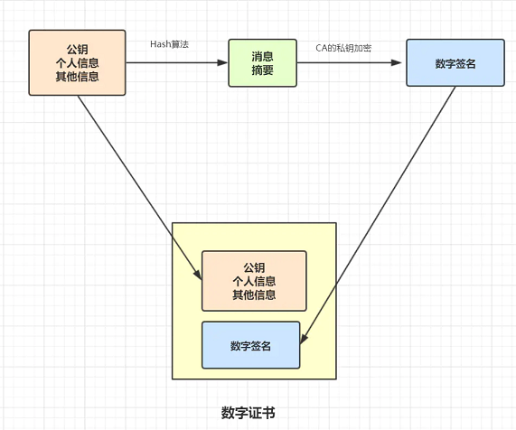

# HTTP 常用状态码

- 101 Switching Protocols，该状态码表示客户端使用 Upgrade 头字段，要求在 HTTP 协议的基础上改成其他的协议继续通信。比如：WebSocket。而如果服务器也同意变更协议，就会发送状态码 101，但这之后的数据传输就不会再使用 HTTP 了
- 200 OK，是最常⻅的成功状态码，表示⼀切正常。如果是⾮ HEAD 请求，服务器返回的响应头都会有 body 数据
- 204 No Content，也是常⻅的成功状态码，与 200 OK 基本相同，但响应头没有 body 数据
- 206 Partial Content，是应⽤于 HTTP 分块下载或断点续传，表示响应返回的 body 数据并不是资源的全部⽽是其中的⼀部分，也是服务器处理成功的状态
- 301 Moved Permanently，表示永久重定向，说明请求的资源已经不存在了，需改⽤新的 URL 再次访问
- 302 Found，表示临时重定向，说明请求的资源还在，但暂时需要⽤另⼀个 URL 来访问
- 400 Bad Request，表示客户端请求的报⽂有错误，但只是个笼统的错误
- 401 Unauthorized，表示发送的请求需要有通过 HTTP 认证（BASIC 认证、DIGEST 认证）。 另外若之前已进行过 1 次请求，则表示用户认证失败
- 403 Forbidden，表示服务器禁⽌访问资源，并不是客户端的请求出错
- 404 Not Found，表示请求的资源在服务器上不存在或未找到，所以⽆法提供给客户端
- 500 Internal Server Error，与 400 类型，是个笼统通⽤的错误码，服务器发⽣了什么错误，我们并不知道
- 501 Not Implemented，表示客户端请求的功能还不⽀持，类似“即将开业，敬请期待”的意思
- 502 Bad Gateway，通常是服务器作为⽹关或代理时返回的错误码，表示服务器⾃身⼯作正常，访问后端服务器发⽣了错误
- 503 Service Unavailable，表示服务器当前很忙，暂时⽆法响应服务器，类似“⽹络服务正忙，请稍后重试”的意思

301 和 302 的主要区别：

- 301：（永久性转移）请求的网页已被永久移动到新位置。服务器返回此响应时，会自动将请求者转到新位置
- 302：（暂时性转移）服务器目前正从不同位置的网页响应请求，但请求者应继续使用原有位置来进行以后的请求。此代码与响应 GET 和 HEAD 请求的 301 代码类似，会自动将请求者转到不同的位置。

# HTTP 常用方法

POST 和 GET 有哪些区别：

安全：

在 HTTP 协议里，所谓的“安全”是指请求方法不会“破坏”服务器上的资源，即不会对服务器上的资源造成实质的修改。

- 只有 GET 和 HEAD 方法是“安全”的，因为它们是“只读”操作，只要服务器不故意曲解请求方法的处理方式，无论 GET 和 HEAD 操作多少次，服务器上的数据都是“安全的”
- POST/PUT/DELETE 操作会修改服务器上的资源，增加或删除数据，所以是“不安全”的

幂等：

所谓的“幂等”实际上是一个数学用语，被借用到了HTTP协议里，意思是多次执行相同的操作，结果也都是相同的，即多次“幂”后结果“相等”。

- GET 和 HEAD 既是安全的也是幂等的
- DELETE 可以多次删除同一个资源，效果都是“资源不存在”，所以也是幂等的
- POST 是“新增或提交数据”，多次提交数据会创建多个资源，所以不是幂等的
- PUT 是“替换或更新数据”，多次更新一个资源，资源还是会第一次更新的状态，所以是幂等的

# 从浏览器地址栏输入url 到显示主页的过程

- DNS 解析，查找域名对应的 IP 地址
- 与服务器通过三次握手，建立 TCP 连接
- 向服务器发送 HTT P请求
- 服务器处理请求，返回网页内容
- 浏览器解析并渲染页面
- TCP四次挥手，连接结束

# HTTP/1.0，1.1，2.0 的区别

HTTP/1.0：

- 默认使用短连接，每次请求都需要建立一个TCP连接。它可以设置 `Connection: keep-alive` 这个字段，强制开启长连接。

HTTP/1.1：

- 引入了持久连接，即 TCP 连接默认不关闭，可以被多个请求复用
- 分块传输编码，即服务端每产生一块数据，就发送一块，用”流模式”取代”缓存模式”
- 管道机制，即在同一个 TCP 连接里面，客户端可以同时发送多个请求

HTTP/2.0

- 二进制协议，1.1版本的头信息是文本（ASCII编码），数据体可以是文本或者二进制；2.0 中，头信息和数据体都是二进制
- 完全多路复用，在一个连接里，客户端和浏览器都可以同时发送多个请求或回应，而且不用按照顺序一一对应
- 报头压缩，HTTP 协议不带有状态，每次请求都必须附上所有信息。Http/2.0 引入了头信息压缩机制，使用 gzip 或 compress 压缩后再发送
- 服务端推送，允许服务器未经请求，主动向客户端发送资源

# HTTP 长连接

HTTP 分为长连接和短连接，本质上说的是 TCP 的长短连接。TCP 连接是一个双向的通道，它是可以保持一段时间不关闭的，因此TCP连接才具有真正的长连接和短连接这一说法哈。

TCP 长连接可以复用一个 TCP 连接，来发起多次的 HTTP 请求，这样就可以减少资源消耗，比如一次请求 HTML，如果是短连接的话，可能还需要请求后续的 JS/CSS。

通过在头部（请求和响应头）设置 `Connection` 字段指定为`keep-alive`，HTTP/1.0 协议支持，但是是默认关闭的，从HTTP/1.1以后，连接默认都是长连接。

TCP 的 keep-alive 包含三个参数，支持在系统内核的 net.ipv4 里面设置：

- 当 TCP 连接之后，闲置了 tcp_keepalive_time，则会发生侦测包
- 如果没有收到对方的 ACK，那么会每隔  tcp_keepalive_intvl 再发一次
- 直到发送了 tcp_keepalive_probes，就会丢弃该连接

#  HTTP 与 HTTPS 的区别

HTTP会存在的问题：

- 请求信息是明文传输，容易被窃听截取
- 没有验证对方身份，存在被冒充的风险
- 数据的完整性未校验，容易被中间人篡改

# HTTPS 流程是怎样的

HTTPS = HTTP + SSL/TLS，也就是用 SSL/TLS 对数据进行加密和解密，Http 进行传输。

SSL，即Secure Sockets Layer（安全套接层协议），是网络通信提供安全及数据完整性的一种安全协议。

TLS，即 Transport Layer Security (安全传输层协议)，它是 SSL3.0 的后续版本。

1. 客户端发起Https请求，连接到服务器的443端口。
2. 服务器必须要有一套数字证书（证书内容有公钥、证书颁发机构、失效日期等）。
3. 服务器将自己的数字证书发送给客户端（公钥在证书里面，私钥由服务器持有）。
4. 客户端收到数字证书之后，会验证证书的合法性。如果证书验证通过，就会生成一个随机的对称密钥，用证书的公钥加密。
5. 客户端将公钥加密后的密钥发送到服务器。
6. 服务器接收到客户端发来的密文密钥之后，用自己之前保留的私钥对其进行非对称解密，解密之后就得到客户端的密钥，然后用客户端密钥对返回数据进行对称加密，酱紫传输的数据都是密文啦。
7. 服务器将加密后的密文返回到客户端。
8. 客户端收到后，用自己的密钥对其进行对称解密，得到服务器返回的数据。

# 数字签名和数字证书

数字证书是指在互联网通讯中标志通讯各方身份信息的一个数字认证，人们可以在网上用它来识别对方的身份。它的出现，是为了避免身份被篡改冒充的。比如 Https 的数字证书，就是为了避免公钥被中间人冒充篡改：

数字证书构成：

- 公钥和个人等信息，经过Hash摘要算法加密，形成消息摘要；将消息摘要拿到拥有公信力的认证中心（CA），用它的私钥对消息摘要加密，形成数字签名
- 公钥和个人信息、数字签名共同构成数字证书

# 对称加密与非对称加密

对称加密：指加密和解密使用同一密钥，优点是运算速度较快，缺点是如何安全将密钥传输给另一方。常见的对称加密算法有：DES、AES 等。

非对称加密：指的是加密和解密使用不同的密钥（即公钥和私钥）。公钥与私钥是成对存在的，如果用公钥对数据进行加密，只有对应的私钥才能解密。常见的非对称加密算法有 RSA。

#  WebSocket 与 socket 的区别

- WebSocket是一个持久化的协议，它是伴随H5而出的协议，用来解决 http不支持持久化连接的问题
- Socket一个是网编编程的标准接口，而 WebSocket 则是应用层通信协议。

