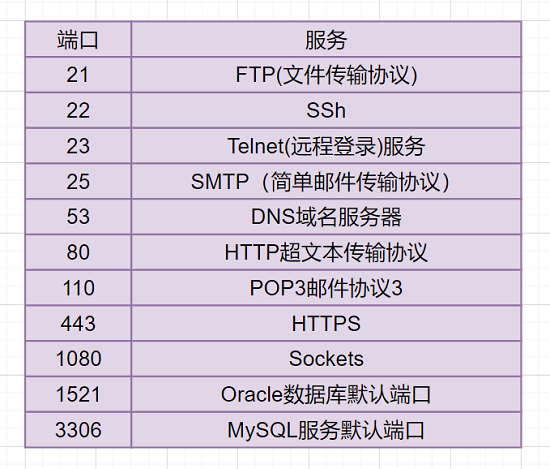

# IP地址分类

一般可以这么认为，IP地址=网络号+主机号。

- 网络号：它标志主机所连接的网络地址表示属于互联网的哪一个网络
- 主机号：它标志主机地址表示其属于该网络中的哪一台主机

IP 地址分为A，B，C，D，E五大类：

- A 类地址(1~126)：以 0 开头，网络号占前8位，主机号占后面 24 位
- B 类地址(128~191)：以 10 开头，网络号占前 16 位，主机号占后面 16 位
- C 类地址(192~223)：以 110 开头，网络号占前 24 位，主机号占后面 8 位
- D 类地址(224~239)：以 1110 开头，保留位多播地址
- E 类地址(240~255)：以 11110 开头，保留位为将来使用

# 常见端口及其服务

# DNS 解析过程

DNS，英文全称是 domain name system，域名解析系统，是 Internet 上作为域名和IP相互映射的一个分布式数据库。它的作用很明确，就是可以根据域名查出对应的 IP 地址。

# ARP 协议工作过程

ARP 协议协议，Address Resolution Protocol，地址解析协议，它是用于实现 IP 地址到 MAC 地址的映射。

- 首先，每台主机都会在自己的ARP缓冲区中建立一个 ARP 列表，以表示 IP 地址和 MAC 地址的对应关系
- 当源主机需要将一个数据包要发送到目的主机时，会首先检查自己的 ARP 列表，是否存在该 IP 地址对应的 MAC 地址；如果有就直接将数据包发送到这个 MAC 地址；如果没有，就向本地网段发起一个 ARP 请求的广播包，查询此目的主机对应的 MAC 地址。此 ARP 请求的数据包里，包括源主机的 IP 地址、硬件地址、以及目的主机的 IP 地址
- 网络中所有的主机收到这个 ARP 请求后，会检查数据包中的目的IP是否和自己的 IP 地址一致。如果不相同，就会忽略此数据包；如果相同，该主机首先将发送端的 MAC 地址和 IP 地址添加到自己的 ARP 列表中，如果 ARP 表中已经存在该IP的信息，则将其覆盖，然后给源主机发送一个  ARP 响应数据包，告诉对方自己是它需要查找的 MAC 地址
- 源主机收到这个 ARP 响应数据包后，将得到的目的主机的 IP 地址和 MAC 地址添加到自己的 ARP 列表中，并利用此信息开始数据的传输。如果源主机一直没有收到 ARP 响应数据包，表示 ARP 查询失败

# ICMP 协议的功能

ICMP，Internet Control Message Protocol，网络控制消息协议：

- ICMP 协议是一种面向无连接的协议，用于传输出错报告控制信息
- 它是一个非常重要的协议，它对于网络安全具有极其重要的意义。它属于网络层协议，主要用于在主机与路由器之间传递控制信息，包括报告错误、交换受限控制和状态信息等
- 当遇到IP数据无法访问目标、IP路由器无法按当前的传输速率转发数据包等情况时，会自动发送ICMP消息。

比如我们日常使用得比较多的 ping，就是基于 ICMP 的。

# ping 的原理

ping，Packet Internet Groper，是一种因特网包探索器，用于测试网络连接量的程序。Ping 是工作在 TCP/IP 网络体系结构中应用层的一个服务命令， 主要是向特定的目的主机发送 ICMP（Internet Control Message Protocol 因特网报文控制协议） 请求报文，测试目的站是否可达及了解其有关状态

- ping 通知系统，新建一个固定格式的 ICMP 请求数据包
- ICMP 协议，将该数据包和目标机器 B 的 IP 地址打包，一起转交给 IP 协议层
- IP 层协议将本机 IP 地址为源地址，机器 B 的 IP 地址为目标地址，加上一些其他的控制信息，构建一个 IP 数据包
- 先获取目标机器 B 的 MAC 地址
- 数据链路层构建一个数据帧，目的地址是 IP 层传过来的 MAC地址，源地址是本机的 MAC 地址
- 机器 B 收到后，对比目标地址，和自己本机的 MAC 地址是否一致，符合就处理返回，不符合就丢弃
- 根据目的主机返回的 ICMP 回送回答报文中的时间戳，从而计算出往返时间
- 最终显示结果有这几项：发送到目的主机的IP地址、发送 & 收到 & 丢失的分组数、往返时间的最小、最大& 平均值

# 有了 IP 地址，为什么还要用 MAC 地址

对于同一个子网上的设备，IP 地址的前缀都是一样的，这样路由器通过 IP 地址的前缀就知道设备在在哪个子网上了，而只用 MAC 地址的话，路由器则需要记住每个 MAC 地址在哪个子网，这需要路由器有极大的存储空间，是无法实现的。

