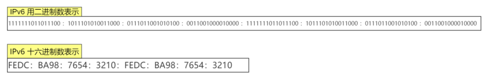
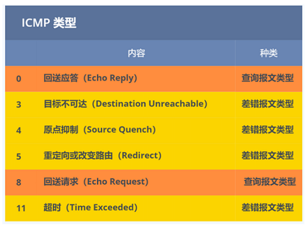

# 常见端口及其服务

# IP 服务

⽹络层的主要作⽤是： 实现主机与主机之间的通信，也叫点对点通信。  

MAC （数据链路层）的作⽤则是实现直连的两个设备之间通信，⽽ IP（⽹络层） 则负责在没有直连的两个⽹络之间进⾏通信传输。  

IP协议功能：

- 寻址和路由；（根据对方的IP地址，寻找最佳路径传输信息）
- 传递服务：
  - 不可靠（IP协议只是尽自己最大努力去传输数据包），可靠性由上层协议提供（TCP协议）
  - 无状态：IP 通信双方不同步传输数据的状态信息，所有的 IP 数据报的发送，传输和接收都是相互独立，没有上下文关系的无法处理乱序和重复的 IP 数据报优点是简单、高效，内核中无需额外分配资源保存通信状态，也无须在每次传输时携带状态信息
  - 无连接（事先不建立会话），IP 通信双方不能长久的维持对方的任何信息，上层协议每次发送数据时，都必须明确指定对方的 IP 地址
  - 数据包的分片和重组

MAC 地址和 IP 地址：

信息传递时候，需要知道的其实是两个地址：终点地址、下一跳的地址。IP 地址本质上是终点地址，它在跳过路由器的时候不会改变，而 MAC 地址则是下一跳的地址，每跳过一次路由器都会改变，这就是为什么还要用 MAC 地址的原因之一，它起到了记录下一跳的信息的作用。

网络体系结构的分层模型：用 MAC 地址和 IP 地址两个地址，用于分别表示物理地址和逻辑地址是有好处的。这样分层可以使网络层与数据链路层的协议更灵活地替换。

对于同一个子网上的设备，IP 地址的前缀都是一样的，这样路由器通过 IP 地址的前缀就知道设备在在哪个子网上了，而只用 MAC 地址的话，路由器则需要记住每个 MAC 地址在哪个子网，这需要路由器有极大的存储空间，是无法实现的。

# IPv4

IP 地址（IPv4 地址）由 32 位正整数来表示， IP 地址在计算机是以⼆进制的⽅式处理的。为了⽅便记忆采⽤了点分⼗进制的标记⽅式：

IP 地址最⼤值也就是：2^32 ≈ 42 亿。

## IPv4 分类

IP 地址分类成了 5 种类型，分别是 A 类、 B 类、 C 类、 D 类、 E 类：

A、B、C 类主要分为两个部分，分别是⽹络号和主机号。

- 网络号：它标志主机所连接的网络地址表示属于互联网的哪一个网络
- 主机号：它标志主机地址表示其属于该网络中的哪一台主机

最⼤主机个数，就是要看主机号的位数，如 C 类地址的主机号占 8 位，那么 C 类地址的最⼤主机个数：2 ^ 8 - 2 = 254。

这是因为在 IP 地址中，有两个 IP 是特殊的，分别是主机号全为 1 和 全为 0 地址，在分配过程中，应该去掉这两种情况  ：

- 主机号全为 1 指定某个⽹络下的所有主机，⽤于⼴播  
- 主机号全为 0 指定某个⽹络  

⼴播地址⽤于在同⼀个链路中相互连接的主机之间发送数据包。  ⼴播地址可以分为本地⼴播和直接⼴播两种：

- 在本⽹络内⼴播的叫做本地⼴播
- 在不同⽹络之间的⼴播叫做直接⼴播

⽹络地址为 192.168.0.0/24 的情况下，⼴播地址是 192.168.0.255 。这个⼴播地址的 IP 包会被路由器屏蔽，所以不会到达 192.168.0.0/24 以外的其他链路上：

⽹络地址为 192.168.0.0/24 的主机向 192.168.1.255/24 的⽬标地址发送 IP 包。收到这个包的路由器，将数据转发给 192.168.1.0/24，从⽽使得所有192.168.1.1~192.168.1.254 的主机都能收到这个包（由于直接⼴播有⼀定的安全问题，多数情况下会在路由器上设置为不转发。） 

D 类和 E 类地址是没有主机号的，所以不可⽤于主机 IP， D 类常被⽤于多播， E 类是预留的分类，暂时未使⽤。  

多播⽤于将包发送给特定组内的所有主机。由于⼴播⽆法穿透路由，若想给其他⽹段发送同样的包，就可以使⽤可以穿透路由的多播。  

多播使⽤的 D 类地址，其前四位是 1110 就表示是多播地址，⽽剩下的 28 位是多播的组编号。从 224.0.0.0 ~ 239.255.255.255 都是多播的可⽤范围，其划分为以下三类：  

- 224.0.0.0 ~ 224.0.0.255 为预留的组播地址，只能在局域⽹中，路由器是不会进⾏转发的  
- 224.0.1.0 ~ 238.255.255.255 为⽤户可⽤的组播地址，可以⽤于 Internet 上  
- 239.0.0.0 ~ 239.255.255.255 为本地管理组播地址，可供内部⽹在内部使⽤，仅在特定的本地范围内有效  

在 A、 B、 C 分类地址，实际上有分公有 IP 地址和私有 IP 地址：

IP 分类的优点：简单明了、选路（基于⽹络地址）简单  

IP 分类的缺点：

- 同⼀⽹络下没有地址层次  
- 不能很好的与现实⽹络匹配，C 类地址能包含的最⼤主机数量实在太少了，只有 254 个，⽽ B 类地址能包含的最⼤主机数量⼜太多了， 6 万多台机器放在⼀个⽹络下⾯  

## ⽆分类地址 CIDR  

这种⽅式不再有分类地址的概念， 32 ⽐特的 IP 地址被划分为两部分，前⾯是⽹络号，后⾯是主机号。  

表示形式：`a.b.c.d/x `

`/x` 表示前 x 位属于⽹络号， x 的范围是 0 ~ 32 ，这就使得 IP 地址更加具有灵活性。⽐如 10.100.122.2/24，这种地址表示形式就是 CIDR， /24 表示前 24 位是⽹络号，剩余的 8 位是主机号：

掩码的意思就是掩盖掉主机号，剩余的就是⽹络号。  将⼦⽹掩码和 IP 地址按位计算 AND，就可得到⽹络号：

⼦⽹掩码还有⼀个作⽤，那就是划分⼦⽹。⼦⽹划分实际上是将主机地址分为两个部分：⼦⽹⽹络地址和⼦⽹主机地址。

- 未做⼦⽹划分的 ip 地址：⽹络地址＋主机地址  
- 做⼦⽹划分后的 ip 地址：⽹络地址＋（⼦⽹⽹络地址＋⼦⽹主机地址）  

假设对 C 类地址进⾏⼦⽹划分，⽹络地址 192.168.1.0，使⽤⼦⽹掩码 255.255.255.192 对其进⾏⼦⽹划分：

由于⼦⽹⽹络地址被划分成 2 位，那么⼦⽹地址就有 4 个，分别是 00、 01、 10、 11，具体划分如下：

## IP 地址与路由控制  

在发送 IP 包时，⾸先要确定 IP 包⾸部中的⽬标地址，再从路由控制表中找到与该地址具有相同⽹络地址的记录，根据该记录将 IP 包转发给相应的下⼀个路由器。如果路由控制表中存在多条相同⽹络地址的记录，就选择相同位数最多的⽹络地址，也就是最⻓匹配。  

- 主机 A 要发送⼀个 IP 包，其源地址是 10.1.1.30 和⽬标地址是 10.1.2.10 ，由于没有在主机 A 的路由表找到与⽬标地址 10.1.2.10 的⽹络地址，于是包被转发到默认路由（路由器 1 ）  
- 路由器 1 收到 IP 包后，也在路由器 1 的路由表匹配与⽬标地址相同的⽹络地址记录，发现匹配到了，于是就把 IP 数据包转发到了 10.1.0.2 这台路由器 2  
- 路由器 2 收到后，同样对⽐⾃身的路由表，发现匹配到了，于是把 IP 包从路由器 2 的 10.1.2.1 这个接⼝出去，最终经过交换机把 IP 数据包转发到了⽬标主机  

环回地址是在同⼀台计算机上的程序之间进⾏⽹络通信时所使⽤的⼀个默认地址。计算机使⽤⼀个特殊的 IP 地址 127.0.0.1 作为环回地址。与该地址具有相同意义的是⼀个叫做 localhost 的主机名。使⽤这个 IP 或主机名时，数据包不会流向⽹络。  

## IP 分⽚与重组  

每种数据链路的最⼤传输单元 MTU 都是不相同的，如 FDDI 数据链路 MTU 4352、以太⽹的 MTU 是 1500 字节等。当IP 数据报的长度超过帧的 MTU 时，将被分片传输：

- 分片可能出现在发送端，也可能出现在中转路由器上，传输过程中可以被多次分片
- 只有在最终的目标机器上，这些分片才会被内核中的 IP 模块重新组装

假设发送⽅发送⼀个 4000 字节的⼤数据报，若要传输在以太⽹链路，则需要把数据报分⽚成 3 个⼩数据报进⾏传输：

在分⽚传输中，⼀旦某个分⽚丢失，则会造成整个 IP 数据报作废，所以 TCP 引⼊了 MSS 也就是在 TCP 层进⾏分⽚不由 IP 层分⽚，那么对于 UDP 我们尽量不要发送⼀个⼤于 MTU 的数据报⽂。  

IP 头部给 IP 分片和重组提供的信息：

- 数据报标识：一个 IP 数据报的每个分片都具有自己的 IP 头部标识，他们具有相同的标识值
- 标志：除了最后一个分片之外，其他分片都将设置 MF 标志。
- 片偏移：每个分片的片偏移是不一样的

# IPv6  

IPv6 的地址是 128 位的，这可分配的地址数量是⼤的惊⼈，说个段⼦ IPv6 可以保证地球上的每粒沙⼦都能被分配到⼀个 IP 地址。  

IPv6 地址⻓度是 128 位，是以每 16 位作为⼀组，每组⽤冒号 `:` 隔开：

如果出现连续的 0 时还可以将这些 0 省略，并⽤两个冒号 `::` 隔开。但是，⼀个 IP 地址中只允许出现⼀次两个连续的冒号：

IPv6 类似 IPv4，也是通过 IP 地址的前⼏位标识 IP 地址的种类。IPv6 的地址主要有以下类型地址：  

- 单播地址，⽤于⼀对⼀的通信
- 组播地址，⽤于⼀对多的通信
- 任播地址，⽤于通信最近的节点，最近的节点是由路由协议决定
- 没有⼴播地址  

对于⼀对⼀通信的 IPv6 地址，主要划分了三类单播地址，每类地址的有效范围都不同：

- 在同⼀链路单播通信，不经过路由器，可以使⽤链路本地单播地址， IPv4 没有此类型
- 在内⽹⾥单播通信，可以使⽤唯⼀本地地址，相当于 IPv4 的私有 IP
- 在互联⽹通信，可以使⽤全局单播地址，相当于 IPv4 的公有 IP  

IPv6 的优点：

- IPv6 可⾃动配置，即使没有 DHCP 服务器也可以实现⾃动分配IP地址  
- IPv6 包头包⾸部⻓度采⽤固定的值 40 字节，去掉了包头校验和，简化了⾸部结构，减轻了路由器负荷，⼤⼤提⾼了传输的性能  
- IPv6 有应对伪造 IP 地址的⽹络安全功能以及防⽌线路窃听的功能，⼤⼤提升了安全性  

# 首部

## IPv4 首部

- 版本：占 4 位。指 IP 协议是 IPv4 还是 IPv6，通信双方的版本必须一致
- 首部长度：占 4 位。以 4B 为单位，最大值为 60B。默认情况下首部长度看成 20B，此时不使用任何选项（即可选字段）
- 服务质量：如延时，吞吐量等
- 总长度：占16 位。指首部和数据之和的长度，以 1B 为单位，因此数据报最大长度为 2 ^ 16 − 1 = 65535B。以太网的最大传送单元（MTU）为 1500B，因此当一个IP数据包封装成帧时，数据包总长度一定不能超过数据链路层的 MTU 值
- 标识：占 16 位。它是一个计数器，每产生一个数据报就加 1，但它并不是“序号”（IP是无连接服务）。当一个数据报长度超过网络的 MTU 时，必须分片，此时每个数据报片都复制一次标识号以便能重装成原来的数据报。重装数据报是在目的端主机完成的
- 标志：占 3 位
  - 第一个比特未使用，目前必须是 0
  -  第二个比特表示是否进行分片，0 表示可以分片，1 表示不能分片
  -  第三个比特表示在分片时，是否表示最后一个包。1 表示不是最后一个包， 0表示分配中最后一个包
- 片偏移：占 13 位。指明了每个分片相对于原始报文开头的偏移量，以 8B 为单位，即每个分片的长度必须是 8B 的整数倍，最大可以表示 8 x 8192 = 65536 字节的偏移量
- 生存时间（TTL）：占 8 位。报文经过的每个路由器都将此字段减 1，当此字段等于 0 时，丢弃该报文，确保报文不会永远在网络中循环
- 协议：占 8 位。指出携带的数据应交给那个传输层协议：1： ICMP，2：IGMP，6：TCP，17：UDP
- 首部检验和：占 16 位。只检验数据报首部，不检验数据部分
- 源地址：占 32 位。表示发送方的IP地址
- 目的地址：占 32 位。表示接收方的IP地址
- 可选项：仅在试验或诊断时用，可以没有。如果有，需要配合填充占满 32 比特

## IPv6 首部

- 取消了⾸部校验和字段。 因为在数据链路层和传输层都会校验，因此 IPv6 直接取消了 IP 的校验
- 取消了分⽚/重新组装相关字段。 分⽚与重组是耗时的过程， IPv6 不允许在中间路由器进⾏分⽚与重组，这种操作只能在源与⽬标主机，这将⼤⼤提⾼了路由器转发的速度
- 取消选项字段。 选项字段不再是标准 IP ⾸部的⼀部分了，但它并没有消失，⽽是可能出现在 IPv6 ⾸部中的下⼀个⾸部指出的位置上。删除该选项字段使的 IPv6 的⾸部成为固定⻓度的 40 字节

# IP  协议相关技术

## DNS  

DNS，英文全称是 domain name system，域名解析系统，是 Internet 上作为域名和IP相互映射的一个分布式数据库。它的作用很明确，就是可以根据域名查出对应的 IP 地址。

DNS 中的域名都是⽤句点来分隔的，⽐如 www.server.com ，这⾥的句点代表了不同层次之间的界限。在域名中， 越靠右的位置表示其层级越⾼。根域是在最顶层，它的下⼀层就是 com 顶级域，再下⾯是 server.com。 所以域名的层级关系类似⼀个树状结构：   

根域的 DNS 服务器信息保存在互联⽹中所有的 DNS 服务器中。这样⼀来，任何 DNS 服务器就都可以找到并访问根域 DNS 服务器了。因此，客户端只要能够找到任意⼀台 DNS 服务器，就可以通过它找到根域 DNS 服务器，然后再⼀路顺藤摸⽠找到位于下层的某台⽬标 DNS 服务器。  

DNS 的流程：   

DNS 服务器查询的过程：

## ARP  

ARP 协议协议，Address Resolution Protocol，地址解析协议，它是用于实现 IP 地址到 MAC 地址的映射。

- 首先，每台主机都会在自己的ARP缓冲区中建立一个 ARP 列表，以表示 IP 地址和 MAC 地址的对应关系
- 当源主机需要将一个数据包要发送到目的主机时，会首先检查自己的 ARP 列表，是否存在该 IP 地址对应的 MAC 地址；如果有就直接将数据包发送到这个 MAC 地址；如果没有，就向本地网段发起一个 ARP 请求的广播包，查询此目的主机对应的 MAC 地址。此 ARP 请求的数据包里，包括源主机的 IP 地址、硬件地址、以及目的主机的 IP 地址
- 网络中所有的主机收到这个 ARP 请求后，会检查数据包中的目的IP是否和自己的 IP 地址一致。如果不相同，就会忽略此数据包；如果相同，该主机首先将发送端的 MAC 地址和 IP 地址添加到自己的 ARP 列表中，如果 ARP 表中已经存在该IP的信息，则将其覆盖，然后给源主机发送一个  ARP 响应数据包，告诉对方自己是它需要查找的 MAC 地址
- 源主机收到这个 ARP 响应数据包后，将得到的目的主机的 IP 地址和 MAC 地址添加到自己的 ARP 列表中，并利用此信息开始数据的传输。如果源主机一直没有收到 ARP 响应数据包，表示 ARP 查询失败

操作系统通常会把第⼀次通过 ARP 获取的 MAC 地址缓存起来，以便下次直接从缓存中找到对应 IP 地址的 MAC 地址。不过， MAC 地址的缓存是有⼀定期限的，超过这个期限，缓存的内容将被清除。 

ARP 欺骗：

- ARP 欺骗就是非法的宣称自己是某个 IP 的 MAC 地址，使询问者错误的更新 ARP 缓存表，这样被欺骗主机发送的数据就会发送到发起攻击的主机，而不是理想的目的 IP 主机

- ARP攻击仅能在以太网（局域网如机房、内网、公司网络等）进行。无法对外网（互联网、非本区域内的局域网）攻击

## RARP  

ARP 协议是已知 IP 地址求 MAC 地址，那 RARP 协议正好相反，它是已知 MAC 地址求 IP 地址。  

通常这需要架设⼀台 RARP 服务器，在这个服务器上注册设备的 MAC 地址及其 IP 地址。然后再将这个设备接⼊到⽹络，接着：  

- 该设备会发送⼀条我的 MAC 地址是 XXXX，请告诉我，我的 IP 地址应该是什么的请求信息  
- RARP 服务器接到这个消息后返回MAC地址为 XXXX 的设备， IP 地址为 XXXX 的信息给这个设备  
- 最后，设备就根据从 RARP 服务器所收到的应答信息设置⾃⼰的 IP 地址  

## DHCP  

通过 DHCP 动态获取 IP 地址，⼤⼤省去了配 IP 信息繁琐的过程。  

DHCP 客户端进程监听的是 68 端⼝号， DHCP 服务端进程监听的是 67 端⼝号。  

- 客户端⾸先发起 DHCP 发现报⽂（DHCP DISCOVER） 的 IP 数据报，由于客户端没有 IP 地址，也不知道 DHCP 服务器的地址，所以使⽤的是 UDP ⼴播通信，其使⽤的⼴播⽬的地址是 255.255.255.255（端⼝67） 并且使⽤ 0.0.0.0（端⼝ 68） 作为源 IP 地址。 DHCP 客户端将该 IP 数据报传递给链路层，链路层然后将帧⼴播到所有的⽹络中设备 
- DHCP 服务器收到 DHCP 发现报⽂时，⽤ DHCP 提供报⽂（DHCP OFFER） 向客户端做出响应。该报⽂仍然使⽤ IP ⼴播地址 255.255.255.255，该报⽂信息携带服务器提供可租约的 IP 地址、⼦⽹掩码、默认⽹关、DNS 服务器以及 IP 地址租⽤期  
- 客户端收到⼀个或多个服务器的 DHCP 提供报⽂后，从中选择⼀个服务器，并向选中的服务器发送 DHCP 请求报⽂（DHCP REQUEST进⾏响应，回显配置的参数  
- 最后，服务端⽤ DHCP ACK 报⽂对 DHCP 请求报⽂进⾏响应，应答所要求的参数

⼀旦客户端收到 DHCP ACK 后，交互便完成了，并且客户端能够在租⽤期内使⽤ DHCP 服务器分配的 IP 地址。  如果租约的 DHCP IP 地址快期后，客户端会向服务器发送 DHCP 请求报⽂：  

- 服务器如果同意继续租⽤，则⽤ DHCP ACK 报⽂进⾏应答，客户端就会延⻓租期  
- 服务器如果不同意继续租⽤，则⽤ DHCP NACK 报⽂，客户端就要停⽌使⽤租约的 IP 地址  

DHCP 交互中，全程都是使⽤ UDP ⼴播通信。那如果 DHCP 服务器和客户端不是在同⼀个局域⽹内，路由器⼜不会转发⼴播包，那不是每个⽹络都要配⼀个 DHCP 服务器？为了解决这⼀问题，就出现了 DHCP 中继代理。有了 DHCP 中继代理以后，对不同⽹段的 IP 地址分配也可以由⼀个 DHCP 服务器统⼀进⾏管理。  

- DHCP 客户端会向 DHCP 中继代理发送 DHCP 请求包，⽽ DHCP 中继代理在收到这个⼴播包以后，再以单播的形式发给 DHCP 服务器
- 服务器端收到该包以后再向 DHCP 中继代理返回应答，并由 DHCP 中继代理将此包⼴播给 DHCP 客户端

## NAT  

⽹络地址转换 NAT 的⽅法缓解了 IPv4 地址耗尽的问题。简单的来说 NAT 就是同个公司、家庭、教室内的主机对外部通信时，把私有 IP 地址转换成公有 IP 地址。    

普通的 NAT 转换没什么意义：N 个私有 IP 地址，你就要 N 个公有 IP 地址。由于绝⼤多数的⽹络应⽤都是使⽤传输层协议 TCP 或 UDP 来传输数据的，因此，可以把 IP 地址 + 端⼝号⼀起进⾏转换。这样，就⽤⼀个全球 IP 地址就可以了，这种转换技术就叫⽹络地址与端⼝转换 NAPT。      

由于 NAT/NAPT 都依赖于⾃⼰的转换表，因此会有以下的问题：  

- 外部⽆法主动与 NAT 内部服务器建⽴连接，因为 NAPT 转换表没有转换记录
- 转换表的⽣成与转换操作都会产⽣性能开销  
- 通信过程中，如果 NAT 路由器重启了，所有的 TCP 连接都将被重置  

解决的⽅法主要有两种⽅法：

- 第⼀种就是改⽤ IPv6  
- 第⼆种 NAT 穿透技术，客户端主动从 NAT 设备获取公有 IP 地址，然后⾃⼰建⽴端⼝映射条⽬，然后⽤这个条⽬对外通信，就不需要 NAT 设备来进⾏转换了   

## ICMP  

ICMP 全称是 Internet Control Message Protocol，也就是互联⽹控制报⽂协议。ICMP 主要的功能包括： 确认 IP 包是否成功送达⽬标地址、报告发送过程中 IP 包被废弃的原因和改善⽹络设置等。  

ICMP ⼤致可以分为两⼤类：

- ⼀类是⽤于诊断的查询消息，也就是查询报⽂类型
- 另⼀类是通知出错原因的错误消息，也就是差错报⽂类型

## IGMP  

IGMP 是因特⽹组管理协议，⼯作在主机（组播成员）和最后⼀跳路由之间。

- IGMP 报⽂向路由器申请加⼊和退出组播组，默认情况下路由器是不会转发组播包到连接中的主机，除⾮主机通过 IGMP 加⼊到组播组，主机申请加⼊到组播组时，路由器就会记录 IGMP 路由器表，路由器后续就会转发组播包到对应的主机了
- IGMP 报⽂采⽤ IP 封装， IP 头部的协议号为 2，⽽且 TTL 字段值通常为 1，因为 IGMP 是⼯作在主机与连接的路由器之间

常规查询与响应⼯作机制：

- 路由器会周期性发送⽬的地址为 224.0.0.1 （表示同⼀⽹段内所有主机和路由器） IGMP 常规查询报⽂  
- 主机1 和 主机 3 收到这个查询，随后会启动报告延迟计时器，计时器的时间是随机的，通常是 0~10 秒，计时器超时后主机就会发送 IGMP 成员关系报告报⽂（源 IP 地址为⾃⼰主机的 IP 地址，⽬的 IP 地址为组播地址）。如果在定时器超时之前，收到同⼀个组内的其他主机发送的成员关系报告报⽂，则⾃⼰不再发送，这样可以减少⽹络中多余的 IGMP 报⽂数量 
- 路由器收到主机的成员关系报⽂后，就会在 IGMP 路由表中加⼊该组播组，后续⽹络中⼀旦该组播地址的数据到达路由器，它会把数据包转发出去  

离开组播组⼯作机制：

离开组播组的情况⼀，⽹段中仍有该组播组：  

- 主机 1 要离开组 224.1.1.1，发送 IGMPv2 离组报⽂，报⽂的⽬的地址是 224.0.0.2（表示发向⽹段内的所有路由器）  
- 路由器收到该报⽂后，以 1 秒为间隔连续发送 IGMP 特定组查询报⽂（共计发送 2 个），以便确认该⽹络是否还有 224.1.1.1 组的其他成员
- 主机 3 仍然是组 224.1.1.1 的成员，因此它⽴即响应这个特定组查询。路由器知道该⽹络中仍然存在该组播组的成员，于是继续向该⽹络转发 224.1.1.1 的组播数据包  

离开组播组的情况⼆，⽹段中没有该组播组：  

- 主机 1 要离开组播组 224.1.1.1，发送 IGMP 离组报⽂  
- 路由器收到该报⽂后，以 1 秒为间隔连续发送 IGMP 特定组查询报⽂（共计发送 2 个）。此时在该⽹段内，组 224.1.1.1 已经没有其他成员了，因此没有主机响应这个查询  
- ⼀定时间后，路由器认为该⽹段中已经没有 224.1.1.1 组播组成员了，将不会再向这个⽹段转发该组播地址的数据包  

# ping

ping，Packet Internet Groper，是一种因特网包探索器，用于测试网络连接量的程序。Ping 是工作在 TCP/IP 网络体系结构中应用层的一个服务命令， 主要是向特定的目的主机发送 ICMP（Internet Control Message Protocol 因特网报文控制协议） 请求报文，测试目的站是否可达及了解其有关状态。

ping 是基于 ICMP：

ICMP 回送消息⽤于进⾏通信的主机或路由器之间，判断所发送的数据包是否已经成功到达对端的⼀种消息， ping 命令就是利⽤这个消息实现的。

可以向对端主机发送回送请求的消息（ICMP Echo Request Message ，类型 8），也可以接收对端主机发回来的回送应答消息（ICMP Echo Reply Message ，类型 0）：

相⽐原⽣的 ICMP，这⾥多了两个字段：  

- 标识符：⽤以区分是哪个应⽤程序发 ICMP 包，⽐如⽤进程 PID 作为标识符  
- 序号：序列号从 0 开始，每发送⼀次新的回送请求就会加 1 ， 可以⽤来确认⽹络包是否有丢失
- 在选项数据中， ping 还会存放发送请求的时间值，来计算往返时间，说明路程的⻓短  

⽬标不可达消息（Destination Unreachable Message）类型为 3。IP 路由器⽆法将 IP 数据包发送给⽬标地址时，会给发送端主机返回⼀个⽬标不可达的 ICMP 消息，并在这个消息中显示不可达的具体原因，原因记录在 ICMP 包头的代码字段。常⻅的⽬标不可达类型的代码：

- ⽹络不可达代码为 0
- 主机不可达代码为 1
- 协议不可达代码为 2
- 端⼝不可达代码为 3
- 需要进⾏分⽚但设置了不分⽚位代码为 4  

原点抑制消息（ICMP Source Quench Message）类型为 4。在使⽤低速⼴域线路的情况下，连接 WAN 的路由器可能会遇到⽹络拥堵的问题。ICMP 原点抑制消息的⽬的就是为了缓和这种拥堵情况。  当路由器向低速线路发送数据时，其发送队列的缓存变为零⽽⽆法发送出去时，可以向 IP 包的源地址发送⼀个 ICMP 原点抑制消息。  

重定向消息（ICMP Redirect Message）类型为 5 。如果路由器发现发送端主机使⽤了不是最优的路径发送数据，那么它会返回⼀个 ICMP 重定向消息给这个主机。在这个消息中包含了最合适的路由信息和源数据。这主要发⽣在路由器持有更好的路由信息的情况下。路由器会通过这样的 ICMP 消息告知发送端，让它下次发给另外⼀个路由器。     

超时消息（ICMP Time Exceeded Message）类型为 11。IP 包中有⼀个字段叫做 TTL （ Time To Live ，⽣存周期），它的值随着每经过⼀次路由器就会减 1，直到减到 0 时该 IP 包会被丢弃。此时，路由器将会发送⼀个 ICMP 超时消息给发送端主机，并通知该包已被丢弃。设置 IP 包⽣存周期的主要⽬的，是为了在路由控制遇到问题发⽣循环状况时，避免 IP 包⽆休⽌地在⽹络上被转发。      

ping 的发送和接收过程：  

ping 命令执⾏的时候，源主机⾸先会构建⼀个 ICMP 回送请求消息数据包。ICMP 数据包内包含多个字段，最重要的是两个：  

- 第⼀个是类型，对于回送请求消息⽽⾔该字段为 8 ；  
- 另外⼀个是序号，主要⽤于区分连续 ping 的时候发出的多个数据包  

每发出⼀个请求数据包，序号会⾃动加 1 。为了能够计算往返时间 RTT ，它会在报⽂的数据部分插⼊发送时间。

之后分别构建 IP 数据包并加⼊ MAC 头：

另一端主机会构建⼀个 ICMP 回送响应消息数据包，回送响应数据包的类型字段为 0 ， 序号为接收到的请求数据包中的序号，然后再发送出去。  

在规定的时候间内，源主机如果没有接到 ICMP 的应答包，则说明⽬标主机不可达；如果接收到了 ICMP 回送响应消息，则说明⽬标主机可达。  此时，源主机会检查，⽤当前时刻减去该数据包最初从源主机上发出的时刻，就是 ICMP 数据包的时间延迟。

同⼀个局域⽹⾥⾯的情况下 ping 流程：

- ping 通知系统，新建一个固定格式的 ICMP 请求数据包
- ICMP 协议，将该数据包和目标机器 B 的 IP 地址打包，一起转交给 IP 协议层
- IP 层协议将本机 IP 地址为源地址，机器 B 的 IP 地址为目标地址，加上一些其他的控制信息，构建一个 IP 数据包
- 先获取目标机器 B 的 MAC 地址
- 数据链路层构建一个数据帧，目的地址是 IP 层传过来的 MAC地址，源地址是本机的 MAC 地址
- 机器 B 收到后，对比目标地址，和自己本机的 MAC 地址是否一致，符合就处理返回，不符合就丢弃
- 根据目的主机返回的 ICMP 回送回答报文中的时间戳，从而计算出往返时间
- 最终显示结果有这几项：发送到目的主机的IP地址、发送 & 收到 & 丢失的分组数、往返时间的最小、最大& 平均值

# traceroute  

有⼀款充分利⽤ ICMP 差错报⽂类型的应⽤叫做 traceroute （在UNIX、 MacOS 中是这个命令，⽽在 Windows 中命令叫做 tracert ）。

设置特殊的 TTL：

traceroute 的第⼀个作⽤就是故意设置特殊的 TTL，来追踪去往⽬的地时沿途经过的路由器。  

它的原理就是利⽤ IP 包的⽣存期限 从 1 开始按照顺序递增的同时发送 UDP 包，强制接收 ICMP 超时消息的⼀种⽅法。⽐如，将 TTL 设置 为 1 ，则遇到第⼀个路由器，就牺牲了，接着返回 ICMP 差错报⽂⽹络包，类型是时间超时。接下来将 TTL 设置为 2 ，第⼀个路由器过了，遇到第⼆个路由器也牺牲了，也同时返回了 ICMP 差错报⽂数据包，如此往复，直到到达⽬的主机。这样的过程， traceroute 就可以拿到了所有的路由器 IP。当然有的路由器根本就不会返回这个 ICMP，所以对于有的公⽹地址，是看不到中间经过的路由的。  

traceroute 在发送 UDP 包时，会填⼊⼀个不可能的端⼝号值作为 UDP ⽬标端⼝号（⼤于 3000 ）。当⽬的主机，收到 UDP 包后，会返回 ICMP 差错报⽂消息，但这个差错报⽂消息的类型是端⼝不可达。所以， 当差错报⽂类型是端⼝不可达时，说明发送⽅发出的 UDP 包到达了⽬的主机。  

故意设置不分⽚：

traceroute 还有⼀个作⽤是故意设置不分⽚，从⽽确定路径的 MTU。这样做的⽬的是为了路径 MTU 发现。  

- ⾸先在发送端主机发送 IP 数据报时，将 IP 包⾸部的分⽚禁⽌标志位设置为 1。根据这个标志位，途中的路由器不会对⼤数据包进⾏分⽚，⽽是将包丢弃
- 随后，通过⼀个 ICMP 的不可达消息将数据链路上 MTU 的值⼀起给发送主机，不可达消息的类型为需要进⾏分⽚但设置了不分⽚位
- 发送主机端每次收到 ICMP 差错报⽂时就减少包的⼤⼩，以此来定位⼀个合适的 MTU 值，以便能到达⽬标主机  

