# TCP 和 UDP

## UDP 报文首部

UDP 协议⾮常简单，头部只有 8 个字节（64 位）， UDP 的头部格式如下：   

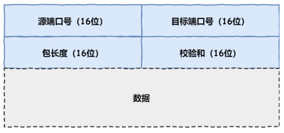

- ⽬标和源端⼝：主要是告诉 UDP 协议应该把报⽂发给哪个进程
- 包⻓度：该字段保存了 UDP ⾸部的⻓度跟数据的⻓度之和
- 校验和：校验和是为了提供可靠的 UDP ⾸部和数据⽽设计  

## TCP 和 UDP 区别

- 连接  
  - TCP 是⾯向连接的传输层协议，传输数据前先要建⽴连接  
  - UDP 是不需要连接，即刻传输数据  
- 服务对象  
  - TCP 是⼀对⼀的两点服务，即⼀条连接只有两个端点  
  - UDP ⽀持⼀对⼀、⼀对多、多对多的交互通信  
- 可靠性
  - TCP 是可靠交付数据的，数据可以⽆差错、不丢失、不重复、按需到达  
  - UDP 是尽最⼤努⼒交付，不保证可靠交付数据  
- 拥塞控制、流量控制  
  - TCP 有拥塞控制和流量控制机制，保证数据传输的安全性  
  - UDP 则没有，即使⽹络⾮常拥堵了，也不会影响 UDP 的发送速  
- ⾸部开销  
  - TCP ⾸部⻓度较⻓，会有⼀定的开销，⾸部在没有使⽤选项字段时是 20 个字节，如果使⽤了选项字段则会变⻓的
  - UDP ⾸部只有 8 个字节，并且是固定不变的，开销较⼩  
- 传输⽅式  
  - TCP 是流式传输，没有边界，但保证顺序和可靠  
  - UDP 是⼀个包⼀个包的发送，是有边界的，但可能会丢包和乱序  
- 分⽚不同  
  - TCP 的数据⼤⼩如果⼤于 MSS ⼤⼩，则会在传输层进⾏分⽚，⽬标主机收到后，也同样在传输层组装 TCP 数据包，如果中途丢失了⼀个分⽚，只需要传输丢失的这个分⽚
  - UDP 的数据⼤⼩如果⼤于 MTU ⼤⼩，则会在 IP 层进⾏分⽚，⽬标主机收到后，在 IP 层组装完数据，接着再传给传输层，但是如果中途丢了⼀个分⽚，在实现可靠传输的 UDP 时则就需要重传所有的数据包，这样传输效率⾮常差，所以通常 UDP 的报⽂应该⼩于 MTU  

- 适用场景
  - 由于 TCP 是⾯向连接，能保证数据的可靠性交付，因此经常⽤于：  
    - FTP ⽂件传输  
    - HTTP/HTTPS

  - 由于 UDP ⾯向⽆连接，它可以随时发送数据，再加上UDP本身的处理既简单⼜⾼效，因此经常⽤于：  
    - 包总量较少的通信，如 DNS 、 SNMP 等  
    - 视频、⾳频等多媒体通信  
    - ⼴播通信  

## 基于 TCP，UDP 的应用层协议

基于 TCP 的应用层协议有：

- HTTP：HyperText Transfer Protocol（超文本传输协议），默认端口80
- FTP: File Transfer Protocol (文件传输协议)，默认端口(20用于传输数据，21用于传输控制信息)
- SMTP: Simple Mail Transfer Protocol (简单邮件传输协议) ,默认端口25
- TELNET: Teletype over the Network (网络电传)，默认端口23
- SSH：Secure Shell（安全外壳协议），默认端口 22

基于 UDP 的应用层协议：

- DNS : Domain Name Service (域名服务),默认端口 53
- TFTP: Trivial File Transfer Protocol (简单文件传输协议)，默认端口 69
- SNMP：Simple Network Management Protocol（简单网络管理协议），通过 UDP 端口 161 接收，只有 Trap 信息采用 UDP 端口162

**TCP 如何确保可靠性：**

- 连接和断开的可靠性，TCP的连接是基于三次握手，而断开则是基于四次挥手。确保连接和断开的可靠性
- 有状态，TCP 会记录哪些数据发送了，哪些数据被接收了，哪些没有被接收，并且保证数据包按序到达，保证数据传输不出差错
- 可控制，它有数据包校验、ACK 应答、数据重传、丢弃重复数据、流量控制和拥塞控制等机制

# TCP 基本认识  

## 为什么需要 TCP 协议

IP 层是不可靠的，它不保证⽹络包的交付、不保证⽹络包的按序交付、也不保证⽹络包中的数据的完整性。  

如果需要保障⽹络数据包的可靠性，那么就需要由上层（传输层）的 TCP 协议来负责。因为 TCP 是⼀个⼯作在传输层的可靠数据传输的服务，它能确保接收端接收的⽹络包是⽆损坏、⽆间隔、⾮冗余和按序的。  

## 什么是 TCP 

TCP 是⾯向连接的、可靠的、基于字节流的传输层通信协议。

- ⾯向连接：⼀定是⼀对⼀才能连接，不能像 UDP 协议可以⼀个主机同时向多个主机发送消息，也就是⼀对多是⽆法做到的
- 可靠的：⽆论的⽹络链路中出现了怎样的链路变化， TCP 都可以保证⼀个报⽂⼀定能够到达接收端  
- 字节流：消息是没有边界的，所以⽆论消息有多⼤都可以进⾏传输。并且消息是有序的，前⼀个消息没有收到的时候，即使先收到了后⾯的字节，那么也不能扔给应⽤层去处理，同时对重复的报⽂会⾃动丢弃

##　如何唯⼀确定⼀个 TCP 连接

TCP 四元组可以唯⼀的确定⼀个连接，四元组包括如下：  

- 源地址  
- 源端⼝
- ⽬的地址
- ⽬的端⼝  

## 监听⼀个端⼝的 TCP 的最⼤连接数

服务器通常固定在某个本地端⼝上监听，等待客户端的连接请求。因此，客户端 IP 和端⼝是可变的，其理论值计算公式如下：

```
最大 TCP 连接数量 =  客户端的 IP 数量 X 客户端的端口数量
```

对 IPv4，客户端的 IP 数最多为 2 的 32 次⽅，客户端的端⼝数最多为 2 的 16 次⽅，也就是服务端单机最⼤ TCP 连接数，约为 2 的 48 次⽅。  

当然，服务端最⼤并发 TCP 连接数远不能达到理论上限：

- ⾸先主要是⽂件描述符限制， Socket 都是⽂件，所以⾸先要通过 ulimit 配置⽂件描述符的数⽬  
- 另⼀个是内存限制，每个 TCP 连接都要占⽤⼀定内存，操作系统的内存是有限的  

## TCP 报文首部

可选项和填充部分不是必须的，所以TCP报文首部最小长度为 20 个字节：


- 16 位端口号：源端口号，主机该报文段是来自哪里；目标端口号，要传给哪个上层协议或应用程序
- 32 位序号：一次TCP通信（从TCP连接建立到断开）过程中某一个传输方向上的字节流的每个字节的编号
- 32 位确认号：用作对另一方发送的 tcp 报文段的响应。其值是收到的TCP报文段的序号值加 1
- 4 位头部长度：表示tcp头部有多少个 32bit字（4字节）。因为4位最大能标识 15，所以 TCP 头部最长是 60 字节
- 6 位标志位：URG (紧急指针是否有效)，ACK（表示确认号是否有效），PSH（缓冲区尚未填满），RST（表示要求对方重新建立连接），SYN（建立连接消息标志接），FIN（表示告知对方本端要关闭连接了）
- 16 位窗口大小：是 TCP 流量控制的一个手段。这里说的窗口，指的是接收通告窗口。它告诉对方本端的TCP接收缓冲区还能容纳多少字节的数据，这样对方就可以控制发送数据的速度
- 16 位校验和：由发送端填充，接收端对 TCP 报文段执行 CRC 算法以检验 TCP 报文段在传输过程中是否损坏。注意，这个校验不仅包括 TCP 头部，也包括数据部分。这也是 TCP 可靠传输的一个重要保障
- 16 位紧急指针：一个正的偏移量。它和序号字段的值相加表示最后一个紧急数据的下一字节的序号。因此，确切地说，这个字段是紧急指针相对当前序号的偏移，不妨称之为紧急偏移。TCP 的紧急指针是发送端向接收端发送紧急数据的方法
- 可选项和填充部分：可选项和填充部分的长度为 4n 字节（n是整数），该部分是根据需要而增加的选项。如果不足 4n 字节，要加填充位，使得选项长度为 32 位（4字节）的整数倍

TCP Option 的样式：

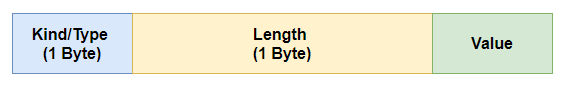

Length 指明Option的总长度（包括Kind和Length）。

常用的 Option：


# TCP 建立连接

## 三次握手


- ⼀开始，客户端和服务端都处于 CLOSED 状态。先是服务端主动监听某个端⼝，处于 LISTEN 状态  
- 客户端会随机初始化序号（client_isn），将此序号置于 TCP ⾸部的序号字段中，同时把 SYN 标志位置为 1 ，表示 SYN 报⽂。接着把第⼀个 SYN 报⽂发送给服务端，表示向服务端发起连接，该报⽂不包含应⽤层数据，之后客户端处于 SYN-SENT 状态
- 服务端收到客户端的 SYN 报⽂后，⾸先服务端也随机初始化⾃⼰的序号（server_isn ），将此序号填⼊TCP ⾸部的序号字段中，其次把 TCP ⾸部的确认应答号字段填⼊ client_isn + 1 , 接着把 SYN 和 ACK 标志位置为 1 。最后把该报⽂发给客户端，该报⽂也不包含应⽤层数据，之后服务端处于 SYNRCVD 状态 
- 客户端收到服务端报⽂后，还要向服务端回应最后⼀个应答报⽂，⾸先该应答报⽂ TCP ⾸部 ACK 标志位置为 1 ，其次确认应答号字段填⼊ server_isn + 1 ，最后把报⽂发送给服务端，这次报⽂可以携带客户到服务器的数据，之后客户端处于 ESTABLISHED 状态
- 服务器收到客户端的应答报⽂后，也进⼊ ESTABLISHED 状态  

⼀旦完成三次握⼿，双⽅都处于 ESTABLISHED 状态，此时连接就已建⽴完成，客户端和服务端就可以相互发送数据了。第三次握⼿是可以携带数据的，前两次握⼿是不可以携带数据的。

## 为什么是三次握⼿  

通过三次握⼿能防⽌历史连接的建⽴，能减少双⽅不必要的资源开销，能帮助双⽅同步初始化序列号。序列号能够保证数据包不重复、不丢弃和按序传输。  

- 两次握⼿：⽆法防⽌历史连接的建⽴，会造成双⽅资源的浪费，也⽆法可靠的同步双⽅序列号
- 四次握⼿：三次握⼿就已经理论上最少可靠连接建⽴，所以不需要使⽤更多的通信次数   

**三次握手避免历史连接：**

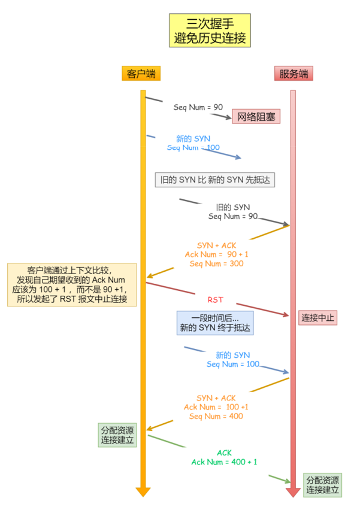


客户端连续发送多次 SYN 建⽴连接的报⽂，在⽹络拥堵情况下：  

- ⼀个旧 SYN 报⽂⽐最新的 SYN 报⽂早到达了服务端  
- 那么此时服务端就会回⼀个 SYN + ACK 报⽂给客户端  
- 客户端收到后可以根据⾃身的上下⽂，判断这是⼀个历史连接（序列号过期或超时），那么客户端就会发送 RST 报⽂给服务端，表示中⽌这⼀次连接  

如果是两次握⼿连接，就不能判断当前连接是否是历史连接，三次握⼿则可以在客户端（发送⽅）准备发送第三次报⽂时，客户端因有⾜够的上下⽂来判断当前连接是否是历史连接：  

- 如果是历史连接（序列号过期或超时），则第三次握⼿发送的报⽂是 RST 报⽂，以此中⽌历史连接  
- 如果不是历史连接，则第三次发送的报⽂是 ACK 报⽂，通信双⽅就会成功建⽴连接  

**三次握手同步双⽅初始序列号：**

TCP 协议的通信双⽅， 都必须维护⼀个序列号， 序列号是可靠传输的⼀个关键因素，它的作⽤：  

- 接收⽅可以去除重复的数据  
- 接收⽅可以根据数据包的序列号按序接收  
- 可以标识发送出去的数据包中， 哪些是已经被对⽅收到的  

序列号在 TCP 连接中占据着⾮常重要的作⽤，所以当客户端发送携带初始序列号的 SYN 报⽂的时候，需要服务端回⼀个 ACK 应答报⽂，表示客户端的 SYN 报⽂已被服务端成功接收，那当服务端发送初始序列号给客户端的时候，依然也要得到客户端的应答回应， 这样⼀来⼀回，才能确保双⽅的初始序列号能被可靠的
同步。  


四次握⼿其实也能够可靠的同步双⽅的初始化序号，但由于第⼆步和第三步可以优化成⼀步，所以就成了三次握⼿。⽽两次握⼿只保证了⼀⽅的初始序列号能被对⽅成功接收，没办法保证双⽅的初始序列号都能被确认接收。  

**三次握手避免资源浪费：**

如果只有两次握⼿，当客户端的 SYN 请求连接在⽹络中阻塞，客户端没有接收到 ACK 报⽂，就会重新发送 SYN ，由于没有第三次握⼿，服务器不清楚客户端是否收到了⾃⼰发送的建⽴连接的 ACK 确认信号，所以每收到⼀个 SYN 就只能先主动建⽴⼀个连接。

如果客户端的 SYN 阻塞了，重复发送多次 SYN 报⽂，那么服务器在收到请求后就会建⽴多个冗余的⽆效连接，造成不必要的资源浪费。即两次握⼿会造成消息滞留情况下，服务器重复接受⽆⽤的连接请求 SYN 报⽂，⽽造成重复分配资源。  


## 初始序列号 ISN

为什么客户端和服务端的初始序列号 ISN 是不相同的？ 

- 根据序号将不属于本连接的报⽂段丢弃：如果⼀个已经失效的连接被重⽤了，但是该旧连接的历史报⽂还残留在⽹络中，如果序列号相同，那么就⽆法分辨出该报⽂是不是历史报⽂，如果历史报⽂被新的连接接收了，则会产⽣数据错乱
- 为了安全性：防⽌⿊客伪造的相同序列号的 TCP 报⽂被对⽅接收

初始序列号 ISN 是如何随机产⽣的？ 

RFC1948 中提出了⼀个较好的初始化序列号 ISN 随机⽣成算法：ISN = M + F (localhost, localport, remotehost, remoteport)  

-  M 是⼀个计时器，这个计时器每隔 4 毫秒加 1  
-  F 是⼀个 Hash 算法，根据源 IP、⽬的 IP、源端⼝、⽬的端⼝⽣成⼀个随机数值。要保证 Hash 算法不能被外部轻易推算得出，⽤ MD5 算法是⼀个⽐较好的选择

## MSS   

- MTU ：⼀个⽹络包的最⼤⻓度，以太⽹中⼀般为 1500 字节  
- MSS ：除去 IP 和 TCP 头部之后，⼀个⽹络包所能容纳的 TCP 数据的最⼤⻓度  


IP 层分片：当 IP 层有⼀个超过 MTU ⼤⼩的数据（TCP 头部 + TCP 数据）要发送，那么 IP 层就要进⾏分⽚，把数据分⽚成若⼲⽚，保证每⼀个分⽚都⼩于 MTU。把⼀份 IP 数据报进⾏分⽚以后，由⽬标主机的 IP 层来进⾏重新组装后，再交给上⼀层 TCP 传输层。那么当如果⼀个 IP 分⽚丢失，整个 IP 报⽂的所有分⽚都得重传

TCP 层分片：可以得知如果由 IP 层进⾏分⽚传输，是⾮常没有效率的。  为了达到最佳的传输效能 TCP 协议在建⽴连接的时候通常要协商双⽅的 MSS 值，当 TCP 层发现数据超过 MSS 时，则就先会进⾏分⽚，当然由它形成的 IP 包的⻓度也就不会⼤于 MTU ，⾃然也就不⽤ IP 分⽚了，经过 TCP 层分⽚后，如果⼀个 TCP 分⽚丢失后， 进⾏重发时也是以 MSS 为单位，⽽不⽤重传所有的分⽚，⼤⼤增加了重传的效率

## SYN 攻击  

正常流程：

- 当服务端接收到客户端的 SYN 报⽂时，会将其加⼊到内核的 SYN 队列
- 接着发送 SYN + ACK 给客户端，等待客户端回应 ACK 报⽂
- 服务端接收到 ACK 报⽂后，从 SYN 队列 移除放⼊到 Accept 队列
- 应⽤通过调⽤ accpet() socket 接⼝，从 Accept 队列取出连接


如果应⽤程序过慢时，就会导致 Accept 队列被占满：

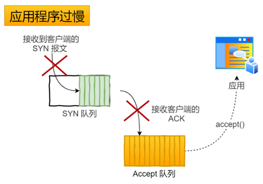

假设攻击者短时间伪造不同 IP 地址的 SYN 报⽂，服务端每接收到⼀个 SYN 报⽂，就进⼊ SYN_RCVD 状态，但服务端发送出去的 ACK + SYN 报⽂，⽆法得到未知 IP 主机的ACK 应答，久⽽久之就会占满服务端的 SYN 接收队列（未连接队列） ，使得服务器不能为正常⽤户服务：

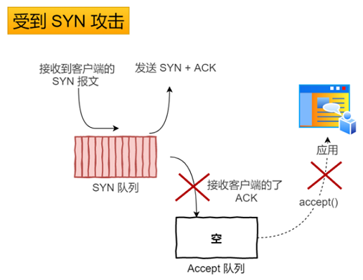

避免 SYN 攻击⽅式⼀：

SYN_RCVD 状态连接的最⼤个数：  

```
net.ipv4.tcp_max_syn_backlog
```

超出处理能力时，对新的 SYN 直接回报 RST，丢弃连接：  

```
net.ipv4.tcp_abort_on_overflow
```

避免 SYN 攻击⽅式⼆：  

tcp_syncookies 的⽅式可以应对 SYN 攻击的⽅法：  

```
net.ipv4.tcp_syncookies = 1
```

当 SYN 队列满之后，后续服务器收到 SYN 包，不进⼊SYN 队列，计算出⼀个 cookie 值，再以 SYN + ACK 中的序列号返回客户端。服务端接收到客户端的应答报⽂时，服务器会检查这个 ACK 包的合法性。如果合法，直接放⼊到 Accept 队列，最后应⽤通过调⽤ accpet() 接⼝，从 Accept 队列取出的连接 ：   

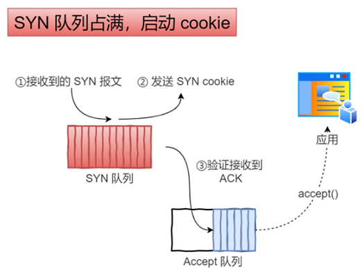

# TCP 连接断开 

## 四次挥⼿

TCP 断开连接是通过四次挥⼿⽅式。双⽅都可以主动断开连接，断开连接后主机中的资源将被释放。


- 客户端打算关闭连接，此时会发送⼀个 TCP ⾸部 FIN 标志位被置为 1 的报⽂，也即 FIN 报⽂，之后客户端进⼊ FIN_WAIT_1 状态 
- 服务端收到该报⽂后，就向客户端发送 ACK 应答报⽂，接着服务端进⼊ CLOSED_WAIT 状态  
- 客户端收到服务端的 ACK 应答报⽂后，之后进⼊ FIN_WAIT_2 状态  
- 等待服务端处理完数据后，也向客户端发送 FIN 报⽂，之后服务端进⼊ LAST_ACK 状态
- 客户端收到服务端的 FIN 报⽂后，回⼀个 ACK 应答报⽂，之后进⼊ TIME_WAIT 状态
- 服务器收到了 ACK 应答报⽂后，就进⼊了 CLOSED 状态，⾄此服务端已经完成连接的关闭 
- 客户端在经过 2MSL ⼀段时间后，⾃动进⼊ CLOSED 状态，⾄此客户端也完成连接的关闭  

为什么挥⼿需要四次：

- 关闭连接时，客户端向服务端发送 FIN 时，仅仅表示客户端不再发送数据了但是还能接收数据
- 服务器收到客户端的 FIN 报⽂时，先回⼀个 ACK 应答报⽂，⽽服务端可能还有数据需要处理和发送，等服务端不再发送数据时，才发送 FIN 报⽂给客户端来表示同意现在关闭连接，所以服务端的 ACK 和 FIN ⼀般都会分开发送，从⽽⽐三次握⼿导致多了⼀次

## Time-Wait

MSL 是 Maximum Segment Lifetime， 报⽂最⼤⽣存时间，它是任何报⽂在⽹络上存在的最⻓时间，超过这个时间报⽂将被丢弃。

因为 TCP 报⽂基于是 IP 协议的，⽽ IP 头中有⼀个 TTL 字段是 IP 数据报可以经过的最⼤路由数，每经过⼀个路由器处理此值就减 1，当此值为 0 则数据报将被丢弃，同时发送 ICMP 报⽂通知源主机。MSL 与 TTL 的区别： MSL 的单位是时间，⽽ TTL 是经过路由跳数。所以 MSL 应该要⼤于等于 TTL 消耗为 0 的时间，以确保报⽂已被⾃然消亡。  

TIME_WAIT 等待 2 倍的 MSL，⽐较合理的解释是： ⽹络中可能存在来⾃发送⽅的数据包，当这些发送⽅的数据包被接收⽅处理后⼜会向对⽅发送响应，所以⼀来⼀回需要等待 2 倍的时间。⽐如如果被动关闭⽅没有收到断开连接的最后的 ACK 报⽂，就会触发超时重发 Fin 报⽂，另⼀⽅接收到 FIN 后，会重发 ACK 给被动关闭⽅， ⼀来⼀去正好 2 个 MSL。  

2MSL 的时间是从客户端接收到 FIN 后发送 ACK 开始计时的。如果在 TIME-WAIT 时间内，因为客户端的 ACK 没有传输到服务端，客户端⼜接收到了服务端重发的 FIN 报⽂，那么 2MSL 时间将重新计时。  

在 Linux 系统⾥ 2MSL 默认是 60 秒，那么⼀个 MSL 也就是 30 秒。 Linux 系统停留在 TIME_WAIT 的时间为固定的 60 秒。其定义在 Linux 内核代码⾥的名称为 TCP_TIMEWAIT_LEN：  

```
#define TCP_TIMEWAIT_LEN (60*HZ) /* how long to wait to destroy TIME-WAIT state, about 60 seconds */
```

为什么需要 TIME_WAIT 状态：  

主动发起关闭连接的⼀⽅，才会有 TIME-WAIT 状态。  需要 TIME-WAIT 状态，主要是两个原因：  

- 防⽌具有相同四元组的旧数据包被收到
- 保证被动关闭连接的⼀⽅能被正确的关闭，即保证最后的 ACK 能让被动关闭⽅接收，从⽽帮助其正常关闭  

防⽌旧连接的数据包：  

假设 TIME-WAIT 没有等待时间或时间过短：

- 服务端在关闭连接之前发送的 SEQ = 301 报⽂，被⽹络延迟了  
- 这时有相同端⼝的 TCP 连接被复⽤后，被延迟的 SEQ = 301 抵达了客户端，那么客户端有可能正常接收这个过期的报⽂，这就会产⽣数据错乱等严重的问题  

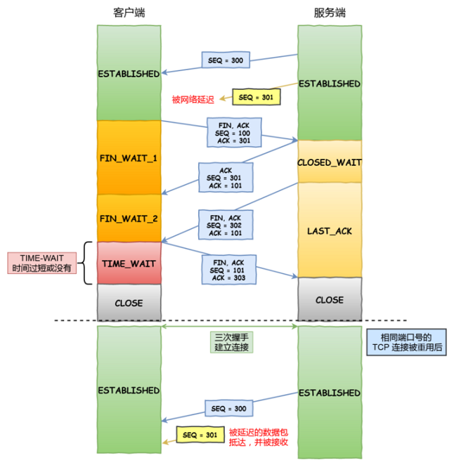

所以， TCP 就设计出了这么⼀个机制，经过 2MSL 这个时间， ⾜以让两个⽅向上的数据包都被丢弃，使得原来连接的数据包在⽹络中都⾃然消失，再出现的数据包⼀定都是新建⽴连接所产⽣的。  

保证连接正确关闭：  

TIME-WAIT 作⽤是等待⾜够的时间以确保最后的 ACK 能让被动关闭⽅接收，从⽽帮助其正常关闭。  

假设 TIME-WAIT 没有等待时间或时间过短：

- 客户端四次挥⼿的最后⼀个 ACK 报⽂如果在⽹络中被丢失了，此时如果客户端 TIME-WAIT 过短或没有，则就直接进⼊了 CLOSED 状态了，那么服务端则会⼀直处在 LASE_ACK 状态  
- 当客户端发起建⽴连接的 SYN 请求报⽂后，服务端会发送 RST 报⽂给客户端，连接建⽴的过程就会被终⽌  

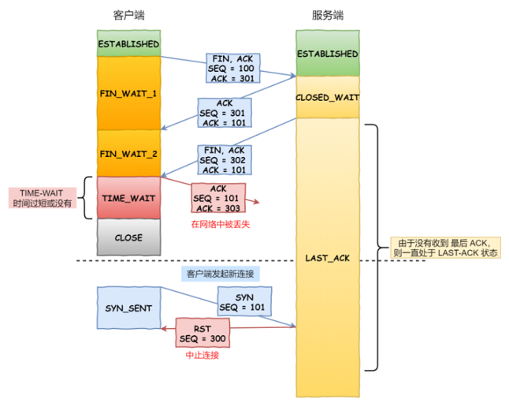

如果 TIME-WAIT 等待⾜够⻓的情况就会遇到两种情况：  

- 服务端正常收到四次挥⼿的最后⼀个 ACK 报⽂，则服务端正常关闭连接
- 服务端没有收到四次挥⼿的最后⼀个 ACK 报⽂时，则会重发 FIN 关闭连接报⽂并等待新的 ACK 报⽂  

所以客户端在 TIME-WAIT 状态等待 2MSL 时间后，就可以保证双⽅的连接都可以正常的关闭。  

TIME_WAIT 过多有什么危害：  

- 第⼀是内存资源占⽤  
- 第⼆是对端⼝资源的占⽤，⼀个 TCP 连接⾄少消耗⼀个本地端⼝  

第⼆个危害是会造成严重的后果的，如果发起连接⼀⽅的 TIME_WAIT 状态过多，占满了所有端⼝资源，则会导致⽆法创建新连接：

- 客户端受端⼝资源限制：客户端TIME_WAIT过多，就会导致端⼝资源被占⽤，因为端⼝就 65536 个，被占满就会导致⽆法创建新的连接
- 服务端受系统资源限制：由于⼀个四元组表示 TCP 连接，理论上服务端可以建⽴很多连接，服务端确实只监听⼀个端⼝，但是会把连接扔给处理线程，所以理论上监听的端⼝可以继续监听。但是线程池处理不了那么多⼀直不断的连接了。当服务端出现⼤量 TIME_WAIT 时，系统资源被占满时，会导致处理不过来新的连接    

优化 TIME_WAIT：  

优化 TIME-WAIT 的⼏个⽅式：  

- 打开 net.ipv4.tcp_tw_reuse 和 net.ipv4.tcp_timestamps 选项  
- net.ipv4.tcp_max_tw_buckets  
- 程序中使⽤ SO_LINGER ，应⽤强制使⽤ RST 关闭  

net.ipv4.tcp_tw_reuse 和 tcp_timestamps：

如下的 Linux 内核参数开启后，则可以复⽤处于 TIME_WAIT 的 socket 为新的连接所⽤：

```
net.ipv4.tcp_tw_reuse = 1  
```

tcp_tw_reuse 功能只能⽤客户端（连接发起⽅），因为开启了该功能，在调⽤ connect() 函数时，内核会随机找⼀个 time_wait 状态超过 1 秒的连接给新的连接复⽤。使⽤这个选项，还有⼀个前提，需要打开对 TCP 时间戳的⽀持，即：

```
net.ipv4.tcp_timestamps=1  #（默认即为 1）
```

这个时间戳的字段是在 TCP 头部的选项⾥，⽤于记录 TCP 发送⽅的当前时间戳和从对端接收到的最新时间戳。由于引⼊了时间戳，前⾯提到的 2MSL 问题就不复存在了，因为重复的数据包会因为时间戳过期被⾃然丢弃。

net.ipv4.tcp_max_tw_buckets：

这个值默认为 18000，当系统中处于 TIME_WAIT 的连接⼀旦超过这个值时，系统就会将后⾯的 TIME_WAIT 连接状态重置。这个⽅法过于暴⼒，⽽且治标不治本，带来的问题远⽐解决的问题多，不推荐使⽤。  

程序中使⽤ SO_LINGER：

可以通过设置 socket 选项，来设置调⽤ close 关闭连接⾏为：

```
struct linger so_linger;
so_linger.l_onoff = 1;
so_linger.l_linger = 0;
setsockopt(s, SOL_SOCKET, SO_LINGER, &so_linger,sizeof(so_linger));
```

如果 l_onoff 为⾮ 0， 且 l_linger 值为 0，那么调⽤ close 后，会⽴该发送⼀个 RST 标志给对端，该 TCP 连接将跳过四次挥⼿，也就跳过了 TIME_WAIT 状态，直接关闭。 但这为跨越 TIME_WAIT 状态提供了⼀个可能，不过是⼀个⾮常危险的⾏为，不值得提倡。   

## CLOSE_WAIT

服务器端收到客户端发送的 FIN 后，TCP 协议栈就会自动发送 ACK，接着进入 CLOSE_WAIT 状态。但是如果服务器端不执行 socket 的 close() 操作，那么就没法进入LAST_ACK，导致大量连接处于 CLOSE_WAIT 状态。所以，如果服务器出现了大量 CLOSE_WAIT 状态，一般是程序 Bug，或者关闭 socket 不及时。

TIME_WAIT和CLOSE_WAIT的区别在哪?

- CLOSE_WAIT 是被动关闭形成的，当客户端发送 FIN 报文，服务端返回 ACK 报文后进入 CLOSE_WAIT
- TIME_WAIT 是主动关闭形成的，当第四次挥手完成后，客户端进入 TIME_WAIT 状态

# TCP 保活机制  

定义⼀个时间段，在这个时间段内，如果没有任何连接相关的活动， TCP 保活机制会开始作⽤，每隔⼀个时间间隔，发送⼀个探测报⽂，该探测报⽂包含的数据⾮常少，如果连续⼏个探测报⽂都没有得到响应，则认为当前的TCP 连接已经死亡，系统内核将错误信息通知给上层应⽤程序。  

在 Linux 内核可以有对应的参数可以设置保活时间、保活探测的次数、保活探测的时间间隔，以下都为默认值：  

```
net.ipv4.tcp_keepalive_time=7200
net.ipv4.tcp_keepalive_intvl=75
net.ipv4.tcp_keepalive_probes=9
```

- tcp_keepalive_time=7200：表示保活时间是 7200 秒（2⼩时），也就 2 ⼩时内如果没有任何连接相关的活动，则会启动保活机制  
- tcp_keepalive_intvl=75：表示每次检测间隔 75 秒  
- tcp_keepalive_probes=9：表示检测 9 次⽆响应，认为对⽅是不可达的，从⽽中断本次的连接  

也就是说在 Linux 系统中，最少需要经过 2 ⼩时 11 分 15 秒才可以发现⼀个死亡连接：


如果开启了 TCP 保活，需要考虑以下⼏种情况：  

- 第⼀种，对端程序是正常⼯作的。当 TCP 保活的探测报⽂发送给对端, 对端会正常响应，这样 TCP 保活时间会被重置，等待下⼀个 TCP 保活时间的到来  
- 第⼆种，对端程序崩溃并重启。当 TCP 保活的探测报⽂发送给对端后，对端是可以响应的，但由于没有该连接的有效信息，会产⽣⼀个 RST 报⽂，这样很快就会发现 TCP 连接已经被重置
- 第三种，对端程序崩溃，或对端由于其他原因导致报⽂不可达。当 TCP 保活的探测报⽂发送给对端后，⽯沉⼤海，没有响应，连续⼏次，达到保活探测次数后， TCP 会报告该 TCP 连接已经死亡  

# TCP 重传

在 TCP 中，当发送端的数据到达接收主机时，接收端主机会返回⼀个确认应答消息，表示已收到消息。TCP 针对数据包丢失的情况，会⽤重传机制解决：

- 超时重传
- 快速重传
- SACK
- D-SACK  

## 超时重传  

重传机制的其中⼀个⽅式，就是在发送数据时，设定⼀个定时器，当超过指定的时间后，没有收到对⽅的 ACK 确认应答报⽂，就会重发该数据，也就是我们常说的超时重传。TCP 会在以下两种情况发⽣超时重传：

- 数据包丢失
- 确认应答丢失  

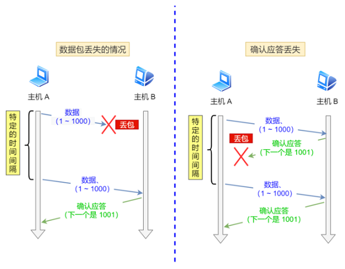

RTT （Round-Trip Time 往返时延），就是数据从⽹络⼀端传送到另⼀端所需的时间，也就是包的往返时间：


超时重传时间是以 RTO （Retransmission Timeout 超时重传时间）表示，假设在重传的情况下，超时时间 RTO 较⻓或较短时：

- 当超时时间 RTO 较⼤时，重发就慢，丢了⽼半天才重发，没有效率，性能差  
- 当超时时间 RTO 较⼩时，会导致可能并没有丢就重发，于是重发的就快，会增加⽹络拥塞，导致更多的超时，更多的超时导致更多的重发  

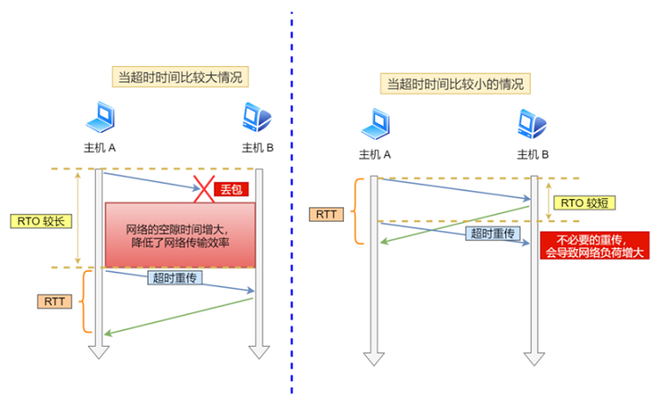

超时重传时间 RTO 的值应该略⼤于报⽂往返 RTT 的值：


在发送端发包时记下 t0 ，然后接收端再把这个 ack 回来时再记⼀个 t1 ，于是 RTT = t1 – t0 。没那么简单， 这只是⼀个采样，不能代表普遍情况。实际上报⽂往返 RTT 的值是经常变化的，因为我们的⽹络也是时常变化的。也就因为报⽂往返 RTT 的值是经常波动变化的，所以超时重传时间 RTO 的值应该是⼀个动态变化的值。  

Linux 计算 RTO，估计往返时间，通常需要采样以下两个  ：

- 需要 TCP 通过采样 RTT 的时间，然后进⾏加权平均，算出⼀个平滑 RTT 的值，⽽且这个值还是要不断变化的，因为⽹络状况不断地变化
- 除了采样 RTT，还要采样 RTT 的波动范围，这样就避免如果 RTT 有⼀个⼤的波动的话，很难被发现的情况  

RFC6289 建议使⽤以下的公式计算 RTO： 

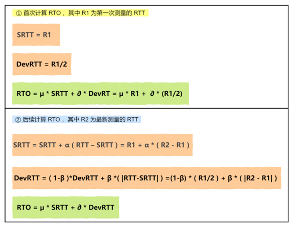

其中 SRTT 是计算平滑的 RTT ， DevRTR 是计算平滑的 RTT 与 最新 RTT 的差距。 在 Linux 下：

```
 α = 0.125， β = 0.25， μ = 1， ∂ = 4
```

如果超时重发的数据，再次超时的时候，⼜需要重传的时候， TCP 的策略是超时间隔加倍。也就是每当遇到⼀次超时重传的时候，都会将下⼀次超时时间间隔设为先前值的两倍。两次超时，就说明⽹络环境差，不宜频繁反复发送。  

超时触发重传存在的问题是，超时周期可能相对较⻓。 于是就可以⽤快速重传机制来解决超时重发的时间等待。 

## 快速重传  

TCP 还有另外⼀种快速重传（Fast Retransmit）机制，它不以时间为驱动，⽽是以数据驱动重传，快速重传的⼯作⽅式是当收到三个相同的 ACK 报⽂时，会在定时器过期之前，重传丢失的报⽂段。


- 第⼀份 Seq1 先送到了，于是就 Ack 回 2  
- 结果 Seq2 因为某些原因没收到， Seq3 到达了，于是还是 Ack 回 2  
- 后⾯的 Seq4 和 Seq5 都到了，但还是 Ack 回 2，因为 Seq2 还是没有收到  
- 发送端收到了三个 Ack = 2 的确认，知道了 Seq2 还没有收到，就会在定时器过期之前，重传丢失的 Seq2  
- 最后，收到了 Seq2，此时因为 Seq3， Seq4， Seq5 都收到了，于是 Ack 回 6  

快速重传机制只解决了⼀个问题，就是超时时间的问题，但是它依然⾯临着另外⼀个问题。就是重传的时候，是重传之前的⼀个，还是重传所有的问题。  

⽐如对于上⾯的例⼦，是重传 Seq2 呢？还是重传 Seq2、 Seq3、 Seq4、 Seq5 呢？因为发送端并不清楚这连续的三个 Ack 2 是谁传回来的。根据 TCP 不同的实现，以上两种情况都是有可能的。可⻅，这是⼀把双刃剑。 为了解决不知道该重传哪些 TCP 报⽂，于是就有 SACK ⽅法。     

## SACK ⽅法  

SACK（Selective Acknowledgment 选择性确认）。 这种⽅式需要在 TCP 头部选项字段⾥加⼀个 SACK 的东⻄，它可以将缓存的地图发送给发送⽅，这样发送⽅就可以知道哪些数据收到了，哪些数据没收到，知道了这些信息，就可以只重传丢失的数据。  

如下图，发送⽅收到了三次同样的 ACK 确认报⽂，于是就会触发快速重发机制，通过 SACK 信息发现只有 200~299 这段数据丢失，则重发时，就只选择了这个 TCP 段进⾏重复。  


如果要⽀持 SACK ，必须双⽅都要⽀持。在 Linux 下，可以通过 net.ipv4.tcp_sack 参数打开这个功能（Linux 2.4 后默认打开）。

## D-SACK  

Duplicate SACK ⼜称 D-SACK ，其主要使⽤了 SACK 来告诉发送⽅有哪些数据被重复接收了。  

ACK 丢包：

- 接收⽅发给发送⽅的两个 ACK 确认应答都丢失了，所以发送⽅超时后，重传第⼀个数据包（3000 ~ 3499）  
- 于是接收⽅发现数据是重复收到的，于是回了⼀个 SACK = 3000~3500，告诉发送⽅ 3000~3500 的数据早已被接收了，因为 ACK 都到了 4000 了，已经意味着 4000 之前的所有数据都已收到，所以这个 SACK 就代表着 D-SACK  
- 这样发送⽅就知道了，数据没有丢，是接收⽅的 ACK 确认报⽂丢了  

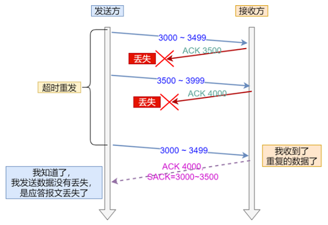

⽹络延时：

- 数据包（1000~1499）被⽹络延迟了，导致发送⽅没有收到 Ack 1500 的确认报⽂  
- 后⾯报⽂到达的三个相同的 ACK 确认报⽂，就触发了快速重传机制，但是在重传后，被延迟的数据包（1000~1499）⼜到了接收⽅  
- 所以接收⽅回了⼀个 SACK=1000~1500，因为 ACK 已经到了 3000，所以这个 SACK 是 D-SACK，表示收到了重复的包 
- 这样发送⽅就知道快速重传触发的原因不是发出去的包丢了，也不是因为回应的 ACK 包丢了，⽽是因为⽹络延迟了  


可⻅， D-SACK 有这么⼏个好处：

- 可以让发送⽅知道，是发出去的包丢了，还是接收⽅回应的 ACK 包丢了
- 可以知道是不是发送⽅的数据包被⽹络延迟了
- 可以知道⽹络中是不是把发送⽅的数据包给复制了

在 Linux 下可以通过 net.ipv4.tcp_dsack 参数开启/关闭这个功能（Linux 2.4 后默认打开）。  

# Nagle 算法与延迟确认

如果发送方疯狂地向接收方发送很小的数据包，比如一次就发送 1 个字节，那么显然会有问题。TCP/IP 协议中，无论发送多少数据，总是需要在数据前面加上协议头，同时，对方接收到数据，也需要发送 ACK 表示确认。为了尽可能的利用网络带宽，TCP 总是希望尽可能的发送足够大的数据。Nagle 算法就是为了尽可能发送大块数据，避免网络中充斥着许多小数据块。

Nagle 算法：任意时刻，最多只能有一个未被确认的小段。所谓“小段”，指的是小于MSS尺寸的数据块，所谓“未被确认”，是指一个数据块发送出去后，没有收到对方发送的ACK确认该数据已收到。

Nagle 算法的实现规则：

- 如果包长度达到 MSS，则允许发送
- 如果该包含有 FIN，则允许发送
- 设置了 TCP_NODELAY 选项，则允许发送
- 未设置 TCP_CORK 选项时，若所有发出去的小数据包（包长度小于MSS）均被确认，则允许发送
- 上述条件都未满足，但发生了超时（一般为200ms），则立即发送

延迟确认：

接收方收到数据包后，如果暂时没有数据要发给对端，它可以等一小段时间，再确认（Linux上默认是40ms）。如果这段时间刚好有数据要传给对端，ACK 就随着数据传输，而不需要单独发送一次 ACK。如果超过时间还没有数据要发送，也发送 ACK，避免对端以为丢包。

但是有些场景不能用延迟确认，比如发现了乱序包、接收到了大于一个 frame 的报文，且需要调整窗口大小等。

一般情况下，Nagle算法和延迟确认不能一起使用，Nagle算法意味着延迟发，延迟确认意味着延迟接收，酱紫就会造成更大的延迟，会产生性能问题。

# TCP 的重传机制

超时重传：

超时重传是 TCP 协议保证数据可靠性的另一个重要机制，其原理是在发送某一个数据以后就开启一个计时器，在一定时间内如果没有得到发送的数据报的 ACK 报文，那么就重新发送数据，直到发送成功为止。


RTT 就是数据完全发送完，到收到确认信号的时间，即数据包的一次往返时间。超时重传时间，就是 RTO（Retransmission Timeout)：

- 如果 RTO 设置很大，等了很久都没重发，这样肯定就不行
- 如果 RTO 设置很小，那很可能数据都没有丢失，就开始重发了，这会导致网络阻塞，从而恶性循环，导致更多的超时出现。

一般来说，RTO 略微大于 RTT，效果是最佳的。其实，RTO 有个标准方法的计算公式，也叫 Jacobson/Karels 算法。

超时重传的问题：

- 当一个报文丢失时，会等待一定的超时周期，才重传分组，增加了端到端的时延
- 当一个报文丢失时，在其等待超时的过程中，可能会出现这种情况：其后的报文段已经被接收端接收但却迟迟得不到确认，发送端会认为也丢失了，从而引起不必要的重传，既浪费资源也浪费时间
- 对于 TCP，如果发生一次超时重传，时间间隔下次就会加倍

快速重传：

快速重传不以时间驱动，而是以数据驱动。它是基于接收端的反馈信息来引发重传的。快速重传流程如下：


发送方发送了 1，2，3，4，5，6 份数据：

- 第一份 Seq=1 先送到了，于是就 Ack回2
- 第二份 Seq=2 也送到了，于是ACK回3
- 第三份 Seq=3 由于网络等某些原因，没送到
- 第四份 Seq=4 送到了，但是由于 Seq=3 没收到。因此 ACK 还是回3
- 后面的 Seq=5，6的也送到了，ACK 还是回复3，因为 Seq=3 没有收到
- 发送方连着收到三个重复冗余 ACK=3 的确认（其实是4个哈，但是因为前面的一个是正常的ACK，后面三个才是重复冗余的），于是知道哪个报文段在传输过程中丢失了；发送方在定时器过期之前，重传该报文段
- 最后，接收方收到了 Seq=3，此时因为 Seq=4，5，6都收到了，于是它回 ACK=7

快速重传也可能有问题：ACK只向告知发送方，最大的有序报文段。到底是哪个报文丢失了呢？并不确定！那到底该重传多少个包呢？是重传 Seq=3 ？还是重传 Seq=3、Seq=4、Seq=5、Seq=6 呢？因为发送端并不清楚这三个连续的 ACK=3 是谁传回来的。

带选择确认的重传（SACK）：

SACK 机制就是，在快速重传的基础上，接收方返回最近收到报文段的序列号范围，这样发送方就知道接收方哪些数据包是没收到的。这样就很清楚应该重传哪些数据包啦。


如上图中，发送方收到了三次同样的 ACK=30 的确认报文，于是就会触发快速重发机制，通过 SACK 信息发现只有 30~39 这段数据丢失，于是重发时，就只选择了这个 30~39 的 TCP 报文段进行重发。

重复SACK（D-SACK）：

D-SACK，Duplicate SACK，是在 SACK 的基础上做了一些扩展，主要用来告诉发送方，有哪些数据包，自己重复接受了。DSACK 的目的是帮助发送方判断，是否发生了包失序、ACK 丢失、包重复或伪重传。让 TCP 可以更好的做网络流控。


# TCP 的粘包和拆包

TCP 是面向流，没有界限的一串数据。TCP 底层并不了解上层业务数据的具体含义，它会根据 TCP 缓冲区的实际情况进行包的划分，所以在业务上认为，一个完整的包可能会被 TCP 拆分成多个包进行发送，也有可能把多个小的包封装成一个大的数据包发送，这就是所谓的 TCP 粘包和拆包问题。


为什么会产生粘包和拆包呢?

- 要发送的数据小于 TCP 发送缓冲区的大小，TCP 将多次写入缓冲区的数据一次发送出去，将会发生粘包
- 接收数据端的应用层没有及时读取接收缓冲区中的数据，将发生粘包
- 要发送的数据大于 TCP 发送缓冲区剩余空间大小，将会发生拆包
- 待发送数据大于 MSS（最大报文长度），TCP 在传输前将进行拆包。即 TCP 报文长度 - TCP头部长度 > MSS。

解决方案：

- 发送端将每个数据包封装为固定长度
- 在数据尾部增加特殊字符进行分割
- 将数据分为两部分，一部分是头部

# TCP 的流量控制

发送端不能疯狂地向接收端发送数据，因为接收端接收不过来的话，接收方只能把处理不过来的数据存在缓存区里。如果缓存区都满了，发送方还在疯狂发送数据的话，接收方只能把收到的数据包丢掉，这就浪费了网络资源啦。

TCP 提供一种机制可以让发送端根据接收端的实际接收能力控制发送的数据量，这就是流量控制。

TCP 通过滑动窗口来控制流量。首先双方三次握手，初始化各自的窗口大小，均为 400 个字节：


- 假如当前发送方给接收方发送了200个字节，那么，发送方的`SND.NXT`会右移200个字节，也就是说当前的可用窗口减少了200 个字节
- 接受方收到后，放到缓冲队列里面，REV.WND =400-200=200字节，所以win=200字节返回给发送方。接收方会在 ACK 的报文首部带上缩小后的滑动窗口200字节
- 发送方又发送200字节过来，200字节到达，继续放到缓冲队列。不过这时候，由于大量负载的原因，接受方处理不了这么多字节，只能处理100字节，剩余的100字节继续放到缓冲队列。这时候，REV.WND = 400-200-100=100字节，即win=100返回发送方
- 发送方继续干活，发送100字节过来，这时候，接受窗口win变为0
- 发送方停止发送，开启一个定时任务，每隔一段时间，就去询问接受方，直到win大于0，才继续开始发送


# 半连接队列和 SYN Flood 攻击

TCP进入三次握手前，服务端会从 CLOSED 状态变为 LISTEN 状态,同时在内部创建了两个队列：半连接队列（SYN队列）和全连接队列（ACCEPT队列）。

- TCP 三次握手时，客户端发送SYN到服务端，服务端收到之后，便回复 ACK 和 SYN，状态由 LISTEN 变为 SYN_RCVD，此时这个连接就被推入了 SYN 队列，即半连接队列。
- 当客户端回复 ACK，服务端接收后，三次握手就完成了。这时连接会等待被具体的应用取走，在被取走之前，它被推入 ACCEPT 队列，即全连接队列

SYN Flood：

SYN Flood 是一种典型的 DDos 攻击，它在短时间内，伪造不存在的 IP 地址，向服务器大量发起 SYN 报文。当服务器回复 SYN+ACK 报文后，不会收到 ACK 回应报文，导致服务器上建立大量的半连接半连接队列满了，这就无法处理正常的 TCP 请求啦。

解决办法：

- syn cookie：在收到 SYN 包后，服务器根据一定的方法，以数据包的源地址、端口等信息为参数计算出一个 cookie 值作为自己的SYN+ACK 包的序列号，回复 SYN+ACK 后，服务器并不立即分配资源进行处理，等收到发送方的 ACK 包后，重新根据数据包的源地址、端口计算该包中的确认序列号是否正确，如果正确则建立连接，否则丢弃该包
- SYN Proxy 防火墙：服务器防火墙会对收到的每一个 SYN 报文进行代理和回应，并保持半连接。等发送方将 ACK 包返回后，再重新构造 SYN 包发到服务器，建立真正的 TCP 连接

# TCP 的滑动窗口

TCP 发送一个数据，如果需要收到确认应答，才会发送下一个数据。这样的话就会有个缺点：效率会比较低。为了解决这个问题，TCP引入了窗口，它是操作系统开辟的一个缓存空间。窗口大小值表示无需等待确认应答，而可以继续发送数据的最大值。

TCP 头部有个字段叫win，也即那个 16 位的窗口大小，它告诉对方本端的TCP接收缓冲区还能容纳多少字节的数据，这样对方就可以控制发送数据的速度，从而达到流量控制的目的。

通俗点讲，就是接受方每次收到数据包，在发送确认报文的时候，同时告诉发送方，自己的缓存区还有多少空余空间，缓冲区的空余空间，我们就称之为接受窗口大小。这就是 win。

TCP 滑动窗口分为两种: 发送窗口和接收窗口。发送端的滑动窗口包含四大部分，如下：

- 已发送且已收到ACK确认
- 已发送但未收到ACK确认
- 未发送但可以发送
- 未发送也不可以发送


- SND.WND: 表示发送窗口的大小,上图虚线框的格子数是14个，即发送窗口大小是14
- SND.NXT：下一个发送的位置，它指向未发送但可以发送的第一个字节的序列号
- SND.UNA: 一个绝对指针，它指向的是已发送但未确认的第一个字节的序列号

接收方的滑动窗口包含三大部分，如下：

- 已成功接收并确认
- 未收到数据但可以接收
- 未收到数据并不可以接收的数据


- REV.WND: 表示接收窗口的大小,上图虚线框的格子就是9个
- REV.NXT:下一个接收的位置，它指向未收到但可以接收的第一个字节的序列号

#  TCP 的拥塞控制

拥塞控制是作用于网络的，防止过多的数据包注入到网络中，避免出现网络负载过大的情况。它的目标主要是最大化利用网络上瓶颈链路的带宽。它跟流量控制又有什么区别呢？流量控制是作用于接收者的，根据接收端的实际接收能力控制发送速度，防止分组丢失的。

发送方维护一个拥塞窗口cwnd（congestion window）的变量，它大小代表着网络的拥塞程度，并且是动态变化的。

拥塞控制的基本思路：只要网络中没有出现拥塞，拥塞窗口的值就可以再增大一些，以便把更多的数据包发送出去，但只要网络出现拥塞，拥塞窗口的值就应该减小一些，以减少注入到网络中的数据包数。

实际上，拥塞控制主要有这几种常用算法：

- 慢启动
- 拥塞避免
- 拥塞发生
- 快速恢复

慢启动算法：

慢启动算法，表面意思就是，它表示 TCP 建立连接完成后，一开始不要发送大量的数据，而是先探测一下网络的拥塞程度。由小到大逐渐增加拥塞窗口的大小，如果没有出现丢包，每收到一个 ACK，就将拥塞窗口 cwnd 大小就加1（单位是MSS）。每轮次发送窗口增加一倍，呈指数增长，如果出现丢包，拥塞窗口就减半，进入拥塞避免阶段。

- TCP连接完成，初始化 cwnd = 1，表明可以传一个 MSS 单位大小的数据
- 每当收到一个 ACK，cwnd 就加 1
- 每当过了一个RTT，cwnd 就增加一倍，呈指数让升


为了防止 cwnd 增长过大引起网络拥塞，还需设置一个慢启动阀值 ssthresh（slow start threshold）状态变量。当`cwnd`到达该阀值后，即当 cwnd >ssthresh 时，进入了拥塞避免算法。

拥塞避免算法：

一般来说，慢启动阀值 ssthresh 是65535字节，`cwnd`到达慢启动阀值后：

- 每收到一个ACK时，cwnd = cwnd + 1/cwnd
- 当每过一个RTT时，cwnd = cwnd + 1

显然这是一个线性上升的算法，避免过快导致网络拥塞问题。


拥塞发生：

当网络拥塞发生丢包时，会有两种情况：

- RTO 超时重传
- 快速重传

如果是发生了 RTO 超时重传，就会使用拥塞发生算法

- 慢启动阀值 sshthresh =  cwnd /2
- cwnd 重置为 1
- 进入新的慢启动过程

其实还有更好的处理方式，就是快速重传。发送方收到3个连续重复的ACK时，就会快速地重传，不必等待 RTO超时再重传：


慢启动阀值ssthresh 和 cwnd 变化如下：

- 拥塞窗口大小 cwnd = cwnd/2
- 慢启动阀值 ssthresh = cwnd
- 进入快速恢复算法

快速恢复：

快速重传和快速恢复算法一般同时使用。快速恢复算法认为，还有 3 个重复 ACK 收到，说明网络也没那么糟糕，所以没有必要像 RTO 超时那么强烈。

正如前面所说，进入快速恢复之前，cwnd 和 sshthresh已被更新：

- cwnd = cwnd /2
- sshthresh = cwnd

然后，真正的快速算法如下：

- cwnd = sshthresh  + 3
- 重传重复的那几个ACK（即丢失的那几个数据包）
- 如果再收到重复的 ACK，那么 cwnd = cwnd +1
- 如果收到新数据的 ACK 后, cwnd = sshthresh。因为收到新数据的 ACK，表明恢复过程已经结束，可以再次进入了拥塞避免的算法了


