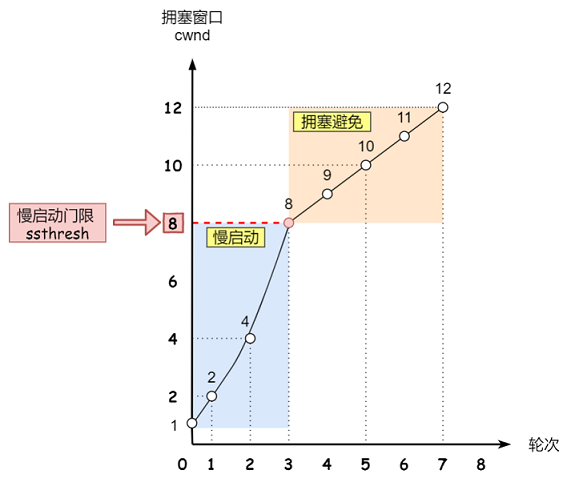
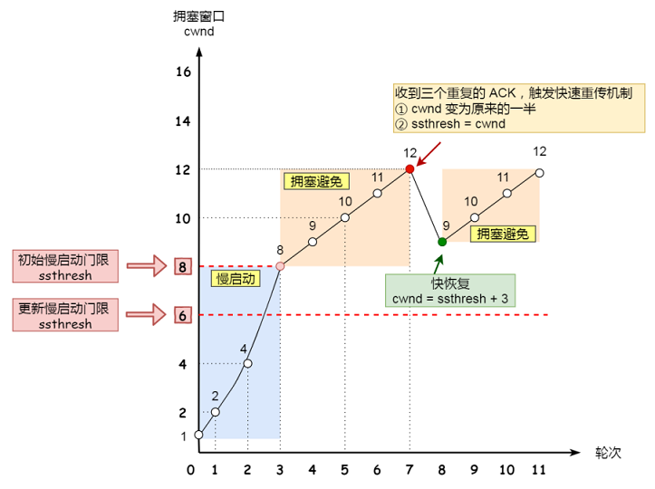

# TCP 和 UDP

区别：

常见应用层协议：

基于 TCP 的应用层协议有：HTTP、FTP、SMTP、TELNET、SSH

- HTTP：HyperText Transfer Protocol（超文本传输协议），默认端口80
- FTP: File Transfer Protocol (文件传输协议)，默认端口(20用于传输数据，21用于传输控制信息)
- SMTP: Simple Mail Transfer Protocol (简单邮件传输协议) ,默认端口25
- TELNET: Teletype over the Network (网络电传)，默认端口23
- SSH：Secure Shell（安全外壳协议），默认端口 22

基于 UDP 的应用层协议：DNS、TFTP、SNMP

- DNS : Domain Name Service (域名服务),默认端口 53
- TFTP: Trivial File Transfer Protocol (简单文件传输协议)，默认端口 69
- SNMP：Simple Network Management Protocol（简单网络管理协议），通过 UDP 端口 161 接收，只有 Trap 信息采用 UDP 端口162

# TCP 是如何确保可靠性呢

- 连接和断开的可靠性，TCP的连接是基于三次握手，而断开则是基于四次挥手。确保连接和断开的可靠性
- 有状态，TCP会记录哪些数据发送了，哪些数据被接收了，哪些没有被接受，并且保证数据包按序到达，保证数据传输不出差错
- 可控制，它有数据包校验、ACK应答、超时重传(发送方)、失序数据重传（接收方）、丢弃重复数据、流量控制（滑动窗口）和拥塞控制等机制

# TCP 报文首部

- 16 位端口号：源端口号，主机该报文段是来自哪里；目标端口号，要传给哪个上层协议或应用程序
- 32 位序号：一次TCP通信（从TCP连接建立到断开）过程中某一个传输方向上的字节流的每个字节的编号
- 32 位确认号：用作对另一方发送的 tcp 报文段的响应。其值是收到的TCP报文段的序号值加 1
- 4 位头部长度：表示tcp头部有多少个 32bit字（4字节）。因为4位最大能标识 15，所以 TCP 头部最长是 60 字节
- 6 位标志位：URG (紧急指针是否有效)，ACK（表示确认号是否有效），PSH（缓冲区尚未填满），RST（表示要求对方重新建立连接），SYN（建立连接消息标志接），FIN（表示告知对方本端要关闭连接了）
- 16 位窗口大小：是 TCP 流量控制的一个手段。这里说的窗口，指的是接收通告窗口。它告诉对方本端的TCP接收缓冲区还能容纳多少字节的数据，这样对方就可以控制发送数据的速度
- 16 位校验和：由发送端填充，接收端对 TCP 报文段执行 CRC 算法以检验 TCP 报文段在传输过程中是否损坏。注意，这个校验不仅包括 TCP 头部，也包括数据部分。这也是 TCP 可靠传输的一个重要保障
- 16 位紧急指针：一个正的偏移量。它和序号字段的值相加表示最后一个紧急数据的下一字节的序号。因此，确切地说，这个字段是紧急指针相对当前序号的偏移，不妨称之为紧急偏移。TCP 的紧急指针是发送端向接收端发送紧急数据的方法

# TCP 的三次握手

- 第一次握手(SYN=1, seq=x)，发送完毕后，客户端就进入SYN_SEND 状态
- 第二次握手(SYN=1, ACK=1, seq=y, ACKnum=x+1)， 发送完毕后，服务器端就进入SYN_RCV 状态
- 第三次握手(ACK=1，ACKnum=y+1)，发送完毕后，客户端进入 ESTABLISHED 状态，当服务器端接收到这个包时，也进入ESTABLISHED 状态

为什么不能是两次？不能是四次？

# TCP 四次挥手

- 第一次挥手(FIN=1，seq=u)，发送完毕后，客户端进入 FIN_WAIT_1 状态
- 第二次挥手(ACK=1，ack=u+1,seq =v)，发送完毕后，服务器端进入 CLOSE_WAIT 状态，客户端接收到这个确认包之后，进入 FIN_WAIT_2 状态
- 第三次挥手(FIN=1，ACK1,seq=w,ack=u+1)，发送完毕后，服务器端进入 LAST_ACK 状态，等待来自客户端的最后一个 ACK
- 第四次挥手(ACK=1，seq=u+1,ack=w+1)，客户端接收到来自服务器端的关闭请求，发送一个确认包，并进入 TIME_WAIT 状态，等待了某个固定时间（两个最大段生命周期，2MSL，2 Maximum Segment Lifetime）之后，没有收到服务器端的 ACK ，认为服务器端已经正常关闭连接，于是自己也关闭连接，进入 CLOSED 状态。服务器端接收到这个确认包之后，关闭连接，进入 CLOSED 状态

为什么需要四次呢？

Time-Wait 状态：

- 为了保证客户端发送的最后一个 ACK 报文段能够到达服务端。这个 ACK 报文段有可能丢失，因而使处在 LAST-ACK 状态的服务端就收不到对已发送的 FIN + ACK 报文段的确认。服务端会超时重传这个 FIN+ACK 报文段，而客户端就能在 2MSL 时间内收到这个重传的 FIN+ACK 报文段。接着客户端重传一次确认，重新启动 2MSL 计时器。最后，客户端和服务器都正常进入到 CLOSED状态
- 防止已失效的连接请求报文段出现在本连接中。客户端在发送完最后一个 ACK 报文段后，再经过时间 2MSL，就可以使本连接持续的时间内所产生的所有报文段都从网络中消失。这样就可以使下一个连接中不会出现这种旧的连接请求报文段

# Nagle 算法与延迟确认

如果发送方疯狂地向接收方发送很小的数据包，比如一次就发送 1 个字节，那么显然会有问题。TCP/IP 协议中，无论发送多少数据，总是需要在数据前面加上协议头，同时，对方接收到数据，也需要发送 ACK 表示确认。为了尽可能的利用网络带宽，TCP 总是希望尽可能的发送足够大的数据。Nagle 算法就是为了尽可能发送大块数据，避免网络中充斥着许多小数据块。

Nagle 算法：任意时刻，最多只能有一个未被确认的小段。所谓“小段”，指的是小于MSS尺寸的数据块，所谓“未被确认”，是指一个数据块发送出去后，没有收到对方发送的ACK确认该数据已收到。

Nagle 算法的实现规则：

- 如果包长度达到 MSS，则允许发送
- 如果该包含有 FIN，则允许发送
- 设置了 TCP_NODELAY 选项，则允许发送
- 未设置 TCP_CORK 选项时，若所有发出去的小数据包（包长度小于MSS）均被确认，则允许发送
- 上述条件都未满足，但发生了超时（一般为200ms），则立即发送

延迟确认：

接收方收到数据包后，如果暂时没有数据要发给对端，它可以等一小段时间，再确认（Linux上默认是40ms）。如果这段时间刚好有数据要传给对端，ACK 就随着数据传输，而不需要单独发送一次 ACK。如果超过时间还没有数据要发送，也发送 ACK，避免对端以为丢包。

但是有些场景不能用延迟确认，比如发现了乱序包、接收到了大于一个 frame 的报文，且需要调整窗口大小等。

一般情况下，Nagle算法和延迟确认不能一起使用，Nagle算法意味着延迟发，延迟确认意味着延迟接收，酱紫就会造成更大的延迟，会产生性能问题。

# TCP 的重传机制

超时重传：

超时重传是 TCP 协议保证数据可靠性的另一个重要机制，其原理是在发送某一个数据以后就开启一个计时器，在一定时间内如果没有得到发送的数据报的 ACK 报文，那么就重新发送数据，直到发送成功为止。

RTT 就是数据完全发送完，到收到确认信号的时间，即数据包的一次往返时间。超时重传时间，就是 RTO（Retransmission Timeout)：

- 如果 RTO 设置很大，等了很久都没重发，这样肯定就不行
- 如果 RTO 设置很小，那很可能数据都没有丢失，就开始重发了，这会导致网络阻塞，从而恶性循环，导致更多的超时出现。

一般来说，RTO 略微大于 RTT，效果是最佳的。其实，RTO 有个标准方法的计算公式，也叫 Jacobson/Karels 算法。

超时重传的问题：

- 当一个报文丢失时，会等待一定的超时周期，才重传分组，增加了端到端的时延
- 当一个报文丢失时，在其等待超时的过程中，可能会出现这种情况：其后的报文段已经被接收端接收但却迟迟得不到确认，发送端会认为也丢失了，从而引起不必要的重传，既浪费资源也浪费时间
- 对于 TCP，如果发生一次超时重传，时间间隔下次就会加倍

快速重传：

快速重传不以时间驱动，而是以数据驱动。它是基于接收端的反馈信息来引发重传的。快速重传流程如下：

发送方发送了 1，2，3，4，5，6 份数据：

- 第一份 Seq=1 先送到了，于是就 Ack回2
- 第二份 Seq=2 也送到了，于是ACK回3
- 第三份 Seq=3 由于网络等某些原因，没送到
- 第四份 Seq=4 送到了，但是由于 Seq=3 没收到。因此 ACK 还是回3
- 后面的 Seq=5，6的也送到了，ACK 还是回复3，因为 Seq=3 没有收到
- 发送方连着收到三个重复冗余 ACK=3 的确认（其实是4个哈，但是因为前面的一个是正常的ACK，后面三个才是重复冗余的），于是知道哪个报文段在传输过程中丢失了；发送方在定时器过期之前，重传该报文段
- 最后，接收方收到了 Seq=3，此时因为 Seq=4，5，6都收到了，于是它回 ACK=7

快速重传也可能有问题：ACK只向告知发送方，最大的有序报文段。到底是哪个报文丢失了呢？并不确定！那到底该重传多少个包呢？是重传 Seq=3 ？还是重传 Seq=3、Seq=4、Seq=5、Seq=6 呢？因为发送端并不清楚这三个连续的 ACK=3 是谁传回来的。

带选择确认的重传（SACK）：

SACK 机制就是，在快速重传的基础上，接收方返回最近收到报文段的序列号范围，这样发送方就知道接收方哪些数据包是没收到的。这样就很清楚应该重传哪些数据包啦。

如上图中，发送方收到了三次同样的 ACK=30 的确认报文，于是就会触发快速重发机制，通过 SACK 信息发现只有 30~39 这段数据丢失，于是重发时，就只选择了这个 30~39 的 TCP 报文段进行重发。

重复SACK（D-SACK）：

D-SACK，Duplicate SACK，是在 SACK 的基础上做了一些扩展，主要用来告诉发送方，有哪些数据包，自己重复接受了。DSACK 的目的是帮助发送方判断，是否发生了包失序、ACK 丢失、包重复或伪重传。让 TCP 可以更好的做网络流控。

# TCP 的粘包和拆包

TCP 是面向流，没有界限的一串数据。TCP 底层并不了解上层业务数据的具体含义，它会根据 TCP 缓冲区的实际情况进行包的划分，所以在业务上认为，一个完整的包可能会被 TCP 拆分成多个包进行发送，也有可能把多个小的包封装成一个大的数据包发送，这就是所谓的 TCP 粘包和拆包问题。

为什么会产生粘包和拆包呢?

- 要发送的数据小于 TCP 发送缓冲区的大小，TCP 将多次写入缓冲区的数据一次发送出去，将会发生粘包
- 接收数据端的应用层没有及时读取接收缓冲区中的数据，将发生粘包
- 要发送的数据大于 TCP 发送缓冲区剩余空间大小，将会发生拆包
- 待发送数据大于 MSS（最大报文长度），TCP 在传输前将进行拆包。即 TCP 报文长度 - TCP头部长度 > MSS。

解决方案：

- 发送端将每个数据包封装为固定长度
- 在数据尾部增加特殊字符进行分割
- 将数据分为两部分，一部分是头部

# TCP 的流量控制

发送端不能疯狂地向接收端发送数据，因为接收端接收不过来的话，接收方只能把处理不过来的数据存在缓存区里。如果缓存区都满了，发送方还在疯狂发送数据的话，接收方只能把收到的数据包丢掉，这就浪费了网络资源啦。

TCP 提供一种机制可以让发送端根据接收端的实际接收能力控制发送的数据量，这就是流量控制。

TCP 通过滑动窗口来控制流量。首先双方三次握手，初始化各自的窗口大小，均为 400 个字节：

- 假如当前发送方给接收方发送了200个字节，那么，发送方的`SND.NXT`会右移200个字节，也就是说当前的可用窗口减少了200 个字节
- 接受方收到后，放到缓冲队列里面，REV.WND =400-200=200字节，所以win=200字节返回给发送方。接收方会在 ACK 的报文首部带上缩小后的滑动窗口200字节
- 发送方又发送200字节过来，200字节到达，继续放到缓冲队列。不过这时候，由于大量负载的原因，接受方处理不了这么多字节，只能处理100字节，剩余的100字节继续放到缓冲队列。这时候，REV.WND = 400-200-100=100字节，即win=100返回发送方
- 发送方继续干活，发送100字节过来，这时候，接受窗口win变为0
- 发送方停止发送，开启一个定时任务，每隔一段时间，就去询问接受方，直到win大于0，才继续开始发送

# 半连接队列和 SYN Flood 攻击

TCP进入三次握手前，服务端会从 CLOSED 状态变为 LISTEN 状态,同时在内部创建了两个队列：半连接队列（SYN队列）和全连接队列（ACCEPT队列）。

- TCP 三次握手时，客户端发送SYN到服务端，服务端收到之后，便回复 ACK 和 SYN，状态由 LISTEN 变为 SYN_RCVD，此时这个连接就被推入了 SYN 队列，即半连接队列。
- 当客户端回复 ACK，服务端接收后，三次握手就完成了。这时连接会等待被具体的应用取走，在被取走之前，它被推入 ACCEPT 队列，即全连接队列

SYN Flood：

SYN Flood 是一种典型的 DDos 攻击，它在短时间内，伪造不存在的 IP 地址，向服务器大量发起 SYN 报文。当服务器回复 SYN+ACK 报文后，不会收到 ACK 回应报文，导致服务器上建立大量的半连接半连接队列满了，这就无法处理正常的 TCP 请求啦。

解决办法：

- syn cookie：在收到 SYN 包后，服务器根据一定的方法，以数据包的源地址、端口等信息为参数计算出一个 cookie 值作为自己的SYN+ACK 包的序列号，回复 SYN+ACK 后，服务器并不立即分配资源进行处理，等收到发送方的 ACK 包后，重新根据数据包的源地址、端口计算该包中的确认序列号是否正确，如果正确则建立连接，否则丢弃该包
- SYN Proxy 防火墙：服务器防火墙会对收到的每一个 SYN 报文进行代理和回应，并保持半连接。等发送方将 ACK 包返回后，再重新构造 SYN 包发到服务器，建立真正的 TCP 连接

# TCP 的滑动窗口

TCP 发送一个数据，如果需要收到确认应答，才会发送下一个数据。这样的话就会有个缺点：效率会比较低。为了解决这个问题，TCP引入了窗口，它是操作系统开辟的一个缓存空间。窗口大小值表示无需等待确认应答，而可以继续发送数据的最大值。

TCP 头部有个字段叫win，也即那个 16 位的窗口大小，它告诉对方本端的TCP接收缓冲区还能容纳多少字节的数据，这样对方就可以控制发送数据的速度，从而达到流量控制的目的。

通俗点讲，就是接受方每次收到数据包，在发送确认报文的时候，同时告诉发送方，自己的缓存区还有多少空余空间，缓冲区的空余空间，我们就称之为接受窗口大小。这就是 win。

TCP 滑动窗口分为两种: 发送窗口和接收窗口。发送端的滑动窗口包含四大部分，如下：

- 已发送且已收到ACK确认
- 已发送但未收到ACK确认
- 未发送但可以发送
- 未发送也不可以发送

- SND.WND: 表示发送窗口的大小,上图虚线框的格子数是14个，即发送窗口大小是14
- SND.NXT：下一个发送的位置，它指向未发送但可以发送的第一个字节的序列号
- SND.UNA: 一个绝对指针，它指向的是已发送但未确认的第一个字节的序列号

接收方的滑动窗口包含三大部分，如下：

- 已成功接收并确认
- 未收到数据但可以接收
- 未收到数据并不可以接收的数据

- REV.WND: 表示接收窗口的大小,上图虚线框的格子就是9个
- REV.NXT:下一个接收的位置，它指向未收到但可以接收的第一个字节的序列号

#  TCP 的拥塞控制

拥塞控制是作用于网络的，防止过多的数据包注入到网络中，避免出现网络负载过大的情况。它的目标主要是最大化利用网络上瓶颈链路的带宽。它跟流量控制又有什么区别呢？流量控制是作用于接收者的，根据接收端的实际接收能力控制发送速度，防止分组丢失的。

发送方维护一个拥塞窗口cwnd（congestion window）的变量，它大小代表着网络的拥塞程度，并且是动态变化的。

拥塞控制的基本思路：只要网络中没有出现拥塞，拥塞窗口的值就可以再增大一些，以便把更多的数据包发送出去，但只要网络出现拥塞，拥塞窗口的值就应该减小一些，以减少注入到网络中的数据包数。

实际上，拥塞控制主要有这几种常用算法：

- 慢启动
- 拥塞避免
- 拥塞发生
- 快速恢复

慢启动算法：

慢启动算法，表面意思就是，它表示 TCP 建立连接完成后，一开始不要发送大量的数据，而是先探测一下网络的拥塞程度。由小到大逐渐增加拥塞窗口的大小，如果没有出现丢包，每收到一个 ACK，就将拥塞窗口 cwnd 大小就加1（单位是MSS）。每轮次发送窗口增加一倍，呈指数增长，如果出现丢包，拥塞窗口就减半，进入拥塞避免阶段。

- TCP连接完成，初始化 cwnd = 1，表明可以传一个 MSS 单位大小的数据
- 每当收到一个 ACK，cwnd 就加 1
- 每当过了一个RTT，cwnd 就增加一倍，呈指数让升

为了防止 cwnd 增长过大引起网络拥塞，还需设置一个慢启动阀值 ssthresh（slow start threshold）状态变量。当`cwnd`到达该阀值后，即当 cwnd >ssthresh 时，进入了拥塞避免算法。

拥塞避免算法：

一般来说，慢启动阀值 ssthresh 是65535字节，`cwnd`到达慢启动阀值后：

- 每收到一个ACK时，cwnd = cwnd + 1/cwnd
- 当每过一个RTT时，cwnd = cwnd + 1

显然这是一个线性上升的算法，避免过快导致网络拥塞问题。

拥塞发生：

当网络拥塞发生丢包时，会有两种情况：

- RTO 超时重传
- 快速重传

如果是发生了 RTO 超时重传，就会使用拥塞发生算法

- 慢启动阀值 sshthresh =  cwnd /2
- cwnd 重置为 1
- 进入新的慢启动过程

其实还有更好的处理方式，就是快速重传。发送方收到3个连续重复的ACK时，就会快速地重传，不必等待 RTO超时再重传：

慢启动阀值ssthresh 和 cwnd 变化如下：

- 拥塞窗口大小 cwnd = cwnd/2
- 慢启动阀值 ssthresh = cwnd
- 进入快速恢复算法

快速恢复：

快速重传和快速恢复算法一般同时使用。快速恢复算法认为，还有 3 个重复 ACK 收到，说明网络也没那么糟糕，所以没有必要像 RTO 超时那么强烈。

正如前面所说，进入快速恢复之前，cwnd 和 sshthresh已被更新：

- cwnd = cwnd /2
- sshthresh = cwnd

然后，真正的快速算法如下：

- cwnd = sshthresh  + 3
- 重传重复的那几个ACK（即丢失的那几个数据包）
- 如果再收到重复的 ACK，那么 cwnd = cwnd +1
- 如果收到新数据的 ACK 后, cwnd = sshthresh。因为收到新数据的 ACK，表明恢复过程已经结束，可以再次进入了拥塞避免的算法了

# 保活计时器

客户已主动与服务器建立了TCP连接。但后来客户端的主机突然发生故障。显然，服务器以后就不能再收到客户端发来的数据。因此，应当有措施使服务器不要再白白等待下去。这就需要使用保活计时器了。

服务器每收到一次客户的数据，就重新设置保活计时器，时间的设置通常是两个小时。若两个小时都没有收到客户端的数据，服务端就发送一个探测报文段，以后则每隔 75 秒钟发送一次。若连续发送 10 个探测报文段后仍然无客户端的响应，服务端就认为客户端出了故障，接着就关闭这个连接。

# 大量 CLOSE_WAIT 状态

服务器端收到客户端发送的 FIN 后，TCP协议栈就会自动发送 ACK，接着进入 CLOSE_WAIT状态。但是如果服务器端不执行socket的close()操作，那么就没法进入LAST_ACK,导致大量连接处于 CLOSE_WAIT 状态。所以，如果服务器出现了大量 CLOSE_WAIT 状态，一般是程序 Bug，或者关闭 socket 不及时。

