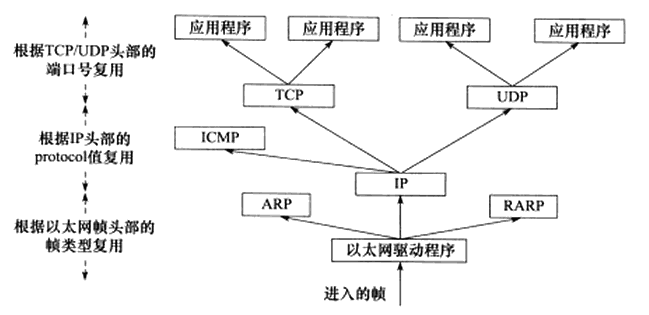
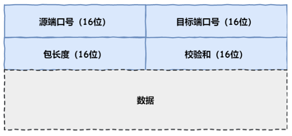
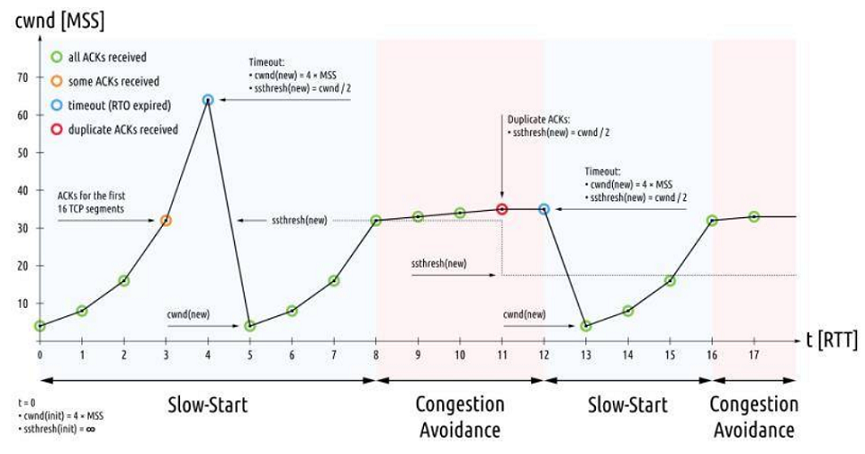
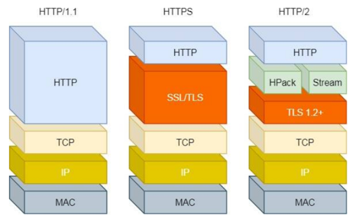
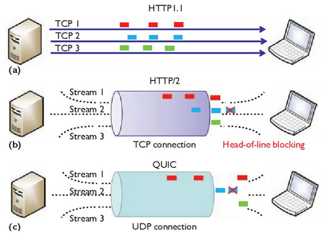
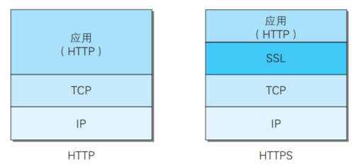
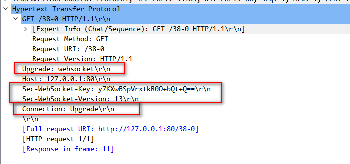
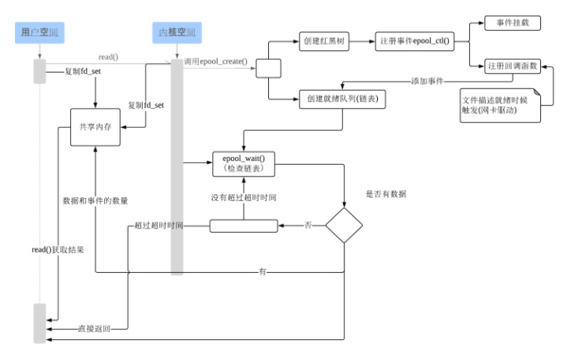

# 网络基础

## 网络体系结构

计算机网路体系结构呢，有三种：ISO 七层模型、TCP/IP 四层模型、五层体系结构


ISO 七层模型是国际标准化组织制定的一个用于计算机或通信系统间互联的标准体系。

- 应用层：网络服务与最终用户的一个接口
  - 常见的协议有：HTTP，FTP，SMTP，SNMP，DNS
- 表示层：数据的表示、安全、压缩。确保一个系统的应用层所发送的信息可以被另一个系统的应用层读取
- 会话层：建立、管理、终止会话
- 传输层：提供端到端的消息传递服务
  - 常见的协议有：TCP，FTP
- 网络层：进行逻辑地址寻址，实现不同网络之间的路径选择
  - 常见的协议有：ICMP，IGMP，IP
  - 常见设备：路由器
- 数据链路层：在物理层提供比特流服务的基础上，建立相邻结点之间的数据链路
  - 常见设备：网桥，二层交换机
- 物理层：建立、维护、断开物理连接
  - 常见设备：网线，网卡，集线器，中继器，调制解调器

各层对应的网络协议：


PDU（Protocol Data Unit）是指对等层次之间传递的数据单位：

- 物理层的 PDU 是数据位 (bit)
- 数据链路层的 PDU 是数据帧 (frame)
- 网络层的 PDU 是数据包 (packet)
- 传输层的 PDU 是数据段 (segment)
- 其他更高层次的PDU是数据（data）

## 常用网络设备

### 网卡

任一主机连接网络时，必须要使用网卡。可以是有线网卡，用来连接有线网络，也可以是无线网卡连接 WiFi 网络。每块网卡都有一个唯一的 MAC 地址，也叫做硬件地址或物理地址。

### 集线器


集线器工作在物理层。

交换机仅仅是无脑将电信号转发到所有出口（广播）,其他主机收到信息后，根据头部的目标 MAC 地址信息，判断这个数据包的确是发给自己的，于是便收下，如果不是发给自己的就丢弃。因此，在数据包头部需要有下面的结构：


集线器将信息发送给连接到集线器中的所有电脑，这样既不安全，又不节省网络资源。

### 二层交换机


二层交换机工作在数据链路层。

数据帧中有一个数据位叫做 FCS ，用以校验数据是否正确送达目的地。二层交换机通过检查这个值，将损坏的数据丢弃。

交换机内部维护一张 MAC 地址表，记录着每一个 MAC 地址的设备，连接在其哪一个端口上。数据包到达交换机时，交换机内部通过自己维护的 MAC 地址表，将数据包转发到指定的端口上。通过这样传输方式而组成的小范围的网络，叫做以太网。最开始的时候，MAC 地址表是空的，在收发数据包的过程中逐步建立。二层交换机根据 MAC 地址自学机制判断是否需要转发数据帧。

随着机器数量增多，端口不够用，此时可以将多个交换机连接起来：


上面那根红色的线，最终在 MAC 地址表中要把 ABCDEFGH 这8台机器与相应端口的映射全部记录在表中。

### 路由器


路由器工作在网络层。

路由器的每一个端口，都有独立的 MAC 地址。

路由器是在 OSI 模型的网络层上连接两个网络、并对报文进行转发的设备。二层交换机是根据 MAC 地址进行处理，而路由器 / 三层交换机则是根据 IP 地址进行处理的。 因此 TCP/IP 中网络层的地址就成为了 IP 地址。

路由器可以连接不同的数据链路。比如连接两个以太网，或者连接一个以太网与一个无线网。家庭里面常见的无线路由器也是路由器的一种。

为了划分网络，引入了IP 地址。现在每一台电脑，同时有自己的 MAC 地址，又有自己的 IP 地址，只不过 IP 地址是软件层面上的，可以随时修改，MAC 地址一般是无法修改的。现在两个设备之间传输，除了加上数据链路层的头部之外，还要再增加一个网络层的头部：


如果源 IP 与目的 IP 处于一个子网，直接将数据包通过交换机发出去。如果源 IP 与目的 IP 不处于一个子网，就交给路由器去处理。

判断是否在一个子网：将源 IP 与目的 IP 分别同这个子网掩码进行与运算，相等则是在一个子网，不相等就是在不同子网。

默认网关：就是在设备里配置的一个 IP 地址，以便在发给不同子网的机器时，发给这个 IP 地址。

路由器收到的数据包有目的 IP ，需要转化成从自己的哪个端口出去，此时需要依赖路由表。

如果不清楚 MAC 地址，就需要使用 ARP 协议，把 IP 地址对应的 MAC 地址找到，同时 设备中也会有 arp 缓存表，记录着 IP 与 MAC 地址的对应关系。

**ip 报文经过一个路由器改变哪些字段?**

源和目的的IP地址,源和目的的MAC地址以及TTL值。

**路由器和二层交换机的区别：**

- 工作层次不同：最初的的交换机是工作在数据链路层，而路由器一开始就设计工作在网络层
- 数据转发所依据的对象不同：交换机是利用物理地址或者说 MAC 地址来确定转发数据的目的地址。而路由器则是利用 IP 地址来确定数据转发的地址
- 传统的交换机只能分割冲突域，不能分割广播域；而路由器可以分割广播域：由交换机连接的网段仍属于同一个广播域，广播数据包会在交换机连接的所有网段上传播，在某些情况下会导致通信拥挤和安全漏洞。连接到路由器上的网段会被分配成不同的广播域，广播数据不会穿过路由器
- 路由器提供了防火墙的服务：路由器仅仅转发特定地址的数据包，不传送不支持路由协议的数据包传送和未知目标网络数据包的传送，从而可以防止广播风暴

**小结：**

三张表：


- 交换机中有 MAC 地址表用于映射 MAC 地址和它的端口，通过以太网内各节点之间不断通过交换机通信，不断完善起来的
- 路由器中有路由表用于映射 IP 地址(段)和它的端口，各种路由算法和人工配置逐步完善起来的
- 电脑和路由器中都有 arp 缓存表用于缓存 IP 和 MAC 地址的映射关系，不断通过 arp 协议的请求逐步完善起来的

一次完整的通讯过程：


- 首先 A（192.168.0.1）通过子网掩码（255.255.255.0）计算出自己与 F（192.168.2.2）并不在同一个子网内，于是决定发送给默认网关（192.168.0.254）
- A 通过 ARP 找到默认网关 192.168.0.254 的 MAC 地址
- A 将源 MAC 地址（AAAA）与网关 MAC 地址（ABAB）封装在数据链路层头部，又将源 IP 地址（192.168.0.1）和目的 IP 地址（192.168.2.2）（注意这里千万不要以为填写的是默认网关的 IP 地址，从始至终这个数据包的两个 IP 地址都是不变的，只有 MAC 地址在不断变化）封装在网络层头部，然后发包
- 交换机 1 收到数据包后，发现目标 MAC 地址是 ABAB，转发给路由器1
- 数据包来到了路由器 1，发现其目标 IP 地址是 192.168.2.2，查看其路由表，发现了下一跳的地址是 192.168.100.5
- 此时路由器 1 需要做两件事，第一件是再次匹配路由表，发现匹配到了端口为 2，于是将其封装到数据链路层，最后把包从 2 号口发出去
- 此时路由器 2 收到了数据包，看到其目的地址是 192.168.2.2，查询其路由表，匹配到端口号为 1，准备从 1 号口把数据包送出去
- 此时路由器 2 需要知道 192.168.2.2 的 MAC 地址了，于是查看其 arp 缓存，找到其 MAC 地址为 FFFF，封装在数据链路层头部，并从 1 号端口把包发出去
- 交换机 3 收到了数据包，发现目的 MAC 地址为 FFFF，查询其 MAC 地址表，发现应该从其 6 号端口出去，于是从 6 号端口把数据包发出去
- F 最终收到了数据包！并且发现目的 MAC 地址就是自己，于是收下了这个包

## 数据封装与解封装

### 封装

应用程序数据在发送到物理网络之前，将沿着协议栈从上到下依次传递，每层协议都将在上层数据的基础上加上自己的头部(尾部)信息，以实现该层的功能，这个过程称为封装。


TCP 报文段封装过程：


以太网帧封装过程：


### 分用

当帧到达目的主机时，将沿着协议族自底向上依次传递，各层协议依次处理帧中本层负责的头部数据，以获取所需的信息，并将最终处理后的帧交给应用程序。这个过程称为分用。



- 以太网帧使用 16 位 的类型字段来标识上层协议

  - 0x0800：IP 数据报

  - 0x0806：ARP 请求或应答报文

  - 0x0835：RARP 请求或应答报文
- IP 数据报头部采用 16 位的协议字段来区分协议
  - 17：UDP 用户数据报 
  - 6：TCP 传输控制 
- TCP 报文段和 UDP 报文段则是通过头部的 16 位的端口号来区分上层应用程序
  - 20：ftp 数据连接
  - 21：ftp 控制连接
  - 22：ssh，scp
  - 53：DNS
  - 23：telnet
  - 80：http
  - 443：https

## 负载均衡算法有哪些

多台服务器以对称的方式组成一个服务器集合，每台服务器都具有等价的地位，能互相分担负载：

- 轮询法：将请求按照顺序轮流的分配到服务器上。不能发挥某些高性能服务器的优势
- 随机法：随机获取一台，和轮询类似
- 哈希法：通过ip地址哈希化来确定要选择的服务器编号。好处是每次客户端访问的服务器都是同一个服务器，能很好地利用 session或者 cookie
- 加权轮询：根据服务器性能不同加权

# IP

## 常见端口及其服务


## IP 服务

⽹络层的主要作⽤是： 实现主机与主机之间的通信，也叫点对点通信。  

MAC （数据链路层）的作⽤则是实现直连的两个设备之间通信，⽽ IP（⽹络层） 则负责在没有直连的两个⽹络之间进⾏通信传输。  


IP协议功能：

- 寻址和路由；（根据对方的IP地址，寻找最佳路径传输信息）
- 传递服务：
  - 不可靠（IP协议只是尽自己最大努力去传输数据包），可靠性由上层协议提供（TCP协议）
  - 无状态：IP 通信双方不同步传输数据的状态信息，所有的 IP 数据报的发送，传输和接收都是相互独立，没有上下文关系的无法处理乱序和重复的 IP 数据报优点是简单、高效，内核中无需额外分配资源保存通信状态，也无须在每次传输时携带状态信息
  - 无连接（事先不建立会话），IP 通信双方不能长久的维持对方的任何信息，上层协议每次发送数据时，都必须明确指定对方的 IP 地址
  - 数据包的分片和重组

MAC 地址和 IP 地址：

信息传递时候，需要知道的其实是两个地址：终点地址、下一跳的地址。IP 地址本质上是终点地址，它在跳过路由器的时候不会改变，而 MAC 地址则是下一跳的地址，每跳过一次路由器都会改变，这就是为什么还要用 MAC 地址的原因之一，它起到了记录下一跳的信息的作用。

网络体系结构的分层模型：用 MAC 地址和 IP 地址两个地址，用于分别表示物理地址和逻辑地址是有好处的。这样分层可以使网络层与数据链路层的协议更灵活地替换。

对于同一个子网上的设备，IP 地址的前缀都是一样的，这样路由器通过 IP 地址的前缀就知道设备在在哪个子网上了，而只用 MAC 地址的话，路由器则需要记住每个 MAC 地址在哪个子网，这需要路由器有极大的存储空间，是无法实现的。

## IPv4

IP 地址（IPv4 地址）由 32 位正整数来表示， IP 地址在计算机是以⼆进制的⽅式处理的。为了⽅便记忆采⽤了点分⼗进制的标记⽅式：


IP 地址最⼤值也就是：2^32 ≈ 42 亿。

### IPv4 分类

IP 地址分类成了 5 种类型，分别是 A 类、 B 类、 C 类、 D 类、 E 类：


A、B、C 类主要分为两个部分，分别是⽹络号和主机号。

- 网络号：它标志主机所连接的网络地址表示属于互联网的哪一个网络
- 主机号：它标志主机地址表示其属于该网络中的哪一台主机

最⼤主机个数，就是要看主机号的位数，如 C 类地址的主机号占 8 位，那么 C 类地址的最⼤主机个数：2 ^ 8 - 2 = 254。

这是因为在 IP 地址中，有两个 IP 是特殊的，分别是主机号全为 1 和 全为 0 地址，在分配过程中，应该去掉这两种情况  ：

- 主机号全为 1 指定某个⽹络下的所有主机，⽤于⼴播  
- 主机号全为 0 指定某个⽹络  


⼴播地址⽤于在同⼀个链路中相互连接的主机之间发送数据包。  ⼴播地址可以分为本地⼴播和直接⼴播两种：

- 在本⽹络内⼴播的叫做本地⼴播
- 在不同⽹络之间的⼴播叫做直接⼴播

⽹络地址为 192.168.0.0/24 的情况下，⼴播地址是 192.168.0.255 。这个⼴播地址的 IP 包会被路由器屏蔽，所以不会到达 192.168.0.0/24 以外的其他链路上：


⽹络地址为 192.168.0.0/24 的主机向 192.168.1.255/24 的⽬标地址发送 IP 包。收到这个包的路由器，将数据转发给 192.168.1.0/24，从⽽使得所有192.168.1.1~192.168.1.254 的主机都能收到这个包（由于直接⼴播有⼀定的安全问题，多数情况下会在路由器上设置为不转发。） 


D 类和 E 类地址是没有主机号的，所以不可⽤于主机 IP， D 类常被⽤于多播， E 类是预留的分类，暂时未使⽤。  

多播⽤于将包发送给特定组内的所有主机。由于⼴播⽆法穿透路由，若想给其他⽹段发送同样的包，就可以使⽤可以穿透路由的多播。  

多播使⽤的 D 类地址，其前四位是 1110 就表示是多播地址，⽽剩下的 28 位是多播的组编号。从 224.0.0.0 ~ 239.255.255.255 都是多播的可⽤范围，其划分为以下三类：  

- 224.0.0.0 ~ 224.0.0.255 为预留的组播地址，只能在局域⽹中，路由器是不会进⾏转发的  
- 224.0.1.0 ~ 238.255.255.255 为⽤户可⽤的组播地址，可以⽤于 Internet 上  
- 239.0.0.0 ~ 239.255.255.255 为本地管理组播地址，可供内部⽹在内部使⽤，仅在特定的本地范围内有效  


在 A、 B、 C 分类地址，实际上有分公有 IP 地址和私有 IP 地址：


IP 分类的优点：简单明了、选路（基于⽹络地址）简单  

IP 分类的缺点：

- 同⼀⽹络下没有地址层次  
- 不能很好的与现实⽹络匹配，C 类地址能包含的最⼤主机数量实在太少了，只有 254 个，⽽ B 类地址能包含的最⼤主机数量⼜太多了， 6 万多台机器放在⼀个⽹络下⾯  

### ⽆分类地址 CIDR  

这种⽅式不再有分类地址的概念， 32 ⽐特的 IP 地址被划分为两部分，前⾯是⽹络号，后⾯是主机号。  

表示形式：`a.b.c.d/x `

`/x` 表示前 x 位属于⽹络号， x 的范围是 0 ~ 32 ，这就使得 IP 地址更加具有灵活性。⽐如 10.100.122.2/24，这种地址表示形式就是 CIDR， /24 表示前 24 位是⽹络号，剩余的 8 位是主机号：


掩码的意思就是掩盖掉主机号，剩余的就是⽹络号。  将⼦⽹掩码和 IP 地址按位计算 AND，就可得到⽹络号：


⼦⽹掩码还有⼀个作⽤，那就是划分⼦⽹。⼦⽹划分实际上是将主机地址分为两个部分：⼦⽹⽹络地址和⼦⽹主机地址。

- 未做⼦⽹划分的 ip 地址：⽹络地址＋主机地址  
- 做⼦⽹划分后的 ip 地址：⽹络地址＋（⼦⽹⽹络地址＋⼦⽹主机地址）  


假设对 C 类地址进⾏⼦⽹划分，⽹络地址 192.168.1.0，使⽤⼦⽹掩码 255.255.255.192 对其进⾏⼦⽹划分：


由于⼦⽹⽹络地址被划分成 2 位，那么⼦⽹地址就有 4 个，分别是 00、 01、 10、 11，具体划分如下：


### IP 地址与路由控制  

在发送 IP 包时，⾸先要确定 IP 包⾸部中的⽬标地址，再从路由控制表中找到与该地址具有相同⽹络地址的记录，根据该记录将 IP 包转发给相应的下⼀个路由器。如果路由控制表中存在多条相同⽹络地址的记录，就选择相同位数最多的⽹络地址，也就是最⻓匹配。  


- 主机 A 要发送⼀个 IP 包，其源地址是 10.1.1.30 和⽬标地址是 10.1.2.10 ，由于没有在主机 A 的路由表找到与⽬标地址 10.1.2.10 的⽹络地址，于是包被转发到默认路由（路由器 1 ）  
- 路由器 1 收到 IP 包后，也在路由器 1 的路由表匹配与⽬标地址相同的⽹络地址记录，发现匹配到了，于是就把 IP 数据包转发到了 10.1.0.2 这台路由器 2  
- 路由器 2 收到后，同样对⽐⾃身的路由表，发现匹配到了，于是把 IP 包从路由器 2 的 10.1.2.1 这个接⼝出去，最终经过交换机把 IP 数据包转发到了⽬标主机  

环回地址是在同⼀台计算机上的程序之间进⾏⽹络通信时所使⽤的⼀个默认地址。计算机使⽤⼀个特殊的 IP 地址 127.0.0.1 作为环回地址。与该地址具有相同意义的是⼀个叫做 localhost 的主机名。使⽤这个 IP 或主机名时，数据包不会流向⽹络。  

### IP 分⽚与重组  

每种数据链路的最⼤传输单元 MTU 都是不相同的，如 FDDI 数据链路 MTU 4352、以太⽹的 MTU 是 1500 字节等。当IP 数据报的长度超过帧的 MTU 时，将被分片传输：

- 分片可能出现在发送端，也可能出现在中转路由器上，传输过程中可以被多次分片
- 只有在最终的目标机器上，这些分片才会被内核中的 IP 模块重新组装

假设发送⽅发送⼀个 4000 字节的⼤数据报，若要传输在以太⽹链路，则需要把数据报分⽚成 3 个⼩数据报进⾏传输：


在分⽚传输中，⼀旦某个分⽚丢失，则会造成整个 IP 数据报作废，所以 TCP 引⼊了 MSS 也就是在 TCP 层进⾏分⽚不由 IP 层分⽚，那么对于 UDP 我们尽量不要发送⼀个⼤于 MTU 的数据报⽂。  

IP 头部给 IP 分片和重组提供的信息：

- 数据报标识：一个 IP 数据报的每个分片都具有自己的 IP 头部标识，他们具有相同的标识值
- 标志：除了最后一个分片之外，其他分片都将设置 MF 标志。
- 片偏移：每个分片的片偏移是不一样的

## IPv6  

IPv6 的地址是 128 位的，这可分配的地址数量是⼤的惊⼈，说个段⼦ IPv6 可以保证地球上的每粒沙⼦都能被分配到⼀个 IP 地址。  

IPv6 地址⻓度是 128 位，是以每 16 位作为⼀组，每组⽤冒号 `:` 隔开：


如果出现连续的 0 时还可以将这些 0 省略，并⽤两个冒号 `::` 隔开。但是，⼀个 IP 地址中只允许出现⼀次两个连续的冒号：


IPv6 类似 IPv4，也是通过 IP 地址的前⼏位标识 IP 地址的种类。IPv6 的地址主要有以下类型地址：  

- 单播地址，⽤于⼀对⼀的通信
- 组播地址，⽤于⼀对多的通信
- 任播地址，⽤于通信最近的节点，最近的节点是由路由协议决定
- 没有⼴播地址  


对于⼀对⼀通信的 IPv6 地址，主要划分了三类单播地址，每类地址的有效范围都不同：

- 在同⼀链路单播通信，不经过路由器，可以使⽤链路本地单播地址， IPv4 没有此类型
- 在内⽹⾥单播通信，可以使⽤唯⼀本地地址，相当于 IPv4 的私有 IP
- 在互联⽹通信，可以使⽤全局单播地址，相当于 IPv4 的公有 IP  


IPv6 的优点：

- IPv6 可⾃动配置，即使没有 DHCP 服务器也可以实现⾃动分配IP地址  
- IPv6 包头包⾸部⻓度采⽤固定的值 40 字节，去掉了包头校验和，简化了⾸部结构，减轻了路由器负荷，⼤⼤提⾼了传输的性能  
- IPv6 有应对伪造 IP 地址的⽹络安全功能以及防⽌线路窃听的功能，⼤⼤提升了安全性  

## 首部

### IPv4 首部


- 版本：占 4 位。指 IP 协议是 IPv4 还是 IPv6，通信双方的版本必须一致
- 首部长度：占 4 位。以 4B 为单位，最大值为 60B。默认情况下首部长度看成 20B，此时不使用任何选项（即可选字段）
- 服务质量：如延时，吞吐量等
- 总长度：占16 位。指首部和数据之和的长度，以 1B 为单位，因此数据报最大长度为 2 ^ 16 − 1 = 65535B。以太网的最大传送单元（MTU）为 1500B，因此当一个IP数据包封装成帧时，数据包总长度一定不能超过数据链路层的 MTU 值
- 标识：占 16 位。它是一个计数器，每产生一个数据报就加 1，但它并不是“序号”（IP是无连接服务）。当一个数据报长度超过网络的 MTU 时，必须分片，此时每个数据报片都复制一次标识号以便能重装成原来的数据报。重装数据报是在目的端主机完成的
- 标志：占 3 位
  - 第一个比特未使用，目前必须是 0
  -  第二个比特表示是否进行分片，0 表示可以分片，1 表示不能分片
  -  第三个比特表示在分片时，是否表示最后一个包。1 表示不是最后一个包， 0表示分配中最后一个包
- 片偏移：占 13 位。指明了每个分片相对于原始报文开头的偏移量，以 8B 为单位，即每个分片的长度必须是 8B 的整数倍，最大可以表示 8 x 8192 = 65536 字节的偏移量
- 生存时间（TTL）：占 8 位。报文经过的每个路由器都将此字段减 1，当此字段等于 0 时，丢弃该报文，确保报文不会永远在网络中循环
- 协议：占 8 位。指出携带的数据应交给那个传输层协议：1： ICMP，2：IGMP，6：TCP，17：UDP
- 首部检验和：占 16 位。只检验数据报首部，不检验数据部分
- 源地址：占 32 位。表示发送方的IP地址
- 目的地址：占 32 位。表示接收方的IP地址
- 可选项：仅在试验或诊断时用，可以没有。如果有，需要配合填充占满 32 比特

### IPv6 首部


- 取消了⾸部校验和字段。 因为在数据链路层和传输层都会校验，因此 IPv6 直接取消了 IP 的校验
- 取消了分⽚/重新组装相关字段。 分⽚与重组是耗时的过程， IPv6 不允许在中间路由器进⾏分⽚与重组，这种操作只能在源与⽬标主机，这将⼤⼤提⾼了路由器转发的速度
- 取消选项字段。 选项字段不再是标准 IP ⾸部的⼀部分了，但它并没有消失，⽽是可能出现在 IPv6 ⾸部中的下⼀个⾸部指出的位置上。删除该选项字段使的 IPv6 的⾸部成为固定⻓度的 40 字节

## IP  协议相关技术

### DNS  

DNS，英文全称是 domain name system，域名解析系统，是 Internet 上作为域名和IP相互映射的一个分布式数据库。它的作用很明确，就是可以根据域名查出对应的 IP 地址。

DNS 中的域名都是⽤句点来分隔的，⽐如 www.server.com ，这⾥的句点代表了不同层次之间的界限。在域名中， 越靠右的位置表示其层级越⾼。根域是在最顶层，它的下⼀层就是 com 顶级域，再下⾯是 server.com。 所以域名的层级关系类似⼀个树状结构：   


根域的 DNS 服务器信息保存在互联⽹中所有的 DNS 服务器中。这样⼀来，任何 DNS 服务器就都可以找到并访问根域 DNS 服务器了。因此，客户端只要能够找到任意⼀台 DNS 服务器，就可以通过它找到根域 DNS 服务器，然后再⼀路顺藤摸⽠找到位于下层的某台⽬标 DNS 服务器。  

DNS 的流程：   


DNS 服务器查询的过程：


### ARP  

ARP 协议协议，Address Resolution Protocol，地址解析协议，它是用于实现 IP 地址到 MAC 地址的映射。


- 首先，每台主机都会在自己的ARP缓冲区中建立一个 ARP 列表，以表示 IP 地址和 MAC 地址的对应关系
- 当源主机需要将一个数据包要发送到目的主机时，会首先检查自己的 ARP 列表，是否存在该 IP 地址对应的 MAC 地址；如果有就直接将数据包发送到这个 MAC 地址；如果没有，就向本地网段发起一个 ARP 请求的广播包，查询此目的主机对应的 MAC 地址。此 ARP 请求的数据包里，包括源主机的 IP 地址、硬件地址、以及目的主机的 IP 地址
- 网络中所有的主机收到这个 ARP 请求后，会检查数据包中的目的IP是否和自己的 IP 地址一致。如果不相同，就会忽略此数据包；如果相同，该主机首先将发送端的 MAC 地址和 IP 地址添加到自己的 ARP 列表中，如果 ARP 表中已经存在该IP的信息，则将其覆盖，然后给源主机发送一个  ARP 响应数据包，告诉对方自己是它需要查找的 MAC 地址
- 源主机收到这个 ARP 响应数据包后，将得到的目的主机的 IP 地址和 MAC 地址添加到自己的 ARP 列表中，并利用此信息开始数据的传输。如果源主机一直没有收到 ARP 响应数据包，表示 ARP 查询失败

操作系统通常会把第⼀次通过 ARP 获取的 MAC 地址缓存起来，以便下次直接从缓存中找到对应 IP 地址的 MAC 地址。不过， MAC 地址的缓存是有⼀定期限的，超过这个期限，缓存的内容将被清除。 

ARP 报文格式：


- 硬件类型字段：物理地址类型，1 表示 MAC 地址
- 协议类型字段：要映射的协议地址类型，0x8000 表示 IP 地址
- 硬件地址长度字段和协议地址长度字段：单位是字节，对 MAC 地址来说，其长度是 6，对 IPv4 地址来说，其地址长度是 4
- 操作字段：
  - 1 表示 ARP 请求
  - 2 表示 ARP 应答
  - 3 表示 RARP 请求
  - 4 表示 RARP 应答

ARP 欺骗：

- ARP 欺骗就是非法的宣称自己是某个 IP 的 MAC 地址，使询问者错误的更新 ARP 缓存表，这样被欺骗主机发送的数据就会发送到发起攻击的主机，而不是理想的目的 IP 主机

- ARP攻击仅能在以太网（局域网如机房、内网、公司网络等）进行。无法对外网（互联网、非本区域内的局域网）攻击

### RARP  

ARP 协议是已知 IP 地址求 MAC 地址，那 RARP 协议正好相反，它是已知 MAC 地址求 IP 地址。  

通常这需要架设⼀台 RARP 服务器，在这个服务器上注册设备的 MAC 地址及其 IP 地址。然后再将这个设备接⼊到⽹络，接着：  

- 该设备会发送⼀条我的 MAC 地址是 XXXX，请告诉我，我的 IP 地址应该是什么的请求信息  
- RARP 服务器接到这个消息后返回MAC地址为 XXXX 的设备， IP 地址为 XXXX 的信息给这个设备  
- 最后，设备就根据从 RARP 服务器所收到的应答信息设置⾃⼰的 IP 地址  


### DHCP  

通过 DHCP 动态获取 IP 地址，⼤⼤省去了配 IP 信息繁琐的过程。  


DHCP 客户端进程监听的是 68 端⼝号， DHCP 服务端进程监听的是 67 端⼝号。  

- 客户端⾸先发起 DHCP 发现报⽂（DHCP DISCOVER） 的 IP 数据报，由于客户端没有 IP 地址，也不知道 DHCP 服务器的地址，所以使⽤的是 UDP ⼴播通信，其使⽤的⼴播⽬的地址是 255.255.255.255（端⼝67） 并且使⽤ 0.0.0.0（端⼝ 68） 作为源 IP 地址。 DHCP 客户端将该 IP 数据报传递给链路层，链路层然后将帧⼴播到所有的⽹络中设备 
- DHCP 服务器收到 DHCP 发现报⽂时，⽤ DHCP 提供报⽂（DHCP OFFER） 向客户端做出响应。该报⽂仍然使⽤ IP ⼴播地址 255.255.255.255，该报⽂信息携带服务器提供可租约的 IP 地址、⼦⽹掩码、默认⽹关、DNS 服务器以及 IP 地址租⽤期  
- 客户端收到⼀个或多个服务器的 DHCP 提供报⽂后，从中选择⼀个服务器，并向选中的服务器发送 DHCP 请求报⽂（DHCP REQUEST进⾏响应，回显配置的参数  
- 最后，服务端⽤ DHCP ACK 报⽂对 DHCP 请求报⽂进⾏响应，应答所要求的参数

⼀旦客户端收到 DHCP ACK 后，交互便完成了，并且客户端能够在租⽤期内使⽤ DHCP 服务器分配的 IP 地址。  如果租约的 DHCP IP 地址快期后，客户端会向服务器发送 DHCP 请求报⽂：  

- 服务器如果同意继续租⽤，则⽤ DHCP ACK 报⽂进⾏应答，客户端就会延⻓租期  
- 服务器如果不同意继续租⽤，则⽤ DHCP NACK 报⽂，客户端就要停⽌使⽤租约的 IP 地址  

DHCP 交互中，全程都是使⽤ UDP ⼴播通信。那如果 DHCP 服务器和客户端不是在同⼀个局域⽹内，路由器⼜不会转发⼴播包，那不是每个⽹络都要配⼀个 DHCP 服务器？为了解决这⼀问题，就出现了 DHCP 中继代理。有了 DHCP 中继代理以后，对不同⽹段的 IP 地址分配也可以由⼀个 DHCP 服务器统⼀进⾏管理。  


- DHCP 客户端会向 DHCP 中继代理发送 DHCP 请求包，⽽ DHCP 中继代理在收到这个⼴播包以后，再以单播的形式发给 DHCP 服务器
- 服务器端收到该包以后再向 DHCP 中继代理返回应答，并由 DHCP 中继代理将此包⼴播给 DHCP 客户端

### NAT  

⽹络地址转换 NAT 的⽅法缓解了 IPv4 地址耗尽的问题。简单的来说 NAT 就是同个公司、家庭、教室内的主机对外部通信时，把私有 IP 地址转换成公有 IP 地址。    


普通的 NAT 转换没什么意义：N 个私有 IP 地址，你就要 N 个公有 IP 地址。由于绝⼤多数的⽹络应⽤都是使⽤传输层协议 TCP 或 UDP 来传输数据的，因此，可以把 IP 地址 + 端⼝号⼀起进⾏转换。这样，就⽤⼀个全球 IP 地址就可以了，这种转换技术就叫⽹络地址与端⼝转换 NAPT。      


由于 NAT/NAPT 都依赖于⾃⼰的转换表，因此会有以下的问题：  

- 外部⽆法主动与 NAT 内部服务器建⽴连接，因为 NAPT 转换表没有转换记录
- 转换表的⽣成与转换操作都会产⽣性能开销  
- 通信过程中，如果 NAT 路由器重启了，所有的 TCP 连接都将被重置  

解决的⽅法主要有两种⽅法：

- 第⼀种就是改⽤ IPv6  
- 第⼆种 NAT 穿透技术，客户端主动从 NAT 设备获取公有 IP 地址，然后⾃⼰建⽴端⼝映射条⽬，然后⽤这个条⽬对外通信，就不需要 NAT 设备来进⾏转换了   

### ICMP  

ICMP 全称是 Internet Control Message Protocol，也就是互联⽹控制报⽂协议。ICMP 主要的功能包括： 确认 IP 包是否成功送达⽬标地址、报告发送过程中 IP 包被废弃的原因和改善⽹络设置等。  

ICMP ⼤致可以分为两⼤类：

- ⼀类是⽤于诊断的查询消息，也就是查询报⽂类型
- 另⼀类是通知出错原因的错误消息，也就是差错报⽂类型


### IGMP  

IGMP 是因特⽹组管理协议，⼯作在主机（组播成员）和最后⼀跳路由之间。


- IGMP 报⽂向路由器申请加⼊和退出组播组，默认情况下路由器是不会转发组播包到连接中的主机，除⾮主机通过 IGMP 加⼊到组播组，主机申请加⼊到组播组时，路由器就会记录 IGMP 路由器表，路由器后续就会转发组播包到对应的主机了
- IGMP 报⽂采⽤ IP 封装， IP 头部的协议号为 2，⽽且 TTL 字段值通常为 1，因为 IGMP 是⼯作在主机与连接的路由器之间

常规查询与响应⼯作机制：


- 路由器会周期性发送⽬的地址为 224.0.0.1 （表示同⼀⽹段内所有主机和路由器） IGMP 常规查询报⽂  
- 主机1 和 主机 3 收到这个查询，随后会启动报告延迟计时器，计时器的时间是随机的，通常是 0~10 秒，计时器超时后主机就会发送 IGMP 成员关系报告报⽂（源 IP 地址为⾃⼰主机的 IP 地址，⽬的 IP 地址为组播地址）。如果在定时器超时之前，收到同⼀个组内的其他主机发送的成员关系报告报⽂，则⾃⼰不再发送，这样可以减少⽹络中多余的 IGMP 报⽂数量 
- 路由器收到主机的成员关系报⽂后，就会在 IGMP 路由表中加⼊该组播组，后续⽹络中⼀旦该组播地址的数据到达路由器，它会把数据包转发出去  

离开组播组⼯作机制：

离开组播组的情况⼀，⽹段中仍有该组播组：  


- 主机 1 要离开组 224.1.1.1，发送 IGMPv2 离组报⽂，报⽂的⽬的地址是 224.0.0.2（表示发向⽹段内的所有路由器）  
- 路由器收到该报⽂后，以 1 秒为间隔连续发送 IGMP 特定组查询报⽂（共计发送 2 个），以便确认该⽹络是否还有 224.1.1.1 组的其他成员
- 主机 3 仍然是组 224.1.1.1 的成员，因此它⽴即响应这个特定组查询。路由器知道该⽹络中仍然存在该组播组的成员，于是继续向该⽹络转发 224.1.1.1 的组播数据包  

离开组播组的情况⼆，⽹段中没有该组播组：  


- 主机 1 要离开组播组 224.1.1.1，发送 IGMP 离组报⽂  
- 路由器收到该报⽂后，以 1 秒为间隔连续发送 IGMP 特定组查询报⽂（共计发送 2 个）。此时在该⽹段内，组 224.1.1.1 已经没有其他成员了，因此没有主机响应这个查询  
- ⼀定时间后，路由器认为该⽹段中已经没有 224.1.1.1 组播组成员了，将不会再向这个⽹段转发该组播地址的数据包  

## ping

ping，Packet Internet Groper，是一种因特网包探索器，用于测试网络连接量的程序。Ping 是工作在 TCP/IP 网络体系结构中应用层的一个服务命令， 主要是向特定的目的主机发送 ICMP（Internet Control Message Protocol 因特网报文控制协议） 请求报文，测试目的站是否可达及了解其有关状态。

ping 是基于 ICMP：

ICMP 回送消息⽤于进⾏通信的主机或路由器之间，判断所发送的数据包是否已经成功到达对端的⼀种消息， ping 命令就是利⽤这个消息实现的。


可以向对端主机发送回送请求的消息（ICMP Echo Request Message ，类型 8），也可以接收对端主机发回来的回送应答消息（ICMP Echo Reply Message ，类型 0）：


相⽐原⽣的 ICMP，这⾥多了两个字段：  

- 标识符：⽤以区分是哪个应⽤程序发 ICMP 包，⽐如⽤进程 PID 作为标识符  
- 序号：序列号从 0 开始，每发送⼀次新的回送请求就会加 1 ， 可以⽤来确认⽹络包是否有丢失
- 在选项数据中， ping 还会存放发送请求的时间值，来计算往返时间，说明路程的⻓短  

⽬标不可达消息（Destination Unreachable Message）类型为 3。IP 路由器⽆法将 IP 数据包发送给⽬标地址时，会给发送端主机返回⼀个⽬标不可达的 ICMP 消息，并在这个消息中显示不可达的具体原因，原因记录在 ICMP 包头的代码字段。常⻅的⽬标不可达类型的代码：

- ⽹络不可达代码为 0
- 主机不可达代码为 1
- 协议不可达代码为 2
- 端⼝不可达代码为 3
- 需要进⾏分⽚但设置了不分⽚位代码为 4  

原点抑制消息（ICMP Source Quench Message）类型为 4。在使⽤低速⼴域线路的情况下，连接 WAN 的路由器可能会遇到⽹络拥堵的问题。ICMP 原点抑制消息的⽬的就是为了缓和这种拥堵情况。  当路由器向低速线路发送数据时，其发送队列的缓存变为零⽽⽆法发送出去时，可以向 IP 包的源地址发送⼀个 ICMP 原点抑制消息。  

重定向消息（ICMP Redirect Message）类型为 5 。如果路由器发现发送端主机使⽤了不是最优的路径发送数据，那么它会返回⼀个 ICMP 重定向消息给这个主机。在这个消息中包含了最合适的路由信息和源数据。这主要发⽣在路由器持有更好的路由信息的情况下。路由器会通过这样的 ICMP 消息告知发送端，让它下次发给另外⼀个路由器。     

超时消息（ICMP Time Exceeded Message）类型为 11。IP 包中有⼀个字段叫做 TTL （ Time To Live ，⽣存周期），它的值随着每经过⼀次路由器就会减 1，直到减到 0 时该 IP 包会被丢弃。此时，路由器将会发送⼀个 ICMP 超时消息给发送端主机，并通知该包已被丢弃。设置 IP 包⽣存周期的主要⽬的，是为了在路由控制遇到问题发⽣循环状况时，避免 IP 包⽆休⽌地在⽹络上被转发。      

ping 的发送和接收过程：  

ping 命令执⾏的时候，源主机⾸先会构建⼀个 ICMP 回送请求消息数据包。ICMP 数据包内包含多个字段，最重要的是两个：  

- 第⼀个是类型，对于回送请求消息⽽⾔该字段为 8 ；  
- 另外⼀个是序号，主要⽤于区分连续 ping 的时候发出的多个数据包  

每发出⼀个请求数据包，序号会⾃动加 1 。为了能够计算往返时间 RTT ，它会在报⽂的数据部分插⼊发送时间。

之后分别构建 IP 数据包并加⼊ MAC 头：


另一端主机会构建⼀个 ICMP 回送响应消息数据包，回送响应数据包的类型字段为 0 ， 序号为接收到的请求数据包中的序号，然后再发送出去。  


在规定的时候间内，源主机如果没有接到 ICMP 的应答包，则说明⽬标主机不可达；如果接收到了 ICMP 回送响应消息，则说明⽬标主机可达。  此时，源主机会检查，⽤当前时刻减去该数据包最初从源主机上发出的时刻，就是 ICMP 数据包的时间延迟。

同⼀个局域⽹⾥⾯的情况下 ping 流程：


- ping 通知系统，新建一个固定格式的 ICMP 请求数据包
- ICMP 协议，将该数据包和目标机器 B 的 IP 地址打包，一起转交给 IP 协议层
- IP 层协议将本机 IP 地址为源地址，机器 B 的 IP 地址为目标地址，加上一些其他的控制信息，构建一个 IP 数据包
- 先获取目标机器 B 的 MAC 地址
- 数据链路层构建一个数据帧，目的地址是 IP 层传过来的 MAC地址，源地址是本机的 MAC 地址
- 机器 B 收到后，对比目标地址，和自己本机的 MAC 地址是否一致，符合就处理返回，不符合就丢弃
- 根据目的主机返回的 ICMP 回送回答报文中的时间戳，从而计算出往返时间
- 最终显示结果有这几项：发送到目的主机的IP地址、发送 & 收到 & 丢失的分组数、往返时间的最小、最大& 平均值

## traceroute  

有⼀款充分利⽤ ICMP 差错报⽂类型的应⽤叫做 traceroute （在UNIX、 MacOS 中是这个命令，⽽在 Windows 中命令叫做 tracert ）。

设置特殊的 TTL：

traceroute 的第⼀个作⽤就是故意设置特殊的 TTL，来追踪去往⽬的地时沿途经过的路由器。  

它的原理就是利⽤ IP 包的⽣存期限 从 1 开始按照顺序递增的同时发送 UDP 包，强制接收 ICMP 超时消息的⼀种⽅法。⽐如，将 TTL 设置 为 1 ，则遇到第⼀个路由器，就牺牲了，接着返回 ICMP 差错报⽂⽹络包，类型是时间超时。接下来将 TTL 设置为 2 ，第⼀个路由器过了，遇到第⼆个路由器也牺牲了，也同时返回了 ICMP 差错报⽂数据包，如此往复，直到到达⽬的主机。这样的过程， traceroute 就可以拿到了所有的路由器 IP。当然有的路由器根本就不会返回这个 ICMP，所以对于有的公⽹地址，是看不到中间经过的路由的。  

traceroute 在发送 UDP 包时，会填⼊⼀个不可能的端⼝号值作为 UDP ⽬标端⼝号（⼤于 3000 ）。当⽬的主机，收到 UDP 包后，会返回 ICMP 差错报⽂消息，但这个差错报⽂消息的类型是端⼝不可达。所以， 当差错报⽂类型是端⼝不可达时，说明发送⽅发出的 UDP 包到达了⽬的主机。  

故意设置不分⽚：

traceroute 还有⼀个作⽤是故意设置不分⽚，从⽽确定路径的 MTU。这样做的⽬的是为了路径 MTU 发现。  


- ⾸先在发送端主机发送 IP 数据报时，将 IP 包⾸部的分⽚禁⽌标志位设置为 1。根据这个标志位，途中的路由器不会对⼤数据包进⾏分⽚，⽽是将包丢弃
- 随后，通过⼀个 ICMP 的不可达消息将数据链路上 MTU 的值⼀起给发送主机，不可达消息的类型为需要进⾏分⽚但设置了不分⽚位
- 发送主机端每次收到 ICMP 差错报⽂时就减少包的⼤⼩，以此来定位⼀个合适的 MTU 值，以便能到达⽬标主机  

 # TCP

## TCP 和 UDP

### UDP 报文首部

UDP 协议⾮常简单，头部只有 8 个字节（64 位）， UDP 的头部格式如下：   



- ⽬标和源端⼝：主要是告诉 UDP 协议应该把报⽂发给哪个进程
- 包⻓度：该字段保存了 UDP ⾸部的⻓度跟数据的⻓度之和
- 校验和：校验和是为了提供可靠的 UDP ⾸部和数据⽽设计  

### TCP 和 UDP 区别

- 连接  
  - TCP 是⾯向连接的传输层协议，传输数据前先要建⽴连接  
  - UDP 是不需要连接，即刻传输数据  
- 服务对象  
  - TCP 是⼀对⼀的两点服务，即⼀条连接只有两个端点  
  - UDP ⽀持⼀对⼀、⼀对多、多对多的交互通信  
- 可靠性
  - TCP 是可靠交付数据的，数据可以⽆差错、不丢失、不重复、按需到达  
  - UDP 是尽最⼤努⼒交付，不保证可靠交付数据  
- 拥塞控制、流量控制  
  - TCP 有拥塞控制和流量控制机制，保证数据传输的安全性  
  - UDP 则没有，即使⽹络⾮常拥堵了，也不会影响 UDP 的发送速  
- ⾸部开销  
  - TCP ⾸部⻓度较⻓，会有⼀定的开销，⾸部在没有使⽤选项字段时是 20 个字节，如果使⽤了选项字段则会变⻓的
  - UDP ⾸部只有 8 个字节，并且是固定不变的，开销较⼩  
- 传输⽅式  
  - TCP 是流式传输，没有边界，但保证顺序和可靠  
  - UDP 是⼀个包⼀个包的发送，是有边界的，但可能会丢包和乱序  
- 分⽚不同  
  - TCP 的数据⼤⼩如果⼤于 MSS ⼤⼩，则会在传输层进⾏分⽚，⽬标主机收到后，也同样在传输层组装 TCP 数据包，如果中途丢失了⼀个分⽚，只需要传输丢失的这个分⽚
  - UDP 的数据⼤⼩如果⼤于 MTU ⼤⼩，则会在 IP 层进⾏分⽚，⽬标主机收到后，在 IP 层组装完数据，接着再传给传输层，但是如果中途丢了⼀个分⽚，在实现可靠传输的 UDP 时则就需要重传所有的数据包，这样传输效率⾮常差，所以通常 UDP 的报⽂应该⼩于 MTU  

- 适用场景
  - 由于 TCP 是⾯向连接，能保证数据的可靠性交付，因此经常⽤于：  
    - FTP ⽂件传输  
    - HTTP/HTTPS

  - 由于 UDP ⾯向⽆连接，它可以随时发送数据，再加上UDP本身的处理既简单⼜⾼效，因此经常⽤于：  
    - 包总量较少的通信，如 DNS 、 SNMP 等  
    - 视频、⾳频等多媒体通信  
    - ⼴播通信  

### 基于 TCP，UDP 的应用层协议

基于 TCP 的应用层协议有：

- HTTP：HyperText Transfer Protocol（超文本传输协议），默认端口80
- FTP: File Transfer Protocol (文件传输协议)，默认端口(20用于传输数据，21用于传输控制信息)
- SMTP: Simple Mail Transfer Protocol (简单邮件传输协议) ,默认端口25
- TELNET: Teletype over the Network (网络电传)，默认端口23
- SSH：Secure Shell（安全外壳协议），默认端口 22

基于 UDP 的应用层协议：

- DNS : Domain Name Service (域名服务),默认端口 53
- TFTP: Trivial File Transfer Protocol (简单文件传输协议)，默认端口 69
- SNMP：Simple Network Management Protocol（简单网络管理协议），通过 UDP 端口 161 接收，只有 Trap 信息采用 UDP 端口162

## TCP 基本认识  

### 为什么需要 TCP 协议

IP 层是不可靠的，它不保证⽹络包的交付、不保证⽹络包的按序交付、也不保证⽹络包中的数据的完整性。  

如果需要保障⽹络数据包的可靠性，那么就需要由上层（传输层）的 TCP 协议来负责。因为 TCP 是⼀个⼯作在传输层的可靠数据传输的服务，它能确保接收端接收的⽹络包是⽆损坏、⽆间隔、⾮冗余和按序的。  

### 什么是 TCP 

TCP 是⾯向连接的、可靠的、基于字节流的传输层通信协议。

- ⾯向连接：⼀定是⼀对⼀才能连接，不能像 UDP 协议可以⼀个主机同时向多个主机发送消息，也就是⼀对多是⽆法做到的
- 可靠的：⽆论的⽹络链路中出现了怎样的链路变化， TCP 都可以保证⼀个报⽂⼀定能够到达接收端  
- 字节流：消息是没有边界的，所以⽆论消息有多⼤都可以进⾏传输。并且消息是有序的，前⼀个消息没有收到的时候，即使先收到了后⾯的字节，那么也不能扔给应⽤层去处理，同时对重复的报⽂会⾃动丢弃

### 如何唯⼀确定⼀个 TCP 连接

TCP 四元组可以唯⼀的确定⼀个连接，四元组包括如下：  

- 源地址  
- 源端⼝
- ⽬的地址
- ⽬的端⼝  

### 监听⼀个端⼝的 TCP 的最⼤连接数

服务器通常固定在某个本地端⼝上监听，等待客户端的连接请求。因此，客户端 IP 和端⼝是可变的，其理论值计算公式如下：

```
最大 TCP 连接数量 =  客户端的 IP 数量 X 客户端的端口数量
```

对 IPv4，客户端的 IP 数最多为 2 的 32 次⽅，客户端的端⼝数最多为 2 的 16 次⽅，也就是服务端单机最⼤ TCP 连接数，约为 2 的 48 次⽅。  

当然，服务端最⼤并发 TCP 连接数远不能达到理论上限：

- ⾸先主要是⽂件描述符限制， Socket 都是⽂件，所以⾸先要通过 ulimit 配置⽂件描述符的数⽬  
- 另⼀个是内存限制，每个 TCP 连接都要占⽤⼀定内存，操作系统的内存是有限的  

### TCP 如何确保可靠性

- 建⽴连接（标志位）：通信前确认通信实体存在
- 序号机制（序号、确认号）：确保了数据是按序、完整到达
- 数据校验（校验和）： CRC校验全部数据
- 超时重传（定时器）：保证因链路故障未能到达数据能够被多次重发
- 窗⼝机制（窗⼝）：提供流量控制，避免过量发送
- 拥塞控制：提供流量控制，避免过量发送

### TCP 报文首部

可选项和填充部分不是必须的，所以TCP报文首部最小长度为 20 个字节：


- 16 位端口号：源端口号，主机该报文段是来自哪里；目标端口号，要传给哪个上层协议或应用程序
- 32 位序号：一次TCP通信（从TCP连接建立到断开）过程中某一个传输方向上的字节流的每个字节的编号
- 32 位确认号：用作对另一方发送的 tcp 报文段的响应。其值是收到的TCP报文段的序号值加 1
- 4 位头部长度：表示tcp头部有多少个 32bit字（4字节）。因为4位最大能标识 15，所以 TCP 头部最长是 60 字节
- 6 位标志位：URG (紧急指针是否有效)，ACK（表示确认号是否有效），PSH（缓冲区尚未填满），RST（表示要求对方重新建立连接），SYN（建立连接消息标志接），FIN（表示告知对方本端要关闭连接了）
- 16 位窗口大小：是 TCP 流量控制的一个手段。这里说的窗口，指的是接收通告窗口。它告诉对方本端的TCP接收缓冲区还能容纳多少字节的数据，这样对方就可以控制发送数据的速度
- 16 位校验和：由发送端填充，接收端对 TCP 报文段执行 CRC 算法以检验 TCP 报文段在传输过程中是否损坏。注意，这个校验不仅包括 TCP 头部，也包括数据部分。这也是 TCP 可靠传输的一个重要保障
- 16 位紧急指针：一个正的偏移量。它和序号字段的值相加表示最后一个紧急数据的下一字节的序号。因此，确切地说，这个字段是紧急指针相对当前序号的偏移，不妨称之为紧急偏移。TCP 的紧急指针是发送端向接收端发送紧急数据的方法
- 可选项和填充部分：可选项和填充部分的长度为 4n 字节（n是整数），该部分是根据需要而增加的选项。如果不足 4n 字节，要加填充位，使得选项长度为 32 位（4字节）的整数倍

TCP Option 的样式：


Length 指明Option的总长度（包括Kind和Length）。

常用的 Option：


## TCP 建立连接

### 三次握手


- ⼀开始，客户端和服务端都处于 CLOSED 状态。先是服务端主动监听某个端⼝，处于 LISTEN 状态  
- 客户端会随机初始化序号（client_isn），将此序号置于 TCP ⾸部的序号字段中，同时把 SYN 标志位置为 1 ，表示 SYN 报⽂。接着把第⼀个 SYN 报⽂发送给服务端，表示向服务端发起连接，该报⽂不包含应⽤层数据，之后客户端处于 SYN-SENT 状态
- 服务端收到客户端的 SYN 报⽂后，⾸先服务端也随机初始化⾃⼰的序号（server_isn ），将此序号填⼊TCP ⾸部的序号字段中，其次把 TCP ⾸部的确认应答号字段填⼊ client_isn + 1 , 接着把 SYN 和 ACK 标志位置为 1 。最后把该报⽂发给客户端，该报⽂也不包含应⽤层数据，之后服务端处于 SYNRCVD 状态 
- 客户端收到服务端报⽂后，还要向服务端回应最后⼀个应答报⽂，⾸先该应答报⽂ TCP ⾸部 ACK 标志位置为 1 ，其次确认应答号字段填⼊ server_isn + 1 ，最后把报⽂发送给服务端，这次报⽂可以携带客户到服务器的数据，之后客户端处于 ESTABLISHED 状态
- 服务器收到客户端的应答报⽂后，也进⼊ ESTABLISHED 状态  

⼀旦完成三次握⼿，双⽅都处于 ESTABLISHED 状态，此时连接就已建⽴完成，客户端和服务端就可以相互发送数据了。第三次握⼿是可以携带数据的，前两次握⼿是不可以携带数据的。

### 为什么是三次握⼿  

通过三次握⼿能防⽌历史连接的建⽴，能减少双⽅不必要的资源开销，能帮助双⽅同步初始化序列号。序列号能够保证数据包不重复、不丢弃和按序传输。  

- 两次握⼿：⽆法防⽌历史连接的建⽴，会造成双⽅资源的浪费，也⽆法可靠的同步双⽅序列号
- 四次握⼿：三次握⼿就已经理论上最少可靠连接建⽴，所以不需要使⽤更多的通信次数   

**三次握手避免历史连接：**


客户端连续发送多次 SYN 建⽴连接的报⽂，在⽹络拥堵情况下：  

- ⼀个旧 SYN 报⽂⽐最新的 SYN 报⽂早到达了服务端  
- 那么此时服务端就会回⼀个 SYN + ACK 报⽂给客户端  
- 客户端收到后可以根据⾃身的上下⽂，判断这是⼀个历史连接（序列号过期或超时），那么客户端就会发送 RST 报⽂给服务端，表示中⽌这⼀次连接  

如果是两次握⼿连接，就不能判断当前连接是否是历史连接，三次握⼿则可以在客户端（发送⽅）准备发送第三次报⽂时，客户端因有⾜够的上下⽂来判断当前连接是否是历史连接：  

- 如果是历史连接（序列号过期或超时），则第三次握⼿发送的报⽂是 RST 报⽂，以此中⽌历史连接  
- 如果不是历史连接，则第三次发送的报⽂是 ACK 报⽂，通信双⽅就会成功建⽴连接  

**三次握手同步双⽅初始序列号：**

TCP 协议的通信双⽅， 都必须维护⼀个序列号， 序列号是可靠传输的⼀个关键因素，它的作⽤：  

- 接收⽅可以去除重复的数据  
- 接收⽅可以根据数据包的序列号按序接收  
- 可以标识发送出去的数据包中， 哪些是已经被对⽅收到的  

序列号在 TCP 连接中占据着⾮常重要的作⽤，所以当客户端发送携带初始序列号的 SYN 报⽂的时候，需要服务端回⼀个 ACK 应答报⽂，表示客户端的 SYN 报⽂已被服务端成功接收，那当服务端发送初始序列号给客户端的时候，依然也要得到客户端的应答回应， 这样⼀来⼀回，才能确保双⽅的初始序列号能被可靠的
同步。  


四次握⼿其实也能够可靠的同步双⽅的初始化序号，但由于第⼆步和第三步可以优化成⼀步，所以就成了三次握⼿。⽽两次握⼿只保证了⼀⽅的初始序列号能被对⽅成功接收，没办法保证双⽅的初始序列号都能被确认接收。  

**三次握手避免资源浪费：**

如果只有两次握⼿，当客户端的 SYN 请求连接在⽹络中阻塞，客户端没有接收到 ACK 报⽂，就会重新发送 SYN ，由于没有第三次握⼿，服务器不清楚客户端是否收到了⾃⼰发送的建⽴连接的 ACK 确认信号，所以每收到⼀个 SYN 就只能先主动建⽴⼀个连接。

如果客户端的 SYN 阻塞了，重复发送多次 SYN 报⽂，那么服务器在收到请求后就会建⽴多个冗余的⽆效连接，造成不必要的资源浪费。即两次握⼿会造成消息滞留情况下，服务器重复接受⽆⽤的连接请求 SYN 报⽂，⽽造成重复分配资源。  


 

### 初始序列号 ISN

为什么客户端和服务端的初始序列号 ISN 是不相同的？ 

- 根据序号将不属于本连接的报⽂段丢弃：如果⼀个已经失效的连接被重⽤了，但是该旧连接的历史报⽂还残留在⽹络中，如果序列号相同，那么就⽆法分辨出该报⽂是不是历史报⽂，如果历史报⽂被新的连接接收了，则会产⽣数据错乱
- 为了安全性：防⽌⿊客伪造的相同序列号的 TCP 报⽂被对⽅接收

初始序列号 ISN 是如何随机产⽣的？ 

RFC1948 中提出了⼀个较好的初始化序列号 ISN 随机⽣成算法：ISN = M + F (localhost, localport, remotehost, remoteport)  

-  M 是⼀个计时器，这个计时器每隔 4 毫秒加 1  
-  F 是⼀个 Hash 算法，根据源 IP、⽬的 IP、源端⼝、⽬的端⼝⽣成⼀个随机数值。要保证 Hash 算法不能被外部轻易推算得出，⽤ MD5 算法是⼀个⽐较好的选择

### MSS   

- MTU ：⼀个⽹络包的最⼤⻓度，以太⽹中⼀般为 1500 字节  
- MSS ：除去 IP 和 TCP 头部之后，⼀个⽹络包所能容纳的 TCP 数据的最⼤⻓度  


IP 层分片：当 IP 层有⼀个超过 MTU ⼤⼩的数据（TCP 头部 + TCP 数据）要发送，那么 IP 层就要进⾏分⽚，把数据分⽚成若⼲⽚，保证每⼀个分⽚都⼩于 MTU。把⼀份 IP 数据报进⾏分⽚以后，由⽬标主机的 IP 层来进⾏重新组装后，再交给上⼀层 TCP 传输层。那么当如果⼀个 IP 分⽚丢失，整个 IP 报⽂的所有分⽚都得重传

TCP 层分片：可以得知如果由 IP 层进⾏分⽚传输，是⾮常没有效率的。  为了达到最佳的传输效能 TCP 协议在建⽴连接的时候通常要协商双⽅的 MSS 值，当 TCP 层发现数据超过 MSS 时，则就先会进⾏分⽚，当然由它形成的 IP 包的⻓度也就不会⼤于 MTU ，⾃然也就不⽤ IP 分⽚了，经过 TCP 层分⽚后，如果⼀个 TCP 分⽚丢失后， 进⾏重发时也是以 MSS 为单位，⽽不⽤重传所有的分⽚，⼤⼤增加了重传的效率

### SYN 攻击  

正常流程：

- 当服务端接收到客户端的 SYN 报⽂时，会将其加⼊到内核的 SYN 队列
- 接着发送 SYN + ACK 给客户端，等待客户端回应 ACK 报⽂
- 服务端接收到 ACK 报⽂后，从 SYN 队列 移除放⼊到 Accept 队列
- 应⽤通过调⽤ accpet() socket 接⼝，从 Accept 队列取出连接


如果应⽤程序过慢时，就会导致 Accept 队列被占满：


假设攻击者短时间伪造不同 IP 地址的 SYN 报⽂，服务端每接收到⼀个 SYN 报⽂，就进⼊ SYN_RCVD 状态，但服务端发送出去的 ACK + SYN 报⽂，⽆法得到未知 IP 主机的ACK 应答，久⽽久之就会占满服务端的 SYN 接收队列（未连接队列） ，使得服务器不能为正常⽤户服务：


避免 SYN 攻击⽅式⼀：

SYN_RCVD 状态连接的最⼤个数：  

```
net.ipv4.tcp_max_syn_backlog
```

超出处理能力时，对新的 SYN 直接回报 RST，丢弃连接：  

```
net.ipv4.tcp_abort_on_overflow
```

避免 SYN 攻击⽅式⼆：  

tcp_syncookies 的⽅式可以应对 SYN 攻击的⽅法：  

```
net.ipv4.tcp_syncookies = 1
```

当 SYN 队列满之后，后续服务器收到 SYN 包，不进⼊SYN 队列，计算出⼀个 cookie 值，再以 SYN + ACK 中的序列号返回客户端。服务端接收到客户端的应答报⽂时，服务器会检查这个 ACK 包的合法性。如果合法，直接放⼊到 Accept 队列，最后应⽤通过调⽤ accpet() 接⼝，从 Accept 队列取出的连接 ：   


### 优化

调整 SYN 报文的重传次数：

客户端在等待服务端回复的 ACK 报⽂，正常情况下，服务器会在⼏毫秒内返回 SYN+ACK ，但如果客户端⻓时间没有收到 SYN+ACK 报⽂，则会重发 SYN 包， 重发的次数由 tcp_syn_retries 参数控制：

```
/proc/sys/net/ipv4/tcp_syn_retries
```

通常，第⼀次超时重传是在 1 秒后，第⼆次超时重传是在 2 秒，第三次超时重传是在 4 秒后，第四次超时重传是在 8 秒后，第五次是在超时重传 16 秒后。每次超时的时间是上⼀次的 2 倍。当第五次超时重传后，会继续等待 32 秒，如果服务端仍然没有回应 ACK，客户端就会终⽌三次握⼿。所以，总耗时是 1+2+4+8+16+32=63 秒。

根据⽹络的稳定性和⽬标服务器的繁忙程度修改 SYN 的重传次数，调整客户端的三次握⼿时间上限。⽐如内⽹中通讯时，就可以适当调低重试次数，尽快把错误暴露给应⽤程序。  

调整 SYN 半连接队列的长度：

需要同时增大：

```
/proc/sys/net/ipv4/tcp_max_syn_backlog   
/proc/sys/net/core/somaxconn
```

绕过半连接队列建立连接，syncookies：

```
/proc/sys/net/ipv4/tcp_syncookies
```

syncookies 参数主要有以下三个值：  

- 0 值，表示关闭该功能  
- 1 值，表示仅当 SYN 半连接队列放不下时，再启⽤它  
- 2 值，表示⽆条件开启功能  

调整 SYN+ACK 的重传次数：

与重传 SYN 类似，SYN+ACK 的重传会经历 1、 2、 4、 8、 16 秒，最后⼀次重传后会继续等待 32 秒，如果服务端仍然没有收到 ACK，才会关闭连接，故共需要等待 63 秒。  

```
/proc/sys/net/ipv4/tcp_synack_retries
```

全连接队列满时，直接回复 RST：

```
/proc/sys/net/ipv4/tcp_abort_on_overflow
```

tcp_abort_on_overflow 共有两个值分别是 0 和 1，其分别表示：  

- 0 ：如果 accept 队列满了，那么 server 扔掉 client 发过来的 ack  
- 1 ：如果 accept 队列满了， server 发送⼀个 RST 包给 client，表示废掉这个握⼿过程和这个连接  

tcp_abort_on_overflow 设为 0 可以提⾼连接建⽴的成功率，只有你⾮常肯定 TCP 全连接队列会⻓期溢出时，才能设置为 1 以尽快通知客户端。

全连接队列的长度：

全连接队列的⻓度取决于 somaxconn 和 backlog 之间的最⼩值，也就是 min(somaxconn, backlog)，其中：  

- somaxconn 是 Linux 内核的参数，默认值是 128，可以通过 net.core.somaxconn 来设置其值  

- backlog 是 listen(int sockfd, int backlog) 函数中的 backlog ⼤⼩  

TCP Fast Open：

在 Linux 3.7 内核版本之后，提供了 TCP Fast Open 功能，这个功能可以减少 TCP 连接建⽴的时延：

```
/proc/sys/net/ipv4/tcp_fastopen
```

tcp_fastopn 各个值的意义:  

- 0：关闭  
- 1：作为客户端使⽤ Fast Open 功能  
- 2：作为服务端使⽤ Fast Open 功能  
- 3：⽆论作为客户端还是服务器，都可以使⽤ Fast Open 功能  

TCP Fast Open 功能需要客户端和服务端同时⽀持，才有效果。  


在客户端⾸次建⽴连接时的过程：

- 客户端发送 SYN 报⽂，该报⽂包含 Fast Open 选项，且该选项的 Cookie 为空，这表明客户端请求 Fast Open Cookie
- ⽀持 TCP Fast Open 的服务器⽣成 Cookie，并将其置于 SYN-ACK 数据包中的 Fast Open 选项以发回客户端
- 客户端收到 SYN-ACK 后，本地缓存 Fast Open 选项中的 Cookie

所以，第⼀次发起 HTTP GET 请求的时候，还是需要正常的三次握⼿流程。 之后，如果客户端再次向服务器建⽴连接时的过程：  

- 客户端发送 SYN 报⽂，该报⽂包含数据（对于⾮ TFO 的普通 TCP 握⼿过程， SYN 报⽂中不包含数据）以及此前记录的 Cookie
- ⽀持 TCP Fast Open 的服务器会对收到 Cookie 进⾏校验：如果 Cookie 有效，服务器将在 SYN-ACK 报⽂中对 SYN 和数据进⾏确认，服务器随后将数据递送⾄相应的应⽤程序；如果 Cookie ⽆效，服务器将丢弃 SYN 报⽂中包含的数据，且其随后发出的 SYN-ACK 报⽂将只确认 SYN 的对应序列号
- 如果服务器接受了 SYN 报⽂中的数据，服务器可在握⼿完成之前发送数据， 这就减少了握⼿带来的1 个 RTT 的时间消耗
- 客户端将发送 ACK 确认服务器发回的 SYN 以及数据，但如果客户端在初始的 SYN 报⽂中发送的数据没有被确认，则客户端将重新发送数据
- 此后的 TCP 连接的数据传输过程和⾮ TFO 的正常情况⼀致   

所以，之后发起 HTTP GET 请求的时候，可以绕过三次握⼿，这就减少了握⼿带来的 1 个 RTT 的时间消耗。  

开启了 TFO 功能， cookie 的值是存放到 TCP option 字段⾥的，客户端在请求并存储了 Fast Open Cookie 之后，可以不断重复 TCP Fast Open 直⾄服务器认为 Cookie ⽆效（通常为过期）。

## TCP 连接断开 

### 四次挥⼿

TCP 断开连接是通过四次挥⼿⽅式。双⽅都可以主动断开连接，断开连接后主机中的资源将被释放。


- 客户端打算关闭连接，此时会发送⼀个 TCP ⾸部 FIN 标志位被置为 1 的报⽂，也即 FIN 报⽂，之后客户端进⼊ FIN_WAIT_1 状态 
- 服务端收到该报⽂后，就向客户端发送 ACK 应答报⽂，接着服务端进⼊ CLOSED_WAIT 状态  
- 客户端收到服务端的 ACK 应答报⽂后，之后进⼊ FIN_WAIT_2 状态  
- 等待服务端处理完数据后，也向客户端发送 FIN 报⽂，之后服务端进⼊ LAST_ACK 状态
- 客户端收到服务端的 FIN 报⽂后，回⼀个 ACK 应答报⽂，之后进⼊ TIME_WAIT 状态
- 服务器收到了 ACK 应答报⽂后，就进⼊了 CLOSED 状态，⾄此服务端已经完成连接的关闭 
- 客户端在经过 2MSL ⼀段时间后，⾃动进⼊ CLOSED 状态，⾄此客户端也完成连接的关闭  

为什么挥⼿需要四次：

- 关闭连接时，客户端向服务端发送 FIN 时，仅仅表示客户端不再发送数据了但是还能接收数据
- 服务器收到客户端的 FIN 报⽂时，先回⼀个 ACK 应答报⽂，⽽服务端可能还有数据需要处理和发送，等服务端不再发送数据时，才发送 FIN 报⽂给客户端来表示同意现在关闭连接，所以服务端的 ACK 和 FIN ⼀般都会分开发送，从⽽⽐三次握⼿导致多了⼀次

双⽅同时关闭连接  ：

由于 TCP 是双全⼯的协议，所以是会出现两⽅同时关闭连接的现象，也就是同时发送了 FIN 报⽂。此时，上⾯介绍的优化策略仍然适⽤。两⽅发送 FIN 报⽂时，都认为⾃⼰是主动⽅，所以都进⼊了 FIN_WAIT1 状态， FIN 报⽂的重发次数仍由 tcp_orphan_retries 参数控制。  

接下来， 双⽅在等待 ACK 报⽂的过程中，都等来了 FIN 报⽂。这是⼀种新情况，所以连接会进⼊⼀种叫做 CLOSING 的新状态，它替代了 FIN_WAIT2 状态。接着，双⽅内核回复 ACK 确认对⽅发送通道的关闭后，进⼊TIME_WAIT 状态，等待 2MSL 的时间后，连接⾃动关闭。  


### Time-Wait

MSL 是 Maximum Segment Lifetime， 报⽂最⼤⽣存时间，它是任何报⽂在⽹络上存在的最⻓时间，超过这个时间报⽂将被丢弃。

因为 TCP 报⽂基于是 IP 协议的，⽽ IP 头中有⼀个 TTL 字段是 IP 数据报可以经过的最⼤路由数，每经过⼀个路由器处理此值就减 1，当此值为 0 则数据报将被丢弃，同时发送 ICMP 报⽂通知源主机。MSL 与 TTL 的区别： MSL 的单位是时间，⽽ TTL 是经过路由跳数。所以 MSL 应该要⼤于等于 TTL 消耗为 0 的时间，以确保报⽂已被⾃然消亡。  

TIME_WAIT 等待 2 倍的 MSL，⽐较合理的解释是： ⽹络中可能存在来⾃发送⽅的数据包，当这些发送⽅的数据包被接收⽅处理后⼜会向对⽅发送响应，所以⼀来⼀回需要等待 2 倍的时间。⽐如如果被动关闭⽅没有收到断开连接的最后的 ACK 报⽂，就会触发超时重发 Fin 报⽂，另⼀⽅接收到 FIN 后，会重发 ACK 给被动关闭⽅， ⼀来⼀去正好 2 个 MSL。  

2MSL 的时间是从客户端接收到 FIN 后发送 ACK 开始计时的。如果在 TIME-WAIT 时间内，因为客户端的 ACK 没有传输到服务端，客户端⼜接收到了服务端重发的 FIN 报⽂，那么 2MSL 时间将重新计时。  

在 Linux 系统⾥ 2MSL 默认是 60 秒，那么⼀个 MSL 也就是 30 秒。 Linux 系统停留在 TIME_WAIT 的时间为固定的 60 秒。其定义在 Linux 内核代码⾥的名称为 TCP_TIMEWAIT_LEN：  

```
#define TCP_TIMEWAIT_LEN (60*HZ) /* how long to wait to destroy TIME-WAIT state, about 60 seconds */
```

为什么需要 TIME_WAIT 状态：  

主动发起关闭连接的⼀⽅，才会有 TIME-WAIT 状态。  需要 TIME-WAIT 状态，主要是两个原因：  

- 防⽌具有相同四元组的旧数据包被收到
- 保证被动关闭连接的⼀⽅能被正确的关闭，即保证最后的 ACK 能让被动关闭⽅接收，从⽽帮助其正常关闭  

防⽌旧连接的数据包：  

假设 TIME-WAIT 没有等待时间或时间过短：

- 服务端在关闭连接之前发送的 SEQ = 301 报⽂，被⽹络延迟了  
- 这时有相同端⼝的 TCP 连接被复⽤后，被延迟的 SEQ = 301 抵达了客户端，那么客户端有可能正常接收这个过期的报⽂，这就会产⽣数据错乱等严重的问题  


所以， TCP 就设计出了这么⼀个机制，经过 2MSL 这个时间， ⾜以让两个⽅向上的数据包都被丢弃，使得原来连接的数据包在⽹络中都⾃然消失，再出现的数据包⼀定都是新建⽴连接所产⽣的。  

保证连接正确关闭：  

TIME-WAIT 作⽤是等待⾜够的时间以确保最后的 ACK 能让被动关闭⽅接收，从⽽帮助其正常关闭。  

假设 TIME-WAIT 没有等待时间或时间过短：

- 客户端四次挥⼿的最后⼀个 ACK 报⽂如果在⽹络中被丢失了，此时如果客户端 TIME-WAIT 过短或没有，则就直接进⼊了 CLOSED 状态了，那么服务端则会⼀直处在 LASE_ACK 状态  
- 当客户端发起建⽴连接的 SYN 请求报⽂后，服务端会发送 RST 报⽂给客户端，连接建⽴的过程就会被终⽌  


如果 TIME-WAIT 等待⾜够⻓的情况就会遇到两种情况：  

- 服务端正常收到四次挥⼿的最后⼀个 ACK 报⽂，则服务端正常关闭连接
- 服务端没有收到四次挥⼿的最后⼀个 ACK 报⽂时，则会重发 FIN 关闭连接报⽂并等待新的 ACK 报⽂  

所以客户端在 TIME-WAIT 状态等待 2MSL 时间后，就可以保证双⽅的连接都可以正常的关闭。  

TIME_WAIT 过多有什么危害：  

- 第⼀是内存资源占⽤  
- 第⼆是对端⼝资源的占⽤，⼀个 TCP 连接⾄少消耗⼀个本地端⼝  

第⼆个危害是会造成严重的后果的，如果发起连接⼀⽅的 TIME_WAIT 状态过多，占满了所有端⼝资源，则会导致⽆法创建新连接：

- 客户端受端⼝资源限制：客户端TIME_WAIT过多，就会导致端⼝资源被占⽤，因为端⼝就 65536 个，被占满就会导致⽆法创建新的连接
- 服务端受系统资源限制：由于⼀个四元组表示 TCP 连接，理论上服务端可以建⽴很多连接，服务端确实只监听⼀个端⼝，但是会把连接扔给处理线程，所以理论上监听的端⼝可以继续监听。但是线程池处理不了那么多⼀直不断的连接了。当服务端出现⼤量 TIME_WAIT 时，系统资源被占满时，会导致处理不过来新的连接    

优化 TIME_WAIT：  

优化 TIME-WAIT 的⼏个⽅式：  

- 打开 net.ipv4.tcp_tw_reuse 和 net.ipv4.tcp_timestamps 选项  
- net.ipv4.tcp_max_tw_buckets  
- 程序中使⽤ SO_LINGER ，应⽤强制使⽤ RST 关闭  

net.ipv4.tcp_tw_reuse 和 tcp_timestamps：

如下的 Linux 内核参数开启后，则可以复⽤处于 TIME_WAIT 的 socket 为新的连接所⽤：

```
net.ipv4.tcp_tw_reuse = 1  
```

tcp_tw_reuse 功能只能⽤客户端（连接发起⽅），因为开启了该功能，在调⽤ connect() 函数时，内核会随机找⼀个 time_wait 状态超过 1 秒的连接给新的连接复⽤。使⽤这个选项，还有⼀个前提，需要打开对 TCP 时间戳的⽀持，即：

```
net.ipv4.tcp_timestamps=1  #（默认即为 1）
```

这个时间戳的字段是在 TCP 头部的选项⾥，⽤于记录 TCP 发送⽅的当前时间戳和从对端接收到的最新时间戳。由于引⼊了时间戳，前⾯提到的 2MSL 问题就不复存在了，因为重复的数据包会因为时间戳过期被⾃然丢弃。

net.ipv4.tcp_max_tw_buckets：

这个值默认为 18000，当系统中处于 TIME_WAIT 的连接⼀旦超过这个值时，系统就会将后⾯的 TIME_WAIT 连接状态重置。这个⽅法过于暴⼒，⽽且治标不治本，带来的问题远⽐解决的问题多，不推荐使⽤。  

程序中使⽤ SO_LINGER：

可以通过设置 socket 选项，来设置调⽤ close 关闭连接⾏为：

```
struct linger so_linger;
so_linger.l_onoff = 1;
so_linger.l_linger = 0;
setsockopt(s, SOL_SOCKET, SO_LINGER, &so_linger,sizeof(so_linger));
```

如果 l_onoff 为⾮ 0， 且 l_linger 值为 0，那么调⽤ close 后，会⽴该发送⼀个 RST 标志给对端，该 TCP 连接将跳过四次挥⼿，也就跳过了 TIME_WAIT 状态，直接关闭。 但这为跨越 TIME_WAIT 状态提供了⼀个可能，不过是⼀个⾮常危险的⾏为，不值得提倡。   

### CLOSE_WAIT

服务器端收到客户端发送的 FIN 后，TCP 协议栈就会自动发送 ACK，接着进入 CLOSE_WAIT 状态。但是如果服务器端不执行 socket 的 close() 操作，那么就没法进入LAST_ACK，导致大量连接处于 CLOSE_WAIT 状态。所以，如果服务器出现了大量 CLOSE_WAIT 状态，一般是程序 Bug，或者关闭 socket 不及时。

TIME_WAIT和CLOSE_WAIT的区别在哪?

- CLOSE_WAIT 是被动关闭形成的，当客户端发送 FIN 报文，服务端返回 ACK 报文后进入 CLOSE_WAIT，Linux 并没有限制 CLOSE_WAIT 状态的持续时间
- TIME_WAIT 是主动关闭形成的，当第四次挥手完成后，客户端进入 TIME_WAIT 状态

### 优化

FIN_WAIT1  状态优化：

主动⽅发送 FIN 报⽂后，连接就处于 FIN_WAIT1 状态，正常情况下，如果能及时收到被动⽅的 ACK，则会很快变为 FIN_WAIT2 状态。但是当迟迟收不到对⽅返回的 ACK 时，连接就会⼀直处于 FIN_WAIT1 状态。此时， 内核会定时重发 FIN 报⽂，其中重发次数由 tcp_orphan_retries 参数控制：

```
/proc/sys/net/ipv4/tcp_orphan_retries
```

默认值是 0，实际上当为 0 时，特指 8 次。当重传次数超过 tcp_orphan_retries 时，连接就会直接关闭掉。  

限制孤儿连接的数量：

如果遇到恶意攻击， FIN 报⽂根本⽆法发送出去，这由 TCP 两个特性导致的：  

- ⾸先，TCP 必须保证报⽂是有序发送的， FIN 报⽂也不例外，当发送缓冲区还有数据没有发送时， FIN 报⽂也不能提前发送
- 其次，TCP 有流量控制功能，当接收⽅接收窗⼝为 0 时，发送⽅就不能再发送数据。所以，当攻击者下载⼤⽂件时，就可以通过接收窗⼝设为 0 ，这就会使得 FIN 报⽂都⽆法发送出去，那么连接会⼀直处于 FIN_WAIT1 状态

解决这种问题的⽅法，是调整 tcp_max_orphans 参数，它定义了孤⼉连接的最⼤数量：  

```
/proc/sys/net/ipv4/tcp_max_orphans
```

当进程调⽤了 close 函数关闭连接，此时连接就会是孤⼉连接，因为它⽆法再发送和接收数据。 Linux 系统为了防⽌孤⼉连接过多，导致系统资源⻓时间被占⽤，就提供了 tcp_max_orphans 参数。如果孤⼉连接数量⼤于它，新增的孤⼉连接将不再⾛四次挥⼿，⽽是直接发送 RST 复位报⽂强制关闭。  

FIN_WAIT2 状态优化：

当主动⽅收到 ACK 报⽂后，会处于 FIN_WAIT2 状态，就表示主动⽅的发送通道已经关闭，接下来将等待对⽅发送FIN 报⽂，关闭对⽅的发送通道。

这时， 如果连接是⽤ shutdown 函数关闭的，连接可以⼀直处于 FIN_WAIT2 状态，因为它可能还可以发送或接收数据。但对于 close 函数关闭的孤⼉连接，由于⽆法再发送和接收数据，所以这个状态不可以持续太久，⽽ tcp_fin_timeout 控制了这个状态下连接的持续时⻓，默认值是 60 秒：  

```
/proc/sys/net/ipv4/tcp_fin_timeout
```

它意味着对于孤⼉连接（调⽤ close 关闭的连接），如果在 60 秒后还没有收到 FIN 报⽂，连接就会直接关闭。这个 60 秒不是随便决定的，它与 TIME_WAIT 状态持续的时间是相同的。  

TIME_WAIT 状态优化：

Linux 提供了 tcp_max_tw_buckets 参数，当 TIME_WAIT 的连接数量超过该参数时，新关闭的连接就不再经历 TIME_WAIT ⽽直接关闭：

```
/proc/sys/net/ipv4/tcp_max_tw_buckets
```

tcp_max_tw_buckets 也不是越⼤越好，毕竟内存和端⼝都是有限的。    

有⼀种⽅式可以在建⽴新连接时，复⽤处于 TIME_WAIT 状态的连接，那就是打开 tcp_tw_reuse 参数。但是需要注意，该参数是只⽤于客户端（建⽴连接的发起⽅），因为是在调⽤ connect() 时起作⽤的，⽽对于服务端（被动连接⽅）是没有⽤的：

```
/proc/sys/net/ipv4/tcp_tw_reuse
```

tcp_tw_reuse 从协议⻆度理解是安全可控的，可以复⽤处于 TIME_WAIT 的端⼝为新的连接所⽤。什么是协议⻆度理解的安全可控呢？主要有两点：    

- 只适⽤于连接发起⽅，也就是 C/S 模型中的客户端
- 对应的 TIME_WAIT 状态的连接创建时间超过 1 秒才可以被复⽤  

使⽤这个选项，还有⼀个前提，需要打开对 TCP 时间戳的⽀持（对⽅也要打开 ）：  

```
/proc/sys/net/ipv4/tcp_timestamps
```

由于引⼊了时间戳，它能带来了些好处：

- 前⾯提到的 2MSL 问题就不复存在了，因为重复的数据包会因为时间戳过期被⾃然丢弃
- 同时，它还可以防⽌序列号绕回，也是因为重复的数据包会由于时间戳过期被⾃然丢弃

另外，我们可以在程序中设置 socket 选项，来设置调⽤ close 关闭连接⾏为：


如果 l_onoff 为⾮ 0， 且 l_linger 值为 0， 那么调⽤ close 后，会⽴该发送⼀个 RST 标志给对端，该 TCP 连接将跳过四次挥⼿，也就跳过了 TIME_WAIT 状态，直接关闭。但这为跨越 TIME_WAIT 状态提供了⼀个可能，不过是⼀个⾮常危险的⾏为，不值得提倡。   

## TCP 保活机制  

定义⼀个时间段，在这个时间段内，如果没有任何连接相关的活动， TCP 保活机制会开始作⽤，每隔⼀个时间间隔，发送⼀个探测报⽂，该探测报⽂包含的数据⾮常少，如果连续⼏个探测报⽂都没有得到响应，则认为当前的TCP 连接已经死亡，系统内核将错误信息通知给上层应⽤程序。  

在 Linux 内核可以有对应的参数可以设置保活时间、保活探测的次数、保活探测的时间间隔，以下都为默认值：  

```
net.ipv4.tcp_keepalive_time=7200
net.ipv4.tcp_keepalive_intvl=75
net.ipv4.tcp_keepalive_probes=9
```

- tcp_keepalive_time=7200：表示保活时间是 7200 秒（2⼩时），也就 2 ⼩时内如果没有任何连接相关的活动，则会启动保活机制  
- tcp_keepalive_intvl=75：表示每次检测间隔 75 秒  
- tcp_keepalive_probes=9：表示检测 9 次⽆响应，认为对⽅是不可达的，从⽽中断本次的连接  

也就是说在 Linux 系统中，最少需要经过 2 ⼩时 11 分 15 秒才可以发现⼀个死亡连接：


如果开启了 TCP 保活，需要考虑以下⼏种情况：  

- 第⼀种，对端程序是正常⼯作的。当 TCP 保活的探测报⽂发送给对端, 对端会正常响应，这样 TCP 保活时间会被重置，等待下⼀个 TCP 保活时间的到来  
- 第⼆种，对端程序崩溃并重启。当 TCP 保活的探测报⽂发送给对端后，对端是可以响应的，但由于没有该连接的有效信息，会产⽣⼀个 RST 报⽂，这样很快就会发现 TCP 连接已经被重置
- 第三种，对端程序崩溃，或对端由于其他原因导致报⽂不可达。当 TCP 保活的探测报⽂发送给对端后，⽯沉⼤海，没有响应，连续⼏次，达到保活探测次数后， TCP 会报告该 TCP 连接已经死亡  

## TCP 缓冲区和内存调整

在 Linux 中发送缓冲区和接收缓冲都是可以⽤参数调节的。设置完后，Linux 会根据你设置的缓冲区进⾏动态调节。  

调节发送缓冲区范围：  

```
echo "4096 16384 4194304" > /proc/sys/net/ipv4//tcp_wmem
```

上⾯三个数字单位都是字节，它们分别表示：

- 第⼀个数值是动态范围的最⼩值，4096 byte = 4K
- 第⼆个数值是初始默认值，87380 byte ≈ 86K
- 第三个数值是动态范围的最⼤值，4194304 byte = 4096K（4M）

发送缓冲区是⾃⾏调节的，当发送⽅发送的数据被确认后，并且没有新的数据要发送，就会把发送缓冲区的内存释放掉。

调节接收缓冲区范围：

```
echo "4096 16384 4194304" > /proc/sys/net/ipv4//tcp_rmem
```

上⾯三个数字单位都是字节，它们分别表示：

- 第⼀个数值是动态范围的最⼩值，表示即使在内存压⼒下也可以保证的最⼩接收缓冲区⼤⼩，4096 byte = 4K
- 第⼆个数值是初始默认值，87380 byte ≈ 86K
- 第三个数值是动态范围的最⼤值，6291456 byte = 6144K（6M）

接收缓冲区可以根据系统空闲内存的⼤⼩来调节接收窗⼝：  

- 如果系统的空闲内存很多，就可以⾃动把缓冲区增⼤⼀些，这样传给对⽅的接收窗⼝也会变⼤，因⽽提升发送⽅发送的传输数据数量
- 反之，如果系统的内存很紧张，就会减少缓冲区，这虽然会降低传输效率，可以保证更多的并发连接正常⼯作

发送缓冲区的调节功能是⾃动开启的，⽽接收缓冲区则需要配置 tcp_moderate_rcvbuf 为 1 来开启调节功能：  

```
echo 1 > /proc/sys/net/ipv4//tcp_moderate_rcvbuf
```

调节 TCP 内存范围：

```
echo "88560 118080 177120" > /proc/sys/net/ipv4//tcp_mem
```

 上⾯三个数字单位不是字节，⽽是⻚⾯⼤⼩， 1 ⻚表示 4KB，它们分别表示：

- 当 TCP 内存⼩于第 1 个值时，不需要进⾏⾃动调节
- 在第 1 和第 2 个值之间时，内核开始调节接收缓冲区的⼤⼩
- ⼤于第 3 个值时，内核不再为 TCP 分配新内存，此时新连接是⽆法建⽴的

根据当前 tcp_mem 最⼤内存⻚⾯数是177120，当内存为 (177120 * 4) / 1024K ≈ 692M 时，系统将⽆法为新的 TCP 连接分配内存，即 TCP 连接将被拒绝。  

需要注意的是，如果程序中的 socket 设置 SO_SNDBUF 和 SO_RCVBUF，则会关闭缓冲区的动态整功能，所以不建议在程序设置它俩，⽽是交给内核⾃动调整⽐较好。

## TCP 重传

在 TCP 中，当发送端的数据到达接收主机时，接收端主机会返回⼀个确认应答消息，表示已收到消息。TCP 针对数据包丢失的情况，会⽤重传机制解决：

- 超时重传
- 快速重传
- SACK
- D-SACK  

### 超时重传  

重传机制的其中⼀个⽅式，就是在发送数据时，设定⼀个定时器，当超过指定的时间后，没有收到对⽅的 ACK 确认应答报⽂，就会重发该数据，也就是我们常说的超时重传。TCP 会在以下两种情况发⽣超时重传：

- 数据包丢失
- 确认应答丢失  


RTT （Round-Trip Time 往返时延），就是数据从⽹络⼀端传送到另⼀端所需的时间，也就是包的往返时间：


超时重传时间是以 RTO （Retransmission Timeout 超时重传时间）表示，假设在重传的情况下，超时时间 RTO 较⻓或较短时：

- 当超时时间 RTO 较⼤时，重发就慢，丢了⽼半天才重发，没有效率，性能差  
- 当超时时间 RTO 较⼩时，会导致可能并没有丢就重发，于是重发的就快，会增加⽹络拥塞，导致更多的超时，更多的超时导致更多的重发  


超时重传时间 RTO 的值应该略⼤于报⽂往返 RTT 的值：


在发送端发包时记下 t0 ，然后接收端再把这个 ack 回来时再记⼀个 t1 ，于是 RTT = t1 – t0 。没那么简单， 这只是⼀个采样，不能代表普遍情况。实际上报⽂往返 RTT 的值是经常变化的，因为我们的⽹络也是时常变化的。也就因为报⽂往返 RTT 的值是经常波动变化的，所以超时重传时间 RTO 的值应该是⼀个动态变化的值。  

Linux 计算 RTO，估计往返时间，通常需要采样以下两个  ：

- 需要 TCP 通过采样 RTT 的时间，然后进⾏加权平均，算出⼀个平滑 RTT 的值，⽽且这个值还是要不断变化的，因为⽹络状况不断地变化
- 除了采样 RTT，还要采样 RTT 的波动范围，这样就避免如果 RTT 有⼀个⼤的波动的话，很难被发现的情况  

RFC6289 建议使⽤以下的公式计算 RTO： 


其中 SRTT 是计算平滑的 RTT ， DevRTR 是计算平滑的 RTT 与 最新 RTT 的差距。 在 Linux 下：

```
 α = 0.125， β = 0.25， μ = 1， ∂ = 4
```

如果超时重发的数据，再次超时的时候，⼜需要重传的时候， TCP 的策略是超时间隔加倍。也就是每当遇到⼀次超时重传的时候，都会将下⼀次超时时间间隔设为先前值的两倍。两次超时，就说明⽹络环境差，不宜频繁反复发送。  

超时触发重传存在的问题是，超时周期可能相对较⻓。 于是就可以⽤快速重传机制来解决超时重发的时间等待。 

### 快速重传  

TCP 还有另外⼀种快速重传（Fast Retransmit）机制，它不以时间为驱动，⽽是以数据驱动重传，快速重传的⼯作⽅式是当收到三个相同的 ACK 报⽂时，会在定时器过期之前，重传丢失的报⽂段。


- 第⼀份 Seq1 先送到了，于是就 Ack 回 2  
- 结果 Seq2 因为某些原因没收到， Seq3 到达了，于是还是 Ack 回 2  
- 后⾯的 Seq4 和 Seq5 都到了，但还是 Ack 回 2，因为 Seq2 还是没有收到  
- 发送端收到了三个 Ack = 2 的确认，知道了 Seq2 还没有收到，就会在定时器过期之前，重传丢失的 Seq2  
- 最后，收到了 Seq2，此时因为 Seq3， Seq4， Seq5 都收到了，于是 Ack 回 6  

快速重传机制只解决了⼀个问题，就是超时时间的问题，但是它依然⾯临着另外⼀个问题。就是重传的时候，是重传之前的⼀个，还是重传所有的问题。  

⽐如对于上⾯的例⼦，是重传 Seq2 呢？还是重传 Seq2、 Seq3、 Seq4、 Seq5 呢？因为发送端并不清楚这连续的三个 Ack 2 是谁传回来的。根据 TCP 不同的实现，以上两种情况都是有可能的。可⻅，这是⼀把双刃剑。 为了解决不知道该重传哪些 TCP 报⽂，于是就有 SACK ⽅法。     

### SACK ⽅法  

SACK（Selective Acknowledgment 选择性确认）。 这种⽅式需要在 TCP 头部选项字段⾥加⼀个 SACK 的东⻄，它可以将缓存的地图发送给发送⽅，这样发送⽅就可以知道哪些数据收到了，哪些数据没收到，知道了这些信息，就可以只重传丢失的数据。  

如下图，发送⽅收到了三次同样的 ACK 确认报⽂，于是就会触发快速重发机制，通过 SACK 信息发现只有 200~299 这段数据丢失，则重发时，就只选择了这个 TCP 段进⾏重复。  


如果要⽀持 SACK ，必须双⽅都要⽀持。在 Linux 下，可以通过 net.ipv4.tcp_sack 参数打开这个功能（Linux 2.4 后默认打开）。

### D-SACK  

Duplicate SACK ⼜称 D-SACK ，其主要使⽤了 SACK 来告诉发送⽅有哪些数据被重复接收了。  

ACK 丢包：

- 接收⽅发给发送⽅的两个 ACK 确认应答都丢失了，所以发送⽅超时后，重传第⼀个数据包（3000 ~ 3499）  
- 于是接收⽅发现数据是重复收到的，于是回了⼀个 SACK = 3000~3500，告诉发送⽅ 3000~3500 的数据早已被接收了，因为 ACK 都到了 4000 了，已经意味着 4000 之前的所有数据都已收到，所以这个 SACK 就代表着 D-SACK  
- 这样发送⽅就知道了，数据没有丢，是接收⽅的 ACK 确认报⽂丢了  


⽹络延时：

- 数据包（1000~1499）被⽹络延迟了，导致发送⽅没有收到 Ack 1500 的确认报⽂  
- 后⾯报⽂到达的三个相同的 ACK 确认报⽂，就触发了快速重传机制，但是在重传后，被延迟的数据包（1000~1499）⼜到了接收⽅  
- 所以接收⽅回了⼀个 SACK=1000~1500，因为 ACK 已经到了 3000，所以这个 SACK 是 D-SACK，表示收到了重复的包 
- 这样发送⽅就知道快速重传触发的原因不是发出去的包丢了，也不是因为回应的 ACK 包丢了，⽽是因为⽹络延迟了  


可⻅， D-SACK 有这么⼏个好处：

- 可以让发送⽅知道，是发出去的包丢了，还是接收⽅回应的 ACK 包丢了
- 可以知道是不是发送⽅的数据包被⽹络延迟了
- 可以知道⽹络中是不是把发送⽅的数据包给复制了

在 Linux 下可以通过 net.ipv4.tcp_dsack 参数开启/关闭这个功能（Linux 2.4 后默认打开）。  

## TCP 滑动窗⼝  

TCP 是每发送⼀个数据，都要进⾏⼀次确认应答。当上⼀个数据包收到了应答了， 再发送下⼀个。 但这种⽅式的缺点是效率⽐较低的。  数据包的往返时间越⻓，通信的效率就越低。为解决这个问题， TCP 引⼊了窗⼝这个概念。即使在往返时间较⻓的情况下，它也不会降低⽹络通信的效率。那么有了窗⼝，就可以指定窗⼝⼤⼩，窗⼝⼤⼩就是指⽆需等待确认应答，⽽可以继续发送数据的最⼤值。  

窗⼝的实现实际上是操作系统开辟的⼀个缓存空间，发送⽅主机在等到确认应答返回之前，必须在缓冲区中保留已发送的数据。如果按期收到确认应答，此时数据就可以从缓存区清除。  

假设窗⼝⼤⼩为 3 个 TCP 段，那么发送⽅就可以连续发送 3 个 TCP 段，并且中途若有 ACK 丢失，可以通过下⼀个确认应答进⾏确认：


ACK 600 确认应答报⽂丢失，也没关系，因为可以通过下⼀个确认应答进⾏确认，只要发送⽅收到了 ACK 700 确认应答，就意味着 700 之前的所有数据接收⽅都收到了。这个模式就叫累计确认或者累计应答。

窗⼝⼤⼩：  

TCP 头⾥有⼀个字段叫 Window ，也就是窗⼝⼤⼩。这个字段是接收端告诉发送端⾃⼰还有多少缓冲区可以接收数据。于是发送端就可以根据这个接收端的处理能⼒来发送数据，⽽不会导致接收端处理不过来。    

窗⼝字段只有 2 个字节，因此它最多能表达 65535 字节⼤⼩的窗⼝，也就是 64KB ⼤⼩。这个窗⼝⼤⼩最⼤值，在当今⾼速⽹络下，很明显是不够⽤的。所以后续有了扩充窗⼝的⽅法： 在 TCP 选项字段定义了窗⼝扩⼤因⼦，⽤于扩⼤ TCP 通告窗⼝，其值⼤⼩是 2^14，这样就使 TCP 的窗⼝⼤⼩从 16 位扩⼤为 30 位（2^16 * 2^ 14 = 2^30），所以此时窗⼝的最⼤值可以达到 1GB。  

Linux 中打开这⼀功能，需要把 tcp_window_scaling 配置设为 1（默认打开）：

```
/proc/sys/net/ipv4//tcp_window_scaling
```

要使⽤窗⼝扩⼤选项，通讯双⽅必须在各⾃的 SYN 报⽂中发送这个选项：

- 主动建⽴连接的⼀⽅在 SYN 报⽂中发送这个选项
- ⽽被动建⽴连接的⼀⽅只有在收到带窗⼝扩⼤选项的 SYN 报⽂之后才能发送这个选项

这样看来，只要进程能及时地调⽤ read 函数读取数据，并且接收缓冲区配置得⾜够⼤，那么接收窗⼝就可以⽆限地放⼤，发送⽅也就⽆限地提升发送速度。这是不可能的，因为⽹络的传输能⼒是有限的，当发送⽅依据发送窗⼝，发送超过⽹络处理能⼒的报⽂时，路由器会直接丢弃这些报⽂。因此，缓冲区的内存并不是越⼤越好。    

### 发送⽅的滑动窗⼝  


- \#1 是已发送并收到 ACK确认的数据： 1~31 字节
- \#2 是已发送但未收到 ACK确认的数据： 32~45 字节
- \#3 是未发送但总⼤⼩在接收⽅处理范围内（接收⽅还有空间）： 46~51字节
- \#4 是未发送但总⼤⼩超过接收⽅处理范围（接收⽅没有空间）： 52字节以后  

当发送⽅把数据全部都⼀下发送出去后，可⽤窗⼝的⼤⼩就为 0 ，表明可⽤窗⼝耗尽，在没收到 ACK 确认之前是⽆法继续发送数据了。  


当收到之前发送的数据 32~36 字节的 ACK 确认应答后，如果发送窗⼝的⼤⼩没有变化，则滑动窗⼝往右边移动 5 个字节，因为有 5 个字节的数据被应答确认，接下来 52~56 字节⼜变成了可⽤窗⼝，那么后续也就可以发送 52~56 这 5 个字节的数据了。 


TCP 滑动窗⼝⽅案使⽤三个指针来跟踪在四个传输类别中的每⼀个类别中的字节。其中两个指针是绝对指针（指特定的序列号），⼀个是相对指针（需要做偏移）。  

- SND.WND ：表示发送窗⼝的⼤⼩（⼤⼩是由接收⽅指定的）
- SND.UNA ：是⼀个绝对指针，它指向的是已发送但未收到确认的第⼀个字节的序列号，也就是 #2 的第⼀个字节
- SND.NXT ：也是⼀个绝对指针，它指向未发送但可发送范围的第⼀个字节的序列号，也就是 #3 的第⼀个字节
- 指向 #4 的第⼀个字节是个相对指针，它需要 SND.UNA 指针加上 SND.WND ⼤⼩的偏移量，就可以指向 \#4 的第⼀个字节了  


可⽤窗⼝⼤⼩的计算就可以是： 可⽤窗⼝大小 = SND.WND -（SND.NXT - SND.UNA）。

### 接收⽅的滑动窗⼝  


接收窗⼝相对简单⼀些，根据处理的情况划分成三个部分：  

- \#1 + #2 是已成功接收并确认的数据（等待应⽤进程读取）
- #3 是未收到数据但可以接收的数据
- #4 未收到数据并不可以接收的数据

其中三个接收部分，使⽤两个指针进⾏划分:

- RCV.WND ：表示接收窗⼝的⼤⼩，它会通告给发送⽅
- RCV.NXT ：是⼀个指针，它指向期望从发送⽅发送来的下⼀个数据字节的序列号，也就是 #3 的第⼀个字节
- 指向 #4 的第⼀个字节是个相对指针，它需要 RCV.NXT 指针加上 RCV.WND ⼤⼩的偏移量，就可以指向 \#4 的第⼀个字节了  

接收窗⼝和发送窗⼝的⼤⼩是相等的吗？  

并不是完全相等，接收窗⼝的⼤⼩是约等于发送窗⼝的⼤⼩的。因为滑动窗⼝并不是⼀成不变的。⽐如，当接收⽅的应⽤进程读取数据的速度⾮常快的话，这样的话接收窗⼝可以很快的就空缺出来。那么新的接收窗⼝⼤⼩，是通过 TCP 报⽂中的 Windows 字段来告诉发送⽅。那么这个传输过程是存在时延的，所以接收窗⼝和发送窗⼝是约等于的关系。  

## TCP 流量控制  

发送⽅不能⽆脑的发数据给接收⽅，要考虑接收⽅处理能⼒。如果⼀直⽆脑的发数据给对⽅，但对⽅处理不过来，那么就会导致触发重发机制，从⽽导致⽹络流量的⽆端的浪费。为了解决这种现象发⽣， TCP 提供⼀种机制可以让发送⽅根据接收⽅的实际接收能⼒控制发送的数据量，这就是所谓的流量控制。  


客户端是接收⽅，服务端是发送⽅，假设接收窗⼝和发送窗⼝相同，都为 200，假设两个设备在整个传输过程中都保持相同的窗⼝⼤⼩，不受外界影响。

- 客户端向服务端发送请求数据报⽂。这⾥要说明下，本次例⼦是把服务端作为发送⽅，所以没有画出服务端的接收窗⼝
- 服务端收到请求报⽂后，发送确认报⽂和 80 字节的数据，于是可⽤窗⼝ Usable 减少为 120 字节，同时SND.NXT 指针也向右偏移 80 字节后，指向 321， 这意味着下次发送数据的时候，序列号是 321
- 客户端收到 80 字节数据后，于是接收窗⼝往右移动 80 字节， RCV.NXT 也就指向 321， 这意味着客户端期望的下⼀个报⽂的序列号是 321，接着发送确认报⽂给服务端
- 服务端再次发送了 120 字节数据，于是可⽤窗⼝耗尽为 0，服务端⽆法再继续发送数据
- 客户端收到 120 字节的数据后，于是接收窗⼝往右移动 120 字节， RCV.NXT 也就指向 441，接着发送确认报⽂给服务端
- 服务端收到对 80 字节数据的确认报⽂后， SND.UNA 指针往右偏移后指向 321，于是可⽤窗⼝ Usable 增⼤到 80
- 服务端收到对 120 字节数据的确认报⽂后， SND.UNA 指针往右偏移后指向 441，于是可⽤窗⼝ Usable 增⼤到 200 
- 服务端可以继续发送了，于是发送了 160 字节的数据后， SND.NXT 指向 601，于是可⽤窗⼝ Usable 减少到 40
- 客户端收到 160 字节后，接收窗⼝往右移动了 160 字节， RCV.NXT 也就是指向了 601，接着发送确认报⽂给服务端
- 服务端收到对 160 字节数据的确认报⽂后，发送窗⼝往右移动了 160 字节，于是 SND.UNA 指针偏移了160 后指向 601，可⽤窗⼝ Usable 也就增⼤⾄了 200

### 操作系统缓冲区与滑动窗⼝的关系 

前⾯的流量控制例⼦，我们假定了发送窗⼝和接收窗⼝是不变的，但是实际上，发送窗⼝和接收窗⼝中所存放的字节数，都是放在操作系统内存缓冲区中的，⽽操作系统的缓冲区，会被操作系统调整。当应⽤进程没办法及时读取缓冲区的内容时，也会对我们的缓冲区造成影响。当应⽤程序没有及时读取缓存时，发送窗⼝和接收窗⼝的变化：

- 客户端作为发送⽅，服务端作为接收⽅，发送窗⼝和接收窗⼝初始⼤⼩为 360
- 服务端⾮常的繁忙，当收到客户端的数据时，应⽤层不能及时读取数据  


- 客户端发送 140 字节数据后，可⽤窗⼝变为 220 （360 - 140）
- 服务端收到 140 字节数据， 但是服务端⾮常繁忙，应⽤进程只读取了 40 个字节，还有 100 字节占⽤着缓冲区，于是接收窗⼝收缩到了 260 （360 - 100） ，最后发送确认信息时，将窗⼝⼤⼩通告给客户端
- 客户端收到确认和窗⼝通告报⽂后，发送窗⼝减少为 260
- 客户端发送 180 字节数据，此时可⽤窗⼝减少到 80
- 服务端收到 180 字节数据， 但是应⽤程序没有读取任何数据，这 180 字节直接就留在了缓冲区，于是接收窗⼝收缩到了 80 （260 - 180） ，并在发送确认信息时，通过窗⼝⼤⼩给客户端
- 客户端收到确认和窗⼝通告报⽂后，发送窗⼝减少为 80
- 客户端发送 80 字节数据后，可⽤窗⼝耗尽
- 服务端收到 80 字节数据， 但是应⽤程序依然没有读取任何数据，这 80 字节留在了缓冲区，于是接收窗⼝收缩到了 0，并在发送确认信息时，通过窗⼝⼤⼩给客户端
- 客户端收到确认和窗⼝通告报⽂后，发送窗⼝减少为 0

可⻅最后窗⼝都收缩为 0 了，也就是发⽣了窗⼝关闭。当发送⽅可⽤窗⼝变为 0 时，发送⽅实际上会定时发送窗⼝探测报⽂，以便知道接收⽅的窗⼝是否发⽣了改变。

当服务端系统资源⾮常紧张的时候，操⼼系统可能会直接减少了接收缓冲区⼤⼩，这时应⽤程序⼜⽆法及时读取缓存数据，那么这时候就有严重的事情发⽣了，会出现数据包丢失的现象。  


- 客户端发送 140 字节的数据，于是可⽤窗⼝减少到了 220  
- 服务端因为现在⾮常的繁忙，操作系统于是就把接收缓存减少了 120 字节，当收到 140 字节数据后，⼜因为应⽤程序没有读取任何数据，所以 140 字节留在了缓冲区中，于是接收窗⼝⼤⼩从 360 收缩成了 100，最后发送确认信息时，通告窗⼝⼤⼩给对⽅
- 此时客户端因为还没有收到服务端的通告窗⼝报⽂，所以不知道此时接收窗⼝收缩成了 100，客户端只会看⾃⼰的可⽤窗⼝还有 220，所以客户端就发送了 180 字节数据，于是可⽤窗⼝减少到 40  
- 服务端收到了 180 字节数据时， 发现数据⼤⼩超过了接收窗⼝的⼤⼩，于是就把数据包丢失了  
- 客户端收到第 2 步时，服务端发送的确认报⽂和通告窗⼝报⽂，尝试减少发送窗⼝到 100，把窗⼝的右端向左收缩了 80，此时可⽤窗⼝的⼤⼩就会出现诡异的负值  

所以，如果发⽣了先减少缓存，再收缩窗⼝，就会出现丢包的现象。为了防⽌这种情况发⽣， TCP 规定是不允许同时减少缓存⼜收缩窗⼝的，⽽是采⽤先收缩窗⼝，过段时间再减少缓存，这样就可以避免了丢包情况。  

### 窗⼝关闭  

如果窗⼝⼤⼩为 0 时，就会阻⽌发送⽅给接收⽅传递数据，直到窗⼝变为⾮ 0 为⽌，这就是窗⼝关闭。 

接收⽅向发送⽅通告窗⼝⼤⼩时，是通过 ACK 报⽂来通告的。那么，当发⽣窗⼝关闭时，接收⽅处理完数据后，会向发送⽅通告⼀个窗⼝⾮ 0 的 ACK 报⽂，如果这个通告窗⼝的 ACK 报⽂在⽹络中丢失了，那麻烦就⼤了。  


这会导致发送⽅⼀直等待接收⽅的⾮ 0 窗⼝通知，接收⽅也⼀直等待发送⽅的数据，如不采取措施，这种相互等待的过程，会造成了死锁的现象。  

为了解决这个问题， TCP 为每个连接设有⼀个持续定时器， 只要 TCP 连接⼀⽅收到对⽅的零窗⼝通知，就启动持续计时器。如果持续计时器超时，就会发送窗⼝探测 (Window probe) 报⽂，⽽对⽅在确认这个探测报⽂时，给出⾃⼰现在的接收窗⼝⼤⼩。  


- 如果接收窗⼝仍然为 0，那么收到这个报⽂的⼀⽅就会重新启动持续计时器
- 如果接收窗⼝不是 0，那么死锁的局⾯就可以被打破了 
- 窗⼝探测的次数⼀般为 3 次，每次⼤约 30-60 秒（不同的实现可能会不⼀样）。如果 3 次过后接收窗⼝还是 0 的话，有的 TCP 实现会发 RST 报⽂来中断连接

### 糊涂窗⼝综合症  

如果接收⽅太忙了，来不及取⾛接收窗⼝⾥的数据，那么就会导致发送⽅的发送窗⼝越来越⼩。到最后， 如果接收⽅腾出⼏个字节并告诉发送⽅现在有⼏个字节的窗⼝，⽽发送⽅会义⽆反顾地发送这⼏个字节，这就是糊涂窗⼝综合症。TCP + IP 头有 40 个字节，为了传输那⼏个字节的数据，要达上这么⼤的开销，这太不经济了。  


可以发现窗⼝不断减少了，并且发送的数据都是⽐较⼩的了。  所以，糊涂窗⼝综合症的现象是可以发⽣在发送⽅和接收⽅：

- 接收⽅可以通告⼀个⼩的窗⼝
- ⽽发送⽅可以发送⼩数据  

于是，要解决糊涂窗⼝综合症，就解决上⾯两个问题就可以：

- 让接收⽅不通告⼩窗⼝给发送⽅  
- 让发送⽅避免发送⼩数据  

接收⽅不通告⼩窗⼝，接收⽅通常的策略如下：

当窗⼝⼤⼩⼩于 min( MSS，缓存空间/2 ) ，也就是⼩于 MSS 与 1/2 缓存⼤⼩中的最⼩值时，就会向发送⽅通告窗⼝为 0 ，也就阻⽌了发送⽅再发数据过来。等到接收⽅处理了⼀些数据后，窗⼝⼤⼩ >= MSS，或者接收⽅缓存空间有⼀半可以使⽤，就可以把窗⼝打开让发送⽅发送数据过来。  

发送⽅避免发送⼩数据 ，使⽤ Nagle 算法，该算法的思路是延时处理，它满⾜以下两个条件中的⼀条才可以发送数据：  

- 要等到窗⼝⼤⼩ >= MSS 或是数据⼤⼩ >= MSS  
- 收到之前发送数据的 ack 回包  

只要没满⾜上⾯条件中的⼀条，发送⽅⼀直在囤积数据，直到满⾜上⾯的发送条件。  

Nagle 算法默认是打开的，如果对于⼀些需要⼩数据包交互的场景的程序，⽐如， telnet 或 ssh 这样的交互性⽐较强的程序，则需要关闭 Nagle 算法。可以在 Socket 设置 TCP_NODELAY 选项来关闭这个算法（关闭 Nagle 算法没有全局参数，需要根据每个应⽤⾃⼰的特点来关闭） ：

```
setsockopt(sock_fd, IPPROTO_TCP, TCP_NODELAY, (char *)&value, sizeof(int));
```

## TCP 拥塞控制  

⼀般来说，计算机⽹络都处在⼀个共享的环境。因此也有可能会因为其他主机之间的通信使得⽹络拥堵。  在⽹络出现拥堵时，如果继续发送⼤量数据包，可能会导致数据包时延、丢失等，这时 TCP 就会重传数据，但是⼀重传就会导致⽹络的负担更重，于是会导致更⼤的延迟以及更多的丢包，这个情况就会进⼊恶性循环被不断地放⼤。于是，就有了拥塞控制，控制的⽬的就是避免发送⽅的数据填满整个⽹络。  而流量控制是避免发送⽅的数据填满接收⽅的缓存。

### 拥塞窗⼝  

拥塞窗⼝ cwnd 是发送⽅维护的⼀个的状态变量，它会根据⽹络的拥塞程度动态变化的。发送窗⼝ swnd 和接收窗⼝ rwnd 是约等于的关系，那么由于加⼊了拥塞窗⼝的概念后，此时发送窗⼝的值是swnd = min(cwnd, rwnd)，也就是拥塞窗⼝和接收窗⼝中的最⼩值。  

拥塞窗⼝ cwnd 变化的规则：  

- 只要⽹络中没有出现拥塞， cwnd 就会增⼤  
- ⽹络中出现了拥塞， cwnd 就减少  

### 拥塞控制算法 

只要发送⽅没有在规定时间内接收到 ACK 应答报⽂，也就是发⽣了超时重传，就会认为⽹络出现了⽤拥塞。  

拥塞控制主要是四个算法：

- 慢启动
- 拥塞避免
- 拥塞发⽣
- 快速恢复  



#### 慢启动  

TCP 在刚建⽴连接完成后，⾸先是有个慢启动的过程，这个慢启动的意思就是⼀点⼀点的提⾼发送数据包的数量，如果⼀上来就发⼤量的数据，这不是给⽹络添堵吗？

慢启动的算法记住⼀个规则就⾏： 当发送⽅每收到⼀个 ACK，拥塞窗⼝ cwnd 的⼤⼩就会加 1。  

假定拥塞窗⼝ cwnd 和发送窗⼝ swnd 相等：

- 连接建⽴完成后，⼀开始初始化 cwnd = 1 ，表示可以传⼀个 MSS ⼤⼩的数据  
- 当收到⼀个 ACK 确认应答后， cwnd 增加 1，于是⼀次能够发送 2 个  
- 当收到 2 个的 ACK 确认应答后， cwnd 增加 2，于是就可以⽐之前多发2 个，所以这⼀次能够发送 4 个  
- 当这 4 个的 ACK 确认到来的时候，每个确认 cwnd 增加 1， 4 个确认 cwnd 增加 4，于是就可以⽐之前多发 4 个，所以这⼀次能够发送 8 个  


可以看出慢启动算法，发包的个数是指数性的增⻓。  

有⼀个叫慢启动⻔限 ssthresh （slow start threshold）状态变量：

- 当 cwnd < ssthresh 时，使⽤慢启动算法  
- 当 cwnd >= ssthresh 时，就会使⽤拥塞避免算法 

#### 拥塞避免算法  

当拥塞窗⼝ cwnd 超过慢启动⻔限 ssthresh 就会进⼊拥塞避免算法。⼀般来说 ssthresh 的⼤⼩是 65535 字节。

进⼊拥塞避免算法后，它的规则是： 每当收到⼀个 ACK 时， cwnd 增加 1/cwnd。    

现假定 ssthresh 为 8 ：当 8 个 ACK 应答确认到来时，每个确认增加 1/8， 8 个 ACK 确认 cwnd ⼀共增加 1，于是这⼀次能够发送 9 个 MSS ⼤⼩的数据，变成了线性增⻓。  


拥塞避免算法就是将原本慢启动算法的指数增⻓变成了线性增⻓，还是增⻓阶段，但是增⻓速度缓慢了⼀些。就这么⼀直增⻓着后，⽹络就会慢慢进⼊了拥塞的状况了，于是就会出现丢包现象，这时就需要对丢失的数据包进⾏重传。当触发了重传机制，也就进⼊了拥塞发⽣算法。  

#### 拥塞发⽣算法

当⽹络出现拥塞，也就是会发⽣数据包重传，重传机制主要有两种：  

- 超时重传
- 快速重传  

这两种使⽤的拥塞发送算法是不同的。

超时重传的拥塞发⽣算法：当发⽣了超时重传，就会使⽤拥塞发⽣算法。这个时候， ssthresh 和 cwnd 的值会发⽣变化：  

- ssthresh 设为 cwnd/2   
- cwnd 重置为 1  


接着，就重新开始慢启动，慢启动是会突然减少数据流的。这真是⼀旦超时重传，⻢上回到解放前。但是这种⽅式太激进了，反应也很强烈，会造成⽹络卡顿。 

快速重传的拥塞发⽣算法：当接收⽅发现丢了⼀个中间包的时候，发送三次前⼀个包的 ACK，于是发送端就会快速地重传，不必等待超时再重传。TCP 认为这种情况不严重，因为⼤部分没丢，只丢了⼀⼩部分，则 ssthresh 和 cwnd 变化如下：  

- cwnd = cwnd/2 ，也就是设置为原来的⼀半
- ssthresh = cwnd 
- 进⼊快速恢复算法  

#### 快速恢复  

快速重传和快速恢复算法⼀般同时使⽤，快速恢复算法是认为你还能收到 3 个重复 ACK 说明⽹络也不那么糟糕，所以没有必要像 RTO 超时那么强烈。  

进⼊快速恢复之前， cwnd 和 ssthresh 已被更新了：  

- cwnd = cwnd/2 ，也就是设置为原来的⼀半
- ssthresh = cwnd  

然后，进⼊快速恢复算法如下：  

- 拥塞窗⼝ cwnd = ssthresh + 3 （3 的意思是确认有 3 个数据包被收到了）
- 重传丢失的数据包
- 如果再收到重复的 ACK，那么 cwnd 增加 1  
- 如果收到新数据的 ACK 后，把 cwnd 设置为第⼀步中的 ssthresh 的值，原因是该 ACK 确认了新的数据，说明从 duplicated ACK 时的数据都已收到，该恢复过程已经结束，可以回到恢复之前的状态了，也即再次进⼊拥塞避免状态  


也就是没有像超时重传⼀夜回到解放前，⽽是还在⽐较⾼的值，后续呈线性增⻓。

### 流量控制和拥塞控制  

- 流量控制属于通信双⽅协商；拥塞控制涉及通信链路全局
- 流量控制需要通信双⽅各维护⼀个发送窗、⼀个接收窗，对任意⼀⽅，接收窗⼤⼩由⾃身决定，发送窗⼤⼩由接收⽅响应的TCP报⽂段中窗⼝值确定；拥塞控制的拥塞窗⼝⼤⼩变化由试探性发送⼀定数据量数据探查⽹络状况后⽽⾃适应调整
- 实际最终发送窗⼝ = min{流控发送窗⼝，拥塞窗⼝}

## TCP 的粘包和拆包

TCP 是面向流，没有界限的一串数据。TCP 底层并不了解上层业务数据的具体含义，它会根据 TCP 缓冲区的实际情况进行包的划分，所以在业务上认为，一个完整的包可能会被 TCP 拆分成多个包进行发送，也有可能把多个小的包封装成一个大的数据包发送，这就是所谓的 TCP 粘包和拆包问题。


为什么会产生粘包和拆包呢?

- 要发送的数据小于 TCP 发送缓冲区的大小，TCP 将多次写入缓冲区的数据一次发送出去，将会发生粘包
- 接收数据端的应用层没有及时读取接收缓冲区中的数据，将发生粘包
- 要发送的数据大于 TCP 发送缓冲区剩余空间大小，将会发生拆包
- 待发送数据大于 MSS（最大报文长度），TCP 在传输前将进行拆包。即 TCP 报文长度 - TCP头部长度 > MSS。

解决方案：

- 消息数据的定长，比如，定长100字节，不足补空格，接收方收到后解析100字节数据即为完整数据。但这样的做的缺点是浪费了部分存储空间和带宽
- 消息数据使用特定分割符区分界限，比如使用换号符号做分割
- 把消息数据分成消息头和消息体，消息头带消息的长度，接收方收到后根据消息头中的长度解析数据

# HTTP

## HTTP 特点

基本特点：

- 用于客户端和服务器端之间的通信：应用 HTTP 协议时，必定是一端担任客户端角色，另一端担任服务器端角色
- 通过请求和响应的交换达成通信：HTTP 协议规定，请求从客户端发出，最后服务器端响应该请求并返回
- 请求 URI 定位资源：HTTP 协议使用 URI 定位互联网上的资源。正是因为 URI 的特定功能，在互联网上任意位置的资源都能访问到
- 告知服务器意图的 HTTP 方法：向请求 URI 指定的资源发送请求报文时，采用称为方法的命令。方法的作用在于， 可以指定请求的资源按期望产生某种行为

优点：

- 简单：HTTP 基本的报⽂格式就是 header + body ，头部信息也是 key-value 简单⽂本的形式， 易于理解，降低了学习和使⽤的⻔槛。  

- 灵活和易于扩展 ： 
  - HTTP协议⾥的各类请求⽅法、 URI/URL、状态码、头字段等每个组成要求都没有被固定死，都允许开发⼈员⾃定义和扩充
  - 同时 HTTP 由于是⼯作在应⽤层（OSI 第七层），则它下层可以随意变化。不仅可以使用 TCP、UNIX Domain Socket，还可以使用SSL/TLS，甚至是基于 UDP 的 QUIC
- 应⽤⼴泛和跨平台：HTTP 的应⽤范围⾮常的⼴泛，从台式机的浏览器到⼿机上的各种 APP，同时天然具有跨平台的优越性。    

缺点：

HTTP 协议⾥有优缺点⼀体的双刃剑，分别是⽆状态、明⽂传输，同时还有⼀⼤缺点不安全。  

- ⽆状态双刃剑  
  - ⽆状态的好处，因为服务器不会去记忆 HTTP 的状态，所以不需要额外的资源来记录状态信息，这能减轻服务器的负担，能够把更多的 CPU 和内存⽤来对外提供服务
  - ⽆状态的坏处，既然服务器没有记忆能⼒，它在完成有关联性的操作时会⾮常麻烦。对于⽆状态的问题，解法⽅案有很多种，其中⽐较简单的⽅式⽤ Cookie 技术。Cookie 通过在请求和响应报⽂中写⼊ Cookie 信息来控制客户端的状态

- 明⽂传输双刃剑  
  - 明⽂意味着在传输过程中的信息，是可⽅便阅读的
  - 但是这正是这样， HTTP 的所有信息都暴露在了光天化⽇下，相当于信息裸奔。在传输的漫⻓的过程中，信息的内容都毫⽆隐私可⾔，很容易就能被窃取

- 不安全：HTTP ⽐较严重的缺点就是不安全：  
  - 通信使⽤明⽂不加密，内容可能会被窃听  
  - 不验证通信⽅的身份，因此有可能遭遇伪装  
  - ⽆法证明报⽂的完整性，所以有可能已遭篡改  

## HTTP 常用状态码


- 101 Switching Protocols，该状态码表示客户端使用 Upgrade 头字段，要求在 HTTP 协议的基础上改成其他的协议继续通信。比如：WebSocket。而如果服务器也同意变更协议，就会发送状态码 101，但这之后的数据传输就不会再使用 HTTP 了
- 200 OK，是最常⻅的成功状态码，表示⼀切正常。如果是⾮ HEAD 请求，服务器返回的响应头都会有 body 数据
- 204 No Content，也是常⻅的成功状态码，与 200 OK 基本相同，但响应头没有 body 数据
- 206 Partial Content，是应⽤于 HTTP 分块下载或断点续传，表示响应返回的 body 数据并不是资源的全部⽽是其中的⼀部分，也是服务器处理成功的状态
- 301 Moved Permanently，表示永久重定向，说明请求的资源已经不存在了，需改⽤新的 URL 再次访问
- 302 Found，表示临时重定向，说明请求的资源还在，但暂时需要⽤另⼀个 URL 来访问
- 304 Not Modified，不具有跳转的含义，表示资源未修改，重定向已存在的缓冲⽂件，也称缓存重定向，⽤于缓存控制。如果客户端发送了一个带条件的 GET 请求且该请求已被允许，而文档的内容（自上次访问以来或者根据请求的条件）并没有改变，则服务器应当返回 304
- 400 Bad Request，表示客户端请求的报⽂有错误，但只是个笼统的错误
- 401 Unauthorized，表示发送的请求需要有通过 HTTP 认证（BASIC 认证、DIGEST 认证）。 另外若之前已进行过 1 次请求，则表示用户认证失败
- 403 Forbidden，表示服务器禁⽌访问资源，并不是客户端的请求出错
- 404 Not Found，表示请求的资源在服务器上不存在或未找到，所以⽆法提供给客户端
- 500 Internal Server Error，与 400 类型，是个笼统通⽤的错误码，服务器发⽣了什么错误，我们并不知道
- 501 Not Implemented，表示客户端请求的功能还不⽀持，类似“即将开业，敬请期待”的意思
- 502 Bad Gateway，通常是服务器作为⽹关或代理时返回的错误码，表示服务器⾃身⼯作正常，访问后端服务器发⽣了错误
- 503 Service Unavailable，表示服务器当前很忙，暂时⽆法响应服务器，类似“⽹络服务正忙，请稍后重试”的意思

## HTTP 常用方法


POST 和 GET 有哪些区别：


安全：

在 HTTP 协议里，所谓的“安全”是指请求方法不会“破坏”服务器上的资源，即不会对服务器上的资源造成实质的修改。

- 只有 GET 和 HEAD 方法是“安全”的，因为它们是“只读”操作，只要服务器不故意曲解请求方法的处理方式，无论 GET 和 HEAD 操作多少次，服务器上的数据都是“安全的”
- POST/PUT/DELETE 操作会修改服务器上的资源，增加或删除数据，所以是“不安全”的

幂等：

所谓的“幂等”实际上是一个数学用语，被借用到了HTTP协议里，意思是多次执行相同的操作，结果也都是相同的，即多次“幂”后结果“相等”。

- GET 和 HEAD 既是安全的也是幂等的
- DELETE 可以多次删除同一个资源，效果都是“资源不存在”，所以也是幂等的
- POST 是“新增或提交数据”，多次提交数据会创建多个资源，所以不是幂等的
- PUT 是“替换或更新数据”，多次更新一个资源，资源还是会第一次更新的状态，所以是幂等的

## HTTP 请求的过程


- 客户端进行 DNS 域名解析，得到对应的 IP 地址
- 根据这个 IP，找到对应的服务器建立连接（三次握手）
- 建立 TCP 连接后发起 HTTP 请求（一个完整的http请求报文）
- 服务器响应 HTTP 请求，客户端得到 html 代码
- 客户端解析 html 代码，用 html 代码中的资源(如js,css,图片等等)渲染页面
- 服务器关闭 TCP 连接（四次挥手）


## HTTP 报文

### URI 和 URL 

- URI，全称是 Uniform Resource Identifier，统一资源标志符，主要作用是唯一标识一个资源
- URL，全称是 Uniform Resource Location，统一资源定位符，主要作用是提供资源的路径，它实际上是 URI 的子集

URI 不仅包含 URL，好包括 URN(统一资源名称)，它们之间的关系：


## HTTP 报文

用于 HTTP 协议交互的信息被称为 HTTP 报文：

- 请求端（客户端）的HTTP 报文叫做请求报文
- 响应端（服务器端）的叫做响应报文
- HTTP 报文本身是由多行（用 CR+LF 作换行符）数据构成的字符串文本
- HTTP 报文大致可分为报文首部和报文主体两块，两者由空行（ CR+LF）来划分 ，通常，并不一定要有报文主体  


请求报文及响应报文的结构：  


请求报文和响应报文的首部内容由以下数据组成：

- 请求行，包含用于请求的方法，请求 URI 和 HTTP 版本
- 状态行，包含表明响应结果的状态码，原因短语和 HTTP 版本
- 首部字段，包含表示请求和响应的各种条件和属性的各类首部，一般有 4 种首部，分别是：
  - 通用首部
  - 请求首部
  - 响应首部
  - 实体首部

## 传输内容

编码提升传输速率：  

HTTP 协议中有一种被称为内容编码的功能，指明应用在实体内容上的编码格式， 并保持实体信息原样压缩。内容编码后的实体由客户端接收并负责解码。   

常用的内容编码有以下几种：gzip（GNU zip），compress（UNIX 系统的标准压缩），deflate（zlib），identity（不进行编码）

分块传输编码：

在 HTTP 通信过程中，请求的编码实体资源尚未全部传输完成之前，浏览器无法显示请求页面。 在传输大容量数据时，通过把数据分割成多块，能够让浏览器逐步显示页面。这种把实体主体分块的功能称为分块传输编码（ Chunked TransferCoding）。  

- 分块传输编码会将实体主体分成多个部分（块）。每一块都会用十六进制来标记块的大小， 而实体主体的最后一块会使用“0(CR+LF)”来标记
- 使用分块传输编码的实体主体会由接收的客户端负责解码， 恢复到编码前的实体主体

发送多种数据的多部分对象集合：

HTTP 协议中也采纳了多部分对象集合，发送的一份报文主体内可含有多类型实体。通常是在图片或文本文件等上传时使用：

- 多部分对象集合包含的对象：multipart/form-data  
- 在 Web 表单文件上传时：multipart/byteranges    

多部分对象集合的每个部分类型中， 都可以含有首部字段。另外，可以在某个部分中嵌套使用多部分对象集合。   

获取部分内容的范围请求：

指定范围发送的请求叫做范围请求。 对一份 10 000 字节大小的资源，如果使用范围请求，可以只请求 5001~10 000 字节内的资源：


执行范围请求时，会用到首部字段 Range 来指定资源的 byte 范围：

```
Range: bytes=5001-10000       		 # 5001~10000 字节
Range: bytes=5001-			 		# 从 5001 字节之后全部的字节
Range: bytes=-3000, 5000-7000		 # 从一开始到 3000字节和 5000~7000 字节的多重范围
```

针对范围请求，响应会返回状态码为 206 Partial Content 的响应报文。另外，对于多重范围的范围请求，响应会在首部字段 Content-Type
标明 multipart/byteranges 后返回响应报文。

如果服务器端无法响应范围请求， 则会返回状态码 200 OK 和完整的实体内容。  

内容协商返回最合适的内容：  

 内容协商机制是指客户端和服务器端就响应的资源内容进行交涉，然后提供给客户端最为适合的资源。  

包含在请求报文中的某些首部字段：

- Accept
- Accept-Charset
- Accept-Encoding
- Accept-Language
- Content-Language

内容协商技术有以下 3 种类型：

- 服务器驱动协商：由服务器端进行内容协商。以请求的首部字段为参考，在服务器端自动处理，但对用户来说，以浏览器发送的信息作为判定的依据，并不一定能筛选出最优内容  
- 客户端驱动协商：由客户端进行内容协商的方式。用户从浏览器显示的可选项列表中手动选择。还可以利用 JavaScript 脚本在 Web 页面上自动进行上述选择  
- 透明协商：是服务器驱动和客户端驱动的结合体，是由服务器端和客户端各自进行内容协商的一种方法  

## HTTP 首部字段

HTTP 首部字段是由首部字段名和字段值构成的，中间用冒号“:”分隔：

```
首部字段名: 字段值
```

字段值对应单个 HTTP 首部字段可以有多个值，多个值之间通过“,”分隔。

## 通用首部字段


通过指定首部字段 Cache-Control 的指令，就能操作缓存的工作机制。  

缓存请求指令:


缓存响应指令:


- no-cache 指令：代表不缓存过期的资源，缓存会向源服务器进行有效期确认后处理资源
- no-store指令：真正地不进行缓存
- max-age 指令：如果判定缓存资源的缓存时间数值比指定时间的数值更小，那么客户端就接收缓存的资源。当指定 max-age 值为 0，那么缓存服务器通常需要将请求转发给源服务器
- min-fresh 指令：要求缓存服务器返回至少还未过指定时间的缓存资源。比如，当指定 min-fresh 为 60 秒后，过了 60 秒的资源都无法作为响应返回了
- max-stale 指令：如果指令未指定参数值，那么无论经过多久，客户端都会接收响应；如果指令中指定了具体数值，那么即使过期，只要仍处于 max-stale 指定的时间内，仍旧会被客户端接收
- only-if-cached 指令：表示客户端仅在缓存服务器本地缓存目标资源的情况下才会要求其返回。 换言之，该指令要求缓存服务器不重新加载响应，也不会再次确认资源有效性。若发生请求缓存服务器的本地缓存无响应，则返回状态码 504 Gateway Timeout

## ## 请求首部字段


Accept：  

```
Accept: text/html,application/xhtml+xml,application/xml;q=0.9,*/*;q=0.8
```

若想要给显示的媒体类型增加优先级，则使用 q= 来额外表示权重值 A，用分号 ";" 进行分隔。权重值 q 的范围是 0~1（可精确到小数点后3 位），且 1 为最大值。不指定权重 q 值时，默认权重为 q=1.0。当服务器提供多种内容时，将会首先返回权重值最高的媒体类型。  

Authorization：  

首部字段 Authorization 是用来告知服务器，用户代理的认证信息（证书值）。通常，想要通过服务器认证的用户代理会在接收到返回的 401 状态码响应后，把首部字段 Authorization 加入请求中。  


If-xxx：

形如 If-xxx 这种样式的请求首部字段，都可称为条件请求。服务器接收到附带条件的请求后，只有判断指定条件为真时，才会执行请求。

If-Match：

服务器会比对 If-Match 的字段值和资源的 ETag 值，仅当两者一致时，才会执行请求。反之，则返回状态码 412 Precondition Failed 的响应。还可以使用星号 "*" 指定 If-Match 的字段值。针对这种情况，服务器将会忽略 ETag 的值，只要资源存在就处理请求。  


## 响应首部字段


ETag：  

首部字段 ETag 能告知客户端实体标识。它是一种可将资源以字符串形式做唯一性标识的方式。服务器会为每份资源分配对应的 ETag 值。  

当资源更新时， ETag 值也需要更新。生成 ETag 值时，并没有统一的算法规则，而仅仅是由服务器来分配。  

- 资源被缓存时，就会被分配唯一性标识
- 资源的 URL 相同，但是 ETag 可能是不同的
- 若在下载过程中出现连接中断、再连接的情况，都会依照 ETag 值来指定资源


ETag 中有强 ETag 值和弱 ETag 值之分： 

- 强 ETag 值，不论实体发生多么细微的变化都会改变其值

```
ETag: "usagi-1234"
```

- 弱 ETag 值只用于提示资源是否相同。只有资源发生了根本改变，产生差异时才会改变 ETag 值。这时，会在字段值最开始处附加 W/  

```
ETag: W/"usagi-1234"
```

Location：

使用首部字段 Location 可以将响应接收方引导至某个与请求 URI 位置不同的资源。  

基本上，该字段会配合 3xx ： Redirection 的响应，提供重定向的 URI。几乎所有的浏览器在接收到包含首部字段 Location 的响应后，都会强制性地尝试对已提示的重定向资源的访问。  

WWW-Authenticate：  

首部字段 WWW-Authenticate 用于 HTTP 访问认证。它会告知客户端适用于访问请求 URI 所指定资源的认证方案（ Basic 或是 Digest）和带参数提示的质询（ challenge）。状态码 401 Unauthorized 响应中，肯定带有首部字段 WWW-Authenticate。  

## 实体首部字段  


Expires：  

首部字段 Expires 会将资源失效的日期告知客户端。缓存服务器在接收到含有首部字段 Expires 的响应后，会以缓存来应答请求，在Expires 字段值指定的时间之前，响应的副本会一直被保存。当超过指定的时间后，缓存服务器在请求发送过来时，会转向源服务器请求资源。    

当首部字段 Cache-Control 有指定 max-age 指令时，比起首部字段 Expires，会优先处理 max-age 指令。  

## 为 Cookie 服务的首部字段  

Cookie 的工作机制是用户识别及状态管理，虽然没有被编入标准化 HTTP/1.1 的 RFC2616 中，但在 Web 网站方面得到了广泛的应用。调用 Cookie 时， 由于可校验 Cookie 的有效期，以及发送方的域、路径、协议等信息，所以正规发布的 Cookie 内的数据不会因来自其他 Web 站点和攻击者的攻击而泄露。

为 Cookie 服务的首部字段：


当服务器准备开始管理客户端的状态时，会事先告知各种信息。下面的表格列举了 Set-Cookie 的字段值：


## End-to-end 和 Hop-by-hop 首部  

HTTP 首部字段将定义成缓存代理和非缓存代理的行为，分成 2 种类型：

- 端到端首部（End-to-endHeader），分在此类别中的首部会转发给请求/响应对应的最终接收目标，且必须保存在由缓存生成的响应中，另外规定它必须被转发
- 逐跳首部（Hop-by-hopHeader），分在此类别中的首部只对单次转发有效，会因通过缓存或代理而不再转发。 HTTP/1.1 和之后版本中，如果要使用 hop-by-hop 首部，需提供 Connection 首部字段

HTTP/1.1 中，除下面 8 个首部字段之外，其他所有字段都属于端到端首部：

- Connection
- Keep-Alive
- Proxy-Authenticate
- Proxy-Authorization
- Trailer
- TE
- Transfer-Encoding
- Upgrade

## HTTP 认证

HTTP 认证主要用于确认访问用户身份。HTTP/1.1 使用的认证方式：

- BASIC 认证（基本认证）
- DIGEST 认证（摘要认证）
- SSL 客户端认证
- FormBase 认证（基于表单认证）  

### BASIC 认证  

BASIC 认证（基本认证）是从 HTTP/1.0 就定义的认证方式。

BASIC 认证的认证步骤：


- 当请求的资源需要 BASIC 认证时，服务器会随状态码 401 Authorization Required，返回带 WWW-Authenticate 首部字段的响应。该字段内包含认证的方式（BASIC）及 Request-URI 安全域字符串（realm）  
- 接收到状态码 401 的客户端为了通过 BASIC 认证，需要将用户 ID 及密码发送给服务器。发送的字符串内容是由用户 ID 和密码构成，两者中间以冒号 ":" 连接后，再经过 Base64 编码处理。假设用户 ID 为 guest，密码是 guest，连接起来就会形成 guest:guest 这样的字符串。然后经过 Base64 编码，最后的
  结果即是 Z3Vlc3Q6Z3Vlc3Q=。把这串字符串写入首部字段 Authorization 后，发送请求
- 接收到包含首部字段 Authorization 请求的服务器，会对认证信息的正确性进行验证。如验证通过，则返回一条包含 Request-URI 资源的响应  

BASIC 认证缺点：

- 由于明文解码后就是用户 ID 和密码，在 HTTP 等非加密通信的线路上进行 BASIC 认证的过程中，  如果被人窃听，被盗的可能性极高
- 如果想再进行一次 BASIC 认证时，一般的浏览器却无法实现认证注销操作  

BASIC 认证使用上不够便捷灵活， 且达不到多数 Web 网站期望的安全性等级，因此它并不常用。  

### DIGEST 认证  

为弥补 BASIC 认证存在的弱点，从 HTTP/1.1 起就有了 DIGEST 认证。 DIGEST 认证同样使用质询/响应的方式（challenge/response），但不会像 BASIC 认证那样直接发送明文密码。  

DIGEST 认证的认证步骤：


- 请求需认证的资源时，服务器会随着状态码 401 Authorization Required， 返回带 WWW-Authenticate 首部字段的响应。该字段内包含质问响应方式认证所需的临时质询码（随机数，nonce）。首部字段 WWW-Authenticate 内必须包含 realm 和 nonce 这两个字段的信息。客户端就是依靠向服务器回送这两个值进行认证的。nonce 是一种每次随返回的 401 响应生成的任意随机字符串。该字符串通常推荐由 Base64 编码的十六进制数的组成形式，但实际内容依赖服务器的具体实现
- 接收到 401 状态码的客户端，返回的响应中包含 DIGEST 认证必须的首部字段 Authorization 信息。  首部字段 Authorization 内必须包含 username、 realm、nonce、 uri 和 response 的字段信息。其中， realm 和 nonce 就是之前从服务器接收到的响应中的字段。username 是 realm 限定范围内可进行认证的用户名。uri（digest-uri）即 Request-URI 的值，但考虑到经代理转发后 Request-URI 的值可能被修改，因此事先会复制一份副本保存在 uri 内。response 也可叫做 Request-Digest，存放经过 MD5 运算后的密码字符串

## HTTP 的 Session、Cookie 和 Token

### Session、Cookie

Session 和 Cookie 的主要目的就是为了弥补 HTTP 的无状态特性。

Cookie 是由 Web 服务器保存在用户浏览器上的小文件（key-value格式），包含用户相关的信息。客户端向服务器发起请求，如果服务器需要记录该用户状态，就使用 response 向客户端浏览器颁发一个 Cookie。客户端浏览器会把 Cookie 保存起来。当浏览器再请求该网站时，浏览器把请求的网址连同该 Cookie 一同提交给服务器。服务器检查该 Cookie，以此来辨认用户身份。

Session 是依赖 Cookie 实现的。Session 是服务器端对象。Session 是浏览器和服务器会话过程中，服务器分配的一块储存空间。服务器默认为浏览器在 Cookie 中设置 SessionID，浏览器在向服务器请求过程中传输 Cookie 包含 SessionID，服务器根据 SessionID 获取出会话中存储的信息，然后确定会话的身份信息。

详细过程：


- 首先，客户端会发送一个 http 请求到服务器端
- 服务器端接受客户端请求后，开辟一快 Session 空间，即创建一个 Session 对象，同时生成一个 SessionId，并通过响应头 Set-Cookie:JSESSIONID=XXXXXX  命令，向客户端发送要求设置 Cookie 的响应
- 客户端收到响应之后，在本机端设置一个 JSESSIONID=XXXXXX 的 Cookie 信息，该 Cookie 的过期时间为浏览器会话结束
- 接下来客户端每次向同一个网站发送请求时，请求头都会带上 Cookie 信息(包含 SessionId)，然后服务器通过读取请求头中的 Cookie 信息获取名称为 JSESSIONID 的值，得到此次请求的 SessionId

Cookie 与 Session 区别：

- 存储位置与安全性：Cookie 数据存放在客户端上，安全性较差，Session 数据放在服务器上，安全性相对更高
- 存储空间：单个 Cookie 保存的数据不能超过 4K，很多浏览器都限制一个站点最多保存 20个 Cookie，Session 无此限制
- 占用服务器资源：Session 一定时间内保存在服务器上，当访问增多，占用服务器性能，考虑到服务器性能方面，应当使用 Cookie
- 有效期：Session  在超时或者客户端关闭时就会失效，Cookie 可以设置长时间保存


现在大多都是 Session + Cookie 的使用方式：使用 Session 只需要在客户端保存一个 SessionId，实际上大量数据都是保存在服务端。如果全部用 Cookie，数据量大的时候客户端是没有那么多空间的。如果只用 Cookie 不用 Session，那么账户信息全部保存在客户端，一旦被劫持，全部信息都会泄露。并且客户端数据量变大，网络传输的数据量也会变大。

Cookie 只是实现 Session 的其中一种方案。虽然是最常用的，但并不是唯一的方法，禁用 Cookie 后还有其他方法存储，比如放在 url 中。

### Token

Token 的引入：Token 是在客户端频繁向服务端请求数据，服务端频繁的去数据库查询用户名和密码并进行对比，判断用户名和密码正确与否，并作出相应提示，在这样的背景下，Token 便应运而生。

Token 的定义：Token 是服务端生成的一串字符串，以作客户端进行请求的一个令牌，当第一次登录后，服务器生成一个 Token 便将此 Token 返回给客户端，以后客户端只需带上这个 Token 前来请求数据即可，无需再次带上用户名和密码。

使用 Token 的目的：Token 的目的是为了减轻服务器的压力，减少频繁的查询数据库，使服务器更加健壮。

Token 的认证流程：

- 用户登录，成功后服务器返回 Token 给客户端
- 客户端收到数据后保存在客户端
- 客户端再次访问服务器，将 Token  放入headers 中
- 服务器端采用 filter 过滤器校验。校验成功则返回请求数据，校验失败则返回错误码

Session 与 Token 区别：

- Session 机制存在服务器压力增大，CSRF 跨站伪造请求攻击，扩展性不强等问题
- Session 存储在服务器端，Token 存储在客户端
- Token 提供认证和授权功能，作为身份认证，Token 安全性比 session 好
- Session 这种会话存储方式方式只适用于客户端代码和服务端代码运行在同一台服务器上，Token 适用于项目级的前后端分离（前后端代码运行在不同的服务器下）

## HTTP/1.0

- HTTP/1.0 仅仅提供最基本的认证，这时候用户名和密码还未经过加密，因此容易被窥探
- HTTP/1.0 被设计用来使用短连接，即每次发送数据都需要经历三次握手和四次挥手，效率比较低
- HTTP/1.0 只使用 header 的 If-Modified-Since 和 Expires 作为缓存失效的标准
- HTTP/1.0 不支持断点续传，也就是说每次都会传送全部的页面和数据
- HTTP/1.0 认为每台计算机只能绑定一个 IP，所以请求消息中的 URL 并没有传递主机名

## HTTP/1.1 

HTTP/1.1 相⽐ HTTP/1.0 的改进：

- HTTP/1.1 使⽤ TCP ⻓连接的⽅式改善了 HTTP/1.0 短连接造成的性能开销
- HTTP/1.1 ⽀持管道⽹络传输，只要第⼀个请求发出去了，不必等其回来，就可以发第⼆个请求出去，可以减少整体的响应时间
- HTTP/1.1 使用了摘要算法来进行身份验证
- HTTP/1.1 新增加了 E-tag，If-Unmodified-Since，If-Match，If-None-Match 等缓存控制标头来控制缓存失效
- HTTP/1.1  支持断点续传，通过使用请求头中的 Range 实现
- HTTP/1.1  使用了虚拟网络，在一台物理服务器上可以存在多个虚拟主机，并且他们共享一个 IP 地址

### 性能分析

⻓连接： 

早期 HTTP/1.0 性能上的⼀个很⼤的问题，那就是每发起⼀个请求，都要新建⼀次 TCP 连接（三次握⼿），⽽且是串⾏请求，做了⽆谓的 TCP 连接建⽴和断开，增加了通信开销。 为了解决上述 TCP 连接问题， HTTP/1.1 提出了⻓连接的通信⽅式，也叫持久连接。这种⽅式的好处在于减少了 TCP 连接的重复建⽴和断开所造成的额外开销，减轻了服务器端的负载。  

TCP 的 keep-alive 包含三个参数，支持在系统内核的 net.ipv4 里面设置：

- 当 TCP 连接之后，闲置了 tcp_keepalive_time，则会发生侦测包
- 如果没有收到对方的 ACK，那么会每隔  tcp_keepalive_intvl 再发一次
- 直到发送了 tcp_keepalive_probes，就会丢弃该连接

持久连接的特点是，只要任意⼀端没有明确提出断开连接，则保持 TCP 连接状态。  


管道⽹络传输：  

HTTP/1.1 采⽤了⻓连接的⽅式，这使得管道（pipeline）⽹络传输成为了可能。即可在同⼀个 TCP 连接⾥⾯，客户端可以发起多个请求，只要第⼀个请求发出去了，不必等其回来，就可以发第⼆个请求出去，可以减少整体的响应时间。  


但是服务器还是按照顺序，先回应 A 请求，完成后再回应 B 请求。要是前⾯的回应特别慢，后⾯就会有许多请求排队等着。这称为队头堵塞。  

队头阻塞：  

请求 - 应答的模式加剧了 HTTP 的性能问题。  

因为当顺序发送的请求序列中的⼀个请求因为某种原因被阻塞时，在后⾯排队的所有请求也⼀同被阻塞了，会招致客户端⼀直请求不到数据，这也就是队头阻塞。 好⽐上班的路上塞⻋。  


但 HTTP/1.1 还是有性能瓶颈：  

- 请求/响应头部未经压缩就发送，⾸部信息越多延迟越⼤。只能压缩 Body 的部分  
- 发送冗⻓的⾸部。每次互相发送相同的⾸部造成的浪费较多  
- 服务器是按请求的顺序响应的，如果服务器响应慢，会招致客户端⼀直请求不到数据，也就是队头阻塞  
- 没有请求优先级控制  
- 请求只能从客户端开始，服务器只能被动响应 

优化的策略：

为了解决 HTTP/1.1 性能问题，⼏个常⻅的优化⼿段：    

- 将多张⼩图合并成⼀张⼤图供浏览器 JavaScript 来切割使⽤，这样可以将多个请求合并成⼀个请求，但是带来了新的问题，当某张⼩图⽚更新了，那么需要重新请求⼤图⽚，浪费了⼤量的⽹络带宽  
- 将图⽚的⼆进制数据通过 base64 编码后，把编码数据嵌⼊到 HTML 或 CSS ⽂件中，以此来减少⽹络请求次数  
- 将多个体积较⼩的 JavaScript ⽂件使⽤ webpack 等⼯具打包成⼀个体积更⼤的 JavaScript ⽂件，以⼀个请求替代了很多个请求，但是带来的问题，当某个 js ⽂件变化了，需要重新请求同⼀个包⾥的所有 js ⽂件
- 将同⼀个⻚⾯的资源分散到不同域名，提升并发连接上限，因为浏览器通常对同⼀域名的 HTTP 连接最⼤只能是 6 个   

## HTTP/2  

HTTP/2 协议是基于 HTTPS 的，所以 HTTP/2 的安全性也是有保障的。  



HTTP/2 做到了兼容 HTTP/1.1：

- 第⼀点，HTTP/2 没有在 URI ⾥引⼊新的协议名，仍然⽤ http:// 表示明⽂协议，⽤ https:// 表示加密协议，于是只需要浏览器和服务器在背后⾃动升级协议，这样可以让⽤户意识不到协议的升级，很好的实现了协议的平滑升级
- 第⼆点，只在应⽤层做了改变，还是基于 TCP 协议传输，应⽤层⽅⾯为了保持功能上的兼容，HTTP/2 把 HTTP 分解成了语义和语法两个部分，语义层不做改动，与 HTTP/1.1 完全⼀致，⽐如请求⽅法、状态码、头字段等规则保留不变。HTTP/2 在语法层⾯做了很多改造，基本改变了 HTTP 报⽂的传输格式

那 HTTP/2 相⽐ HTTP/1.1 性能上的改进：  

- 头部压缩  
- ⼆进制帧
- 并发传输
- 服务器主动推送

### 头部压缩

HTTP/2 没使⽤常⻅的 gzip 压缩⽅式来压缩头部，⽽是开发了 HPACK 算法， HPACK 算法主要包含三个组成部分：  

- 静态字典
- 动态字典
- Huffman 编码（压缩算法）

客户端和服务器两端都会建⽴和维护字典，⽤⻓度较⼩的索引号表示重复的字符串，再⽤ Huffman 编码压缩数据， 可达到 50%~90% 的⾼压缩率。  

静态表编码：

HTTP/2 为⾼频出现在头部的字符串和字段建⽴了⼀张静态表，它是写⼊到 HTTP/2 框架⾥的不会变化的，静态表⾥共有 61 组：


表中的 Index 表示索引（Key），Header Value 表示索引对应的 Value， Header Name 表示字段的名字，⽐如 Index 为 2 代表 GET， Index 为 8 代表状态码 200。表中有的 Index 没有对应的 Header Value，这是因为这些 Value 并不是固定的⽽是变化的，这些 Value 都会经过 Huffman 编码后，才会发送出去。  

根据 RFC7541 规范，如果头部字段属于静态表范围，并且 Value 是变化，那么它的 HTTP/2 头部前 2 位固定为01 ，所以整个头部格式如下图：  


HTTP/2 头部由于基于⼆进制编码，就不需要冒号空格和末尾的 "\r\n" 作为分隔符，于是改⽤表示字符串⻓度（Value Length）来分割 Index 和 Value。  

动态表编码：

静态表只包含了 61 种⾼频出现在头部的字符串，不在静态表范围内的头部字符串就要⾃⾏构建动态表，它的 Index 从 62 起步，会在编码解码的时候随时更新。第⼀次发送时头部中的 user-agent  字段数据有上百个字节，经过 Huffman 编码发送出去后，客户端和服务器双⽅都会更新⾃⼰的动态表，添加⼀个新的 Index 号 62。 那么在下⼀次发送的时候，就不⽤重复发这个字段的数据了，只⽤发 1 个字节的 Index 号就好了，因为双⽅都可以根据⾃⼰的动态表获取到字段的数据。  

所以，使得动态表⽣效有⼀个前提： 必须同⼀个连接上，重复传输完全相同的 HTTP 头部。如果消息字段在 1 个连接上只发送了 1 次，或者重复传输时，字段总是略有变化，动态表就⽆法被充分利⽤了。  

因此，随着在同⼀ HTTP/2 连接上发送的报⽂越来越多，客户端和服务器双⽅的字典积累的越来越多，理论上最终每个头部字段都会变成 1 个字节的 Index，这样便避免了⼤量的冗余数据的传输，⼤⼤节约了带宽。动态表越⼤，占⽤的内存也就越⼤，如果占⽤了太多内存，是会影响服务器性能的，因此 Web 服务器都会提供类似 http2_max_requests 的配置，⽤于限制⼀个连接上能够传输的请求数量，避免动态表⽆限增⼤，请求数量到达上限后，就会关闭 HTTP/2 连接来释放内存。  

综上， HTTP/2 头部的编码通过静态表、动态表、 Huffman 编码共同完成的。 


### ⼆进制帧  

HTTP/2 厉害的地⽅在于将 HTTP/1 的⽂本格式改成⼆进制格式传输数据，极⼤提⾼了 HTTP 传输效率，⽽且⼆进制数据使⽤位运算能⾼效解析。  


HTTP/2 把响应报⽂划分成了两个帧（Frame） ，图中的 HEADERS（⾸部）和 DATA（消息负载） 是帧的类型，也就是说⼀条 HTTP 响应，划分成了两个帧来传输，并且采⽤⼆进制来编码。  

HTTP/2 ⼆进制帧的结构如下图：  


- 帧开头是 3 个字节的长度，默认上限是 2^14，最大是 2^24，也就是说 HTTP/2 的帧通常不超过 16K，最大是 16M
- 长度后面的一个字节是帧类型，大致可以分成数据帧和控制帧两类，HEADERS 帧和 DATA 帧属于数据帧，存放的是 HTTP 报文，而 SETTINGS、PING、PRIORITY 等则是用来管理流的控制帧，HTTP/2 总共定义了 10 种类型的帧，但一个字节可以表示最多 256 种，所以也允许在标准之外定义其他类型实现功能扩展


- 第5个字节是非常重要的帧标志信息，可以保存 8 个标志位，携带简单的控制信息。常用的标志位有 END_HEADERS 表示头数据结束，相当于 HTTP/1 里头后的空行（“\r\n”），END_STREAM 表示单方向数据发送结束（即 EOS，End of Stream），相当于 HTTP/1 里 Chunked 分块结束标志（“0\r\n\r\n”）
- 报文头里最后 4 个字节是是流标识符（Stream ID），但最⾼位被保留不⽤，只有 31 位可以使⽤，因此流标识符的最⼤值是 2^31，⼤约是 21 亿，它的作⽤是⽤来标识该 Fream 属于哪个 Stream，接收⽅可以根据这个信息从乱序的帧⾥找到相同 Stream ID 的帧，有序组装信息
- 最后⾯就是帧数据了，它存放的是通过 HPACK 算法压缩过的 HTTP 头部和包体

### 并发传输  

HTTP/1.1 的实现是基于请求-响应模型的。同⼀个连接中， HTTP 完成⼀个事务（请求与响应），才能处理下⼀个事务，也就是说在发出请求等待响应的过程中，是没办法做其他事情的，如果响应迟迟不来，那么后续的请求是⽆法发送的，也造成了队头阻塞的问题。  

HTTP/2 就很⽜逼了，通过 Stream 这个设计， 多个 Stream 复⽤⼀条 TCP 连接，达到并发的效果，解决了HTTP/1.1 队头阻塞的问题，提⾼了 HTTP 传输的吞吐量。 HTTP/2 中的 Stream、 Message、 Frame：


- 1 个 TCP 连接包含⼀个或者多个 Stream， Stream 是 HTTP/2 并发的关键技术
- Stream ⾥可以包含 1 个或多个 Message， Message 对应 HTTP/1 中的请求或响应，由 HTTP 头部和包体构成
- Message ⾥包含⼀条或者多个 Frame， Frame 是 HTTP/2 最⼩单位，以⼆进制压缩格式存放 HTTP/1 中的内容（头部和包体）  

流特点：

- 流是可并发的，一个 HTTP/2 连接上可以同时发出多个流传输数据，也就是并发多请求，实现“多路复用”
- 客户端和服务器都可以创建流，双方互不干扰
- 流是双向的，一个流里面客户端和服务器都可以发送或接收数据帧，也就是一个“请求-应答”来回
- 流之间没有固定关系，彼此独立，但流内部的帧是有严格顺序的
- 流可以设置优先级，让服务器优先处理，比如先传 HTML/CSS，后传图片，优化用户体验
- 流 ID 不能重用，只能顺序递增，客户端发起的 ID 是奇数，服务器端发起的 ID 是偶数
- 在流上发送 “RST_STREAM” 帧可以随时终止流，取消接收或发送
- 第 0 号流比较特殊，不能关闭，也不能发送数据帧，只能发送控制帧，用于流量控制

因为客户端和服务器两端都可以创建流，而流ID有奇数偶数和上限的区分，所以大多数的流 ID 都会是奇数，而且客户端在一个连接里最多只能发出 2^30，也就是10 亿个请求。ID 用完了以后，可以再发一个控制帧 “GOAWAY”，真正关闭 TCP 连接。

流状态转换：

HTTP/2 借鉴了 TCP，根据帧的标志位实现流状态转换。当然，这些状态也是虚拟的，只是为了辅助理解。


- 最开始的时候流都是“空闲”状态，也就是“不存在”，可以理解成是待分配的“号段资源”
- 当客户端发送 HEADERS 帧后，有了流 ID，流就进入了“打开”状态，两端都可以收发数据，然后客户端发送一个带 “END_STREAM” 标志位的帧，流就进入了“半关闭”状态。这个“半关闭”状态很重要，意味着客户端的请求数据已经发送完了，需要接受响应数据，而服务器端也知道请求数据接收完毕，之后就要内部处理，再发送响应数据
- 响应数据发完了之后，也要带上 “END_STREAM” 标志位，表示数据发送完毕，这样流两端就都进入了“关闭”状态，流就结束了。

流 ID 不能重用，所以流的生命周期就是 HTTP/1 里的一次完整的“请求-应答”，流关闭就是一次通信结束。下一次再发请求就要开一个新流（而不是新连接），流 ID 不断增加，直到到达上限，发送 “GOAWAY” 帧开一个新的 TCP 连接，流 ID 就又可以重头计数。

### 服务器主动推送

HTTP/1.1 不⽀持服务器主动推送资源给客户端，都是由客户端向服务器发起请求后，才能获取到服务器响应的资源。  

⽐如，客户端通过 HTTP/1.1 请求从服务器那获取到了 HTML ⽂件，⽽ HTML 可能还需要依赖 CSS 来渲染⻚⾯，这时客户端还要再发起获取 CSS ⽂件的请求，需要两次消息往返：


在 HTTP/2 中，客户端在访问 HTML 时，服务器可以直接主动推送 CSS ⽂件，减少了消息传递的次数。  

客户端发起的请求，必须使⽤的是奇数号 Stream，服务器主动的推送，使⽤的是偶数号 Stream。服务器在推送资源时，会通过 PUSH_PROMISE 帧传输 HTTP 头部，并通过帧中的 Promised Stream ID 字段告知客户端，接下来会在偶数号 Stream 中发送包体。  

### 强化安全

出于兼容的考虑，HTTP/2 延续了HTTP/1的“明文”特点，可以像以前一样使用明文传输数据，不强制使用加密通信，不过格式是二进制，只是不需要解密。但由于 HTTPS 已经是大势所趋，所以“事实上”的 HTTP/2 是加密的。也就是说，互联网上通常所能见到的 HTTP/2 都是使用 “https” 协议名，跑在 TLS 上面。

为了区分“加密”和“明文”这两个不同的版本，HTTP/2 协议定义了两个字符串标识符：“h2” 表示加密的HTTP/2，“h2c” 表示明文的HTTP/2，多出的那个字母“c”的意思是“clear text”。

HTTP/2 在安全方面做了强化，要求下层的通信协议必须是 TLS1.2 以上，还要支持前向安全和 SNI，并且把几百个弱密码套件列入了“黑名单”，比如 DES、RC4、CBC、SHA-1 都不能在 HTTP/2 里使用，相当于底层用的是 “TLS1.25”。

### 缺陷

HTTP/2 通过头部压缩、⼆进制编码、多路复⽤、服务器推送等新特性⼤幅度提升了 HTTP/1.1 的性能，⽽美中不⾜的是 HTTP/2 协议是基于 TCP 实现的，于是存在的缺陷有三个：

- 队头阻塞  
- TCP 与 TLS 的握⼿时延迟  
- ⽹络迁移需要重新连接  

这些问题都是 TCP 协议固有的问题，⽆论应⽤层的 HTTP/2 在怎么设计都⽆法逃脱。要解决这个问题，就必须把传输层协议替换成 UDP，这个⼤胆的决定， HTTP/3 做了！  

队头阻塞：  

HTTP/2 多个请求是跑在⼀个 TCP 连接中的，那么当 TCP 丢包时，整个 TCP 都要等待重传，那么就会阻塞该TCP 连接中的所有请求。  

因为 TCP 是字节流协议， TCP 层必须保证收到的字节数据是完整且有序的，如果序列号较低的 TCP 段在⽹络传输中丢失了，即使序列号较⾼的 TCP 段已经被接收了，应⽤层也⽆法从内核中读取到这部分数据，从 HTTP 视⻆看，就是请求被阻塞了。  


图中发送⽅发送了很多个 packet，每个 packet 都有⾃⼰的序号，你可以认为是 TCP 的序列号，其中 packet 3 在⽹络中丢失了，即使 packet 4-6 被接收⽅收到后，由于内核中的 TCP 数据不是连续的，于是接收⽅的应⽤层就⽆法从内核中读取到，只有等到 packet 3 重传后，接收⽅的应⽤层才可以从内核中读取到数据，这就是 HTTP/2 的队头阻塞问题，是在 TCP 层⾯发⽣的。  

TCP 与 TLS 的握⼿时延迟：  

发起 HTTP 请求时，需要经过 TCP 三次握⼿和 TLS 四次握⼿（TLS 1.2）的过程，因此共需要 3 个 RTT 的时延才能发出请求数据。


TCP 由于具有拥塞控制的特性，所以刚建⽴连接的 TCP 会有个慢启动的过程，它会对 TCP 连接产⽣"减速"效果。  

⽹络迁移需要重新连接：  

⼀个 TCP 连接是由四元组（源 IP 地址，源端⼝，⽬标 IP 地址，⽬标端⼝）确定的，这意味着如果 IP 地址或者端⼝变动了，就会导致需要 TCP 与 TLS 重新握⼿，这不利于移动设备切换⽹络的场景，⽐如 4G ⽹络环境切换成 WIFI。  

## HTTP/3


### QUIC 协议

QUIC  的特点：

- QUIC 基于UDP，而 UDP 是“无连接”的，根本就不需要“握手”和“挥手”，所以天生就要比 TCP 快
- QUIC 基于 UDP 实现了可靠传输，保证数据一定能够抵达目的地。它还引入了类似 HTTP/2 的“流”和“多路复用”，单个“流”是有序的，可能会因为丢包而阻塞，但其他“流”不会受到影响
- QUIC 并不是建立在 TLS 之上，而是内部“包含”了 TLS。它使用自己的帧“接管”了 TLS 里的“记录”，握手消息、警报消息都不使用 TLS 记录，直接封装成QUIC 的帧发送，省掉了一次开销

QUIC 的主要优点：

- ⽆队头阻塞
- 更快的连接建⽴
- 连接迁移

⽆队头阻塞：  

QUIC 协议也有类似 HTTP/2 Stream 与多路复⽤的概念，也是可以在同⼀条连接上并发传输多个 Stream，Stream 可以认为就是⼀条 HTTP 请求。由于 QUIC 使⽤的传输协议是 UDP，UDP 不关⼼数据包的顺序，如果数据包丢失，UDP 也不关⼼。    

不过 QUIC 协议会保证数据包的可靠性，每个数据包都有⼀个序号唯⼀标识。当某个流中的⼀个数据包丢失了，即使该流的其他数据包到达了，数据也⽆法被 HTTP/3 读取，直到 QUIC 重传丢失的报⽂，数据才会交给 HTTP/3。⽽其他流的数据报⽂只要被完整接收，TTP/3 就可以读取到数据。这与 HTTP/2 不同， HTTP/2 只要某个流中的数据包丢失了，其他流也会因此受影响。所以， QUIC 连接上的多个 Stream 之间并没有依赖，都是独⽴的，某个流发⽣丢包了，只会影响该流，其他流不受影响。    



更快的连接建⽴：  

对于 HTTP/1 和 HTTP/2 协议， TCP 和 TLS 是分层的，分别属于内核实现的传输层、 openssl 库实现的表示层，因此它们难以合并在⼀起，需要分批次来握⼿，先 TCP 握⼿，再 TLS 握⼿。HTTP/3 在传输数据前虽然需要 QUIC 协议握⼿，这个握⼿过程只需要 1 RTT，握⼿的⽬的是为确认双⽅的连接ID，连接迁移就是基于连接 ID 实现的。  

但是 HTTP/3 的 QUIC 协议并不是与 TLS 分层，⽽是QUIC 内部包含了 TLS，它在⾃⼰的帧会携带 TLS ⾥的“记录”，再加上 QUIC 使⽤的是 TLS1.3，因此仅需 1 个 RTT 就可以同时完成建⽴连接与密钥协商，甚⾄在第⼆次连接的时候，应⽤数据包可以和 QUIC 握⼿信息（连接信息 + TLS 信息）⼀起发送，从而，达到 0-RTT 的效果。  


连接迁移：  

基于 TCP 传输协议的 HTTP 协议，由于是通过四元组（源 IP、源端⼝、⽬的 IP、⽬的端⼝）确定⼀条 TCP 连接，那么当移动设备的⽹络从 4G 切换到 WIFI 时，意味着 IP 地址变化了，那么就必须要断开连接，然后重新建⽴连接，⽽建⽴连接的过程包含 TCP 三次握⼿和 TLS 四次握⼿的时延，以及 TCP 慢启动的减速过程，给⽤户的感觉就是⽹络突然卡顿了⼀下，因此连接的迁移成本是很⾼的。

⽽ QUIC 协议没有⽤四元组的⽅式来“绑定”连接，⽽是通过连接 ID来标记通信的两个端点，客户端和服务器可以各⾃选择⼀组 ID 来标记⾃⼰，因此即使移动设备的⽹络变化后，导致 IP 地址变化了，只要仍保有上下⽂信息（⽐如连接 ID、 TLS 密钥等），就可以“⽆缝”地复⽤原连接，消除重连的成本，没有丝毫卡顿感，达到了连接迁移的功能。  

### HTTP/3 协议  

HTTP/3 同 HTTP/2 ⼀样采⽤⼆进制帧的结构，不同的地⽅在于 HTTP/2 的⼆进制帧⾥需要定义 Stream，⽽HTTP/3 ⾃身不需要再定义 Stream，直接使⽤ QUIC ⾥的 Stream，于是 HTTP/3 的帧的结构也变简单了。  


- HTTP/3 帧头只有两个字段：类型和⻓度
- 根据帧类型的不同，⼤体上分为数据帧和控制帧两⼤类， HEADERS 帧（HTTP 头部）和 DATA 帧（HTTP 包体）属于数据帧 
- HTTP/3 在头部压缩算法这⼀⽅便也做了升级，升级成了 QPACK。与 HTTP/2 中的 HPACK 编码⽅式相似，HTTP/3 中的 QPACK 也采⽤了静态表、动态表及 Huffman 编码
  - 对于静态表的变化， HTTP/2 中的 HPACK 的静态表只有 61 项，⽽ HTTP/3 中的 QPACK 的静态表扩⼤到 91 项。HTTP/2 和 HTTP/3 的 Huffman 编码并没有多⼤不同，但是动态表编解码⽅式不同
  - 所谓的动态表，在⾸次请求-响应后，双⽅会将未包含在静态表中的 Header 项更新各⾃的动态表，接着后续传输时仅⽤ 1 个数字表示，然后对⽅可以根据这 1 个数字从动态表查到对应的数据，就不必每次都传输⻓⻓的数据，⼤⼤提升了编码效率      

可以看到， 动态表是具有时序性的，如果⾸次出现的请求发⽣了丢包，后续的收到请求，对⽅就⽆法解码出 HPACK 头部，因为对⽅还没建⽴好动态表，因此后续的请求解码会阻塞到⾸次请求中丢失的数据包重传过来，HTTP/3 的 QPACK 解决了这⼀问题，那它是如何解决的呢？  

QUIC 会有两个特殊的单向流，所谓的单项流只有⼀端可以发送消息，双向则指两端都可以发送消息，传输 HTTP 消息时⽤的是双向流，这两个单向流的⽤法：  

- ⼀个叫 QPACK Encoder Stream， ⽤于将⼀个字典（key-value）传递给对⽅，⽐如⾯对不属于静态表的HTTP 请求头部，客户端可以通过这个 Stream 发送字典  
- ⼀个叫 QPACK Decoder Stream，⽤于响应对⽅，告诉它刚发的字典已经更新到⾃⼰的本地动态表了，后续就可以使⽤这个字典来编码了  

这两个特殊的单向流是⽤来同步双⽅的动态表，编码⽅收到解码⽅更新确认的通知后，才使⽤动态表编码 HTTP 头部。  

### HTTP/3服务发现

HTTP/3 没有指定默认的端口号，也就是说不一定非要在 UDP 的 80 或者 443 上提供 HTTP/3 服务。

那么，该怎么“发现” HTTP/3 呢？这就要用到 HTTP/2 里的“扩展帧”了。浏览器需要先用 HTTP/2 协议连接服务器，然后服务器可以在启动 HTTP/2 连接后发送一个“Alt-Svc”帧，包含一个“h3=host:port”的字符串，告诉浏览器在另一个端点上提供等价的 HTTP/3 服务。浏览器收到“Alt-Svc”帧，会使用 QUIC 异步连接指定的端口，如果连接成功，就会断开 HTTP/2 连接，改用新的 HTTP/3 收发数据。

## HTTP 与 HTTPS 

区别：



- HTTP 是超⽂本传输协议，信息是明⽂传输，存在安全⻛险的问题。 HTTPS 则解决 HTTP 不安全的缺陷，在TCP 和 HTTP ⽹络层之间加⼊了 SSL/TLS 安全协议，使得报⽂能够加密传输
- HTTP 连接建⽴相对简单， TCP 三次握⼿之后便可进⾏ HTTP 的报⽂传输。⽽ HTTPS 在 TCP 三次握⼿之后，还需进⾏ SSL/TLS 的握⼿过程，才可进⼊加密报⽂传输
- HTTP 的端⼝号是 80， HTTPS 的端⼝号是 443 
- HTTPS 协议需要向 CA（证书权威机构）申请数字证书，来保证服务器的身份是可信的

HTTPS 解决的问题：

- 通信使用明文（不加密），内容可能会被窃听
- 不验证通信方的身份，因此有可能遭遇伪装
- 无法证明报文的完整性，所以有可能已遭篡改

HTTPS 在 HTTP 与 TCP 层之间加⼊了 SSL/TLS 协议，可以很好的解决了上述的⻛险：

- 信息加密：混合加密的⽅式实现信息的机密性，解决了窃听的⻛险
- 校验机制：摘要算法的⽅式来实现完整性，它能够为数据⽣成独⼀⽆⼆的指纹，指纹⽤于校验数据的完整性，解决了篡改的⻛险
- 身份证书：将服务器公钥放⼊到数字证书中，解决了冒充的⻛险  

## HTTPS 混合加密  

### 共享密钥加密

加密和解密同用一个密钥的方式称为共享密钥加密，也被叫做对称密钥加密。  

以共享密钥方式加密时必须将密钥也发给对方。  在互联网上转发密钥时，如果通信被监听那么密钥就可会落入攻击者之手， 同时也就失去了加密的意义。另外还得设法安全地保管接收到的密钥。  


### 使用两把密钥的公开密钥加密  

公开密钥加密使用一对非对称的密钥。 一把叫做私有密钥，另一把叫做公开密钥。私有密钥不能让其他任何人知道，而公开密钥则可以随意发布，任何人都可以获得。  

使用公开密钥加密方式， 发送密文的一方使用对方的公开密钥进行加密处理，对方收到被加密的信息后，再使用自己的私有密钥进行解密。 利用这种方式， 不需要发送用来解密的私有密钥，也不必担心密钥被攻击者窃听而盗走。 

要想根据密文和公开密钥，恢复到信息原文是异常困难的，因为解密过程就是在对离散对数进行求值， 这并非轻而易举就能办到。退一步讲，如果能对一个非常大的整数做到快速地因式分解，那么密码破解还是存在希望的。但就目前的技术来看是不太现实的。  


### HTTPS 采用混合加密

HTTPS 采用共享密钥加密和公开密钥加密两者并用的混合加密机制。若密钥能够实现安全交换， 那么有可能会考虑仅使用公开密钥加密来通信。但是公开密钥加密与共享密钥加密相比，其处理速度要慢。所以应充分利用两者各自的优势， 将多种方法组合起来用于通信：

- 在交换密钥环节使用公开密钥加密方式
- 之后的建立通信交换报文阶段则使用共享密钥加密方式


## 证明公开密钥正确性的证书  

公开密钥加密方式还是存在一些问题的。那就是无法证明公开密钥本身就是货真价实的公开密钥。 比如，正准备和某台服务器建立公开密钥加密方式下的通信时，如何证明收到的公开密钥就是原本预想的那台服务器发行的公开密钥。 或许在公开密钥传输途中，真正的公开密钥已经被攻击者替换掉了。  

为了解决上述问题，可以使用由数字证书认证机构和其相关机关颁发的公开密钥证书。  

数字证书认证机构处于客户端与服务器双方都可信赖的第三方机构的立场上：

- 服务器的运营人员向数字证书认证机构提出公开密钥的申请
- 数字证书认证机构在判明提出申请者的身份之后，会对已申请的公开密钥做数字签名，然后分配这个已签名的公开密钥，并将该公开密钥放入公钥证书后绑定在一起
- 服务器会将这份由数字证书认证机构颁发的公钥证书发送给客户端，以进行公开密钥加密方式通信。 公钥证书也可叫做数字证书或直接称为证书
- 接到证书的客户端可使用数字证书认证机构的公开密钥， 对那张证书上的数字签名进行验证， 一旦验证通过，客户端便可明确两件事：
  - 认证服务器的公开密钥的是真实有效的数字证书认证机构
  - 服务器的公开密钥是值得信赖的

认证机关的公开密钥必须安全地转交给客户端。 使用通信方式时，如何安全转交是一件很困难的事， 因此，多数浏览器开发商发布版本时，会事先在内部植入常用认证机关的公开密钥。  


可证明组织真实性的 EV SSL 证书：  

证书的一个作用是用来证明作为通信一方的服务器是否规范，另外一个作用是可确认对方服务器背后运营的企业是否真实存在。 拥有该特性的证书就是 EV SSL 证书（Extended Validation SSL Certificate）。  

EV SSL 证书是基于国际标准的认证指导方针颁发的证书。其严格规定了对运营组织是否真实的确认方针，因此，通过认证的 Web 网站能够获得更高的认可度。  

用以确认客户端的客户端证书：

HTTPS 中还可以使用客户端证书。以客户端证书进行客户端认证，证明服务器正在通信的对方始终是预料之内的客户端， 其作用跟服务器证书如出一辙。  

但客户端证书仍存在几处问题点：

- 证书的获取及发布：想获取证书时， 用户得自行安装客户端证书，这需要费用和一定的技术基础
- 客户端证书毕竟只能用来证明客户端实际存在， 而不能用来证明用户本人的真实有效性，也就是说，只要获得了安装有客户端证书的计算机的使用权限， 也就意味着同时拥有了客户端证书的使用权限  

认证机构信誉第一：  

虽然存在可将证书无效化的证书吊销列表（Certificate Revocation List， CRL）机制， 以及从客户端删除根证书颁发机构（Root Certificate Authority， RCA）的对策， 但是距离生效还需要一段时间，而在这段时间内，到底会有多少用户的利益蒙受损失就不得而知了。  

由自认证机构颁发的证书称为自签名证书：  

使用 OpenSSL 这套开源程序，每个人都可以构建一套属于自己的认证机构， 从而自己给自己颁发服务器证书。但该服务器证书在互联网上不可作为证书使用。  

独立构建的认证机构叫做自认证机构， 由自认证机构颁发的“无用”证书也被戏称为自签名证书。浏览器访问该服务器时，会显示“无法确认连接安全性”或“该网站的安全证书存在问题”等警告消息。  

自由认证机构颁发的服务器证书之所以不起作用，是因为它无法消除伪装的可能性。   

## SSL/TLS 的建⽴过程

SSL/TLS 协议基本流程：

- 客户端向服务器索要并验证服务器的公钥
- 双⽅协商⽣产会话秘钥
- 双⽅采⽤会话秘钥进⾏加密通信

前两步也就是 SSL/TLS 的建⽴过程，也就是握⼿阶段。SSL/TLS 的握⼿阶段涉及四次通信：


### ClientHello  

⾸先，由客户端向服务器发起加密通信请求，也就是 ClientHello 请求。在这⼀步，客户端主要向服务器发送以下信息：  

- 客户端⽀持的 SSL/TLS 协议版本，如 TLS 1.2 版本  
- 客户端⽣产的随机数（Client Random ），后⾯⽤于⽣产会话秘钥
- 客户端⽀持的密码套件列表，如 RSA 加密算法  

### SeverHello

服务器收到客户端请求后，向客户端发出响应，也就是 SeverHello 。服务器回应的内容有如下内容：  

- 确认 SSL/TLS 协议版本，如果浏览器不⽀持，则关闭加密通信  
- 服务器⽣产的随机数（Server Random ），后⾯⽤于⽣产会话秘钥
- 确认的密码套件列表，如 RSA 加密算法  
- 服务器的数字证书  

### 客户端回应  

客户端收到服务器的回应之后，⾸先通过浏览器或者操作系统中的 CA 公钥，确认服务器的数字证书的真实性。如果证书没有问题，客户端会从数字证书中取出服务器的公钥，然后使⽤它加密报⽂，向服务器发送如下信息：  

- ⼀个随机数（pre-master key）。该随机数会被服务器公钥加密
- 加密通信算法改变通知，表示随后的信息都将⽤会话秘钥加密通信
- 客户端握⼿结束通知，表示客户端的握⼿阶段已经结束。这⼀项同时把之前所有内容的发⽣的数据做个摘要，⽤来供服务端校验

上⾯第⼀项的随机数是整个握⼿阶段的第三个随机数，这样服务器和客户端就同时有三个随机数，接着就⽤双⽅协商的加密算法， 各⾃⽣成本次通信的会话秘钥。  

### 服务器的最后回应  

服务器收到客户端的第三个随机数（pre-master key ）之后，通过协商的加密算法，计算出本次通信的会话秘钥。然后，向客户端发⽣最后的信息：  

- 加密通信算法改变通知，表示随后的信息都将⽤会话秘钥加密通信  
- 服务器握⼿结束通知，表示服务器的握⼿阶段已经结束。这⼀项同时把之前所有内容的发⽣的数据做个摘要，⽤来供客户端校验  

⾄此，整个 SSL/TLS 的握⼿阶段全部结束。接下来，客户端与服务器进⼊加密通信，就完全是使⽤普通的 HTTP 协议，只不过⽤会话秘钥加密内容。 

## WebSocket 

WebSocket 是HTML5中的协议，支持持久连续。WebSocket是基于Http协议的，或者说借用了 Http 协议来完成一部分握手，在握手阶段与 Http 是相同的。


WebSocket 与 Socket 的区别：

- WebSocket 是一个持久化的协议，它是伴随H5而出的协议，用来解决 http 不支持持久化连接的问题
- Socket 一个是网编编程的标准接口，而 WebSocket 则是应用层通信协议

主要特点：

- 推送功能
  - 支持由服务器向客户端推送数据的推送功能。这样，服务器可直接发送数据，而不必等待客户端的请求

- 减少通信量
  - 只要建立起 WebSocket 连接，就希望一直保持连接状态。和 HTTP 相比，不但每次连接时的总开销减少，而且由于 WebSocket 的首部信息很小，通信量也相应减少了

设计哲学：

在 Web 约束下暴露 TCP 给上层  

- 元数据去哪了？  
  - 对比：HTTP 协议头部会存放元数据  
  - 由 WebSocket 上传输的应用层存放元数据  

- 基于帧：不是基于流（HTTP、TCP）  
  - 每一帧要么承载字符数据，要么承载二进制数据  

- 基于浏览器的同源策略模型（非浏览器无效）  
  - 可以使用 Access-Control-Allow-Origin 等头部  

- 基于 URI、子协议支持同主机同端口上的多个服务  

### 帧格式  

下图就是 WebSocket 的帧结构定义，长度不固定，最少2个字节，最多14字节：


- 第一个字节的第一位 “FIN” 是消息结束的标志位，相当于 HTTP/2 里的 “END_STREAM”，表示数据发送完毕。一个消息可以拆成多个帧，接收方看到 “FIN” 后，就可以把前面的帧拼起来，组成完整的消息，“FIN” 后面的三个位是保留位，目前没有任何意义，但必须是 0

- 第一个字节的后4位很重要，叫 “Opcode”，操作码，其实就是帧类型：
  - 持续帧  
    - 0：继续前一帧  
  - 非控制帧  
    - 1：文本帧（UTF8）  
    - 2：二进制帧  
    - 3-7：为非控制帧保留  
  - 3-7：为非控制帧保留  
    - 8：关闭帧  
    - 9：心跳帧 ping  
    - A：心跳帧 pong  
    - B-F：为控制帧保留  
- 第二个字节第一位是掩码标志位“MASK”，表示帧内容是否使用异或操作（xor）做简单的加密。目前的 WebSocket 标准规定，客户端发送数据必须使用掩码，而服务器发送则必须不使用掩码
- 第二个字节后7位是 “Payload len”，表示帧内容的长度。它是另一种变长编码，最少 7 位，最多是 7+64 位，也就是额外增加 8 个字节，所以一个 WebSocket帧最大是 2^64
- 长度字段后面是 “Masking-key”，掩码密钥，它是由上面的标志位“MASK”决定的，如果使用掩码就是 4 个字节的随机数，否则就不存在

### 握手

为了实现 WebSocket 通信，在 HTTP 连接建立之后，需要完成一次 “握手” 的步骤。  


### 握手-请求  

为了实现 WebSocket 通信，需要用到 HTTP 的 Upgrade 首部字段，告知服务器通信协议发生改变，以达到握手的目的。  

WebSocket 的握手是一个标准的 HTTP GET 请求，但要带上两个协议升级的专用头字段：

- “Connection: Upgrade”，表示要求协议“升级”
- “Upgrade: websocket”，表示要“升级”成 WebSocket 协议

为了防止普通的 HTTP 消息被“意外”识别成 WebSocket，握手消息还增加了两个额外的认证用头字段：

- Sec-WebSocket-Key：一个 Base64 编码的 16 字节随机数，作为简单的认证密钥
- Sec-WebSocket-Version：协议的版本号，当前必须是 13



### 握手-响应  

服务器收到 HTTP 请求报文，看到上面的四个字段，就知道这不是一个普通的 GET 请求，而是 WebSocket 的升级请求，于是就不走普通的 HTTP 处理流程，而是构造一个特殊的 “101 Switching Protocols” 响应报文，通知客户端，接下来就不用 HTTP 了，全改用 WebSocket 协议通信。


WebSocket 的握手响应报文也是有特殊格式的，要用字段 “Sec-WebSocket-Accept” 验证客户端请求报文，同样也是为了防止误连接。具体的做法是把请求头里“ Sec-WebSocket-Key” 的值，加上一个专用的 UUID “258EAFA5-E914-47DA-95CA-C5AB0DC85B11”，再计算 SHA-1 摘要。客户端收到响应报文，就可以用同样的算法，比对值是否相等，如果相等，就说明返回的报文确实是刚才握手时连接的服务器，认证成功。握手完成，后续传输的数据就不再是 HTTP 报文，而是 WebSocket 格式的二进制帧了。

### URI 格式  

```
ws-URI = "ws:" "//" host [ ":" port ] path [ "?" query ]  
```

- 默认 port 端口 80  

```
wss-URI = "wss:" "//" host [ ":" port ] path [ "?" query ]  
```

- 默认 port 端口 443  

客户端提供信息  

- host 与 port：主机名与端口  
- shema：是否基于 SSL  
- 访问资源：URI  
- 握手随机数：Sec-WebSocket-Key  
- 选择子协议： Sec-WebSocket-Protocol  
- 扩展协议： Sec-WebSocket-Extensions  
- CORS 跨域：Origin  

### 发送消息  

- 确保 WebSocket 会话处于 OPEN 状态
- 以帧来承载消息，一条消息可以拆分多个数据帧
- 客户端发送的帧必须基于掩码编码
- 一旦发送或者接收到关闭帧，连接处于 CLOSING 状态
- 一旦发送了关闭帧，且接收到关闭帧，连接处于 CLOSED 状态
- TCP 连接关闭后，WebSocket 连接才完全被关闭  

### 消息内容的长度 

消息内容长度组成

- 应用消息长度
- 扩展数据长度  

<=125 字节

- 仅使用 Payload len  

126 至 2^16-1  

- Payload len 值为 126
- Extended payload length16 位表示长度  

2^16 至 2^64-1  

- Payload len 值为 127  
- Extended payload length 共8 字节 64 位表示长度  


### frame-masking-key 掩码 

- 客户端消息：MASK 为 1（包括控制帧），传递 32 位无法预测的、随机的 Masking-key  
- 服务器端消息：MASK 为 0  


强制浏览器执行以下方法：

- 生成随机的 32 位 frame-masking-key，不能让 JS 代码猜出（否则可以反向构造）
- 对传输的包体按照 frame-masking-key 执行可对称解密的 XOR 异或操作，使代理服务器不识

### 心跳帧  

心跳帧可以插在数据帧中传输  

- ping 帧
  - opcode=9
  - 可以含有数据
- pong 帧
  - opcode=A
  - 必须与 ping 帧数据相同  

### 关闭会话的方式  

- 控制帧中的关闭帧：在 TCP 连接之上的双向关闭
  - 发送关闭帧后，不能再发送任何数据
  - 接收到关闭帧后，不再接收任何到达的数据  

- TCP 连接意外中断  

关闭帧格式：  

- opcode=8
- 可以含有数据，但仅用于解释关闭会话的原因
  - 前 2 字节为无符号整型
  - 遵循 mask 掩码规则  

关闭帧的错误码  


# 网络安全

## CSRF 攻击

CSRF，跨站请求伪造（英文全称是Cross-site request forgery），是一种挟制用户在当前已登录的 Web 应用程序上执行非本意的操作的攻击方法。


- Tom 登陆银行，没有退出，浏览器包含了 Tom 在银行的身份认证信息
- 黑客 Jerry 将伪造的转账请求，包含在在帖子
- Tom 在银行网站保持登陆的情况下，浏览帖子
- 将伪造的转账请求连同身份认证信息，发送到银行网站
- 银行网站看到身份认证信息，以为就是 Tom 的合法操作，最后造成 Tom 资金损失

解决 CSRF 攻击：

- 检查 Referer 字段
- 添加校验 token

## DoS、DDoS、DRDoS 攻击

DOS: (Denial of Service)，拒绝服务，一切能引起 DOS 行为的攻击都被称为 DOS 攻击。最常见的 DOS 攻击就有计算机网络宽带攻击**、**连通性攻击。

基本过程：

- 客户端向服务端发送请求链接数据包
- 服务端向客户端发送确认数据包
- 客户端不向服务端发送确认数据包，服务器一直等待来自客户端的确认

DDoS: (Distributed Denial of Service)，分布式拒绝服务。是指处于不同位置的多个攻击者同时向一个或几个目标发动攻击，或者一个攻击者控制了位于不同位置的多台机器并利用这些机器对受害者同时实施攻击。常见的 DDoS 有 SYN Flood、Ping of Death、ACK Flood、UDP Flood 等。

DRDoS: (Distributed Reflection Denial of Service)，分布式反射拒绝服务，该方式靠的是发送大量带有被害者IP地址的数据包给攻击主机，然后攻击主机对IP地址源做出大量回应，从而形成拒绝服务攻击。

## XSS 攻击

XSS，叫跨站脚本攻击（Cross-Site Scripting），因为会与层叠样式表(Cascading Style Sheets, CSS)的缩写混淆，因此有人将跨站脚本攻击缩写为 XSS。它指的是恶意攻击者往 Web 页面里插入恶意html代码，当用户浏览该页之时，嵌入其中 We b里面的 html 代码会被执行，从而达到恶意攻击用户的特殊目的。XSS 攻击一般分三种类型：存储型 、反射型 、DOM 型 XSS。


解决 XSS 攻击问题：

- 对输入进行过滤，过滤标签等，只允许合法值
- HTML 转义
- 对于链接跳转，如`<a href="xxx"` 等，要校验内容，禁止以 script 开头的非法链接
- 限制输入长度

## SQL 注入

SQL 注入是一种代码注入技术，一般被应用于攻击 web 应用程序。它通过在 web 应用接口传入一些特殊参数字符，来欺骗应用服务器，执行恶意的 SQL 命令，以达到非法获取系统信息的目的。它目前是黑客对数据库进行攻击的最常用手段之一。

预防 SQL 注入问题：

- 不要暴露一些不必要的日志或者安全信息，比如避免直接响应一些 sql 异常信息
- 不相信任何外部输入参数，过滤参数中含有的一些数据库关键词关键词
- 适当的权限控制

# 网络编程

## Socket 编程

### TCP  编程   

- 服务端和客户端初始化 socket ，得到⽂件描述符
- 服务端调⽤ bind ，将绑定在 IP 地址和端⼝
- 服务端调⽤ listen ，进⾏监听
- 服务端调⽤ accept ，等待客户端连接
- 客户端调⽤ connect ，向服务器端的地址和端⼝发起连接请求
- 服务端 accept 返回⽤于传输的 socket 的⽂件描述符
- 客户端调⽤ write 写⼊数据；服务端调⽤ read 读取数据
- 客户端断开连接时，会调⽤ close ，那么服务端 read 读取数据的时候，就会读取到了 EOF ，待处理完数据后，服务端调⽤ close ，表示连接关闭    


需要注意的是：

- 服务端调⽤ accept 时，连接成功了会返回⼀个已完成连接的 socket，后续⽤来传输数据
- 监听的 socket 和真正⽤来传送数据的 socket，是两个 socket，⼀个叫作监听 socket，⼀个叫作已完成连接 socket
- 成功连接建⽴之后，双⽅开始通过 read 和 write 函数来读写数据，就像往⼀个⽂件流⾥⾯写东⻄⼀样

#### listen 

Linux 内核中会维护两个队列：  

- 未完成连接队列（SYN 队列）：接收到⼀个 SYN 建⽴连接请求，处于 SYN_RCVD 状态  
- 已完成连接队列（Accpet 队列）：已完成 TCP 三次握⼿过程，处于 ESTABLISHED 状态  


```
int listen (int socketfd, int backlog);
```

- 参数⼀ socketfd 为 socketfd ⽂件描述符
- 参数⼆ backlog，这参数在历史版本有⼀定的变化  

在早期 Linux 内核 backlog 是 SYN 队列⼤⼩，也就是未完成的队列⼤⼩。在 Linux 内核 2.2 之后， backlog 变成 accept 队列，也就是已完成连接建⽴的队列⻓度， 所以现在通常认为 backlog 是 accept 队列。但是上限值是内核参数 somaxconn 的⼤⼩，也就说 accpet 队列⻓度 = min(backlog, somaxconn)。    

#### accept  


- 客户端的协议栈向服务器端发送了 SYN 包，并告诉服务器端当前发送序列号 client_isn，客户端进⼊SYN_SENT 状态
- 服务器端的协议栈收到这个包之后，和客户端进⾏ ACK 应答，应答的值为 client_isn+1，表示对 SYN 包 client_isn 的确认，同时服务器也发送⼀个 SYN 包，告诉客户端当前我的发送序列号为 server_isn，服务器端进⼊ SYN_RCVD 状态
- 客户端协议栈收到 ACK 之后，使得应⽤程序从 connect 调⽤返回，表示客户端到服务器端的单向连接建⽴成功，客户端的状态为 ESTABLISHED，同时客户端协议栈也会对服务器端的 SYN 包进⾏应答，应答数据为 server_isn+1
- 应答包到达服务器端后，服务器端协议栈使得 accept 阻塞调⽤返回，这个时候服务器端到客户端的单向连接也建⽴成功，服务器端也进⼊ ESTABLISHED 状态    

可以得知客户端 connect 成功返回是在第⼆次握⼿，服务端 accept 成功返回是在三次握⼿成功之后。  

#### close  和 shutdown

客户端主动调⽤了 close ：


- 客户端调⽤ close ，表明客户端没有数据需要发送了，则此时会向服务端发送 FIN 报⽂，进⼊ FIN_WAIT_1 状态  
- 服务端接收到了 FIN 报⽂， TCP 协议栈会为 FIN 包插⼊⼀个⽂件结束符 EOF 到接收缓冲区中，应⽤程序可以通过 read 调⽤来感知这个 FIN 包。这个 EOF 会被放在已排队等候的其他已接收的数据之后，这就意味着服务端需要处理这种异常情况，因为 EOF 表示在该连接上再⽆额外数据到达。此时，服务端进⼊ CLOSE_WAIT 状态 
- 接着，当处理完数据后，⾃然就会读到 EOF ，于是也调⽤ close 关闭它的套接字，这会使得客户端会发出⼀个 FIN 包，之后处于 LAST_ACK 状态  
- 客户端接收到服务端的 FIN 包，并发送 ACK 确认包给服务端，此时客户端将进⼊ TIME_WAIT 状态
- 服务端收到 ACK 确认包后，就进⼊了最后的 CLOSE 状态  
- 客户端经过 2MSL 时间之后，也进⼊ CLOSE 状态  

关闭连接的⽅式通常有两种，分别是 RST 报⽂关闭和 FIN 报⽂关闭：

- 如果进程异常退出了，内核就会发送 RST 报⽂来关闭，它可以不⾛四次挥⼿流程，是⼀个暴⼒关闭连接的⽅式
- 安全关闭连接的⽅式必须通过四次挥⼿，它由进程调⽤ close 和 shutdown 函数发起 FIN 报⽂（shutdown 参数须传⼊ SHUT_WR 或者 SHUT_RDWR 才会发送 FIN）

调⽤了 close 函数意味着完全断开连接， 完全断开不仅指⽆法传输数据，⽽且也不能发送数据。 此时，调⽤了close 函数的⼀⽅的连接叫做孤⼉连接，如果你⽤ netstat -p 命令，会发现连接对应的进程名为空。使⽤ close 函数关闭连接是不优雅的。于是，就出现了⼀种优雅关闭连接的 shutdown 函数， 它可以控制只关闭⼀个⽅向的连接：  

```
int shutdown(int sockfd, int how);
```

第⼆个参数决定断开连接的⽅式，主要有以下三种⽅式：  

- SHUT_RD(0)： 关闭连接的读这个⽅向，如果接收缓冲区有已接收的数据，则将会被丢弃，并且后续再收到新的数据，会对数据进⾏ ACK，然后悄悄地丢弃。也就是说，对端还是会接收到 ACK，在这种情况下根本不知道数据已经被丢弃了    
- SHUT_WR(1)： 关闭连接的写这个⽅向，这就是常被称为半关闭的连接。如果发送缓冲区还有未发送的数据，将被⽴即发送出去，并发送⼀个 FIN 报⽂给对端
- SHUT_RDWR(2)：相当于 SHUT_RD 和 SHUT_WR 操作各⼀次， 关闭套接字的读和写两个⽅向  

### UDP 编程


## 阻塞 IO 与非阻塞 IO

### 阻塞 IO

服务端为了处理客户端的连接和请求的数据，写了如下代码：

```
listenfd = socket();   // 打开一个网络通信端口
bind(listenfd);        // 绑定
listen(listenfd);      // 监听
while(1) {
  connfd = accept(listenfd);  // 阻塞建立连接
  int n = read(connfd, buf);  // 阻塞读数据
  doSomeThing(buf);  // 利用读到的数据做些什么
  close(connfd);     // 关闭连接，循环等待下一个连接
}
```


可以看到，服务端的线程阻塞在了两个地方，一个是 accept 函数，一个是 read 函数。如果再把 read 函数的细节展开，我们会发现其阻塞在了两个阶段：


这就是传统的阻塞 IO。整体流程如下：


所以，如果这个连接的客户端一直不发数据，那么服务端线程将会一直阻塞在 read 函数上不返回，也无法接受其他客户端连接。这肯定是不行的。

### 非阻塞 IO

为了解决上面的问题，其关键在于改造这个 read 函数。有一种聪明的办法是，每次都创建一个新的进程或线程，去调用 read 函数，并做业务处理：

```
while(1) {
  connfd = accept(listenfd);  // 阻塞建立连接
  pthread_create（doWork);  // 创建一个新的线程
}

void doWork() {
  int n = read(connfd, buf);  // 阻塞读数据
  doSomeThing(buf);  // 利用读到的数据做些什么
  close(connfd);     // 关闭连接，循环等待下一个连接
}
```

这样，当给一个客户端建立好连接后，就可以立刻等待新的客户端连接，而不用阻塞在原客户端的 read 请求上：


不过，这不叫非阻塞 IO，只不过用了多线程的手段使得主线程没有卡在 read 函数上不往下走罢了。操作系统为我们提供的 read 函数仍然是阻塞的。

真正的非阻塞 IO，不能是通过我们用户层的小把戏，而是要恳请操作系统为我们提供一个非阻塞的 read 函数。这个 read 函数的效果是，如果没有数据到达时（到达网卡并拷贝到了内核缓冲区），立刻返回一个错误值（-1），而不是阻塞地等待。操作系统提供了这样的功能，只需要在调用 read 前，将文件描述符设置为非阻塞即可：

```
fcntl(connfd, F_SETFL, O_NONBLOCK);
int n = read(connfd, buffer) != SUCCESS);
```

这样，就需要用户线程循环调用 read，直到返回值不为 -1，再开始处理业务：


非阻塞的 read，指的是在数据到达前，即数据还未到达网卡，或者到达网卡但还没有拷贝到内核缓冲区之前，这个阶段是非阻塞的。当数据已到达内核缓冲区，此时调用 read 函数仍然是阻塞的，需要等待数据从内核缓冲区拷贝到用户缓冲区，才能返回。


### 小结


## IO 多路复用

但是为每个客户端创建一个线程，服务器端的线程资源很容易被耗光。

当然还有个聪明的办法，我们可以每 accept 一个客户端连接后，将这个文件描述符放到一个数组里：

```
fdlist.add(connfd);
```

然后弄一个新的线程去不断遍历这个数组，调用每一个元素的非阻塞 read 方法：

```
while(1) {
  for(fd <-- fdlist) {
    if(read(fd) != -1) {
      doSomeThing();
    }
  }
}
```

这样就成功用一个线程处理了多个客户端连接。


但这和用多线程去将阻塞 IO 改造成看起来是非阻塞 IO 一样，每次遍历遇到 read 返回 -1 时仍然是一次浪费资源的系统调用。

### select

select 是操作系统提供的系统调用函数，可以把一个文件描述符的数组发给操作系统， 让操作系统去遍历，确定哪个文件描述符可以读写， 然后告知应用程序去处理：


select 系统调用的函数定义如下：

```
int select(int nfds,fd_set *readfds,fd_set *writefds,fd_set *exceptfds,struct timeval *timeout);

//@ nfds:监控的文件描述符集里最大文件描述符加 1
//@ readfds：监控有读数据到达文件描述符集合，传入传出参数
//@ writefds：监控写数据到达文件描述符集合，传入传出参数
//@ exceptfds：监控异常发生达文件描述符集合, 传入传出参数
//@ timeout：定时阻塞监控时间，3 种情况:
    //@  1.NULL，永远等下去
    //@  2.设置timeval，等待固定时间
    //@  3.设置timeval里时间均为0，检查描述字后立即返回，轮询
    
//@ 成功时返回可读+可写+异常 文件描述符的总数
	//@ 如果在超时时间内没有任何文件描述符就绪，将返回 0
	//@ 失败时返回 -1，并设置 errno
	//@ 如果在 select() 期间程序收到信号，则 select() 将立即返回 -1，并设置 EINTR
```

fd_set 相关操作：

```
void FD_ZERO(fd_set *set);   //@ 用来将这个向量的所有元素都设置成 0
void FD_SET(int fd, fd_set *set); //@ 用来把对应套接字 fd 的元素，a[fd] 设置成 1
void FD_CLR(int fd, fd_set *set); //@ 用来把对应套接字 fd 的元素，a[fd] 设置成 0
int  FD_ISSET(int fd, fd_set *set); //@ 对这个向量进行检测，判断出对应套接字的元素 a[fd] 是 0 还是1
```

文件描述符就绪条件：

套接字可读：

- 该套接字接收缓冲区中的数据字节数大于等于套接字接收缓冲区低水位标记 SO_RCVLOWT 的当前大小。对这样的套接字执行读操作不会阻塞并将返回一个大于 0 的值（也就是返回准备好读入的数据，即进程可以从缓冲区中读取数据）
- 该连接的读半部关闭（也就是接收了 FIN 的 TCP 连接）。对这样的套接字的读操作将不阻塞并返回0（因为这时候服务器执行 close() 套接字需要一段时间，而这段时间内，客户端可继续从服务器读取数据，只是读取的是 EOF 而已）
- 该套接字是一个监听套接字且已完成的连接数不为 0。（这样服务端才能执行 accept() 函数，读取客户端发送过来的数据）
- socket 上有未处理的错误，此时我们可以使用 getsockopt 来读取和清除错误

套接字可写：

- 该套接字发送缓冲区中的可用空间字节数大于等于套接字发送缓冲区低水位标记 SO_SNDLOWWAT  的当前大小，并且或者该套接字已连接，或者该套接字不需要连接
- 该连接的写半关闭。对这样的套接字的写操作将产生 SIGPIPE 信号。（就是如果服务器不启动，而客户端启动向服务器发送数据，则服务端向客户端发送RST，并且向客户端写入数据（相当于客户端读取数据），则产生 SIGPIPE 信号，进程强行终止）
- 使用非阻塞式 connect() 的套接字已建立连接，或者 connect() 已经以失败告终
- socket 上有未处理的错误，此时我们可以使用 getsockopt 来读取和清除错误

不过，当 select 函数返回后，用户依然需要遍历刚刚提交给操作系统的 list。只不过，操作系统会将准备就绪的文件描述符做上标识，用户层将不会再有无意义的系统调用开销。

- select 调用需要传入 fd 数组，需要拷贝一份到内核，高并发场景下这样的拷贝消耗的资源是惊人的
- select 在内核层仍然是通过遍历的方式检查文件描述符的就绪状态，是个同步过程，只不过无系统调用切换上下文的开销。（内核层可优化为异步事件通知）
- select 仅仅返回可读文件描述符的个数，具体哪个可读还是要用户自己遍历。（可优化为只返回给用户就绪的文件描述符，无需用户做无效的遍历）

整个 select 的流程图如下：


这种方式，既做到了一个线程处理多个客户端连接（文件描述符），又减少了系统调用的开销（多个文件描述符只有一次 select 的系统调用 + n 次就绪状态的文件描述符的 read 系统调用）。

### poll

poll 也是操作系统提供的系统调用函数：

```
int poll(struct pollfd *fds, nfds_tnfds, int timeout);
 
struct pollfd {
  intfd; /*文件描述符*/
  shortevents; /*监控的事件*/
  shortrevents; /*监控事件中满足条件返回的事件*/
};

//@ 参数 timeout，指定 poll 的超时值，单位是毫秒：
	//@ 如果是一个小于的数，表示在有事件发生之前永远等待
    //@ 如果是 0，表示不阻塞进程，立即返回
    //@ 如果是一个大于的数，表示 poll() 调用方等待指定的毫秒数后返回

//@ 当有错误发生时，poll() 函数的返回值为 -1；如果在指定的时间到达之前没有任何事件发生，则返回 0，否则就返回检测到的事件个数，也就是 "returned events" 中非 0 的描述符个数
```

它和 select 的主要区别是

- 去掉了 select 只能监听 1024 个文件描述符的限制
- poll() 每次检测之后的结果不会修改原来的传入值，而是将结果保留在 revents 字段中，这样就不需要每次检测完都得重置待检测的描述字和感兴趣的事件

events 和 revents：


### epoll

epoll 的改进：

- 内核中保存一份文件描述符集合，无需用户每次都重新传入，只需告诉内核修改的部分即可
- 内核不再通过轮询的方式找到就绪的文件描述符，而是通过异步 IO 事件唤醒
- 内核仅会将有 IO 事件的文件描述符返回给用户，用户也无需遍历整个文件描述符集合

epoll 相关函数集：

```
//@ 创建一个 epoll 句柄
int epoll_create(int size);

//@ 向内核添加、修改或删除要监控的文件描述符
int epoll_ctl(int epfd, int op, int fd, struct epoll_event *event);
//@ op 表示操作选项，可以选择为：
	//@ EPOLL_CTL_ADD： 向 epoll 实例注册文件描述符对应的事件
	//@ EPOLL_CTL_DEL：向 epoll 实例删除文件描述符对应的事件
	//@ EPOLL_CTL_MOD： 修改文件描述符对应的事件
	
/*
    typedef union epoll_data
    {
        void* ptr;		//@ 用来指定与 fd 相关的用户数据。
        int fd;			//@ 指定事件所从属的目标文件描述符。
        uint32_t u32;	//@
        uint64_t u64;	//@
    }epoll_data_t;

    struct epoll_event 
    {
        __uint32_t events;  //@ epoll 事件
        epoll_data_t data;	//@ 用户数据
    };
*/

//@ int epoll_wait(int epfd, struct epoll_event *events, int max events, int timeout);
//@ 函数调用成功返回 0，若返回 -1 表示出错
```


完整流程：



事件类型：

- EPOLLIN：表示对应的文件描述字可以读
- EPOLLOUT：表示对应的文件描述字可以写
- EPOLLRDHUP：表示套接字的一端已经关闭，或者半关闭
- EPOLLHUP：表示对应的文件描述字被挂起
- EPOLLET：设置为 edge-triggered，默认为 level-triggered
- EPOLLONESHOT：只监听一次事件，当监听完这次事件之后，如果还需要继续监听这个socket的话，需要再次把这个 socket 加入到 EPOLL 队列里

两种模式：

LT(level triggered)：

事件触发是缺省的工作方式，并且同时支持 block 和 no-block socket。在这种做法中，内核告诉你一个文件描述符是否就绪了，然后你可以对这个就绪的 fd 进行 IO 操作。如果你不作任何操作，内核还是会继续通知你的，所以，这种模式编程出错误可能性要小一点。传统的 select()/poll() 都是这种模型的代表。

- 优点：当进行socket通信的时候，保证了数据的完整输出，进行IO操作的时候，如果还有数据，就会一直的通知你
- 缺点：由于只要还有数据，内核就会不停的从内核空间转到用户空间，所有占用了大量内核资源，试想一下当有大量数据到来的时候，每次读取一个字节，这样就会不停的进行切换。内核资源的浪费严重。效率来讲也是很低的

ET(edge-triggered)：

边沿触发是高速工作方式，只支持 no-block socket。在这种模式下，当描述符从未就绪变为就绪时，内核通过 epoll() 告诉你。然后它会假设你知道文件描述符已经就绪，并且不会再为那个文件描述符发送更多的就绪通知。请注意，如果一直不对这个 fd 作 IO 操作(从而导致它再次变成未就绪)，内核不会发送更多的通知。

- 优点：每次内核只会通知一次，大大减少了内核资源的浪费，提高效率
- 缺点：不能保证数据的完整。不能及时的取出所有的数据
- 应用场景： 处理大数据。使用 non-block 模式的 socket

## 网络编程相关信号

- SIGHUP：挂起进程的控制终端时，SIGHUP 信号将被触发，没有控制终端的后台程序常使用 SIGHUP 来强制进程读取配置文件
- SIGPIPE：往一个读端关闭的管道或 socket 连接中写数据将引发 SIGPIPE，需要在代码中捕获和处理，至少忽略掉，因为其默认的处理方式是进程终止。引起 SIGPIPE 的操作，errno 设置为 EPIPE。send 函数可以设置 MSG_NOSIGNAL 来禁止写操作触发 SIGPIPE。IO 复用可以检测管道和 socket 读端是否关闭，例如 poll，当管道关闭时，写端文件描述符上 POLLHUP 事件被触发。
- SIGURG：内核向应用程序通知带外数据的两种方法。IO 复用技术，例如 select 接收到带外数据之和，立即返回，并向应用程序报告 socket 上的异常事件。

## 工具

抓包工具：tcpdump，wireshark

网络分析工具：netstat，ss

文件描述符分析：lsof