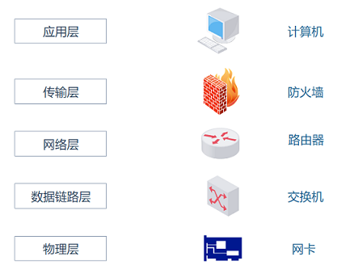
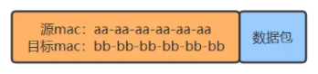
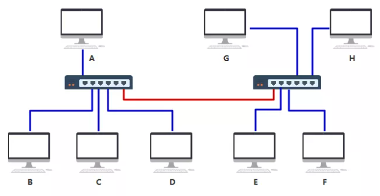
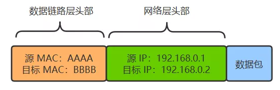
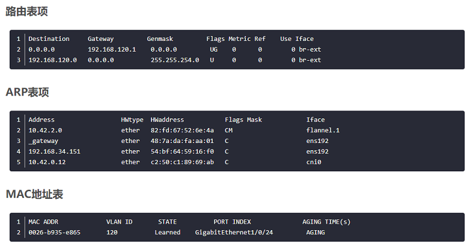
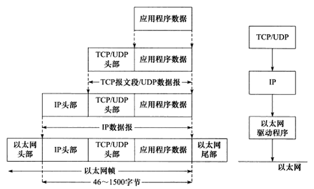
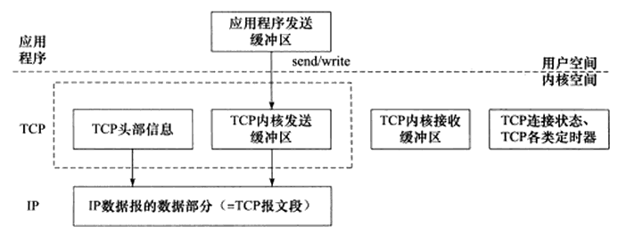
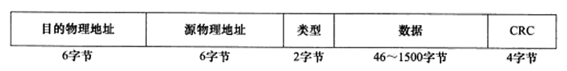
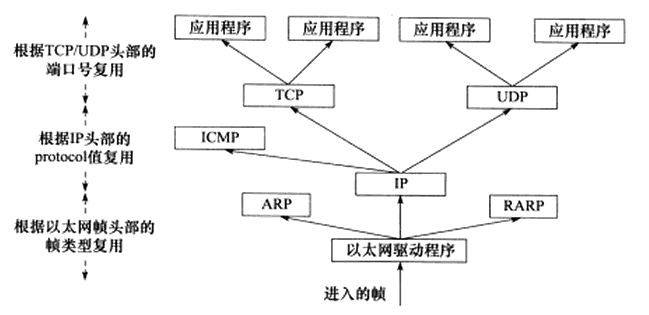

# 网络体系结构

计算机网路体系结构呢，有三种：ISO 七层模型、TCP/IP 四层模型、五层体系结构

ISO 七层模型是国际标准化组织制定的一个用于计算机或通信系统间互联的标准体系。

- 应用层：网络服务与最终用户的一个接口
  - 常见的协议有：HTTP，FTP，SMTP，SNMP，DNS
- 表示层：数据的表示、安全、压缩。确保一个系统的应用层所发送的信息可以被另一个系统的应用层读取
- 会话层：建立、管理、终止会话
- 传输层：提供端到端的消息传递服务
  - 常见的协议有：TCP，FTP
- 网络层：进行逻辑地址寻址，实现不同网络之间的路径选择
  - 常见的协议有：ICMP，IGMP，IP
  - 常见设备：路由器
- 数据链路层：在物理层提供比特流服务的基础上，建立相邻结点之间的数据链路
  - 常见设备：网桥，二层交换机
- 物理层：建立、维护、断开物理连接
  - 常见设备：网线，网卡，集线器，中继器，调制解调器

各层对应的网络协议：

各层对应的网络设备：

# 常用网络设备

## 网卡

任一主机连接网络时，必须要使用网卡。可以是有线网卡，用来连接有线网络，也可以是无线网卡连接 WiFi 网络。每块网卡都有一个唯一的 MAC 地址，也叫做硬件地址或物理地址。

## 集线器

集线器工作在物理层。

交换机仅仅是无脑将电信号转发到所有出口（广播）,其他主机收到信息后，根据头部的目标 MAC 地址信息，判断这个数据包的确是发给自己的，于是便收下，如果不是发给自己的就丢弃。因此，在数据包头部需要有下面的结构：

集线器将信息发送给连接到集线器中的所有电脑，这样既不安全，又不节省网络资源。

## 二层交换机

二层交换机工作在数据链路层。

数据帧中有一个数据位叫做 FCS ，用以校验数据是否正确送达目的地。二层交换机通过检查这个值，将损坏的数据丢弃。

交换机内部维护一张 MAC 地址表，记录着每一个 MAC 地址的设备，连接在其哪一个端口上。数据包到达交换机时，交换机内部通过自己维护的 MAC 地址表，将数据包转发到指定的端口上。通过这样传输方式而组成的小范围的网络，叫做以太网。最开始的时候，MAC 地址表是空的，在收发数据包的过程中逐步建立。二层交换机根据 MAC 地址自学机制判断是否需要转发数据帧。

随着机器数量增多，端口不够用，此时可以将多个交换机连接起来：

上面那根红色的线，最终在 MAC 地址表中要把 ABCDEFGH 这8台机器与相应端口的映射全部记录在表中。

## 路由器

路由器工作在网络层。

路由器的每一个端口，都有独立的 MAC 地址。

路由器是在 OSI 模型的网络层上连接两个网络、并对报文进行转发的设备。二层交换机是根据 MAC 地址进行处理，而路由器 / 三层交换机则是根据 IP 地址进行处理的。 因此 TCP/IP 中网络层的地址就成为了 IP 地址。

路由器可以连接不同的数据链路。比如连接两个以太网，或者连接一个以太网与一个无线网。家庭里面常见的无线路由器也是路由器的一种。

为了划分网络，引入了IP 地址。现在每一台电脑，同时有自己的 MAC 地址，又有自己的 IP 地址，只不过 IP 地址是软件层面上的，可以随时修改，MAC 地址一般是无法修改的。现在两个设备之间传输，除了加上数据链路层的头部之外，还要再增加一个网络层的头部：

如果源 IP 与目的 IP 处于一个子网，直接将数据包通过交换机发出去。如果源 IP 与目的 IP 不处于一个子网，就交给路由器去处理。

判断是否在一个子网：将源 IP 与目的 IP 分别同这个子网掩码进行与运算，相等则是在一个子网，不相等就是在不同子网。

默认网关：就是在设备里配置的一个 IP 地址，以便在发给不同子网的机器时，发给这个 IP 地址。

路由器收到的数据包有目的 IP ，需要转化成从自己的哪个端口出去，此时需要依赖路由表。

如果不清楚 MAC 地址，就需要使用 ARP 协议，把 IP 地址对应的 MAC 地址找到，同时 设备中也会有 arp 缓存表，记录着 IP 与 MAC 地址的对应关系。

**ip 报文经过一个路由器改变哪些字段?**

源和目的的IP地址,源和目的的MAC地址以及TTL值。

**路由器和二层交换机的区别：**

- 工作层次不同：最初的的交换机是工作在数据链路层，而路由器一开始就设计工作在网络层
- 数据转发所依据的对象不同：交换机是利用物理地址或者说 MAC 地址来确定转发数据的目的地址。而路由器则是利用 IP 地址来确定数据转发的地址
- 传统的交换机只能分割冲突域，不能分割广播域；而路由器可以分割广播域：由交换机连接的网段仍属于同一个广播域，广播数据包会在交换机连接的所有网段上传播，在某些情况下会导致通信拥挤和安全漏洞。连接到路由器上的网段会被分配成不同的广播域，广播数据不会穿过路由器
- 路由器提供了防火墙的服务：路由器仅仅转发特定地址的数据包，不传送不支持路由协议的数据包传送和未知目标网络数据包的传送，从而可以防止广播风暴

**小结：**

三张表：

- 交换机中有 MAC 地址表用于映射 MAC 地址和它的端口，通过以太网内各节点之间不断通过交换机通信，不断完善起来的
- 路由器中有路由表用于映射 IP 地址(段)和它的端口，各种路由算法和人工配置逐步完善起来的
- 电脑和路由器中都有 arp 缓存表用于缓存 IP 和 MAC 地址的映射关系，不断通过 arp 协议的请求逐步完善起来的

一次完整的通讯过程：

- 首先 A（192.168.0.1）通过子网掩码（255.255.255.0）计算出自己与 F（192.168.2.2）并不在同一个子网内，于是决定发送给默认网关（192.168.0.254）
- A 通过 ARP 找到默认网关 192.168.0.254 的 MAC 地址
- A 将源 MAC 地址（AAAA）与网关 MAC 地址（ABAB）封装在数据链路层头部，又将源 IP 地址（192.168.0.1）和目的 IP 地址（192.168.2.2）（注意这里千万不要以为填写的是默认网关的 IP 地址，从始至终这个数据包的两个 IP 地址都是不变的，只有 MAC 地址在不断变化）封装在网络层头部，然后发包
- 交换机 1 收到数据包后，发现目标 MAC 地址是 ABAB，转发给路由器1
- 数据包来到了路由器 1，发现其目标 IP 地址是 192.168.2.2，查看其路由表，发现了下一跳的地址是 192.168.100.5
- 此时路由器 1 需要做两件事，第一件是再次匹配路由表，发现匹配到了端口为 2，于是将其封装到数据链路层，最后把包从 2 号口发出去
- 此时路由器 2 收到了数据包，看到其目的地址是 192.168.2.2，查询其路由表，匹配到端口号为 1，准备从 1 号口把数据包送出去
- 此时路由器 2 需要知道 192.168.2.2 的 MAC 地址了，于是查看其 arp 缓存，找到其 MAC 地址为 FFFF，封装在数据链路层头部，并从 1 号端口把包发出去
- 交换机 3 收到了数据包，发现目的 MAC 地址为 FFFF，查询其 MAC 地址表，发现应该从其 6 号端口出去，于是从 6 号端口把数据包发出去
- F 最终收到了数据包！并且发现目的 MAC 地址就是自己，于是收下了这个包

# 数据封装与解封装

## PDU

PDU（Protocol Data Unit）是指对等层次之间传递的数据单位：

- 物理层的 PDU 是数据位 (bit)
- 数据链路层的 PDU 是数据帧 (frame)
- 网络层的 PDU 是数据包 (packet)
- 传输层的 PDU 是数据段 (segment)
- 其他更高层次的PDU是数据（data）

## 封装

应用程序数据在发送到物理网络之前，将沿着协议栈从上到下依次传递，每层协议都将在上层数据的基础上加上自己的头部(尾部)信息，以实现该层的功能，这个过程称为封装。

TCP 报文段封装过程：

以太网帧封装过程：

## 分用

当帧到达目的主机时，将沿着协议族自底向上依次传递，各层协议依次处理帧中本层负责的头部数据，以获取所需的信息，并将最终处理后的帧交给应用程序。这个过程称为分用。

- 以太网帧使用 16 位 的类型字段来标识上层协议

  - 0x0800：IP 数据报

  - 0x0806：ARP 请求或应答报文

  - 0x0835：RARP 请求或应答报文
- IP 数据报头部采用 16 位的协议字段来区分协议
    - 17：UDP 用户数据报 
    - 6：TCP 传输控制 
- TCP 报文段和 UDP 报文段则是通过头部的 16 位的端口号来区分上层应用程序
    - 20：ftp 数据连接
    - 21：ftp 控制连接
    - 22：ssh，scp
    - 53：DNS
    - 23：telnet
    - 80：http
    - 443：https
