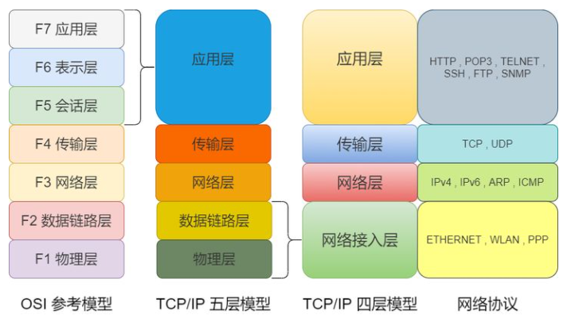

# 计算机体系结构

计算机网路体系结构呢，有三种：ISO 七层模型、TCP/IP 四层模型、五层体系结构

ISO 七层模型是国际标准化组织制定的一个用于计算机或通信系统间互联的标准体系。

- 应用层：网络服务与最终用户的一个接口
  - 常见的协议有：HTTP，FTP，SMTP，SNMP，DNS
- 表示层：数据的表示、安全、压缩。确保一个系统的应用层所发送的信息可以被另一个系统的应用层读取
- 会话层：建立、管理、终止会话
- 传输层：提供端到端的消息传递服务
  - 常见的协议有：TCP，FTP
- 网络层：进行逻辑地址寻址，实现不同网络之间的路径选择
  - 常见的协议有：ICMP，IGMP，IP
  - 常见设备：路由器
- 数据链路层：在物理层提供比特流服务的基础上，建立相邻结点之间的数据链路
  - 常见设备：网桥，二层交换机
- 物理层：建立、维护、断开物理连接
  - 常见设备：网线，网卡，集线器，中继器，调制解调器

各层对应的网络协议：

