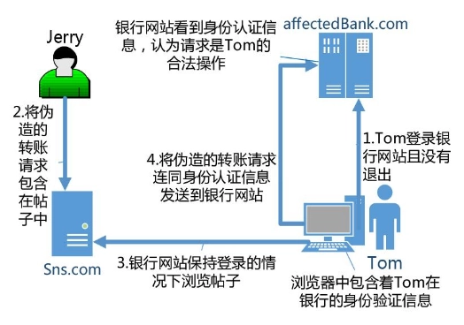
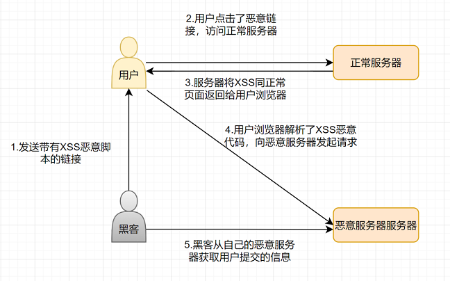

# CSRF 攻击

CSRF，跨站请求伪造（英文全称是Cross-site request forgery），是一种挟制用户在当前已登录的 Web 应用程序上执行非本意的操作的攻击方法。

- Tom 登陆银行，没有退出，浏览器包含了 Tom 在银行的身份认证信息
- 黑客 Jerry 将伪造的转账请求，包含在在帖子
- Tom 在银行网站保持登陆的情况下，浏览帖子
- 将伪造的转账请求连同身份认证信息，发送到银行网站
- 银行网站看到身份认证信息，以为就是 Tom 的合法操作，最后造成 Tom 资金损失

解决 CSRF 攻击：

- 检查 Referer 字段
- 添加校验 token

# DoS、DDoS、DRDoS 攻击

DOS: (Denial of Service)，拒绝服务，一切能引起 DOS 行为的攻击都被称为 DOS 攻击。最常见的 DOS 攻击就有计算机网络宽带攻击**、**连通性攻击。

基本过程：

- 客户端向服务端发送请求链接数据包
- 服务端向客户端发送确认数据包
- 客户端不向服务端发送确认数据包，服务器一直等待来自客户端的确认

DDoS: (Distributed Denial of Service)，分布式拒绝服务。是指处于不同位置的多个攻击者同时向一个或几个目标发动攻击，或者一个攻击者控制了位于不同位置的多台机器并利用这些机器对受害者同时实施攻击。常见的 DDoS 有 SYN Flood、Ping of Death、ACK Flood、UDP Flood 等。

DRDoS: (Distributed Reflection Denial of Service)，分布式反射拒绝服务，该方式靠的是发送大量带有被害者IP地址的数据包给攻击主机，然后攻击主机对IP地址源做出大量回应，从而形成拒绝服务攻击。

# XSS 攻击

XSS，叫跨站脚本攻击（Cross-Site Scripting），因为会与层叠样式表(Cascading Style Sheets, CSS)的缩写混淆，因此有人将跨站脚本攻击缩写为 XSS。它指的是恶意攻击者往 Web 页面里插入恶意html代码，当用户浏览该页之时，嵌入其中 We b里面的 html 代码会被执行，从而达到恶意攻击用户的特殊目的。XSS 攻击一般分三种类型：存储型 、反射型 、DOM 型 XSS。

解决 XSS 攻击问题：

- 对输入进行过滤，过滤标签等，只允许合法值
- HTML 转义
- 对于链接跳转，如`<a href="xxx"` 等，要校验内容，禁止以 script 开头的非法链接
- 限制输入长度

# SQL 注入

SQL 注入是一种代码注入技术，一般被应用于攻击 web 应用程序。它通过在 web 应用接口传入一些特殊参数字符，来欺骗应用服务器，执行恶意的 SQL 命令，以达到非法获取系统信息的目的。它目前是黑客对数据库进行攻击的最常用手段之一。

预防 SQL 注入问题：

- 不要暴露一些不必要的日志或者安全信息，比如避免直接响应一些 sql 异常信息
- 不相信任何外部输入参数，过滤参数中含有的一些数据库关键词关键词
- 适当的权限控制