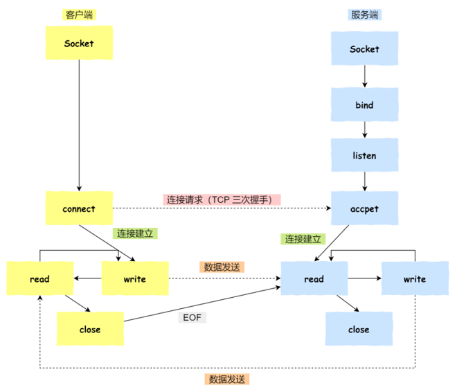

# Socket 编程

## TCP  编程   

- 服务端和客户端初始化 socket ，得到⽂件描述符
- 服务端调⽤ bind ，将绑定在 IP 地址和端⼝
- 服务端调⽤ listen ，进⾏监听
- 服务端调⽤ accept ，等待客户端连接
- 客户端调⽤ connect ，向服务器端的地址和端⼝发起连接请求
- 服务端 accept 返回⽤于传输的 socket 的⽂件描述符
- 客户端调⽤ write 写⼊数据；服务端调⽤ read 读取数据
- 客户端断开连接时，会调⽤ close ，那么服务端 read 读取数据的时候，就会读取到了 EOF ，待处理完数据后，服务端调⽤ close ，表示连接关闭    



需要注意的是：

- 服务端调⽤ accept 时，连接成功了会返回⼀个已完成连接的 socket，后续⽤来传输数据
- 监听的 socket 和真正⽤来传送数据的 socket，是两个 socket，⼀个叫作监听 socket，⼀个叫作已完成连接 socket
- 成功连接建⽴之后，双⽅开始通过 read 和 write 函数来读写数据，就像往⼀个⽂件流⾥⾯写东⻄⼀样

## listen 

Linux 内核中会维护两个队列：  

- 未完成连接队列（SYN 队列）：接收到⼀个 SYN 建⽴连接请求，处于 SYN_RCVD 状态  
- 已完成连接队列（Accpet 队列）：已完成 TCP 三次握⼿过程，处于 ESTABLISHED 状态  


```
int listen (int socketfd, int backlog);
```

- 参数⼀ socketfd 为 socketfd ⽂件描述符
- 参数⼆ backlog，这参数在历史版本有⼀定的变化  

在早期 Linux 内核 backlog 是 SYN 队列⼤⼩，也就是未完成的队列⼤⼩。在 Linux 内核 2.2 之后， backlog 变成 accept 队列，也就是已完成连接建⽴的队列⻓度， 所以现在通常认为 backlog 是 accept 队列。但是上限值是内核参数 somaxconn 的⼤⼩，也就说 accpet 队列⻓度 = min(backlog, somaxconn)。    

## accept  


- 客户端的协议栈向服务器端发送了 SYN 包，并告诉服务器端当前发送序列号 client_isn，客户端进⼊SYN_SENT 状态
- 服务器端的协议栈收到这个包之后，和客户端进⾏ ACK 应答，应答的值为 client_isn+1，表示对 SYN 包 client_isn 的确认，同时服务器也发送⼀个 SYN 包，告诉客户端当前我的发送序列号为 server_isn，服务器端进⼊ SYN_RCVD 状态
- 客户端协议栈收到 ACK 之后，使得应⽤程序从 connect 调⽤返回，表示客户端到服务器端的单向连接建⽴成功，客户端的状态为 ESTABLISHED，同时客户端协议栈也会对服务器端的 SYN 包进⾏应答，应答数据为 server_isn+1
- 应答包到达服务器端后，服务器端协议栈使得 accept 阻塞调⽤返回，这个时候服务器端到客户端的单向连接也建⽴成功，服务器端也进⼊ ESTABLISHED 状态    

可以得知客户端 connect 成功返回是在第⼆次握⼿，服务端 accept 成功返回是在三次握⼿成功之后。  

## close  和 shutdown

客户端主动调⽤了 close ：


- 客户端调⽤ close ，表明客户端没有数据需要发送了，则此时会向服务端发送 FIN 报⽂，进⼊ FIN_WAIT_1 状态  
- 服务端接收到了 FIN 报⽂， TCP 协议栈会为 FIN 包插⼊⼀个⽂件结束符 EOF 到接收缓冲区中，应⽤程序可以通过 read 调⽤来感知这个 FIN 包。这个 EOF 会被放在已排队等候的其他已接收的数据之后，这就意味着服务端需要处理这种异常情况，因为 EOF 表示在该连接上再⽆额外数据到达。此时，服务端进⼊ CLOSE_WAIT 状态 
- 接着，当处理完数据后，⾃然就会读到 EOF ，于是也调⽤ close 关闭它的套接字，这会使得客户端会发出⼀个 FIN 包，之后处于 LAST_ACK 状态  
- 客户端接收到服务端的 FIN 包，并发送 ACK 确认包给服务端，此时客户端将进⼊ TIME_WAIT 状态
- 服务端收到 ACK 确认包后，就进⼊了最后的 CLOSE 状态  
- 客户端经过 2MSL 时间之后，也进⼊ CLOSE 状态  

关闭连接的⽅式通常有两种，分别是 RST 报⽂关闭和 FIN 报⽂关闭：

- 如果进程异常退出了，内核就会发送 RST 报⽂来关闭，它可以不⾛四次挥⼿流程，是⼀个暴⼒关闭连接的⽅式
- 安全关闭连接的⽅式必须通过四次挥⼿，它由进程调⽤ close 和 shutdown 函数发起 FIN 报⽂（shutdown 参数须传⼊ SHUT_WR 或者 SHUT_RDWR 才会发送 FIN）

调⽤了 close 函数意味着完全断开连接， 完全断开不仅指⽆法传输数据，⽽且也不能发送数据。 此时，调⽤了close 函数的⼀⽅的连接叫做孤⼉连接，如果你⽤ netstat -p 命令，会发现连接对应的进程名为空。使⽤ close 函数关闭连接是不优雅的。于是，就出现了⼀种优雅关闭连接的 shutdown 函数， 它可以控制只关闭⼀个⽅向的连接：  

```
int shutdown(int sockfd, int how);
```

第⼆个参数决定断开连接的⽅式，主要有以下三种⽅式：  

- SHUT_RD(0)： 关闭连接的读这个⽅向，如果接收缓冲区有已接收的数据，则将会被丢弃，并且后续再收到新的数据，会对数据进⾏ ACK，然后悄悄地丢弃。也就是说，对端还是会接收到 ACK，在这种情况下根本不知道数据已经被丢弃了    
- SHUT_WR(1)： 关闭连接的写这个⽅向，这就是常被称为半关闭的连接。如果发送缓冲区还有未发送的数据，将被⽴即发送出去，并发送⼀个 FIN 报⽂给对端
- SHUT_RDWR(2)：相当于 SHUT_RD 和 SHUT_WR 操作各⼀次， 关闭套接字的读和写两个⽅向  

## UDP 编程


#  阻塞 IO 与非阻塞 IO

## 阻塞 IO

服务端为了处理客户端的连接和请求的数据，写了如下代码：

```
listenfd = socket();   // 打开一个网络通信端口
bind(listenfd);        // 绑定
listen(listenfd);      // 监听
while(1) {
  connfd = accept(listenfd);  // 阻塞建立连接
  int n = read(connfd, buf);  // 阻塞读数据
  doSomeThing(buf);  // 利用读到的数据做些什么
  close(connfd);     // 关闭连接，循环等待下一个连接
}
```


可以看到，服务端的线程阻塞在了两个地方，一个是 accept 函数，一个是 read 函数。如果再把 read 函数的细节展开，我们会发现其阻塞在了两个阶段：


这就是传统的阻塞 IO。整体流程如下：


所以，如果这个连接的客户端一直不发数据，那么服务端线程将会一直阻塞在 read 函数上不返回，也无法接受其他客户端连接。这肯定是不行的。

## **非阻塞 IO**

为了解决上面的问题，其关键在于改造这个 read 函数。有一种聪明的办法是，每次都创建一个新的进程或线程，去调用 read 函数，并做业务处理：

```
while(1) {
  connfd = accept(listenfd);  // 阻塞建立连接
  pthread_create（doWork);  // 创建一个新的线程
}

void doWork() {
  int n = read(connfd, buf);  // 阻塞读数据
  doSomeThing(buf);  // 利用读到的数据做些什么
  close(connfd);     // 关闭连接，循环等待下一个连接
}
```

这样，当给一个客户端建立好连接后，就可以立刻等待新的客户端连接，而不用阻塞在原客户端的 read 请求上：


不过，这不叫非阻塞 IO，只不过用了多线程的手段使得主线程没有卡在 read 函数上不往下走罢了。操作系统为我们提供的 read 函数仍然是阻塞的。

真正的非阻塞 IO，不能是通过我们用户层的小把戏，而是要恳请操作系统为我们提供一个非阻塞的 read 函数。这个 read 函数的效果是，如果没有数据到达时（到达网卡并拷贝到了内核缓冲区），立刻返回一个错误值（-1），而不是阻塞地等待。操作系统提供了这样的功能，只需要在调用 read 前，将文件描述符设置为非阻塞即可：

```
fcntl(connfd, F_SETFL, O_NONBLOCK);
int n = read(connfd, buffer) != SUCCESS);
```

这样，就需要用户线程循环调用 read，直到返回值不为 -1，再开始处理业务：


非阻塞的 read，指的是在数据到达前，即数据还未到达网卡，或者到达网卡但还没有拷贝到内核缓冲区之前，这个阶段是非阻塞的。当数据已到达内核缓冲区，此时调用 read 函数仍然是阻塞的，需要等待数据从内核缓冲区拷贝到用户缓冲区，才能返回。


## 小结


#  IO 多路复用


但是为每个客户端创建一个线程，服务器端的线程资源很容易被耗光。

当然还有个聪明的办法，我们可以每 accept 一个客户端连接后，将这个文件描述符放到一个数组里：

```
fdlist.add(connfd);
```

然后弄一个新的线程去不断遍历这个数组，调用每一个元素的非阻塞 read 方法：

```
while(1) {
  for(fd <-- fdlist) {
    if(read(fd) != -1) {
      doSomeThing();
    }
  }
}
```

这样就成功用一个线程处理了多个客户端连接。


但这和用多线程去将阻塞 IO 改造成看起来是非阻塞 IO 一样，每次遍历遇到 read 返回 -1 时仍然是一次浪费资源的系统调用。

## select

select 是操作系统提供的系统调用函数，可以把一个文件描述符的数组发给操作系统， 让操作系统去遍历，确定哪个文件描述符可以读写， 然后告知应用程序去处理：


select 系统调用的函数定义如下：

```
int select(int nfds,fd_set *readfds,fd_set *writefds,fd_set *exceptfds,struct timeval *timeout);

//@ nfds:监控的文件描述符集里最大文件描述符加 1
//@ readfds：监控有读数据到达文件描述符集合，传入传出参数
//@ writefds：监控写数据到达文件描述符集合，传入传出参数
//@ exceptfds：监控异常发生达文件描述符集合, 传入传出参数
//@ timeout：定时阻塞监控时间，3 种情况:
    //@  1.NULL，永远等下去
    //@  2.设置timeval，等待固定时间
    //@  3.设置timeval里时间均为0，检查描述字后立即返回，轮询
    
//@ 成功时返回可读+可写+异常 文件描述符的总数
	//@ 如果在超时时间内没有任何文件描述符就绪，将返回 0
	//@ 失败时返回 -1，并设置 errno
	//@ 如果在 select() 期间程序收到信号，则 select() 将立即返回 -1，并设置 EINTR
```

fd_set 相关操作：

```
void FD_ZERO(fd_set *set);   //@ 用来将这个向量的所有元素都设置成 0
void FD_SET(int fd, fd_set *set); //@ 用来把对应套接字 fd 的元素，a[fd] 设置成 1
void FD_CLR(int fd, fd_set *set); //@ 用来把对应套接字 fd 的元素，a[fd] 设置成 0
int  FD_ISSET(int fd, fd_set *set); //@ 对这个向量进行检测，判断出对应套接字的元素 a[fd] 是 0 还是1
```

文件描述符就绪条件：

套接字可读：

- 该套接字接收缓冲区中的数据字节数大于等于套接字接收缓冲区低水位标记 SO_RCVLOWT 的当前大小。对这样的套接字执行读操作不会阻塞并将返回一个大于 0 的值（也就是返回准备好读入的数据，即进程可以从缓冲区中读取数据）
- 该连接的读半部关闭（也就是接收了 FIN 的 TCP 连接）。对这样的套接字的读操作将不阻塞并返回0（因为这时候服务器执行 close() 套接字需要一段时间，而这段时间内，客户端可继续从服务器读取数据，只是读取的是 EOF 而已）
- 该套接字是一个监听套接字且已完成的连接数不为 0。（这样服务端才能执行 accept() 函数，读取客户端发送过来的数据）
- socket 上有未处理的错误，此时我们可以使用 getsockopt 来读取和清除错误

套接字可写：

- 该套接字发送缓冲区中的可用空间字节数大于等于套接字发送缓冲区低水位标记 SO_SNDLOWWAT  的当前大小，并且或者该套接字已连接，或者该套接字不需要连接
- 该连接的写半关闭。对这样的套接字的写操作将产生 SIGPIPE 信号。（就是如果服务器不启动，而客户端启动向服务器发送数据，则服务端向客户端发送RST，并且向客户端写入数据（相当于客户端读取数据），则产生 SIGPIPE 信号，进程强行终止）
- 使用非阻塞式 connect() 的套接字已建立连接，或者 connect() 已经以失败告终
- socket 上有未处理的错误，此时我们可以使用 getsockopt 来读取和清除错误

不过，当 select 函数返回后，用户依然需要遍历刚刚提交给操作系统的 list。只不过，操作系统会将准备就绪的文件描述符做上标识，用户层将不会再有无意义的系统调用开销。

- select 调用需要传入 fd 数组，需要拷贝一份到内核，高并发场景下这样的拷贝消耗的资源是惊人的
- select 在内核层仍然是通过遍历的方式检查文件描述符的就绪状态，是个同步过程，只不过无系统调用切换上下文的开销。（内核层可优化为异步事件通知）
- select 仅仅返回可读文件描述符的个数，具体哪个可读还是要用户自己遍历。（可优化为只返回给用户就绪的文件描述符，无需用户做无效的遍历）

整个 select 的流程图如下：


这种方式，既做到了一个线程处理多个客户端连接（文件描述符），又减少了系统调用的开销（多个文件描述符只有一次 select 的系统调用 + n 次就绪状态的文件描述符的 read 系统调用）。

## poll

poll 也是操作系统提供的系统调用函数：

```
int poll(struct pollfd *fds, nfds_tnfds, int timeout);
 
struct pollfd {
  intfd; /*文件描述符*/
  shortevents; /*监控的事件*/
  shortrevents; /*监控事件中满足条件返回的事件*/
};

//@ 参数 timeout，指定 poll 的超时值，单位是毫秒：
	//@ 如果是一个小于的数，表示在有事件发生之前永远等待
    //@ 如果是 0，表示不阻塞进程，立即返回
    //@ 如果是一个大于的数，表示 poll() 调用方等待指定的毫秒数后返回

//@ 当有错误发生时，poll() 函数的返回值为 -1；如果在指定的时间到达之前没有任何事件发生，则返回 0，否则就返回检测到的事件个数，也就是 "returned events" 中非 0 的描述符个数
```

它和 select 的主要区别是

- 去掉了 select 只能监听 1024 个文件描述符的限制
- poll() 每次检测之后的结果不会修改原来的传入值，而是将结果保留在 revents 字段中，这样就不需要每次检测完都得重置待检测的描述字和感兴趣的事件

events 和 revents：


## epoll

epoll 的改进：

- 内核中保存一份文件描述符集合，无需用户每次都重新传入，只需告诉内核修改的部分即可
- 内核不再通过轮询的方式找到就绪的文件描述符，而是通过异步 IO 事件唤醒
- 内核仅会将有 IO 事件的文件描述符返回给用户，用户也无需遍历整个文件描述符集合

epoll 相关函数集：

```
//@ 创建一个 epoll 句柄
int epoll_create(int size);

//@ 向内核添加、修改或删除要监控的文件描述符
int epoll_ctl(int epfd, int op, int fd, struct epoll_event *event);
//@ op 表示操作选项，可以选择为：
	//@ EPOLL_CTL_ADD： 向 epoll 实例注册文件描述符对应的事件
	//@ EPOLL_CTL_DEL：向 epoll 实例删除文件描述符对应的事件
	//@ EPOLL_CTL_MOD： 修改文件描述符对应的事件
	
/*
    typedef union epoll_data
    {
        void* ptr;		//@ 用来指定与 fd 相关的用户数据。
        int fd;			//@ 指定事件所从属的目标文件描述符。
        uint32_t u32;	//@
        uint64_t u64;	//@
    }epoll_data_t;

    struct epoll_event 
    {
        __uint32_t events;  //@ epoll 事件
        epoll_data_t data;	//@ 用户数据
    };
*/

//@ int epoll_wait(int epfd, struct epoll_event *events, int max events, int timeout);
//@ 函数调用成功返回 0，若返回 -1 表示出错
```


完整流程：


事件类型：

- EPOLLIN：表示对应的文件描述字可以读
- EPOLLOUT：表示对应的文件描述字可以写
- EPOLLRDHUP：表示套接字的一端已经关闭，或者半关闭
- EPOLLHUP：表示对应的文件描述字被挂起
- EPOLLET：设置为 edge-triggered，默认为 level-triggered
- EPOLLONESHOT：只监听一次事件，当监听完这次事件之后，如果还需要继续监听这个socket的话，需要再次把这个 socket 加入到 EPOLL 队列里

两种模式：

LT(level triggered)：

事件触发是缺省的工作方式，并且同时支持 block 和 no-block socket。在这种做法中，内核告诉你一个文件描述符是否就绪了，然后你可以对这个就绪的 fd 进行 IO 操作。如果你不作任何操作，内核还是会继续通知你的，所以，这种模式编程出错误可能性要小一点。传统的 select()/poll() 都是这种模型的代表。

- 优点：当进行socket通信的时候，保证了数据的完整输出，进行IO操作的时候，如果还有数据，就会一直的通知你
- 缺点：由于只要还有数据，内核就会不停的从内核空间转到用户空间，所有占用了大量内核资源，试想一下当有大量数据到来的时候，每次读取一个字节，这样就会不停的进行切换。内核资源的浪费严重。效率来讲也是很低的

ET(edge-triggered)：

边沿触发是高速工作方式，只支持 no-block socket。在这种模式下，当描述符从未就绪变为就绪时，内核通过 epoll() 告诉你。然后它会假设你知道文件描述符已经就绪，并且不会再为那个文件描述符发送更多的就绪通知。请注意，如果一直不对这个 fd 作 IO 操作(从而导致它再次变成未就绪)，内核不会发送更多的通知。

- 优点：每次内核只会通知一次，大大减少了内核资源的浪费，提高效率
- 缺点：不能保证数据的完整。不能及时的取出所有的数据
- 应用场景： 处理大数据。使用 non-block 模式的 socket

## 总结


https://zhuanlan.zhihu.com/p/427512269

https://hewei.blog.csdn.net/article/details/109267352

